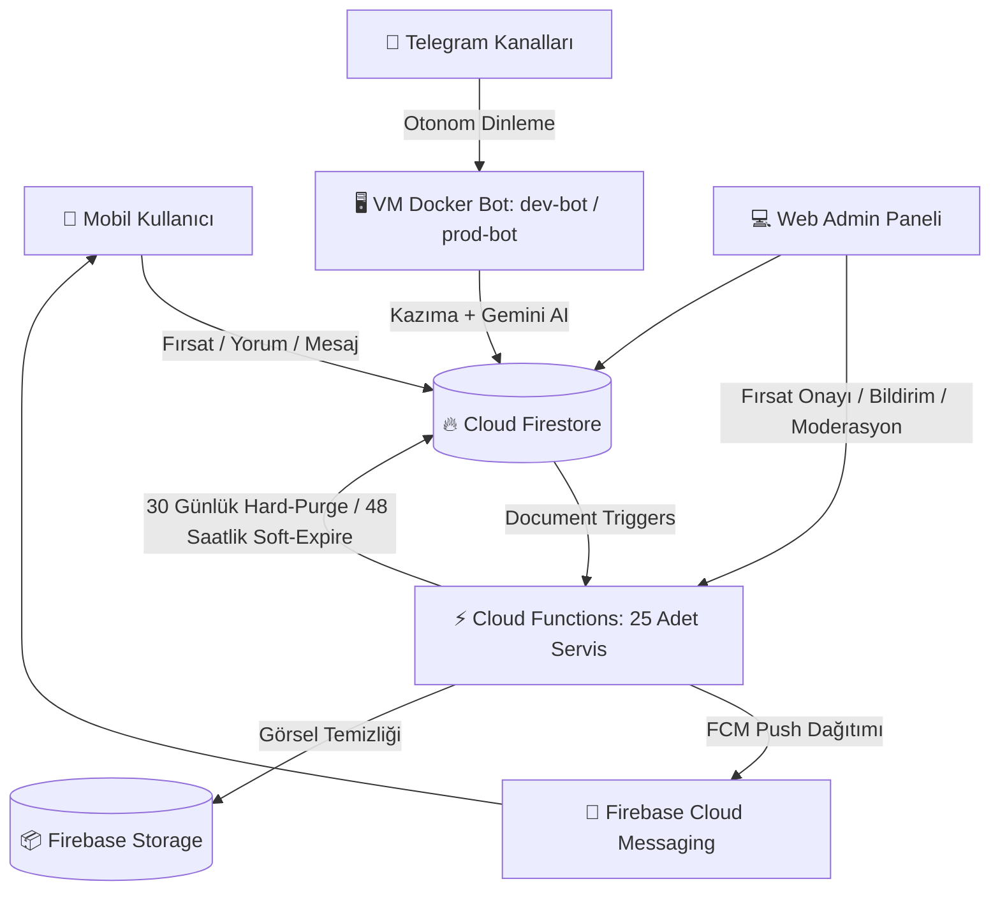

# 🚀 FırsatKolik — Ana Dokümantasyon ve Mimari Bilgi Bankası (Master Knowledge Base)

Bu doküman, **FırsatKolik** platformunun (Mobil İstemci, Otonom Telegram Botu, Firebase Cloud Functions, Firestore Veritabanı, Web Admin Paneli, Çok Kaynaklı Kazıyıcılar, İçerik Moderasyon Motoru ve Google Cloud Altyapısı) tüm teknik mimarisini, iş mantığını (business logic), yasal uyum gereksinimlerini, ortam ve dağıtım kurallarını tek bir çatı altında toplayan **merkezi bilgi bankasıdır**.

Tüm detaylı mimari rehberlere, teknik raporlara ve operasyonel el kitaplarına bu sayfadan doğrudan ulaşabilirsiniz.

---

## 📑 İçindekiler
1. [🌟 Projeye Genel Bakış (Executive Summary)](#1--projeye-genel-bakış-executive-summary)
2. [🛠️ Teknoloji Yığını (Tech Stack & Architecture Ecosystem)](#2-️-teknoloji-yığını-tech-stack--architecture-ecosystem)
3. [🏛️ Sistem Mimarisi, Akışlar ve Temel Servisler](#3-️-sistem-mimarisi-akışlar-ve-temel-servisler)
4. [⚙️ Ortamlar, Güvenlik Kuralları ve Proje Yönetimi (DEV vs PROD Matrix)](#4-️-ortamlar-güvenlik-kuralları-ve-proje-yönetimi-dev-vs-prod-matrix)
5. [🤖 Otonom Telegram Botu ve Web Kazıma Hattı (Scraping Pipeline)](#5--otonom-telegram-botu-ve-web-kazıma-hattı-scraping-pipeline)
6. [🏷️ Kategori Taksonomisi ve Otonom Tespit Motoru](#6-️-kategori-taksonomisi-ve-otonom-tespit-motoru)
7. [🔔 Akıllı Bildirim ve Push Motoru (Notification Subsystem)](#7--akıllı-bildirim-ve-push-motoru-notification-subsystem)
8. [🎟️ Kuponlar ve 📰 Aktüel Kataloglar Modülü](#8-️-kuponlar-ve--aktüel-kataloglar-modülü)
9. [🎨 Mobil Tasarım Sistemi ve Kullanıcı Deneyimi (Design System & Mobile UX)](#9--mobil-tasarım-sistemi-ve-kullanıcı-deneyimi-design-system--mobile-ux)
10. [⚡ Cloud Functions ve Backend Servisleri (25 Fonksiyon)](#10-️-cloud-functions-ve-backend-servisleri-25-fonksiyon)
11. [🚀 Üretim (Production) Süreci, Dağıtım ve Hızlı Komutlar](#11--üretim-production-süreci-dağıtım-ve-hızlı-komutlar)
12. [📂 Eksiksiz Master Dokümantasyon Dizin Haritası](#12--eksiksiz-master-dokümantasyon-dizin-haritası)

---

## 1. 🌟 Projeye Genel Bakış (Executive Summary)

**FırsatKolik**, Türkiye e-ticaret ekosistemindeki en sıcak fırsatları, indirimleri, kupon kodlarını ve süpermarket aktüel broşürlerini tek bir noktada toplayan, topluluk odaklı yeni nesil bir fırsat paylaşım platformudur.

### Temel Sistem Yetenekleri ve Business Kuralları:
* **Çok Kanallı Fırsat Toplama:** Hem mobil uygulama üzerinden kullanıcıların paylaştığı fırsatlar hem de Telegram kanallarını 7/24 dinleyen otonom botlar aracılığıyla beslenen canlı fırsat havuzu.
* **Akıllı Algoritmik Sıralama:** Wilson Score, 12 saatlik yarı ömürlü zaman aşımı (time decay), `-25.0` puanlık FOMO demotion puan cezası ve 45 dakikalık kuluçka algoritmasıyla manipülasyona kapalı anasayfa ve popüler listeleri.
* **Gelişmiş WAF Bypass Motoru:** Cloudflare, Akamai, Datacenter IP blokları ve TLS/JA3 engellerini 5 farklı sunucu ve istemci bypass yöntemiyle aşabilen kazıma motoru.
* **3 Katmanlı Bildirim Motoru:** Kullanıcıları boğmayan, kategori hız limitli (Rate Limiting), sessiz saatli ve tekilleştirmeli (Deduplication) akıllı push bildirim altyapısı.
* **Yasal Ticari Reklam Uyumu:** 1 Ağustos Ticari Reklam Yönetmeliği uyarınca hem mobil hem bot paylaşımlarında otomatik `#tanıtım` etiketleme ve reklam temizleme filtresi (`AdvertisingComplianceService`).
* **Sıfır Maliyetli Bulut Mimarisi:** Google Cloud Free Tier Compute Engine VM (`e2-micro`) üzerinde konteynerize edilmiş ve Cloud Functions ile tamamen serverless çalışan bütçe dostu operasyon.

---

## 2. 🛠️ Teknoloji Yığını (Tech Stack & Architecture Ecosystem)

| Katman | Teknoloji / Kütüphane | Kullanım Alanı ve Görevi |
| :--- | :--- | :--- |
| **Mobil Uygulama (Client)** | **Flutter / Dart (v3.x)** | Android ve iOS için modern, reaktif ve performanslı mobil istemci. |
| **Mobil Güvenlik & Doğrulama** | **Firebase App Check (Play Integrity & Debug)** | Yetkisiz bot ve sahte istemcilerin backend API'lerine erişimini engeller. |
| **Mobil Reklam & Gizlilik** | **Google AdMob & UMP SDK** | KVKK/GDPR uyumlu onay formu ve dinamik test/canlı banner reklam entegrasyonu. |
| **Mobil Hata Takibi** | **Firebase Crashlytics** | Canlı ortamdaki beklenmeyen çökmelerin ve kritik hataların anlık loglanması. |
| **Veritabanı (Database)** | **Google Cloud Firestore (Native Mode)** | Gerçek zamanlı senkronizasyon, atomik sayaçlar (`increment`), bileşik indeksler. |
| **Backend & Trigger'lar** | **Firebase Cloud Functions (Node.js 22)** | 25 adet reaktif Firestore/Auth trigger'ı, zamanlanmış cron görevleri ve güvenli API proxy'leri. |
| **Otonom Bot Servisi** | **Node.js (v22), GramJS (MTProto), Cheerio** | 7/24 Telegram kanallarını dinleyen ve web kazıma yapan otonom bot motoru. |
| **Konteynerizasyon & VM** | **Docker & GCP Compute Engine (`e2-micro`)** | DEV ve PROD botlarını izole portlarda (8081 / 8082) sıfır maliyetle çalıştıran sanal makine. |
| **Dosya & Görsel Depolama** | **Firebase Storage & WebP Pipeline** | Fırsat ve profil görsellerini %90+ sıkıştırma oranıyla sunan global CDN depolama. |
| **Push Bildirimleri** | **Firebase Cloud Messaging (FCM HTTP v1 API)** | Token yönetimi, bildirim kanalları ve arka plan veri paketleri (data-only payload). |
| **Yapay Zeka Servisi** | **Google Gemini API (`gemini-2.0-flash`)** | Telegram mesajlarından ürün başlığı, fiyat ve kategori çıkaran multimodal AI servisi. |
| **Yönetim Paneli** | **Web Admin Panel (Vanilla HTML5/JS/CSS)** | Firebase Hosting üzerinde koşan, dinamik hostname ile DEV/PROD geçişi yapan yönetim konsolu. |

---

## 3. 🏛️ Sistem Mimarisi, Akışlar ve Temel Servisler

Sistem, istemci ve sunucu katmanlarının Firestore üzerinden reaktif olarak haberleştiği olay güdümlü (Event-Driven) bir mimariye sahiptir:



### 📚 İlgili Derinlemesine Mimari Dokümanları:
* 🔗 [Sistem Mimarisi ve Veri Akışları Rehberi](file:///d:/firsatkolik/documentation/mimari-ve-sistem/system_architecture_and_flows.md) — Sıralı diyagramlar, fırsat yaşam döngüsü, bot ve moderasyon akışları.
* 🔗 [Fırsat Gösterim Algoritmaları Rehberi](file:///d:/firsatkolik/documentation/mimari-ve-sistem/firsat_gosterim_algoritmalari_rehberi.md) — Anasayfa, Popüler, Wilson Score ve FOMO ceza formülleri.
* 🔗 [Web Admin Paneli Kapsamlı Mimari ve Operasyon Rehberi](file:///d:/firsatkolik/documentation/mimari-ve-sistem/web_admin_paneli_rehberi.md) — 10 yönetim görünümü, canlı simülatör, bot kontrolü ve moderasyon kuyruğu.
* 🔗 [İçerik Moderasyonu ve Şikayet Sistemi Rehberi](file:///d:/firsatkolik/documentation/mimari-ve-sistem/icerik_moderasyonu_ve_sikayet_sistemi_rehberi.md) — Otomatik küfür engelleme (`ContentModerationService`), şikayet havuzu (`ReportService`) ve cezalandırma.
* 🔗 [Ticari Reklam Yönetmeliği Uyum ve Etiketleme Rehberi](file:///d:/firsatkolik/documentation/mimari-ve-sistem/ticari_reklam_uyum_ve_etiketleme_rehberi.md) — 1 Ağustos reklam düzenlemeleri ve otomatik `#tanıtım` etiketleme motoru.
* 🔗 [Avcı Rozetleri ve Gamification Mimari Rehberi](file:///d:/firsatkolik/documentation/mimari-ve-sistem/avci_rozetleri_ve_gamification_rehberi.md) — 16+ başarım rozeti, kademeli taksonomi, otomatik ödüllendirme ve vitrin unvan mimarisi.
* 🔗 [Mesajlaşma Sistemi Mevcut Durum Raporu](file:///d:/firsatkolik/documentation/mimari-ve-sistem/MESAJLASMA_SISTEMI_MEVCUT_DURUM_RAPORU.md) — Düz koleksiyonlu P2P sohbet ve admin duyuru mimarisi.
* 🔗 [Profil Resmi ve Kullanıcı Rehberi](file:///d:/firsatkolik/documentation/mimari-ve-sistem/profil_resmi_ve_kullanici_rehberi.md) — WebP avatar yükleme ve denormalize kullanıcı senkronizasyonu.
* 🔗 [Veri Paylaşım Algoritması ve Önbellek](file:///d:/firsatkolik/documentation/mimari-ve-sistem/data-share-algorithm.md) — Silinen/süresi dolan fırsatların kullanıcı profillerindeki önbellek yapısı.
* 🔗 [Proje Bilgi Bankası Manifestosu](file:///d:/firsatkolik/documentation/mimari-ve-sistem/project_knowledge_base_manifest.md) — VM, Bot, DB ve ortamların ana manifestosu.

---

## 4. ⚙️ Ortamlar, Güvenlik Kuralları ve Proje Yönetimi (DEV vs PROD Matrix)

FırsatKolik'te Geliştirme (DEV) ve Canlı (PROD) ortamları veri, bot, kimlik doğrulama, reklam, hosting ve güvenlik seviyesinde **tamamen izole edilmiştir**:

| Yapılandırma Bileşeni | Geliştirme Ortamı (DEV) | Canlı Ortam (PROD) |
| :--- | :--- | :--- |
| **Firebase Proje ID** | `sicak-firsatlar-e6eae` | `firsatkolik-prod-e6eae` |
| **GCP Proje Numarası** | `560592268193` | `228657473310` |
| **Android Paket Adı** | `com.sicakfirsatlar.sicak_firsatlar` | `com.firsatkolik.app` |
| **Flutter Build Flavor** | `--flavor dev --dart-define=FLAVOR=dev` | `--flavor prod --dart-define=FLAVOR=prod` |
| **VM Docker Konteyneri** | `dev-bot` (Host Port: `8081` -> `8080`) | `prod-bot` (Host Port: `8082` -> `8080`) |
| **Dinlenen Telegram Kanalı**| `@indirimkaplani` (veya test kanalları) | `@firsatkolik_canli` |
| **Bot Firebase Anahtarı** | `dev_firebase_key.json` | `prod_firebase_key.json` |
| **Web Admin Hosting URL** | `https://sicak-firsatlar-e6eae.web.app/admin/` | `https://firsatkolik-prod-e6eae.web.app/admin/` |
| **AdMob Banner Reklam ID** | `ca-app-pub-3940256099942544/6300978111` *(Test)* | `ca-app-pub-6853997017739651/8758625050` *(Gerçek)* |
| **App Check Sağlayıcısı** | Debug Provider (Debug Token) | Play Integrity API (Google Play Store) |
| **Android Keystore** | Varsayılan Debug Keystore | `android/app/upload-keystore.jks` *(Alias: upload)* |

### 📚 İlgili Ortam ve Güvenlik Dokümanları:
* 🔗 [Firestore ve Storage Güvenlik Kuralları Rehberi](file:///d:/firsatkolik/documentation/backend-ve-altyapi/firestore_ve_storage_guvenlik_kurallari_rehberi.md) — `firestore.rules` ve `storage.rules` erişim politikaları, RBAC ve alan farkı doğrulaması.
* 🔗 [Ortam Yönetimi ve Canlıya Geçiş Kılavuzu](file:///d:/firsatkolik/documentation/backend-ve-altyapi/environment_management_guide.md) — Flavor yapılandırması ve operasyonel komutlar.
* 🔗 [Güncellenmiş Gizli Bilgiler ve Anahtarlar Rehberi](file:///d:/firsatkolik/documentation/backend-ve-altyapi/project_secrets_and_credentials_updated.md) — API anahtarları, oturumlar, keystore ve token envanteri.
* 🔗 [Google Cloud Maliyet Analizi ve Sıfır Maliyet Mimarisi](file:///d:/firsatkolik/documentation/backend-ve-altyapi/google_cloud_cost_analysis.md) — Cloud Run'dan Free Tier VM'e geçiş raporu.

---

## 5. 🤖 Otonom Telegram Botu ve Web Kazıma Hattı (Scraping Pipeline)

Fırsat paylaşımlarındaki en büyük teknik engel olan Cloudflare/Akamai bot korumaları, TLS/JA3 parmak izi kontrolleri ve IP engellemeleri için **5 temel bypass stratejisi** geliştirilmiştir:

```
                            ┌────────────────────────┐
                            │ Gelen Link Analizi     │
                            └───────────┬────────────┘
                                        │
             ┌──────────────────────────┼──────────────────────────┐
             ▼                          ▼                          ▼
   [Google Translate Proxy]     [curl spawnSync (CLI)]      [Microlink Headless API]
   • N11, Vatan, Itopya         • Trendyol (TR Çerezleri)   • Amazon, PttAVM
   • translate.goog Tüneli      • Teknosa, Mavi, HB         • Cloudflare Challenge Aşımı
```

### Temel Kazıma Kuralları:
1. **İndirimsiz Liste Fiyatı (`originalPrice`) ve İndirim Oranı:** JSON-LD `@type: Product`, Redux Store (`reduxStore`) ve DOM seçicileri taranarak `originalPrice` otomatik tespit edilir; `deal.effectiveDiscountRate` ile % indirim rozetleri hesaplanır.
2. **Metadata Zenginleştirme:** Ürünün puanı (`ratingValue`), değerlendirme sayısı (`ratingCount`) ve markası (`brand`) 19 farklı mimari noktada otomatik işlenir.
3. **Temiz Link ve Affiliate Koruması (`cleanUrl`):** Mükerrer fırsatları önlemek için takip/affiliate parametreleri temizlenmiş `cleanUrl` alanı kullanılır; kullanıcının tıklayacağı orijinal link (`url`) komisyon kaybını önlemek için aynen korunur.

### 📚 İlgili Kazıma ve Bot Dokümanları:
* 🔗 [Cloud Run Telegram Bot Scraping Kuralları ve Stratejileri](file:///d:/firsatkolik/documentation/scraping-ve-botlar/bot_scraping_rules_and_strategies.md) — Sunucu tarafı WAF bypass stratejileri ve teşhis yöntemleri.
* 🔗 [Uçtan Uca Scraping Mimarisi ve Doğrulama Akışları](file:///d:/firsatkolik/documentation/scraping-ve-botlar/end_to_end_scraping_architecture.md) — İstemci ve sunucu kazıma karşılaştırması ve VM deploy akışı.
* 🔗 [İndirimsiz Ürün Fiyatı (originalPrice) Entegrasyon Rehberi](file:///d:/firsatkolik/documentation/scraping-ve-botlar/original_price_scraper_integration_guide.md) — Eski fiyat ve % indirim tespiti için 5 aşamalı yol haritası.
* 🔗 [Mağaza Scraper Metadata Entegrasyon Rehberi](file:///d:/firsatkolik/documentation/scraping-ve-botlar/scraper_metadata_integration_guide.md) — Puan, yorum sayısı ve marka verilerinin 19 noktada işlenmesi.
* 🔗 [İstemci Tarafı Mağaza Özel Scraping Kuralları](file:///d:/firsatkolik/documentation/scraping-ve-botlar/scraping_rules_and_strategies.md) — Dart tabanlı kazıyıcılar, Zara MethodChannel ve Gotham API entegrasyonu.

---

## 6. 🏷️ Kategori Taksonomisi ve Otonom Tespit Motoru

Platformda 8 ana kategori (`elektronik`, `moda`, `ev_yasam`, `supermarket`, `kozmetik`, `anne_bebek`, `spor_outdoor`, `diger`) ve bunların altında onlarca alt kategori bulunmaktadır.

### Sınıflandırma Motorunun Özellikleri (`CategoryDetectionService`):
* **Ağırlıklı Puanlama:** Başlık eşleşmeleri `3x`, açıklama eşleşmeleri `1x` ağırlıkla toplanır.
* **Mağaza Yatkınlık Bonusu (Store Affinity):** Gratis/Watsons için `kozmetik`, Mavi/Zara için `moda`, Itopya/Incehesap için `elektronik` kategorilerine `+15/20` taban puan verilir.
* **Negatif Bağlam Cezası:** Örneğin *"Oyun Kolu"* ifadesinde "kol" kelimesinin modaya gitmesini engellemek için `-50` negatif ceza uygulanır.

### 📚 İlgili Kategori Dokümanları:
* 🔗 [Kategori Tespit Motoru ve Anahtar Kelime Rehberi](file:///d:/firsatkolik/documentation/kategoriler-ve-magazalar/kategori_tespit_motoru_ve_anahtar_kelime_rehberi.md) — NLP sınıflandırma mimarisi, ağırlıklandırma ve negatif cezalar.
* 🔗 [Hepsiburada Kategori Taksonomisi](file:///d:/firsatkolik/documentation/kategoriler-ve-magazalar/hepsiburada-kategoriler.md) — E-ticaret kategori ağacı referansı.
* 🔗 [Mağaza DOM Şemaları ve Seçiciler](file:///d:/firsatkolik/documentation/kategoriler-ve-magazalar/stores/) — 17 büyük mağazanın DOM/JSON-LD analiz dosyaları.

---

## 7. 🔔 Akıllı Bildirim ve Push Motoru (Notification Subsystem)

FırsatKolik bildirim sistemi, kullanıcı memnuniyetini en üstte tutmak ve spam algısını engellemek için **3 katmanlı filtreleme mimarisi** ile yönetilir:

```
[ Katman 1: Master Switch (Telefon Bildirimleri) ]
  ├── KAPALI: Tüm alt kanallar gri/kilitli, push gönderilmez (State korunur).
  └── AÇIK: Alt kanallar aktif.
        ├── Katman 2: Kategori / Kelime / Yazar / Topluluk Switch'leri
        └── Katman 3: Hız Limiti (Rate Limiting: Saatte maks 3, Günde maks 8) & Sessiz Saatler (23:00-08:00)
```

### Kritik Bildirim Prensipleri:
* **Deduplication (Tekilleştirme):** Bir fırsat hem anahtar kelime, hem kategori, hem yazarla eşleşirse 3 ayrı push yerine tek bir akıllı push gider (`keyword` > `author` > `category`).
* **Sessiz Saat Muafiyeti:** Yorum yanıtları (`comment_reply`) ve resmi yönetici duyuruları (`admin_message`) sessiz saatlerden etkilenmeden 7/24 anlık iletilir.
* **Data-Only Sohbet Bildirimleri:** Birebir sohbet mesajları `data-only` olarak gönderilir; alıcı aktif sohbet ekranındaysa bildirim sessizce bastırılır.

### 📚 İlgili Bildirim Dokümanları:
* 🔗 [Bildirim Sistemi Mimari ve Referans Kılavuzu](file:///d:/firsatkolik/documentation/bildirimler/NOTIFICATION_SYSTEM_ARCHITECT.md) — Firestore şemaları, FCM HTTP v1 yapılandırması ve hata ayıklama.
* 🔗 [Bildirim ve Push Bildirim Senaryoları Rehberi](file:///d:/firsatkolik/documentation/bildirimler/notification_scenarios.md) — 10 senaryoluk tam matris, kademeli UI kilitleri ve test süitleri.

---

## 8. 🎟️ Kuponlar ve 📰 Aktüel Kataloglar Modülü

### 🎟️ Kuponlar Sistemi (Kupon Radarı & Topluluk):
* **İki Sekmeli Yapı:** Kullanıcıların eklediği "Topluluk Kuponları" ile botların web'den topladığı "Kupon Radarı" sekmeleri.
* **Çok Kaynaklı Kazıyıcı:** DonanımHaber (Ana kaynak), Kuponla.com ve Kuponburada.com sitelerinden otomatik mükerrer kontrolü ile kazınır.
* **Sıcak / Soğuk Oylama ve Otomatik Arşiv:** Kullanıcıların çalıştı/çalışmadı oyları net skorda `-5`'in altına düşerse kupon otomatik olarak `"gecersiz"` işaretlenir.

### 📰 Aktüel Kataloglar Modülü (Süpermarket & Kozmetik Broşürleri):
* **Doğrusal 3 Seviyeli Akış:** Mağazalar Grid'i (`AktuelMagazalarPage`) ➔ Katalog Listesi (`KatalogListesiPage`) ➔ Tam Ekran Broşür İnceleme (`KatalogDetayPage`).
* **Zengin Görüntüleme Deneyimi:** `PageView.builder` ile yatay kaydırma, alt sayfa indikatör noktaları ve `InteractiveViewer` ile çift parmakla yakınlaştırma (Pinch-to-zoom).
* **Akakçe Entegrasyonu ve Dinamik Filtreleme:** Akakçe broşür sayfalarından yüksek çözünürlüklü görseller çekilir; sadece aktif broşürü olan mağazalar arayüzde dinamik listelenir.

### 📚 İlgili Kupon ve Aktüel Dokümanları:
* 🔗 [Kupon Listeleme ve Oylama Sistemi Yol Haritası](file:///d:/firsatkolik/documentation/kuponlar/kupon-new-feature.md) — İki sekmeli mimari, oylama mantığı ve arşivleme algoritması.
* 🔗 [Multi-Source Kupon Scraper Dokümantasyonu](file:///d:/firsatkolik/documentation/kuponlar/multi-source-kupon-scraper.md) — 3 kaynaktan kupon kazıma, deduplication ve zamanlanmış fonksiyonlar.
* 🔗 [Aktüel Kataloglar Modülü Yol Haritası](file:///d:/firsatkolik/documentation/aktuel/aktuel-new-feature.md) — 3 seviyeli doğrusal UX ve Firestore veri modeli.
* 🔗 [Aktüel Broşür Kazıma ve Doğrulama Rehberi](file:///d:/firsatkolik/documentation/aktuel/aktuel-scraper.md) — Akakçe DOM kazıma, mağaza anahtar kelime doğrulaması ve dinamik gizleme.

---

## 9. 🎨 Mobil Tasarım Sistemi ve Kullanıcı Deneyimi (Design System & Mobile UX)

Uygulama, modern, enerjik ve göz yormayan **resmi FırsatKolik Tasarım Dili** üzerine inşa edilmiştir:

* **Çentikli Kapsayıcı (Notched / Fieldset Box):** Form ve içerik grupları üst çizgisinde kendi mini rozet başlığını taşıyan modern çentikli kartlar içine alınır.
* **Canlı Önizleme Vitrini (Hero Live Preview):** Kullanıcı link yapıştırdığında `AnimatedSwitcher` ve `Shimmer` iskelet animasyonlarıyla anında canlanan ürün kartı.
* **Akıllı Arama Motoru (`DealSearchEngine`):** Türkçe normalizasyonlu, çoklu alan taramalı (başlık, açıklama, mağaza, marka, kupon) ve alaka düzeyi puanlamalı (Relevance Scoring) yerel arama.
* **Saf Karanlık Mod:** Donuk gri zeminler yerine saf siyah (`#000000`) sayfa tabanı ve yüksek kontrastlı koyu kartlar (`#121212` / `#1E1E1E`).
* **İnteraktif Spotlight Eğitimi (In-App Tutorial):** İlk kez giriş yapan kullanıcılar için sıfır sürtünmeli (dialogsuz) doğrudan başlayan, 8 kritik özelliği (Radar, Aktüel, Kuponlar, Termometre, Kaydedilenler, Popüler, AI Paylaşım ve Profil) tanıtan pürüzsüz spotlight rehberi.
* **APK Boyut Optimizasyonu:** Fat APK boyutu **72 MB'dan 27 MB'a**, Play Store indirme boyutu (AAB) **~20 MB'a** düşürülmüştür. 41 mağaza logosu WebP formatına çevrilerek asset boyutunda %91 tasarruf sağlanmıştır.
* **Shorebird Canlı Kod Güncelleme (OTA):** Canlıdaki Dart UI ve iş mantığı hatalarını mağaza onayını beklemeden kullanıcının cebinde anında düzeltme stratejisi.

### 📚 İlgili Tasarım ve Mobil Dokümanları:
* 🔗 [İnteraktif Uygulama Turu ve Spotlight Rehberi](file:///d:/firsatkolik/documentation/mobil-ve-ui/in_app_tutorial_ve_spotlight_rehberi.md) — [YENİ] 8 adımlı spotlight keşif matrisi, dikey stabilite kilidi ve durum kalıcılığı mimarisi.
* 🔗 [FırsatKolik Tasarım Sistemi ve Arayüz Standartları Rehberi](file:///d:/firsatkolik/documentation/mobil-ve-ui/DESIGN_SYSTEM_GUIDE.md) — Çentikli kart şablonları, renk paletleri, tipografi ve bileşen kodları.
* 🔗 [APK Boyut Optimizasyonu Referans Kılavuzu](file:///d:/firsatkolik/documentation/mobil-ve-ui/apk_size_optimization_guide.md) — Split-per-abi, WebP dönüşümü ve ProGuard/R8 kuralları.
* 🔗 [Canlı Kod Güncelleme (Code Push / OTA) Stratejileri](file:///d:/firsatkolik/documentation/mobil-ve-ui/flutter_live_code_push_and_hot_reload_strategies.md) — Shorebird, Server-Driven mimari ve In-App Update karşılaştırması.

---

## 10. ⚡ Cloud Functions ve Backend Servisleri (25 Fonksiyon)

Backend tarafında `functions/index.js` dosyasında yer alan **25 adet Cloud Function** 7/24 hizmet vermektedir:

| Kategori | Fonksiyonlar | Tetikleyici Türü | Görevi |
| :--- | :--- | :--- | :--- |
| **Fırsat & Yorum** | `onDealCreated`, `onDealUpdated`, `onCommentCreated` | Firestore Trigger | Anons, puan hesaplama, FOMO ceza puanı, bildirim kuyruğu. |
| **Mesajlaşma & Bildirim** | `onNotificationCreated`, `onUserMessageCreated`, `onAdminMessageCreated` | Firestore Trigger | Merkezi FCM push gönderimi, data-only sohbet iletimi. |
| **Kullanıcı & Güvenlik** | `onUserUpdated`, `onUserDeleted`, `adminDeleteUser` | Firestore & Auth Trigger | Denormalize profil/avatar senkronizasyonu, veri silme. |
| **API & Proxy** | `resolveShortLink`, `analyzeProductProxy`, `sendManualNotification` | HTTPS Request / Callable | Kısa link çözme, Gemini AI proxy'si, manuel bildirim. |
| **Temizlik & Arşiv** | `cleanupExpiredDeals`, `purgeOldDeals`, `cleanupOldImages`, `cleanupInvalidTokens` | Scheduled Cron (GCP) | 48 saatlik soft-expire, 30 günlük hard-purge, çöp dosya temizliği. |
| **Kupon & Katalog** | `scrapeCouponsScheduled`, `scrapeCouponsManual`, `scrapeCatalogsScheduled`, `scrapeCatalogsManual` | Scheduled Cron & Callable | Otomatik ve manuel kupon / katalog kazıma servisleri. |

### 📚 İlgili Backend Dokümanı:
* 🔗 [Cloud Functions ve Backend Servisleri Rehberi](file:///d:/firsatkolik/documentation/backend-ve-altyapi/cloud_functions_rehberi.md) — 25 fonksiyonun tamamının kaynak kod referansları ve somut senaryoları.

---

## 11. 🚀 Üretim (Production) Süreci, Dağıtım ve Hızlı Komutlar

### 📱 Mobil Uygulama (Flutter & Shorebird Code-Push)
```bash
# DEV ortamında kendi cihazında test etme
flutter run -d <cihaz_id> --flavor dev --dart-define=FLAVOR=dev

# 1. Google Play Store İçin İlk Sürümü Derleme (Shorebird Release)
shorebird release android --flavor prod -t lib/main.dart

# 2. Canlıdaki Kullanıcılara Anlık Kod Yaması Gönderme (Shorebird Patch - Mağaza Onaysız)
shorebird patch android --flavor prod -t lib/main.dart
```

*Detaylı Code-Push stratejileri ve CI/CD akışı için: [Flutter Canlı Kod Güncelleme Rehberi](file:///d:/firsatkolik/documentation/mobil-ve-ui/flutter_live_code_push_and_hot_reload_strategies.md)*

### ⚡ Cloud Functions, Güvenlik Kuralları ve Web Admin Deploy
```bash
# DEV Ortamına Dağıtım
firebase use dev
firebase deploy --only functions,firestore,storage,hosting

# PROD (Canlı) Ortamına Dağıtım
firebase use prod
firebase deploy --only functions,firestore,storage,hosting --force
```

### 🤖 Telegram Botunu Sanal Makinede Güncelleme (VM Deploy)
```bash
cd cloud-run-bot

# DEV Botunu Güncelle
python deploy_to_vm.py dev

# PROD Botunu Güncelle
python deploy_to_vm.py prod
```

### 🔍 Sunucu Sağlık ve Log Kontrolü
```bash
# Sağlık Kontrolü
curl http://34.135.181.112:8081/health  # DEV
curl http://34.135.181.112:8082/health  # PROD

# VM İçerisinde Canlı Logları İzleme (SSH)
gcloud compute ssh telegram-bot-server --zone=us-central1-a --project=firsatkolik-prod-e6eae
pm2 logs dev-bot
pm2 logs prod-bot
```

### 📚 İlgili Yayın ve Süreç Dokümanları:
* 🔗 [Android Production Çıkış ve Büyüme Yol Haritası](file:///d:/firsatkolik/documentation/yayin-ve-surec/firsatkolik_production_roadmap.md) — 7 fazlık kapsamlı Google Play yayın el kitabı.
* 🔗 [Production Süreç Takip Dokümanı (Progress Report)](file:///d:/firsatkolik/documentation/yayin-ve-surec/production_progress.md) — Tamamlanan fazlar, Keystore ve kalan Play Console adımları.

---

## 12. 📂 Eksiksiz Master Dokümantasyon Dizin Haritası

Aşağıdaki liste, `documentation/` dizini altındaki **tüm rehberlerin ve teknik raporların** tematik sınıflandırmasını sunmaktadır:

```
documentation/
├── 📄 README.md                                             # Bu ana dokümantasyon indeksi
│
├── 📁 mimari-ve-sistem/                                      # Mimari, Algoritmalar, Moderasyon ve Genel Sistem
│   ├── 📄 project_knowledge_base_manifest.md                 # Ana Proje Bilgi Bankası ve Altyapı Manifestosu
│   ├── 📄 system_architecture_and_flows.md                   # Uçtan Uca Sistem Mimarisi, Akış ve Yaşam Döngüsü
│   ├── 📄 firsat_gosterim_algoritmalari_rehberi.md           # Anasayfa, Popüler, Wilson Score & FOMO Puanlama Formülleri
│   ├── 📄 web_admin_paneli_rehberi.md                        # [YENİ] 10 Modüllü Web Admin Paneli Mimari & Operasyon Rehberi
│   ├── 📄 icerik_moderasyonu_ve_sikayet_sistemi_rehberi.md   # [YENİ] Küfür Engelleme, Şikayet Havuzu & Ban Mekanizması
│   ├── 📄 ticari_reklam_uyum_ve_etiketleme_rehberi.md        # [YENİ] 1 Ağustos Reklam Yönetmeliği ve Otomatik #tanıtım Rehberi
│   ├── 📄 avci_rozetleri_ve_gamification_rehberi.md          # [YENİ] 16+ Avcı Rozeti, Kademeli Gamification & Vitrin Mimarisi
│   ├── 📄 MESAJLASMA_SISTEMI_MEVCUT_DURUM_RAPORU.md          # P2P Birebir Sohbet & Admin Duyuru Mimarisi
│   ├── 📄 profil_resmi_ve_kullanici_rehberi.md               # WebP Avatar Yükleme & Denormalize Veri Senkronizasyonu
│   └── 📄 data-share-algorithm.md                            # Silinen İlanların Kullanıcı Profillerinde Önbelleklenmesi
│
├── 📁 backend-ve-altyapi/                                    # Firebase, Cloud Functions, Güvenlik & Sırlar
│   ├── 📄 cloud_functions_rehberi.md                         # 25 Adet Cloud Function Detaylı Kullanım ve Tetikleme Rehberi
│   ├── 📄 firestore_ve_storage_guvenlik_kurallari_rehberi.md # [YENİ] firestore.rules & storage.rules Güvenlik Mimarisi
│   ├── 📄 environment_management_guide.md                    # DEV vs PROD Ortam Yönetimi ve Flavor El Kitabı
│   ├── 📄 google_cloud_cost_analysis.md                      # GCP Maliyet Analizi ve Free Tier VM Tasarruf Raporu
│   └── 📄 project_secrets_and_credentials_updated.md         # API Anahtarları, Oturumlar, Portlar ve Keystore Envanteri
│
├── 📁 scraping-ve-botlar/                                    # Web Kazıma, Telegram Botu & WAF Bypass
│   ├── 📄 bot_scraping_rules_and_strategies.md               # Sunucu Tarafı WAF (Cloudflare/Akamai) Bypass Stratejileri
│   ├── 📄 end_to_end_scraping_architecture.md                # Uçtan Uca Kazıma Mimarisi ve VM Deploy Süreçleri
│   ├── 📄 original_price_scraper_integration_guide.md        # İndirimsiz Fiyat (originalPrice) ve % İndirim Yol Haritası
│   ├── 📄 scraper_metadata_integration_guide.md              # Rating, Oy Sayısı ve Marka Verisi 19 Nokta Entegrasyonu
│   └── 📄 scraping_rules_and_strategies.md                   # İstemci (Dart) Kazıma Kuralları ve Zara Native Bypass
│
├── 📁 kategoriler-ve-magazalar/                              # Mağaza DOM Şemaları ve Kategori Motoru
│   ├── 📄 kategori_tespit_motoru_ve_anahtar_kelime_rehberi.md# [YENİ] NLP Tabanlı Ağırlıklı Kategori Tespit Motoru
│   ├── 📄 hepsiburada-kategoriler.md                         # Hepsiburada Kategori Taksonomisi
│   └── 📁 stores/                                            # 17 E-Ticaret Mağazasının DOM Seçici Şemaları
│       ├── 📄 amazon.md                                      ├── 📄 beymen.md
│       ├── 📄 defacto.md                                     ├── 📄 hepsiburada.md
│       ├── 📄 idefix.md                                      ├── 📄 incehesap.md
│       ├── 📄 itopya.md                                      ├── 📄 mango.md
│       ├── 📄 mavi.md                                        ├── 📄 mediamarkt.md
│       ├── 📄 n11.md                                         ├── 📄 pazarama.md
│       ├── 📄 pttavm.md                                      ├── 📄 teknosa.md
│       ├── 📄 trendyol.md                                    ├── 📄 vatan.md
│       └── 📄 zara.md
│
├── 📁 bildirimler/                                           # Bildirim Merkezi & Push Altyapısı
│   ├── 📄 NOTIFICATION_SYSTEM_ARCHITECT.md                   # 3 Katmanlı Bildirim Mimarisi, Şemalar & FCM HTTP v1
│   └── 📄 notification_scenarios.md                          # 10 Senaryoluk Bildirim Matrisi ve Otomatik Testler
│
├── 📁 kuponlar/                                              # İndirim Kodları & Kupon Radarı
│   ├── 📄 kupon-feature.md                                   # Kupon Listeleme ve Paylaşım Sistemi İlk Yol Haritası
│   ├── 📄 kupon-new-feature.md                               # İki Sekmeli Kupon Radarı, Sıcak/Soğuk Oylama ve Arşiv
│   └── 📄 multi-source-kupon-scraper.md                      # 3 Kaynaklı (DH, Kuponla, Kuponburada) Kupon Kazıyıcı
│
├── 📁 aktuel/                                                # Süpermarket & Kozmetik Katalogları
│   ├── 📄 aktuel-new-feature.md                              # Aktüel Kataloglar 3 Seviyeli Doğrusal UX Yol Haritası
│   ├── 📄 aktuel-scraper.md                                  # Akakçe Broşür Kazıma, Doğrulama ve Dinamik Listeleme
│   └── 📁 logs/                                              # 200 Canlı Ürün Test Linki Veri Tabanı
│
├── 📁 mobil-ve-ui/                                           # Mobil Tasarım, UX & Optimizasyon
│   ├── 📄 in_app_tutorial_ve_spotlight_rehberi.md            # [YENİ] 8 Adımlı İnteraktif Spotlight Rehberi & Dikey Stabilite Mimarisi
│   ├── 📄 DESIGN_SYSTEM_GUIDE.md                             # Resmi FırsatKolik Tasarım Sistemi (Notched Cards, Colors)
│   ├── 📄 apk_size_optimization_guide.md                     # APK Boyut Optimizasyonu (72MB -> 27MB) ve WebP Dönüşümü
│   └── 📄 flutter_live_code_push_and_hot_reload_strategies.md# Shorebird OTA Code Push & Sunucu Güdümlü Mimari Analizi
│
└── 📁 yayin-ve-surec/                                        # Google Play Store Yayın & İlerleme
    ├── 📄 firsatkolik_production_roadmap.md                  # 7 Fazlık Google Play Production Çıkış ve Büyüme Rehberi
    └── 📄 production_progress.md                             # Canlıya Geçiş Süreç Takip ve Tamamlanan Fazlar Raporu
```

---
*FırsatKolik Master Dokümantasyon Sistemi — Son Güncelleme: 2026*
