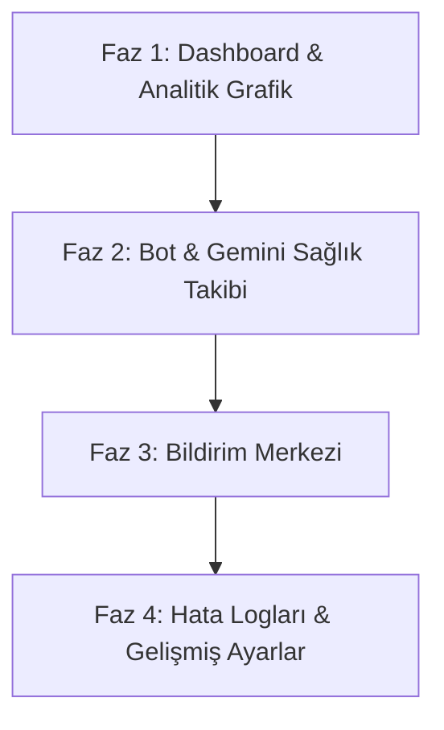

# 🗺️ FırsatKolik Yönetici Paneli Yol Haritası (Admin Panel Roadmap)

Bu doküman, FırsatKolik uygulamasının admin paneline eklenecek yeni özelliklerin beyin fırtınası, yapılabilirlik analizi, tahmini işletme maliyetleri ve fazlar halinde uygulanma planını içermektedir.

---

## 🧠 Beyin Fırtınası ve Fizibilite Analizi

Uygulamanın uzun vadede sürdürülebilir, düşük maliyetli ve yüksek performanslı kalabilmesi için talep edilen özellikler analiz edilmiş ve sınıflandırılmıştır.

### 1. Genel Bakış (Dashboard) & Metrik Kartları
*   **Belirgin Ortam Rozeti (Environment Badge):** Yöneticinin o anda DEV (Geliştirme) veya PROD (Üretim/Canlı) veritabanında çalıştığını gösteren, parlayan renkli bir arayüz durum rozetidir. Yanlışlıkla canlı ortam verilerini değiştirmeyi engeller. Sıfır maliyetlidir ve ilk aşamada (Faz 1) eklenmesi operasyonel güvenlik için kritiktir.
*   **Toplam Kullanıcı Sayısı:** `users` koleksiyonundaki toplam belge sayısıdır. Her yüklemede tüm belgeleri saymak yerine Firestore `count()` sorgusu kullanılacaktır. Firestore `count()`, her 1000 belge için 1 read maliyeti yazar. Bu işlem dashboard her açıldığında yapılacağı için maliyeti son derece düşüktür.
*   **Bugün Kaydolan Yeni Kullanıcı Sayısı:** `users` koleksiyonundaki `createdAt` değeri bugün olan kullanıcıların adedidir. Firestore `count()` sorgusu ile filtrelenerek tamamen ücretsiz ve çok hızlı şekilde çekilebilir.
*   **Bugünkü Aktif Kullanıcı Sayısı (DAU):** Gerçek zamanlı aktif kullanıcı takibi için her kullanıcının günlük olarak veritabanına yazması gerekir. Bu durum Firestore yazma limitlerini zorlayabilir ve maliyet oluşturabilir.
    *   *Öneri (Düşük Maliyetli):* Bu metrik ilk fazlarda ertelenmeli veya Firebase Analytics API entegrasyonu ile ücretsiz olarak takip edilmelidir.
*   **Bugün Gelen / Onaylanan / Reddedilen Fırsat Sayıları:** `createdAt` alanı bugünün tarihi olan fırsatların durumlarına (`isApproved` durumları) göre filtrelenerek sayılmasıdır. Reddedilen fırsat sayısını görmek için, fırsatları silmek yerine durumunu `status: 'rejected'` veya `isRejected: true` olarak güncellemek gerekir. Bu hem istatistik tutmayı sağlar hem de veriyi korur.
*   **Bugün Yazılan Yorum Sayısı:** Firestore'daki subcollection `comments` grubu içinde `createdAt` tarihi bugün olan belgelerin sayılmasıdır (Firestore count sorgusu ile düşük maliyetli). Topluluk etkileşim seviyesini anlık gösterir.
*   **Ortalama Fırsat Onay Süresi:** Fırsatın sisteme giriş zamanı (`createdAt`) ile onaylanma zamanı (`approvedAt`) arasındaki farktır. Bugün onaylanan fırsatlar üzerinden hesaplanacak bu metrik, moderasyon hızını ölçmeyi sağlar ve ekstra veritabanı yazma maliyeti oluşturmaz.
*   **Bugün Gönderilen Bildirim Sayısı & Trend Grafiği:** Cloud Functions üzerinden giden bildirim adetlerini tek bir günlük istatistik belgesine (`stats/notifications/{yyyy-MM-dd}`) yazarak tamamen ücretsiz takip edebiliriz. Son 7 günün bu istatistik belgelerini sorgulayarak panelde **Bildirim Gönderim Trend Grafiği (Son 7 Gün)** çizebiliriz. Maliyeti son derece düşüktür (günde sadece 7 read).
*   **Telegram Bot Durumu (Heartbeat & Günlük Sayaçlar & Acil Durum Anahtarı):** Botun aktiflik takibi için bot, her 5 dakikada bir Firestore'daki `settings/telegramBot` belgesindeki `lastHeartbeatAt` zaman damgasını günceller.
    *   *Sıfır Maliyetli Sayaçlar:* Bot, Cloud Run üzerinde sürekli ayakta kalan bir süreç olduğundan, o gün yakaladığı toplam mesaj, onaylanan fırsat, duplicate atlanan mesaj ve hata sayılarını kendi belleğinde (in-memory) tutabilir. Bu sayaçları zaten yazılacak olan heartbeat belgesinin içerisine ekler. Ekstra hiçbir Firestore yazma maliyeti oluşmadan botun günlük istatistikleri ve uptime bilgisi izlenebilir.
    *   *Acil Durum Durdurma Anahtarı (Bot Aktif/Pasif):* Ayarlar sayfasından yönetilen `botEnabled: true/false` ayarı ile botun mesajları işlemesi anlık durdurulabilir. Bot her yeni mesajda bu ayarı kontrol eder. Sıfır maliyetlidir.
*   **Gemini API Durumu (Maliyet & Hata Sayaçları):** Gemini Proxy fonksiyonu her tetiklendiğinde `settings/geminiStatus` belgesini günceller. `FieldValue.increment` kullanılarak günlük Gemini başarı/hata sayıları, JSON ayrıştırma hataları ve token kullanımına bağlı günlük tahmini Gemini maliyeti tek bir Firestore yazmasıyla güncellenir.
*   **Tahmini Maliyet Takibi:** Gemini token kullanımı ve Firebase işlem sayılarına dayalı matematiksel bir katsayı ile tarayıcı tarafında otomatik hesaplanır. GCP faturalandırma API'lerine bağlanmaya gerek kalmadan sıfır maliyetle çalışır.
*   **Son Hatalar (System Error Logs):** Bot, Cloud Functions ve Admin panelinde oluşan hataları tek bir `systemErrors` koleksiyonuna yazar. Admin bu hataları panelden anlık izleyebilir.

### 2. Kullanıcı & Etkileşim Analitiği
*   **Tıklama ve Görüntüleme Sayıları:** Mobil uygulamadan her tıklamada veya sayfa görüntülemede Firestore'a yazma yapmak (Örn: `viewCount` veya `clickCount` alanını artırmak) yüksek trafikli zamanlarda **yüksek veritabanı yazma maliyeti** oluşturur.
*   *Öneri (Düşük Maliyetli Analitik):* Firestore'da ekstra yazma maliyetine girmemek için mevcut veritabanı alanlarından yararlanacağız:
    *   **Kategori Bazlı Fırsat Dağılımı Grafiği:** Panelde listelenen aktif fırsatlar tarayıcı tarafında (client-side) kategorilerine göre gruplanarak Chart.js ile daire grafik (Pie/Donut) şeklinde tamamen ücretsiz çizilir.
    *   **En Çok Beğenilen Fırsatlar:** Mevcut `hotVotes` / `coldVotes` oranına göre sıralama.
    *   **En Çok Tartışılan Fırsatlar:** Mevcut `commentCount` değerine göre sıralama.
    *   **En Aktif Üyeler Liderlik Tablosu (Gamification):** Kullanıcıların kazandığı toplam puanlara (`points`) veya fırsat sayılarına göre en aktif ilk 5 kullanıcının Dashboard analitik bölümünde şık bir kartta sıralanması. Sıfır maliyetlidir.
    *   Bu yöntem ekstra hiçbir Firestore yazma ücreti oluşturmaz.

### 3. Fırsatlar & Bildirim Yönetim Paneli
*   **Fırsat Listesi Gelişmiş Filtreleri (Kategori ve Kaynak):** Fırsatlar sekmesindeki listeye "Kategori" ve "Kaynak (Telegram Bot Kanalı / Kullanıcı)" filtre dropdown'larının eklenmesi. Veri tarayıcıda hazır olduğu için sıfır maliyetle anlık filtreleme sağlar.
*   **"Linki Test Et" Hızlı Butonu:** Fırsat onay/düzenleme modalındaki ürün linkinin yanına yerleştirilen ve URL'i yeni bir sekmede açarak indirim durumunu, kuponun çalışıp çalışmadığını anında test etmeyi sağlayan buton (Hatalı/süresi geçmiş paylaşımları önlemek için sıfır maliyetli).
*   **Manuel FCM Test Bildirimi:** Adminlerin panel üzerinden anlık duyuru veya test bildirimi gönderebilmesini sağlar. FCM API'leri tamamen ücretsizdir.
*   **Geçersiz FCM Token'larını Temizleme:** Bildirim gönderimi sırasında hata dönen geçersiz jetonlar, admin panelinden tek tuşla tetiklenen bir Cloud Function temizlik scripti ile temizlenir. Bu sayede veritabanı temiz tutulur ve bildirim gönderim hızları artar.

### 4. Gelişmiş Ayarlar, Teknik Durum & Loglar
*   Cloud Run ve Cloud Functions servislerinin CPU ve Memory değerlerini admin paneline taşımak gereksiz API entegrasyonu ve güvenlik açığı yaratır. Geliştirici bu detayları GCP Console üzerinden izlemelidir.
*   Bunun yerine admin panelinde **Hatalar ve Loglar** sekmesi oluşturularak `systemErrors` koleksiyonu filtrelenecektir. Bu sayede hata alan bot veya API'ler tek ekranda izlenebilir.
*   **Hata Kırılımları ve Filtreleri:** Loglar listelenirken hatalar `Telegram`, `Gemini` ve `Web Admin` olarak kaynaklarına göre etiketlenecek ve filtrelenebilecektir.
*   **Çözülmemiş Hatalar & En Hatalı Servis Kartı:** Hatalar sayfasında `status == 'unresolved'` (çözülmemiş) hata sayısını ve en çok hata üreten servisi gösteren iki basit metrik kartı eklenerek teknik izleme kolaylaştırılır.
*   **Dinamik Telegram Kanal Yönetimi:** Botun dinleyeceği Telegram kanalları bot kodunda hardcoded olarak tutulmak yerine Firestore `settings/telegramBot` altındaki `monitoredChannels` dizisinden okunur. Admin panelindeki ayarlar sayfasından bu kanallar dinamik olarak yönetilebilir.
*   **Maksimum Günlük Bildirim Limiti (Spam Kontrolü):** Otomatik bildirimlerin kullanıcıları spam'lemesini önlemek için günde en fazla kaç otomatik push bildirimi gönderilebileceğini belirleyen ve `settings/app` altında tutulan limittir.
*   **Admin Yetki Yönetimi (Yönetici Ekle/Kaldır):** Kullanıcı detay modalı üzerinden veya Ayarlar sekmesindeki bir admin listesinden herhangi bir üyeye tek tıkla `isAdmin: true`/`false` yetkisi verilmesi. Sıfır maliyetlidir.
*   **⚠️ Kategori Yönetiminin (CRUD) Ertelenmesi Gerekçesi:** Orijinal plandaki "Kategori CRUD Yönetimi" talebi analiz edilmiştir. Flutter mobil uygulamasındaki kategori şeması `lib/models/category.dart` dosyasında tamamen statik bir liste (`static const List<Category> categories`) olarak kurgulanmıştır. Dinamik kategori CRUD yapısının kurulması, mobil uygulamanın tüm kategori mimarisini değiştireceğinden bu özellik yol haritasından **bilinçli olarak elenmiştir**.

---

## 💸 Maliyet Matrisi (Cost Matrix)

| Özellik | Maliyet Seviyesi | Aylık Ekstra Firestore/API Maliyeti | Açıklama |
|---|---|---|---|
| **Belirgin Ortam Rozeti** | 🟢 Sıfır Maliyet | $0.00 | CSS ve tarayıcı url kontrolü ile dinamik oluşturulur. |
| **Telegram Bot Heartbeat & Sayaçlar** | 🟢 Çok Düşük | < $0.01 (Aylık ~8,600 yazma) | Bot 5 dakikada bir durum belgesini günceller. Sayaçlar bu belgenin içinde sıfır maliyetle gider. |
| **Telegram Bot Acil Durdurma Anahtarı**| 🟢 Sıfır Maliyet | $0.00 | Durum belgesine `botEnabled` alanı eklenerek sorgulanır. |
| **Gemini Status Tracker & Sayaçlar** | 🟢 Çok Düşük | < $0.01 (Fırsat başına 1 yazma) | Gemini analiz proxy'si her çalıştığında durum belgesini günceller. Hata ve maliyetler buraya yansıtılır. |
| **Sistem Hata Logları (`systemErrors`)** | 🟢 Çok Düşük | Sadece hata anında yazma maliyeti | Hata yoksa veritabanı maliyeti sıfırdır. |
| **Çözülmemiş Hata & Servis Kartı** | 🟢 Sıfır Maliyet | $0.00 | Mevcut hata sorgusu içinden süzülerek sayılır. |
| **İnteraktif Analitik (Mevcut Veri)** | 🟢 Sıfır Maliyet | $0.00 (Mevcut dizinlerden okuma) | `hotVotes` ve `commentCount` gibi alanlar istemci tarafında sıralanır. |
| **En Aktif Üyeler Liderlik Kartı** | 🟢 Sıfır Maliyet | $0.00 (Mevcut kullanıcı okumasından) | En yüksek puanlı 5 kullanıcı listelenir. |
| **Kategori Dağılım Grafiği** | 🟢 Sıfır Maliyet | $0.00 | Tarayıcı tarafında veri gruplama ile çizilir. |
| **Fırsat Listesi Gelişmiş Filtreleri** | 🟢 Sıfır Maliyet | $0.00 | Tarayıcı tarafında select kutuları ile süzme yapılır. |
| **"Linki Test Et" Butonu** | 🟢 Sıfır Maliyet | $0.00 | Yeni sekme açma linki olarak çalışır. |
| **Yeni Kullanıcı Sayısı (Sorgu)** | 🟢 Çok Düşük | Firestore `count()` maliyeti | Günde birkaç kez çalışır, maliyeti ihmal edilebilir. |
| **Bugün Yazılan Yorum Sayısı** | 🟢 Çok Düşük | Firestore `count()` maliyeti | Günlük yorum etkileşim adetlerini sayar. |
| **Manuel FCM Test Bildirimi** | 🟢 Çok Düşük | FCM ücretsizdir | Admin bildirim attığında sadece 1 Cloud Function tetiklenir. |
| **Bildirim Trend Grafiği (7 Gün)** | 🟢 Çok Düşük | Günde 7 Firestore okuması | Günlük stats belgelerinden veri çekilerek çizilir. |
| **Dinamik Kanal Yönetimi** | 🟢 Sıfır Maliyet | $0.00 | Botun dinamik başlamasını sağlar, ek sunucu yükü oluşturmaz. |
| **Admin Yetki Yönetimi** | 🟢 Sıfır Maliyet | Fırsat başına 1 yazma | Firestore kullanıcısının `isAdmin` bayrağı güncellenir. |
| **Geçersiz Token Temizliği** | 🟢 Çok Düşük | Sadece silme operasyon maliyeti | Çöp verileri temizleyerek uzun vadede tasarruf sağlar. |
| **Tıklama/Görüntüleme Sayacı (Firestore)** | 🔴 Yüksek | **$10 - $100+** (Kullanıcı etkileşimine bağlı) | Her tıklamada Firestore yazması yapılacağı için faturaları şişirir. **(Ertelenmesi Önerilir)** |
| **GCP CPU / Memory Canlı Grafik** | 🟡 Orta-Yüksek | Geliştirme ve Güvenlik Maliyeti | GCP API entegrasyonu ve IAM proxy kurulumu gerektirir. **(Elenmesi Önerilir)** |

---

## 🗺️ Aşama Aşama Uygulama Planı (Phased Roadmap)

Maliyetleri minimize etmek ve en hızlı şekilde çalışan özellikler sunmak adına yol haritası **4 Faza** ayrılmıştır.

---

### 📊 FAZ 1 — Genel Bakış (Dashboard) & Arayüz Genişletmesi
Bu fazda, admin panelinin ana sayfası yeniden tasarlanacak ve Tailwind CSS tabanlı premium bir Genel Bakış ekranı eklenecektir.

*   **Yapılacak İşler:**
    1.  Sidebar'a gerçek bir **Dashboard** sekmesi eklenmesi. Mevcut "Fırsatlar" sekmesi ile "Dashboard" birbirinden ayrılacaktır (`#dashboardView` ve `#dealsView`).
    2.  Arayüze (Sidebar üstü veya sağ üst köşe) parlayan renkli **Ortam Rozeti** eklenmesi (`window.location.hostname` kontrolü ile `PROD` veya `DEV` yazar).
    3.  Ana ekrana premium sayısal kartların yerleştirilmesi:
        *   *Toplam Kullanıcı Sayısı* (`users` count)
        *   *Bugün Kaydolan Yeni Kullanıcı Sayısı* (createdAt filtresi ile)
        *   *Bugün Gelen Fırsat Sayısı*
        *   *Bugün Onaylanan Fırsat Sayısı*
        *   *Bugün Reddedilen Fırsat Sayısı*
        *   *Bugün Yazılan Yorum Sayısı* (comments count)
        *   *Onay Bekleyenler* (Firestore real-time)
        *   *Ortalama Fırsat Onay Süresi* (Bugün onaylananlar üzerinden)
        *   *Aktif Telegram Bot Sayısı*
    4.  Arayüze **Chart.js** veya **ApexCharts** entegre edilmesi.
    5.  Grafiklerin ve Tabloların oluşturulması:
        *   *Son 7 günün fırsat giriş grafiği (Bar grafik)*
        *   *Kategori bazlı fırsat dağılımı (Dairesel grafik - Pie/Donut)* (Client-side)
        *   *En Aktif 5 Üye Liderlik Tablosu Kartı* (Kullanıcı puanlarına göre sıralı liderlik listesi)
    6.  Firestore'daki mevcut veriler kullanılarak **Etkileşim Analitiği Tablosu** oluşturulması:
        *   *En Çok Beğenilen 5 Fırsat* (Beğeni oranına göre sıralı)
        *   *En Çok Yorum Alan 5 Fırsat*
    7.  Fırsatlar sayfasındaki listeye **Kategori** ve **Kaynak** filtre select kutularının eklenmesi ve istemci tarafında süzme mantığının kurulması.
    8.  Fırsat detay modalında URL input'unun yanına **"Linki Test Et"** hızlı yönlendirme butonunun eklenmesi.
*   **Teknik Gereksinimler:**
    *   [index.html](file:///d:/firsatkolik/web/admin/index.html) içerisine `#dashboardView` katmanının eklenmesi.
    *   Chart.js kütüphanesinin CDN ile projeye dahil edilmesi.
    *   [app.js](file:///d:/firsatkolik/web/admin/app.js) içerisinde `loadDashboardData()` ve grafik çizim fonksiyonlarının yazılması.

---

### 🤖 FAZ 2 — Bot & Gemini Sağlık Takibi (Heartbeat & Sayaçlar)
Bu fazda Telegram Botu ve Gemini analiz sisteminin canlı olup olmadığı ve günlük istatistikleri Firestore üzerinden takip edilebilir hale getirilecektir.

*   **Yapılacak İşler:**
    1.  Telegram Bot'a (`telegram_bot.js` veya ilgili bot ana dosyası) her 5 dakikada bir Firestore `settings/telegramBot` belgesini güncelleyen bir `sendHeartbeat()` fonksiyonu eklenmesi.
        *   *Yazılacak veriler:* `lastHeartbeatAt` (timestamp), `status: 'online'`, `environment` (dev/prod), `lastMessageTime`, **günlük yakalanan toplam mesaj**, **fırsata dönüştürülen fırsat**, **duplicate atlanan** ve **hata sayıları** (in-memory tutulan sayaçlardan).
    2.  Gemini Proxy Cloud Function'ına (`analyzeProductProxy`) her başarılı/başarısız analizde `settings/geminiStatus` belgesini güncelleyen ve `FieldValue.increment` ile **günlük istek, hata, JSON ayrıştırma hata sayılarını ve tahmini Gemini API maliyetini** güncelleyen adımların eklenmesi.
    3.  Admin panelinde **Telegram Bot Durumu** ve **Yapay Zeka Durumu** widget'larının dashboard ekranına yerleştirilmesi.
    4.  Heartbeat zamanını kontrol edip botun "Çevrimdışı" olup olmadığını kırmızı/yeşil rozetle gösteren ve botun günlük çalışma sayaçlarını (duplicate, hata, başarı) listeleyen yapının kurulması.
    5.  Ayarlar sekmesine **Telegram Bot Acil Durdurma Switch Butonu** eklenmesi (Firestore `settings/telegramBot` altındaki `botEnabled` değerini günceller).
*   **Teknik Gereksinimler:**
    *   Firestore'da `settings/telegramBot` ve `settings/geminiStatus` şemalarının belirlenmesi.
    *   Bot servisinin başlatılırken ve düzenli aralıklarla (heartbeat loop) Firestore'a yazması.
    *   [app.js](file:///d:/firsatkolik/web/admin/app.js) içinde bu iki durum belgesinin anlık dinlenmesi (`onSnapshot`).

---

### 🔔 FAZ 3 — Bildirim Merkezi (Notification Center) & Test Gönderimi
Bu fazda yöneticiler, panel üzerinden tüm kullanıcılara veya belirli test kullanıcılarına manuel push bildirimleri gönderebilecek, token temizliğini yapabilecek ve bildirim grafiklerini izleyebilecektir.

*   **Yapılacak İşler:**
    1.  Admin panelinde yeni bir **Bildirimler** sekmesi ve arayüzü (`#notificationsView`) tasarlanması.
    2.  Manuel bildirim formu eklenmesi:
        *   *Bildirim Başlığı*
        *   *Bildirim Gövdesi (Mesaj)*
        *   *Görsel URL (Opsiyonel)*
        *   *Hedef Türü:* Tüm Kullanıcılar (`all` topic) / Belirli Kullanıcı (Kullanıcı UID'si veya FCM Token)
    3.  Arka planda manuel bildirim göndermeyi sağlayan ve FCM Admin SDK'sını kullanan yeni bir Cloud Function (`sendManualNotification`) veya mevcut bildirim yapısının admin panelinden tetiklenmesi.
    4.  FCM bildirim loglarını tutan basit bir `notificationLogs` Firestore koleksiyonu oluşturulması ve gönderilen son 10 bildirimin panelde listelenmesi.
    5.  **Bildirim Gönderim Trend Grafiği (Son 7 Gün):** Günlük bildirim sayılarını kaydeden stats belgelerinden veri çekilerek Chart.js üzerinden çizgi grafik çizilmesi.
    6.  **"Geçersiz Token'ları Temizle"** butonu eklenmesi. Bu buton, FCM tarafında hata vermiş olan kullanılmayan eski bildirim token'larını veritabanından toplu silen temizlik Cloud Function'ını tetikler.
*   **Teknik Gereksinimler:**
    *   [index.html](file:///d:/firsatkolik/web/admin/index.html) içerisine `#notificationsView` katmanının ve form yapısının eklenmesi.
    *   Firebase Cloud Functions tarafında bildirim tetikleme ve geçersiz token temizleme endpoint'lerinin hazırlanması.

---

### ⚙️ FAZ 4 — Sistem Hata Logları & Gelişmiş Ayarlar
Bu fazda teknik sorunlar tek bir panelden izlenebilir hale gelecek, kullanıcı rolleri ve kanal ayarları yönetilecektir.

*   **Yapılacak İşler:**
    1.  Tüm servislerden (Bot, Cloud Functions, Admin Panel) gelen hataların kaydedileceği `systemErrors` koleksiyonunun Firestore'da yapılandırılması.
    2.  Uygulama genelinde (özellikle bot hata bloklarında ve Cloud Functions `catch` bloklarında) hataları `systemErrors` koleksiyonuna yazan `logErrorToFirestore()` yardımcı fonksiyonunun entegre edilmesi.
    3.  Admin panelinde **Hatalar ve Loglar** sekmesinin (`#logsView`) tasarlanması.
    4.  Hata listesinde tarih, servis adı (bot/functions/web), hata tipi, hata mesajı ve yığın (stack trace) gösterilmesi.
    5.  Arayüze hata filtreleri eklenmesi (Sadece `Gemini`, `Telegram Bot` veya `Web Admin` kaynaklı hataları filtreleme).
    6.  Hatalar sekmesine **Toplam Çözülmemiş Hata Sayısı** ve **En Hatalı Servis** metrik kartlarının yerleştirilmesi.
    7.  Hataları tek tuşla "Okundu/Çözüldü" olarak işaretleme (durumunu `status: 'resolved'` yapma) fonksiyonunun eklenmesi.
    8.  **Ayarlar** sekmesine dinamik **Telegram Kanal Yönetimi** eklenmesi (Botun hangi kanalları dinleyeceğinin Firestore'daki `settings/telegramBot` monitoredChannels dizisinden okunması ve panelden güncellenebilmesi).
    9.  **Maksimum Günlük Bildirim Limiti** ayar girdisinin Ayarlar sekmesine eklenmesi ve Firestore `settings/app` altındaki `maxDailyNotificationLimit` alanına yazılması.
    10. **Admin Yetki Yönetimi:** Kullanıcı detay sayfasından veya Ayarlar sekmesindeki bir admin listesinden herhangi bir üyeye tek tıkla `isAdmin: true`/`false` yetkisi verilmesi.
*   **Teknik Gereksinimler:**
    *   `systemErrors` koleksiyonu için Firestore güvenlik kurallarının düzenlenmesi.
    *   [app.js](file:///d:/firsatkolik/web/admin/app.js) içerisinde logların listelenmesi ve filtreleme/resolve/yetkilendirme fonksiyonlarının yazılması.
