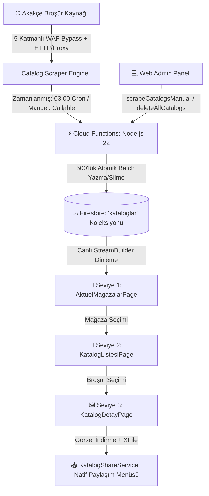
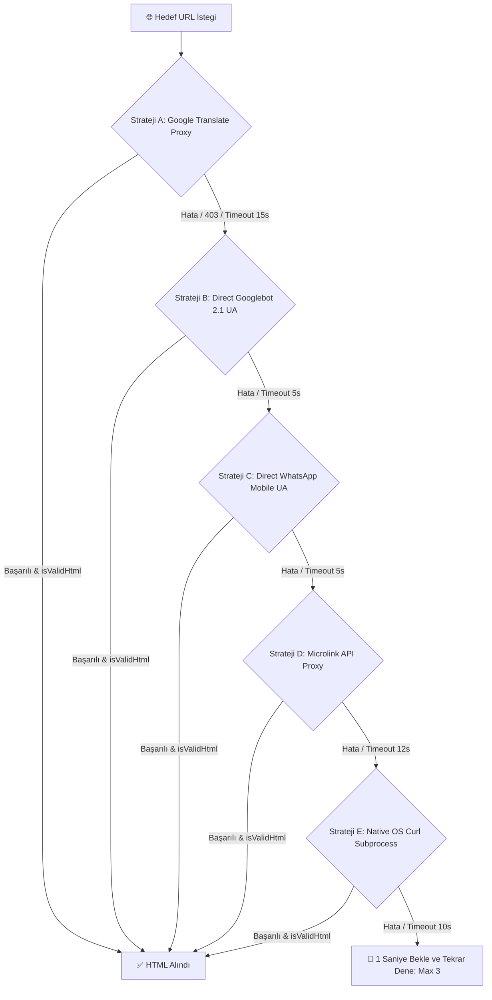

# 📰 Aktüel Kataloglar ve Broşürler Modülü — Kapsamlı Mimari, Veri ve Sistem Kontratı Rehberi

> [!IMPORTANT]
> **Base Doküman & Aktüel Kontratı:** Bu doküman, FırsatKolik platformunun süpermarket, kozmetik, ev-yaşam ve teknoloji mağazalarına ait dönemsel indirim kataloglarının (aktüel afiş ve broşürlerinin) kazınması, işlenmesi, Firestore üzerinde saklanması, mobil istemcide 3 seviyeli doğrusal kullanıcı deneyimiyle (Linear UX) sunulması, sosyal paylaşımı ve Web Admin paneli üzerinden yönetilmesine dair tüm uçtan uca mimariyi yöneten **ana orkestratör (Base Contract)** dokümandır. Her bir alt mimarinin ayrıntılı teknik referansları ilgili bölümlerde doğrudan bağlantılanmıştır.

Bu doküman; **FırsatKolik** platformunda süpermarket, kozmetik, ev-yaşam ve teknoloji mağazalarına ait dönemsel indirim kataloglarının (aktüel afiş ve broşürlerinin) taranması, işlenmesi, Firestore üzerinde saklanması, mobil istemcide 3 seviyeli doğrusal kullanıcı deneyimiyle (Linear UX) sunulması, sosyal paylaşımı ve Web Admin paneli üzerinden yönetilmesine dair tüm uçtan uca mimariyi, veri modellerini, güvenlik kurallarını ve teknik operasyonel iş kurallarını tanımlayan **resmi mimari sözleşmedir (Documentation Contract)**.

---

## 📑 İçindekiler
1. [🌟 Modüle Genel Bakış ve Mimari Tasarım İlkeleri](#1--modüle-genel-bakış-ve-mimari-tasarım-ilkeleri)
2. [📱 Mobil İstemci ve 3 Seviyeli Doğrusal Kullanıcı Deneyimi (Linear UX)](#2--mobil-istemci-ve-3-seviyeli-doğrusal-kullanıcı-deneyimi-linear-ux)
3. [🏪 Desteklenen 36 Mağaza ve Taksonomi Matrisi](#3--desteklenen-36-mağaza-ve-taksonomi-matrisi)
4. [🔥 Firestore Veri Modeli ve Şema Kontratı](#4--firestore-veri-modeli-ve-şema-kontratı)
5. [🛡️ Güvenlik Kuralları ve İzin Matrisi (Security Rules)](#5-️-güvenlik-kuralları-ve-izin-matrisi-security-rules)
6. [⚡ Firebase Cloud Functions ve Backend Mimarisi](#6-️-firebase-cloud-functions-ve-backend-mimarisi)
7. [🤖 Otonom Akakçe Kazıma Motoru ve WAF Bypass Hattı](#7--otonom-akakçe-kazıma-motoru-ve-waf-bypass-hattı)
8. [📤 Sosyal Paylaşım Motoru (KatalogShareService)](#8--sosyal-paylaşım-motoru-katalogshareservice)
9. [💻 Web Admin Paneli Entegrasyonu](#9--web-admin-paneli-entegrasyonu)
10. [🧪 Test, Doğrulama ve Operasyonel İzleme](#10--test-doğrulama-ve-operasyonel-izleme)
11. [📂 İlgili Kaynak Kod Dosyaları ve Referanslar](#11--ilgili-kaynak-kod-dosyaları-ve-referanslar)

---

## 1. 🌟 Modüle Genel Bakış ve Mimari Tasarım İlkeleri

Aktüel Kataloglar Modülü, kullanıcıların Türkiye'nin en popüler zincir market ve mağazalarının haftalık ve dönemsel indirim broşürlerini tek bir merkezden, yüksek çözünürlüklü ve akıcı bir arayüzle takip etmelerini sağlar.



### Temel Mimari Prensipler:
* **Sıfır İstisna ile 3 Seviyeli Doğrusal Akış:** Mağazada tek bir katalog olsa dahi akış her zaman `Mağaza Seçimi ➔ Katalog Listesi ➔ Katalog Detay` sırasını takip eder. Hiçbir mağaza için doğrudan detay sayfasına atlama yapılmaz.
* **Dinamik Mağaza Listeleme (Dynamic Visibility):** Sadece yayında **aktif en az 1 kataloğu bulunan** mağazalar ana listede gösterilir. Aktif kataloğu olmayan mağazalar arayüzde otomatik olarak gizlenir.
* **Akıllı Süre Yönetimi (Client-Side Expiry):** Süresi geçmiş kataloglar mobil istemci sorgularında ve listeleme anında elenir, kullanıcılara asla süresi dolmuş katalog sunulmaz.
* **Yüksek Çözünürlük ve Hızlı Önyükleme (Progressive Image Scaling):** Listeleme ekranlarında optimize edilmiş küçük kapak resimleri (`/_bro/l/`), detay ekranında ise ultra yüksek kaliteli sayfalar (`/_bro/u/`) sunulur.
* **5 Katmanlı Garantili Kazıma Hattı:** Akakçe üzerindeki Cloudflare/WAF kısıtlamalarını aşmak için Google Translate Proxy, Googlebot UA, WhatsApp Mobile UA, Microlink API ve Curl araçlarını sıralı deneyen otonom mekanizma.

---

## 2. 📱 Mobil İstemci ve 3 Seviyeli Doğrusal Kullanıcı Deneyimi (Linear UX)

> 🔗 **Detaylı Referans Dokümanı:**
> - [Aktüel Modülü Ürün ve UX Yol Haritası](file:///d:/firsatkolik/documentation/aktuel/aktuel-new-feature.md) — 3 seviyeli doğrusal UX vizyonu, ekran hiyerarşisi ve arayüz gereksinimleri.

Mobil uygulama tarafında modül, [AppTheme](file:///d:/firsatkolik/lib/theme/app_theme.dart) tasarım sistemine tam uyumlu 3 ana ekrandan ve bir paylaşım servisinden oluşur.

### 2.1. Seviye 1: Mağaza Seçim Ekranı ([AktuelMagazalarPage](file:///d:/firsatkolik/lib/screens/aktuel_magazalar_page.dart))
* **Giriş Noktası:** [HomeScreen](file:///d:/firsatkolik/lib/screens/home_screen.dart) üst çubuğunda (App Bar) Kuponlar butonunun hemen yanında yer alan `Aktüel` navigasyon çipi (`Icons.auto_stories_rounded`).
* **In-App Onboarding:** Uygulama ilk açılışında spotlight rehberinde (`InAppTutorialService.aktuelChipKey`) `#38BDF8` (Gök Mavisi) vurgusuyla tanıtılır.
* **Arayüz Elemanları:**
  1. **Hero Tanıtım Kartı:** Turuncu degrade ikonu (`Icons.auto_stories_rounded`), "YENİ" rozeti ve kapatma butonu (`_hideHeroBanner`).
  2. **Arama Çubuğu:** Mağaza adı veya mağaza kodu üzerinden anlık filtreleme.
  3. **Kategori Filtre Çipleri:** Yatay kaydırılabilir 5 ana kategori:
     - `tumu` (Tümü - `Icons.apps_rounded`)
     - `market` (Süpermarket - `Icons.shopping_cart_rounded`)
     - `kozmetik` (Kozmetik & Bakım - `Icons.face_retouching_natural_rounded`)
     - `giyimYasam` (Ev & Yaşam - `Icons.chair_rounded`)
     - `teknoloji` (Elektronik - `Icons.devices_rounded`)
  4. **Mağaza Grid'i:** 3'lü dizilimde (`crossAxisCount: 3`, `childAspectRatio: 0.86`) modern kartlar.
     - Her kartın üstünde markanın kurumsal renginde 3.5px yükseklikte renk çizgisi (Brand Accent).
     - Beyaz yuvarlatılmış iç arka planda optimize mağaza logosu ([StoreAssetHelper](file:///d:/firsatkolik/lib/utils/store_asset_helper.dart)).
     - Koyu/açık tema uyumlu mağaza ismi.
  5. **Skeleton Yükleme Ekranı:** Firestore'dan veri beklenirken 9'lu Shimmer iskelet animasyonu.
  6. **Boş Durum (Empty State):** Arama veya filtreleme sonucu eşleşme bulunamazsa sıfırlama butonlu temiz bilgilendirme ekranı.

### 2.2. Seviye 2: Mağaza Katalog Listesi Ekranı ([KatalogListesiPage](file:///d:/firsatkolik/lib/screens/katalog_listesi_page.dart))
* **Giriş:** Seviye 1'de bir mağaza kartına tıklandığında `magazaKodu` ve `magazaAdi` parametreleriyle açılır.
* **Arayüz Elemanları:**
  1. **Mağaza Hero Başlık Kartı:**
     - Mağaza logosu, kurumsal renk çerçevesi ve üst marka çizgisi.
     - Büyük mağaza ismi ve sağda `BİM`, `A101` gibi büyük harfli mağaza kodu rozeti.
     - "X Yayında" yeşil durum çipi ve "Resmi Broşürler" doğrulama rozeti.
  2. **Dinamik Sıralama Çipleri (`KatalogSortOption`):**
     - `defaultNewest` (En Yeni - `Icons.calendar_month_rounded`)
     - `expirySoonest` (Bitişi Yaklaşanlar - `Icons.hourglass_bottom_rounded`)
     - `expiryLatest` (En Uzun Süreli - `Icons.event_available_rounded`)
  3. **Katalog Grid'i:** 2'li dizilimde (`crossAxisCount: 2`, `childAspectRatio: 0.58`) dikey broşür kartları.
     - **Kapak Görseli:** `CachedNetworkImage` ile önbelleklenen görsel, sol üstte geçerlilik rozeti, sağ altta sayfa sayısı rozeti (`X Sayfa`).
     - **Geçerlilik Rozeti Renk Kodları:**
       - Mavi (`#2563EB`): Henüz başlamamış / Gelecek kampanya ("Yarın başlıyor", "X gün sonra başlayacak").
       - Yeşil (`#16A34A`): 4 günden fazla süresi olan aktif kampanya ("X gün sonra bitecek").
       - Sarı/Turuncu (`#D97706`): Son 2-3 günü kalmış kampanya ("3 gün sonra bitiyor").
       - Kırmızı (`#DC2626`): Son günü veya yarın bitecek kampanya ("Bugün bitiyor", "Yarın bitiyor").
       - Gri (`#71717A`): Süresi dolmuş kampanya ("Süresi Doldu").
     - **Kart Metin Alanı:** 2 satırlı katalog başlığı, Türkçe tarih aralığı (`d MMMM yyyy`) ve "Broşürü İncele" butonu.

### 2.3. Seviye 3: Katalog Detay ve Tam Ekran İnceleme ([KatalogDetayPage](file:///d:/firsatkolik/lib/screens/katalog_detay_page.dart))
* **Giriş:** Seviye 2'de bir broşür kartına tıklandığında `Katalog` nesnesi ile açılır.
* **Arayüz ve Etkileşim Yetenekleri:**
  1. **Yatay Sayfa Kaydırma (PageView.builder):** Instagram/e-dergi tarzında pürüzsüz sayfa geçişleri.
  2. **Çift Parmakla Yakınlaştırma (Pinch-to-Zoom):** `InteractiveViewer` bileşeni ile `1.0x` - `4.0x` arası kayıpsız büyütme.
  3. **Çoklu Dokunma Koruması (Multi-touch Lock):** Kullanıcı iki parmağıyla zoom yaparken PageView kaydırması kilitlenir (`NeverScrollableScrollPhysics`), böylece görseli incelerken yanlışlıkla yan sayfaya geçilmez.
  4. **Çift Tıklama ile Hızlı Büyütme (Double-Tap to Zoom):** Çift tıklandığında `2.5x` odaklı yumuşak animasyon (`Matrix4Tween`, `Curves.easeInOutCubic`).
  5. **Buzlu Cam Üst Bar (Frosted Glass Header):** `BackdropFilter` (16px blur), geri butonu, katalog başlığı, geçerlilik noktası/metni ve paylaşım butonu.
  6. **Buzlu Cam Alt Sayfa İndikatörü (Frosted Glass Footer):** `Sayfa X / Y` kapsülü ve aktif sayfayı gösteren animasyonlu nokta çubuğu (Dots Indicator).

---

## 3. 🏪 Desteklenen 36 Mağaza ve Taksonomi Matrisi

Kazıma motorunda ve mobil istemcide tanımlı 36 zincir marka, kategori ve renk standartları:

| Mağaza Kodu (`magazaKodu`) | Mağaza Adı | Kategori | Kurumsal Renk | Kazıma Anahtar Kelimeleri | Hariç Tutulanlar |
| :--- | :--- | :--- | :--- | :--- | :--- |
| `bim` | BİM | `market` | `#005691` | `bim` | - |
| `a101` | A-101 | `market` | `#14B4C8` | `a101`, `a-101` | - |
| `sok` | ŞOK | `market` | `#FFD200` | `sok`, `şok` | - |
| `migros` | Migros | `market` | `#EE7C11` | `migros` | - |
| `carrefoursa` | CarrefourSA | `market` | `#0F4C81` | `carrefour` | - |
| `metro` | Metro | `market` | `#002F6C` | `metro` | - |
| `macrocenter` | MacroCenter | `market` | `#1B1B1B` | `macro` | - |
| `getirbuyuk` | GetirBüyük | `market` | `#5D3EBC` | `getir` | - |
| `bizim` | Bizim Toptan | `market` | `#FFCC00` | `bizim` | - |
| `file` | File | `market` | `#3498DB` | `file` | - |
| `happycenter` | Happy Center | `market` | `#8DC63F` | `happy` | - |
| `hakmarexpress` | Hakmar Express | `market` | `#D32F2F` | `express` | - |
| `hakmar` | Hakmar | `market` | `#D32F2F` | `hakmar` | `express` |
| `cagri` | Çağrı Hipermarket | `market` | `#E31B23` | `cagri`, `çağrı` | - |
| `kooperatifmarket` | Kooperatif Market | `market` | `#00755F` | `kooperatif`, `tarim`, `tarım` | - |
| `mopas` | Mopaş | `market` | `#E31E24` | `mopas`, `mopaş` | - |
| `ozkuruslar` | Özkuruşlar | `market` | `#D32F2F` | `ozkuruslar`, `özkuruşlar`, `kuruslar`, `kuruşlar` | - |
| `tahtakale` | Tahtakale Spot | `market` | `#D32F2F` | `tahtakale`, `tahtakalespot` | - |
| `watsons` | Watsons | `kozmetik` | `#00A19B` | `watsons` | - |
| `gratis` | Gratis | `kozmetik` | `#8B1E87` | `gratis` | - |
| `rossmann` | Rossmann | `kozmetik` | `#E2001A` | `rossmann` | - |
| `bauhaus` | Bauhaus | `giyimYasam` | `#E30613` | `bauhaus` | - |
| `koctas` | Koçtaş | `giyimYasam` | `#EA5906` | `koctas`, `koçtaş` | - |
| `tekzen` | Tekzen | `giyimYasam` | `#008CD2` | `tekzen` | - |
| `tedi` | Tedi | `giyimYasam` | `#0088CC` | `tedi` | - |
| `cetinkaya` | Çetinkaya | `giyimYasam` | `#E31E24` | `cetinkaya`, `çetinkaya` | - |
| `civil` | Civil | `giyimYasam` | `#FF6600` | `civil` | - |
| `evkur` | Evkur | `giyimYasam` | `#003399` | `evkur` | - |
| `mrdiy` | MR.DIY | `giyimYasam` | `#FFD100` | `mrdiy`, `mr.diy`, `diy` | - |
| `arcelik` | Arçelik | `teknoloji` | `#E30613` | `arcelik`, `arçelik` | - |
| `beko` | Beko | `teknoloji` | `#003087` | `beko` | - |
| `bosch` | Bosch | `teknoloji` | `#E20015` | `bosch` | - |
| `siemens` | Siemens | `teknoloji` | `#00646E` | `siemens` | - |
| `teknosa` | Teknosa | `teknoloji` | `#FF5F00` | `teknosa` | - |
| `vatan` | Vatan Bilgisayar | `teknoloji` | `#005691` | `vatan` | - |
| `vestel` | Vestel | `teknoloji` | `#CC0000` | `vestel` | - |

---

## 4. 🔥 Firestore Veri Modeli ve Şema Kontratı

Tüm aktüel broşür kayıtları Firestore veritabanında kök düzeydeki `kataloglar` koleksiyonunda saklanır.

### 4.1. Koleksiyon Yapısı: `/kataloglar/{katalogId}`
Doküman ID formatı standart olarak `{magazaKodu}_{brochureId}` bileşik anahtarından oluşur (Örn: `bim_56190`, `a101_59290`).

```json
{
  "katalogId": "bim_56190",
  "magazaKodu": "bim",
  "katalogBasligi": "İndirimli Ürünler",
  "baslangicTarihi": "2026-03-24T00:00:00.000Z",
  "bitisTarihi": "2026-09-24T20:59:59.999Z",
  "sayfaResimleri": [
    "https://cdn.akakce.com/_bro/u/731/56190/56190_464539.jpg",
    "https://cdn.akakce.com/_bro/u/731/56190/56190_464540.jpg"
  ],
  "kapakResmi": "https://cdn.akakce.com/_bro/l/731/56190/56190_464539.jpg",
  "olusturulmaTarihi": "2026-08-27T03:00:00.000Z",
  "guncellenmeTarihi": "2026-08-27T03:00:00.000Z"
}
```

### 4.2. Alan Tanımları ve Tipleri:

| Alan Adı | Tip | Zorunlu | Açıklama ve İş Kuralları |
| :--- | :--- | :--- | :--- |
| `katalogId` | `String` | Evet | Benzersiz katalog kimliği (`{magazaKodu}_{brochureId}`). |
| `magazaKodu` | `String` | Evet | Desteklenen 36 mağazadan birinin normalize edilmiş kodu (Örn: `bim`, `a101`, `gratis`). |
| `katalogBasligi` | `String` | Evet | Kataloğun kampanya başlığı / türü (Örn: "Aldın Aldın", "Haftanın Yıldızları", "İndirim Broşürü"). |
| `baslangicTarihi` | `Timestamp` | Evet | Kampanyanın başlangıç tarihi (Türkiye saatiyle 00:00:00). |
| `bitisTarihi` | `Timestamp` | Evet | Kampanyanın son geçerlilik tarihi (Türkiye saatiyle 23:59:59.999). |
| `sayfaResimleri` | `Array<String>` | Evet | Kataloğa ait tüm sayfaların yüksek çözünürlüklü (`/_bro/u/`) CDN görsel URL dizisi. |
| `kapakResmi` | `String` | Evet | Listeleme gridinde kullanılacak optimize küçük kapak görseli URL'i (`/_bro/l/`). |
| `olusturulmaTarihi` | `Timestamp` | Evet | Veritabanına ilk yazılma zamanı (`serverTimestamp`). |
| `guncellenmeTarihi` | `Timestamp` | Evet | Son güncellenme zamanı (`serverTimestamp`). |

---

## 5. 🛡️ Güvenlik Kuralları ve İzin Matrisi (Security Rules)

Katalog verileri [firestore.rules](file:///d:/firsatkolik/firestore.rules) içerisinde aşağıdaki kural setiyle korunur:

```javascript
// ========================================
// KATALOGLAR COLLECTION
// ========================================
match /kataloglar/{katalogId} {
  // Tüm istemciler ve anonim kullanıcılar katalogları okuyabilir
  allow read: if true;
  
  // Yalnızca sistem adminleri ve Cloud Functions (Admin SDK) yazabilir
  allow write: if isAdmin();
}
```

* **Okuma Güvenliği:** Mobil istemciler ve Web Admin paneli katalogları herhangi bir kimlik doğrulama zorunluluğu olmadan herkese açık okuyabilir.
* **Yazma Güvenliği:** Doğrudan mobil kullanıcıların katalog oluşturması, güncellemesi veya silmesi engellenmiştir. Yalnızca `isAdmin()` doğrulamasından geçen yöneticiler ve Firebase Admin SDK kullanan Cloud Functions servisleri yazma yetkisine sahiptir.

---

## 6. ⚡ Firebase Cloud Functions ve Backend Mimarisi

Katalog kazıma ve veritabanı senkronizasyonu iki ayrı Cloud Function üzerinden yönetilir ([functions/index.js](file:///d:/firsatkolik/functions/index.js) & [functions/catalog_scraper.js](file:///d:/firsatkolik/functions/catalog_scraper.js)):

### 6.1. Zamanlanmış Otomatik Görev (`scrapeCatalogsScheduled`)
* **Tetikleyici:** Cloud Pub/Sub Cron.
* **Çalışma Zamanı:** Her gece **03:00** (Europe/Istanbul saat dilimi: `0 3 * * *`).
* **Kaynak Yapılandırması:** `timeoutSeconds: 540` (9 dakika), `memory: '1GB'`.
* **İşleyiş:** 36 mağazanın tüm Akakçe sayfalarını tarar, yeni broşürleri ayrıştırır, eski veritabanı kayıtlarını temizler ve güncel katalogları Firestore'a yazar.

### 6.2. Manuel Yönetici Tetikleyicisi (`scrapeCatalogsManual`)
* **Tetikleyici:** HTTPS Callable (`functions.https.onCall`).
* **Yetkilendirme:** İstek yapan kullanıcının `users/{uid}` kaydında `isAdmin === true` olması zorunludur (`wrapCall` korumalı).
* **Kaynak Yapılandırması:** `timeoutSeconds: 540`, `memory: '1GB'`.
* **Kullanım:** Web Admin panelinde "Katalogları Kazı (Scrape Et)" butonuna basıldığında anlık olarak tetiklenir.

---

## 7. 🤖 Otonom Akakçe Kazıma Motoru ve WAF Bypass Hattı

> 🔗 **Detaylı Referans Dokümanı:**
> - [Akakçe Broşür Kazıma ve Doğrulama Notları](file:///d:/firsatkolik/documentation/aktuel/aktuel-scraper.md) — Cheerio DOM ayrıştırma, sayfa bağlantı haritası ve HTML filtreleme detayları.

Katalog kazıma motoru ([catalog_scraper.js](file:///d:/firsatkolik/functions/catalog_scraper.js)), Akakçe'nin anti-bot ve Cloudflare korumalarını aşmak üzere tasarlanmış çok katmanlı bir mimariye sahiptir.

### 7.1. 5 Katmanlı WAF Bypass Stratejisi (`fetchHtmlWithRetry`)
Her bir URL isteği için en fazla 3 tam deneme yapılır ve her denemede aşağıdaki 5 strateji sırayla işletilir:



1. **Strateji A (Birincil - Google Translate Proxy):** URL `*.translate.goog` formatına dönüştürülerek Google çeviri altyapısı üzerinden çekilir (WAF engellerini %99 aşar).
2. **Strateji B (Googlebot User-Agent):** `Mozilla/5.0 (compatible; Googlebot/2.1; +http://www.google.com/bot.html)` başlığı ile doğrudan istek.
3. **Strateji C (WhatsApp Mobile User-Agent):** `WhatsApp/2.23.4.15 A` mobil bot başlığı ile doğrudan istek.
4. **Strateji D (Microlink Proxy):** `api.microlink.io` servisi üzerinden headless HTML ayrıştırma.
5. **Strateji E (Native Curl Subprocess):** İşletim sisteminin yerel `curl` komutu (`spawnSync`) ile ham istek.

### 7.2. HTML Doğrulama ve Güvenlik Filtresi (`isValidHtml`)
Alınan yanıtın geçerli bir web sayfası olup olmadığı kontrol edilir:
* Minimum içerik uzunluğu: `2500` - `3000` karakter.
* WAF ve hata engelleme kontrolü: Metinde `403 - Forbidden`, `Access is denied`, `Robot verification` ifadeleri varsa yanıt geçersiz sayılır.

### 7.3. Mağaza Eşleşme ve Zehirlenme Koruması (Anti-Poisoning Filter)
Akakçe üzerinde broşürü bulunmayan bazı mağazalar genel `/brosurler/` anasayfasına yönlenebilir. Alakasız broşürlerin ilgili mağazaya eklenmesini önlemek için:
* Link yolunda (`cleanPath`) veya broşür mağaza adında (`storeNameText`) hedeflenen mağazanın anahtar kelimeleri (`keywords`) aranır.
* Hariç tutma kelimeleri (`excludeKeywords`) kontrol edilir (Örn: `hakmar` taranırken `express` içeren Hakmar Express broşürleri elenir).

### 7.4. Görsel Çözünürlük Yükseltme Hattı (Resolution Upscaling)
Akakçe sayfalarında küçük önizleme boyutunda olan görseller regex dönüşümleriyle tam çözünürlüklü hale getirilir:
* `sayfaResimleri`: `/_bro/l/`, `/_bro/y/` ve `/_bro/m/` yolları `/_bro/u/` (Ultra High Res) ile değiştirilir.
* `kapakResmi`: Hızlı yükleme için `/_bro/l/` (Low/Medium Res) olarak normalize edilir.
* `t.gif` şeffaf yer tutucu görselleri filtrelenir.

### 7.5. Türkçe Tarih Ayrıştırma ve Zaman Dilimi Motoru
Katalogların geçerlilik süreleri `#br_s` etiketindeki metinden veya URL yolundan çözümlenir:
* **Tarih Aralığı:** `parseDatesFromSpan("12 Temmuz - 19 Temmuz")` ➔ Başlangıç: 12 Temmuz 00:00:00, Bitiş: 19 Temmuz 23:59:59.999.
* **Tek Gün:** `parseDatesFromSpan("21 Mart")` ➔ Başlangıç: 21 Mart 00:00:00, Bitiş: 21 Mart 23:59:59.999.
* **Yedek (Fallback):** URL'den tarih çekilemezse bugünün tarihi başlangıç, 7 gün sonrası ise bitiş kabul edilir.
* **Zaman Dilimi Senkronizasyonu (`createTurkeyDate`):** UTC+3 (İstanbul) saat farkı dikkate alınarak milisaniye düzeyinde doğru Timestamp üretilir.

### 7.6. Eşzamanlılık ve 500'lük Toplu Veritabanı İşlemleri
* Mağazalar arası aşırı yükü engellemek için `mapConcurrent(items, 2, ...)` ile maksimum 2 eşzamanlı sayfa çekilir ve mağazalar arasında `200ms` bekleme uygulanır.
* Kazıma tamamlandığında eski kayıtlar ve yeni kayıtlar Firestore'un 500 işlem limitli `batch` mekanizması ile parçalı olarak güncellenir.

---

## 8. 📤 Sosyal Paylaşım Motoru (KatalogShareService)

Katalog detay ekranındaki paylaşım butonu [KatalogShareService](file:///d:/firsatkolik/lib/services/katalog_share_service.dart) servisini tetikler:

1. **Görsel İndirme:** Aktif görüntülenen sayfa resmi `http.get` ile indirilir.
2. **Geçici Dosya Oluşturma:** `path_provider` aracılığıyla `katalog_{id}_p{sayfa}.jpg` adıyla yerel önbelleğe yazılır.
3. **Natif Paylaşım Sayfası:** `share_plus` paketi ile telefonun natif paylaşım sayfasına (WhatsApp, Telegram, Instagram vb.) resim dosyası (`XFile`) olarak gönderilir.
4. **Tanıtım Metni Şablonu:**
```text
📰 {Mağaza Adı} - {Katalog Başlığı} (Sayfa {X} / {Y})
📅 Geçerlilik: {Başlangıç} - {Bitiş}

🔥 En güncel market kataloglarını, indirim broşürlerini ve sıcak fırsatları anında yakalamak için FırsatKolik uygulamasını yükle!
📱 Uygulamayı İndir: https://firsatkolik.app.link/aktuel
```
5. **Yedekleme (Fallback):** Görsel indirme başarısız olursa paylaşım metnine görselin doğrudan CDN linki eklenerek metin paylaşımı yapılır.

---

## 9. 💻 Web Admin Paneli Entegrasyonu

Web Admin panelinde [catalogsView](file:///d:/firsatkolik/web/admin/app.js) üzerinden aktüel kataloglar canlı yönetilir:

* **Gerçek Zamanlı Dinleyici (`loadCatalogs`):** `db.collection('kataloglar').orderBy('baslangicTarihi', 'desc').onSnapshot` ile veritabanındaki tüm kataloglar canlı tablo olarak listelenir.
* **Katalog Sayacı:** Aktif toplam katalog sayısı başlıkta dinamik gösterilir.
* **Manuel Kazıma Butonu (`scrapeCatalogsBtn`):** `scrapeCatalogsManual` Cloud Function'ını çağırarak anlık tarama başlatır.
* **Tüm Katalogları Sil Butonu (`deleteAllCatalogsBtn`):** Hatalı veya süresi geçmiş tüm katalogları 500'lük batch bloklarıyla veritabanından kalıcı olarak siler.

---

## 10. 🧪 Test, Doğrulama ve Operasyonel İzleme

Modülün kararlılığı [functions/tests/](file:///d:/firsatkolik/functions/tests/) altında yer alan test betikleri ile doğrulanır:

| Test Dosyası | Test Edilen Bileşen ve Senaryo |
| :--- | :--- |
| [test_catalog_scraper.js](file:///d:/firsatkolik/functions/tests/test_catalog_scraper.js) | Temel Akakçe kazıyıcı motorunun çalışması ve Cheerio DOM ayrıştırması. |
| [test_guaranteed_scraper.js](file:///d:/firsatkolik/functions/tests/test_guaranteed_scraper.js) | 5 katmanlı WAF bypass stratejilerinin ve proxy dayanıklılığının testi. |
| [dry_run_all_stores.js](file:///d:/firsatkolik/functions/tests/dry_run_all_stores.js) | 36 mağazanın tamamının veritabanına yazmadan uçtan uca simülasyonu. |
| [test_span_date_parser.js](file:///d:/firsatkolik/functions/tests/test_span_date_parser.js) | Türkçe tarih aralıklarının (hafta, ay, gün) ve saat dilimlerinin doğruluğu. |
| [check_firestore_kataloglar.js](file:///d:/firsatkolik/functions/tests/check_firestore_kataloglar.js) | Canlı Firestore ortamındaki mağaza bazlı katalog dağılımının kontrolü. |

---

## 11. 📂 İlgili Kaynak Kod Dosyaları ve Referanslar

| Rol / Katman | Dosya Yolu | Açıklama |
| :--- | :--- | :--- |
| **Mobil UI: Seviye 1** | [aktuel_magazalar_page.dart](file:///d:/firsatkolik/lib/screens/aktuel_magazalar_page.dart) | Mağaza gridi, arama ve kategori filtreleme ekranı. |
| **Mobil UI: Seviye 2** | [katalog_listesi_page.dart](file:///d:/firsatkolik/lib/screens/katalog_listesi_page.dart) | Mağaza katalog listesi, sıralama ve geçerlilik rozetleri. |
| **Mobil UI: Seviye 3** | [katalog_detay_page.dart](file:///d:/firsatkolik/lib/screens/katalog_detay_page.dart) | Tam ekran yüksek çözünürlüklü broşür inceleme ve zoom. |
| **Mobil Model** | [katalog.dart](file:///d:/firsatkolik/lib/models/katalog.dart) | Katalog veri sınıfı, Firestore serileştirme ve geçerlilik metin motoru. |
| **Mobil Paylaşım** | [katalog_share_service.dart](file:///d:/firsatkolik/lib/services/katalog_share_service.dart) | Natif görsel indirme ve sosyal medya paylaşım servisi. |
| **Mağaza Yardımcısı** | [store_asset_helper.dart](file:///d:/firsatkolik/lib/utils/store_asset_helper.dart) | Mağaza logoları ve marka renkleri merkezi eşleme motoru. |
| **Giriş Noktası** | [home_screen.dart](file:///d:/firsatkolik/lib/screens/home_screen.dart) | Anasayfa App Bar "Aktüel" navigasyon butonu. |
| **Backend Kazıyıcı** | [catalog_scraper.js](file:///d:/firsatkolik/functions/catalog_scraper.js) | 5 aşamalı WAF bypass, Akakçe kazıma ve Firestore batch yazma motoru. |
| **Cloud Functions** | [index.js](file:///d:/firsatkolik/functions/index.js) | `scrapeCatalogsScheduled` (03:00) ve `scrapeCatalogsManual` trigger'ları. |
| **Veritabanı Güvenliği** | [firestore.rules](file:///d:/firsatkolik/firestore.rules) | `kataloglar` koleksiyonu okuma/yazma güvenlik kuralları. |
| **Web Yönetim Paneli** | [app.js](file:///d:/firsatkolik/web/admin/app.js) & [index.html](file:///d:/firsatkolik/web/admin/index.html) | `catalogsView` yönetim görünümü, liste, silme ve tetikleme. |
