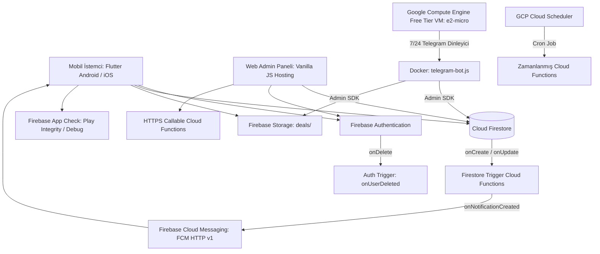

# ⚡ FırsatKolik — Backend ve Bulut Altyapısı Master Mimari Rehberi

> [!IMPORTANT]
> **Base Doküman & Altyapı Kontratı:** Bu doküman, FırsatKolik platformunun backend, bulut fonksiyonları, veritabanı kuralları, ortam yönetimi ve sunucu altyapısını yöneten **ana orkestratör (Base Contract)** dokümandır. Her bir alt mimarinin ayrıntılı teknik referansları ilgili bölümlerde doğrudan bağlantılanmıştır.

Bu doküman; **FırsatKolik** platformunun sunucu (Firebase Cloud Functions v1/v2), veritabanı (Cloud Firestore), dosya depolama (Firebase Storage), kimlik doğrulama (Firebase Auth), anlık bildirim (FCM v1), güvenlik katmanı (Firestore & Storage Security Rules, App Check), ortam yönetimi (DEV vs PROD Flavors), Compute Engine VM bot sunucusu ve sıfır maliyet mimarisini tanımlayan **resmi mimari sözleşmedir (Documentation Contract)**.

---

## 📑 İçindekiler
1. [🌟 Genel Backend Mimarisi ve Altyapı Bileşenleri](#1--genel-backend-mimarisi-ve-altyapı-bileşenleri)
2. [⚡ 26 Cloud Function Tam Envanteri ve Tetikleme Sözleşmesi](#2--26-cloud-function-tam-envanteri-ve-tetikleme-sözleşmesi)
3. [⚙️ Ortam Yönetimi ve Flavor Mimarisi (DEV vs PROD)](#3-️-ortam-yönetimi-ve-flavor-mimarisi-dev-vs-prod)
4. [🔒 Firestore ve Storage Güvenlik Mimarisi (Security Rules & RBAC)](#4-️-firestore-ve-storage-güvenlik-mimarisi-security-rules--rbac)
5. [💰 Google Cloud Sıfır Maliyet Mimarisi ve Free Tier VM](#5--google-cloud-sıfır-maliyet-mimarisi-ve-free-tier-vm)
6. [🔑 Gizli Bilgiler, API Anahtarları ve Keystore Envanteri](#6--gizli-bilgiler-api-anahtarları-ve-keystore-envanteri)
7. [🧹 30 Günlük Veri Saklama ve Otomatik Temizlik (Purge/Cron)](#7--30-günlük-veri-saklama-ve-otomatik-temizlik-purgecron)
8. [🛡️ Firebase App Check ve Play Integrity Güvenliği](#8-️-firebase-app-check-ve-play-integrity-güvenliği)
9. [💻 Web Admin Paneli Backend Entegrasyonu (Hosting & Callable)](#9--web-admin-paneli-backend-entegrasyonu-hosting--callable)
10. [🧪 Backend Test Süitleri ve Doğrulama](#10--backend-test-süitleri-ve-doğrulama)
11. [🔧 Sorun Giderme ve Hata Ayıklama (Troubleshooting)](#11--sorun-giderme-ve-hata-ayıklama-troubleshooting)
12. [📂 İlgili Kaynak Kod Dosyaları ve Referanslar](#12--ilgili-kaynak-kod-dosyaları-ve-referanslar)

---

## 1. 🌟 Genel Backend Mimarisi ve Altyapı Bileşenleri

FırsatKolik backend altyapısı, yüksek performans, sıfır sunucu bakım yükü (serverless) ve minimum maliyet hedefleriyle tasarlanmış hibrit bir bulut ekosistemidir:



### Temel Mimari Bileşenler:
1. **Cloud Firestore:** NoSQL doküman tabanlı veritabanı. Fırsatlar, yorumlar, kullanıcılar, kuponlar, aktüel kataloglar ve bildirim kutularını yönetir.
2. **Firebase Cloud Functions (Node.js):** 26 adet sunucusuz fonksiyon (`functions/index.js`). Firestore tetikleyicileri, callable admin API'leri, zamanlanmış cron görevleri ve HTTPS proxy servislerini barındırır.
3. **Google Compute Engine VM (`telegram-bot-server`):** Free Tier `e2-micro` makinede çalışan Docker container'ları ile Telegram indirim kanallarını 7/24 dinler.
4. **Firebase Cloud Messaging (FCM HTTP v1):** 7 Android bildirim kanalı ve iOS APNs entegrasyonu ile akıllı push dağıtımı sağlar.
5. **Firebase Storage:** Fırsat görsellerini ve aktüel broşürlerini barındırır.

---

## 2. ⚡ 26 Cloud Function Tam Envanteri ve Tetikleme Sözleşmesi

> 🔗 **Detaylı Referans Dokümanı:**
> - [Cloud Functions ve Backend Servisleri Rehberi](file:///d:/firsatkolik/documentation/backend-ve-altyapi/cloud_functions_rehberi.md) — 26 fonksiyonun tetiklenme türleri, parametreleri ve somut kullanım senaryoları.

Tüm backend fonksiyonları [functions/index.js](file:///d:/firsatkolik/functions/index.js) içerisinde modüler olarak tanımlanmıştır:

| # | Fonksiyon Adı | Tetikleyici Türü | Çağrıldığı / Tetiklendiği Yer | Sorumluluk ve Çalışma Mantığı |
|---|---|---|---|---|
| 1 | **`onDealCreated`** | Firestore `deals/{dealId}` (onCreate) | Mobil Paylaşım, Bot, Web Admin | Küfür/profanity moderasyonu yapar. Fırsat onaysız ise `admin_deals` FCM konusuna admin bildirimi gönderir. Onaylıysa bildirimleri üretir (`matchAndCreateDealNotifications`). |
| 2 | **`onDealUpdated`** | Firestore `deals/{dealId}` (onUpdate) | Admin Onay/Düzenleme, Oylama | `isApproved: false ➔ true` olduğunda herkese bildirim üretir. Kullanıcı paylaşımı onaylandığında/reddedildiğinde `submission_status` bildirimi yazar. |
| 3 | **`onCommentCreated`** | Firestore `deals/{id}/comments/{id}` (onCreate) | Detay Ekranı Yorum Alanı | Yorum moderasyonu yapar. İlanın `commentCount` sayacını atomik artırır. Yanıt ise alıcıya `comment_reply` bildirimi oluşturur. |
| 4 | **`onAdminMessageCreated`** | Firestore `adminMessages/{id}` (onCreate) | Web Admin Paneli Duyuruları | Admin panelinden kullanıcıya mesaj atıldığında `users/{uid}/notifications/admin_msg_{id}` dokümanı yazar. |
| 5 | **`onUserMessageCreated`** | Firestore `messages/{id}` (onCreate) | Birebir Sohbet Ekranı | Birebir sohbette yeni mesaj geldiğinde alıcının cihazlarına **Data-Only Payload** iletir (Aktif sohbette bildirimi bastırır). |
| 6 | **`onNotificationCreated`** | Firestore `users/{uid}/notifications/{id}` (onCreate) | Merkezi Push Motoru | Sistem şalteri, sessiz saatler, kategori limitleri, kullanıcı tercihleri ve cihaz token kontrollerini yaparak FCM push gönderir. |
| 7 | **`onUserUpdated`** | Firestore `users/{userId}` (onUpdate) | Profil Düzenleme | Kullanıcı profil resmi veya kullanıcı adı değiştiğinde yorumlar ve mesajlardaki denormalize verileri senkronize eder. |
| 8 | **`onUserDeleted`** | Auth `user().onDelete` | Kullanıcı Hesabı Silme | Kullanıcı silindiğinde `userDevices`, `notificationSubscriptions`, `notifications` ve `notificationPreferences` verilerini kalıcı temizler. |
| 9 | **`resolveShortLink`** | HTTPS Request (`onRequest`) | Flutter App & Web Admin | Kısa linkleri ve yönlendirmeleri (redirect) takip ederek gerçek son URL'yi çözer. |
| 10 | **`analyzeProductProxy`** | HTTPS Request (`onRequest`) | Flutter App AI Servisi | Firebase App Check ve Secret Manager korumalı olarak Google Gemini API'ye güvenli proxy sağlar. |
| 11 | **`sendManualNotification`** | HTTPS Callable (`onCall`) | Web Admin Paneli (`app.js`) | Admin panelinden tüm kullanıcılara, belirli bir kullanıcıya veya cihaza anlık push gönderir; log ve istatistik üretir. |
| 12 | **`cleanupInvalidTokens`** | HTTPS Callable (`onCall`) | Web Admin Paneli (`app.js`) | `userDevices` içerisindeki aktif FCM token'ları `dryRun: true` ile test ederek geçersiz olanları `active: false` yapar. |
| 13 | **`cleanupExpiredDeals`** | Scheduled Cron (`0 3 * * *` - Gece 03:00) | GCP Cloud Scheduler | 48 saati dolduran fırsatları bulur; dokümanı **SİLMEZ**, sadece `isExpired: true` olarak işaretler (Soft-Expire). |
| 14 | **`cleanupExpiredDealsManual`** | HTTPS Request (`onRequest`) | Manuel HTTP Endpoint | 48 saatlik soft-expire işlemini cron saatini beklemeden manuel test etmek için kullanılır. |
| 15 | **`purgeOldDeals`** | Scheduled Cron (`0 4 * * 0` - Pazar 04:00) | GCP Cloud Scheduler | **30 Günlük Derin Temizlik:** 30 günden eski fırsatları, yorumları, favorileri ve **tüm kullanıcılardaki (`collectionGroup('notifications')`) 30 günü geçmiş bildirimleri** 400'lük batch parçalarıyla kalıcı siler. |
| 16 | **`purgeOldDealsManual`** | HTTPS Callable (`onCall`) | Web Admin Paneli & Scriptler | 30 günlük derin temizliği (fırsatlar + eski bildirimler) admin yetkisiyle manuel tetikler. |
| 17 | **`purgeOldNotificationsManual`** | HTTPS Callable (`onCall`) | Web Admin & Scriptler | Fırsatlara dokunmadan, yalnızca `collectionGroup('notifications')` koleksiyonundaki 30+ günlük bildirim dokümanlarını toplu siler. |
| 18 | **`cleanupOldImages`** | Scheduled Cron (`0 0 * * *` - Gece 00:00) | GCP Cloud Scheduler | Firebase Storage `deals/` dizinindeki 30 günden eski sahipsiz/çöp görselleri temizler. |
| 19 | **`cleanupOldImagesManual`** | HTTPS Request (`onRequest`) | Manuel HTTP Endpoint | Storage görsel temizliğini anlık olarak test etmek için kullanılır. |
| 20 | **`adminDeleteUser`** | HTTPS Callable (`onCall`) | Web Admin Paneli (`app.js`) | Admin panelinden seçilen kullanıcının hem Firebase Auth hesabını hem de Firestore profilini kalıcı siler. |
| 21 | **`generateTestData`** | HTTPS Callable (`onCall`) | Web Admin Paneli (`app.js`) | Geliştirme ortamı için `isTest: true` bayraklı sahte fırsatlar ve kategoriler üretir. |
| 22 | **`cleanupTestData`** | HTTPS Callable (`onCall`) | Web Admin Paneli (`app.js`) | `isTest: true` bayraklı sahte verileri tek işlemle temizler. |
| 23 | **`scrapeCouponsScheduled`** | Scheduled Cron (Her 6 saatte bir) | GCP Cloud Scheduler | Kupon kaynaklarını otonom tarayarak güncel indirim kodlarını veritabanına ekler. |
| 24 | **`scrapeCouponsManual`** | HTTPS Callable (`onCall`) | Web Admin Paneli (`app.js`) | Kupon kazıma botunu admin panelinden manuel tetikler. |
| 25 | **`scrapeCatalogsScheduled`** | Scheduled Cron (Her 12 saatte bir) | GCP Cloud Scheduler | Market aktüel afiş ve kataloglarını otonom tarar. |
| 26 | **`scrapeCatalogsManual`** | HTTPS Callable (`onCall`) | Web Admin Paneli (`app.js`) | Broşür kazıma botunu admin panelinden manuel tetikler. |

---

## 3. ⚙️ Ortam Yönetimi ve Flavor Mimarisi (DEV vs PROD)

> 🔗 **Detaylı Referans Dokümanı:**
> - [Ortam Yönetimi ve Canlıya Geçiş Kılavuzu](file:///d:/firsatkolik/documentation/backend-ve-altyapi/environment_management_guide.md) — DEV/PROD build komutları, Play Store AAB derleme ve Shorebird live code push stratejileri.

FırsatKolik, **Geliştirme (DEV)** ve **Canlı (PROD)** olmak üzere iki tamamen izole Firebase projesi ve derleme ortamı üzerinde çalışır:

| Parametre | DEV (Geliştirme / Test) | PROD (Canlı / Production) |
| :--- | :--- | :--- |
| **Firebase Proje ID** | `sicak-firsatlar-e6eae` | `firsatkolik-prod-e6eae` |
| **Android Paket Adı** | `com.sicakfirsatlar.sicak_firsatlar` | `com.firsatkolik.app` |
| **Uygulama Görünen Adı** | **FırsatKolik Dev** | **FırsatKolik** |
| **Target SDK / Java** | Android SDK 36 / Java 17 | Android SDK 36 / Java 17 |
| **Flavor Tanımı** | `--flavor dev --dart-define=FLAVOR=dev` | `--flavor prod --dart-define=FLAVOR=prod` |
| **AdMob Reklamları** | Google Test Banner ID (`ca-app-pub-3940...`) | Gerçek Banner ID (`ca-app-pub-6853...`) |
| **App Check Sağlayıcısı**| Debug Provider (Debug Token) | Play Integrity API (Google Play Store) |
| **Android Keystore** | Varsayılan Debug Keystore | `android/app/upload-keystore.jks` (Alias: upload) |
| **Web Admin URL** | `localhost` / `sicak-firsatlar-e6eae.web.app` | `https://firsatkolik-prod-e6eae.web.app` |
| **Telegram Bot Portu** | Port `8081` (`dev-bot`) | Port `8082` (`prod-bot`) |

### Hızlı Operasyon Komutları:
```bash
# 1. Mobil Uygulamayı Başlatma
flutter run -d <cihaz> --flavor dev --dart-define=FLAVOR=dev
flutter run -d <cihaz> --flavor prod --dart-define=FLAVOR=prod

# 2. Google Play Store AAB Derlemesi
flutter build appbundle --flavor prod --dart-define=FLAVOR=prod --release

# 3. Cloud Functions Dağıtımı
firebase deploy --only functions --project dev
firebase deploy --only functions --project prod

# 4. Güvenlik Kuralları Dağıtımı
firebase deploy --only firestore:rules,storage --project dev
firebase deploy --only firestore:rules,storage --project prod

# 5. Web Admin Panelini Yayınlama
firebase deploy --only hosting --project dev
firebase deploy --only hosting --project prod
```

---

## 4. 🔒 Firestore ve Storage Güvenlik Mimarisi (Security Rules & RBAC)

> 🔗 **Detaylı Referans Dokümanı:**
> - [Firestore ve Storage Güvenlik Kuralları Rehberi](file:///d:/firsatkolik/documentation/backend-ve-altyapi/firestore_ve_storage_guvenlik_kurallari_rehberi.md) — RBAC, `isAdmin()`, `isBlocked()`, field-level diffing ve collectionGroup kuralları.

Güvenlik kuralları ([firestore.rules](file:///d:/firsatkolik/firestore.rules) ve [storage.rules](file:///d:/firsatkolik/storage.rules)) 4 temel prensip üzerine kuruludur:

1. **Rol Tabanlı Erişim Denetimi (RBAC):** `isAdmin()` fonksiyonu ile `users/{uid}.isAdmin == true` alanı doğrulanır.
2. **Kullanıcı Engelleme Denetimi (`isBlocked()`):** `blockedUsers/{uid}` koleksiyonunda kaydı bulunan kullanıcıların veri yazması engellenir (`canWrite()`).
3. **Alan Düzeyinde Fark Doğrulaması (Field-Level Diffing):** Normal kullanıcıların fırsatların başlık/fiyat gibi kritik alanlarını değiştirmesi engellenir; yalnızca oy ve sayaç alanlarını (`hotVotes`, `coldVotes`, `expiredVotes`, `commentCount`, `updatedAt`) güncellemelerine izin verilir:
   ```rules
   allow update: if canWrite() && (
     resource.data.postedBy == userId() || 
     isAdmin() ||
     request.resource.data.diff(resource.data).affectedKeys()
       .hasOnly(['hotVotes', 'coldVotes', 'expiredVotes', 'isExpired', 'commentCount', 'updatedAt'])
   );
   ```
4. **Collection Group Yetkilendirmesi:** 30+ günlük bildirim temizliği için `collectionGroup('notifications')` sorguları yalnızca yöneticilere açıktır:
   ```rules
   match /{path=**}/notifications/{notificationId} {
     allow read, write: if isAdmin();
   }
   ```

---

## 5. 💰 Google Cloud Sıfır Maliyet Mimarisi ve Free Tier VM

> 🔗 **Detaylı Referans Dokümanı:**
> - [Google Cloud Maliyet Analizi ve Optimizasyon Raporu](file:///d:/firsatkolik/documentation/backend-ve-altyapi/google_cloud_cost_analysis.md) — Cloud Run maliyet analizi, Compute Engine e2-micro geçişi ve PM2/Docker optimizasyonları.

Projenin başlangıcında Cloud Run üzerinde çalışan botların 7/24 açık kalması sebebiyle aylık ~130$ (4.400 TL) faturalandırma oluştuğu tespit edilmiş; ardından **Google Cloud Free Tier VM** mimarisine geçilmiştir:

### Uygulanan Tasarruf Mimarisi:
1. **Google Compute Engine e2-micro:** `firsatkolik-prod-e6eae` projesinde `us-central1-a` bölgesinde yer alan ücretsiz `e2-micro` (2 vCPU, 1 GB RAM, 10 GB disk) sanal makinesi tahsis edildi (`telegram-bot-server`).
2. **Docker Container İzolasyonu:**
   - **DEV Bot:** Port `8081` üzerinde `dev-bot` container'ı olarak çalışır ve `dev_firebase_key.json` ile DEV veritabanını besler.
   - **PROD Bot:** Port `8082` üzerinde `prod-bot` container'ı olarak çalışır ve `prod_firebase_key.json` ile PROD veritabanını besler.
3. **Otomasyon (`deploy_to_vm.py`):** Google Cloud Build üzerinden build edilen imaj VM üzerinde tek komutla güncellenir ve eski Docker imajları otomatik prune edilir.
4. **Maliyet Etkisi:** Aylık bot ve sunucu giderleri **130$'dan 0$'a düşürülerek sıfır maliyet hedefine ulaşılmıştır.**

---

## 6. 🔑 Gizli Bilgiler, API Anahtarları ve Keystore Envanteri

> 🔗 **Detaylı Referans Dokümanı:**
> - [Güncellenmiş Özel ve Gizli Bilgiler Rehberi](file:///d:/firsatkolik/documentation/backend-ve-altyapi/project_secrets_and_credentials_updated.md) — DEV/PROD API anahtarları, Telegram bot string sessions, AdMob IDs, Keystore ve App Check tokenları.

| Ortam / Servis | Parametre | Değer / Açıklama |
| :--- | :--- | :--- |
| **DEV Firebase** | Proje ID / No | `sicak-firsatlar-e6eae` / `560592268193` |
| **DEV Web App ID** | Web App ID | `1:560592268193:web:64b68da3637d1e10d6f9e0` |
| **DEV Android App ID**| Android App ID | `1:560592268193:android:282d3a1048e2dec2d6f9e0` |
| **PROD Firebase** | Proje ID / No | `firsatkolik-prod-e6eae` / `228657473310` |
| **PROD Web App ID** | Web App ID | `1:228657473310:web:dc7c29279871906a380b0f` |
| **PROD Android App ID**| Android App ID | `1:228657473310:android:f735a18f5c730ced380b0f` |
| **PROD Keystore** | Keystore Yolu | `android/app/upload-keystore.jks` (Alias: `upload`) |
| **PROD Keystore SHA-1**| SHA-1 Parmak İzi | `59:81:22:B5:48:21:79:1D:8C:55:5A:19:0E:C9:D9:76:31:E0:6D:9A` |
| **PROD AdMob** | App ID / Banner ID | `ca-app-pub-6853997017739651~8861215767` / `ca-app-pub-6853.../8758625050` |
| **VM Sunucusu** | VM Dış IP / Zone | `34.135.181.112` / `us-central1-a` (`telegram-bot-server`) |

---

## 7. 🧹 30 Günlük Veri Saklama ve Otomatik Temizlik (Purge/Cron)

Veritabanı şişmesini ve maliyet artışını engellemek amacıyla 3 aşamalı yaşam döngüsü politikası uygulanır:

1. **48 Saatlik Soft-Expire (`cleanupExpiredDeals`):** Her gece 03:00'da çalışır; 48 saatlik fırsatları `isExpired: true` yapar (doküman silinmez).
2. **30 Günlük Hard-Purge (`purgeOldDeals`):** Her Pazar 04:00'da çalışır; 30 günden eski fırsatları, yorumları, favorileri ve **tüm kullanıcılardaki (`collectionGroup('notifications')`) 30+ günlük bildirimleri** 400'lük batch parçalarıyla kalıcı siler.
3. **Storage Çöp Toplayıcı (`cleanupOldImages`):** Her gece 00:00'da Firebase Storage `deals/` dizinindeki 30+ günlük eski resimleri siler.

---

## 8. 🛡️ Firebase App Check ve Play Integrity Güvenliği

Backend API'lerinin (özellikle Gemini API Proxy ve Cloud Functions) yetkisiz üçüncü şahıslar tarafından suistimal edilmesini engellemek için **Firebase App Check** zorunludur:
- **Geliştirme Ortamı (DEV):** Debug token'lar (`DebugAppCheckProvider`) kullanılarak emülatör ve test cihazlarına izin verilir.
- **Canlı Ortam (PROD):** Google Play Console üzerinden **Play Integrity API** aktif edilerek yalnızca resmi Google Play Store'dan yüklenmiş orijinal uygulamalara geçiş izni verilir.

---

## 9. 💻 Web Admin Paneli Backend Entegrasyonu (Hosting & Callable)

Web Admin paneli ([web/admin/app.js](file:///d:/firsatkolik/web/admin/app.js)); Firebase Hosting üzerinde çalışır ve tarayıcının çalıştığı hostname'e göre DEV/PROD projelerini otomatik seçer:
- **Manuel Push Gönderimi (`sendManualNotification`):** Tüm kullanıcılar, tekil UID veya belirli token hedeflenerek push atılır.
- **Geçersiz Token Temizliği (`cleanupInvalidTokens`):** Veritabanındaki aktif cihazların FCM geçerliliğini test edip bayat olanları pasife alır.
- **30+ Günlük Fırsat ve Bildirim Temizliği:** `purgeOldDealsManual` veya `purgeOldNotificationsManual` fonksiyonlarını çağırarak sunucuda derin temizlik yapar.
- **Kupon ve Katalog Kazıma:** `scrapeCouponsManual` ve `scrapeCatalogsManual` callable fonksiyonlarıyla botları tetikler.

---

## 10. 🧪 Backend Test Süitleri ve Doğrulama

Backend sisteminin ve Cloud Functions fonksiyonlarının doğruluğu bağımsız test süitleriyle %100 test edilmektedir:

| Test Dosyası | Kapsam | Komut |
| :--- | :--- | :--- |
| **`functions/tests/test_all_notification_scenarios.js`** | 10 senaryoluk uçtan uca push ve Cloud Functions dağıtım testi | `node functions/tests/test_all_notification_scenarios.js` |
| **`functions/tests/test_notification_settings.js`** | Bildirim tercihleri, hız limitleri ve sessiz saatler entegrasyonu | `node functions/tests/test_notification_settings.js` |
| **`functions/tests/test_notifications_menu.js`** | Bildirim merkezi onay/red ve deduplication testleri | `node functions/tests/test_notifications_menu.js` |

---

## 11. 🔧 Sorun Giderme ve Hata Ayıklama (Troubleshooting)

### 1. Cloud Function Loglarını İzleme:
```bash
firebase functions:log --project prod --only onNotificationCreated
```

### 2. VM Üzerindeki Bot Durumunu Kontrol Etme:
```bash
# SSH ile VM'e bağlan
gcloud compute ssh telegram-bot-server --zone=us-central1-a --project=firsatkolik-prod-e6eae

# Docker konteyner durumunu gör
docker ps

# Canlı bot loglarını akıt
docker logs -f prod-bot
```

### 3. App Check İzin Reddi (403 Permission Denied):
- DEV ortamında Logcat'ten güncel debug token'ı alıp Firebase Console > App Check > Apps > Debug Tokens altına ekleyin.
- PROD ortamında Google Play Console App Signing SHA-256 değerini Firebase App Check Play Integrity yapılandırmasına ekleyin.

---

## 12. 📂 İlgili Kaynak Kod Dosyaları ve Referanslar

| Rol / Katman | Dosya Yolu | Açıklama |
| :--- | :--- | :--- |
| **Cloud Functions Merkezi** | [functions/index.js](file:///d:/firsatkolik/functions/index.js) | 26 adet backend fonksiyonunun kaynak kodu. |
| **Firestore Güvenlik Kuralları**| [firestore.rules](file:///d:/firsatkolik/firestore.rules) | Veritabanı RBAC ve alan bazlı güvenlik kuralları. |
| **Storage Güvenlik Kuralları** | [storage.rules](file:///d:/firsatkolik/storage.rules) | Dosya depolama erişim kuralları. |
| **Firestore İndeksleri** | [firestore.indexes.json](file:///d:/firsatkolik/firestore.indexes.json) | Bileşik sorgular ve collectionGroup indeksleri. |
| **Firebase Yapılandırması** | [firebase.json](file:///d:/firsatkolik/firebase.json) | Hosting, functions ve emülatör ayarları. |
| **Flutter Ortam Seçici** | [firebase_options.dart](file:///d:/firsatkolik/lib/firebase_options.dart) | Flavor bazlı dinamik FirebaseOptions seçimi. |
| **Android Flavor Yapılandırması**| [build.gradle](file:///d:/firsatkolik/android/app/build.gradle) | DEV/PROD paket adı, app_name ve keystore ayarları. |
| **Web Admin Paneli Backend API** | [app.js](file:///d:/firsatkolik/web/admin/app.js) | Callable Cloud Functions çağıran admin paneli motoru. |
| **VM Deploy Otomasyonu** | [deploy_to_vm.py](file:///d:/firsatkolik/cloud-run-bot/deploy_to_vm.py) | Cloud Build ve VM Docker container deploy scripti. |
