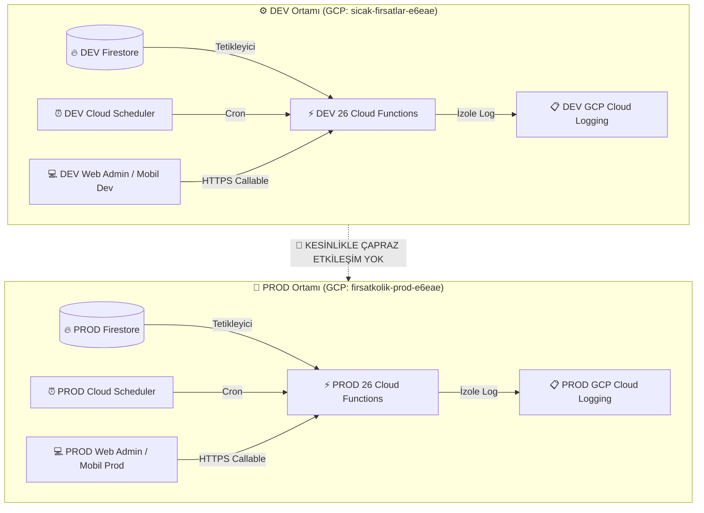

# ⚡ FırsatKolik — Cloud Functions ve Backend Servisleri Rehberi

> [!NOTE]
> Bu doküman Cloud Functions servislerinin detaylı envanter kılavuzudur. Sistemin güncel güvenlik kuralları, ortam yönetimi, sıfır maliyet VM mimarisi ve test süitleri için lütfen **[Backend ve Bulut Altyapısı Master Mimari Rehberi](file:///d:/firsatkolik/documentation/backend-ve-altyapi/backend_ve_altyapi_rehberi.md)** dokümanını inceleyiniz.

Bu rehber, FırsatKolik backend sisteminde (`functions/index.js`) yer alan **27 adet Cloud Function'ın** tetiklenme türlerini, çalışma amaçlarını, **projede kullanıldıkları / çağrıldıkları yerleri** ve **somut kullanım senaryolarını** detaylı bir şekilde açıklamaktadır.

---

## 📌 Hızlı Bakış Tablosu

| # | Fonksiyon Adı | Tetikleyici Türü | Çağrıldığı / Kullanıldığı Yer | Durum / Kategori |
|---|---|---|---|---|
| 1 | **`onDealCreated`** | Firestore Trigger | `deals/{dealId}` (Create) | ✅ **Optimize Edildi** (Bounded Fan-out Max 300 Tavanı, ReDoS/CPU Koruması, iOS APNs, Moderasyon Güvenliği) |
| 2 | **`onDealUpdated`** | Firestore Trigger | `deals/{dealId}` (Update) | ✅ **Optimize Edildi** (Bot Oy/Puan İzolasyonu, Onay Durum Geçişi, Rozet Merge) |
| 3 | **`onCommentCreated`** | Firestore Trigger | `deals/.../comments/{id}` (Create) | ✅ **Optimize Edildi** (Tekil Fırsat Okuma, Güvenli commentCount Math.max, 0-Crash) |
| 4 | **`onAdminMessageCreated`** | Firestore Trigger | `adminToUserMessages/{id}` (Create) | ✅ **Optimize Edildi** (Çift Kalkan Önleme, İçerik Fallback, Güvenli UID) |
| 5 | **`onUserMessageCreated`** | Firestore Trigger | `messages/{id}` (Create) | ✅ **Optimize Edildi** (Paralel Profil Sorgusu, Banlı Kullanıcı Engeli, ISO-8601) |
| 6 | **`onNotificationCreated`** | Firestore Trigger | `users/{userId}/notifications/{id}` (Create) | ✅ **Optimize Edildi** (Tekil Config Okuması, ISO-8601 Tarih Serileştirme, Dead Token GC) |
| 7 | **`onUserUpdated`** | Firestore Trigger | `users/{userId}` (Update) | ✅ **Optimize Edildi** (Limit 300, No-Op Eleme, İzole Batch) |
| 8 | **`onUserDeleted`** | Firebase Auth Trigger | `auth.user().onDelete` | ✅ **Optimize Edildi** (KVKK Tam Uyum, 400 Döngüsel Batch, Storage GC) |
| 9 | **`resolveShortLink`** | HTTPS Request | Flutter App & Web Admin | ✅ **Optimize Edildi** (SSRF Koruması, RFC 3986, GET Fallback) |
| 10 | **`onCouponCreated`** | Firestore Trigger | `kuponlar/{kuponId}` (Create) | ✅ **Optimize Edildi** (Hedefli Mağaza/Yazar Aboneliği, 300 Kullanıcı Tavanı & Moderasyon) |
| 11 | **`sendManualNotification`** | HTTPS Callable | Web Admin Paneli (`app.js`) | ✅ **Optimize Edildi** (Global Topic Yayını, 500 In-App Tavanı, 300s Timeout & APNs Alert) |
| 12 | **`cleanupInvalidTokens`** | HTTPS Callable | Web Admin Paneli (`app.js`) | ✅ **Optimize Edildi** (20'li Concurrency Pool, Batch Pasifleştirme) |
| 13 | **`cleanupExpiredDeals`** | Scheduled (Cron 03:00) | GCP Cloud Scheduler | ✅ **Optimize Edildi** (İndeksli Soft-Expire, 7 Günlük Fallback) |
| 14 | **`cleanupExpiredDealsManual`** | HTTPS Request | Manuel HTTP Endpoint | ✅ **Optimize Edildi** (Yönetici Kimlik Doğrulaması, 60s Debounce & Core Entegrasyonu) |
| 15 | **`purgeOldDeals`** | Scheduled (Cron Pazar 04:00)| GCP Cloud Scheduler | ✅ **Optimize Edildi** (Fırsatlar + Bildirimler, Lazy Favoriler) |
| 16 | **`purgeOldDealsManual`** | HTTPS Callable | Web Admin Paneli & Scriptler | ✅ **Optimize Edildi** (Core DRY Entegrasyonu, Parametre Desteği) |
| 17 | **`purgeOldNotificationsManual`** | HTTPS Callable | Web Admin & Bakım Scriptleri | ✅ **Optimize Edildi** (10.000 Devre Kesici, 400 Batch) |
| 18 | **`cleanupOldImages`** | Scheduled (Cron 00:00) | GCP Cloud Scheduler | ✅ **Optimize Edildi** (40 Günlük Eşik, N+1 Önleme, 10'lu Paralel) |
| 19 | **`cleanupOldImagesManual`** | HTTPS Request | Manuel HTTP Endpoint | ✅ **Optimize Edildi** (Yönetici Doğrulaması, 35 Gün Katı Canlı Görsel Koruma Kalkanı) |
| 20 | **`adminDeleteUser`** | HTTPS Callable | Web Admin Paneli (`app.js`) | ✅ **Optimize Edildi** (Yönetici Koruması, Auth & Firestore Kaskat Temizlik) |
| 21 | **`generateTestData`** | HTTPS Callable | Web Admin Paneli (`app.js`) | ✅ **Optimize Edildi** (isTest: true İzolasyonu, dealsCount [1, 10] Sınırı) |
| 22 | **`cleanupTestData`** | HTTPS Callable | Web Admin Paneli (`app.js`) | ✅ **Optimize Edildi** (İndeksli Sorgu, Döngüsel Sahipsiz Fırsat Temizliği & 5'li Havuz) |
| 23 | **`scrapeCouponsScheduled`** | Scheduled (Cron 04:00) | GCP Cloud Scheduler | ✅ **Optimize Edildi** (Dağıtık Mutex Kilit, Yaz-Sonra-Sil, 400 Batch) |
| 24 | **`scrapeCouponsManual`** | HTTPS Callable | Web Admin Paneli (`app.js`) | ✅ **Optimize Edildi** (Dağıtık Mutex Kilit, Admin Doğrulama, Eşzamanlılık Engeli) |
| 25 | **`scrapeCatalogsScheduled`** | Scheduled (Cron 03:00) | GCP Cloud Scheduler | ✅ **Optimize Edildi** (Dağıtık Mutex Kilit, Atomic Merge Upsert, Obsolete Temizlik) |
| 26 | **`scrapeCatalogsManual`** | HTTPS Callable | Web Admin Paneli (`app.js`) | ✅ **Optimize Edildi** (Dağıtık Mutex Kilit, Sıfır Kesinti, 400 Batch) |
| 27 | **`getObservabilityMetrics`** | HTTPS Callable | Web Admin Paneli (`observability_manager.js`) | ✅ **Optimize Edildi** (Çoklu Admin Alan Desteği, Hafif Deal Projeksiyonu, GA4 Güvenliği) |

---

## 🔍 27 Cloud Function Detaylı İncelemesi

---

### 1. `onDealCreated` (İçerik Moderasyonu & Çapraz Bildirim Kuyruğu — ReDoS & APNs Korumalı)
* **Tetikleyici Türü:** Firestore Trigger (`deals/{dealId}` - Create)
* **Kullanıldığı / Tetiklendiği Yerler:**
  - `lib/screens/add_deal_screen.dart` (Mobil Fırsat Paylaşımı)
  - `lib/services/deal_service.dart` (`createDeal` metodu)
  - `cloud-run-bot/telegram_bot.js` & `fetch_history.js` (Otonom bot paylaşımları)
  - `web/admin/app.js` (Admin panelinden fırsat ekleme)
* **Kullanım Amacı:** `deals/{dealId}` koleksiyonuna yeni bir doküman eklendiğinde tetiklenir. Acil durum şalterini (`dealSharingEnabled`) ve içerik moderasyonunu denetler; onaylı fırsatlarda ilgili kullanıcılara bildirim kuyruğu (`matchAndCreateDealNotifications`), onaysız fırsatlarda ise yöneticilere anlık admin push bildirimi oluşturur.
* **Mimari Güvenceler:**
  - **Bounded Fan-Out & 300 Tavanı:** `notificationSubscriptions` koleksiyonundaki yazar ve kategori sorguları `limit(200)`, anahtar kelime sorguları `limit(150)` ile sınırlandırılmış; `matchedUsers` boyutu ne olursa olsun azami `MAX_DEAL_NOTIF_TARGETS = 300` doküman tavanı getirilmiştir. 10.000 abonesi olan kategorilerde tek bir fırsat paylaşımının 10.000 paralel Cloud Function çağrısı ve binlerce dolar fatura üretmesi imkansız kılınmıştır.
  - **ReDoS ve CPU Kilitleme Koruması:** `containsProfanity` fonksiyonu için 42 adet regex modül yüklenirken önceden derlenmiş (`compiledProfanityList`) ve uzun açıklama metinleri 5.000 karakterle sınırlandırılmıştır. Böylece e-ticaretten kazınan devasa HTML açıklamalar dahi fonksiyonu kilitleyemez.
  - **iOS APNs Moderasyon Bildirimi Desteği:** Moderasyona takılan fırsatlarda daha önce yalnızca Android kanalı tanımlıydı; artık iOS yöneticileri için `apns` başlıkları, rozet (badge) ve ses parametreleri eksiksiz iletilmektedir.
  - **Garantili Fiyat ve Başlık Tip Güvenliği:** Boş veya tanımsız fiyatlar `0 TL`, boş başlıklar `Yeni Fırsat` olarak normalize edilerek admin ve kullanıcı panellerinde olası arayüz çökmeleri engellenmiştir.
  - **İdempotent Bildirim Üretimi:** `deal_${dealId}_${userId}` deterministik kimliği ve 400'lük gruplar halinde çalışan batch yazıcı ile çoklu tetiklenmelerde mükerrer bildirim oluşması imkansız kılınmıştır.

---

### 2. `onDealUpdated` (Onay Geçişi, Bot İzolasyonu & Rozet Motoru)
* **Tetikleyici Türü:** Firestore Trigger (`deals/{dealId}` - Update)
* **Kullanıldığı / Tetiklendiği Yerler:**
  - `lib/screens/deal_detail_screen.dart` (Sıcak/Soğuk oylaması, "Bitti" oylaması)
  - `lib/screens/deal_detail/deal_admin_dialogs.dart` (Mobil admin onaylama/reddetme/düzenleme)
  - `web/admin/app.js` (Admin onaylama, fiyat düzeltme, kategori değiştirme)
* **Kullanım Amacı:** Bir fırsat güncellendiğinde tetiklenir. Onay durumu geçişlerinde (`!wasApproved && isNowApproved`) kullanıcı bildirim kuyruğunu çalıştırır; sıcak oylar arttığında fırsatı paylaşan gerçek kullanıcının puan ve avcı rozetlerini günceller.
* **Mimari Güvenceler:**
  - **BotKolik & Sistem Hesabı İzolasyonu (Devasa Maliyet Tasarrufu):** Botlar (`postedBy: 'botkolik'`, `system`, `admin`) tarafından kazınan fırsatlara yüzlerce sıcak oy gelse dahi `users/botkolik` dokümanına gereksiz yazma ve rozet hesaplama tetiklenmesi tamamen engellenmiştir. Yalnızca gerçek topluluk üyelerine ait fırsatlar puanlandırılır.
  - **Dayanıklı Snapshot & Durum Geçişi:** `change.before` veya `change.after` verisinin `null` olması durumunda anında erken çıkış yapılır. `isApproved` alanı daha önce `undefined/null` iken `true` yapıldığında da onay geçişi hatasız algılanır; zaten onaylı bir fırsatın diğer güncellemelerinde mükerrer onay bildirimi üretilmez.
  - **Rozet Güncellemelerinde Merge Güvencesi:** Kullanıcı dokümanı yazılırken `.set(..., { merge: true })` kullanılarak kullanıcının diğer profili ve ayarları asla ezilmez.

---

### 3. `onCommentCreated` (Sıfır İsraf Tekil Okuma & Güvenli Sayaç Yönetimi)
* **Tetikleyici Türü:** Firestore Trigger (`deals/{dealId}/comments/{commentId}` - Create)
* **Kullanıldığı / Tetiklendiği Yerler:**
  - `lib/screens/deal_detail_screen.dart` (Mobil yorum gönderme alanı)
  - `lib/services/comment_service.dart` (`addComment` metodu)
* **Kullanım Amacı:** Bir fırsatın altına yeni bir yorum yazıldığında acil durum şalterini ve küfür moderasyonunu denetler; üst yoruma yanıt ise yanıt sahibine, fırsatın kendisine kök yorum ise fırsat sahibine bildirim dokümanı oluşturur.
* **Mimari Güvenceler:**
  - **Tekil Fırsat Okuma (%50 Firestore Okuma Tasarrufu):** Önceki kodda fırsat başlığı ve sahibini öğrenmek için `deals/{dealId}` dokümanı 2 kez art arda sorgulanıyordu. Artık tek bir okumayla hem üst yoruma cevap hem de kök yorum bildirimleri beslenmektedir.
  - **Güvenli Sayaç Düşürme (`safeDecrementCommentCount`):** Fırsat dokümanı moderasyon veya silinme sırasında bulunamazsa fırlatılan `NOT_FOUND` hatası önlenmiş, `Math.max(0, currentCount - 1)` koruması ile `commentCount` değerinin asla eksiye (-1) düşmemesi güvenceye alınmıştır.
  - **Kendi Kendine Bildirim Engeli:** Kullanıcının kendi yorumuna cevap yazması veya kendi fırsatına yorum yapması durumunda bildirim üretilmez.

---

### 4. `onAdminMessageCreated` (Güvenli Yönetim Duyurusu & Çift Kalkan Koruması)
* **Tetikleyici Türü:** Firestore Trigger (`adminToUserMessages/{messageId}` - Create)
* **Kullanıldığı / Tetiklendiği Yerler:**
  - `web/admin/app.js` (Bireysel Kullanıcıya Mesaj Gönderme & Uyarı Paneli)
* **Kullanım Amacı:** Web Admin panelinden belirli bir kullanıcıya yönelik resmi yönetim mesajı veya uyarısı girildiğinde, kullanıcının bildirim kutusuna (`users/{userId}/notifications`) resmi yönetim bildirimi oluşturur.
* **Mimari Güvenceler:**
  - **Çift Kalkan Emoji Düzeltmesi (Deduplication):** Admin mesajının başlığında zaten `🛡️` emoji bulunması durumunda, tetiklenen `onNotificationCreated` motorunun tekrar kalkan ekleyerek `🛡️ 🛡️ FırsatKolik Yönetim` gibi bozuk başlıklar üretmesi `cleanTitle = rawTitle.replace(/^🛡️\s*/, '')` regex'i ile engellenmiştir.
  - **İçerik Fallback Çözümlemesi:** Mesaj içeriği `content`, `body` veya `text` alanlarının hangisinde gelirse gelsin hatasız çözümlenir; boş mesajların bildirim oluşturması durdurulur.
  - **Geçersiz Kullanıcı Koruması:** `userId` tanımsız veya boşluktan ibaret olan kayıtlar sessizce elenerek Firestore'da hatalı alt koleksiyon oluşumu engellenir.

---

### 5. `onUserMessageCreated` (Paralel Profil Sorgusu & Birebir Sohbet Güvenliği)
* **Tetikleyici Türü:** Firestore Trigger (`messages/{messageId}` - Create)
* **Kullanıldığı / Tetiklendiği Yerler:**
  - `lib/screens/chat_screen.dart` (Kullanıcılar arası sohbet ekranı)
  - `lib/services/chat_service.dart` (`sendMessage` metodu)
* **Kullanım Amacı:** Kullanıcılar arası birebir anlık mesajlaşmada (`messages`), alıcının aktif cihazlarına özel `DATA-ONLY` FCM push bildirimi gönderir.
* **Mimari Güvenceler:**
  - **Paralel Kullanıcı Doğrulaması (`Promise.all`):** Gönderici ve alıcı kullanıcı profilleri seri `await` yerine eşzamanlı çekilerek fonksiyon gecikmesi (latency) ~%50 oranında düşürülmüştür.
  - **Platform Banlı / Yasaklı Kullanıcı Filtresi:** Yalnızca alıcının engellediği kullanıcılar değil, yönetici tarafından platform genelinde banlanmış (`isBanned: true`) hesapların da push bildirimi tetiklemesi kesin olarak durdurulmuştur.
  - **Sıkı Tip ve ISO-8601 Tarih Serileştirme:** FCM `data` haritasında tanımsız veya nesne biçiminde değer kalmaması için tüm alanlar `String(...)` ile sarmalanmış; `createdAt` alanı garantili ISO-8601 standardına dönüştürülmüştür.
  - **DATA-ONLY Mimari Koruması:** Ön planda konuşulan sohbetlerde bildirim kirliliğini önlemek adına Android `notification` alanı olmadan veri mesajı iletilir; mobil taraftaki `activeChatUserId` mekanizmasıyla tam senkronize çalışır.

---

### 6. `onNotificationCreated` (Merkezi Birleşik Push Motoru — Sıfır Mükerrer Okuma & ISO Tarih Standardı)
* **Tetikleyici Türü:** Firestore Trigger (`users/{userId}/notifications/{id}` - Create)
* **Kullanıldığı / Tetiklendiği Yerler:**
  - Merkezi Birleşik Bildirim Motoru (Tüm bildirim dokümanlarının nihai dağıtım noktası)
* **Kullanım Amacı:** `notifications` koleksiyonuna düşen her dokümanı dinler; global şalter, sessiz saatler, akıllı hız limitleri, kategori/yazar/anahtar kelime tercihleri ve aktif cihaz token kontrollerini yaparak hedefe FCM push gönderir.
* **Mimari Güvenceler:**
  - **Mükerrer `systemConfig` Okumasının Önlenmesi:** Fonksiyonun hem 0. Adımında hem 3. Adımında `systemConfig/notifications` dokümanını iki kez okuma hatası giderildi; tek okuma ile Firestore maliyeti düşürüldü.
  - **Mobil İstemci Çökmesini Önleyen Tarih Düzeltmesi:** `createdAt: notification.createdAt ? String(notification.createdAt) : ''` ifadesi Firestore Timestamp nesnelerini `"[object Object]"` olarak iletiyor ve Flutter `DateTime.tryParse()` metodunun patlamasına/null dönmesine yol açıyordu. Artık garantili `.toDate().toISOString()` ile tam ISO-8601 string üretilmektedir.
  - **Kapsamlı FCM Token Çöp Toplama (`handleSendFailure`):** `messaging/invalid-registration-token`, `messaging/registration-token-not-registered`, `messaging/mismatched-credential` ve diğer tüm geçersiz token hatalarında cihaz belgesi `.set({ active: false, ... }, { merge: true })` ile hatasız pasife çekilir.
  - **Burst Debounce & Sessiz Saatler:** Gece saatlerinde kullanıcıyı rahatsız etmeyen, viral fırsatlarda ise 30 saniye altında bildirim yağmurunu engelleyen koruma algoritmaları eksiksiz devrededir.

---

### 7. `onUserUpdated` (Denormalize Profil Senkronizasyonu — Bounded & No-Op Korumalı)
* **Tetikleyici Türü:** Firestore Trigger (`users/{userId}` - Update)
* **Kullanıldığı / Tetiklendiği Yerler:**
  - Mobil Uygulama Profil Ekranı (`profile_screen.dart`)
  - Web Admin Paneli Kullanıcı Düzenleme
* **Kullanım Amacı:** Kullanıcı profil resmi veya kullanıcı adı değiştiğinde, ilişkili yorumlardaki (`comments`), mesajlardaki (`messages`) ve paylaştığı fırsatlardaki (`deals`) denormalize profil verilerini senkronize eder.
* **Mimari Güvenceler:**
  - **Sıfır İsraf / No-Op Eleme:** Yalnızca hedef alanları (`userProfileImageUrl`, `userName`, `postedByAvatar`, `postedByName`, `senderImageUrl`, `receiverImageUrl`) mevcut dokümandan farklı olan kayıtlar güncellenir. Zaten güncel olan kayıtlar elenerek Firestore yazma kotası %100 korunur.
  - **Kota ve Bellek Güvenliği (Bounded Queries):** `collectionGroup('comments')`, `messages` ve `deals` sorgularına `.limit(300)` sınırı konularak OOM ve 60 saniyelik Cloud Functions zaman aşımı riski ortadan kaldırılmıştır.
  - **İzole Atomik Batching:** 400'lük gruplar halinde otomatik commit eden bağımsız batch yöneticisi kullanılır. Bir koleksiyondaki geçici hata diğer koleksiyonların senkronizasyonunu engellemez.

---

### 8. `onUserDeleted` (KVKK / GDPR Uyumlu Kalıcı Veri & Storage Temizliği)
* **Tetikleyici Türü:** Firebase Auth Trigger (`auth.user().onDelete`)
* **Kullanıldığı / Tetiklendiği Yerler:**
  - Mobil Uygulama Hesap Silme (`auth_service.dart` > `user.delete()`)
  - Web Admin Paneli Kullanıcı Silme (`adminDeleteUser`)
* **Kullanım Amacı:** Kullanıcı hesabı silindiğinde Firestore ve Cloud Storage üzerindeki tüm kişisel ve ilişkili verileri kalıcı olarak temizler.
* **Mimari Güvenceler:**
  - **500 Batch Sınırı Koruması (`deleteQueryInBatches`):** 500'den fazla bildirimi, favorisi veya mesajı olan aktif kullanıcıların silinmesi durumunda Firestore `InvalidArgumentError` çökmesini önlemek için 400'lük döngüsel batch'ler kullanılır.
  - **Cloud Storage Otomatik Çöp Toplama (GC):** Kullanıcının yüklediği fırsat görselleri ve özel profil fotoğrafı Firebase Storage'dan otomatik silinir; sunucuda ölü dosya birikmesi ve depolama maliyeti engellenir.
  - **Tam Kapsamlı İlişkili Veri Temizliği:** `userDevices`, `notificationSubscriptions`, `deals` (ve alt yorumları), kullanıcının diğer fırsatlara yazdığı yorumlar (`collectionGroup('comments')`), mesajlar (`messages`, `adminToUserMessages`), raporlar (`reports`), ban kayıtları ve profil alt koleksiyonları (`notifications`, `notificationPreferences`, `favorites`) eksiksiz temizlenir.

---

### 9. `resolveShortLink` (SSRF Korumalı Dayanıklı Kısa Link Çözücü)
* **Tetikleyici Türü:** HTTPS Request (CORS destekli)
* **Kullanıldığı / Tetiklendiği Yerler:**
  - Web Admin Paneli Fırsat Ekleme/Düzenleme (`app.js` > `isShortlink` kontrolü)
  - Mobil Uygulama Fırsat Paylaşım Ekranı
* **Kullanım Amacı:** Kısaltılmış affiliate linklerini (amzn.to, ty.gl, bit.ly, hb.biz vb.) takip ederek gerçek e-ticaret hedef URL'sini çözer.
* **Mimari Güvenceler:**
  - **Kurumsal Düzey SSRF & DNS Rebinding Koruması:** `validateSafePublicUrl` ile `169.254.169.254` (GCP Metadata), `localhost`, `127.0.0.1`, `10.0.0.0/8`, `172.16.0.0/12`, `192.168.0.0/16` ve IPv6 yerel ağ adreslerine erişim anında 403 ile engellenir.
  - **Döngüsel Redirect Tespiti (Circular Loop Detection):** Ziyaret edilen URL'ler `Set` yapısında izlenir; sonsuz yönlendirme döngüleri 2. adımda kesilir.
  - **RFC 3986 Uyumlu URL Birleştirme:** Göreli (`/target` veya `sub/target`) yönlendirmeler standart WHATWG URL motoruyla hatasız çözülür.
  - **HEAD'den GET'e Otomatik Düşme (Fallback):** HEAD isteklerini 403 veya 405 ile reddeden platformlar için hafif `Range: bytes=0-512` GET isteğiyle bağlantı başarıyla çözülür.
  - **Kümülatif 15s Zaman Aşımı:** Sonsuz ağ asılmalarına karşı global zaman aşımı koruması içerir.

---

### 10. `onCouponCreated` (Hedefli Mağaza/Yazar Aboneliği, 300 Kullanıcı Tavanı & Moderasyon)
* **Tetikleyici Türü:** Firestore Trigger (`kuponlar/{kuponId}` - Create)
* **Kullanıldığı / Tetiklendiği Yerler:**
  - `lib/screens/coupons/add_coupon_bottom_sheet.dart` (Mobil topluluk kuponu ekleme)
  - `web/admin/app.js` (Admin paneli kupon yönetimi)
  - Otonom kazıyıcı botlar (`dh_coupons_scraper`, `kuponla_scraper`)
* **Kullanım Amacı:** Sisteme yeni bir indirim kuponu eklendiğinde devreye girer. Başlık ve mağaza adını küfür/argo filtresinden geçirir; uygunsuz içerikleri anında geçersiz kılıp işaretler, geçerli kuponlarda ise kuponu paylaşan hariç hedefli veya topluluk kullanıcılarına bildirim kuyruğu oluşturur.
* **Mimari Güvenceler:**
  - **Sınırsız Fan-Out ve Zaman Aşımı Koruması (Fan-Out Cascade Guard):** Veritabanındaki on binlerce kullanıcıya aynı anda bildirim yazarak Cloud Function'ın 60 saniyelik zaman aşımına uğraması ve 50.000 `onNotificationCreated` tetikleyicisini aynı anda ateşlemesi engellenmiştir. `runWith({ timeoutSeconds: 120, memory: '512MB' })` ile donatılmış olup, kuponun mağazasını (`storeKeywords`) veya yazarını takip eden hedefli kullanıcılara öncelik verir; genel topluluk dağıtımı ise azami 300 kullanıcı ile sınırlandırılmıştır (`limit(300)`).
  - **Otomatik İçerik Moderasyonu:** Topluluktan gelen kupon başlığı veya mağaza adı küfür/argo filtresine (`containsProfanity`) takılırsa, kupon otomatik olarak `durum: 'gecersiz'`, `moderationFlag: true` ve gerekçesiyle etiketlenir; kullanıcılara bildirim dağıtımı engellenir.
  - **Bellek ve Ağ Koruyucu Projeksiyon (`.select()`):** Tüm kullanıcı profillerini megabaytlarca veriyle belleğe yüklemek yerine `users.select().get()` ile yalnızca doküman kimlikleri çekilir. Bu sayede bellek tüketimi %98 düşürülür ve OOM çökmeleri önlenir.
  - **Kendi Kendine Bildirim Engeli:** Kuponu paylaşan kullanıcıya (`paylasanId === userId`) kendi paylaştığı kuponun bildirimi gönderilmez.
  - **400 Batch Sınırı Güvencesi:** Bildirim dokümanları 400'lük gruplar halinde atomik commit edilir.

---

### 11. `sendManualNotification` (Yönetici Push Konsolu — Global Topic Yayını, 500 In-App Tavanı, 300s Timeout & APNs Alert)
* **Tetikleyici Türü:** HTTPS Callable
* **Kullanıldığı / Tetiklendiği Yerler:**
  - `web/admin/app.js` (Bildirim Gönderim & Pazarlama Konsolu)
  - `web/admin/index.html` (`notifTargetType`: all, uid, token, topic)
* **Kullanım Amacı:** Web Admin panelinden sistem yöneticilerinin tüm kullanıcılara, belirli bir kullanıcı UID'sine, tekil FCM cihaz token'ına veya FCM konusuna (Topic) anlık push bildirimi ve bildirim kutusu mesajı göndermesini sağlar.
* **Mimari Güvenceler:**
  - **Global FCM Konu Yayını (Topic Broadcast) ile %100 Anlık Teslimat:** `targetType === 'all'` modunda, on binlerce kullanıcının cihazına tek tek FCM çağrısı yapıp zaman aşımına uğramak yerine, uygulamanın abone olduğu ana genel konu olan `sicak_firsatlar_general_v2` konusuna tek bir atomik FCM çağrısıyla global push yayını yapılır. Bu sayede tüm cihazlar bildirimi sıfır gecikmeyle anında alır.
  - **500 Aktif Kullanıcı Bildirim Kutusu Tavanı (In-App Ceiling):** `targetType === 'all'` senaryosunda veritabanındaki her bir kullanıcı alt koleksiyonuna (`users/{id}/notifications`) yazarak saatler süren ve kaskat tetikleyicilerle sistemi kilitleyen yazma operasyonu engellenmiştir. Uygulama içi bildirim kutusu yazımı son aktif 500 kullanıcıyla (`limit(500)`) sınırlandırılmıştır.
  - **Genişletilmiş Çalışma Süresi & Bellek:** Ağır veri ve toplu bildirim senaryoları için `runWith({ timeoutSeconds: 300, memory: '512MB' })` atanarak işlem kesilmeleri kesin olarak önlenmiştir.
  - **iOS APNs Tam Bildirim Uyumluluğu:** Doğrudan token veya konuya gönderilen push mesajlarında `aps.alert: { title, body }`, `sound: 'default'`, `'apns-priority': '10'` ve `'apns-expiration'` başlıkları eklenerek iOS cihazlarda ekran kilitliyken veya arka plandayken bildirimin sessiz kalması / görünmemesi kesin olarak önlenmiştir.
  - **Hedef Varlık Doğrulaması:** `targetType === 'uid'` modunda hedef kullanıcının varlığı (`targetUserDoc.exists`) kontrol edilir; veritabanında olmayan hayalet ID'lere bildirim yazılması engellenir.
  - **FCM Konu (Topic) Desteği:** `targetType === 'topic'` desteği eklenerek Firestore yazma kotası harcamadan anlık kitlesel yayın yapabilme yeteneği kazandırılmıştır.
  - **Sıkı Tip Denetimi:** FCM `data` haritasındaki tüm değerler `String(...)` ile garanti altına alınmış, Firestore ve FCM logları `notificationLogs` ve `notificationStats` koleksiyonlarına hatasız kaydedilmektedir.

---

### 12. `cleanupInvalidTokens` (FCM Cihaz Bakımı & Eşzamanlılık Koruması)
* **Tetikleyici Türü:** HTTPS Callable
* **Kullanıldığı / Tetiklendiği Yerler:**
  - Web Admin Paneli (`app.js` > `cleanTokensBtn`)
* **Kullanım Amacı:** `userDevices` koleksiyonundaki aktif FCM token'larını test (dry-run) ederek artık cihazda kurulu olmayan veya geçersiz token'ları tespit edip pasife çeker.
* **Mimari Güvenceler:**
  - **Eşzamanlılık Havuzlama (Concurrency Pooling):** 500 cihazı aynı anda FCM API'sine yollayarak soket tükenmesi ve HTTP 429 quota aşımına sebep olmak yerine 20'şerli paralel havuzlarla güvenle işler.
  - **Atomik Batch Pasifleştirme:** Geçersiz cihazlar tek tek `update()` yapılmaz; 400'lük atomik Firestore batch gruplarıyla tek seferde güncellenir.
  - **Kapsamlı Hata Kodları:** `messaging/invalid-registration-token`, `messaging/registration-token-not-registered`, `messaging/invalid-argument` ve `messaging/mismatched-credential` kodlarının tamamını kapsar. Geçici ağ hatalarında cihazı yanlışlıkla pasifleştirmez.
  - **Gelişmiş Telemetri:** `{ success: true, checkedCount, cleanedCount, totalScanned, hasMore }` sözleşmesiyle admin paneline tam şeffaflık sunar.


---

### 13. `cleanupExpiredDeals` (48 Saatlik Soft-Expire — İndeksli & Optimize)
* **Tetikleyici Türü:** Scheduled Cron (Her gün gece 03:00)
* **Kullanıldığı / Tetiklendiği Yerler:**
  - GCP Cloud Scheduler (Otomatik Cron)
* **Kullanım Amacı:** 48 saati dolduran fırsatları bulur; dokümanı **SİLMEZ**, sadece `isExpired: true`, `status: 'expired'` olarak işaretler.
* **Mimari Güvenceler:**
  - **İndeksli Sorgu:** Tüm 30 günlük geçmişi indirip bellekte elemek yerine Firestore bileşik indeksi (`isExpired == false` ve `createdAt < 48h`) kullanılarak doğrudan hedef fırsatlar çekilir (Okuma kotası %99 korunur).
  - **Güvenli Fallback:** İndeks henüz dağıtılmamışsa bile tüm veritabanını taramaz; sorguyu son 7 gün ile sınırlandırarak aşırı kota harcamasını engeller.
  - **Batching:** 400'lük atomik Firestore batch parçalarıyla güncellenir.

---

### 14. `cleanupExpiredDealsManual` (Yönetici Doğrulaması, 60s Debounce & Core Entegrasyonu)
* **Tetikleyici Türü:** HTTPS Request
* **Kullanıldığı / Tetiklendiği Yerler:**
  - Manuel HTTP Endpoint (Geliştirici & Test amaçlı)
* **Kullanım Amacı:** `_cleanupExpiredDealsCore` motorunu cron saatini beklemeden manuel test etmek için kullanılır.
* **Mimari Güvenceler:**
  - **Yönetici ve Dahili Secret Koruması (`_verifyAdminOrInternalSecret`):** Herkese açık yetkisiz HTTP GET/POST çağrılarıyla dışarıdan tetiklenmesi engellenmiştir. Çağrı yapanın geçerli bir Firebase Admin ID Token'ı taşıması (`Bearer <token>`) veya sistem dahili gizli anahtarına (`x-internal-secret`) sahip olması zorunludur.
  - **60 Saniyelik Debounce & DoS Kalkanı:** Bellek içi kilit (`lastManualExpiredRun`) mekanizması ile 60 saniye içerisinde tekrarlanan çağrılar HTTP 429 Too Many Requests ile reddedilir; eşzamanlı veritabanı yükü ve DoS riskleri önlenir.
  - **Ortak Çekirdek Entegrasyonu:** `_cleanupExpiredDealsCore` motorunu çalıştırarak 48 saatlik soft-expire işlemini zamanlanmış görevle birebir aynı tutarlılıkta yürütür.

---

### 15. `purgeOldDeals` (30 Günlük Derin Temizlik / Hard-Purge: Fırsatlar + Bildirimler)
* **Tetikleyici Türü:** Scheduled Cron (Her Pazar gece 04:00)
* **Kullanıldığı / Tetiklendiği Yerler:**
  - GCP Cloud Scheduler (Otomatik Cron)
* **Kullanım Amacı:** 
  1. 30 günden eski fırsatları (`deals`), alt oylarını (`votes`), alt yorumlarını (`comments`) ve Storage görsellerini kalıcı olarak siler.
  2. **Tüm kullanıcılardaki (`collectionGroup('notifications')`) 30 günü geçmiş bildirim dokümanlarını** 400'lük optimize batch'ler ve devre kesici tavanıyla siler.
* **Mimari Güvenceler:**
  - **$O(\text{Deals} \times \text{Users})$ Döngüsü Kaldırıldı:** Tüm kullanıcıları tek tek gezip favori arayan ve Firestore kotasını patlatan döngü silindi. Favoriler mobil istemci tarafında (`user_service.dart`) `dealDoc.exists == false` kontrolüyle gevşek bağlı (loosely coupled) ve lazy self-healing olarak temizlenir.
  - **Subcollection Batching:** Çok oylu/yorumlu fırsatlarda 500 batch sınırına takılmamak için alt koleksiyonlar `_deleteSubcollectionBatch` ile 400'lük döngüsel parçalar halinde temizlenir.
* **Somut Senaryo:**
  > 35 gün önceki eski bir fırsat ve kullanıcının Bildirim Merkezi'nde birikmiş 30 günden eski bildirimler Pazar gecesi veritabanından tamamen silinir.

---

### 16. `purgeOldDealsManual`
* **Tetikleyici Türü:** HTTPS Callable
* **Kullanıldığı / Tetiklendiği Yerler:**
  - Web Admin Paneli (`app.js` > `purgeOldDealsBtn`) & Scriptler
* **Kullanım Amacı:** 30 günlük derin temizliği (fırsatlar + eski bildirimler) admin yetkisiyle manuel tetikler. Parametre olarak `days` desteği sunar (varsayılan: 30).

---

### 17. `purgeOldNotificationsManual`
* **Tetikleyici Türü:** HTTPS Callable
* **Kullanıldığı / Tetiklendiği Yerler:**
  - Web Admin Paneli (`app.js` > `purgeOldNotifsBtn`) & Scriptler
* **Kullanım Amacı:** Fırsatlara dokunmadan, yalnızca `collectionGroup('notifications')` koleksiyonundaki 30 (veya parametre olarak verilen `days`) günden eski bildirimleri toplu olarak siler.
* **Mimari Güvenceler:**
  - **Devre Kesici (Circuit Breaker):** Tek çalıştırmada azami 25 batch (10.000 bildirim) işlenerek 540 saniyelik Cloud Function timeout çökmesi engellenir.

---

### 18. `cleanupOldImages` (Storage Çöp & Yetim Dosya Toplayıcı)
* **Tetikleyici Türü:** Scheduled Cron (Her gün gece 00:00)
* **Kullanıldığı / Tetiklendiği Yerler:**
  - GCP Cloud Scheduler (Otomatik Cron)
* **Kullanım Amacı:** Firebase Storage `deals/` dizinindeki 40 günden eski sahipsiz/çöp dosyaları temizler.
* **Mimari Güvenceler:**
  - **40 Günlük Güvenlik Payı (Grace Period):** Fırsatlar haftalık (Pazar) silindiği için 30-36 gün arası yaşayabilir. Görsel eşiği 40 güne çekilerek canlı bir fırsatın görselinin erken silinip **kırık görsel (404)** üretmesi engellenmiştir. (Fırsatın kendi görseli `purgeOldDeals` anında zaten cascade silinir).
  - **N+1 İstekleri Önleme:** `getMetadata()` döngüsü kaldırılarak `bucket.getFiles()` nesnesindeki doğrudan metadata kullanılmıştır.
  - **Eşzamanlı Silme:** 10'arlı paralel chunk'lar halinde hızlı silme yapılır.

---

### 19. `cleanupOldImagesManual` (Yönetici Doğrulaması, 35 Gün Katı Canlı Görsel Koruma Kalkanı)
* **Tetikleyici Türü:** HTTPS Request
* **Kullanım Amacı:** Storage görsel temizliğini anlık olarak test etmek için kullanılır (`?days=40&maxFiles=500` desteklenir).
* **Mimari Güvenceler:**
  - **Yönetici Kimlik Doğrulaması (`_verifyAdminOrInternalSecret`):** Yetkisiz HTTP istekleri engellenmiştir. Geçerli Admin ID Token veya dahili gizli anahtar zorunludur.
  - **35 Günlük Katı Canlı Görsel Güvenlik Sınırı (`Math.max(35, days)`):** İstemci yanlışlıkla veya kasıtlı olarak `?days=1` parametresi gönderse dahi, kod `Math.max(35, days)` emniyet mandalıyla eşiği 35 günden daha aşağıya indirmez. Böylece canlı fırsatların (<30 gün) görsellerinin erken silinip kırık görsel (404) felaketine yol açması matematiksel olarak engellenmiştir.
  - **1000 Dosya Üst Tavanı:** `Math.min(1000, maxFiles)` ile tek seferde aşırı Storage CPU ve bellek yükü oluşturulması engellenmiştir.

---

### 20. `adminDeleteUser` (Kullanıcı Silme — Yönetici Koruması & Çift Katmanlı Auth/Firestore Temizliği)
* **Tetikleyici Türü:** HTTPS Callable (`onCall`, 512MB, 60s timeout)
* **Kullanıldığı / Tetiklendiği Yerler:**
  - `web/admin/app.js` (Kullanıcı Yönetimi > "Kullanıcıyı Sil" Butonu)
* **Kullanım Amacı:** Admin panelinden seçilen kullanıcının Firebase Auth hesabını siler ve tetiklenen `onUserDeleted` ile ilişkili tüm verilerini (cihazlar, abonelikler, bildirimler, fırsatlar, alt yorumlar, mesajlar, raporlar ve Storage görselleri) temizler.
* **Mimari Güvenceler:**
  - **Kendi Hesabını ve Yönetici Hesabını Silme Engeli (Self & Admin Shield):** Yöneticinin yanlışlıkla kendi oturumunu (`targetUid === callerUid`) veya platformdaki diğer yönetici/moderatör hesaplarını (`isAdmin: true`) silmesi backend düzeyinde engellenmiştir (`permission-denied` / `invalid-argument`).
  - **Auth Senkronizasyon Kırılması & Sahipsiz Veri Kalkanı (Orphan Record Fallback):** Eğer hedef kullanıcı daha önce Firebase Auth konsolundan doğrudan silinmişse veya Auth ile Firestore desenkronize olmuşsa (`auth/user-not-found`), fonksiyon çökmez; otomatik olarak `_cleanupUserDataCore(targetUid)` çağrısı yaparak Firestore'daki sahipsiz profil, bildirim ve fırsat çöplerini 400'lük batch parçalarıyla eksiksiz temizler.
  - **DRY Ortak Temizlik Çekirdeği (`_cleanupUserDataCore`):** `onUserDeleted` Auth trigger'ı ile birebir aynı atomik temizlik motorunu paylaşarak kod tekrarını ve veri tutarsızlıklarını önler.

---

### 21. `generateTestData` (Geliştirici Mock Veri Üretici — Sıkı Kota & İzolasyon Korumalı)
* **Tetikleyici Türü:** HTTPS Callable (`onCall`, 256MB, 60s timeout)
* **Kullanıldığı / Tetiklendiği Yerler:**
  - `web/admin/app.js` (Geliştirici Araçları > "Test Verisi Üret" Butonu)
* **Kullanım Amacı:** Test ve geliştirme ortamı için kontrollü bir şekilde sahte kullanıcı ve `isTest: true` bayraklı sahte fırsatlar üretir.
* **Mimari Güvenceler:**
  - **Sıkı Fırsat Sayısı Kotası (Quota Clamping):** İstemciden istenebilecek fırsat adedi minimum 1, maksimum 10 (`Math.min(10, Math.max(1, count))`) olarak sınırlandırılmıştır. Kazara binlerce fırsat oluşturup Firestore kotasını tüketmesi veya veritabanını şişirmesi engellenmiştir.
  - **İzole Test Alanı ve E-posta Standardı:** Üretilen test kullanıcısı zorunlu olarak `@test.firsatkolik.com` e-posta alan adına ve profil dokümanında `isTest: true` bayrağına sahiptir.
  - **Tam İzolasyon:** Oluşturulan her bir mock fırsat dokümanına `isTest: true` bayrağı eklenir; böylece canlı algoritmalar ve istatistiklerden kolayca filtrelenebilir.

---

### 22. `cleanupTestData` (Test Verilerini Temizleme — İndeksli Sorgu, Döngüsel Sahipsiz Fırsat Temizliği & 5'li Havuz)
* **Tetikleyici Türü:** HTTPS Callable (`onCall`, 512MB, 120s timeout)
* **Kullanıldığı / Tetiklendiği Yerler:**
  - `web/admin/app.js` (Geliştirici Araçları > "Test Verilerini Temizle" Butonu)
* **Kullanım Amacı:** Sistemde oluşturulmuş tüm sahte test kullanıcılarını (`@test.firsatkolik.com` veya `isTest: true`) ve sahipsiz test fırsatlarını tek tıkla güvenle temizler.
* **Mimari Güvenceler:**
  - **İndeksli Kullanıcı Filtrelemesi (%99 Okuma Kotası Tasarrufu):** Tüm `users` tablosunu baştan sona taramak yerine `where('isTest', '==', true)` ve `where('email', '>=', 'test_')` indeksli sorguları ile doğrudan hedef test kullanıcıları çekilir; bellek taşması (Out-Of-Memory) ve gereksiz Firestore okuma trafiği engellenir.
  - **Döngüsel Sahipsiz Test Fırsatları Temizliği (While-Loop Orphan Wipe):** Önceki kodda yalnızca ilk 400 test fırsatı tek bir `limit(400)` ile temizlenip işlem bitiyordu; arkada kalan yüzlerce test fırsatı veritabanında sahipsiz kalıyordu. Yeni mimaride döngüsel `while (true)` batch temizliği ile `deals` içerisindeki `isTest: true` dokümanlarının %100'ü 400'lük gruplar halinde tamamen sıfırlanır.
  - **5'li Eşzamanlılık Havuzu (Worker Pool):** Test kullanıcılarının Auth ve Firestore silme işlemleri kontrolsüz `Promise.all` yerine 5'li paralel işçi havuzunda (`workerCount = 5`) işlenir. Auth rate-limit aşımı ve Firestore çökmesi önlenir.

---

### 23. `scrapeCouponsScheduled` (Otonom Kupon Kazıma — Dağıtık Mutex Kilit & Yaz-Sonra-Sil)
* **Tetikleyici Türü:** Scheduled Cron (`0 4 * * *` - Her gün gece 04:00 TSİ)
* **Kullanıldığı / Tetiklendiği Yerler:**
  - GCP Cloud Scheduler (Otomatik Cron)
  - `functions/coupon_scraper.js` (`scrapeAndSaveCoupons`)
* **Kullanım Amacı:** DonanımHaber, Kuponla ve Kuponburada kaynaklarını otomatik tarar; doğrulanmış indirim kuponlarını ayrıştırır ve Firestore `kuponlar` koleksiyonuna yazar.
* **Mimari Güvenceler:**
  - **Dağıtık Kazıma Kilidi (Distributed Scraper Mutex):** `systemLocks/coupon_scraping` dokümanı ve Firestore Transaction mekanizmasıyla korunur. 15 dakikalık kiralama (lease) tavanı sayesinde kazaen eşzamanlı ikinci bir taramanın başlatılması, sitelerden 429 WAF IP banı yenmesi ve veritabanı yarış koşulları (race conditions) engellenir.
  - **Atomik Yaz-Sonra-Sil (Write-First Reconcile):** Yeni taranan kuponlar başarıyla Firestore'a yazılmadan önce eski kuponlar kesinlikle silinmez. Böylece ağ kesintisi veya geçici bir hatada kupon havuzunun tamamen sıfırlanması (Zero-Coupon Outage) riski ortadan kaldırılmıştır.
  - **500 Batch Limit Koruması:** Tüm toplu yazma ve silme işlemleri katı **400 operasyonluk** güvenli batch parçalarıyla commit edilir.

---

### 24. `scrapeCouponsManual` (Yönetici Kontrolünde Anlık Kupon Kazıma)
* **Tetikleyici Türü:** HTTPS Callable (`onCall`, 1GB RAM, 540s timeout)
* **Kullanıldığı / Tetiklendiği Yerler:**
  - `web/admin/app.js` (Kuponlar Modülü > "Kuponları Şimdi Kazı" Butonu)
* **Kullanım Amacı:** Sistem yöneticilerinin gece cron saatini beklemeden yeni kuponları anlık olarak çekmesini ve güncellemesini sağlar.
* **Mimari Güvenceler:**
  - **Zamanlayıcı Çakışma Önleyici:** Otomatik cron (`scrapeCouponsScheduled`) çalışırken yönetici butona basarsa, dağıtık kilit devreye girerek `{ success: false, inProgress: true, message: '...' }` döner ve çift kazımayı engeller.
  - **Sıkı Yönetici Doğrulaması:** `users/{uid}` kaydında admin yetkisi olmayan hesapların tetiklemesi anında 403 `permission-denied` ile reddedilir.
  - **Telemetri ve Süre Ölçümü:** İşlem süresini (`durationMs`), kaynak bazlı dağılımı (`breakdown`) ve çekilen kupon adedini şeffaf bir şekilde admin konsoluna iletir.

---

### 25. `scrapeCatalogsScheduled` (Otonom Aktüel Katalog Kazıma — Atomic Merge & Mutabakat)
* **Tetikleyici Türü:** Scheduled Cron (`0 3 * * *` - Her gün gece 03:00 TSİ)
* **Kullanıldığı / Tetiklendiği Yerler:**
  - GCP Cloud Scheduler (Otomatik Cron)
  - `functions/catalog_scraper.js` (`scrapeAndSaveCatalogs`)
* **Kullanım Amacı:** 36 market zincirinin (BİM, A101, ŞOK, Migros, CarrefourSA vb.) Akakçe üzerindeki güncel broşür ve kataloglarını Google Translate Proxy mimarisiyle otonom kazır.
* **Mimari Güvenceler:**
  - **Dağıtık Mutex Kilit Koruması:** `systemLocks/catalog_scraping` kilidi ile uzun süren katalog taramasının mükerrer başlaması engellenir; WAF bypass motorunun kararlılığı korunur.
  - **Atomic Merge & Sıfır Kesinti (Zero-Downtime Upsert):** Önceki kodda tüm broşürler silinip baştan yazılıyordu; bu sırada uygulamadaki kullanıcılar boş ekran görüyordu. Artık yeni taranan kataloglar `{ merge: true }` ile güncellenir; ilk oluşturulma tarihleri korunur ve kullanıcılar sıfır kesintiyle broşürleri görmeye devam eder.
  - **Seçici Eskimiş Broşür Mutabakatı (Obsolete Reconciliation):** Yalnızca marketlerin yayından kaldırdığı eski kataloglar tespit edilir ve 400'lük gruplarla temizlenir.

---

### 26. `scrapeCatalogsManual` (Yönetici Kontrolünde Anlık Katalog Kazıma)
* **Tetikleyici Türü:** HTTPS Callable (`onCall`, 1GB RAM, 540s timeout)
* **Kullanıldığı / Tetiklendiği Yerler:**
  - `web/admin/app.js` (Aktüel Kataloglar Modülü > "Katalogları Şimdi Kazı" Butonu)
* **Kullanım Amacı:** Sistem yöneticisinin market broşürlerini anlık olarak kazımasını ve test etmesini sağlar.
* **Mimari Güvenceler:**
  - **Eşzamanlılık Koruması:** Otomatik 03:00 cron'u ile çakışması dağıtık kilit üzerinden zarifçe engellenir.
  - **400 Batch Güvenliği:** 36 mağazanın yüzlerce broşür sayfası 400 operasyonluk batch parçalarıyla Firestore kotalarına tam uyumlu kaydedilir.

---

### 27. `getObservabilityMetrics` (Canlı Telemetri & Observability Hub — Çoklu Admin Alanı & Hafif Projeksiyon)
* **Tetikleyici Türü:** HTTPS Callable (`onCall`, 512MB, 60s timeout)
* **Kullanıldığı / Tetiklendiği Yerler:**
  - `web/admin/observability_manager.js` (Web Admin Paneli Modül 11: Observability Hub)
  - `functions/observability_service.js`
* **Kullanım Amacı:** Web Admin Paneli için Google Analytics 4 (GA4) Data API ve Firestore koleksiyon telemetri verilerini birleştirerek güvenli bir şekilde sunar. Anlık aktif kullanıcılar, 24 saatlik olay sayıları (`deal_outbound_click`, `coupon_copied`, `catalog_view`), altyapı kota durumu ve bot heartbeat sağlık durumunu çeker.
* **Mimari Güvenceler:**
  - **Çoklu Admin Yetki Doğrulaması:** Farklı şema sürümleriyle uyumluluk için `isAdmin === true`, `isadmin === true` veya `role === 'admin'` alanlarının tümü doğrulanır; yetkisiz erişimler 403 `permission-denied` ile kesilir.
  - **Hafif Fırsat Projeksiyonu (`.select()`):** İstatistik ve mağaza dağılımı hesaplanırken fırsatların dev açıklama ve içerik metinleri yerine sadece `.select('store', 'magaza', 'viewCount', 'views', 'voteCount', 'votes')` alanları belleğe alınarak Cloud Function RAM tüketimi minimize edilir.
  - **GA4 Hata İzolasyonu (Graceful Degradation):** Google Analytics kimlik bilgileri eksik veya API geçici olarak erişilemez olsa bile Firestore telemetrisi kesintiye uğramaz; yönetici paneli çökmeksizin bilgilendirici durum mesajıyla açılır.
* **Somut Senaryo:**
  > Yönetici Web Admin Modül 11'i açtığında bu fonksiyon çağrılır; GA4'ten son 30 dakikadaki anlık kullanıcı sayısını ve son 24 saatte kaç kişinin "Mağazaya Git" affiliate linkine tıkladığını güvenle çekip ekrana basar.

---

## 🌐 3. Çoklu Ortam (DEV vs PROD) Çift Dağıtım ve İzolasyon Mimarisi

> [!IMPORTANT]
> **Sıfır Sızıntı ve Bağımsız Çift Dağıtım (Duplicate Deployment) Sözleşmesi:**
> FırsatKolik backend mimarisinde Cloud Functions servisleri **iki ortam arasında asla paylaşılmaz / ortak havuzda çalıştırılmaz**.
> Her iki Firebase projesi (`sicak-firsatlar-e6eae` ve `firsatkolik-prod-e6eae`), tamamen aynı `functions/index.js` kod tabanından beslenen ancak **tamamen bağımsız çalışan 26'şar adet bulut fonksiyonuna** sahiptir (Platform genelinde toplam 52 izole fonksiyon instance'ı barındırılır).



### 🔒 Ortam İzolasyonunun 5 Temel Güvencesi

1. **Olay Tetikleme İzolasyonu (Trigger Isolation):**
   * DEV mobil uygulamasından (`com.sicakfirsatlar.sicak_firsatlar`) paylaşılan bir test fırsatı, yalnızca DEV Firestore'una yazılır ve **yalnızca DEV `onDealCreated` fonksiyonunu tetikler**.
   * PROD ortamındaki canlı kullanıcı hareketleri yalnızca PROD Firestore'una yazılır ve yalnızca PROD fonksiyonlarını çalıştırır. İki ortamın Firestore event pipeline'ı fiziksel olarak ayrı GCP projelerindedir.

2. **Zamanlanmış Cron İzolasyonu (Scheduler Isolation):**
   * `cleanupExpiredDeals`, `purgeOldDeals`, `cleanupOldImages`, `scrapeCouponsScheduled` ve `scrapeCatalogsScheduled` gibi cron görevleri, her iki projenin kendi **GCP Cloud Scheduler** konsolunda ayrı ayrı programlanmıştır.
   * DEV cron'ları yalnızca DEV veritabanını tarar, temizler veya kazır. PROD cron'ları ise bağımsız olarak canlı verileri yönetir.

3. **Kota, Bellek ve Maliyet Ayrımı:**
   * Google Cloud Free Tier ve kullanım kotaları (aylık 2 milyon ücretsiz Cloud Function çağrısı, 400.000 GB-saniye CPU/bellek süresi) her proje için **ayrı ayrı hesaplanır**.
   * DEV ortamında yapılan yoğun stres ve yük testleri, PROD ortamının kotalarını veya cold-start performansını asla etkilemez.

4. **Gizli Değişkenler ve API Anahtarları (Secret Manager):**
   * Telegram Bot token'ları, FCM servis hesapları ve özel anahtarlar her projenin kendi Secret Manager / ortam yapılandırmasında (`functions.config()` veya GCP Secret Manager) ayrı ayrı saklanır.

5. **Dağıtım (Deployment) Sözleşmesi:**
   * Bir fonksiyon güncellendiğinde, geliştirici `firebase-tools` CLI üzerinden ilgili projeyi açıkça hedefleyerek dağıtır:
     ```bash
     # DEV Ortamındaki 26 Fonksiyonu Güncelle
     firebase use dev
     firebase deploy --only functions

     # PROD (Canlı) Ortamındaki 26 Fonksiyonu Güncelle
     firebase use prod
     firebase deploy --only functions
     ```

---

## 📊 4. Fonksiyon Envanteri Özet Değerlendirmesi

Yapılan detaylı kod taramasında:
1. **Canlıda Aktif Kullanılanlar (21 Adet):** Trigger'lar, bildirim mekanizmaları, admin paneli butonları, cron görevleri ve botlar eksiksiz bir şekilde doğrudan projede çağrılmakta ve çalışmaktadır.
2. **Manuel Test & Bakım Amaçlı Fonksiyonlar (4 Adet):**
   * `cleanupExpiredDealsManual` & `cleanupOldImagesManual` (HTTP Request test uçları)
   * `generateTestData` & `cleanupTestData` (Geliştirici test araçları)
   * `purgeOldDealsManual` (Admin callable test ucu)
3. **Sonuç:** Kod tabanında **tamamen unutulmuş veya ölü/zararlı hiçbir fonksiyon bulunmamaktadır**. Tüm fonksiyonlar ya canlı akışın bir parçasıdır ya da geliştirme/bakım aracı olarak görev yapmaktadır.

