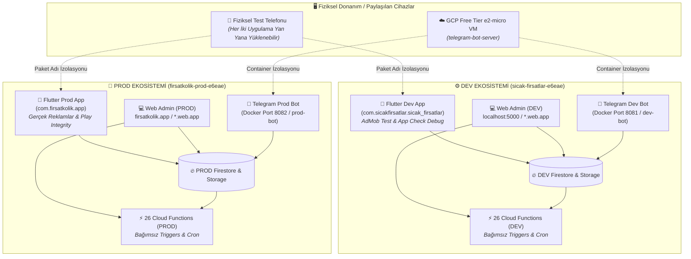

# ⚙️ FırsatKolik — Ortam Yönetimi ve Canlıya Geçiş Kılavuzu (Environment Management)

> [!NOTE]
> Bu doküman Ortam Yönetimi ve Canlıya Geçiş operasyonel el kitabıdır. Ortamlar arası 18 noktalı denetim ve periyodik eşitleme adımları için lütfen **[DEV vs PROD Eşitleme, Denetim ve Senkronizasyon Kılavuzu](file:///d:/firsatkolik/documentation/backend-ve-altyapi/dev_prod_synchronization_and_audit_guide.md)** belgesini, altyapı detayları için **[Backend ve Bulut Altyapısı Master Mimari Rehberi](file:///d:/firsatkolik/documentation/backend-ve-altyapi/backend_ve_altyapi_rehberi.md)** dokümanını inceleyiniz.

Bu doküman, FırsatKolik projesinde Geliştirme (DEV) ve Canlı (PROD) ortamlarının mobil, web, cloud functions ve bot katmanlarında nasıl yönetileceğini ve hangi komutlarla operasyon yapılacağını açıklayan operasyonel el kitabıdır.

---

## 🏗️ 1. Sıfır Sızıntı (Zero-Leakage) Bütüncül Ekosistem Mimarisi

FırsatKolik platformunda Geliştirme (**DEV**) ve Canlı (**PROD**) ortamları, veritabanından bulut fonksiyonlarına, mobil istemciden sunucu botlarına kadar **birbirinden tamamen izole edilmiş iki bağımsız ekosistem** olarak çalışır. İki ortam arasında hiçbir veri, kota, anahtar veya işlem sızıntısı (leakage) yaşanmaz.



---

## 📱 2. MOBİL UYGULAMA (Flutter) Yönetimi

Mobil uygulama, kod tabanında el ile müdahaleye gerek kalmadan derleme anındaki **flavor** parametreleri ile ortamını belirler. İki ortamın Android Paket Adı (Application ID) farklı olduğundan, **geliştirici veya test kullanıcısı aynı fiziksel telefona hem DEV hem de PROD uygulamasını aynı anda yükleyebilir ve yan yana kullanabilir.**

### 🔸 DEV (Geliştirme / Test) Modu
*   **Amaç:** Bilgisayarda geliştirme yaparken, emülatörde veya test telefonunda test etmek.
*   **Çalıştırma Komutu:**
    ```bash
    flutter run -d <cihaz_id> --flavor dev --dart-define=FLAVOR=dev
    ```
*   **Özellikleri:**
    - Uygulama adı: **FırsatKolik Dev**
    - Paket adı: `com.sicakfirsatlar.sicak_firsatlar`
    - Firebase Projesi: `sicak-firsatlar-e6eae` (DEV)
    - AdMob: Otomatik **Google Test Reklamları** gösterilir (Hesabınız banlanmaz).
    - App Check: **Debug Provider** (Logcat'ten alınan debug tokenlar) ile çalışır.

### 🔸 PROD (Canlı / Production) Modu
*   **Amaç:** Google Play Store'a yüklenecek paketi üretmek veya gerçek telefonunuzda canlı verileri test etmek.
*   **Google Play Store (AAB) Derleme Komutları:**
    ```bash
    # 1. Shorebird Code-Push Destekli AAB Derleme (Tavsiye Edilen)
    shorebird release android --flavor prod -t lib/main.dart

    # 2. Standart AAB Derleme
    flutter build appbundle --flavor prod --dart-define=FLAVOR=prod --release
    ```
    *(Detaylı Code-Push kılavuzu için bkz: [Flutter Canlı Kod Güncelleme Rehberi](file:///d:/firsatkolik/documentation/mobil-ve-ui/flutter_live_code_push_and_hot_reload_strategies.md))*
*   **Kendi Cihazınızda Canlı Test Komutu:**
    ```bash
    flutter run -d <cihaz_id> --flavor prod --dart-define=FLAVOR=prod
    ```
*   **Özellikleri:**
    - Uygulama adı: **FırsatKolik**
    - Paket adı: `com.firsatkolik.app`
    - Firebase Projesi: `firsatkolik-prod-e6eae` (PROD)
    - AdMob: Kodda tanımlanmış olan **Gerçek Reklamlar** gösterilir.
    - App Check: **Play Integrity** (Google Play Store güvenliği) ile çalışır.

---

## ⚡ 3. BULUT FONKSİYONLARI (Cloud Functions) Yönetimi

> [!IMPORTANT]
> **Çift Dağıtım (Duplicate Architecture):** Cloud Functions servisleri DEV ve PROD arasında **ortak havuzda çalışmaz**. Her iki Firebase projesine bağımsız 26 fonksiyon dağıtılır (toplam 52 bağımsız fonksiyon).

* **Trigger İzolasyonu:** DEV projesinde bir fırsat paylaşıldığında sadece DEV projesinin `onDealCreated` fonksiyonu tetiklenir. PROD fonksiyonları uyanmaz.
* **Cron İzolasyonu:** `cleanupExpiredDeals`, `purgeOldDeals`, kupon/katalog kazıyıcı cron'ları her projenin kendi GCP Cloud Scheduler motorunda izole çalışır.
* **Kota ve Log İzolasyonu:** DEV stres testleri PROD kotalarını veya cold-start performansını etkilemez. Cloud Logging kayıtları iki ayrı proje altında toplanır.
* **Dağıtım Komutları:**
  ```bash
  # DEV Fonksiyonlarını Güncelle
  firebase use dev
  firebase deploy --only functions

  # PROD Canlı Fonksiyonlarını Güncelle
  firebase use prod
  firebase deploy --only functions
  ```

---

## 🤖 4. TELEGRAM BOTU VE KAZIYICILAR (Compute Engine VM)

Otonom kazıyıcı botlar, Google Cloud Free Tier `e2-micro` sanal makinesi (`telegram-bot-server`) üzerinde iki ayrı izole Docker container'ı olarak barındırılır:

* **DEV Bot Container (`dev-bot` - Port 8081):**
  - DEV Firebase Service Account anahtarı (`sicak-firsatlar-service-account.json`) ile çalışır.
  - Kalp atışını (heartbeat) ve bot istatistiklerini DEV Firestore `settings/telegramBot` dokümanına yazar.
  - Yakaladığı indirimleri DEV `deals` koleksiyonuna yazar; böylece test ortamında test edilir.
* **PROD Bot Container (`prod-bot` - Port 8082):**
  - PROD Firebase Service Account anahtarı (`firsatkolik-prod-service-account.json`) ile çalışır.
  - Kalp atışını ve bot istatistiklerini PROD Firestore `settings/telegramBot` dokümanına yazar.
  - Yakaladığı fırsatları canlı `deals` koleksiyonuna iletir.
* **Deploy Komutu:**
  ```bash
  python deploy_agent.py sicak-firsatlar-e6eae   # DEV Botunu Güncelle
  python deploy_agent.py firsatkolik-prod-e6eae  # PROD Botunu Güncelle
  ```

---

## 🌐 5. WEB ADMİN PANELİ Yönetimi

Web admin paneli (`web/admin/`), harici derleme gerektirmeden tarayıcının çalıştığı **Web Adresine (Hostname)** bakarak hangi Firebase projesine bağlanacağını dinamik olarak seçer.

### Hostname Eşleme Matrisi
*   **`localhost` / `127.0.0.1`:** Varsayılan olarak DEV projesine bağlanır. Sol menüdeki **Ortam Seçici (`#envSwitcher`)** açılır listesi ile anlık olarak PROD projesine geçilebilir (Seçim `localStorage`'da saklanır).
*   **`sicak-firsatlar-e6eae.web.app`:** Otomatik olarak **DEV Firebase projesine (`sicak-firsatlar-e6eae`)** kilitlenir.
*   **`firsatkolik-prod-e6eae.web.app` & `firsatkolik.app`:** Otomatik olarak **PROD Firebase projesine (`firsatkolik-prod-e6eae`)** kilitlenir.

### 10 Modülde Veri İzolasyonu
Dashboard, Fırsatlar, Kuponlar, Kataloglar, Kullanıcılar, Mesajlar, Raporlar, Ayarlar, Bildirimler ve Sistem Logları (APM) modüllerinin tümü, tek bir merkezi `firebase.firestore()` örneğini dinler. Panel içerisinde hiçbir statik/sabit proje ID sorgusu yer almadığından ortamlar arası veri karışması imkansızdır.

* **Yayınlama Komutları:**
  ```bash
  firebase deploy --only hosting --project dev   # DEV Admin Yayınla
  firebase deploy --only hosting --project prod  # PROD Admin Yayınla
  ```

---

## 🚀 6. Hızlı Operasyon Tablosu (Cheat-Sheet)

| Yapmak İstediğiniz İşlem | DEV Ortamı İçin Komut | PROD Ortamı İçin Komut |
|---|---|---|
| **Mobil Uygulamayı Başlatma** | `flutter run -d <cihaz> --flavor dev --dart-define=FLAVOR=dev` | `flutter run -d <cihaz> --flavor prod --dart-define=FLAVOR=prod` |
| **Play Store İçin Derleme Alma** | — | `flutter build appbundle --flavor prod --dart-define=FLAVOR=prod --release` |
| **Shorebird Code-Push Canlı Yayın** | — | `shorebird release android --flavor prod -t lib/main.dart` |
| **Bulut Fonksiyonlarını Güncelleme** | `firebase deploy --only functions --project dev` | `firebase deploy --only functions --project prod` |
| **Güvenlik Kuralları / İndeks Güncelleme** | `firebase deploy --only firestore --project dev` | `firebase deploy --only firestore --project prod` |
| **Storage Kurallarını Güncelleme** | `firebase deploy --only storage --project dev` | `firebase deploy --only storage --project prod` |
| **Web Admin Panelini Yayınlama** | `firebase deploy --only hosting --project dev` | `firebase deploy --only hosting --project prod` |
| **Telegram Botunu Güncelleme/Deploy** | `python deploy_agent.py sicak-firsatlar-e6eae` | `python deploy_agent.py firsatkolik-prod-e6eae` |

---

## ⚠️ 7. Kritik Hatırlatmalar ve Kontrol Listesi

1.  **Release Komutunda Parametre:** Canlı AAB derlemesi alırken `--dart-define=FLAVOR=prod` parametresini yazmayı kesinlikle unutmayın. Bu parametre unutulursa uygulama PROD paket adı altında DEV veritabanına bağlanmaya çalışır ve hata verir.
2.  **App Check Canlı Entegrasyonu:** Canlı (PROD) sürümde cihazlara debug token kaydetmenize gerek yoktur. Sadece **Google Play Console > Setup > App Integrity** sayfasından Firebase PROD projenizi ilişkilendirmeniz yeterlidir.
3.  **Google ile Giriş Canlı Sorunu:** Canlı sürümde Google Giriş'in çalışması için, **Google Play Console > Setup > App Integrity > App Signing** sekmesindeki SHA-1 değerini kopyalayıp Firebase PROD projesindeki Android Uygulama ayarlarına eklemeyi unutmayın.
4.  **Yan Yana Test Konforu:** Fiziksel test telefonunuza hem DEV (`com.sicakfirsatlar.sicak_firsatlar`) hem de PROD (`com.firsatkolik.app`) sürümlerini aynı anda kurabilirsiniz; uygulamaların veri tabanları ve bildirim kanalları asla çakışmaz.

