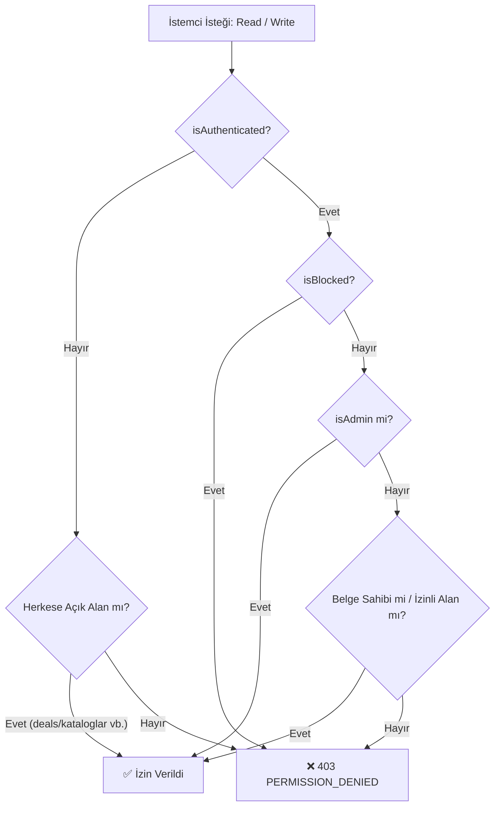

# 🔒 FırsatKolik — Firestore ve Storage Güvenlik Kuralları Rehberi (Security Rules)

Bu doküman, FırsatKolik platformunun veritabanı (`firestore.rules`) ve dosya depolama (`storage.rules`) katmanlarındaki güvenlik politikalarını, rol tabanlı erişim denetimlerini (RBAC), alan bazlı kısıtlamaları (Field-Level Diffing) ve potansiyel güvenlik açıklarını engelleyen koruma mekanizmalarını açıklamaktadır.

---

## 🏗️ 1. Genel Güvenlik Mimarisi ve İlkeler

FırsatKolik güvenlik kuralları aşağıdaki **4 temel ilke** doğrultusunda yapılandırılmıştır:

1. **En Az Yetki İlkesi (Least Privilege):** Hiçbir kullanıcıya gereğinden fazla okuma veya yazma izni verilmez. Kuralların en altında yakalanmayan tüm yollar için varsayılan ret (`allow read, write: if false;`) kuralı bulunur.
2. **Rol Tabanlı Erişim Denetimi (RBAC):** `isAdmin()` fonksiyonu ile Firebase Auth kimliğinin Firestore `users/{uid}` belgesindeki yetkisi doğrulanır.
3. **Engelleme & Ceza İcrası:** Engellenmiş (`blockedUsers`) kullanıcıların hiçbir koleksiyona veri yazmasına izin verilmez (`canWrite()`).
4. **Alan Düzeyinde Fark Doğrulaması (Field-Level Diffing):** Normal kullanıcıların fırsat veya kupon dokümanlarının başlık/fiyat gibi kritik alanlarını tahrif etmesi engellenir; yalnızca oy ve sayaç alanlarını (`hotVotes`, `commentCount`, `sicakOySayisi`) güncellemelerine izin verilir.



---

## 🛠️ 2. Temel Güvenlik Fonksiyonları (`firestore.rules`)

Kuralların başında yer alan yeniden kullanılabilir yardımcı fonksiyonlar:

```rules
// 1. Giriş kontrolü
function isAuthenticated() {
  return request.auth != null;
}

// 2. İstek sahibi UID
function userId() {
  return request.auth.uid;
}

// 3. Admin yetki doğrulaması
function isAdmin() {
  return isAuthenticated() && (
    get(/databases/$(database)/documents/users/$(request.auth.uid)).data.isAdmin == true ||
    get(/databases/$(database)/documents/users/$(request.auth.uid)).data.isadmin == true ||
    get(/databases/$(database)/documents/users/$(request.auth.uid)).data.isAdmin == 'true'
  );
}

// 4. Kullanıcı engelleme kontrolü
function isBlocked() {
  return exists(/databases/$(database)/documents/blockedUsers/$(request.auth.uid));
}

// 5. Genel yazma hakkı
function canWrite() {
  return isAuthenticated() && !isBlocked();
}
```

---

## 📋 3. Koleksiyon Bazlı Güvenlik Politikaları

### 3.1 `users` Koleksiyonu
* **Okuma:** `allow read: if true;` (Kullanıcı profilleri ve fırsat yazarı bilgileri için açık).
* **Güncelleme:** Sadece kendi profilini veya admin güncelleyebilir.
* **İstisna (Zil Takibi):** Başka bir kullanıcı bir yazarı takip edip zilini açtığında yazarın `followersWithNotifications` dizisini güncelleyebilir:
  ```rules
  allow update: if isAuthenticated() && (
    userId() == targetUserId || 
    isAdmin() ||
    (request.resource.data.diff(resource.data).affectedKeys().hasOnly(['followersWithNotifications']))
  );
  ```

---

### 3.2 `deals` (Fırsatlar) Koleksiyonu
* **Okuma:** `allow read: if true;` (Onaylı fırsatlar herkese açıktır).
* **Oluşturma:** `canWrite()` olan (giriş yapmış ve banlanmamış) kullanıcılar ekleyebilir.
* **Alan Bazlı Güvenli Güncelleme:** Normal bir kullanıcı başkasının fırsatının fiyatını veya linkini değiştiremez; yalnızca oy/yorum sayacını artırabilir:
  ```rules
  allow update: if canWrite() && (
    resource.data.postedBy == userId() || 
    isAdmin() ||
    request.resource.data.diff(resource.data).affectedKeys()
      .hasOnly(['hotVotes', 'coldVotes', 'expiredVotes', 'isExpired', 'commentCount', 'updatedAt'])
  );
  ```
* **Alt Koleksiyonlar:** `votes`, `expired_votes` ve `comments` için kullanıcı UID eşleşmesi zorunludur.

---

### 3.3 `messages` (Kullanıcılar Arası Sohbet) Koleksiyonu
* **Erişim İzolasyonu:** Yalnızca mesajın göndereni (`senderId`), alıcısı (`receiverId`) veya adminler okuyabilir/silebilir. Üçüncü şahıslar başkalarının mesajlarını sorgulayamaz.
  ```rules
  allow read: if isAuthenticated() && 
              (resource == null ||
               resource.data.senderId == userId() || 
               resource.data.receiverId == userId() ||
               isAdmin());
  ```

---

### 3.4 `reports` (Şikayetler) & `adminToUserMessages`
* **`reports`:** Kullanıcılar kendi adlarına şikayet oluşturabilir (`reportedBy == userId()`), ancak başkalarının şikayetlerini göremez. Yalnızca adminler tüm şikayet havuzunu listeler ve durumunu günceller.
* **`adminToUserMessages`:** Yalnızca admin oluşturabilir; kullanıcı sadece kendi adına gelen duyuruları okuyabilir ve "okundu" işaretleyebilir.

---

### 3.5 `kuponlar` & `kataloglar`
* **`kuponlar`:** Herkese açık okuma. Oy verme sırasında sadece `['sicakOySayisi', 'sogukOySayisi', 'durum']` alanlarının güncellenmesine izin verilir.
* **`kataloglar`:** Herkese açık okuma. Yalnızca admin veya Cloud Functions (Admin SDK) yazabilir.

---

### 3.6 `notifications` (Bildirim Merkezi & Collection Group)
* **Kullanıcı İzolasyonu & Admin Erişimi:** Normal kullanıcılar yalnızca kendi bildirimlerini okuyup yazabilir (`userId == targetUserId`). Yöneticiler (`isAdmin()`) bakım ve yönetim amacıyla tüm kullanıcıların bildirimlerini yönetebilir:
  ```rules
  match /users/{targetUserId}/notifications/{notificationId} {
    allow read, write: if isAuthenticated() && (userId() == targetUserId || isAdmin());
  }
  ```
* **Collection Group Yetkilendirmesi:** 30+ günlük atıl bildirim temizliği ve toplu yönetim için `collectionGroup('notifications')` sorguları yalnızca yöneticilere açıktır:
  ```rules
  match /{path=**}/notifications/{notificationId} {
    allow read, write: if isAdmin();
  }
  ```

---

## 📦 4. Firebase Storage Güvenlik Kuralları (`storage.rules`)

Firebase Storage kuralları fırsat görsellerinin güvenliğini sağlar:

```rules
rules_version = '2';
service firebase.storage {
  match /b/{bucket}/o {
    match /deals/{allPaths=**} {
      // Görseller herkese açık okunabilir (mobil uygulama anonim HTTP ile indirir)
      allow read: if true;
      // Kimliği doğrulanmış kullanıcılar ve admin paneli görsel yükleyebilir
      allow write: if request.auth != null;
    }
    match /{allPaths=**} {
      // Diğer tüm dosya yolları kilitlidir
      allow read, write: if false;
    }
  }
}
```

> [!NOTE]
> Telegram botu görselleri sunucu tarafında **Firebase Admin SDK** ile yüklediğinden Storage güvenlik kurallarına takılmaz (Admin SDK doğrudan kök yetkisine sahiptir).

---

## 🚀 5. Kuralların Dağıtımı (Deploy)

```bash
# DEV Ortamına Dağıtım
firebase use dev
firebase deploy --only firestore:rules,storage

# PROD (Canlı) Ortamına Dağıtım
firebase use prod
firebase deploy --only firestore:rules,storage
```

---
*FırsatKolik Firestore & Storage Güvenlik Kuralları Rehberi — 2026*
