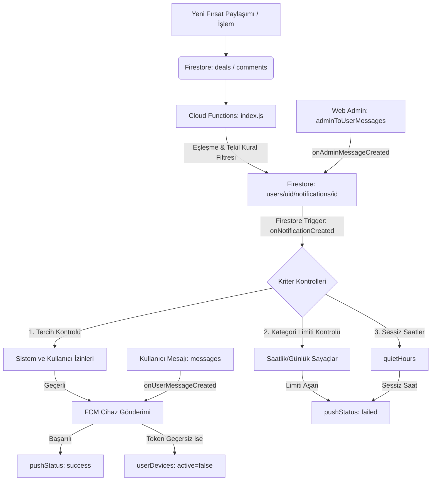

# FırsatKolik Bildirim Sistemi Mimari ve Referans Kılavuzu

Bu doküman, FırsatKolik uygulamasının mobil (Flutter), sunucu (Firebase Cloud Functions), veritabanı (Firestore) ve yönetim paneli (Web Admin) katmanlarındaki bildirim mekanizmasının çalışma prensiplerini, veri modellerini, akış diyagramlarını ve olası sorunların çözümlerini (troubleshooting) içerir.

---

## 1. Genel Mimari ve Bileşenler

Bildirim sistemi, kullanıcıyı gereksiz bildirimlerle rahatsız etmeden en doğru fırsatları ulaştırmak üzere tasarlanmış **üç katmanlı** bir yapıdan oluşur:



---

## 2. Veri Yapıları (Firestore Schemas)

### 2.1 Cihaz Kayıtları (`userDevices` Koleksiyonu)
Kullanıcıların FCM token'larını ve cihaz durumlarını takip eder.
* **Belge Kimliği (Document ID)**: `deterministik` -> `{userId}_{deviceId}` (Aynı kullanıcının aynı cihazla mükerrer kayıt oluşturmasını önler)
```json
{
  "uid": "5TMK4IC1lKbqJByvbf5T1tjKEGE2",
  "deviceId": "android_abcdef123",
  "platform": "android",
  "fcmToken": "fcm_token_string...",
  "permissionStatus": "granted",
  "active": true,
  "lastSeenAt": "Timestamp",
  "updatedAt": "Timestamp",
  "appVersion": "1.0.4",
  "buildNumber": "12"
}
```
> [!IMPORTANT]
> Kullanıcı çıkış yaptığında (`signOut`), ilgili cihaz belgesindeki `"active"` alanı `false` yapılır. Böylece o cihaza eski kullanıcı adına bildirim gitmesi engellenir.

### 2.2 Sistem Limitleri (`systemConfig/notifications` Belgesi)
Kategori bazlı bildirimlerin sınırlarını belirleyen global sistem ayarlarıdır. Web Admin panelinden değiştirilir.
```json
{
  "categoryHourlyLimit": 3,
  "categoryDailyLimit": 8,
  "updatedAt": "Timestamp"
}
```

### 2.3 Kullanıcı Tercihleri (`users/{uid}/notificationPreferences/main` Belgesi)
```json
{
  "pushMasterEnabled": true,
  "dealNotificationsEnabled": true,
  "communityNotificationsEnabled": true,
  "quietHoursEnabled": true,
  "quietHoursStart": "23:00",
  "quietHoursEnd": "08:00",
  "timezone": "Europe/Istanbul",
  "updatedAt": "Timestamp",
  "schemaVersion": 1,
  "lastStates": {
    "dealNotificationsEnabled": true,
    "categoryNotificationsEnabled": true,
    "keywordNotificationsEnabled": true,
    "communityNotificationsEnabled": true,
    "submissionStatusNotificationsEnabled": true,
    "marketingNotificationsEnabled": false,
    "quietHoursEnabled": false
  }
}
```

### 2.4 Kullanıcı Bildirimleri (`users/{uid}/notifications` Koleksiyonu)
Kullanıcının Bildirim Merkezi listesini besleyen ana koleksiyondur.
* **Belge Kimliği (Document ID)**: `deterministik` -> `{type}_{entityId}_{uid}` (Örn: `deal_dealId_uid`)
```json
{
  "type": "deal",
  "entityType": "deal",
  "entityId": "deal_id_xyz",
  "title": "Dyson V15 Süper Fiyat",
  "body": "Takip ettiğiniz 'Dyson' kelimesiyle eşleşen yeni bir fırsat paylaşıldı.",
  "reason": "keyword",
  "reasons": {
    "keyword": "dyson",
    "category": "elektronik",
    "author": "author_uid"
  },
  "deepLink": "firsatkolik://deal/deal_id_xyz",
  "pushEligible": true,
  "pushStatus": "success", 
  "createdAt": "Timestamp",
  "sentAt": "Timestamp",
  "readAt": null
}
```
> [!NOTE]
> `pushStatus` değeri sırasıyla şu durumları alabilir: `pending` (Beklemede), `success` (Gönderildi), `failed` (Hata veya limit aşımı nedeniyle iptal edildi).

---

## 3. Akıllı Bildirim Kuralları

### 3.1 Tek Fırsat İçin Tek Bildirim (Deduplication)
Bir fırsat, kullanıcının hem **Takip Ettiği Kelimeyle**, hem **Kategorisiyle**, hem de **Zilini Açtığı Yazarla** aynı anda eşleşebilir. Bu durumda kullanıcıya 3 ayrı bildirim gitmez. Tek bir bildirim oluşturulur ve `reason` (birincil neden) aşağıdaki hiyerarşiye göre belirlenir:
1. **`keyword`** (En Yüksek Öncelik)
2. **`author`** (Orta Öncelik)
3. **`category`** (En Düşük Öncelik)

Tüm eşleşen nedenler `reasons` haritasında (`reasons: { keyword: "dyson", category: "elektronik" }`) saklanır.

### 3.2 Kategori Hız Limitleri (Rate Limiting)
Kullanıcılar kategori bildirimlerinden boğulmasın diye, `reason: 'category'` olan bildirimler için Cloud Function göndermeden önce son 1 saatlik ve 24 saatlik gönderilmiş bildirim sayısını sayar.
* Eğer saatlik gönderim >= `categoryHourlyLimit` (Varsayılan: 3) ise,
* Veya günlük gönderim >= `categoryDailyLimit` (Varsayılan: 8) ise,
Bildirim üretilir (Bildirim Merkezinde görünür) ancak push gönderimi iptal edilir, belgedeki durum `pushStatus: "failed"`, `error: "hourly_limit_exceeded"` olarak güncellenir.

---

## 4. Cloud Functions İş Akışları

Tüm bildirim motoru `functions/index.js` içerisinde çalışır. Kritik fonksiyonlar şunlardır:

### 4.1 `onNotificationCreated` (Birleşik Bildirim Motoru — Firestore Trigger)
`users/{uid}/notifications/{id}` belgesi oluşturulduğunda tetiklenir. **Tüm** bildirim türleri (fırsat, kategori, keyword, yorum cevabı, admin mesajı) için tek ve merkezi FCM push gönderim noktasıdır:
1. `submission_status` tipindeki bildirimler için push gönderilmez (sadece Bildirim Merkezi'nde saklanır).
2. Sistem master switch'i (`systemConfig/notifications.enabled`) kontrol edilir.
3. Kullanıcı izinlerini (`pushMasterEnabled`) ve Sessiz Saat durumunu kontrol eder.
4. Bildirim `category` ise saatlik/günlük hız limitlerini sorgular.
5. Kullanıcının aktif cihazlarını (`active == true`) çeker.
6. Bildirim tipine göre kanal, renk ve başlık formatı belirlenir:
   * `admin_message` → `admin_messages_channel_v3` kanalı, `🛡️` emoji ön eki, `#FF5722` rengi
   * `keyword` → `keyword_alerts_channel` kanalı, `#FF9800` rengi
   * `comment_reply` → `comment_replies_channel` kanalı, `#2196F3` rengi
   * Diğer → `sicak_firsatlar_general_v2` kanalı
7. **FCM V1 API Uyumlu String Dönüşümü**: `data` parametresi içerisindeki tüm alt verilerin String tipinde olması zorunludur. Fonksiyon bunu otomatik olarak dönüştürür.
8. Bildirimleri gönderir. Geçersiz/eski token hatası alınırsa (`messaging/registration-token-not-registered`), o cihaz kaydını `active: false` durumuna getirir.

> [!IMPORTANT]
> Admin mesajları (`admin_message`) sessiz saatlere ve grup tercihlerine tabi **değildir**, ancak `pushMasterEnabled` master şalterine **tabidir**. Bu, admin mesajlarının acil/resmi nitelikli olduğu için gece bile iletilmesini garanti eder, ancak kullanıcı tüm bildirimleri tamamen kapatmışsa bu karara saygı gösterilir.

### 4.2 `onAdminMessageCreated` (Admin Mesaj Tetikleyicisi — Firestore Trigger)
`adminToUserMessages/{messageId}` belgesi oluşturulduğunda tetiklenir:
1. Hedef kullanıcının `users/{uid}/notifications/admin_msg_{messageId}` belgesine bildirim dokümanı yazar.
2. Doküman içerisine `senderId: 'admin'`, `senderName`, `messageId` gibi FCM push için gerekli ek alanları ekler.
3. **FCM push gönderimi yapmaz** — bu iş `onNotificationCreated` birleşik motoruna bırakılır (Tek Sorumluluk Prensibi).

### 4.3 `cleanupInvalidTokens` (Zamanlanmış Görev)
Belli aralıklarla çalışarak veritabanındaki geçersiz veya süresi geçmiş FCM token'larını temizler. Yönetici panelinden manuel olarak da tetiklenebilir.

### 4.4 `sendManualNotification` (HTTPS Callable)
Yöneticilerin admin panelinden belirli bir UID'ye, cihaza veya tüm kullanıcılara manuel bildirim göndermesini sağlar.

---

## 5. Web Admin Paneli Entegrasyonu

Web admin paneli (`web/admin/index.html` ve `app.js`), bildirim sistemini yönetmek için iki alana sahiptir:

### 5.1 Limitlerin Yönetimi
* **Konum**: Ayarlar Görünümü -> "Bot ve Uygulama Yapılandırması"
* **Aksiyon**: Kategori Saatlik ve Günlük bildirim limitleri doğrudan `systemConfig/notifications` belgesinden yüklenir ve kaydedilir.

### 5.2 Manuel Bildirim Gönderimi & Token Temizliği
* **Konum**: Bildirimler Görünümü
* **Aksiyon**: Callable `sendManualNotification` ve `cleanupInvalidTokens` Cloud fonksiyonlarını çağırarak sistemi yönetir.

---

## 6. Hata Ayıklama & Sorun Giderme (Troubleshooting)

### 6.1 Çıkış Sırasında `PERMISSION_DENIED` Hatası
* **Sorun**: Kullanıcı çıkış yaptığında terminalde `PERMISSION_DENIED` hatası veya Firestore yetki hatası logları geliyordu.
* **Neden**: Firestore dinleyicileri (listener/stream) hâlâ açıkken Firebase Auth oturumunun kapatılması. Auth kapatıldığı an dinleyiciler yetkisiz kalıp hata üretiyordu.
* **Çözüm**: Uygulamadaki tüm çıkış (`signOut`) akışlarında sıra şu şekilde güncellendi:
  1. Önce `NotificationService().clearAllSubscriptions()` çağrılarak tüm mesaj, yazar ve kelime dinleyicileri iptal edilir.
  2. Sonra `_authService.signOut()` çağrılır.
  3. Dart tarafındaki `ZonedGuarded` hata yakalayıcısında `permission-denied` hatası sessizce yoksayılır.

### 6.2 Bildirim Gelmiyor Kontrol Listesi
Bir kullanıcıya bildirim gitmiyorsa sırasıyla şu adımları kontrol edin:

1. **Firestore `userDevices` kaydı var mı?**
   * Kullanıcının UID'sine ait aktif cihaz belgesi mevcut mu ve `active == true` mu? `fcmToken` alanı dolu mu?
2. **Kullanıcı tercihleri açık mı?**
   * `users/{uid}/notificationPreferences/main` belgesinde `pushMasterEnabled: true` mu veya ilgili bildirim türüne ait alt kanal ayarı (örn: `dealNotificationsEnabled`) elle manuel olarak `true` yapılmış mı? (Master şalter kapalı olsa bile elle açılan alt kanallardan push gönderilmeye devam eder).
3. **Fırsat Yayında mı?**
   * Fırsat belgesinin durumu `published` olmalıdır. Taslak veya onay bekleyen fırsatlar bildirim tetiklemez.
4. **Limitler aşıldı mı?**
   * `users/{uid}/notifications` altındaki en son bildirim belgesini inceleyin. `pushStatus` alanı `"failed"` ise `error` parametresinde nedeni yazar (Örn: `hourly_limit_exceeded`, `quiet_hours_active`).
5. **FCM V1 Tipi Hatası var mı?**
   * Cloud Functions loglarını (Google Cloud Console) inceleyin. Eğer `Firebase giriş hatası: type 'List<Object?>' is not a subtype of type...` tarzı bir cast hatası varsa, FCM payload veri tipinin tamamı string olarak dönüştürülmemiş demektir.
6. **Aktif Sohbette Bildirim Bastırma (Data-Only Payload):**
   * `onUserMessageCreated` tetikleyicisi FCM payload'ını `notification` alanı olmadan, **data-only** olarak gönderir. Bu sayede Android OS bildirim tepsisinde otomatik bildirim oluşturmaz; Flutter tarafındaki `activeChatUserId` kontrolü aktif sohbet odasındayken bildirimi sessizce bastırır, sohbet odasında değilse lokal bildirim/banner olarak gösterir.

---

## 7. Dağıtım ve Senkronizasyon (Deploy)

Geliştirme yaparken veya canlıya alırken kodların güncelliğinden emin olmak için sırasıyla şu komutlar kullanılır:

### Geliştirme (Dev) Ortamı İçin
```bash
# Firebase CLI projesini geliştirme ortamına ayarla
firebase use dev

# Fonksiyonları dağıt
firebase deploy --only functions

# Web Admin Panelini dağıt
firebase deploy --only hosting
```

### Üretim (Prod) Ortamı İçin
```bash
# Firebase CLI projesini prod ortamına ayarla
firebase use prod

# Fonksiyonları dağıt (onNotificationCreated ve diğer tetikleyicilerle birlikte)
firebase deploy --only functions --force

# Web Admin Panelini dağıt
firebase deploy --only hosting
```
