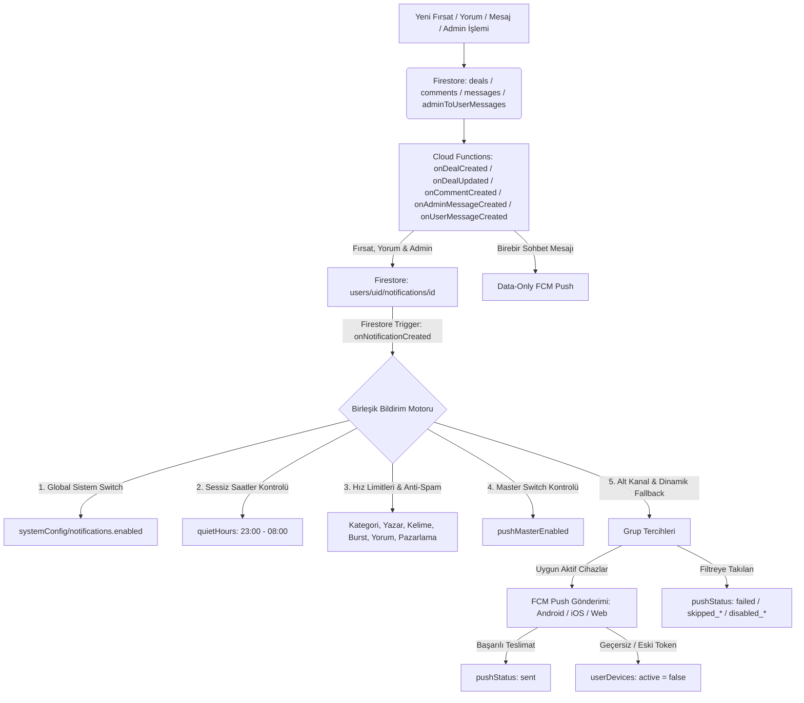

# 🔔 FırsatKolik — Bildirim Sistemi Kapsamlı Mimari ve Referans Kılavuzu

> [!NOTE]
> Bu doküman Bildirim Sisteminin kapsamlı mimari referans kılavuzudur. Sistemin güncel şemaları, 10 temel senaryo matrisi, Cloud Functions tetikleyicileri, güvenlik kuralları ve test süitleri için lütfen **[Bildirim Sistemi ve Push Motoru Master Mimari Rehberi](file:///d:/firsatkolik/documentation/bildirimler/bildirim_sistemi_rehberi.md)** dokümanını inceleyiniz.

Bu doküman; **FırsatKolik** platformunun mobil (Flutter), sunucu (Firebase Cloud Functions), veritabanı (Cloud Firestore) ve yönetim paneli (Web Admin) katmanlarındaki tüm bildirim mekanizmasının çalışma prensiplerini, veri modellerini, akış diyagramlarını, kanal yapılandırmalarını, derin link yönlendirmelerini, akıllı filtreleme kurallarını, bağlamsal izin isteme mimarisini ve sorun giderme (troubleshooting) adımlarını eksiksiz olarak belgeler.

---

## 📑 İçindekiler
1. [🌟 Genel Mimari ve Uçtan Uca Akış](#1--genel-mimari-ve-uçtan-uca-akış)
2. [🎯 Bağlamsal ve Değer Odaklı İzin İsteme Mimarisi](#2--bağlamsal-ve-değer-odaklı-i̇zin-i̇steme-mimarisi)
3. [⚙️ Veritabanı Şemaları ve Veri Modelleri (Firestore)](#3-️-veritabanı-şemaları-ve-veri-modelleri-firestore)
4. [🧠 Akıllı Eşleşme, Önceliklendirme ve Deduplication Motoru](#4--akıllı-eşleşme-önceliklendirme-ve-deduplication-motoru)
5. [⚡ Cloud Functions Bildirim Tetikleyicileri ve Fonksiyonlar](#5--cloud-functions-bildirim-tetikleyicileri-ve-fonksiyonlar)
6. [📱 Mobil İstemci Mimarisi (Flutter / FCM / Local Notifications)](#6--mobil-i̇stemci-mimarisi-flutter--fcm--local-notifications)
7. [🛡️ Android Bildirim Kanalları ve iOS APNs Yapılandırması](#7-️-android-bildirim-kanalları-ve-ios-apns-yapılandırması)
8. [💬 Birebir Mesajlaşma ve Aktif Sohbette Bildirim Bastırma](#8--birebir-mesajlaşma-ve-aktif-sohbette-bildirim-bastırma)
9. [💻 Web Admin Paneli Bildirim Yetenekleri](#9--web-admin-paneli-bildirim-yetenekleri)
10. [🧪 Otomatik Test Süitleri ve Doğrulama](#10--otomatik-test-süitleri-ve-doğrulama)
11. [🔧 Hata Ayıklama ve Sorun Giderme (Troubleshooting)](#11--hata-ayıklama-ve-sorun-giderme-troubleshooting)
12. [🚀 Dağıtım ve Senkronizasyon (Deployment)](#12--dağıtım-ve-senkronizasyon-deployment)

---

## 1. 🌟 Genel Mimari ve Uçtan Uca Akış

FırsatKolik bildirim sistemi, kullanıcıyı spam bildirimlerle rahatsız etmeden en doğru ve kişiselleştirilmiş fırsatları ulaştırmak üzere tasarlanmış **üç katmanlı hibrit** bir mimariye sahiptir:



---

## 2. 🎯 Bağlamsal ve Değer Odaklı İzin İsteme Mimarisi

Modern mobil UX ve Apple/Google yönergeleri doğrultusunda, uygulamanın ilk açılışında (`cold-start / initState`) sorulan körü körüne izin isteme mekanizması **tamamen kaldırılmıştır**.

### Neden Kaldırıldı?
1. **Tutorial Çakışması:** Açılışta çıkan sistem izni pop-up'ı, 8 adımlı interaktif Spotlight rehberi ile çakışıyordu.
2. **Yüksek Ret Oranı:** Kullanıcı henüz uygulamanın faydasını görmeden açılan dialoglarda %70 ret veriyordu.
3. **Kalıcı İzin Kaybı:** iOS ve Android 13+'ta kullanıcı sistem penceresini reddettiğinde, işletim sistemi bir daha otomatik pencere açmamaktadır.

### 5 Organik Bağlamsal Tetikleyici Nokta:
| Tetikleyici Ekran / Bileşen | Kullanıcı Eylemi | İzin İsteme Mantığı |
| :--- | :--- | :--- |
| **Arama Çubuğu Radarı** (`HomeScreen`) | Bir arama kelimesini radar simgesiyle takibe ekleme | `_addKeywordFromSearch` ➔ `requestPermission()` |
| **Anahtar Kelime Takibi** (`KeywordTrackingScreen`) | Yeni kelime ekleme veya önerilerden seçme | `_addKeyword` ➔ `requestPermission()` |
| **Kategori Tercihleri** (`CategoryPreferencesScreen`) | Bir kategoriyi veya tümünü takibe alma | `_toggleCategory` / `_selectAllCategories` ➔ `requestPermission()` |
| **Yazar / Avcı Profili** (`ProfileScreen` & `BotkolikProfileScreen`) | Bir avcıyı takip etme veya bildirim zilini açma | `_toggleFollow` / `_toggleFollowNotification` ➔ `requestPermission()` |
| **Bildirim Ayarları** (`NotificationSettingsScreen`) | "Telefon Bildirimleri" master anahtarını AÇIK konuma getirme | `SwitchListTile.onChanged(true)` ➔ `requestPermission()` |

---

## 3. ⚙️ Veritabanı Şemaları ve Veri Modelleri (Firestore)

### 3.1 Cihaz Kayıtları (`userDevices/{userId}_{deviceId}`)
Kullanıcıların FCM token'larını ve cihaz durumlarını takip eder.
* **Belge Kimliği (Document ID)**: Deterministik `userId_deviceId` (Aynı kullanıcının aynı cihazla mükerrer kayıt oluşturmasını engeller).
```json
{
  "uid": "5TMK4IC1lKbqJByvbf5T1tjKEGE2",
  "deviceId": "android_9154692513050225",
  "platform": "android",
  "fcmToken": "eh9gylEBQDiXEVztnUxTMs:APA91bEFfGjo...",
  "permissionStatus": "authorized",
  "active": true,
  "lastSeenAt": "Timestamp",
  "updatedAt": "Timestamp",
  "appVersion": "1.0.4",
  "buildNumber": "12",
  "deactivatedReason": null
}
```
> [!IMPORTANT]
> Kullanıcı çıkış yaptığında (`signOut`), cihaz belgesindeki `"active"` alanı `false` yapılır ve `FirebaseMessaging.deleteToken()` çağrılır. Böylece paylaşılan cihazlarda eski kullanıcıya bildirim gitmesi engellenir.

### 3.2 Kullanıcı Bildirim Tercihleri (`users/{uid}/notificationPreferences/main`)
```json
{
  "pushMasterEnabled": true,
  "dealNotificationsEnabled": true,
  "categoryNotificationsEnabled": true,
  "keywordNotificationsEnabled": true,
  "communityNotificationsEnabled": true,
  "submissionStatusNotificationsEnabled": true,
  "marketingNotificationsEnabled": false,
  "quietHoursEnabled": true,
  "quietHoursStart": "23:00",
  "quietHoursEnd": "08:00",
  "timezone": "Europe/Istanbul",
  "updatedAt": "Timestamp",
  "schemaVersion": 1,
  "lastStates": {
    "dealNotificationsEnabled": true,
    "categoryNotificationsEnabled": true,
    "keywordNotificationsEnabled": true,
    "communityNotificationsEnabled": true,
    "submissionStatusNotificationsEnabled": true,
    "marketingNotificationsEnabled": false,
    "quietHoursEnabled": true
  }
}
```

### 3.3 Bildirim Abonelikleri (`notificationSubscriptions/{uid}_{type}_{sanitizedKey}`)
Kullanıcının takip ettiği anahtar kelimeleri, kategorileri ve yazarları temsil eder.
* **Tipler (`type`)**: `'keyword'`, `'category'`, `'author'`.
```json
{
  "uid": "5TMK4IC1lKbqJByvbf5T1tjKEGE2",
  "type": "keyword",
  "key": "dyson",
  "displayValue": "Dyson",
  "normalizedValue": "dyson",
  "includeDescendants": true,
  "enabled": true,
  "createdAt": "Timestamp",
  "updatedAt": "Timestamp"
}
```

### 3.4 Kullanıcı Bildirimleri Kutusu (`users/{uid}/notifications/{notificationId}`)
Kullanıcının uygulama içindeki Bildirim Merkezi'ni besleyen ana koleksiyondur.
* **Belge Kimliği (Document ID)**: Deterministik `{type}_{entityId}_{uid}` (Örn: `deal_dealId_uid`, `admin_msg_msgId`, `reply_commentId_uid`).
```json
{
  "id": "deal_telegram_2790401298_2703_5TMK4IC1lKbqJByvbf5T1tjKEGE2",
  "type": "deal",
  "dealId": "telegram_2790401298_2703",
  "dealTitle": "Erkek Çorap",
  "title": "🎯 Yeni Fırsat!",
  "body": "Erkek Çorap\n💰 149.99 TL",
  "reason": "category",
  "reasonDetail": "moda",
  "reasons": {
    "category": "moda",
    "keyword": "corap"
  },
  "read": false,
  "readAt": null,
  "pushEligible": true,
  "pushStatus": "sent",
  "createdAt": "Timestamp",
  "sentAt": "Timestamp",
  "updatedAt": "Timestamp"
}
```

### 3.5 Sistem Yapılandırması (`systemConfig/notifications`)
```json
{
  "enabled": true,
  "categoryHourlyLimit": 3,
  "categoryDailyLimit": 8,
  "authorHourlyLimit": 4,
  "authorDailyLimit": 12,
  "keywordHourlyLimit": 6,
  "keywordDailyLimit": 18,
  "dealMinIntervalSeconds": 30,
  "dealMaxHourlyTotal": 8,
  "commentHourlyLimit": 10,
  "commentDealTenMinLimit": 5,
  "marketingDailyLimit": 2,
  "adminMessageHourlyLimit": 6,
  "updatedAt": "Timestamp"
}
```

### 3.6 🔒 Firestore Güvenlik Kuralları & Collection Group İzinleri (`firestore.rules`)
Kullanıcı bildirimlerinin gizliliği ve yönetimsel temizlik operasyonları için iki düzeyli güvenlik kuralı uygulanır:
1. **Kullanıcı & Admin İzolasyonu:** Normal kullanıcılar sadece kendi bildirimlerini okuyup yazabilir (`userId == targetUserId`). Yöneticiler (`isAdmin()`) destek ve yönetim amacıyla tam erişime sahiptir:
   ```rules
   match /users/{targetUserId}/notifications/{notificationId} {
     allow read, write: if isAuthenticated() && (userId() == targetUserId || isAdmin());
   }
   ```
2. **Collection Group Yetkilendirmesi:** 30+ günlük atıl bildirim temizliği için `db.collectionGroup('notifications')` sorguları yalnızca yöneticilere açıktır:
   ```rules
   match /{path=**}/notifications/{notificationId} {
     allow read, write: if isAdmin();
   }
   ```

### 3.7 ⚡ Firestore İndeksleri & Single-Field / Collection Group Ayrımı (`firestore.indexes.json`)
Bildirim sistemi, iki farklı ölçekte ve sorgu tipinde çalıştığı için indeks yapılandırması kritik öneme sahiptir:

```
[ Bildirimler Veritabanı Mimarisi ]
 ├── users/{uid}/notifications/{id}  ──► Mobil İstemci: users/{uid}/notifications.orderBy('createdAt', descending: true)
 │                                        İndeks Gereksinimi: queryScope: "COLLECTION" (COLLECTION_DESC)
 │
 └── (Tüm Kullanıcılar Subcollection) ──► 30+ Günlük Temizlik: collectionGroup('notifications').where('createdAt', '<', cutoffDate)
                                          İndeks Gereksinimi: queryScope: "COLLECTION_GROUP" (COLLECTION_GROUP_ASC/DESC)
```

#### 📌 Kritik Firestore İndeks Kuralı (`fieldOverrides`):
Firestore'da bir alan için `fieldOverrides` (alan bazlı indeks özelleştirmesi) tanımlandığında, Firestore varsayılan tekil koleksiyon (`COLLECTION`) indeksini otomatik olarak devre dışı bırakır.

Bu sebeple [`firestore.indexes.json`](file:///d:/firsatkolik/firestore.indexes.json) dosyasında `notifications.createdAt` için **hem mobil istemcinin ihtiyaç duyduğu `COLLECTION` indeksleri hem de arka plan toplu temizliğinin ihtiyaç duyduğu `COLLECTION_GROUP` indeksleri birlikte açıkça tanımlanmalıdır**:

```json
{
  "collectionGroup": "notifications",
  "fieldPath": "createdAt",
  "indexes": [
    { "queryScope": "COLLECTION", "order": "ASCENDING" },
    { "queryScope": "COLLECTION", "order": "DESCENDING" },
    { "queryScope": "COLLECTION_GROUP", "order": "ASCENDING" },
    { "queryScope": "COLLECTION_GROUP", "order": "DESCENDING" }
  ]
}
```
* **Eğer `COLLECTION` yazılmazsa:** Mobil uygulamadaki "Bildirimler" ekranı `failed-precondition: requires COLLECTION_DESC` hatası verir.
* **Eğer `COLLECTION_GROUP` yazılmazsa:** Web admin ve Cloud Functions üzerinden yapılan 30+ günlük toplu bildirim silme sorgusu `requires COLLECTION_GROUP_ASC` hatası verir.

---

## 4. 🧠 Akıllı Eşleşme, Önceliklendirme ve Deduplication Motoru

Bir fırsat yayınlandığında `matchAndCreateDealNotifications` fonksiyonu şu aşamalardan geçer:

```
[ Fırsat Metni (Başlık + Açıklama) ]
         │
         ▼
[ Normalizasyon & N-Gram Üretimi (1-Gram, 2-Gram, 3-Gram) ] ──► [ Stop-words Temizliği ]
         │
         ▼
[ Sıkı Regex & Kelime Sınırı Doğrulaması (Strict Word Boundary) ]
         │
         ▼
[ 3'lü Deduplication & Önceliklendirme ]
 1. 🥇 KEYWORD (En Yüksek Öncelik)
 2. 🥈 AUTHOR  (Orta Öncelik)
 3. 🥉 CATEGORY(En Düşük Öncelik)
         │
         ▼
[ reasons Haritasında Çoklu Sebepleri Saklama ] ──► reasons: { keyword: "dyson", category: "elektronik" }
         │
         ▼
[ 400'lük Batch Chunk'lar ile users/{uid}/notifications Yazımı ]
```

### Kritik Eşleşme Özellikleri:
1. **Çok Kelimeli Kök Toleransı (Stem Tolerance):** *"sony kulaklik"* takibinde metinde "Sony" ve "Kulaklık" ayrı yerlerde geçse bile tolere edilir; k ➔ g yumuşaması (lastik ➔ lastiği) yakalanır.
2. **Özel Kelime Koruması:** Kullanıcı *"mac"* takibi yaptığında, Türkçe *"maç"* kelimesi içeren bilet fırsatlarıyla yalancı eşleşme engellenir.
3. **Kendi Kendine Bildirim Engeli:** Fırsatı paylaşan kullanıcıya kendi paylaşımı için bildirim üretilmez (`sub.uid !== postedBy`).
4. **Dinamik Neden Dönüşümü (Reason Fallback):** Eğer kullanıcı kelime bildirimlerini kapatmış ama kategori bildirimlerini açık bırakmışsa, `onNotificationCreated` motoru bildirimin birincil nedenini kategoriye dönüştürür ve başlığı buna göre uyarlayarak push'u iletir.

---

## 5. ⚡ Cloud Functions Bildirim Tetikleyicileri ve Fonksiyonlar

Tüm fonksiyonlar `functions/index.js` içerisinde modüler olarak tanımlanmıştır:

| Fonksiyon Adı | Tip / Tetikleyici | Sorumluluk ve Çalışma Mantığı |
| :--- | :--- | :--- |
| **`onDealCreated`** | Firestore `deals/{dealId}` (onCreate) | Fırsat oluşturulduğunda küfür/profanity moderasyonu yapar. Fırsat onaysız ise `admin_deals` FCM konusuna admin bildirimi gönderir ve `adminMessages` oluşturur. Onaylıysa bildirimleri üretir. |
| **`onDealUpdated`** | Firestore `deals/{dealId}` (onUpdate) | Fırsat `isApproved: false ➔ true` olduğunda herkese bildirim üretir (`matchAndCreateDealNotifications`). Kullanıcı fırsatı onaylandığında veya reddedildiğinde `submission_status` bildirimi yazar. |
| **`onCommentCreated`** | Firestore `deals/{dealId}/comments/{commentId}` (onCreate) | Yorum moderasyonu yapar. Bir yoruma yanıt yazıldığında (`parentCommentId`) alıcıya `comment_reply`, fırsata ana yorum yazıldığında ise fırsat sahibine (`deal.postedBy`) `comment` bildirim dokümanı oluşturur. |
| **`onAdminMessageCreated`**| Firestore `adminToUserMessages/{messageId}` (onCreate) | Admin panelinden kullanıcıya mesaj atıldığında `users/{uid}/notifications/admin_msg_{messageId}` belgesini yazar. Push gönderimini `onNotificationCreated` motoruna bırakır. |
| **`onUserMessageCreated`** | Firestore `messages/{messageId}` (onCreate) | Birebir sohbette yeni mesaj geldiğinde alıcının cihazlarına **data-only payload** iletir. |
| **`onNotificationCreated`** | Firestore `users/{uid}/notifications/{id}` (onCreate) | **Merkezi Push Motoru:** Tüm bildirim dokümanlarını dinler; sistem şalteri, sessiz saatler, tüm bildirim sebepleri hız limitleri (kategori, yazar, kelime, burst cooldown, yorum/topluluk, pazarlama ve admin güvenlik tavanı), kullanıcı tercihleri ve cihaz token kontrollerini yaparak FCM push gönderir. Yazar fırsatlarını `follow_channel` kanalına yönlendirir. Başarılı teslimatta (`successCount > 0`) günlük `notificationStats` sayacını anında artırır. |
| **`purgeOldDeals`** | PubSub Schedule (`0 4 * * 0` - Her Pazar 04:00) | **30 Günlük Derin Temizlik:** 30 günden eski fırsatları, yorumları, favori referanslarını ve **tüm kullanıcılardaki (`collectionGroup('notifications')`) 30 günü geçmiş bildirimleri** kalıcı olarak siler. |
| **`purgeOldDealsManual`** | HTTPS Callable (`onCall`) | Admin panelinden 30+ günlük eski fırsatları ve ilişkili eski bildirimleri manuel olarak kalıcı siler. |
| **`purgeOldNotificationsManual`** | HTTPS Callable (`onCall`) | Admin yetkisiyle yalnızca 30 günü geçmiş bildirim dokümanlarını (`collectionGroup`) toplu siler. |
| **`sendManualNotification`**| HTTPS Callable (`onCall`) | Admin panelinden Tüm Kullanıcılara (`all`), Tekil UID'ye (`uid`) veya Belirli Token'a (`token`) anlık bildirim gönderir. `notificationCategory` (`admin_message` veya `marketing`) tercihiyle sessiz saat ve kullanıcı filtrelerine uyum sağlar. `notificationLogs` ve `notificationStats` günceller. |
| **`cleanupInvalidTokens`** | HTTPS Callable (`onCall`) | `userDevices` içerisindeki aktif FCM token'ları dryRun ile test ederek geçersiz olanları `active: false` yapar. |
| **`onUserDeleted`** | Auth `user().onDelete` | Kullanıcı silindiğinde `userDevices`, `notificationSubscriptions`, `notifications` ve `notificationPreferences` verilerini kalıcı temizler. |

---

### 5.1 🧹 30 Günlük Bildirim Yaşam Döngüsü ve Otomatik Temizlik (Data Retention & Purge)
Kullanıcıların Bildirim Merkezi (`users/{userId}/notifications`) kutusunda atıl bildirimlerin birikmesini ve veritabanı şişmesini önlemek için **30 günlük veri saklama politikası** uygulanır:
1. **Haftalık Otomatik Cron (`purgeOldDeals`):** Her Pazar gece 04:00'da çalışarak `createdAt < 30 gün önce` olan tüm bildirim dokümanlarını `collectionGroup('notifications')` üzerinden 400'lük gruplar halinde kalıcı olarak siler.
2. **Web Admin Manuel Temizlik (`purgeOldDealsWeb` / `purgeOldDealsManual`):** Admin panelinden "30+ Günlük Temizlik" butonuna tıklandığında fırsatlarla birlikte eski bildirimler de taranıp silinir.
3. **Maliyet & Performans Avantajı:** İstemci tarafında sayfalama hızlanır, Firestore okuma/yazma maliyeti minimize edilir ve kullanıcılar yalnızca güncel bildirimleri görür.

---

## 6. 📱 Mobil İstemci Mimarisi (Flutter / FCM / Local Notifications)

### 6.1 Bildirim İstemci Sınıfı (`NotificationService`)
Mobil tarafta bildirim döngüsünü `lib/services/notification_service.dart` yönetir:
* **`initializeLocalNotifications()`:** Android ve iOS yerel bildirim eklentilerini başlatır ve 7 adet özel kanalı tanımlar.
* **`saveFCMToken({String? userId})`:** Cihazın FCM token'ını alır, `userDevices/{userId}_{deviceId}` dokümanına kaydeder ve `onTokenRefresh` dinleyicisini kurar.
* **`clearDeviceToken()`:** Çıkış yapıldığında token'ı pasife alır ve yerel FCM önbelleğini siler (`deleteToken`).

### 6.2 Derin Linkleme ve Bildirime Tıklama (Deep Linking)
Uygulama arka planda, kapalıyken (cold start) veya ön plandayken bildirime tıklandığında `_handleNotificationTap(data)` çalışır:

| Payload Verisi | Hedef Ekran | Parametreler |
| :--- | :--- | :--- |
| `type == 'deal'` veya `dealId` | **`DealDetailScreen`** | `dealId` ile detay ekranı açılır |
| `type == 'comment_reply'` veya `type == 'comment'` | **`DealDetailScreen`** | `dealId` açılır ve `commentId`'ye otomatik kaydırılarak odaklanır |
| `type == 'message'` | **`MessageScreen`** | `senderId`, `senderName`, `messageText`, `dealId` vb. ile sohbet odası anında açılır |
| `type == 'admin_deal'` | **`AdminScreen`** | Admin onay paneli açılır |
| `type == 'admin_message'` | **`MessageScreen`** / **`AdminNotificationsScreen`** | Yönetici duyuruları / destek sohbeti açılır |

### 6.3 🚀 Cold Start (Uygulama Kapalıyken) Bildirim Kuyruğu ve Akıcı Yönlendirme Mimarisi
Uygulama tamamen kapalıyken bildirime tıklandığında:
1. `main()` içinde `initializeLocalNotifications()` ve `getNotificationAppLaunchDetails()` payload'ı yakalar.
2. `navigatorKey.currentState` henüz `null` olduğu için bildirim `_startPendingNotificationCheck` kuyruğuna alınır.
3. Kontrol periyodu **200ms**'dir. Fırsat ve genel bildirimler için `currentUser` beklenmez; mesaj bildirimlerinde `_auth.currentUser` oturumu diskten yüklendiği anda kuyruk çözülür.
4. **Çift Tıklama (Duplicate) Filtre Koruması:** `_lastHandledTapTime` damgası kuyruğa alınırken değil, **yalnızca `navigator.push` fiilen icra edildiğinde** kaydedilir. Kuyruktan gelen çağrılar `isFromPending: true` bayrağı ile duplicate filtresini bypass ederek asla yutulmaz.

---

## 7. 🛡️ Android Bildirim Kanalları ve iOS APNs Yapılandırması

### Android Bildirim Kanalları (7 Kanal):
| Kanal ID | Kanal Adı | Önem (`Importance`) | LED Rengi | Kullanım Amacı |
| :--- | :--- | :---: | :---: | :--- |
| **`sicak_firsatlar_general_v2`** | Sıcak Fırsatlar Bildirimleri | `max` | `#FF6B35` | Genel fırsat, kategori ve pazarlama bildirimleri |
| **`keyword_alerts_channel`** | Özel Fırsat Bildirimleri | `max` | `#FF9800` | Takip edilen anahtar kelime eşleşmeleri |
| **`comment_replies_channel`** | Yorum Cevapları | `high` | `#2196F3` | Yorumlara gelen yanıtlar ve fırsat sahibine gelen ilk yorumlar |
| **`messages_channel_v3`** | Mesaj Bildirimleri | `max` | `#2196F3` | Kullanıcılar arası sohbet mesajları |
| **`admin_messages_channel_v3`** | Admin Mesaj Bildirimleri | `max` | `#FF5722` | Resmi yönetici duyuru ve uyarıları |
| **`follow_channel`** | Takip Bildirimleri | `high` | `#4CAF50` | Takip edilen avcıların paylaşımları |
| **`admin_channel`** | Admin Bildirimleri | `max` | `#2196F3` | Onay bekleyen yeni fırsatlar (Yöneticiler) |

### iOS APNs Yapılandırması:
* **Ses & Rozet:** `sound: 'default'`, `badge: 1`.
* **Kategori & Öncelik:** `apns-priority: 10`, `apns-push-type: 'alert'`, `interruption-level: active` (Admin mesajlarında `time-sensitive`).
* **Alert & Görsel Sunum:** Apple kuralları gereği kilit ekranı ve bildirim merkezinde afiş gösterimi için `payload.aps.alert: { title: '...', body: '...' }` tanımlanır. Android data-only yapısını korurken iOS cihazlara doğrudan işletim sistemi seviyesinde kilit ekranı bildirim kartı oluşturulması sağlanır.
* **Content Available:** Arka plan veri senkronizasyonu için `content-available: 1`.
* **APNs Collapse ID & Thread ID:** `apns-collapse-id: "msg_" + senderId` ve `thread-id: "conv_" + senderId` ile kilit ekranında sohbet bazlı gruplama.
* **Ön Plan Bildirim Delegasyonu (`AppDelegate.swift`):** `UNUserNotificationCenter.current().delegate = self` üzerinden `userNotificationCenter(_:willPresent:withCompletionHandler:)` çağrısına `[.banner, .list, .badge, .sound]` sunum seçenekleri eklenmiştir.
* **Ön Plan Gerçek Zamanlı In-App Afiş Motoru (`NotificationService`):** Uygulama açıkken (foreground) APNs veya FCM gecikmelerinden bağımsız olarak, Firestore `messages` koleksiyonundaki `receiverId == userId` anlık dinleyicisi (`_setupForegroundMessageListener()`) sayesinde 0 ms gecikmeyle `InAppMessageBanner.show()` tetiklenir (Aktif sohbetteyse bastırılır, diğer ekranlarda afiş gösterilir).

---

## 8. 💬 Birebir Mesajlaşma, Anti-Spam ve Bildirim Yığınlama Mimarisi

Kullanıcılar arası mesajlaşmada bildirim deneyimini kusursuz kılmak ve spam durumlarını profesyonelce yönetmek için **5 Katmanlı İleri Seviye Mimari** uygulanır:

### 8.1 🛡️ Gönderici Anti-Spam Rate Limiter (Sliding Window)
- `MessageScreen` içinde `_recentMessageTimestamps` listesi tutulur.
- **Kural:** **5 saniyede maksimum 3 mesaj.**
- Kullanıcı 5 saniye içinde 3'ten fazla mesaj atmaya çalışırsa mesaj Firestore'a gönderilmez ve ekranda *"Çok hızlı mesaj gönderiyorsunuz. Lütfen birkaç saniye bekleyin."* uyarısı gösterilir. 5 saniye sonra pencere otomatik temizlenir.

### 8.2 ⚡ Backend FCM Collapse Key & APNs Sıkıştırma (`onUserMessageCreated`)
- Android FCM payload'ında `android.collapseKey: "msg_" + senderId` tanımlıdır.
- iOS APNs payload'ında `headers['apns-collapse-id']: "msg_" + senderId` ve `aps['thread-id']: "conv_" + senderId` tanımlıdır.
- **Sonuç:** Cihaz kapalıyken veya internet yavaşken gelen 20 mesaj, sunucu seviyesinde tek bildirim halinde sıkıştırılır.

### 8.3 📱 İşletim Sistemi Bildirim Yığınlama (OS Stacking) & `onlyAlertOnce`
- **Deterministik ID & Tag:** `notifId = senderId.hashCode % 100000` ve `tag = 'msg_$senderId'`.
- **`onlyAlertOnce: true`:** Yeni mesaj geldiğinde mevcut bildirim kartı sessizce güncellenir; telefon her saniye tekrar tekrar çalmaz/titremez.
- **`groupKey: 'group_messages'`:** Android sisteminde sohbet bildirimleri diğer bildirimlerden ayrı, temiz bir grupta tutulur.

### 8.4 🚀 Instant Optimistic Seeding (Sıfır Gecikmeyle Akıcı Chat Açılışı)
- Push bildiriminden veya In-App banner'dan sohbete geçildiğinde gelen son mesaj metni ve ilişkili fırsat verisi `MessageScreen`'e parametre olarak iletilir.
- `MessageScreen.initState` anında bu mesaj `_optimisticMessages` listesine eklenir.
- Firestore WebSocket ağ bağlantısı henüz kurulmamış olsa bile ilk karede (`frame 0`) mesaj ekranda gösterilir (iskelet ve boş ekran sıfırlanır).
- Firestore 1 saniye sonra bağlandığında `mergedMap` dedup algoritması sunucu mesajıyla geçici mesajı dikişsiz olarak birleştirir.

### 8.5 🔕 Aktif Sohbette Bildirim Bastırma & Haptic Debounce
- **Aktif Chat Bastırma:** `NotificationService.activeChatUserId == senderId` ise ön planda ne push ne de In-App banner üretilir.
- **In-App Banner Titreşim Koruması:** Hızlı mesaj akışlarında haptic motorunu korumak için 1.5 saniyelik Haptic Debounce uygulanır.

### 8.6 ⚡ Fırsat Bildirimlerinde Burst Debounce & Fırsat Tavanı Koruması
- **Fırsat Burst Debounce (30sn Soğuma):** Bot kazıma veya avcı paylaşımlarıyla ardı ardına fırsat geldiğinde, kullanıcıya bir fırsat bildirimi gittikten sonra en az 30 saniye (`dealMinIntervalSeconds: 30`) geçmeden yeni bir fırsat push'u gönderilmez (`skipped_deal_burst_cooldown`). Doküman bildirim kutusuna yazılmaya devam eder.
- **Toplam Fırsat Saatlik Tavanı:** Kullanıcı saatte tüm kaynaklardan (kategori + yazar + kelime) toplam en fazla 8 fırsat push'u alabilir (`skipped_deal_hourly_total_limit`).
- **Viral Yorum Flood Koruması:** Bir fırsata çok sayıda yorum geldiğinde, aynı fırsat için 10 dakikada en fazla 5, saatte en fazla 10 push iletilir (`skipped_comment_rate_limit`).
- **Pazarlama Kotası:** Günde en fazla 2 pazarlama push'u iletilir (`skipped_marketing_limit`).
- **Yönetici Güvenlik Tavanı:** Olası otomasyon döngülerini engellemek için saatte en fazla 6 admin mesajı push'u iletilir (`skipped_admin_message_rate_limit`).

---

## 9. 💻 Web Admin Paneli Bildirim Yetenekleri

Web yönetim paneli (`web/admin/`), bildirim sistemini yönetmek için şu araçları ve operasyonel modülleri sunar:
1. **Global Push Şalteri & Canlı Durum Kartı:** `systemConfig/notifications.enabled` değerini anlık gösteren durum rozeti ve tek tıkla tüm push motorunu acil durdurma/başlatma anahtarı.
2. **Bildirim Hız Limitleri & Anti-Spam Yönetim Merkezi:** Kategori (saatlik: 3 / günlük: 8), Yazar (saatlik: 4 / günlük: 12), Anahtar Kelime (saatlik: 6 / günlük: 18), Burst Bekleme Süresi (30sn), Saatlik Toplam Fırsat Tavanı (8) ve Günlük Pazarlama Kotası (2) değerlerini Bildirim Merkezi ekranından anında görüntüleme ve tek tıkla güncelleme.
3. **Manuel Push Gönderimi & Kategori Seçimi:** Başlık, içerik, isteğe bağlı görsel URL, opsiyonel `dealId` ve bildirim türü (`Yönetici Duyurusu` vs `Pazarlama / Kampanya`) girilerek `Tüm Kullanıcılar`, `Belirli UID` veya `Belirli FCM Token` hedeflenerek bildirim gönderilir. `dealId` girildiğinde mobil kullanıcı bildirime tıkladığı anda doğrudan ilgili fırsat detay ekranı açılır.
4. **Geçersiz Token Temizliği (`cleanupInvalidTokens`):** Veritabanındaki aktif cihazların token geçerliliğini test edip bayat token'ları otomatik pasife alır.
5. **30+ Günlük Eski Bildirim Temizliği (`purgeOldNotificationsManual`):** Sunucu tarafındaki callable Cloud Function aracılığıyla 30 günü geçmiş eski bildirim dokümanlarını (`collectionGroup`) tek tıkla temizler.
6. **Canlı Bildirim Akışı ve Çift Yönlü Filtreleme:** `collectionGroup('notifications')` üzerinden en son bildirimleri canlı izler; `Durum Filtresi` (`Tümü`, `Gönderildi`, `Sessiz Saat`, `Limit Aşıldı`, `Tercih Kapalı`, `Cihaz Yok`, `Hata`) ve `Kanal Filtresi` (`Tümü`, `Yönetici`, `Kampanya`, `Topluluk`, `Yazar`, `Kategori`, `Anahtar Kelime`) ile kombine filtreleme sunar.
7. **Bildirim Detay İnceleme Modalı:** Tıklanan bildirim dokümanının tüm teknik detaylarını (reasons eşleşme haritası, alıcı cihaz, hata ayrıntıları) modal pencerede gösterir.
8. **Bildirim Gönderim Trendi (Son 7 Gün) Grafiği:** `notificationStats` günlük sayaç dokümanları ile `collectionGroup('notifications')` kayıtlarını dinamik olarak harmanlayan hibrit agregasyon algoritması sayesinde hiçbir veri kaybı olmadan son 7 günün push dağılımını çizer.

---

## 10. 🧪 Otomatik Test Süitleri ve Doğrulama

Tüm bildirim sistemi ve senaryoları tam kapsamlı (%100) doğrulanmaktadır:

| Test Dosyası | Kapsam | Komut |
| :--- | :--- | :--- |
| **`test/notification_ui_ux_test.dart`** | UI/UX, yönlendirme, başlık temizleme, fallback ve tüm reason hız limiti birim testleri (11 Test) | `flutter test test/notification_ui_ux_test.dart` |
| **`test/messaging_and_anti_spam_test.dart`** | Anti-spam (5s/max 3 msg), deterministik notifId & tag, payload parser, instant seeding & dedup birim testleri (11 Test) | `flutter test test/messaging_and_anti_spam_test.dart` |
| **`test/notification_logic_test.dart`** | Flutter birim testleri, serileştirme (toMap/fromFirestore), Master Switch State Preservation (3 Test) | `flutter test test/notification_logic_test.dart` |
| **`functions/tests/test_notification_settings.js`** | 5 Test Paketi & 18 Alt Senaryo: Master Switch OFF/ON, Alt kanal engelleri, Sessiz saatler, Yorum muafiyeti, Kategori limitleri, Cihaz kontrolü | `node functions/tests/test_notification_settings.js` |
| **`functions/tests/test_notifications_menu.js`** | Bildirim Merkezi testleri: Fırsat Onay, Fırsat Red, Deduplication (Kelime > Yazar > Kategori) önceliklendirme ve dinamik içerik dönüşümü, Yorum Yanıt | `node functions/tests/test_notifications_menu.js` |
| **`functions/tests/test_all_notification_scenarios.js`** | 21 Senaryoluk Çaprazlama Uçtan Uca Bütünleşik Test Süiti: 10 Senaryo + varyasyonlarını canlı veritabanı üzerinde çapraz kontrol eder | `node functions/tests/test_all_notification_scenarios.js` |
| **`functions/tests/test_emergency_controls.js`** | 6 Acil Durum Kontrolü: Global bildirim şalteri, fırsat ve yorum acil kapatma, bot kontrolleri | `node functions/tests/test_emergency_controls.js` |

---

## 11. 🔧 Hata Ayıklama ve Sorun Giderme (Troubleshooting)

### 11.1 Bildirim Gitmiyor Kontrol Adımları:
1. **`userDevices` Kaydı:** Kullanıcının aktif bir cihazı var mı (`active == true`) ve token'ı dolu mu?
2. **Kullanıcı Tercihleri:** `pushMasterEnabled: true` mu? İlgili alt kanal açık mı?
3. **Sessiz Saatler:** Şu an kullanıcının `quietHours` aralığında mıyız? (Bildirim belgesindeki `pushStatus` alanı `skipped_quiet_hours` ise sessiz saate takılmıştır).
4. **Hız Limitleri ve Anti-Spam (pushStatus Kontrolü):**
   - `skipped_category_limit`: Saatlik 3 veya günlük 8 kategori kotası dolmuştur.
   - `skipped_author_limit`: Saatlik 4 veya günlük 12 yazar kotası dolmuştur.
   - `skipped_keyword_limit`: Saatlik 6 veya günlük 18 anahtar kelime kotası dolmuştur.
   - `skipped_deal_burst_cooldown`: Son 30 saniye içinde başka bir fırsat bildirimi iletilmiştir (30sn soğuma devrede).
   - `skipped_deal_hourly_total_limit`: Kullanıcı saatte azami 8 toplam fırsat tavanına ulaşmıştır.
   - `skipped_comment_rate_limit`: Aynı fırsata 10 dakikada 5'ten veya saatte 10'dan fazla yorum bildirimi gitmesi engellenmiştir.
   - `skipped_marketing_limit`: Günlük 2 pazarlama kotası dolmuştur.
   - `skipped_admin_message_rate_limit`: Saatte 6 admin mesajı kotası dolmuştur.
5. **Fırsat Durumu:** Fırsat `published` ve `isApproved == true` durumunda mı?
6. **FCM V1 Tip Hatası:** Cloud Functions loglarında `type 'List<Object?>' is not a subtype of type...` hatası var mı? (Tüm `data` parametreleri String olmalıdır).

### 11.2 Çıkış Sırasında `PERMISSION_DENIED` Hatası:
* Auth oturumu kapatılmadan önce mutlaka `NotificationService().clearAllSubscriptions()` çağrılarak tüm dinleyiciler kapatılmalı, ardından `_authService.signOut()` çalıştırılmalıdır.

### 11.3 Web Admin Panelinde Bildirim Temizliği Sırasında `Missing or insufficient permissions` Hatası:
* İstemci tarayıcısının `collectionGroup('notifications')` sorgusu atabilmesi için `firestore.rules` dosyasında `match /{path=**}/notifications/{notificationId} { allow read, write: if isAdmin(); }` tanımlı olmalıdır.
* En sağlıklı yöntem, web admin butonunun `purgeOldDealsManual` Cloud Function'ını çağırarak işlemi sunucuda Admin SDK yetkisiyle gerçekleştirmesidir.

### 11.4 iOS TestFlight ve APNs Sorun Giderme (`messaging/third-party-auth-error`):
* **Hata Tanımı:** Cloud Functions veya sunucu üzerinden FCM mesajı gönderildiğinde `messaging/third-party-auth-error: Invalid APNs credential` hatası alınıyorsa, Firebase Console'a Apple Developer Portal'dan üretilen APNs Kimlik Doğrulama Anahtarı (`.p8`) yüklenmemiştir.
* **Çözüm:** 
  1. [Apple Developer Portal - Keys](https://developer.apple.com/account/resources/authkeys/list) sayfasından `Apple Push Notifications service (APNs)` yetkili yeni bir `.p8` anahtarı üretilir.
  2. Firebase Console (`sicak-firsatlar-e6eae` ve `firsatkolik-prod-e6eae`) > Proje Ayarları > Cloud Messaging > Apple Uygulama Yapılandırması (`com.firsatkolik.app`) altına bu `.p8` dosyası, Key ID ve Team ID (`973W9DTDY9`) ile yüklenir.
* **`aps-environment` Uyuşmazlığı:** TestFlight derlemelerinde `Runner.entitlements` içindeki `aps-environment` değeri `production` olmalıdır (`development` kalırsa push sertifikası eşleşmez). Bu işlem `.github/workflows/ios_testflight_deploy.yml` içinde otomatikleştirilmiştir.

---

## 12. 🚀 Dağıtım ve Senkronizasyon (Deployment)

### Geliştirme (Dev) Ortamı:
```bash
firebase use dev
firebase deploy --only functions
firebase deploy --only hosting
```

### Üretim (Prod) Ortamı:
```bash
firebase use prod
firebase deploy --only functions --force
firebase deploy --only hosting
```
