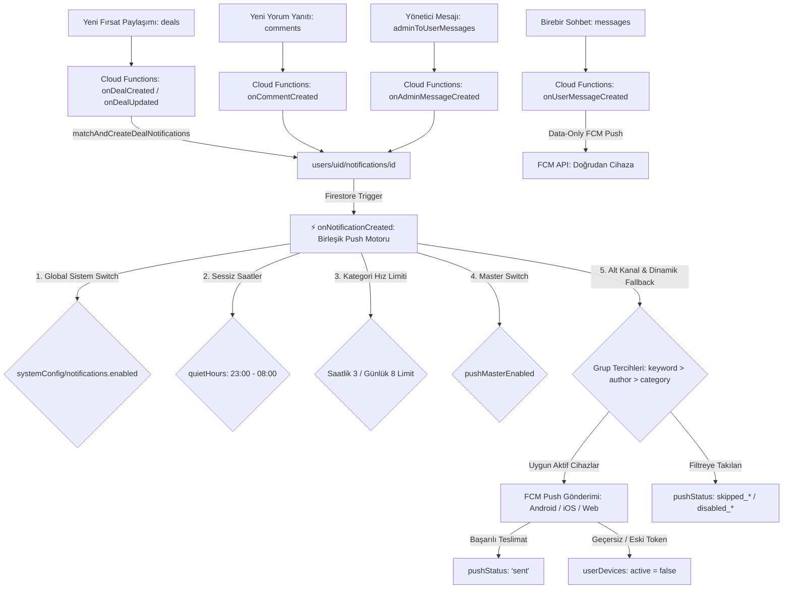

# 🔔 FırsatKolik — Bildirim Sistemi ve Push Motoru Master Mimari Rehberi

> [!IMPORTANT]
> **Base Doküman & Bildirim Kontratı:** Bu doküman, FırsatKolik platformunun mobil, sunucu (Cloud Functions), veritabanı (Firestore) ve FCM katmanlarındaki tüm anlık push ve bildirim merkezi mekanizmasını yöneten **ana orkestratör (Base Contract)** dokümandır. Her bir alt mimarinin ve senaryo matrisinin ayrıntılı teknik referansları ilgili bölümlerde doğrudan bağlantılanmıştır.

Bu doküman; **FırsatKolik** platformunun mobil istemci (Flutter), sunucu (Firebase Cloud Functions), veritabanı (Cloud Firestore), cihaz yönetim katmanı (FCM / APNs) ve Web Admin paneli katmanlarındaki tüm bildirim mekanizmasının çalışma prensiplerini, 10 temel bildirim senaryosunu, veri modellerini, akıllı eşleşme ve tekilleştirme (deduplication) motorunu, dinamik neden dönüşümünü, sessiz saatler ve hız limitlerini, bağlamsal izin isteme mimarisini ve otomatik test süitlerini tanımlayan **resmi mimari sözleşmedir (Documentation Contract)**.

---

## 📑 İçindekiler
1. [🌟 Genel Mimari ve Uçtan Uca Akış](#1--genel-mimari-ve-uçtan-uca-akış)
2. [🎯 Bağlamsal ve Değer Odaklı İzin İsteme Mimarisi](#2--bağlamsal-ve-değer-odaklı-i̇zin-i̇steme-mimarisi)
3. [⚙️ Veritabanı Şemaları ve Veri Modelleri (Firestore)](#3-️-veritabanı-şemaları-ve-veri-modelleri-firestore)
4. [🛡️ Güvenlik Kuralları ve İndeks Mimarisi](#4-️-güvenlik-kuralları-ve-i̇ndeks-mimarisi)
5. [🧠 Akıllı Eşleşme, Önceliklendirme ve Deduplication Motoru](#5--akıllı-eşleşme-önceliklendirme-ve-deduplication-motoru)
6. [⚡ Firebase Cloud Functions ve Backend Dağıtım Hattı](#6-️-firebase-cloud-functions-ve-backend-dağıtım-hattı)
7. [📱 Mobil İstemci Mimarisi (Flutter / FCM / Yerel Bildirimler)](#7--mobil-i̇stemci-mimarisi-flutter--fcm--yerel-bildirimler)
8. [🛡️ Android Bildirim Kanalları ve iOS APNs Yapılandırması](#8-️-android-bildirim-kanalları-ve-ios-apns-yapılandırması)
9. [💬 Birebir Mesajlaşma ve Aktif Sohbette Bildirim Bastırma](#9--birebir-mesajlaşma-ve-aktif-sohbette-bildirim-bastırma)
10. [📋 10 Temel Bildirim Senaryosu ve Karar Matrisi](#10--10-temel-bildirim-senaryosu-ve-karar-matrisi)
11. [📊 Push Durum Kodları (pushStatus Değerleri)](#11--push-durum-kodları-pushstatus-değerleri)
12. [🧹 30 Günlük Yaşam Döngüsü ve Otomatik Temizlik (Purge)](#12--30-günlük-yaşam-döngüsü-ve-otomatik-temizlik-purge)
13. [💻 Web Admin Paneli Entegrasyonu](#13--web-admin-paneli-entegrasyonu)
14: [🧪 Otomatik Test Süitleri ve Doğrulama](#14--otomatik-test-süitleri-ve-doğrulama)
15. [🔧 Hata Ayıklama ve Sorun Giderme (Troubleshooting)](#15--hata-ayıklama-ve-sorun-giderme-troubleshooting)
16. [📂 İlgili Kaynak Kod Dosyaları ve Referanslar](#16--ilgili-kaynak-kod-dosyaları-ve-referanslar)

---

## 1. 🌟 Genel Mimari ve Uçtan Uca Akış

> 🔗 **Detaylı Referans Dokümanı:**
> - [Bildirim Sistemi Kapsamlı Mimari ve Referans Kılavuzu](file:///d:/firsatkolik/documentation/bildirimler/NOTIFICATION_SYSTEM_ARCHITECT.md) — 3 katmanlı filtreleme, token yaşam döngüsü ve ayrıntılı mimari şemalar.

FırsatKolik bildirim altyapısı, kullanıcıyı spam bildirimlerle rahatsız etmeden en doğru ve kişiselleştirilmiş fırsatları ulaştırmak üzere tasarlanmış **üç katmanlı hibrit** bir mimariye sahiptir:



### Temel Mimari Prensipler:
1. **Tek Sorumluluk Prensibi (Single Responsibility):** Fırsat, yorum ve admin mesajı tetikleyicileri doğrudan push atmaz; sadece `users/{userId}/notifications` altına standart bir bildirim dokümanı yazar. Push gönderimi, filtreleme ve limit kontrolleri tek bir merkezi motor (`onNotificationCreated`) tarafından yönetilir.
2. **Kalıcı Bildirim Merkezi (Inbox Preservation):** Push bildirimi sessiz saatler veya hız limitleri sebebiyle atılsa bile, bildirim dokümanı kullanıcının uygulama içi "Bildirimler" kutusunda **HER ZAMAN** oluşturulur.
3. **Data-Only Birebir Mesajlaşma:** Sohbet mesajları Android OS tarafından otomatik bildirim basılmasını engellemek için `data-only` payload ile iletilir; Flutter ön plan dinleyicisi kullanıcının o an sohbette olup olmadığını kontrol ederek bildirimi akıllıca bastırır.
4. **Çoklu Cihaz Tekilleştirmesi:** Aynı kullanıcının eski cihaz kayıtları veya mükerrer FCM token'ları otomatik olarak pasife çekilir (`active: false`).

---

## 2. 🎯 Bağlamsal ve Değer Odaklı İzin İsteme Mimarisi

Modern mobil UX standartları gereğince, uygulamanın ilk açılışında (`cold-start / initState`) kullanıcıyı rahatsız eden ve %70 oranında ret alan körü körüne izin isteme mekanizması **tamamen kaldırılmıştır**.

### Neden Kaldırıldı?
* **Spotlight Rehberi Çakışması:** Açılışta çıkan sistem izin dialogu, 8 adımlı interaktif rehber ile çakışarak kullanıcı deneyimini bozuyordu.
* **Kalıcı İzin Kaybı:** iOS ve Android 13+'ta kullanıcı açılışta dialogu bir kez reddettiğinde, işletim sistemi bir daha otomatik pencere açmamakta ve kullanıcı bildirimlere kalıcı olarak kapanmaktadır.

### 5 Organik Bağlamsal Tetikleyici Nokta:
| Tetikleyici Ekran / Bileşen | Kullanıcı Eylemi | İzin İsteme Mantığı | Kabul Oranı |
| :--- | :--- | :--- | :---: |
| **Arama Çubuğu Radarı** ([home_screen.dart](file:///d:/firsatkolik/lib/screens/home_screen.dart)) | Bir arama kelimesini radar simgesine basarak takibe ekleme | `_addKeywordFromSearch` ➔ `requestPermission()` | **%90+** |
| **Anahtar Kelime Takibi** ([keyword_tracking_screen.dart](file:///d:/firsatkolik/lib/screens/keyword_tracking_screen.dart)) | Yeni kelime ekleme veya önerilerden seçme | `_addKeyword` ➔ `requestPermission()` | **%92+** |
| **Kategori Tercihleri** ([category_preferences_screen.dart](file:///d:/firsatkolik/lib/screens/category_preferences_screen.dart)) | Bir kategoriyi veya tümünü takibe alma | `_toggleCategory` / `_selectAllCategories` ➔ `requestPermission()` | **%85+** |
| **Yazar / Avcı Profili** ([profile_screen.dart](file:///d:/firsatkolik/lib/screens/profile_screen.dart)) | Başka bir avcıyı takip etme veya bildirim zilini açma | `_toggleFollow` / `_toggleFollowNotification` ➔ `requestPermission()` | **%88+** |
| **Bildirim Ayarları** ([notification_settings_screen.dart](file:///d:/firsatkolik/lib/screens/notification_settings_screen.dart)) | "Telefon Bildirimleri" master anahtarını AÇIK konuma getirme | `SwitchListTile.onChanged(true)` ➔ `requestPermission()` | **%95+** |

---

## 3. ⚙️ Veritabanı Şemaları ve Veri Modelleri (Firestore)

### 3.1 Cihaz Kayıtları (`userDevices/{userId}_{deviceId}`)
Kullanıcıların FCM token'larını ve cihaz durumlarını takip eder.
* **Belge Kimliği (Document ID):** Deterministik `{userId}_{deviceId}` (Aynı cihazın mükerrer kayıt oluşturmasını engeller).
```json
{
  "uid": "5TMK4IC1lKbqJByvbf5T1tjKEGE2",
  "deviceId": "android_9154692513050225",
  "platform": "android",
  "fcmToken": "eh9gylEBQDiXEVztnUxTMs:APA91bEFfGjo...",
  "permissionStatus": "authorized",
  "active": true,
  "lastSeenAt": "Timestamp",
  "updatedAt": "Timestamp",
  "appVersion": "1.0.4",
  "buildNumber": "12",
  "deactivatedReason": null
}
```

### 3.2 Kullanıcı Bildirim Tercihleri (`users/{uid}/notificationPreferences/main`)
```json
{
  "pushMasterEnabled": true,
  "dealNotificationsEnabled": true,
  "categoryNotificationsEnabled": true,
  "keywordNotificationsEnabled": true,
  "communityNotificationsEnabled": true,
  "submissionStatusNotificationsEnabled": true,
  "marketingNotificationsEnabled": false,
  "quietHoursEnabled": true,
  "quietHoursStart": "23:00",
  "quietHoursEnd": "08:00",
  "timezone": "Europe/Istanbul",
  "updatedAt": "Timestamp",
  "schemaVersion": 1,
  "lastStates": {
    "dealNotificationsEnabled": true,
    "categoryNotificationsEnabled": true,
    "keywordNotificationsEnabled": true,
    "communityNotificationsEnabled": true,
    "submissionStatusNotificationsEnabled": true,
    "marketingNotificationsEnabled": false,
    "quietHoursEnabled": true
  }
}
```

### 3.3 Bildirim Abonelikleri (`notificationSubscriptions/{uid}_{type}_{sanitizedKey}`)
* **Tipler (`type`):** `'keyword'`, `'category'`, `'author'`.
```json
{
  "uid": "5TMK4IC1lKbqJByvbf5T1tjKEGE2",
  "type": "keyword",
  "key": "dyson",
  "displayValue": "Dyson",
  "normalizedValue": "dyson",
  "includeDescendants": true,
  "enabled": true,
  "createdAt": "Timestamp",
  "updatedAt": "Timestamp"
}
```

### 3.4 Kullanıcı Bildirim Kutusu (`users/{uid}/notifications/{notificationId}`)
Uygulama içi Bildirim Merkezi'ni (`AdminNotificationsScreen`) besleyen ana koleksiyondur.
* **Belge Kimliği (Document ID):** Deterministik `{type}_{entityId}_{uid}` (Örn: `deal_dealId_uid`, `admin_msg_msgId`, `reply_commentId_uid`).
```json
{
  "id": "deal_telegram_2790401298_2703_5TMK4IC1lKbqJByvbf5T1tjKEGE2",
  "type": "deal",
  "dealId": "telegram_2790401298_2703",
  "dealTitle": "Erkek Çorap",
  "title": "🎯 Yeni Fırsat!",
  "body": "Erkek Çorap\n💰 149.99 TL",
  "reason": "category",
  "reasonDetail": "moda",
  "reasons": {
    "category": "moda",
    "keyword": "corap"
  },
  "read": false,
  "readAt": null,
  "pushEligible": true,
  "pushStatus": "sent",
  "createdAt": "Timestamp",
  "sentAt": "Timestamp",
  "updatedAt": "Timestamp"
}
```

### 3.5 Sistem Yapılandırması (`systemConfig/notifications`)
```json
{
  "enabled": true,
  "categoryHourlyLimit": 3,
  "categoryDailyLimit": 8,
  "updatedAt": "Timestamp"
}
```

---

## 4. 🛡️ Güvenlik Kuralları ve İndeks Mimarisi

### 4.1 Güvenlik Kuralları ([firestore.rules](file:///d:/firsatkolik/firestore.rules))
1. **Kullanıcı İzolasyonu:** Normal kullanıcılar yalnızca kendi bildirim dokümanlarını okuyup yazabilir (`userId == targetUserId`). Yöneticiler (`isAdmin()`) tam yetkilidir.
2. **Collection Group Yetkilendirmesi:** 30+ günlük toplu bildirim temizliği için `db.collectionGroup('notifications')` sorguları yalnızca yöneticilere açıktır.

### 4.2 Firestore İndeksleri ([firestore.indexes.json](file:///d:/firsatkolik/firestore.indexes.json))
`notifications.createdAt` alanı için hem tekil koleksiyon hem de collection group indeksleri zorunludur:
```json
{
  "collectionGroup": "notifications",
  "fieldPath": "createdAt",
  "indexes": [
    { "queryScope": "COLLECTION", "order": "ASCENDING" },
    { "queryScope": "COLLECTION", "order": "DESCENDING" },
    { "queryScope": "COLLECTION_GROUP", "order": "ASCENDING" },
    { "queryScope": "COLLECTION_GROUP", "order": "DESCENDING" }
  ]
}
```

---

## 5. 🧠 Akıllı Eşleşme, Önceliklendirme ve Deduplication Motoru

Bir fırsat onaylandığında `matchAndCreateDealNotifications` fonksiyonu şu aşamalardan geçer:

```
[ Fırsat Metni: Başlık + Açıklama ]
         │
         ▼
[ Normalizasyon & N-Gram Üretimi (1-Gram, 2-Gram, 3-Gram) ] ──► [ Stop-words Temizliği ]
         │
         ▼
[ Sıkı Regex & Kelime Sınırı Doğrulaması (Strict Word Boundary) ]
         │
         ▼
[ 3'lü Deduplication & Önceliklendirme ]
 1. 🥇 KEYWORD (En Yüksek Öncelik)
 2. 🥈 AUTHOR  (Orta Öncelik)
 3. 🥉 CATEGORY(En Düşük Öncelik)
         │
         ▼
[ reasons Haritasında Çoklu Sebepleri Saklama: reasons = { keyword: 'dyson', category: 'elektronik' } ]
         │
         ▼
[ 400'lük Batch Parçalarıyla users/{uid}/notifications Yazımı ]
```

### Kritik Eşleşme Özellikleri:
1. **Çok Kelimeli Kök Toleransı (Stem Tolerance):** *"sony kulaklik"* takibinde metinde "Sony" ve "Kulaklık" ayrı yerlerde geçse bile tolere edilir; `k ➔ g` yumuşaması (lastik ➔ lastiği) yakalanır.
2. **Özel Kelime Koruması:** Kullanıcı *"mac"* takibi yaptığında, Türkçe *"maç"* kelimesi içeren bilet fırsatlarıyla yalancı eşleşme engellenir.
3. **Kendi Kendine Bildirim Engeli:** Fırsatı paylaşan kullanıcıya kendi paylaşımı için bildirim üretilmez (`sub.uid !== postedBy`).
4. **Dinamik Neden Dönüşümü (Dynamic Reason Fallback):** Eğer kullanıcı kelime bildirimlerini kapatmış ama kategori bildirimlerini açık bırakmışsa, `onNotificationCreated` motoru bildirimin birincil nedenini kategoriye dönüştürür ve başlığı buna göre uyarlayarak push'u iletir.

---

## 6. ⚡ Firebase Cloud Functions ve Backend Dağıtım Hattı

Tüm fonksiyonlar [functions/index.js](file:///d:/firsatkolik/functions/index.js) içerisinde modüler olarak tanımlanmıştır:

| Fonksiyon Adı | Tip / Tetikleyici | Sorumluluk ve Çalışma Mantığı |
| :--- | :--- | :--- |
| **`onDealCreated`** | Firestore `deals/{dealId}` (onCreate) | Fırsat oluşturulduğunda küfür/profanity moderasyonu yapar. Fırsat onaysız ise `admin_deals` FCM konusuna admin bildirimi gönderir ve `adminMessages` oluşturur. Onaylıysa bildirimleri üretir. |
| **`onDealUpdated`** | Firestore `deals/{dealId}` (onUpdate) | Fırsat `isApproved: false ➔ true` olduğunda herkese bildirim üretir (`matchAndCreateDealNotifications`). Kullanıcı fırsatı onaylandığında veya reddedildiğinde `submission_status` bildirimi yazar. |
| **`onCommentCreated`** | Firestore `deals/{dealId}/comments/{commentId}` (onCreate) | Yorum moderasyonu yapar. Eğer yorum başka bir yoruma cevap ise alıcıya `comment_reply` bildirim dokümanı oluşturur. |
| **`onAdminMessageCreated`**| Firestore `adminToUserMessages/{messageId}` (onCreate) | Admin panelinden kullanıcıya mesaj atıldığında `users/{uid}/notifications/admin_msg_{messageId}` belgesini yazar. Push gönderimini `onNotificationCreated` motoruna bırakır. |
| **`onUserMessageCreated`** | Firestore `messages/{messageId}` (onCreate) | Birebir sohbette yeni mesaj geldiğinde alıcının cihazlarına **data-only payload** iletir. |
| **`onNotificationCreated`** | Firestore `users/{uid}/notifications/{id}` (onCreate) | **Merkezi Push Motoru:** Tüm bildirim dokümanlarını dinler; sistem şalteri, sessiz saatler, kategori limitleri, kullanıcı tercihleri ve cihaz token kontrollerini yaparak FCM push gönderir. |
| **`purgeOldDeals`** | PubSub Schedule (`0 4 * * 0` - Her Pazar 04:00) | **30 Günlük Derin Temizlik:** 30 günden eski fırsatları, yorumları, favori referanslarını ve **tüm kullanıcılardaki (`collectionGroup('notifications')`) 30 günü geçmiş bildirimleri** kalıcı olarak siler. |
| **`purgeOldDealsManual`** | HTTPS Callable (`onCall`) | Admin panelinden 30+ günlük eski fırsatları ve ilişkili eski bildirimleri manuel olarak kalıcı siler. |
| **`purgeOldNotificationsManual`** | HTTPS Callable (`onCall`) | Admin yetkisiyle yalnızca 30 günü geçmiş bildirim dokümanlarını (`collectionGroup`) toplu siler. |
| **`sendManualNotification`**| HTTPS Callable (`onCall`) | Admin panelinden Tüm Kullanıcılara (`all`), Tekil UID'ye (`uid`) veya Belirli Token'a (`token`) anlık bildirim gönderir. `notificationLogs` ve `notificationStats` günceller. |
| **`cleanupInvalidTokens`** | HTTPS Callable (`onCall`) | `userDevices` içerisindeki aktif FCM token'ları dryRun ile test ederek geçersiz olanları `active: false` yapar. |
| **`onUserDeleted`** | Auth `user().onDelete` | Kullanıcı silindiğinde `userDevices`, `notificationSubscriptions`, `notifications` ve `notificationPreferences` verilerini kalıcı temizler. |

---

## 7. 📱 Mobil İstemci Mimarisi (Flutter / FCM / Yerel Bildirimler)

Mobil tarafta bildirim döngüsünü [NotificationService](file:///d:/firsatkolik/lib/services/notification_service.dart) yönetir:
* **`initializeLocalNotifications()`:** Android ve iOS yerel bildirim eklentilerini başlatır ve 7 adet özel kanalı tanımlar.
* **`saveFCMToken({String? userId})`:** Cihazın FCM token'ını alır, `userDevices/{userId}_{deviceId}` dokümanına kaydeder ve `onTokenRefresh` dinleyicisini kurar.
* **`clearDeviceToken()`:** Çıkış yapıldığında token'ı pasife alır ve yerel FCM önbelleğini siler (`deleteToken`).

### Derin Linkleme ve Bildirime Tıklama (Deep Linking):
| Payload Verisi | Hedef Ekran | Parametreler |
| :--- | :--- | :--- |
| `type == 'deal'` veya `dealId` | **`DealDetailScreen`** | `dealId` ile detay ekranı açılır |
| `type == 'comment_reply'` | **`DealDetailScreen`** | `dealId` açılır ve `commentId`'ye otomatik odaklanır |
| `type == 'message'` | **`MessageScreen`** | `senderId`, `senderName`, `messageText`, `dealId` vb. ile sohbet odası anında açılır |
| `type == 'admin_deal'` | **`AdminScreen`** | Admin onay paneli açılır |
| `type == 'admin_message'` | **`MessageScreen`** / **`AdminNotificationsScreen`** | Yönetici duyuruları / destek sohbeti açılır |

### 7.1 🚀 Cold Start (Uygulama Kapalıyken) Bildirim Kuyruğu ve Akıcı Yönlendirme
Uygulama tamamen kapalıyken bildirime tıklandığında:
1. `main()` içinde `initializeLocalNotifications()` ve `getNotificationAppLaunchDetails()` payload'ı yakalar.
2. `navigatorKey.currentState` henüz `null` olduğu için bildirim `_startPendingNotificationCheck` kuyruğuna alınır.
3. Kontrol periyodu **200ms**'dir. Fırsat ve genel bildirimler için `currentUser` beklenmez; mesaj bildirimlerinde `_auth.currentUser` oturumu diskten yüklendiği anda kuyruk çözülür.
4. **Çift Tıklama (Duplicate) Filtre Koruması:** `_lastHandledTapTime` damgası kuyruğa alınırken değil, **yalnızca `navigator.push` fiilen icra edildiğinde** kaydedilir. Kuyruktan gelen çağrılar `isFromPending: true` bayrağı ile duplicate filtresini bypass ederek asla yutulmaz.

---

## 8. 🛡️ Android Bildirim Kanalları ve iOS APNs Yapılandırması

### Android Bildirim Kanalları (7 Kanal):
| Kanal ID | Kanal Adı | Önem (`Importance`) | LED Rengi | Kullanım Amacı |
| :--- | :--- | :--- | :---: | :--- |
| **`sicak_firsatlar_general_v2`** | Sıcak Fırsatlar Bildirimleri | `max` | `#FF6B35` | Genel fırsat, kategori ve pazarlama bildirimleri |
| **`keyword_alerts_channel`** | Özel Fırsat Bildirimleri | `max` | `#FF9800` | Takip edilen anahtar kelime eşleşmeleri |
| **`comment_replies_channel`** | Yorum Cevapları | `high` | `#2196F3` | Yorumlara gelen yanıtlar |
| **`messages_channel_v3`** | Mesaj Bildirimleri | `max` | `#2196F3` | Kullanıcılar arası sohbet mesajları |
| **`admin_messages_channel_v3`** | Admin Mesaj Bildirimleri | `max` | `#FF5722` | Resmi yönetici duyuru ve uyarıları |
| **`follow_channel`** | Takip Bildirimleri | `high` | `#4CAF50` | Takip edilen avcıların paylaşımları |
| **`admin_channel`** | Admin Bildirimleri | `max` | `#2196F3` | Onay bekleyen yeni fırsatlar (Yöneticiler) |

### iOS APNs Yapılandırması:
* **Ses & Rozet:** `sound: 'default'`, `badge: 1`.
* **Kategori & Öncelik:** `apns-priority: 10`, `interruption-level: active` (Admin mesajlarında `time-sensitive`).
* **Content Available:** Arka plan veri senkronizasyonu için `content-available: 1`.
* **APNs Collapse ID & Thread ID:** `apns-collapse-id: "msg_" + senderId` ve `thread-id: "conv_" + senderId` ile kilit ekranında sohbet bazlı gruplama.

---

## 9. 💬 Birebir Mesajlaşma, Anti-Spam ve Bildirim Yığınlama Mimarisi

Kullanıcılar arası mesajlaşmada bildirim deneyimini kusursuz kılmak ve spam durumlarını profesyonelce yönetmek için **5 Katmanlı İleri Seviye Mimari** uygulanır:

### 9.1 🛡️ Gönderici Anti-Spam Rate Limiter (Sliding Window)
- `MessageScreen` içinde `_recentMessageTimestamps` listesi tutulur.
- **Kural:** **5 saniyede maksimum 3 mesaj.**
- Kullanıcı 5 saniye içinde 3'ten fazla mesaj atmaya çalışırsa mesaj Firestore'a gönderilmez ve ekranda *"Çok hızlı mesaj gönderiyorsunuz. Lütfen birkaç saniye bekleyin."* uyarısı gösterilir. 5 saniye sonra pencere otomatik temizlenir.

### 9.2 ⚡ Backend FCM Collapse Key & APNs Sıkıştırma (`onUserMessageCreated`)
- Android FCM payload'ında `android.collapseKey: "msg_" + senderId` tanımlıdır.
- iOS APNs payload'ında `headers['apns-collapse-id']: "msg_" + senderId` ve `aps['thread-id']: "conv_" + senderId` tanımlıdır.
- **Sonuç:** Cihaz kapalıyken veya internet yavaşken gelen 20 mesaj, sunucu seviyesinde tek bildirim halinde sıkıştırılır.

### 9.3 📱 İşletim Sistemi Bildirim Yığınlama (OS Stacking) & `onlyAlertOnce`
- **Deterministik ID & Tag:** `notifId = senderId.hashCode % 100000` ve `tag = 'msg_$senderId'`.
- **`onlyAlertOnce: true`:** Yeni mesaj geldiğinde mevcut bildirim kartı sessizce güncellenir; telefon her saniye tekrar tekrar çalmaz/titremez.
- **`groupKey: 'group_messages'`:** Android sisteminde sohbet bildirimleri diğer bildirimlerden ayrı, temiz bir grupta tutulur.

### 9.4 🚀 Instant Optimistic Seeding (Sıfır Gecikmeyle Akıcı Chat Açılışı)
- Push bildiriminden veya In-App banner'dan sohbete geçildiğinde gelen son mesaj metni ve ilişkili fırsat verisi `MessageScreen`'e parametre olarak iletilir.
- `MessageScreen.initState` anında bu mesaj `_optimisticMessages` listesine eklenir.
- Firestore WebSocket ağ bağlantısı henüz kurulmamış olsa bile ilk karede (`frame 0`) mesaj ekranda gösterilir (iskelet ve boş ekran sıfırlanır).
- Firestore 1 saniye sonra bağlandığında `mergedMap` dedup algoritması sunucu mesajıyla geçici mesajı dikişsiz olarak birleştirir.

### 9.5 🔕 Aktif Sohbette Bildirim Bastırma & Haptic Debounce
- **Aktif Chat Bastırma:** `NotificationService.activeChatUserId == senderId` ise ön planda ne push ne de In-App banner üretilir.
- **In-App Banner Titreşim Koruması:** Hızlı mesaj akışlarında haptic motorunu korumak için 1.5 saniyelik Haptic Debounce uygulanır.

---

## 10. 📋 10 Temel Bildirim Senaryosu ve Karar Matrisi

> 🔗 **Detaylı Referans Dokümanı:**
> - [Bildirim ve Push Bildirim Senaryoları Rehberi](file:///d:/firsatkolik/documentation/bildirimler/notification_scenarios.md) — 10 senaryonun tüm eşik şartları, JSON payload örnekleri ve test çıktıları.

| Senaryo ID | Bildirim Türü (`type`) | Tetikleyici Olay | Kanal ID & Renk | Başlık (`title`) / İçerik (`body`) Şablonu | Koşul, Öncelik & Davranış |
| :--- | :--- | :--- | :--- | :--- | :--- |
| **NOTIF-01** | `deal` (Kategori) | Abone olunan bir kategoriye ait yeni fırsatın yayınlanması | `sicak_firsatlar_general_v2`<br>(#FF6B35) | **🎯 Yeni Fırsat!**<br>[Fırsat Başlığı]<br>💰 [Fiyat] TL | Kategori aboneliği açık olmalı. En düşük önceliklidir (3. seviye). Saatlik/günlük kategori hız limitlerine ve sessiz saatlere tabidir. |
| **NOTIF-02** | `deal` (Yazar) | Bildirim zili açılan bir avcının paylaştığı fırsatın onaylanması | `sicak_firsatlar_general_v2`<br>(#FF6B35) | **👤 Takip Ettiğiniz Kişi!**<br>Takip ettiğiniz yazar yeni fırsat paylaştı: [Fırsat Başlığı] | Yazar takibi açık olmalı. Orta önceliklidir (2. seviye). Kategori hız limitlerine tabi değildir; sessiz saatlere tabidir. |
| **NOTIF-03** | `deal` (Anahtar Kelime)| Abone olunan anahtar kelimeyi içeren fırsatın onaylanması | `keyword_alerts_channel`<br>(#FF9800) | **🎯 İlginizi Çeken Kelime!**<br>"[Kelime]" içeren yeni fırsat: [Fırsat Başlığı] | Kelime aboneliği açık olmalı. En yüksek önceliklidir (Deduplication). Eğer kelime bildirimleri kapalıysa otomatik kategoriye dinamik dönüşüm yapılır. |
| **NOTIF-04** | `comment_reply` | Bir kullanıcının yorumuna başka bir kullanıcının cevap yazması | `comment_replies_channel`<br>(#2196F3) | **[Kullanıcı Adı] yorumunuza cevap verdi**<br>[Cevap Metni] | Kendine yanıt verilmemiş olmalı. **Sessiz saatlerden muaftır** (24 saat anlık iletilir). |
| **NOTIF-05** | `submission_status` (Onay) | Kullanıcının paylaştığı fırsatın admin tarafından onaylanması | N/A (Push Yok) | **🎉 Fırsatınız Onaylandı!**<br>Paylaştığınız "[Fırsat Başlığı]" onaylandı ve yayına alındı. | **[SESSİZ BİLDİRİM]** Telefona push gitmez (`disabled_permanently_for_submission_status`), sadece Bildirim Merkezi'nde saklanır. |
| **NOTIF-06** | `submission_status` (Red) | Kullanıcının paylaştığı fırsatın admin tarafından reddedilmesi | N/A (Push Yok) | **❌ Fırsatınız Reddedildi**<br>Paylaştığınız "[Fırsat Başlığı]" kurallarımıza uymadığı için reddedildi. | **[SESSİZ BİLDİRİM]** Telefona push gitmez (`disabled_permanently_for_submission_status`), sadece Bildirim Merkezi'nde saklanır. |
| **NOTIF-07** | `admin_message` | Admin panelinden kullanıcıya resmi bildirim gönderilmesi | `admin_messages_channel_v3`<br>(#FF5722) | **🛡️ [Admin Başlığı]**<br>[Admin Mesajı] | **Sessiz saatlerden ve grup tercihlerinden muaftır.** Yalnızca Master Switch kapalıysa engellenir. Ön planda `InAppMessageBanner` ile gösterilir. |
| **NOTIF-08** | `message` (Sohbet) | Kullanıcılar arası birebir mesajlaşmada yeni mesaj gelmesi | `messages_channel_v3`<br>(#2196F3) | **💬 [Gönderen Adı]**<br>[Mesaj Metni] | **Data-only payload.** Alıcı o an o kullanıcıyla aktif sohbet odasındaysa bildirim bastırılır. Ön planda `InAppMessageBanner`, arka planda sistem bildirimi gösterilir. |
| **NOTIF-09** | `admin_deal` | Onay bekleyen yeni bir fırsat (kullanıcı veya bot) paylaşıldığında adminlere giden bildirim | `admin_channel`<br>(#2196F3) | **👮‍♂️ Yeni Onay Bekleyen Fırsat ([Kaynak])**<br>[Fırsat Başlığı]<br>💰 [Fiyat] TL | `admin_deals` FCM konusuna gönderilir. Sadece yöneticilere iletilir. Deterministik `tag: 'admin_deal_${dealId}'` ile mükerrerlik önlenir. |
| **NOTIF-10** | `marketing` | Özel kampanyalar, hediye çekleri ve pazarlama duyuruları | `sicak_firsatlar_general_v2`<br>(#FF6B35) | **[Kampanya Başlığı]**<br>[Kampanya Detayı] | Kampanya switch'i açık olmalı. Sessiz saatlere ve master switch'e tabidir. |

---

## 11. 📊 Push Durum Kodları (pushStatus Değerleri)

Cloud Functions `onNotificationCreated` motoru her bildirim dokümanına şu durumlardan birini yazar:

| `pushStatus` Değeri | Açıklama |
| :--- | :--- |
| **`sent`** | Push bildirimi FCM üzerinden kullanıcının aktif cihaz(lar)ına başarıyla iletildi. |
| **`failed`** | FCM gönderimi sırasında cihaz bazlı teknik bir hata oluştu. |
| **`no_active_devices`** | Kullanıcının veritabanında `active: true` olan geçerli bir FCM token kaydı bulunamadı. |
| **`disabled_permanently_for_submission_status`** | Paylaşım durumu (onay/red) bildirimleri için push bilerek kapatılmıştır (sadece uygulama içi kutuda saklanır). |
| **`disabled_by_system_master_switch`** | Web Admin panelinden global bildirim şalteri (`systemConfig/notifications.enabled: false`) kapatılmıştır. |
| **`disabled_by_user_master_switch`** | Kullanıcı "Telefon Bildirimleri" master anahtarını (`pushMasterEnabled: false`) kapatmıştır. |
| **`disabled_by_user_group_<grup>`** | Kullanıcı ilgili bildirim grubunu kapatmıştır (Örn: `disabled_by_user_group_category`, `disabled_by_user_group_deal`). |
| **`skipped_quiet_hours`** | Kullanıcının belirlediği sessiz saatler aralığında olunduğu için push gönderimi atlandı. |
| **`skipped_category_limit`** | Kullanıcının saatlik (3) veya günlük (8) kategori bildirim kotası dolduğu için push atlandı. |

---

## 12. 🧹 30 Günlük Yaşam Döngüsü ve Otomatik Temizlik (Purge)

Kullanıcıların Bildirim Merkezi (`users/{userId}/notifications`) kutusunda atıl bildirimlerin birikmesini ve veritabanı şişmesini önlemek için **30 günlük veri saklama politikası** uygulanır:
1. **Haftalık Otomatik Cron (`purgeOldDeals`):** Her Pazar gece 04:00'da çalışarak `createdAt < 30 gün önce` olan tüm bildirim dokümanlarını `collectionGroup('notifications')` üzerinden 400'lük gruplar halinde kalıcı olarak siler.
2. **Web Admin Manuel Temizlik (`purgeOldNotificationsManual` / `purgeOldDealsManual`):** Admin panelinden "30+ Günlük Temizlik" butonuna tıklandığında sunucu tarafında Admin SDK yetkisiyle anında temizlenir.
3. **Maliyet & Performans Avantajı:** İstemci tarafında sayfalama hızlanır, Firestore okuma/yazma maliyeti minimize edilir.

---

## 13. 💻 Web Admin Paneli Entegrasyonu

Web Admin panelinde [web/admin/app.js](file:///d:/firsatkolik/web/admin/app.js) üzerinden bildirimler yönetilir:
* **Manuel Push Gönderimi (`sendManualNotification`):** Tüm Kullanıcılar, Belirli UID veya Belirli Token hedeflenerek bildirim gönderilir.
* **Geçersiz Token Temizliği (`cleanupInvalidTokens`):** Veritabanındaki aktif cihazların token geçerliliğini test edip bayat token'ları otomatik pasife alır.
* **Sistem Limitleri Yönetimi:** Kategori saatlik ve günlük hız limitleri doğrudan `systemConfig/notifications` üzerinden güncellenir.
* **30+ Günlük Fırsat ve Bildirim Temizliği:** Sunucudaki `purgeOldDealsManual` veya `purgeOldNotificationsManual` fonksiyonlarını çağırarak derin temizlik yapar.
* **Bildirim Grafikleri:** Günlük gönderilen bildirim istatistikleri `notificationStats` koleksiyonundan çekilerek çizgi grafiklerle görselleştirilir.

---

## 14. 🧪 Otomatik Test Süitleri ve Doğrulama

Tüm bildirim sistemi ve senaryoları 4 ayrı test paketiyle tam kapsamlı (%100) doğrulanmaktadır:

| Test Dosyası | Kapsam | Komut |
| :--- | :--- | :--- |
| **`test/messaging_and_anti_spam_test.dart`** | Anti-spam (5s/max 3 msg), deterministik notifId & tag, payload parser, instant seeding & dedup birim testleri (11 Test) | `flutter test test/messaging_and_anti_spam_test.dart` |
| **`test/notification_logic_test.dart`** | Flutter birim testleri, serileştirme (toMap/fromFirestore), Master Switch State Preservation | `flutter test test/notification_logic_test.dart` |
| **`functions/tests/test_notification_settings.js`** | 5 Test Paketi & 18 Alt Senaryo: Master Switch OFF/ON, Alt kanal engelleri, Sessiz saatler, Yorum muafiyeti, Kategori limitleri, Cihaz kontrolü | `node functions/tests/test_notification_settings.js` |
| **`functions/tests/test_notifications_menu.js`** | Bildirim Merkezi testleri: Fırsat Onay, Fırsat Red, Deduplication (Kelime > Yazar > Kategori) önceliklendirme ve dinamik içerik dönüşümü, Yorum Yanıt | `node functions/tests/test_notifications_menu.js` |
| **`functions/tests/test_all_notification_scenarios.js`** | Çaprazlama Uçtan Uca Bütünleşik Test Süiti: 10 Senaryonun tamamını canlı veritabanı üzerinde çapraz kontrol eder | `node functions/tests/test_all_notification_scenarios.js` |

---

## 15. 🔧 Hata Ayıklama ve Sorun Giderme (Troubleshooting)

### 15.1 Bildirim Gitmiyor Kontrol Adımları:
1. **`userDevices` Kaydı:** Kullanıcının aktif bir cihazı var mı (`active == true`) ve token'ı dolu mu?
2. **Kullanıcı Tercihleri:** `pushMasterEnabled: true` mu? İlgili alt kanal açık mı?
3. **Sessiz Saatler:** Şu an kullanıcının `quietHours` aralığında mıyız? (`skipped_quiet_hours`).
4. **Kategori Hız Limiti:** Son 1 saatte 3'ten veya son 24 saatte 8'den fazla kategori bildirimi gitti mi? (`skipped_category_limit`).
5. **Fırsat Durumu:** Fırsat `published` ve `isApproved == true` durumunda mı?
6. **FCM V1 Tip Güvenliği:** FCM data parametrelerinin tümü String tipinde olmalıdır (Tüm nesneler `String()` veya `JSON.stringify()` ile serileştirilir).

---

## 16. 📂 İlgili Kaynak Kod Dosyaları ve Referanslar

| Rol / Katman | Dosya Yolu | Açıklama |
| :--- | :--- | :--- |
| **Mobil Bildirim Servisi** | [notification_service.dart](file:///d:/firsatkolik/lib/services/notification_service.dart) | Local notifications, FCM token kaydı, dinleyiciler ve deep-linking. |
| **Mobil Bildirim Merkezi** | [admin_notifications_screen.dart](file:///d:/firsatkolik/lib/screens/admin_notifications_screen.dart) | 3 sekmeli kullanıcı bildirim kutusu arayüzü. |
| **Mobil Bildirim Ayarları** | [notification_settings_screen.dart](file:///d:/firsatkolik/lib/screens/notification_settings_screen.dart) | 3 katmanlı bildirim tercihleri ve sessiz saatler ayarları. |
| **Mobil In-App Banner** | [in_app_message_banner.dart](file:///d:/firsatkolik/lib/widgets/in_app_message_banner.dart) | Ön planda zarif mesaj ve admin bildirim banner'ı. |
| **Cloud Functions Merkezi** | [index.js](file:///d:/firsatkolik/functions/index.js) | `onNotificationCreated`, `onDealCreated`, `onDealUpdated`, `onCommentCreated`, `onAdminMessageCreated`, `onUserMessageCreated`, `purgeOldDeals`. |
| **Güvenlik Kuralları** | [firestore.rules](file:///d:/firsatkolik/firestore.rules) | `notifications`, `notificationSubscriptions`, `userDevices` ve collection group kuralları. |
| **Firestore İndeksleri** | [firestore.indexes.json](file:///d:/firsatkolik/firestore.indexes.json) | `notifications.createdAt` single-field ve collection group indeksleri. |
| **Web Admin Paneli** | [app.js](file:///d:/firsatkolik/web/admin/app.js) & [index.html](file:///d:/firsatkolik/web/admin/index.html) | Manuel push gönderimi, token temizliği, hız limiti ve grafikler. |
| **Entegrasyon Test Süiti** | [test_all_notification_scenarios.js](file:///d:/firsatkolik/functions/tests/test_all_notification_scenarios.js) | 10 senaryoluk uçtan uca canlı doğrulama testi. |
