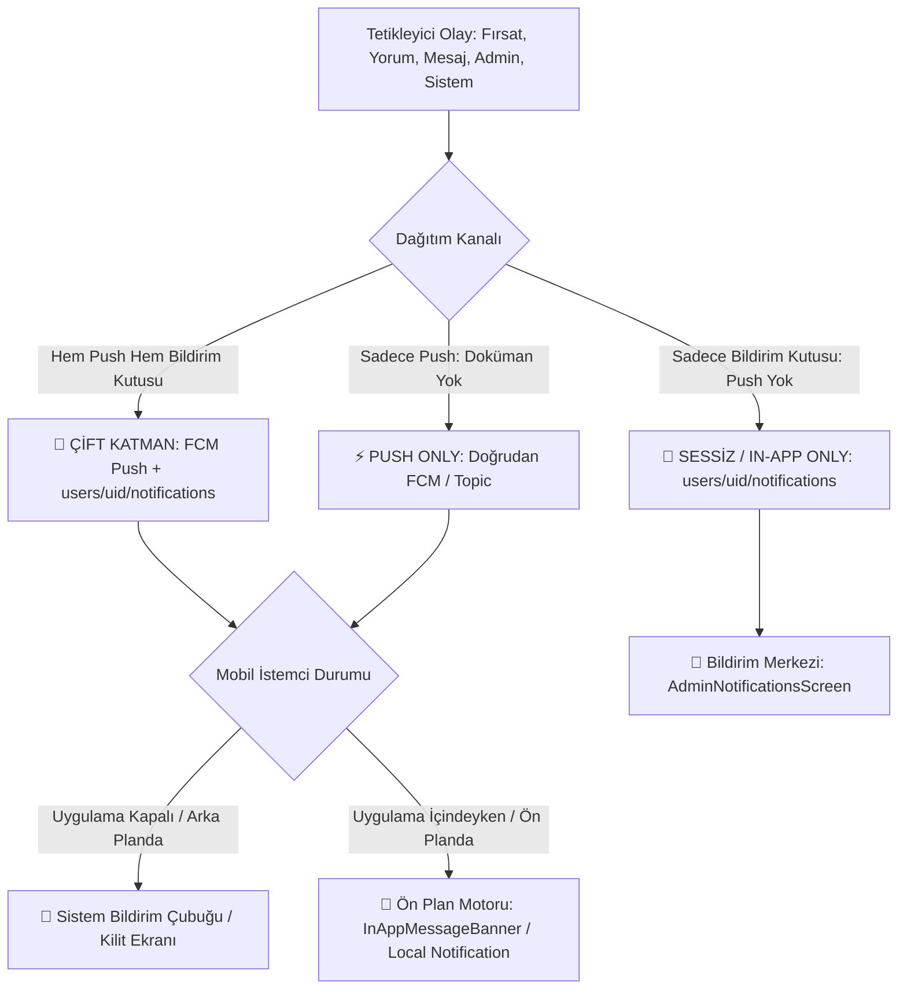
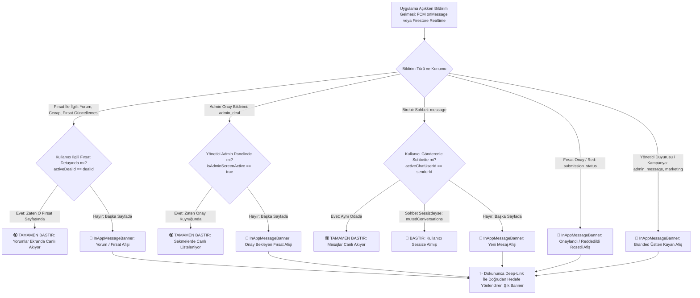

# 🔔 FırsatKolik — Bildirim ve Push Bildirim Senaryoları Rehberi (vProduction - Kapsamlı & Güncel)

> [!NOTE]
> Bu doküman Bildirim Senaryoları ve Karar Matrislerinin detaylı kılavuzudur. Sistemin güncel şemaları, 10 temel senaryo matrisi, Cloud Functions tetikleyicileri, güvenlik kuralları ve test süitleri için lütfen **[Bildirim Sistemi ve Push Motoru Master Mimari Rehberi](file:///d:/firsatkolik/documentation/bildirimler/bildirim_sistemi_rehberi.md)** dokümanını inceleyiniz.

Bu doküman, FırsatKolik platformundaki iki temel bildirim alanının (**"Profilim -> Bildirimler"** menüsü ve **"Profilim -> Bildirim Ayarları"** menüsü) işleyişini, tetikleme kurallarını, kademeli pasifleştirme (parent-child) mantığını, veri akışlarını, bağlamsal izin isteme matrisini, önceliklendirme ve tekilleştirme mekanizmalarını ve tüm olası senaryoları detaylandırır.

---

## 🗺️ 1. Genel Bakış ve Temel Mimari

Uygulama içerisinde bildirimlerle ilgili iki temel kavram bulunur:

1. **"Bildirimler" Menüsü (Uygulama İçi Bildirim Kutusu / Notification Center):**
   * Kullanıcının geçmişe dönük aldığı tüm bildirimleri listelediği arayüzdür (`AdminNotificationsScreen`).
   * **3 Sekmeli Filtreleme (Tabs):**
     * **Tümü (`all`):** Fırsat, yazar, kelime, yorum ve admin tüm bildirimleri.
     * **Admin (`admin`):** Yalnızca `admin_message` ve `submission_status` bildirimleri.
     * **Yorumlar (`replies`):** Yalnızca `comment_reply` bildirimleri.
   * **İşlemler:** Bildirime tıklayarak ilgili ekrana gitme ve okundu işaretleme (`markNotificationAsRead`), sağa kaydırarak silme (`deleteNotification`), sağ üst çöp kutusu ikonuyla tümünü silme (`deleteAllNotifications`).
   * **Veritabanı Konumu:** Firestore'da her kullanıcının kendi alt koleksiyonunda saklanır (`users/{userId}/notifications`).
   * **İndeks Gereksinimi:** Mobil uygulamanın listeleme sorgusu `users/{userId}/notifications.orderBy('createdAt', descending: true)` için `COLLECTION_DESC` indeksi zorunludur.
   * **Kritik Kural:** Bir bildirim tetiklendiğinde, kullanıcının push ayarları veya sessiz saatleri ne olursa olsun, bu doküman veritabanında **HER ZAMAN** oluşturulur. Push bildirimi gitmese bile bildirim kutusunda bu bildirim listelenmeye devam eder.
   * **🧹 30 Günlük Yaşam Döngüsü (Auto-Purge):** Bildirim kutusunda atıl bildirim birikmesini önlemek için, oluşturulma tarihi üzerinden **30 gün geçmiş olan tüm bildirimler**, haftalık zamanlanmış `purgeOldDeals` görevi veya Admin paneli derin temizliği ile tüm kullanıcılardan kalıcı olarak silinir (`COLLECTION_GROUP_ASC` indeksi kullanılır).

2. **"Bildirim Ayarları" Menüsü (Anlık Push Bildirimleri / FCM Push Notifications):**
   * Kullanıcının telefonuna gelen anlık uyarıların (Push) kanallarını, sessiz saatlerini ve genel izin durumunu yönettiği arayüzdür (`NotificationSettingsScreen`).
   * Firestore'da `users/{userId}/notificationPreferences/main` belgesinde saklanır.
   * Cloud Functions `onNotificationCreated` tetikleyicisi, bildirim kutusuna yeni bir doküman eklendiğinde devreye girer. Bu tercihlere, sistem limitlerine ve sessiz saatlere bakarak push bildirimini hedefler veya göndermeyi atlar.

---

## 📁 2. Tüm Bildirim Türleri, Aksiyon Tetikleyicileri ve Dağıtım Matrisi

FırsatKolik platformundaki tüm bildirimler dağıtım kanalı ve depolama mekanizmasına göre **3 ana kategoriye** ayrılır:



### 2.1 📊 Dağıtım Kanalına Göre Sınıflandırma
1. **🚀 Kategori A: Hem Push Hem Bildirim Merkezi (Çift Katmanlı Bildirimler):**
   * Veritabanında `users/{userId}/notifications` altına kaydedilir (Kullanıcının Bildirim Kutusu'nda kalıcı saklanır).
   * Cloud Functions `onNotificationCreated` motoru üzerinden filtrelere (sessiz saatler, hız limitleri, kullanıcı tercihleri) tabi tutularak kullanıcının telefonuna **FCM Push** bildirimi olarak iletilir.
   * *Kapsam:* Kategori Fırsatları, Yazar Takip Fırsatları, Botkolik Radarı, Anahtar Kelime Fırsatları, Yoruma Cevap, Fırsata Yorum, Resmi Yönetici Duyuruları, Admin Kampanyaları (all/uid).

2. **🔕 Kategori B: Sadece Bildirim Merkezi (Push Gönderilmez - Sessiz / In-App Only):**
   * `users/{userId}/notifications` altına doküman yazılır ancak telefon bildirim çubuğuna push **GİTMEZ**.
   * *Kapsam:*
     * **Filtreye Takılan Bildirimler (In-App Fallback):** Kullanıcının sessiz saatlerde olması (`skipped_quiet_hours`), saatlik/günlük hız limitlerinin dolması (`skipped_*_limit`), ardışık deal burst cooldown'ı (`skipped_deal_burst_cooldown`), grup switch'inin kapalı olması (`disabled_by_user_group_*`), Master Switch'in kapalı olması (`disabled_by_user_master_switch`) veya aktif cihazının olmaması (`no_active_devices`) durumlarında doküman Bildirim Kutusu'nda kalır; fakat kullanıcının telefonu rahatsız edilmez.

3. **⚡ Kategori C: Sadece Push (Bildirim Merkezine Doküman Yazılmaz):**
   * Kullanıcının `users/{userId}/notifications` kutusunda doküman oluşturulmaz; anlık operasyonel veya gizlilik gerektiren bildirimlerdir.
   * *Kapsam:*
     * **Birebir Sohbet Mesajları (`message`):** Kullanıcılar arası sohbet mesajları Bildirim Kutusu'nda değil, `messages` koleksiyonunda ve "Mesajlar" (`MessagesListScreen`) sayfasında saklanır. Telefona **Data-Only FCM Push** atılır.
     * **Onay Bekleyen Yeni Fırsat (`admin_deal`):** Bot veya kullanıcı tarafından paylaşılan onaysız fırsatlar yalnızca yöneticilerin abone olduğu `admin_deals` FCM konusuna gönderilir.
     * **Moderasyona Takılan Fırsat (`admin_deal` - Moderasyon):** Küfür veya yasaklı kelime içeren paylaşımlar admin topic'ine kırmızı uyarıyla push atılır.
     * **Doğrudan Token Gönderimi (`sendManualNotification` - `targetType: token`):** Admin panelinden belirli bir cihaz token'ına atılan tekil test/servis push'ları.

---

### 2.2 📋 Uçtan Uca Bildirim Davranış ve Yaşam Döngüsü Matrisi (PROD-READY)

Aşağıdaki tablo; projedeki tüm bildirim türlerini, tetikleyen eylemleri, dağıtım türünü, **uygulama kapalıyken**, **arka plandayken** ve özellikle **uygulama içindeyken (ön planda)** nasıl davrandığını eksiksiz olarak listeler:

| Senaryo ID | Bildirim Türü (`type` / `reason`) | Tetikleyici Eylem (Hangi Durumda Gelir?) | Dağıtım Kanalı | Uygulama Kapalıyken (Cold Start) | Uygulama Arka Plandayken (Background) | 📱 Uygulama İÇİNDEYKEN BİLE (Ön Plan / Foreground) (PROD-READY) | Tıklama Hedefi (Deep Link) |
| :--- | :--- | :--- | :--- | :--- | :--- | :--- | :--- |
| **NOTIF-01** | `deal`<br>(reason: `category`) | Abone olunan bir kategoriye ait fırsat onaylanıp yayına alındığında | **Hem Push Hem Bildirim Merkezi** | Sistem tepsisinde push kartı çıkar; tıklandığında soğuk açılış kuyruğu (`_startPendingNotificationCheck`) ile Splash sonrasında fırsat detayını açar. | Sistem bildirim çubuğunda push kartı çıkar; tıklandığında anında fırsat detayını açar. | 🌟 **Evrensel In-App Banner:** Ekrana üstten kayarak inen şık, turuncu rozetli `InAppMessageBanner(badge: 'Sıcak Fırsat')` açılır. Tıklandığında anında fırsat detayına gider. | **`DealDetailScreen(dealId)`** |
| **NOTIF-02** | `deal`<br>(reason: `author`) | Takip edilen bir avcı/yazar yeni fırsat paylaşıp onaylandığında | **Hem Push Hem Bildirim Merkezi** | Sistem tepsisinde kilit ekranı kartı çıkar (`follow_channel`). Tıklandığında fırsat detayına yönlendirir. | Bildirim çubuğunda yeşil renkli bildirim kartı görünür. | 🌟 **Evrensel In-App Banner:** Camgöbeği rozetli `InAppMessageBanner(badge: 'Yazar Takip')` açılır. Tıklandığında fırsat detayına yönlendirir. | **`DealDetailScreen(dealId)`** |
| **NOTIF-03** | `deal`<br>(reason: `author` & detail: `botkolik`) | Botkolik otonom botu web'den sıcak bir fırsat yakalayıp onaylandığında | **Hem Push Hem Bildirim Merkezi** | "⚡ Botkolik Radarı!" başlığıyla sistem kilit ekranında gösterilir. | Bildirim çubuğunda "⚡ Botkolik Radarı!" kartı görünür. | 🌟 **Evrensel In-App Banner:** Botkolik avatarı ve rozetiyle `InAppMessageBanner(badge: 'Yazar Takip')` açılır. Tıklandığında doğrudan yakalanan fırsata gider. | **`DealDetailScreen(dealId)`** |
| **NOTIF-04** | `deal`<br>(reason: `keyword`) | Abone olunan anahtar kelimeyi (Örn: "iphone", "dyson") içeren fırsat onaylandığında | **Hem Push Hem Bildirim Merkezi** | "🎯 İlginizi Çeken Kelime!" başlığıyla çıkar. Tıklandığında Chat-Hijacking koruması sayesinde sohbete DEĞİL doğrudan fırsata gider. | Turuncu renkli (`keyword_alerts_channel`) kilit ekranı kartı olarak iletilir. | 🌟 **Evrensel In-App Banner:** Mor rozetli `InAppMessageBanner(badge: 'Kelime Radarı')` açılır. Chat-Hijacking korumasıyla tıklandığında doğrudan fırsat detayına gider. | **`DealDetailScreen(dealId)`** |
| **NOTIF-05** | `comment_reply` | Bir kullanıcının yorumuna başka bir kullanıcı cevap yazdığında | **Hem Push Hem Bildirim Merkezi** | Sistem bildirim çubuğunda yorum metniyle çıkar. Tıklandığında fırsat detayında doğrudan ilgili yoruma odaklanır. | Bildirim kartı çıkar (`comment_replies_channel`). Sessiz saatlerden muaftır (24 saat anlık iletilir). | 🛡️ **Kullanıcı Zaten O Fırsattaysa (`activeDealId == dealId`):** Yorumlar canlı aktığı için BASTIRILIR (Spam Engeli).<br>🌟 **Başka Ekrandaysa:** Eflatun rozetli `InAppMessageBanner(badge: 'Yorum Cevabı')` açılır. Tıklandığında yoruma odaklanır. | **`DealDetailScreen(dealId, scrollToCommentId: commentId)`** |
| **NOTIF-06** | `comment` (Kök Yorum) | Paylaşılan fırsata ilk seviye ana yorum yapıldığında (fırsat sahibine) | **Hem Push Hem Bildirim Merkezi** | Fırsat sahibinin kilit ekranına "💬 [Kullanıcı] fırsatınıza yorum yaptı" push'u düşer. | Fırsat sahibine bildirim çubuğunda gösterilir. Sessiz saatlerden muaftır. | 🛡️ **Fırsat Sahibi O Fırsattaysa (`activeDealId == dealId`):** Canlı aktığı için BASTIRILIR (Spam Engeli).<br>🌟 **Başka Ekrandaysa:** Mavi rozetli `InAppMessageBanner(badge: 'Yeni Yorum')` açılır. Tıklandığında ilgili yoruma gider. | **`DealDetailScreen(dealId, scrollToCommentId: commentId)`** |
| **NOTIF-07** | `submission_status`<br>(status: `approved`) | Kullanıcının paylaştığı fırsat admin tarafından onaylanıp yayına alındığında | **Hem Push Hem Bildirim Merkezi** | Kilit ekranında yeşil vurgulu (`#10B981`), BigPicture fırsat görselli ve kutlama başlıklı push kartı çıkar (`title: '🎉 Fırsatınız Onaylandı!'`). Tıklandığında doğrudan canlı fırsat detayını açar. | Bildirim çubuğunda "🎉 Fırsatınız Onaylandı!" push kartı görünür. | 🌟 **Evrensel In-App Banner:** Kutlama ikonlu (`Icons.verified_rounded`), yeşil rozetli `InAppMessageBanner(badge: 'Onaylandı', badgeColor: #10B981)` açılır. Çok katmanlı durum çözümleme sayesinde asla "Reddedildi" rozeti gösterilmez. Tıklandığında onaylanan canlı fırsata gider. | **`DealDetailScreen(dealId)`** |
| **NOTIF-08** | `submission_status`<br>(status: `rejected`) | Kullanıcının paylaştığı fırsat kurallara uymadığı için admin tarafından reddedildiğinde | **Hem Push Hem Bildirim Merkezi** | Kilit ekranında yapıcı kehribar/amber vurgulu (`#F59E0B`) ve açıklayıcı push kartı çıkar (`title: 'ℹ️ Fırsatınız Reddedildi'`). Tıklandığında Admin Bildirimleri sekmesine gider ve red gerekçesi modalı otomatik açılır. | Bildirim çubuğunda açıklayıcı kehribar push kartı görünür. | 🌟 **Evrensel In-App Banner:** Kehribar/amber rozetli `InAppMessageBanner(badge: 'Reddedildi', badgeColor: #F59E0B, icon: Icons.info_outline_rounded)` açılır. Tıklandığında moderasyon red açıklamasını gösteren modern modal otomatik açılır. | **`AdminNotificationsScreen(initialTab: 'admin', highlightNotificationId: notifId)`** ➔ **Modern Red Nedeni Modalı** (`_showModernNotificationDetailDialog`) |
| **NOTIF-09** | `admin_message` | Web Admin panelinden kullanıcıya resmi duyuru veya uyarı gönderildiğinde | **Hem Push Hem Bildirim Merkezi** | "🛡️ FırsatKolik Yönetim" başlığıyla yüksek öncelikli (`time-sensitive`) push kartı çıkar. Sessiz saatlerden muaftır. | Bildirim çubuğunda kırmızı renkli (`admin_messages_channel_v3`) kart görünür. | 🛡️ **Kullanıcı Admin Sohbetindeyse:** Bildirim sessizce bastırılır.<br>🌟 **Başka Ekrandaysa:** Kırmızı rozetli `InAppMessageBanner(badge: 'Yönetici Mesajı')` açılır. Tıklandığında Admin sohbetine gider. | **`MessageScreen(otherUserId: 'admin')`** |
| **NOTIF-10** | `message`<br>(P2P Sohbet) | Kullanıcılar arası birebir sohbette yeni mesaj gönderildiğinde | **SADECE Push & In-App Banner (BM Dokümanı Yok)** | Data-Only push iletilir. `firebaseMessagingBackgroundHandler` Android'de tek kart günceller (`tag: msg_$senderId`). iOS kilit ekranında alert kartı gösterir. | Bildirim çubuğunda gönderici bazlı tek kart güncellenir (`onlyAlertOnce: true`). Tıklandığında sıfır gecikmeyle sohbet açılır. | 🛡️ **Aynı Kişiyle Sohbetteyse:** TAMAMEN BASTIRILIR (mesaj ekranda canlı akar).<br>🔕 **Sohbet Sessizdeyse:** BASTIRILIR.<br>🌟 **Başka Ekrandaysa:** Mavi rozetli `InAppMessageBanner(badge: 'Yeni Mesaj')` açılır. Tıklandığında odaya gider. | **`MessageScreen(otherUserId: senderId)`** |
| **NOTIF-11** | `admin_deal`<br>(Onay Bekleyen) | Kullanıcı veya bot tarafından sisteme onaysız (`isApproved: false`) yeni fırsat eklendiğinde | **SADECE Push (Yöneticiler / BM Yok)** | Yalnızca `admin_deals` konusuna abone yöneticilerin kilit ekranına "👮‍♂️ Yeni Onay Bekleyen Fırsat" bildirimi düşer. | Admin bildirim çubuğunda mavi kart olarak gösterilir. | 🛡️ **Yönetici Admin Panelindeyse (`isAdminScreenActive == true`):** Sekmelerde canlı aktığı için BASTIRILIR.<br>🌟 **Admin Başka Ekrandaysa:** Kırmızı rozetli `InAppMessageBanner(badge: 'Onay Bekliyor')` açılır. | **`AdminScreen(initialDealId: dealId, initialTabIndex: 0)`** |
| **NOTIF-12** | `admin_deal`<br>(Moderasyona Takılan) | Paylaşılan fırsat küfür/uygunsuz içerik tespitine takıldığında | **SADECE Push (Yöneticiler / BM Yok)** | Admin kilit ekranına kırmızı renkli "🛡️ Fırsat Moderasyona Takıldı" bildirimi düşer. | Admin bildirim çubuğunda acil moderasyon kartı görünür. | 🛡️ **Admin Panelindeyse:** BASTIRILIR.<br>🌟 **Başka Ekrandaysa:** Acil uyarı rozetli `InAppMessageBanner(badge: 'Onay Bekliyor')` açılır. Tıklandığında admin paneli onay sekmesine gider. | **`AdminScreen(initialDealId: dealId, initialTabIndex: 0)`** |
| **NOTIF-13** | `marketing` / `manual_notification` | Admin panelinden Tüm Kullanıcılara (`targetType: all`) veya Belirli UID'ye kampanya gönderildiğinde | **Hem Push Hem Bildirim Merkezi** | Kullanıcının kilit ekranına kampanya push'u düşer (`sicak_firsatlar_general_v2`). Günde max 2 pazarlama limitine tabidir. | Bildirim çubuğunda kampanya kartı gösterilir. | 🌟 **Evrensel In-App Banner:** Turuncu/kırmızı rozetli `InAppMessageBanner(badge: 'FırsatKolik')` açılır. Tıklandığında kampanya detayına veya fırsata yönlendirir. | `dealId` varsa **`DealDetailScreen`**, yoksa **`HomeScreen`** / Kampanya Detayı |
| **NOTIF-14** | `manual_notification`<br>(targetType: `token`) | Admin panelinden doğrudan tek bir cihaz FCM token'ına test bildirimi gönderildiğinde | **SADECE Push (BM Dokümanı Yok)** | Yalnızca ilgili hedef cihazın kilit ekranına anlık push düşer. | Bildirim çubuğunda test bildirimi görünür. | 🌟 **Evrensel In-App Banner:** Test payload'una göre dinamik In-App afişi gösterilir. Tıklandığında ilgili ekrana yönlendirir. | Payload verisine göre ilgili ekran |
| **NOTIF-15** | `coupon` / `community_coupon`<br>(reason: `community`) | Topluluk üyesi `KuponFormPage` üzerinden `kaynakTipi: 'topluluk'` olarak yeni bir indirim kuponu paylaştığında (`onCouponCreated` tetikleyicisi). 1) `topic: 'community_coupons'` üzerinden anlık global push yayınlanır ($0 maliyet, 0 Fan-out çığı). 2) İlgili mağaza/yazar abonelerine uygulama içi bildirim kutusu için doküman yazılır (`isTopicDelivered: true`, 300 tavan). Web kazıma (`kaynakTipi: 'web'`) ve geçersiz (`durum: 'gecersiz'`) kuponlar için bildirim oluşturulmaz. Kuponu paylaşan kullanıcıya da bildirim gitmez (self-notification koruması). | **Hem Push Hem Bildirim Merkezi** | Kilit ekranında "🎟️ [Mağaza] Kuponu!" başlıklı mor renkli (`#8E24AA`) push kartı çıkar. Tıklandığında `KuponlarPage(initialTabIndex: 1)` ile doğrudan "Topluluk Kuponları" sekmesi açılır. | Bildirim çubuğunda mor renkli kupon kartı gösterilir (`sicak_firsatlar_general_v2` kanalı). | 🛡️ **Kullanıcı Kuponlar Sayfasındaysa (`isCouponsScreenActive == true`):** Canlı aktığı için BASTIRILIR (Spam Engeli).<br>🌟 **Başka Ekrandaysa:** Mor rozetli `InAppMessageBanner(badge: 'Topluluk Kuponu', icon: Icons.confirmation_number_rounded)` açılır. Tıklandığında Topluluk Kuponları sekmesine gider. | **`KuponlarPage(initialTabIndex: 1, highlightKuponId: kuponId)`** |

---

### 2.3 📱 Uygulama İçi (Foreground) Bildirim Afişi ve Akıllı Bastırma (Suppression) Kuralları

Kullanıcı uygulamanın içindeyken (foreground) bildirim deneyimi, kullanıcının o anki bağlamını (context) bozmayacak şekilde **3 seviyeli akıllı bağlam koruma katmanı (Self-Screen Spam Protection)** ve **Evrensel Markalı Afiş (Universal InAppMessageBanner)** mimarisiyle yönetilir:



#### 🛡️ Ön Plan Kurallarının Teknik Ayrıntıları (PROD-READY Standartları):
1. **İlgili Fırsat Ekranı Tespiti (`NotificationService.activeDealId`):**
   * Kullanıcı bir fırsata tıkladığında `DealDetailScreen.initState` içinde `NotificationService.activeDealId = widget.dealId` atanır; sayfadan çıkıldığında (`dispose`) `null` yapılır.
   * Kullanıcı o fırsatı incelerken veya yorumları okurken gelen yeni yorumlar ve yanıtlar Firestore StreamBuilder ile ekranda canlı güncellenir. Bu esnada ekrana tekrar popup basarak kullanıcının görüşünü kapatmak engellenir.
2. **Admin Paneli Ekran Tespiti (`NotificationService.isAdminScreenActive`):**
   * Yönetici `AdminScreen` sekmesini açtığında `NotificationService.isAdminScreenActive = true` bayrağı aktifleşir; sayfadan çıkıldığında `false` yapılır.
   * Yönetici zaten onay bekleyen fırsatlar sekmesini incelerken yukarıdan tekrar tekrar `admin_deal` afişi düşmesi engellenir.
3. **Aktif Sohbet Odası Tespiti (`NotificationService.activeChatUserId`):**
   * Kullanıcı `MessageScreen` açtığında `NotificationService.activeChatUserId = widget.otherUserId` atanır; sayfadan çıkıldığında `null` yapılır.
   * Aktif sohbetteyken gelen mesajlar canlı aktığı için afiş bastırılır.
4. **Evrensel ve Markalı In-App Banner (`InAppMessageBanner`):**
   * Android'in kaba Heads-Up sistem pencereleri ve iOS'un native üst bildirimleri ön plandayken bastırılır (`ios/Runner/AppDelegate.swift` -> `willPresent: completionHandler([])`).
   * Bunun yerine ekranın tepesinden yumuşak animasyonla (`CurvedAnimation`) kayarak inen, haptik titreşim (`HapticFeedback.lightImpact`) veren, yukarı kaydırılarak (`Dismissible`) kapatılabilen veya 4.2 saniye sonra kaybolan, tıklanınca `handleNotificationTapPublic(rawData)` üzerinden doğrudan doğru ekrana deep link yapan FırsatKolik özel afişi gösterilir.

---

### 2.4 🔕 Bildirim Merkezi (Kullanıcı Bildirim Kutusu) ve Push Filtreleme Dinamikleri

Kullanıcının profilindeki **"Bildirimler"** ekranı (`AdminNotificationsScreen`), push bildirimleri gitmese bile sistemdeki tüm hareketleri saklayan **kalıcı bir gelen kutusu (Inbox)** olarak çalışır:

* **Push Gitmeyip Bildirim Kutusunda Saklanan Durumlar:**
  * Kullanıcı paylaştığı fırsatın onaylandığını veya reddedildiğini push olarak almaz; ancak Bildirim Merkezi'ne girdiğinde en üstte durum kartını görür.
  * Kullanıcı gece 02:00'de sessiz saatlerindeyken bir fırsat paylaşılırsa, telefona push gitmez (`skipped_quiet_hours`); ancak sabah Bildirim Merkezi'ni açtığında o fırsat kutusunda hazır bekler.
  * Kullanıcının saatlik kategori kotası (3) dolduktan sonra gelen 4. kategori fırsatı push atmaz (`skipped_category_limit`); ancak Bildirim Merkezi'nde saklanır.
  * Kullanıcı "Telefon Bildirimleri" master anahtarını kapatsa bile (`disabled_by_user_master_switch`), uygulama içi Bildirim Merkezi güncellenmeye devam eder.
* **30 Günlük Yaşam Döngüsü (Auto-Purge):**
  * Kullanıcı bildirim kutularının şişmesini ve veritabanı maliyetini önlemek için, oluşturulma tarihi üzerinden 30 gün geçen bildirimler PubSub zamanlanmış cron görevi (`purgeOldDeals`) veya Admin paneli derin temizliği ile kalıcı olarak silinir.

---

### 2.5 🎯 Bildirim Tıklama ve Yönlendirme Sözleşmesi (Routing & Deep Link Contract)
Tüm bildirim tıklamaları (`onMessageOpenedApp`, `getInitialMessage`, yerel bildirim `onDidReceiveNotificationResponse` ve In-App Banner tıklamaları), yan etkisiz (pure) **`NotificationService.resolveRouting(data)`** karar motoru üzerinden yürütülür:

1. **Chat-Hijacking Mutlak Koruması:** `userId` veya `user_id` alanı yalnızca `type == 'message' || type == 'user_message' || type == 'chat'` durumunda sohbet göndericisi kabul edilir. Fırsat, kelime veya yazar bildirimlerindeki kullanıcı kimlikleri asla sohbet olarak yorumlanamaz.
2. **Fırsat Önceliği:** `dealId` içeren tüm bildirimler (`keyword`, `author`, `category`, `comment`, `comment_reply`, `deal`, `marketing`) istisnasız fırsat detayına yönlendirilir.
3. **Cold Start Dayanıklılığı:** Navigator henüz hazır değilken gelen tıklamalar `_startPendingNotificationCheck` kuyruğuna alınır ve `WidgetsBinding.instance.addPostFrameCallback` ile navigator hazır olduğu an tek seferde açılır.
4. **Birim Test Güvencesi:** Tüm senaryolar [`test/notification_routing_test.dart`](file:///d:/firsatkolik/test/notification_routing_test.dart) ve [`test/notification_ui_ux_test.dart`](file:///d:/firsatkolik/test/notification_ui_ux_test.dart) test paketleri ile %100 kapsama güvencesine alınmıştır.
5. **Zenginleştirilmiş SafeData Sözleşmesi:** Cloud Functions `onNotificationCreated`, FCM push veri yükünde (`safeData`) `status`, `moderationReason`, `isUserSubmitted`, `merchant`, `price`, `senderId` ve `senderName` alanlarını eksiksiz taşır. Bu sayede uygulama kapalıyken veya ön plandayken durum ve içerik kaybı yaşanmaz.
6. **Çok Katmanlı & Karşılıklı Dışlayıcı (Mutually Exclusive) Durum Çözümleme:** `status` alanı veri yükünde boş gelse dahi, istemci başlık ve gövde metinlerini (`titleLower`, `bodyLower`) analiz ederek `isApproved` ve `isRejected` kararlarını kesin bir şekilde karşılıklı dışlayıcı olarak üretir (`!isApproved && isRejected`). Onaylanan hiçbir fırsatta "Reddedildi" kapsülü veya çelişkili kırmızı/amber rozet gösterilemez.
7. **Red Detayına Otomatik Odaklanma:** Fırsat red bildirimi tıklandığında `AdminNotificationsScreen` doğrudan 'admin' sekmesiyle (`initialTab: 'admin'`) açılır; `highlightNotificationId` ile bildirim kartı bulunur ve moderasyon gerekçesini açıklayan `_showModernNotificationDetailDialog` modalı otomatik olarak ekrana gelir.

---

## 📊 3. Push Durum Kodları (pushStatus Değerleri)

Cloud Functions `onNotificationCreated` motoru her bildirim için kararı verip `users/{uid}/notifications/{id}` dokümanına şu durum kodlarından birini işler:

| `pushStatus` Değeri | Açıklama |
| :--- | :--- |
| **`sent`** | Push bildirimi FCM üzerinden kullanıcının aktif cihaz(lar)ına başarıyla iletildi. |
| **`failed`** | FCM gönderimi sırasında cihaz bazlı teknik bir hata oluştu. |
| **`no_active_devices`** | Kullanıcının veritabanında `active: true` olan geçerli bir FCM token kaydı bulunamadı. |
| **`disabled_permanently_for_submission_status`** | Paylaşım durumu (onay/red) bildirimleri için push bilerek kapatılmıştır (sadece uygulama içi kutuda saklanır). |
| **`disabled_by_system_master_switch`** | Web Admin panelinden global bildirim şalteri (`systemConfig/notifications.enabled: false`) kapatılmıştır. |
| **`disabled_by_user_master_switch`** | Kullanıcı "Telefon Bildirimleri" master anahtarını (`pushMasterEnabled: false`) kapatmıştır. |
| **`disabled_by_user_group_<grup>`** | Kullanıcı ilgili bildirim grubunu kapatmıştır (Örn: `disabled_by_user_group_category`, `disabled_by_user_group_deal`). |
| **`skipped_quiet_hours`** | Kullanıcının belirlediği sessiz saatler aralığında olunduğu için push gönderimi atlandı. |
| **`skipped_category_limit`** | Kullanıcının saatlik (3) veya günlük (8) kategori bildirim kotası dolduğu için push atlandı. |
| **`skipped_author_limit`** | Kullanıcının saatlik (4) veya günlük (12) yazar bildirim kotası dolduğu için push atlandı. |
| **`skipped_keyword_limit`** | Kullanıcının saatlik (6) veya günlük (18) anahtar kelime bildirim kotası dolduğu için push atlandı. |
| **`skipped_deal_burst_cooldown`** | Ardışık fırsat push'ları arasında 30 saniye minimum soğuma süresi dolmadığı için push atlandı. |
| **`skipped_deal_hourly_total_limit`** | Kullanıcının tüm fırsat türleri toplamındaki saatlik azami kotası (8) dolduğu için push atlandı. |
| **`skipped_comment_rate_limit`** | Viral fırsat yorum koruması: Aynı fırsata 10 dakikada 5 veya saatte 10 yorum push sınırı aşıldığı için atlandı. |
| **`skipped_marketing_limit`** | Kullanıcının günlük pazarlama bildirim kotası (2) dolduğu için push atlandı. |
| **`skipped_admin_message_rate_limit`** | Güvenlik koruması: Kullanıcıya saatte azami 6 admin mesajı push sınırı aşıldığı için atlandı. |

---

## ⚙️ 4. "Bildirim Ayarları" 3 Katmanlı UX & Karar Mimarisi

```text
[ Katman 1: Master Switch - TELEFON BİLDİRİMLERİ ]
│
├── AÇIK (true) ──► Katman 2 (Kanal Switch'leri) Aktif & Canlı Renklerde
│                        │
│                        ├── "Kategori Bildirimleri" AÇIK  ──► Katman 3 ("Kategoriler >") Tıklanabilir
│                        ├── "Kategori Bildirimleri" KAPALI ──► Katman 3 ("Kategoriler >") GRİ & KİLİTLİ
│                        ├── "Kelime Bildirimleri" AÇIK    ──► Katman 3 ("Anahtar Kelimeler >") Tıklanabilir
│                        └── "Kelime Bildirimleri" KAPALI   ──► Katman 3 ("Anahtar Kelimeler >") GRİ & KİLİTLİ
│
└── KAPALI (false) ─► TÜM ALT KANALLAR VE DETAY SATIRLARI GRİ & KİLİTLİ (%50 Opaklık / Tıklanamaz)
```

### Tercih Kuralları:

1. **Master Switch (`pushMasterEnabled`):**
   - **KAPALI:** Altındaki tüm kanal switch'leri ve detay kartları %50 opaklık ile grileşir ve kilitlenir. Tıklandığında dinamik Snackbar uyarısı gösterilir: *"Bu ayarı değiştirmek için önce yukarıdan Telefon Bildirimleri'ni açmalısınız."*. Alt kanalların veritabanındaki değerleri **korunur (State Preservation)**. Cloud Functions tüm push'ları `disabled_by_user_master_switch` ile durdurur.
   - **AÇIK:** Tüm alt kanallar eski durumları korunmuş şekilde canlı renklerine döner ve etkileşime açılır. Kullanıcı bu şalteri ilk açtığında işletim sisteminden bildirim izni istenir (`requestPermission`).

2. **Kanal Bazlı Switch'ler:**
   - `dealNotificationsEnabled`: Yazar bildirimlerini kontrol eder (`disabled_by_user_group_deal`).
   - `communityNotificationsEnabled`: Topluluk tarafından paylaşılan yeni indirim kuponları (NOTIF-15, `type: coupon` / `community_coupon`) ve yoruma yapılan cevap bildirimlerini kontrol eder (`disabled_by_user_group_community`).
   - `marketingNotificationsEnabled`: Kampanya bildirimlerini kontrol eder (`disabled_by_user_group_marketing`).
   - `categoryNotificationsEnabled`: Kategori bildirimlerini kontrol eder (`disabled_by_user_group_category`).
   - `keywordNotificationsEnabled`: Anahtar kelime bildirimlerini kontrol eder (`disabled_by_user_group_keyword`).

3. **Detay Tercih Kartları (Chevron `>`):**
   - `Takip Edilen Kategoriler >`: Master Switch AÇIK VE `categoryNotificationsEnabled == true` ise açılır. Kapalıysa dinamik uyarı: *"Bu ayarı değiştirmek için önce Kategori Bildirimleri'ni açmalısınız."*.
   - `Anahtar Kelimeler >`: Master Switch AÇIK VE `keywordNotificationsEnabled == true` ise açılır. Kapalıysa dinamik uyarı: *"Bu ayarı değiştirmek için önce Anahtar Kelime Takibi Bildirimleri'ni açmalısınız."*.

4. **Sessiz Saatler (`quietHoursEnabled`, `quietHoursStart`, `quietHoursEnd`, `timezone`):**
   - Belirlenen saat aralığında (Varsayılan: 23:00 - 08:00, `Europe/Istanbul`) `deal`, `keyword`, `marketing`, `coupon` ve `community_coupon` push'ları `skipped_quiet_hours` ile atlanır.
   - `comment_reply` ve `admin_message` sessiz saatlerden etkilenmeden iletilir.

5. **Kategori Hız Limitleri (Rate Limiting):**
   - `reason == 'category'` olan bildirimler için saatte en fazla 3 (`categoryHourlyLimit`), günde en fazla 8 (`categoryDailyLimit`) push gönderilir. Limit aşılırsa `skipped_category_limit` ile push atlanır.

6. **Mükerrer Cihaz ve Token Yönetimi (Multi-Device Deduplication):**
   - `saveFCMToken` her çağrıldığında kullanıcının aynı hesaba ait eski aktif cihaz kayıtlarını `active: false` yapar.
   - `getUserDeviceTokens` en güncel cihaz token'ını seçer ve aynı kullanıcıya mükerrer push gönderilmesini engeller.

---

## 🎯 5. Bağlamsal İzin İsteme Matrisi (Contextual Permission Matrix)

Açılışta körü körüne izin sormak yerine, kullanıcının niyet gösterdiği anlarda izin isteme akışı:

| Tetikleyici Ekran / Bileşen | Kullanıcı Eylemi | İzin İsteme Mantığı | Kabul Olasılığı |
| :--- | :--- | :--- | :---: |
| **Arama Çubuğu Radarı** (`HomeScreen`) | Bir arama kelimesini radar simgesine basarak takibe ekleme | `_addKeywordFromSearch` ➔ `requestPermission()` | **%90+** |
| **Anahtar Kelime Takibi** (`KeywordTrackingScreen`) | Yeni kelime ekleme veya önerilerden seçme | `_addKeyword` ➔ `requestPermission()` | **%92+** |
| **Kategori Tercihleri** (`CategoryPreferencesScreen`) | Bir kategoriyi veya tümünü takibe alma | `_toggleCategory` / `_selectAllCategories` ➔ `requestPermission()` | **%85+** |
| **Yazar / Avcı Profili** (`ProfileScreen` & `BotkolikProfileScreen`) | Başka bir kullanıcıyı takip etme veya bildirim zilini açma | `_toggleFollow` / `_toggleFollowNotification` ➔ `requestPermission()` | **%88+** |
| **Bildirim Ayarları** (`NotificationSettingsScreen`) | "Telefon Bildirimleri" master anahtarını AÇIK konuma getirme | `SwitchListTile.onChanged(true)` ➔ `requestPermission()` | **%95+** |

---

## 🧪 6. Otomatik Test Süitleri ve Doğrulama

Tüm bildirim sistemi ve senaryoları tam kapsamlı (%100) doğrulanmaktadır:

| Test Dosyası | Kapsam | Komut |
| :--- | :--- | :--- |
| **`test/messaging_and_anti_spam_test.dart`** | Anti-spam (5s/max 3 msg), deterministik notifId & tag, payload parser, instant seeding & dedup birim testleri (11 Test) | `flutter test test/messaging_and_anti_spam_test.dart` |
| **`test/notification_logic_test.dart`** | Flutter birim testleri, serileştirme (toMap/fromFirestore), Master Switch State Preservation (3 Test) | `flutter test test/notification_logic_test.dart` |
| **`test/app_badge_service_test.dart`** | Uygulama Rozet Servisi (AppBadgeService) birim testleri, setBadge, clearBadge, native method channel çağrıları ve abonelik sonlandırma testleri (6 Test) | `flutter test test/app_badge_service_test.dart` |
| **`test/notification_routing_test.dart`** | 19 Senaryoluk Bildirim Yönlendirme ve Chat-Hijacking Koruma Testleri (19 Test) | `flutter test test/notification_routing_test.dart` |
| **`functions/tests/test_notification_settings.js`** | 5 Test Paketi & 18 Alt Senaryo: Master Switch OFF/ON, Alt kanal engelleri, Sessiz saatler, Yorum muafiyeti, Kategori limitleri, Cihaz kontrolü | `node functions/tests/test_notification_settings.js` |
| **`functions/tests/test_notifications_menu.js`** | Bildirim Merkezi testleri: Fırsat Onay, Fırsat Red, Deduplication (Kelime > Yazar > Kategori) önceliklendirme ve dinamik içerik dönüşümü, Yorum Yanıt | `node functions/tests/test_notifications_menu.js` |
| **`functions/tests/test_all_notification_scenarios.js`** | 21 Senaryoluk Çaprazlama Uçtan Uca Bütünleşik Test Süiti: 10 Senaryo + varyasyonlarını canlı veritabanı üzerinde çapraz kontrol eder | `node functions/tests/test_all_notification_scenarios.js` |

---

## 🏷️ 7. Uygulama İkonu Bildirim Rozeti (App Icon Badge) Mimarisi (iOS & Android)

### Karşılaşılan Sorun ve Kök Neden Analizi:
- **Sorun:** Kullanıcı tüm bildirimleri silse veya mesajları okusa dahi iOS ve Android üzerinde uygulama ikonu üzerindeki kırmızı bildirim rozeti ("1") takılı kalıyor ve kaybolmuyordu.
- **Kök Neden:**
  1. Backend (`functions/index.js`), APNs bildirimlerinde `aps: { badge: 1 }` payload'ı gönderiyordu.
  2. Apple iOS mimarisinde, uygulama açıldığında veya bildirimler okunduğunda sistem rozeti **asla kendiliğinden sıfırlamaz**. Uygulamanın native `UIApplication.shared.applicationIconBadgeNumber = 0` veya `UNUserNotificationCenter.setBadgeCount(0)` çağırması zorunludur.
  3. İstemci tarafında hiçbir badge yönetim servisi ve native MethodChannel köprüsü bulunmuyordu.
  4. Android tarafında ise durum çubuğunda kalan bildirimler başlatıcı (launcher) simgesi üzerinde bildirim noktası tutmaya devam ediyordu; bildirimler uygulama içinden okunduğunda native bildirim çekmecesi temizlenmiyordu.

### Dünya Standartlarında (PROD-READY) Çözüm Mimarisi:

```
                                  ┌──────────────────────────────────────────────┐
                                  │  Firestore: Realtime Snapshots & Aggregates   │
                                  │  - users/{uid}/notifications (read: false)   │
                                  │  - messages (receiverId: uid, isRead: false)  │
                                  │  - adminToUserMessages (isRead: false)       │
                                  └──────────────────────┬───────────────────────┘
                                                         │
                                                         ▼
                                          ┌─────────────────────────────┐
                                          │      AppBadgeService        │
                                          │ (lib/services/app_badge.dart)│
                                          └──────────────┬──────────────┘
                                                         │
                        ┌────────────────────────────────┴────────────────────────────────┐
                        ▼                                                                 ▼
      ┌────────────────────────────────────┐                           ┌────────────────────────────────────┐
      │          iOS Native Channel        │                           │        Android Native Channel      │
      │    (com.sicakfirsatlar.app/badge)   │                           │    (com.sicakfirsatlar.app/badge)   │
      │  UIApplication.applicationIconBadge │                           │  NotificationManager.cancelAll()   │
      │  UNUserNotificationCenter.setBadge │                           │  Launcher Dot anında söner         │
      └────────────────────────────────────┘                           └────────────────────────────────────┘
```

### Rozet Sayısı Formülü:
$$\text{Toplam Rozet Sayısı} = \text{Okunmamış Bildirimler} + \text{Okunmamış Birebir Mesajlar} + \text{Okunmamış Yönetici Mesajları}$$

### Rozet Güncelleme ve Sıfırlama Tetikleyicileri (Triggers):
1. **Canlı Firestore Dinleyicisi (`startRealtimeBadgeSync`):** Kullanıcı oturum açtığında bildirim ve mesaj koleksiyonlarındaki okunmamış kayıtları anlık dinler. Sayı azaldığında veya arttığında rozeti otomatik günceller.
2. **Uygulama Ön Plana Geldiğinde (`AppLifecycleState.resumed`):** Kullanıcı uygulamayı her açtığında veya arka plandan ön plana getirdiğinde `syncBadgeWithFirestore` çağrılır.
3. **Bildirim Merkezi Etkileşimleri (`AdminNotificationsScreen`):**
   - Sayfa ilk açıldığında `syncBadgeWithFirestore()` çağrılır.
   - Bildirime tıklandığında okunma durumu (`read: true`) kaydedilip rozet güncellenir.
   - "Tümünü Okundu İşaretle" butonuna basıldığında tüm bildirimler okunur ve rozet sıfırlanır.
   - Bildirim tek tek sağa/sola kaydırılarak silindiğinde veya "Tüm Bildirimleri Temizle" dendiğinde rozet anında senkronize edilir.
4. **Mesajlaşma Ekranları (`MessageScreen` & `MessagesListScreen`):**
   - Mesajlaşma gelen kutusu açıldığında ve kapatıldığında rozet güncellenir.
   - Bir sohbet penceresi açılıp mesajlar okunduğunda ve sohbetten çıkıldığında `syncBadgeWithFirestore()` tetiklenir.
5. **Oturum Kapatma (`signOut`):**
   - Kullanıcı çıkış yaptığında tüm canlı dinleyiciler durdurulur (`stopRealtimeBadgeSync`) ve rozet derhal **0**'a çekilerek native kanallarla temizlenir (`clearBadge`).

