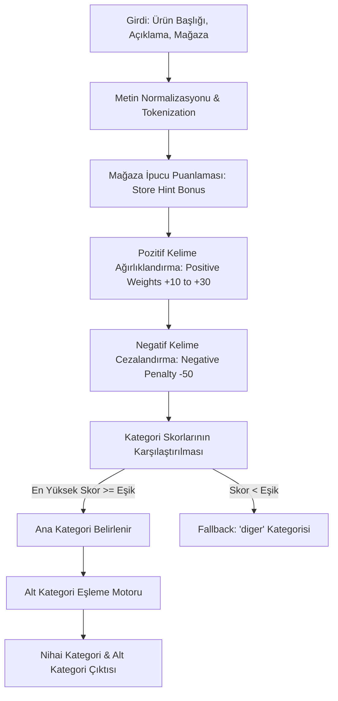

# 🏷️ FırsatKolik — Kategori Tespit Motoru ve Anahtar Kelime Rehberi

Bu doküman, FırsatKolik platformunda hem mobil istemcide (`lib/services/category_detection_service.dart`) hem de sunucu tarafındaki Telegram botunda (`cloud-run-bot/category_detection_service.js`) çalışan **Otonom Kategori ve Alt Kategori Tespit Motoru**'nun çalışma prensiplerini, ağırlıklandırma algoritmalarını ve anahtar kelime sözlüğünü açıklamaktadır.

---

## 🏗️ 1. Genel Mimari ve Sınıflandırma Mantığı

Kategori tespit motoru, ham ürün başlığını, açıklamasını ve mağaza bilgisini analiz ederek fırsatı en doğru ana kategori ve alt kategoriye yerleştiren **kural tabanlı bir Doğal Dil İşleme (NLP) sınıflandırıcısıdır**.



---

## 📊 2. Ana Kategori ve Alt Kategori Taksonomisi

Platformda tanımlı 8 ana kategori ve bunların alt kategorileri:

| Ana Kategori ID | Başlık | Örnek Alt Kategoriler |
| :--- | :--- | :--- |
| **`elektronik`** | Elektronik | Telefon & Aksesuar, Bilgisayar & Tablet, TV & Ses Sistemleri, Beyaz Eşya, Elektrikli Ev Aletleri, Giyilebilir Teknoloji, Foto & Kamera |
| **`moda`** | Giyim & Moda | Erkek Giyim, Kadın Giyim, Ayakkabı, Çanta, Saat & Takı, İç Giyim, Spor Giyim |
| **`ev_yasam`** | Ev & Yaşam | Mobilya, Ev Tekstili, Mutfak Gereçleri, Aydınlatma, Banyo, Dekorasyon, Yapı Market & Bahçe |
| **`supermarket`** | Süpermarket & Gıda | Temel Gıda, Atıştırmalık, İçecek, Deterjan & Temizlik, Kağıt Ürünleri, Bebek Bezi & Bakım |
| **`kozmetik`** | Kozmetik & Kişisel Bakım | Parfüm & Deodorant, Cilt Bakımı, Makyaj, Saç Bakımı, Ağız & Diş Bakımı, Tıraş Ürünleri |
| **`anne_bebek`** | Anne & Bebek & Oyuncak | Bebek Arabası & Oto Koltuğu, Bebek Beslenme, Bebek Giyim, Oyuncak & Eğlence |
| **`spor_outdoor`** | Spor & Outdoor | Fitness & Kondisyon, Kamp & Doğa, Bisiklet & Scooter, Spor Malzemeleri |
| **`diger`** | Diğer Fırsatlar | Kitap & Kırtasiye, Hobi & Oyun, Otomotiv Aksesuar, Petshop, Diğer |

---

## ⚙️ 3. Ağırlıklandırma ve Karar Algoritması

### 3.1 Puanlama Katsayıları (Scoring Rules):
1. **Başlık Eşleşmesi (Title Match):** Başlıkta geçen kelimeler `3x` çarpanla ağırlıklandırılır (En yüksek önem).
2. **Açıklama Eşleşmesi (Description Match):** Açıklamada geçen kelimeler `1x` çarpanla hesaplanır.
3. **Mağaza İpucu Bonusu (Store Affinity Bonus):** Mağazanın ana faaliyet alanı biliniyorsa ilgili kategoriye `+15` taban puan eklenir:
   - `Mavi`, `DeFacto`, `Zara`, `Mango` ➔ `moda` (+20 puan)
   - `Itopya`, `Incehesap`, `Vatan Bilgisayar` ➔ `elektronik` (+20 puan)
   - `Gratis`, `Watsons`, `Rossmann` ➔ `kozmetik` (+20 puan)
   - `Getir`, `Migros`, `CarrefourSA`, `A101`, `BİM`, `ŞOK` ➔ `supermarket` (+15 puan)

### 3.2 Negatif Kelime Filtreleri (Context Disambiguation):
Kelimelerin bağlam dışı yanlış kategorilendirilmesini önlemek için güçlü negatif cezalar (`-50` puan) uygulanır:
* **Örnek 1:** *"Oyun Kolu"* (Gamepad) ifadesindeki "kol" kelimesi modaya değil, elektroniğe aittir. Moda kategorisine negatif ceza verilir.
* **Örnek 2:** *"Ayakkabı Dolabı / Rafı"* ifadesinde "ayakkabı" geçse de ürün mobilyadır (`ev_yasam`). Moda kategorisinden puan kırılır.
* **Örnek 3:** *"Bebek Arabası"* ifadesinde "araba" geçse de ürün `anne_bebek` kategorisindedir; otomotiv elenir.

---

## 🔍 4. Örnek Sınıflandırma Çıktıları

```json
// Girdi: "Apple iPhone 15 Pro Max 256GB Naturel Titanyum"
{
  "category": "elektronik",
  "subCategory": "Telefon & Aksesuar",
  "confidence": 0.98
}

// Girdi: "Fairy Platinum Plus Bulaşık Makinesi Tableti 75 Yıkama"
{
  "category": "supermarket",
  "subCategory": "Deterjan & Temizlik",
  "confidence": 0.95
}

// Girdi: "Mavi Erkek Regular Fit Jean Pantolon Siyah"
{
  "category": "moda",
  "subCategory": "Erkek Giyim",
  "confidence": 0.96
}
```

---
*FırsatKolik Kategori Tespit Motoru ve Anahtar Kelime Rehberi — 2026*
