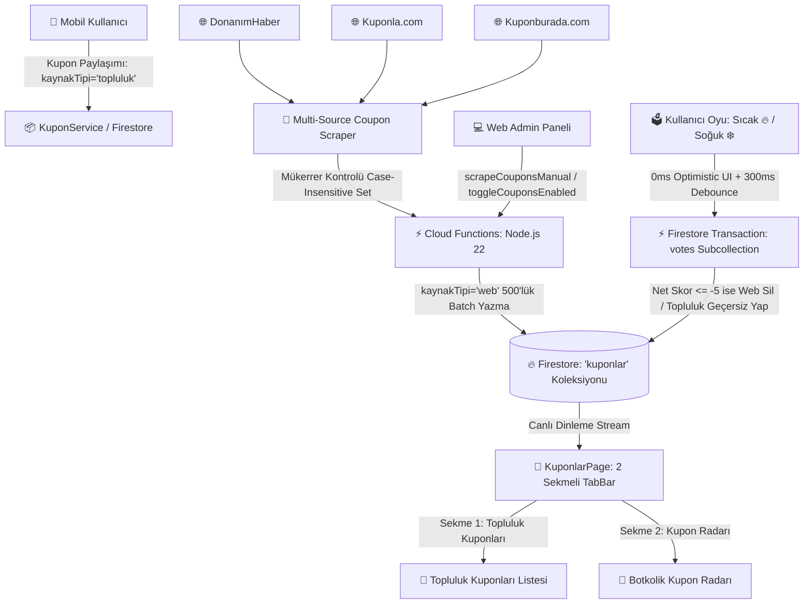
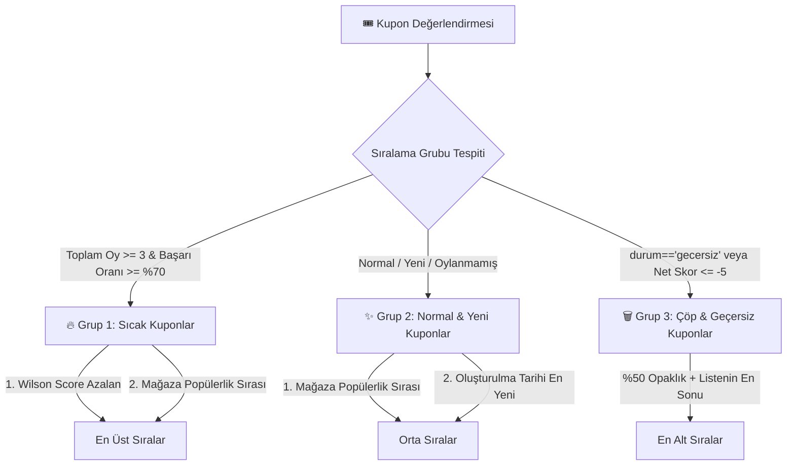
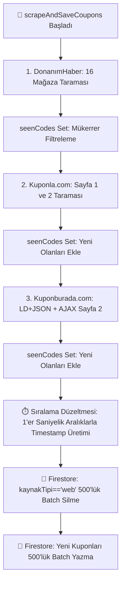

# 🎟️ Kuponlar ve İndirim Kodları Modülü — Kapsamlı Mimari, Veri ve Sistem Kontratı Rehberi

> [!IMPORTANT]
> **Base Doküman & Kupon Kontratı:** Bu doküman, FırsatKolik platformunda e-ticaret indirim kodlarının (kuponların) çok kaynaklı otonom kazıyıcılarla toplanması, topluluk tarafından paylaşılması, Firestore üzerinde saklanması, Wilson Score destekli 3 kademeli akıllı sıralama ve oylama motoruyla doğrulanması, mobil istemcide 2 sekmeli arayüzle sunulması ve Web Admin paneli üzerinden yönetilmesine dair tüm uçtan uca mimariyi yöneten **ana orkestratör (Base Contract)** dokümandır. Her bir alt mimarinin ayrıntılı teknik referansları ilgili bölümlerde doğrudan bağlantılanmıştır.

Bu doküman; **FırsatKolik** platformunda e-ticaret indirim kodlarının (kuponların) çok kaynaklı otonom kazıyıcılarla toplanması, topluluk tarafından paylaşılması, Firestore üzerinde saklanması, Wilson Score destekli 3 kademeli akıllı sıralama ve oylama motoruyla doğrulanması, mobil istemcide 2 sekmeli arayüzle sunulması ve Web Admin paneli üzerinden yönetilmesine dair tüm uçtan uca mimariyi, veri modellerini, güvenlik kurallarını ve teknik operasyonel iş kurallarını tanımlayan **resmi mimari sözleşmedir (Documentation Contract)**.

---

## 📑 İçindekiler
1. [🌟 Modüle Genel Bakış ve Mimari Tasarım İlkeleri](#1--modüle-genel-bakış-ve-mimari-tasarım-ilkeleri)
2. [📱 Mobil İstemci ve Kullanıcı Deneyimi (UI/UX)](#2--mobil-istemci-ve-kullanıcı-deneyimi-uiux)
3. [🔥 Wilson Score ve 3 Kademeli Akıllı Sıralama Algoritması](#3--wilson-score-ve-3-kademeli-akıllı-sıralama-algoritması)
4. [🗳️ Oylama Motoru, İdempotent Transaction ve Otomatik Arşiv](#4-️-oylama-motoru-idempotent-transaction-ve-otomatik-arşiv)
5. [🎛️ Dinamik Modül Şalteri ve Misafir Kilit Mimarisi](#5-️-dinamik-modül-şalteri-ve-misafir-kilit-mimarisi)
6. [🔥 Firestore Veri Modeli ve Şema Kontratı](#6--firestore-veri-modeli-ve-şema-kontratı)
7. [🛡️ Güvenlik Kuralları ve İzin Matrisi (Security Rules)](#7-️-güvenlik-kuralları-ve-izin-matrisi-security-rules)
8. [⚡ Firebase Cloud Functions ve Backend Mimarisi](#8-️-firebase-cloud-functions-ve-backend-mimarisi)
9. [🤖 Multi-Source Kupon Kazıma Hattı (Scraping Pipeline)](#9--multi-source-kupon-kazıma-hattı-scraping-pipeline)
10. [💻 Web Admin Paneli Entegrasyonu](#10--web-admin-paneli-entegrasyonu)
11. [🧪 Test, Doğrulama ve Operasyonel İzleme](#11--test-doğrulama-ve-operasyonel-izleme)
12. [📂 İlgili Kaynak Kod Dosyaları ve Referanslar](#12--ilgili-kaynak-kod-dosyaları-ve-referanslar)

---

## 1. 🌟 Modüle Genel Bakış ve Mimari Tasarım İlkeleri

Kuponlar modülü, kullanıcıların popüler e-ticaret platformlarındaki (Trendyol, Hepsiburada, Amazon, N11 vb.) güncel indirim kodlarına anında erişmesini, çalışmayan kodların topluluk oylarıyla elenmesini ve kullanıcıların kendi buldukları kuponları toplulukla paylaşmasını sağlar.



### Temel Mimari Prensipler:
* **İki Sekmeli İzolasyon:** Kullanıcıların paylaştığı "Topluluk Kuponları" ile botların web'den topladığı "Kupon Radarı" tamamen izole sekmelerde sunulur.
* **Topluluk Koruması (Fail-Safe):** Kazıma işlemi web kuponlarını yenilerken `kaynakTipi == 'topluluk'` olan kullanıcı paylaşımlarına asla dokunmaz.
* **Akıllı Sıralama (Wilson Score & Time Decay):** Oylanan kuponlar güvenilirlik puanına göre en üste taşınır; çalışmayan kuponlar otomatik olarak listenin sonuna atılır veya silinir.
* **İdempotent Oylama (Vote Idempotency):** Alt koleksiyon (`kuponlar/{id}/votes/{uid}`) ve Firestore Transaction mekanizması sayesinde mükerrer oy kullanımı engellenir.
* **Dinamik Uzaktan Şalter (Remote Feature Switch):** `settings/app` dokümanı üzerinden tek tıkla mobil uygulamadaki kuponlar sekmesi kapatılıp açılabilir.

---

## 2. 📱 Mobil İstemci ve Kullanıcı Deneyimi (UI/UX)

> 🔗 **Detaylı Referans Dokümanları:**
> - [Kupon Modülü Ürün Yol Haritası](file:///d:/firsatkolik/documentation/kuponlar/kupon-feature.md) — Orijinal kupon gereksinimleri ve kart mimarisi.
> - [İki Sekmeli Kupon ve Oylama Yol Haritası](file:///d:/firsatkolik/documentation/kuponlar/kupon-new-feature.md) — Topluluk vs Botkolik Radarı sekmeleri ve canlı Sıcak/Soğuk oylama UX kuralları.

Kuponlar arayüzü [KuponlarPage](file:///d:/firsatkolik/lib/screens/kuponlar_page.dart) ve [KuponFormPage](file:///d:/firsatkolik/lib/screens/kupon_form_page.dart) ekranları üzerinden sunulur.

### 2.1. Giriş Noktası ve Navigasyon
* **Konum:** [HomeScreen](file:///d:/firsatkolik/lib/screens/home_screen.dart) üst çubuğunda (App Bar) Aktüel butonunun yanında yer alan `Kuponlar` navigasyon çipi (`Icons.confirmation_number_outlined`).
* **Şalter Dinleyicisi:** `_firestoreService.couponsEnabledStream()` akışını dinler; admin paneli üzerinden kapatılmışsa buton arayüzde tamamen gizlenir.
* **Spotlight Onboarding:** Uygulama içi spotlight rehberinde (`InAppTutorialService.kuponlarChipKey`) `#FF7A00` vurgusuyla tanıtılır.

### 2.2. İki Sekmeli Tab Yapısı (`TabController`)
1. **👥 Topluluk Kuponları Sekmesi:** Yalnızca `kaynakTipi == 'topluluk'` olan kuponları listeler.
   - Paylaşan kullanıcının adı `@kullaniciAdi` formatında gösterilir.
   - Sayfanın sağ altındaki Floating Action Button (`+ Kupon Paylaş`) üzerinden yeni kupon eklenir.
2. **🤖 Kupon Radarı Sekmesi:** `kaynakTipi == 'web'` olan, sistemin internetten otomatik taradığı kuponları listeler.
   - Üst kısımda kapatılabilir **Botkolik Radar Bilgilendirme Kartı** (`_buildRadarInfoBanner`) yer alır.

### 2.3. Kupon Kartı Bileşeni Mimarisi (`_buildCouponCard`)
Her kupon kartı 3 ana bölümden oluşur:
1. **Üst Bölüm (Görsel ve Başlık):**
   - **Mağaza Logosu:** [StoreAssetHelper](file:///d:/firsatkolik/lib/utils/store_asset_helper.dart) ile çözümlenen optimize marka logosu.
   - **Mağaza Rozeti:** Marka adını taşıyan açık renkli çip.
   - **Başlık ve Dinamik Açıklama:** Uzun açıklamalar için 250ms animasyonlu "Devamını Göster / Daha Az Göster" (`_expandedKuponIds`) açılır kapanır metin alanı.
   - **Kupon Kodu Kutusu:** Tıklandığında kodu panoya kopyalar (`Clipboard.setData`), 2 saniye yeşil `Kopyalandı! ✅` geri bildirimi verir.
   - **Mağazaya Git Butonu:** `_openStore()` fonksiyonu ile kullanıcının telefonunda doğrudan ilgili e-ticaret sitesini veya uygulamasını açar.
2. **Alt Bölüm (Oylama, Güven Rozeti ve Kişiselleştirme):**
   - **Sıcak (🔥) / Soğuk (❄️) Butonları:** Canlı sayaçlı, renk geçişli tıklanabilir oylama bileşenleri.
   - **Güvenilirlik Rozeti (`_buildTrustBadge`):** Toplam oy >= 3 olduğunda başarı oranını renkli olarak gösterir:
     - Yeşil (`>= %70`): `%X Çalışıyor` (`Icons.check_circle_rounded`)
     - Sarı (`%50 - %69`): `%X Kısmi` (`Icons.help_rounded`)
     - Kırmızı (`< %50`): `%X Geçersiz` (`Icons.cancel_rounded`)
   - **Kupon Gizleme Butonu (`_hideCoupon`):** Kullanıcının ilgilenmediği kuponları akıştan gizler (320ms küçülme animasyonu, 2.5s "GERİ AL" toast uyarısı).
   - **Düzenle / Sil (Yönetici & Sahip):** Kuponu paylaşan kullanıcı veya yöneticiler için kart üzerinde düzenleme (`KuponFormPage`) ve onaylı silme butonları.

### 2.4. Çentikli Form Tasarımı ([KuponFormPage](file:///d:/firsatkolik/lib/screens/kupon_form_page.dart))
Resmi FırsatKolik tasarım sistemine uygun çentikli kutu (Notched / Fieldset Box) mimarisiyle 3 bölümden oluşur:
1. *Mağaza ve Kupon Bilgileri:* 20 popüler mağaza seçici dropdown, başlık metin kutusu.
2. *Kupon Kodu ve Geçerlilik:* Büyük harfe zorlanan kupon kodu kutusu, isteğe bağlı `DatePicker` son kullanma tarihi seçicisi.
3. *Kupon Koşulları & Notlar:* Alt limit ve sepet şartlarını içeren çok satırlı metin alanı.
4. *Sticky Alt Gönderim Çubuğu:* Yükleme animasyonlu ve çift tıklama korumalı onay butonu.

---

## 3. 🔥 Wilson Score ve 3 Kademeli Akıllı Sıralama Algoritması

Kuponların listelenmesinde basit oy farkı yerine istatistiksel güvenirlik sağlayan **Wilson Güven Skoru (Wilson Score Interval)** ve 3 kademeli grup sıralaması ([Kupon.compareKuponlar](file:///d:/firsatkolik/lib/models/kupon.dart)) kullanılır:



### 3.1. Wilson Score Formülü:
Toplam $n = \text{sicakOy} + \text{sogukOy}$ ve başarı oranı $p = \frac{\text{sicakOy}}{n}$ olmak üzere, %95 güven aralığı ($z = 1.96$) için:

$$\text{Wilson Score} = \frac{p + \frac{z^2}{2n} - z \sqrt{\frac{p(1-p)}{n} + \frac{z^2}{4n^2}}}{1 + \frac{z^2}{n}}$$

Bu formül, 1 oy alıp %100 görünen kuponların, 50 oy alıp %90 başarı sağlayan güvenilir kuponların önüne geçmesini matematiksel olarak engeller.

### 3.2. Mağaza Popülerlik Sıralaması (`getStoreRank`):
1. Trendyol (1) ➔ 2. Hepsiburada (2) ➔ 3. Amazon (3) ➔ 4. N11 (4) ➔ 5. Pazarama (5) ➔ 6. Teknosa (6) ➔ 7. MediaMarkt (7) ...

---

## 4. 🗳️ Oylama Motoru, İdempotent Transaction ve Otomatik Arşiv

Kupon oylama sistemi ([KuponService.setKuponVote](file:///d:/firsatkolik/lib/services/kupon_service.dart)), ağ gecikmelerine ve kötü niyetli manipülasyonlara karşı çift katmanlı korunur:

### 4.1. 0ms Optimistic UI + 300ms Debounce Senkronizasyonu
1. Kullanıcı 🔥 veya ❄️ butonuna bastığında arayüz **0 milisaniye gecikmeyle** anında güncellenir (`_localHotCounts`, `_localColdCounts`, `_userVotes`).
2. Kullanıcı art arda tıklasa dahi `_couponVoteDebounceTimers` 300ms bekleyerek yalnızca son kararı Firestore'a gönderir.
3. Kullanıcı aynı butona tekrar basarsa oyu geri alınır (Toggle Off).

### 4.2. Firestore Transaction ve Atomik Oy Kaydı
Veritabanında her kullanıcının oyu `kuponlar/{kuponId}/votes/{userId}` yolunda saklanır. Transaction akışı:
1. Kupon dokümanı ve kullanıcının önceki oy dokümanı okunur.
2. Önceki oy varsa sayacı 1 azaltılır; yeni oy eklenir veya oy tamamen silinir.
3. **Otomatik Arşivleme ve Temizlik:**
   - Eğer $\text{sogukOy} - \text{sicakOy} \ge 5$ (Net Skor $\le -5$) ise:
     - **Web Kuponu (`kaynakTipi == 'web'`):** Kupon veritabanından **tamamen silinir** (`transaction.delete(kuponRef)`).
     - **Topluluk Kuponu (`kaynakTipi == 'topluluk'`):** Kuponun durumu `durum = 'gecersiz'` yapılır. Arayüzde %50 opaklığa düşürülerek listenin en sonuna atılır.
   - Eğer topluluk kuponu sonradan gelen sıcak oylarla toparlanırsa ($\text{sogukOy} - \text{sicakOy} < 5$), durumu tekrar `aktif` yapılır.

---

## 5. 🎛️ Dinamik Modül Şalteri ve Misafir Kilit Mimarisi

### 5.1. Dinamik Modül Şalteri (`couponsEnabled`)
* **Ayar Yolu:** Firestore `settings/app` dokümanı içerisindeki `couponsEnabled` boolean alanı.
* **Yönetim:** Web Admin paneli Ayarlar sekmesindeki `settingsToggleCouponsBtn` ile canlı kontrol edilir.
* **Mobil İstemci:** `_firestoreService.couponsEnabledStream()` akışını dinler. Değer `false` olduğunda anasayfa App Bar'daki kupon ikonu otomatik olarak gizlenir.

### 5.2. Misafir Kullanıcı Kilit Mimarisi (Guest Lock)
Giriş yapmamış (anonim) kullanıcılar için dönüşüm ve güvenlik önlemleri:
* **Bulanık Kupon Kodu:** Giriş yapmamış kullanıcılara kupon kodları `ImageFilter.blur(sigmaX: 3.5, sigmaY: 3.5)` ile bulanıklaştırılmış olarak ve kilit ikonuyla (`Icons.lock_rounded`) gösterilir.
* **Giriş Sayfası Yönlendirmesi:** Koda basıldığında [GuestLoginBottomSheet](file:///d:/firsatkolik/lib/widgets/guest_login_bottom_sheet.dart) açılır. Giriş tamamlandığı anda kod otomatik olarak kopyalanır.
* **Oylama Kilidi:** Misafir kullanıcılar oy butonlarına bastığında yine giriş formu ile karşılanır; giriş sonrası oy anında işlenir.

---

## 6. 🔥 Firestore Veri Modeli ve Şema Kontratı

Kupon kayıtları Firestore'da kök düzeydeki `kuponlar` koleksiyonunda saklanır.

### 6.1. Koleksiyon Yapısı: `/kuponlar/{kuponId}`

```json
{
  "magazaAdi": "Trendyol",
  "baslik": "Tüm Sepette 150 TL İndirim Kodu",
  "aciklama": "500 TL ve üzeri alışverişlerde geçerlidir.",
  "kuponKodu": "TREND150",
  "paylasanKullaniciId": "user_uid_123",
  "paylasanKullaniciAdi": "ahmet_avci",
  "kaynakTipi": "topluluk",
  "kaynakSite": "donanimhaber",
  "sicakOySayisi": 12,
  "sogukOySayisi": 1,
  "durum": "aktif",
  "olusturulmaTarihi": "2026-08-27T04:00:00.000Z",
  "bitisTarihi": "2026-09-15T23:59:59.999Z"
}
```

### 6.2. Alt Koleksiyon Yapısı: `/kuponlar/{kuponId}/votes/{userId}`
```json
{
  "type": "hot" // "hot" veya "cold"
}
```

### 6.3. Alan Tanımları ve Tipleri:

| Alan Adı | Tip | Zorunlu | Açıklama ve İş Kuralları |
| :--- | :--- | :--- | :--- |
| `magazaAdi` | `String` | Evet | 20 desteklenen mağazadan biri (Örn: `Trendyol`, `Amazon`, `Hepsiburada`). |
| `baslik` | `String` | Evet | Kuponun ana vaat başlığı (Örn: "100 TL İndirim"). |
| `aciklama` | `String` | Hayır | Kuponun kullanım koşulları ve alt limit şartları. |
| `kuponKodu` | `String` | Evet | Kullanıcının panoya kopyalayacağı büyük harfli indirim kodu. |
| `paylasanKullaniciId` | `String` | Evet | Paylaşan kullanıcının UID'si veya bot paylaşımları için `'admin'`. |
| `paylasanKullaniciAdi` | `String` | Hayır | Topluluk kuponlarında paylaşan yazarın kullanıcı adı (denormalize). |
| `kaynakTipi` | `String` | Evet | `'topluluk'` (kullanıcı eklemesi) veya `'web'` (otonom kazıyıcı). |
| `kaynakSite` | `String` | Hayır | Web kazımalarında kaynak: `'donanimhaber'`, `'kuponla'`, `'kuponburada'`. |
| `sicakOySayisi` | `Number` | Evet | "Çalıştı / Sıcak" oyu veren kullanıcı sayısı (varsayılan: 0). |
| `sogukOySayisi` | `Number` | Evet | "Çalışmadı / Soğuk" oyu veren kullanıcı sayısı (varsayılan: 0). |
| `durum` | `String` | Evet | `'aktif'` veya `'gecersiz'` (Net skor <= -5 olduğunda geçersizleşir). |
| `olusturulmaTarihi` | `Timestamp` | Evet | Kuponun sisteme eklenme zamanı. |
| `bitisTarihi` | `Timestamp` | Hayır | Kuponun son geçerlilik tarihi (varsa). |

---

## 7. 🛡️ Güvenlik Kuralları ve İzin Matrisi (Security Rules)

Kupon verileri [firestore.rules](file:///d:/firsatkolik/firestore.rules) içerisinde aşağıdaki kurallarla korunur:

```javascript
// ========================================
// KUPONLAR COLLECTION
// ========================================
match /kuponlar/{kuponId} {
  // Herkes kuponları okuyabilir
  allow read: if true;
  
  // Giriş yapmış ve engellenmemiş kullanıcılar topluluk kuponu ekleyebilir
  allow create: if canWrite();
  
  // Sahibi veya admin tüm alanları güncelleyebilir/silebilir.
  // Giriş yapmış herhangi bir kullanıcı sadece oy sayaçlarını ve durumu güncelleyebilir.
  allow update: if isAuthenticated() && (
    resource.data.paylasanKullaniciId == userId() ||
    isAdmin() ||
    request.resource.data.diff(resource.data).affectedKeys()
      .hasOnly(['sicakOySayisi', 'sogukOySayisi', 'durum'])
  );
  
  allow delete: if isAuthenticated() && (resource.data.paylasanKullaniciId == userId() || isAdmin());

  // Votes subcollection - kullanıcının kendi oy kaydı
  match /votes/{voteUserId} {
    allow read: if isAuthenticated();
    allow write: if canWrite() && userId() == voteUserId;
  }
}
```

---

## 8. ⚡ Firebase Cloud Functions ve Backend Mimarisi

Kupon kazıma ve senkronizasyon motoru iki Cloud Function ile yönetilir ([functions/index.js](file:///d:/firsatkolik/functions/index.js) & [functions/coupon_scraper.js](file:///d:/firsatkolik/functions/coupon_scraper.js)):

### 8.1. Zamanlanmış Otomatik Görev (`scrapeCouponsScheduled`)
* **Tetikleyici:** Cloud Pub/Sub Cron.
* **Çalışma Zamanı:** Her gün gece **04:00** (Europe/Istanbul: `0 4 * * *`).
* **Kaynak Yapılandırması:** `timeoutSeconds: 540` (9 dakika), `memory: '1GB'`.
* **İşleyiş:** 3 farklı web kaynağından kuponları çeker, mükerrerleri eler, eski web kuponlarını siler ve yenilerini yazar.

### 8.2. Manuel Yönetici Tetikleyicisi (`scrapeCouponsManual`)
* **Tetikleyici:** HTTPS Callable (`functions.https.onCall`).
* **Yetkilendirme:** `isAdmin === true` doğrulaması zorunludur.
* **Kaynak Yapılandırması:** `timeoutSeconds: 540`, `memory: '1GB'`.
* **Kullanım:** Web Admin panelinde "Kupon Scrape Et" butonuna basıldığında tetiklenir.

---

## 9. 🤖 Multi-Source Kupon Kazıma Hattı (Scraping Pipeline)

> 🔗 **Detaylı Referans Dokümanı:**
> - [Multi-Source Kupon Scraper Dokümantasyonu](file:///d:/firsatkolik/documentation/kuponlar/multi-source-kupon-scraper.md) — 3 kaynaklı kazıma topolojisi, DH, Kuponla, Kuponburada mimarisi ve deduplication kuralları.

Kupon kazıma motoru ([coupon_scraper.js](file:///d:/firsatkolik/functions/coupon_scraper.js)), 3 farklı kaynaktan hiyerarşik öncelikle beslenir:



### 9.1. Kaynak Detayları ve Ayrıştırma Yöntemleri:
1. **DonanımHaber (`indirimkodu.donanimhaber.com` - 1. Öncelik):**
   - 16 mağazanın sayfalarını tarar, "Geçmiş Kuponlar" başlığı altındaki eski kodları eler.
   - Her kuponun detay sayfasına (`data-single`) giderek `input#coupon_copy` alanından tam kupon kodu, `meta[property="og:title"]` ve `meta[property="og:description"]` alanlarından başlık ve açıklama çekilir (100ms throttle).
2. **Kuponla.com (2. Öncelik):**
   - `son-eklenen-kuponlar` sayfa 1 ve sayfa 2'deki `a.coupon-code[data-code]` butonlarını ve mağaza adlarını parse eder.
3. **Kuponburada.com (3. Öncelik):**
   - **Sayfa 1:** HTML içindeki `<script type="application/ld+json">` yapısındaki Schema.org `@type: "Offer"` nesnelerinden doğrudan JSON formatında kupon kodlarını ayıklar.
   - **Sayfa 2:** `X-Requested-With: XMLHttpRequest` başlığıyla AJAX uç noktasına istek atarak dönen JSON içindeki HTML kartlarını ayrıştırır.

### 9.2. Mükerrer Engelleme (Deduplication) ve Sıralama Koruma:
* Tüm kodlar büyük harfe çevrilerek `seenCodes` kümesinde kontrol edilir; bir kod birden fazla sitede varsa yalnızca en yüksek öncelikli kaynaktan alınır.
* **Sıralama Koruma Algoritması:** Sitelerde en üstte yer alan kuponların mobil uygulamada da en üstte çıkması için kupon dizisindeki elemanlara `Date.now() - (i * 1000)` formülüyle 1'er saniye azalan Timestamp atanır.

---

## 10. 💻 Web Admin Paneli Entegrasyonu

Web Admin panelinde [couponsView](file:///d:/firsatkolik/web/admin/app.js) üzerinden kuponlar yönetilir:

* **Canlı Tablo Dinleyicisi (`loadCoupons`):** `db.collection('kuponlar').orderBy('olusturulmaTarihi', 'desc').onSnapshot` ile tüm kuponları listeler.
* **Anlık Arama Filtresi:** Mağaza, başlık veya kupon koduna göre istemci tarafında canlı arama.
* **Kupon Ekleme / Düzenleme Modalı (`openAddCouponModal`, `editCoupon`):** Yöneticinin panelden doğrudan yeni kupon eklemesini veya mevcut kuponları güncellemesini sağlar.
* **Tekil Silme ve Toplu Temizleme (`deleteAllCoupons`):** 500'lük batch parçalarıyla tüm kuponları veritabanından kalıcı olarak silme.
* **Manuel Scrape Tetikleme (`scrapeCouponsBtn`):** `scrapeCouponsManual` fonksiyonunu çalıştırarak web kuponlarını anında yeniler.
* **Modül Açma/Kapatma Şalteri (`toggleCouponsEnabled`):** `settings/app` üzerinden mobil kupon sekmesini kapatıp açar.

---

## 11. 🧪 Test, Doğrulama ve Operasyonel İzleme

Modülün çalışabilirliği [functions/tests/](file:///d:/firsatkolik/functions/tests/) altındaki test betikleriyle doğrulanır:

| Test Dosyası | Test Edilen Senaryo |
| :--- | :--- |
| [test_kuponlar.js](file:///d:/firsatkolik/functions/tests/test_kuponlar.js) | Kupon ekleme, okuma, güncelleme ve silme Firestore entegrasyon testi. |
| [test_coupon_scraper_flow.js](file:///d:/firsatkolik/functions/tests/test_coupon_scraper_flow.js) | 3 kaynaklı kupon kazıma motorunun uçtan uca çalışması ve Firestore'a yazımı. |
| [test_kuponburada_new.js](file:///d:/firsatkolik/functions/test_kuponburada_new.js) | Kuponburada LD+JSON ve AJAX sayfa 2 ayrıştırma testi. |

---

## 12. 📂 İlgili Kaynak Kod Dosyaları ve Referanslar

| Rol / Katman | Dosya Yolu | Açıklama |
| :--- | :--- | :--- |
| **Mobil UI: Kuponlar Sayfası** | [kuponlar_page.dart](file:///d:/firsatkolik/lib/screens/kuponlar_page.dart) | 2 sekmeli kupon listesi, oylama butonları, gizleme ve arama. |
| **Mobil UI: Kupon Formu** | [kupon_form_page.dart](file:///d:/firsatkolik/lib/screens/kupon_form_page.dart) | Çentikli kupon paylaşım ve düzenleme formu. |
| **Mobil Model** | [kupon.dart](file:///d:/firsatkolik/lib/models/kupon.dart) | Kupon veri sınıfı, Wilson Score ve 3 kademeli sıralama algoritması. |
| **Mobil Servis** | [kupon_service.dart](file:///d:/firsatkolik/lib/services/kupon_service.dart) | Kupon CRUD işlemleri, transaction ile idempotent oylama ve otomatik arşiv. |
| **Mağaza Yardımcısı** | [store_asset_helper.dart](file:///d:/firsatkolik/lib/utils/store_asset_helper.dart) | 20+ e-ticaret mağazası logo ve renk eşleme motoru. |
| **Giriş Noktası & Şalter** | [home_screen.dart](file:///d:/firsatkolik/lib/screens/home_screen.dart) | Anasayfa Kuponlar butonu ve `couponsEnabledStream` kontrolü. |
| **Backend Kazıyıcı** | [coupon_scraper.js](file:///d:/firsatkolik/functions/coupon_scraper.js) | DH, Kuponla, Kuponburada kazıma motoru ve mükerrer filtreleme. |
| **Cloud Functions** | [index.js](file:///d:/firsatkolik/functions/index.js) | `scrapeCouponsScheduled` (04:00) ve `scrapeCouponsManual` callable trigger'ları. |
| **Veritabanı Güvenliği** | [firestore.rules](file:///d:/firsatkolik/firestore.rules) | `kuponlar` koleksiyonu ve `votes` alt koleksiyonu güvenlik kuralları. |
| **Web Yönetim Paneli** | [app.js](file:///d:/firsatkolik/web/admin/app.js) & [index.html](file:///d:/firsatkolik/web/admin/index.html) | `couponsView` kupon yönetimi, arama, ekleme, düzenleme ve şalter. |
