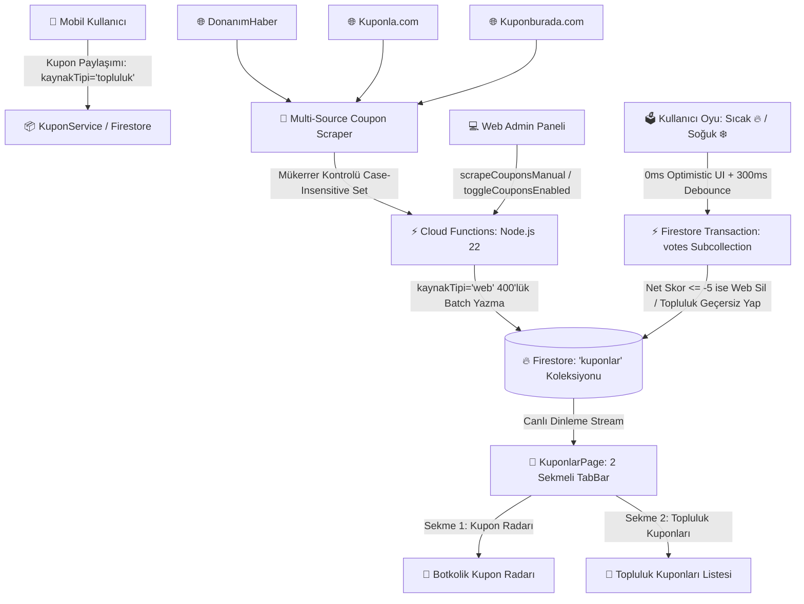
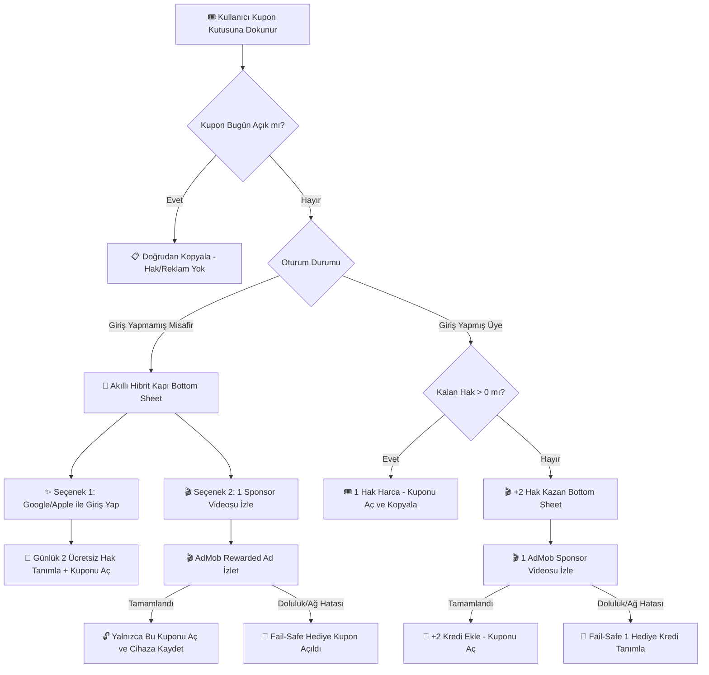
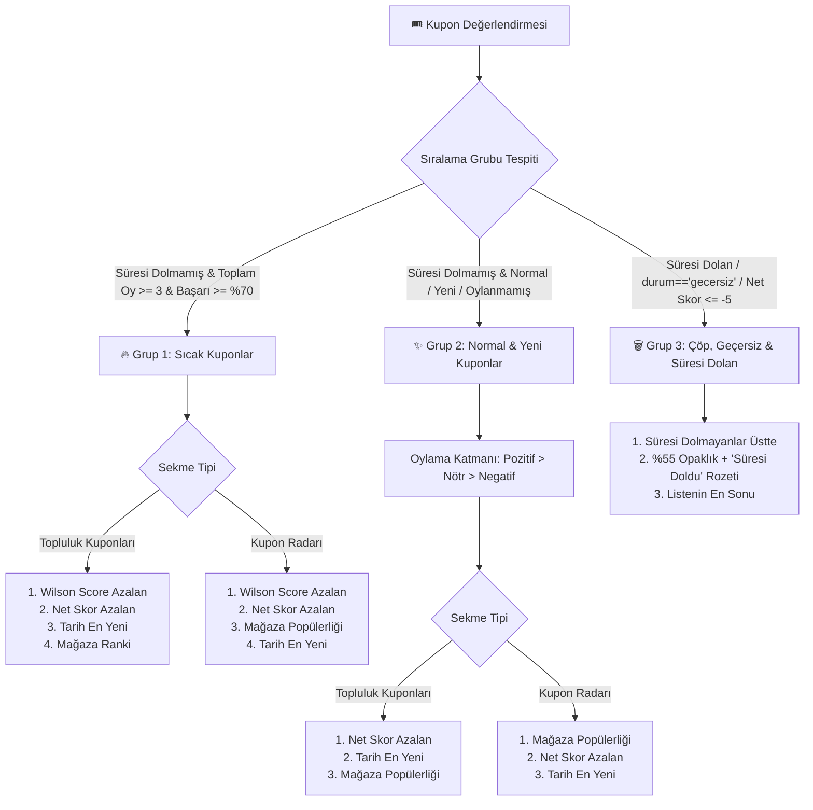
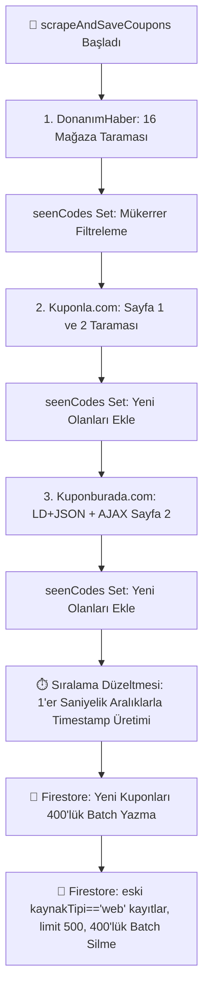

# 🎟️ Kuponlar ve İndirim Kodları Modülü — Kapsamlı Mimari, Veri ve Sistem Kontratı Rehberi

> [!IMPORTANT]
> **Base Doküman & Kupon Kontratı:** Bu doküman, FırsatKolik platformunda e-ticaret indirim kodlarının (kuponların) çok kaynaklı otonom kazıyıcılarla toplanması, topluluk tarafından paylaşılması, Firestore üzerinde saklanması, Wilson Score destekli 3 kademeli akıllı sıralama ve oylama motoruyla doğrulanması, mobil istemcide 2 sekmeli arayüzle sunulması ve Web Admin paneli üzerinden yönetilmesine dair tüm uçtan uca mimariyi yöneten **ana orkestratör (Base Contract)** dokümandır. Her bir alt mimarinin ayrıntılı teknik referansları ilgili bölümlerde doğrudan bağlantılanmıştır.

Bu doküman; **FırsatKolik** platformunda e-ticaret indirim kodlarının (kuponların) çok kaynaklı otonom kazıyıcılarla toplanması, topluluk tarafından paylaşılması, Firestore üzerinde saklanması, Wilson Score destekli 3 kademeli akıllı sıralama ve oylama motoruyla doğrulanması, mobil istemcide 2 sekmeli arayüzle sunulması ve Web Admin paneli üzerinden yönetilmesine dair tüm uçtan uca mimariyi, veri modellerini, güvenlik kurallarını ve teknik operasyonel iş kurallarını tanımlayan **resmi mimari sözleşmedir (Documentation Contract)**.

---

## 📑 İçindekiler
1. [🌟 Modüle Genel Bakış ve Mimari Tasarım İlkeleri](#1--modüle-genel-bakış-ve-mimari-tasarım-ilkeleri)
2. [📱 Mobil İstemci ve Kullanıcı Deneyimi (UI/UX)](#2--mobil-istemci-ve-kullanıcı-deneyimi-uiux)
3. [🔥 Wilson Score ve 3 Kademeli Akıllı Sıralama Algoritması](#3--wilson-score-ve-3-kademeli-akıllı-sıralama-algoritması)
4. [🗳️ Oylama Motoru, İdempotent Transaction ve Otomatik Arşiv](#4-️-oylama-motoru-idempotent-transaction-ve-otomatik-arşiv)
5. [🎛️ Dinamik Modül Şalteri, Misafir Kilidi ve Rewarded Kupon Kredisi](#5-️-dinamik-modül-şalteri-ve-misafir-kilit-mimarisi)
6. [🔥 Firestore Veri Modeli ve Şema Kontratı](#6--firestore-veri-modeli-ve-şema-kontratı)
7. [🛡️ Güvenlik Kuralları ve İzin Matrisi (Security Rules)](#7-️-güvenlik-kuralları-ve-izin-matrisi-security-rules)
8. [⚡ Firebase Cloud Functions ve Backend Mimarisi](#8-️-firebase-cloud-functions-ve-backend-mimarisi)
9. [🤖 Multi-Source Kupon Kazıma Hattı (Scraping Pipeline)](#9--multi-source-kupon-kazıma-hattı-scraping-pipeline)
10. [💻 Web Admin Paneli Entegrasyonu](#10--web-admin-paneli-entegrasyonu)
11. [🧪 Test, Doğrulama ve Operasyonel İzleme](#11--test-doğrulama-ve-operasyonel-izleme)
12. [📂 İlgili Kaynak Kod Dosyaları ve Referanslar](#12--ilgili-kaynak-kod-dosyaları-ve-referanslar)

---

## 1. 🌟 Modüle Genel Bakış ve Mimari Tasarım İlkeleri

Kuponlar modülü, kullanıcıların popüler e-ticaret platformlarındaki (Trendyol, Hepsiburada, Amazon, N11 vb.) güncel indirim kodlarına anında erişmesini, çalışmayan kodların topluluk oylarıyla elenmesini ve kullanıcıların kendi buldukları kuponları toplulukla paylaşmasını sağlar.


```mermaid
graph TD
    %% 1. Veri Kaynakları
    User[📱 Mobil Kullanıcı] -->|Kupon Paylaşımı: kaynakTipi='topluluk'| KuponService[📦 KuponService / Firestore]
    DH[🌐 DonanımHaber] --> Scraper[🤖 Multi-Source Coupon Scraper]
    Kuponla[🌐 Kuponla.com] --> Scraper
    Kuponburada[🌐 Kuponburada.com] --> Scraper
    
    %% 2. Backend İşleme
    Scraper -->|Mükerrer Kontrolü Case-Insensitive Set| CloudFunctions[⚡ Cloud Functions: Node.js 22]
    CloudFunctions -->|kaynakTipi='web' 400'lük Batch Yazma| Firestore[(🔥 Firestore: 'kuponlar' Koleksiyonu)]
    AdminWeb[💻 Web Admin Paneli] -->|scrapeCouponsManual / toggleCouponsEnabled| CloudFunctions
    
    %% 3. Mobil İstemci ve Oylama
    Firestore -->|Canlı Dinleme Stream| KuponlarPage[📱 KuponlarPage: 2 Sekmeli TabBar]
    KuponlarPage -->|Sekme 1: Kupon Radarı| Tab1[🤖 Botkolik Kupon Radarı]
    KuponlarPage -->|Sekme 2: Topluluk Kuponları| Tab2[👥 Topluluk Kuponları Listesi]
    UserVote[🗳️ Kullanıcı Oyu: Sıcak 🔥 / Soğuk ❄️] -->|0ms Optimistic UI + 300ms Debounce| VoteTx[⚡ Firestore Transaction: votes Subcollection]
    VoteTx -->|Net Skor <= -5 ise Web Sil / Topluluk Geçersiz Yap| Firestore
```

### Temel Mimari Prensipler:
* **İki Sekmeli İzolasyon:** Botların web'den topladığı "Kupon Radarı" ile kullanıcıların paylaştığı "Topluluk Kuponları" tamamen izole sekmelerde sunulur.
* **Topluluk Koruması (Fail-Safe):** Kazıma işlemi web kuponlarını yenilerken `kaynakTipi == 'topluluk'` olan kullanıcı paylaşımlarına asla dokunmaz.
* **Akıllı Sıralama (Wilson Score & Time Decay):** Oylanan kuponlar güvenilirlik puanına göre en üste taşınır; çalışmayan kuponlar otomatik olarak listenin sonuna atılır (web kuponlarının oyla silinmesi kurallar tarafından engellenir, bkz. §4.2).
* **İdempotent Oylama (Vote Idempotency):** Alt koleksiyon (`kuponlar/{id}/votes/{uid}`) ve Firestore Transaction mekanizması sayesinde mükerrer oy kullanımı engellenir.
* **Dinamik Uzaktan Şalter (Remote Feature Switch):** `settings/app` dokümanı üzerinden tek tıkla mobil uygulamadaki kuponlar sekmesi kapatılıp açılabilir.

---

## 2. 📱 Mobil İstemci ve Kullanıcı Deneyimi (UI/UX)

> 🔗 İlk ürün tasarımı notları (eski `kupon-feature.md`, `kupon-new-feature.md`) `_arsiv/kuponlar/` altına taşındı.

Kuponlar arayüzü [KuponlarPage](file:///d:/firsatkolik/lib/screens/kuponlar_page.dart) ve [KuponFormPage](file:///d:/firsatkolik/lib/screens/kupon_form_page.dart) ekranları üzerinden sunulur.

### 2.1. Giriş Noktası ve Navigasyon
* **Konum:** [HomeScreen](file:///d:/firsatkolik/lib/screens/home_screen.dart) üst çubuğunda (App Bar) Aktüel butonunun yanında yer alan `Kuponlar` navigasyon çipi (`Icons.confirmation_number_outlined`).
* **Şalter Dinleyicisi:** `_firestoreService.couponsEnabledStream()` akışını dinler; admin paneli üzerinden kapatılmışsa buton arayüzde tamamen gizlenir.
* **Spotlight Onboarding:** Uygulama içi spotlight rehberinde (`InAppTutorialService.kuponlarChipKey`) `#FF7A00` vurgusuyla tanıtılır.

### 2.2. İki Sekmeli Tab Yapısı (`TabController`)
1. **🤖 Kupon Radarı Sekmesi:** `kaynakTipi == 'web'` olan, sistemin internetten otomatik taradığı kuponları listeler.
   - Üst kısımda kapatılabilir **Botkolik Radar Bilgilendirme Kartı** (`_buildRadarInfoBanner`) yer alır.
2. **👥 Topluluk Kuponları Sekmesi:** Yalnızca `kaynakTipi == 'topluluk'` olan kuponları listeler.
   - Paylaşan kullanıcının adı `@kullaniciAdi` formatında gösterilir.
   - Sayfanın sağ altındaki Floating Action Button (`+ Kupon Paylaş`) üzerinden yeni kupon eklenir.

### 2.3. Kupon Kartı Bileşeni Mimarisi (`_buildCouponCard`)
Her kupon kartı 3 ana bölümden oluşur:
1. **Üst Bölüm (Görsel ve Başlık):**
   - **Mağaza Logosu:** [StoreAssetHelper](file:///d:/firsatkolik/lib/utils/store_asset_helper.dart) ile çözümlenen optimize marka logosu.
   - **Mağaza Rozeti:** Marka adını taşıyan açık renkli çip.
   - **Başlık ve Dinamik Açıklama:** Uzun açıklamalar için 250ms animasyonlu "Devamını Göster / Daha Az Göster" (`_expandedKuponIds`) açılır kapanır metin alanı.
   - **Kupon Kodu Kutusu (4 Durumlu Akıllı Kilit Mimarisi):**
     - *Durum 1 (Açılmış Kupon):* Kupon kodu düz metin ve kopyalama butonuyla görünür (`kupon.kuponKodu`). Tıklandığında kodu panoya kopyalar (`Clipboard.setData`), 2 saniye yeşil `Kopyalandı! ✅` geri bildirimi verir.
     - *Durum 2 (Misafir Kullanıcı):* Kod `ImageFilter.blur` ile bulanıklaştırılır ve yanında kilit ikonu (`Icons.lock_rounded`) gösterilir. Tıklandığında *Akıllı Hibrit Kapı* bottom sheet'i açılır.
     - *Durum 3 (Hak Sahibi Giriş Yapmış Üye):* Kod bulanıklaştırılır ve yanında turuncu `🎟️ Aç` çipi gösterilir. Tıklandığında 1 hak kullanılarak kod açılır ve panoya kopyalanır.
     - *Durum 4 (Hakkı Biten Üye):* Kod bulanıklaştırılır ve yanında `🎬 +2 Hak` çipi gösterilir. Tıklandığında 1 AdMob Rewarded Video izleyerek +2 hak kazandıran modal açılır.
   - **Mağazaya Git Butonu:** Belirli bir mağazası olan kuponlar için `_openStore()` fonksiyonu ile kullanıcının telefonunda doğrudan ilgili e-ticaret sitesini veya uygulamasını açar. "Diğer" veya genel/belirtilmemiş mağazalı kuponlarda anlamsız Google arama yönlendirmesini önlemek amacıyla bu buton profesyonelce gizlenir (`_canOpenStore`).
2. **Alt Bölüm (Oylama, Güven Rozeti ve Kişiselleştirme):**
   - **Sıcak (🔥) / Soğuk (❄️) Butonları:** Canlı sayaçlı, renk geçişli tıklanabilir oylama bileşenleri.
   - **Güvenilirlik Rozeti (`_buildTrustBadge`):** Toplam oy >= 3 olduğunda başarı oranını renkli olarak gösterir:
     - Yeşil (`>= %70`): `%X Çalışıyor` (`Icons.check_circle_rounded`)
     - Sarı (`%50 - %69`): `%X Kısmi` (`Icons.help_rounded`)
     - Kırmızı (`< %50`): `%X Geçersiz` (`Icons.cancel_rounded`)
   - **Kupon Gizleme Butonu (`_hideCoupon`):** Kullanıcının ilgilenmediği kuponları akıştan gizler (320ms küçülme animasyonu, 2.5s "GERİ AL" toast uyarısı).
   - **Düzenle / Sil (Yönetici & Sahip):** Kuponu paylaşan kullanıcı veya yöneticiler için kart üzerinde düzenleme (`KuponFormPage`) ve onaylı silme butonları.

### 2.5. 🎟️ Kupon Monetizasyon Mimarisi ve Akıllı Hibrit Kapı (Rewarded Ads & Oylama Bütünlüğü)

Kupon modülü, kullanıcı deneyimini bozmadan yüksek eCPM ve opt-in katılım sağlayan **Akıllı Hibrit Kapı (Öneri A)** ve **+2 Rewarded Video** mimarisiyle monetizasyona kavuşturulmuştur:


```mermaid
graph TD
    UserTap[🎟️ Kullanıcı Kupon Kutusuna Dokunur] --> LockCheck{Kupon Bugün Açık mı?}
    LockCheck -->|Evet| DirectCopy[📋 Doğrudan Kopyala - Hak/Reklam Yok]
    LockCheck -->|Hayır| AuthCheck{Oturum Durumu}
    
    AuthCheck -->|Giriş Yapmamış Misafir| HybridSheet[🚪 Akıllı Hibrit Kapı Bottom Sheet]
    HybridSheet --> OptionA[✨ Seçenek 1: Google/Apple ile Giriş Yap]
    HybridSheet --> OptionB[🎬 Seçenek 2: 1 Sponsor Videosu İzle]
    
    OptionA --> GrantDaily[🎁 Günlük 2 Ücretsiz Hak Tanımla + Kuponu Aç]
    OptionB --> RewardedGuest[🎬 AdMob Rewarded Ad İzlet]
    RewardedGuest -->|Tamamlandı| GuestUnlock[🔓 Yalnızca Bu Kuponu Aç ve Cihaza Kaydet]
    RewardedGuest -->|Doluluk/Ağ Hatası| FailSafeGuest[🎁 Fail-Safe Hediye Kupon Açıldı]
    
    AuthCheck -->|Giriş Yapmış Üye| CreditCheck{Kalan Hak > 0 mı?}
    CreditCheck -->|Evet| UseCredit[🎟️ 1 Hak Harca - Kuponu Aç ve Kopyala]
    CreditCheck -->|Hayır| AdSheet[🎬 +2 Hak Kazan Bottom Sheet]
    AdSheet --> WatchAd[🎬 1 AdMob Sponsor Videosu İzle]
    WatchAd -->|Tamamlandı| Grant2Credits[🎉 +2 Kredi Ekle - Kuponu Aç]
    WatchAd -->|Doluluk/Ağ Hatası| FailSafeCredit[🎁 Fail-Safe 1 Hediye Kredi Tanımla]
```

#### Temel Monetizasyon İlkeleri:
1. **Günlük Ücretsiz Kupon Hakkı (Varsayılan 2):** Her giriş yapan kullanıcı her gün (00:00 rollover) kuponları ücretsiz ve reklamsız açabilir. Bu değer Web Admin paneli "AdMob Monetizasyon" menüsünden (`dailyFreeCredits`) anlık olarak dinamik değiştirilebilir.
2. **Akıllı Hibrit Kapı (Öneri A):** Misafir kullanıcılar kilitli kupona tıkladığında iki net seçenek sunulur:
   - *Önerilen Seçenek:* Giriş yap, ücretsiz kupon haklarını hemen kullan ve sonraki günlerde de ücretsiz haklardan faydalan.
   - *Alternatif Seçenek:* Kayıt olmak istemiyorsan 1 sponsor videosu izle, sadece bu kuponu anında aç.
3. **Mükerrerlik Koruması:** Bir kupon açıldığında (giriş yapan üye veya video izleyen misafir) o gün boyunca açık kalır (`isUnlockedToday == true`). Kullanıcı kodu tekrar kopyaladığında ek hak harcanmaz veya reklam izletilmez.
4. **Anti-Exploit ve Oylama Bütünlüğü Garantisi:** Kullanıcıların sırf yeni hak kazanmak için çalışan kuponlara sahte "❄️ Çalışmıyor" oyu vermesini ve Wilson puanını sabote etmesini engellemek için oylama karşılığı hak iadesi yapılmaz. Hak kazanımı daima şeffaf bir şekilde Rewarded Video (+2) üzerinden yürütülür.
5. **Fail-Safe Ad Fallback:** AdMob reklam ağı doluluk (no-fill) veya ağ hatası verirse kullanıcı kilitli bırakılmaz; kupon "🎁 Hediye Kupon Açıldı" mesajıyla anında açılır.
6. **AppBar Göstergeleri:** Giriş yapanlar için `🎟️ X Hak` / `🎟️ +X Hak Al`, misafirler içinse `🎁 X Hediye Hak` rozeti yer alır (Değerler Web Admin `dailyFreeCredits` ve `rewardCreditsPerVideo` parametrelerinden anlık beslenir).
7. **Otonom Hak Koruması (Otomatik Kopyalama & Tüketim Yasağı):** Kullanıcı oturum açtığında veya Rewarded Video izleyerek hak kazandığında, haklar anında tüketilmez ve kod otomatik panoya kopyalanmaz. Kullanıcı kazandığı net hakları AppBar'da eksiksiz görür ve dilediği kuponda `🎟️ Aç` butonuna basarak bilinçli olarak hakkını harcar.
8. **Botkolik Radar Geçici Çerçeve Işıma Efekti (`_NewlyUnlockedCardGlowWrapper`):** Yeni açılan bir kupon (video izleyen misafir veya hakkını kullanan üye), 3.5 saniye boyunca dönen degrade çerçeve (Turuncu -> Amber -> Mavi) ve dış ışıma efektiyle diğer kuponlardan ayrışır. Tasarım dili sade tutularak kart üzerine ekstra etiket konulmamış, yalnızca bu şık parlayan çerçeve efekti korunmuştur.
9. **Web Admin Canlı Senkronizasyon:** Web Admin "AdMob & Gelir" sekmesinden değiştirilen `dailyFreeCredits` ve `rewardCreditsPerVideo` parametreleri, `CouponCreditService` tarafından Firestore `settings/admob` üzerinden dinlenir ve mobil uygulama açıkken bile anında güncellenir.

### 2.4. Çentikli Form Tasarımı ([KuponFormPage](file:///d:/firsatkolik/lib/screens/kupon_form_page.dart))
Resmi FırsatKolik tasarım sistemine uygun çentikli kutu (Notched / Fieldset Box) mimarisiyle 3 bölümden oluşur:
1. *Mağaza ve Kupon Bilgileri:* popüler mağaza seçici dropdown (`_populerMagazalar`, `kupon_form_page.dart:32`), başlık metin kutusu.
2. *Kupon Kodu ve Geçerlilik:* Büyük/küçük harf duyarlılığı (case-sensitivity) korunan kupon kodu kutusu (`TextCapitalization.none`), isteğe bağlı `DatePicker` son kullanma tarihi seçicisi. Kodlar büyük harfe zorlanmaz, e-ticaret sitelerindeki orijinal yazım biçimi korunur.
3. *Kupon Koşulları & Notlar:* Alt limit ve sepet şartlarını içeren çok satırlı metin alanı.
4. *Sticky Alt Gönderim Çubuğu:* Yükleme animasyonlu ve çift tıklama korumalı onay butonu.

---

## 3. 🔥 Wilson Score ve Dünya Standartlarında (PROD-READY) Akıllı Sıralama Mimarisi

Kuponların listelenmesinde basit oy farkı yerine istatistiksel güvenirlik sağlayan **Wilson Güven Skoru (Wilson Score Interval)** ve sekme bazlı (Topluluk vs Kupon Radarı) 3 kademeli grup sıralaması ([Kupon.compareKuponlar](file:///d:/firsatkolik/lib/models/kupon.dart)) kullanılır:


```mermaid
graph TD
    Kupon[🎟️ Kupon Değerlendirmesi] --> GroupCheck{Sıralama Grubu Tespiti}
    
    GroupCheck -->|Süresi Dolmamış & Toplam Oy >= 3 & Başarı >= %70| G1[🔥 Grup 1: Sıcak Kuponlar]
    GroupCheck -->|Süresi Dolmamış & Normal / Yeni / Oylanmamış| G2[✨ Grup 2: Normal & Yeni Kuponlar]
    GroupCheck -->|Süresi Dolan / durum=='gecersiz' / Net Skor <= -5| G3[🗑️ Grup 3: Çöp, Geçersiz & Süresi Dolan]
    
    G1 --> Mode1{Sekme Tipi}
    Mode1 -->|Topluluk Kuponları| S1_Comm[1. Wilson Score Azalan<br/>2. Net Skor Azalan<br/>3. Tarih En Yeni<br/>4. Mağaza Ranki]
    Mode1 -->|Kupon Radarı| S1_Radar[1. Wilson Score Azalan<br/>2. Net Skor Azalan<br/>3. Mağaza Popülerliği<br/>4. Tarih En Yeni]
    
    G2 --> G2_Tier[Oylama Katmanı: Pozitif > Nötr > Negatif]
    G2_Tier --> Mode2{Sekme Tipi}
    Mode2 -->|Topluluk Kuponları| S2_Comm[1. Net Skor Azalan<br/>2. Tarih En Yeni<br/>3. Mağaza Popülerliği]
    Mode2 -->|Kupon Radarı| S2_Radar[1. Mağaza Popülerliği<br/>2. Net Skor Azalan<br/>3. Tarih En Yeni]
    
    G3 --> S3[1. Süresi Dolmayanlar Üstte<br/>2. %55 Opaklık + 'Süresi Doldu' Rozeti<br/>3. Listenin En Sonu]
```

### 3.1. Wilson Score Formülü:
Toplam $n = \text{sicakOy} + \text{sogukOy}$ ve başarı oranı $p = \frac{\text{sicakOy}}{n}$ olmak üzere, %95 güven aralığı ($z = 1.96$) için:

$$\text{Wilson Score} = \frac{p + \frac{z^2}{2n} - z \sqrt{\frac{p(1-p)}{n} + \frac{z^2}{4n^2}}}{1 + \frac{z^2}{n}}$$

Bu formül, 1 oy alıp %100 görünen kuponların, 50 oy alıp %90 başarı sağlayan güvenilir kuponların önüne geçmesini matematiksel olarak engeller.

### 3.2. Topluluk Kuponları vs Kupon Radarı Sıralama Farkı:
* **Topluluk Kuponları (`isCommunity: true`):** Sosyal topluluk akışı olduğu için **tazelik (oluşturulma tarihi)** ve **kullanıcı oyları (net skor)** en üst önceliğe sahiptir. Kullanıcının paylaştığı yeni bir kupon, mağaza popülerlik sırasına takılmadan akışın üstünde yer alır.
* **Kupon Radarı (`isCommunity: false`):** Otomatik taranan e-ticaret kupon dizini olduğu için kullanıcıların mağaza bazlı arama beklentisi gözetilerek **mağaza popülerlik sıralaması (`getStoreRank`)** önceliklendirilir.
* **Grup 2 Oylama Katmanı (Voting Tiers):** Henüz Grup 1 (Sıcak) eşiğine (3 oy & %70 başarı) ulaşmamış kuponlar arasında:
  1. *Pozitif Net Skorlu Kuponlar (`netScore > 0`):* Çalıştığı doğrulanmış kuponlar ilk sırada.
  2. *Nötr Kuponlar (`netScore == 0`):* Yeni paylaşılmış oylanmamış kuponlar ikinci sırada.
  3. *Negatif Net Skorlu Kuponlar (`netScore < 0`):* Soğuk oy almış kuponlar üçüncü sırada.
* **Süresi Dolan Kuponlar (`isExpired`):** Son kullanma tarihi geçmiş olan kuponlar, kaç sıcak oy almış olursa olsun asla Grup 1 veya Grup 2'de listelenmez; doğrudan Grup 3'e düşürülür, %55 opaklığa çekilir ve `Süresi Doldu` rozeti ile işaretlenir.

### 3.3. Mağaza Popülerlik Sıralaması (`getStoreRank`):
1. Trendyol (1) ➔ 2. Hepsiburada (2) ➔ 3. Amazon (3) ➔ 4. N11 (4) ➔ 5. Pazarama (5) ➔ 6. Teknosa (6) ➔ 7. MediaMarkt (7) ...

---

## 4. 🗳️ Oylama Motoru, İdempotent Transaction ve Otomatik Arşiv

Kupon oylama sistemi ([KuponService.setKuponVote](file:///d:/firsatkolik/lib/services/kupon_service.dart)), ağ gecikmelerine ve kötü niyetli manipülasyonlara karşı çift katmanlı korunur:

### 4.1. 0ms Optimistic UI + 300ms Debounce Senkronizasyonu
1. Kullanıcı 🔥 veya ❄️ butonuna bastığında arayüz **0 milisaniye gecikmeyle** anında güncellenir (`_localHotCounts`, `_localColdCounts`, `_userVotes`).
2. Kullanıcı art arda tıklasa dahi `_couponVoteDebounceTimers` 300ms bekleyerek yalnızca son kararı Firestore'a gönderir.
3. Kullanıcı aynı butona tekrar basarsa oyu geri alınır (Toggle Off).

### 4.2. Kilitsiz Atomik Pipeline ve Subcollection İzolasyonu (FS-08)
Veritabanında her kullanıcının oyu `kuponlar/{kuponId}/votes/{userId}` alt dokümanında saklanır. Eşzamanlılık ve viral çekişmeyi (contention) önleyen mimari akış:
1. Kullanıcının mevcut oyu izole alt dokümandan kilit olmadan okunur (`voteRef.get()`).
2. Eski oy ve yeni oya göre `hotDelta` ve `coldDelta` (-1, 0, +1) hesaplanır.
3. Kullanıcı oy dokümanı `WriteBatch` içinde güncellenir (`batch.set`) veya silinir (`batch.delete`).
4. Ana kupon dokümanı (`kuponlar/{kuponId}`) kilitlenen `runTransaction` yerine doğrudan Firestore'un sunucu seviyesinde dahili kuyruklu `FieldValue.increment(delta)` atomik operatörüyle güncellenir.
5. **Kural ve Yetki Uyumu (FS-01 & P0-06):** İstemci tarafı güvenlik kuralları ([`firestore.rules:376-381`](file:///d:/firsatkolik/firestore.rules#L376-L381)) gereğince yalnızca `sicakOySayisi` ve `sogukOySayisi` alanlarını günceller. Web kuponu silme veya durum değiştirme yetkisi istemcide değil, Admin ve Cloud Function tarafındadır.
6. **Otomatik Sıralama ve Arşivleme:** Net skoru $\le -5$ olan veya süresi dolan kuponlar silinmez; `sortingGroup` (Grup 3) algoritmasıyla arayüzde otomatik olarak en alta taşınır ve %50 opaklığa düşürülür.

---

### 4.3. 🛡️ Doğrulanmış Testçi (Proof-of-Access) İlkesi ve Manipülasyon Koruması
> ⚠️ **Yalnızca istemci tarafı:** Aşağıdaki kurallar `CouponCreditService` içinde SharedPreferences ve cihaz saatiyle uygulanır; sunucuda karşılığı yoktur. Kodlar herkese açık okunur (`firestore.rules:317`) ve push payload'larında gider (`functions/index.js:1421,1539,2224`); kilit kozmetiktir ve atlatılabilir → , ödüllü reklam kilidi fail-open. Rewarded reklam için sunucu doğrulaması (SSV) yoktur.

Kupon oylama sisteminin dürüstlüğü ve Wilson Score kalitesini korumak için katı erişim kuralları uygulanır ([CouponCreditService.canVoteOnCoupon](file:///d:/firsatkolik/lib/services/coupon_credit_service.dart)):
1. **Kodu Görmeden Oylama Yapılamaz:** Bir kullanıcı kodunu açmadığı ve mağazada denemediği bir kupon için Sıcak (🔥) veya Soğuk (❄️) oyu veremez. Kilitli kuponda oy butonuna basıldığında `_showUnlockToVoteBottomSheet` açılır; kullanıcıya topluluk doğrulama ilkesi açıklanarak kuponu 1 hak ile (veya video izleyerek) açma seçeneği sunulur.
2. **Kendi Kuponunu Oylama Engeli (Self-Vote Prevention):** Topluluk sekmesinde kuponu paylaşan kullanıcı (`kupon.paylasanKullaniciId == currentUser.uid`), kendi paylaştığı kupona yapay sıcak oy veremez ("Kendi paylaştığın kuponu oylayamazsın 😊" uyarısı alır).
3. **Kupon Sahibine Ücretsiz Görüntüleme:** Kullanıcı kendi paylaştığı kuponun kodunu kilitli/bulanık görmez, kendi kodunu kopyalamak için günlük hakkından harcama yapmaz (`isOwner` kontrolü).
4. **Mevcut Oy Değişimi İstisnası:** Daha önce doğrulanmış şekilde oy kullanmış bir avcı, oyu geri almak (toggle off) veya fikrini değiştirmek istediğinde tekrar kilit engeline takılmaz.
5. **Oylama Bütünlüğü:** Kuponu açıp mağazada deneyen kullanıcı "Çalışmıyor (❄️)" oyu verdiğinde oyu topluluğa dürüstçe yansır; oylama üzerinden kredi avcılığı yapılmaması için hak iadesi verilmez.

---

## 5. 🎛️ Dinamik Modül Şalteri ve Misafir Kilit Mimarisi

### 5.1. Dinamik Modül Şalteri (`couponsEnabled`)
* **Ayar Yolu:** Firestore `settings/app` dokümanı içerisindeki `couponsEnabled` boolean alanı.
* **Yönetim:** Web Admin paneli Ayarlar sekmesindeki `settingsToggleCouponsBtn` ile canlı kontrol edilir.
* **Mobil İstemci:** `_firestoreService.couponsEnabledStream()` akışını dinler. Değer `false` olduğunda anasayfa App Bar'daki kupon ikonu otomatik olarak gizlenir.

### 5.2. Misafir Kullanıcı Kilit Mimarisi (Guest Lock)
Giriş yapmamış (anonim) kullanıcılar için dönüşüm ve güvenlik önlemleri:
* **Bulanık Kupon Kodu:** Giriş yapmamış kullanıcılara kupon kodları `ImageFilter.blur(sigmaX: 3.5, sigmaY: 3.5)` ile bulanıklaştırılmış olarak ve kilit ikonuyla (`Icons.lock_rounded`) gösterilir.
* **Giriş Sayfası Yönlendirmesi:** Koda basıldığında [GuestLoginBottomSheet](file:///d:/firsatkolik/lib/widgets/guest_login_bottom_sheet.dart) açılır. Giriş tamamlandığı anda kod otomatik olarak kopyalanır.
* **Oylama Kilidi:** Misafir kullanıcılar oy butonlarına bastığında yine giriş formu ile karşılanır; giriş sonrası oy anında işlenir.

### 5.3. 🎟️ Kupon Açma Kredisi ve Rewarded Ad Monetizasyon Mimarisi
Giriş yapan kullanıcılar için sürdürülebilir, etik ve yüksek eCPM üreten ödüllü reklam mimarisi ([CouponCreditService](file:///d:/firsatkolik/lib/services/coupon_credit_service.dart)):
* **Günlük 2 Ücretsiz Kupon Açma:** Her giriş yapan kullanıcıya yerel saatle her gün 00:00'da yenilenen 2 adet ücretsiz kupon kopyalama kredisi tanımlanır.
* **Açılan Kupon Koruması (`isUnlockedToday`):** Gün içinde bir kez kilidi açılan bir kupon tekrar görüntülendiğinde veya kopyalandığında kullanıcıdan tekrar hak düşmez.
* **Rewarded Ad ile +2 Kredi Kazanımı:** Günlük 2 hakkını tüketen kullanıcı, kilitli bir kuponu kopyalamak istediğinde `_showCreditDepletedBottomSheet` açılır. Kullanıcı rızasıyla (opt-in) 1 AdMob Rewarded Video reklamı izlediğinde hesabına anında **+2 Kupon Açma Kredisi** tanımlanır.
* **Fail-Safe Fallback (Kullanıcı Dostu Hediye):** Eğer reklam ağı doluluk (fill rate) veya ağ gecikmesi nedeniyle video yükleyemezse kullanıcı cezalandırılmaz/bekletilmez; kupon "Hediye Açıldı" olarak doğrudan panoya kopyalanır ve arayüzde görünür kılınır.
* **Anti-Exploit Oylama Güvenliği:** Çalışan kuponların manipüle edilmemesi ve sonsuz bedava hak döngüsünün önlenmesi için oy verme karşılığı hak iadesi verilmez. Haklar tükendiğinde kullanıcı 1 kısa video ile dilediği zaman +2 hak alabilir.
* **AppBar Canlı Kredi Rozeti:** Kuponlar sayfasının üst çubuğunda kullanıcının kalan hakkı dinamik bir pill badge olarak yer alır (`🎟️ 2 Hak` veya tükendiğinde `🎟️ +2 Hak Al`). Rozete tıklandığında sistemin kuralları şeffaf bir modal ile açıklanır.

---

## 6. 🔥 Firestore Veri Modeli ve Şema Kontratı

Kupon kayıtları Firestore'da kök düzeydeki `kuponlar` koleksiyonunda saklanır.

### 6.1. Koleksiyon Yapısı: `/kuponlar/{kuponId}`

```json
{
  "magazaAdi": "Trendyol",
  "baslik": "Tüm Sepette 150 TL İndirim Kodu",
  "aciklama": "500 TL ve üzeri alışverişlerde geçerlidir.",
  "kuponKodu": "TREND150",
  "paylasanKullaniciId": "user_uid_123",
  "paylasanKullaniciAdi": "ahmet_avci",
  "kaynakTipi": "topluluk",
  "kaynakSite": "donanimhaber",
  "sicakOySayisi": 12,
  "sogukOySayisi": 1,
  "durum": "aktif",
  "olusturulmaTarihi": "2026-08-27T04:00:00.000Z",
  "bitisTarihi": "2026-09-15T23:59:59.999Z"
}
```

### 6.2. Alt Koleksiyon Yapısı: `/kuponlar/{kuponId}/votes/{userId}`
```json
{
  "type": "hot" // "hot" veya "cold"
}
```

### 6.3. Alan Tanımları ve Tipleri:

| Alan Adı | Tip | Zorunlu | Açıklama ve İş Kuralları |
| :--- | :--- | :--- | :--- |
| `magazaAdi` | `String` | Evet | `SUPPORTED_STORES` listesindeki 19 mağazadan biri (kazıyıcı için; kullanıcı formundaki liste ayrıdır) (Örn: `Trendyol`, `Amazon`, `Hepsiburada`). |
| `baslik` | `String` | Evet | Kuponun ana vaat başlığı (Örn: "100 TL İndirim"). |
| `aciklama` | `String` | Hayır | Kuponun kullanım koşulları ve alt limit şartları. |
| `kuponKodu` | `String` | Evet | Kullanıcının panoya kopyalayacağı büyük harfli indirim kodu. |
| `paylasanKullaniciId` | `String` | Evet | Paylaşan kullanıcının UID'si veya bot paylaşımları için `'admin'`. |
| `paylasanKullaniciAdi` | `String` | Hayır | Topluluk kuponlarında paylaşan yazarın kullanıcı adı (denormalize). |
| `kaynakTipi` | `String` | Evet | `'topluluk'` (kullanıcı eklemesi) veya `'web'` (otonom kazıyıcı). |
| `kaynakSite` | `String` | Hayır | Web kazımalarında kaynak: `'donanimhaber'`, `'kuponla'`, `'kuponburada'`. |
| `sicakOySayisi` | `Number` | Evet | "Çalıştı / Sıcak" oyu veren kullanıcı sayısı (varsayılan: 0). |
| `sogukOySayisi` | `Number` | Evet | "Çalışmadı / Soğuk" oyu veren kullanıcı sayısı (varsayılan: 0). |
| `durum` | `String` | Evet | `'aktif'` veya `'gecersiz'` (Net skor <= -5 olduğunda geçersizleşir). |
| `olusturulmaTarihi` | `Timestamp` | Evet | Kuponun sisteme eklenme zamanı. |
| `bitisTarihi` | `Timestamp` | Hayır | Kuponun son geçerlilik tarihi (varsa). |

---

## 7. 🛡️ Güvenlik Kuralları ve İzin Matrisi (Security Rules)

Kupon verileri [firestore.rules](file:///d:/firsatkolik/firestore.rules) içerisinde aşağıdaki kurallarla korunur:

```javascript
// firestore.rules:359-391
match /kuponlar/{kuponId} {
  allow read: if true;                       // kupon kodları dahil herkese açık
  allow create: if canWrite() && 
                !exists(/databases/$(database)/documents/dealBannedUsers/$(request.auth.uid)) && (
      isAdmin() || (
        request.resource.data.paylasanKullaniciId == userId() &&
        (!('durum' in request.resource.data) || request.resource.data.durum == 'beklemede') &&
        (!('sicakOySayisi' in request.resource.data) || request.resource.data.sicakOySayisi == 0) &&
        (!('sogukOySayisi' in request.resource.data) || request.resource.data.sogukOySayisi == 0)
      )
  );
  // P0-06 & FS-01: Durum onayı yalnızca isAdmin()'e aittir; kullanıcı durum değiştiremez
  allow update: if canWrite() && (
      isAdmin() ||
      (resource.data.paylasanKullaniciId == userId() &&
       !request.resource.data.diff(resource.data).affectedKeys().hasAny(['paylasanKullaniciId', 'sicakOySayisi', 'sogukOySayisi', 'durum'])) ||
      (request.resource.data.diff(resource.data).affectedKeys().hasOnly(['sicakOySayisi', 'sogukOySayisi']) &&
       isValidDelta('sicakOySayisi') && isValidDelta('sogukOySayisi') &&
       request.resource.data.sicakOySayisi >= 0 && request.resource.data.sogukOySayisi >= 0)
  );
  allow delete: if isAuthenticated() && (resource.data.paylasanKullaniciId == userId() || isAdmin());
  match /votes/{voteUserId} {
    allow read: if isAuthenticated();
    allow write: if canWrite() && userId() == voteUserId;
  }
}
```

* **FS-01 & FS-08 Çözümü (🟢):** İstemciden kupon silme veya durum değiştirme girişimleri tamamen kaldırılmıştır. `KuponService.setKuponVote` yalnızca `firestore.rules` tarafından izin verilen `sicakOySayisi` ve `sogukOySayisi` alanlarını `FieldValue.increment` ile kilitsiz ve çekişmesiz güncelleyecek şekilde yapılandırılmıştır. -5 net skor altındaki kuponlar silinmek yerine `sortingGroup` algoritmasıyla anında en alta taşınmakta ve arayüzde filtrelenmektedir.

---

## 8. ⚡ Firebase Cloud Functions ve Backend Mimarisi

Kupon kazıma ve senkronizasyon motoru iki Cloud Function ile yönetilir ([functions/index.js](file:///d:/firsatkolik/functions/index.js) & [functions/coupon_scraper.js](file:///d:/firsatkolik/functions/coupon_scraper.js)):

### 8.1. Zamanlanmış Otomatik Görev (`scrapeCouponsScheduled`)
* **Tetikleyici:** Cloud Pub/Sub Cron.
* **Çalışma Zamanı:** Her gün gece **04:00** (Europe/Istanbul: `0 4 * * *`).
* **Kaynak Yapılandırması:** `timeoutSeconds: 540` (9 dakika), `memory: '1GB'`.
* **İşleyiş:** 3 farklı web kaynağından kuponları çeker, mükerrerleri eler, önce yenilerini yazar, sonra eski `web` kuponlarını siler (`limit(500)` ile sınırlı). Çalışma `systemLocks/coupon_scraping` dağıtık kilidi (15 dk lease) altındadır (`index.js:4376`). Her çalışmada yeni rastgele doküman ID'leri üretilir; kısmi kaynak hatasında iyi veri silinebilir.

### 8.2. Manuel Yönetici Tetikleyicisi (`scrapeCouponsManual`)
* **Tetikleyici:** HTTPS Callable (`functions.https.onCall`).
* **Yetkilendirme:** `isAdmin === true` doğrulaması zorunludur.
* **Kaynak Yapılandırması:** `timeoutSeconds: 540`, `memory: '1GB'`.
* **Kullanım:** Web Admin panelinde "Kupon Scrape Et" butonuna basıldığında tetiklenir.

### 8.3. Topluluk Kuponları Moderasyon ve Bildirim Motoru (`onCouponCreated` & `onCouponUpdated` - FS-01 / FS-02 / NOTIF-15 / NOTIF-16)
* **Kupon Oluşturma (`onCouponCreated`):**
  - İstemciden (`KuponFormPage`) paylaşılan topluluk kuponları varsayılan olarak `durum: 'beklemede'` olarak kaydedilir.
  - Kupon başlığı ve mağaza adı küfür/argo filtresinden (`containsProfanity`) geçirilir; uygunsuzluk durumunda `durum: 'gecersiz'` ve `moderationFlag: true` yapılır.
  - **FS-01 Moderasyon Kalkanı:** Kupon durumu `beklemede` iken **asla genel push gönderilmez**. Kupon Admin Moderasyon Kuyruğuna alınır.
  - **👮‍♂️ Admine Anlık Push (NOTIF-16):** Kupon `beklemede` olarak kaydedildiğinde, mobil yöneticilerin abone olduğu `admin_deals` FCM konusuna `type: 'admin_coupon'` (mor rozet `#8E24AA`, `channelId: 'admin_channel'`) anlık push gönderilir. Yöneticinin bildirimine tıklandığında doğrudan mobil [AdminScreen](file:///d:/firsatkolik/lib/screens/admin_screen.dart) Tab 2 (`🎟️ Kupon Onay`) sekmesi açılır.
* **Admin Onay ve Dağıtım Motoru (`onCouponUpdated`):**
  - Kupon Admin (Mobil Admin veya Web Admin) tarafından incelenip onaylandığında (`before.durum === 'beklemede' && after.durum === 'aktif'`) devreye girer:
    1. **FCM Topic Yayını (`topic: 'community_coupons'`):** Türkiye saati 23:00 - 08:00 sessiz saat ve şalter kontrolünden sonra $0 maliyetle tüm topluluk kuponu abonelerine tek API çağrısıyla push fırlatılır. **P0-14 Kalkanı:** Ham kupon kodu push payload'ında asla plaintext iletilmez (`hasCode: true/false`).
    2. **FS-02 Çift Katmanlı Feed (`globalAnnouncements/coupon_{kuponId}`):** Onaylanan kupon tekil küresel duyuru olarak kaydedilir (TTL: kupon bitiş tarihi veya +7 gün). İstemcideki `FirestoreService.getNotificationsStream` dual-layer feed sayesinde **tüm kullanıcıların Bildirim Merkezinde (AdminNotificationsScreen) anında listelenir**.
    3. **Yazara Onay Bildirimi & Puan Ödülü (`submission_status`):** Kupon sahibine `"🎉 Kuponunuz Onaylandı!"` bildirimi yazılır. Sunucu otoritesiyle kullanıcıya **+10 topluluk katkı puanı** ve `couponCount` artışı atanır.
    4. **300 Tavanlı Hedefli Abone Feed'i:** İlgili mağazayı ve yazarı takip eden kullanıcıların kişisel bildirim kutusuna doküman yazılır (`isTopicDelivered: true`, `announcementId: coupon_{kuponId}`). Bellekte `announcementId` üzerinden tekilleştirildiği için mükerrer kart görünmez.
* **Admin Red Geçişi (`onCouponUpdated`, `beklemede -> reddedildi`):**
  - Kupon sahibine `"ℹ️ Kuponunuz Reddedildi"` bildirimi yazılır ve yöneticinin seçtiği red gerekçesi (`moderationReason`) iliştirilir.
  - Kuponun önceden oluşturulmuş küresel duyurusu varsa yayından kaldırılır (`active: false`).
  - Kullanıcı Bildirim Merkezinde reddedilen kupona tıkladığında turuncu rozetli detay modalında gerekçe kutusunu görür; pasif/reddedilmiş kupon için aksiyon butonları gizlenir.
* **Otomatik Çöp Temizliği:** Soğuk oy farkı >= 5 olduğunda topluluk kuponları otomatik `gecersiz` yapılır, web kuponları silinir. Net skor < 5'e toparlanırsa tekrar `aktif` yapılır.
* **Tıklama Davranışı:** Bildirime tıklandığında `KuponlarPage(initialTabIndex: 1, highlightKuponId: kuponId)` ile doğrudan **Topluluk Kuponları** sekmesi açılır. Hedef kart 3.6 saniye boyunca radar ışımasıyla parlar. Kullanıcı zaten kuponlar ekranındaysa (`isCouponsScreenActive == true`) ön plan afişi spam korumasıyla bastırılır.

---

## 9. 🤖 Multi-Source Kupon Kazıma Hattı (Scraping Pipeline)

> 🔗 **Detaylı Referans Dokümanı:**
> - [Multi-Source Kupon Scraper Dokümantasyonu](file:///d:/firsatkolik/documentation/kuponlar/multi-source-kupon-scraper.md) — 3 kaynaklı kazıma topolojisi, DH, Kuponla, Kuponburada mimarisi ve deduplication kuralları.

Kupon kazıma motoru ([coupon_scraper.js](file:///d:/firsatkolik/functions/coupon_scraper.js)), 3 farklı kaynaktan hiyerarşik öncelikle beslenir:


```mermaid
graph TD
    Start[🚀 scrapeAndSaveCoupons Başladı] --> S1[1. DonanımHaber: 16 Mağaza Taraması]
    S1 --> Dedup1[seenCodes Set: Mükerrer Filtreleme]
    
    Dedup1 --> S2[2. Kuponla.com: Sayfa 1 ve 2 Taraması]
    S2 --> Dedup2[seenCodes Set: Yeni Olanları Ekle]
    
    Dedup2 --> S3[3. Kuponburada.com: LD+JSON + AJAX Sayfa 2]
    S3 --> Dedup3[seenCodes Set: Yeni Olanları Ekle]
    
    Dedup3 --> Order[⏱️ Sıralama Düzeltmesi: 1'er Saniyelik Aralıklarla Timestamp Üretimi]
    Order --> WriteNew[📝 Firestore: Yeni Kuponları 400'lük Batch Yazma]
    WriteNew --> DelOld[🧹 Firestore: eski kaynakTipi=='web' kayıtlar, limit 500, 400'lük Batch Silme]
```

### 9.1. Kaynak Detayları ve Ayrıştırma Yöntemleri:
1. **DonanımHaber (`indirimkodu.donanimhaber.com` - 1. Öncelik):**
   - 16 mağazanın sayfalarını tarar, "Geçmiş Kuponlar" başlığı altındaki eski kodları eler.
   - Her kuponun detay sayfasına (`data-single`) giderek `input#coupon_copy` alanından tam kupon kodu, `meta[property="og:title"]` ve `meta[property="og:description"]` alanlarından başlık ve açıklama çekilir (100ms throttle).
2. **Kuponla.com (2. Öncelik):**
   - `son-eklenen-kuponlar` sayfa 1 ve sayfa 2'deki `a.coupon-code[data-code]` butonlarını ve mağaza adlarını parse eder.
3. **Kuponburada.com (3. Öncelik):**
   - **Sayfa 1:** HTML içindeki `<script type="application/ld+json">` yapısındaki Schema.org `@type: "Offer"` nesnelerinden doğrudan JSON formatında kupon kodlarını ayıklar.
   - **Sayfa 2:** `X-Requested-With: XMLHttpRequest` başlığıyla AJAX uç noktasına istek atarak dönen JSON içindeki HTML kartlarını ayrıştırır.

### 9.2. Mükerrer Engelleme (Deduplication) ve Sıralama Koruma:
* Tüm kodlar büyük harfe çevrilerek `seenCodes` kümesinde kontrol edilir; bir kod birden fazla sitede varsa yalnızca en yüksek öncelikli kaynaktan alınır.
* **Sıralama Koruma Algoritması:** Sitelerde en üstte yer alan kuponların mobil uygulamada da en üstte çıkması için kupon dizisindeki elemanlara `Date.now() - (i * 1000)` formülüyle 1'er saniye azalan Timestamp atanır.

---

## 10. 💻 Web Admin Paneli Entegrasyonu

Web Admin panelinde [couponsView](file:///d:/firsatkolik/web/admin/app.js) üzerinden kuponlar yönetilir:

* **Canlı Tablo Dinleyicisi (`loadCoupons`):** `db.collection('kuponlar').orderBy('olusturulmaTarihi', 'desc').onSnapshot` ile tüm kuponları listeler.
* **Anlık Arama Filtresi:** Mağaza, başlık veya kupon koduna göre istemci tarafında canlı arama.
* **Kupon Ekleme / Düzenleme Modalı (`openAddCouponModal`, `editCoupon`):** Yöneticinin panelden doğrudan yeni kupon eklemesini veya mevcut kuponları güncellemesini sağlar.
* **Tekil Silme ve Toplu Temizleme (`deleteAllCoupons`):** 400'lük batch parçalarıyla tüm kuponları veritabanından kalıcı olarak silme.
* **Manuel Scrape Tetikleme (`scrapeCouponsBtn`):** `scrapeCouponsManual` fonksiyonunu çalıştırarak web kuponlarını anında yeniler.
* **Modül Açma/Kapatma Şalteri (`toggleCouponsEnabled`):** `settings/app` üzerinden mobil kupon sekmesini kapatıp açar.

---

## 10.5. 🔔 Topluluk Kuponları Bildirim Entegrasyonu (NOTIF-15 & NOTIF-16)

Topluluk üyeleri tarafından `KuponFormPage` üzerinden paylaşılan kuponlar, platform genelindeki bildirim motoruna tam simetrik olarak entegre edilmiştir.

### Mimari Akış:
```mermaid
graph TD
    UserShare[👤 Kullanıcı Kupon Paylaştı: KuponFormPage] --> FirestoreKupon[📝 kuponlar/{id}: durum='beklemede']
    FirestoreKupon --> OnCreated[⚡ Cloud Functions: onCouponCreated]
    
    OnCreated --> ProfanityCheck{Küfür/Argo Filtresi}
    ProfanityCheck -->|Uygunsuz| Flagged[durum='gecersiz' & moderationFlag=true]
    ProfanityCheck -->|Temiz| AdminPush[👮‍♂️ FCM Topic: admin_deals - type: 'admin_coupon']
    
    AdminPush --> AdminScreen[📱 AdminScreen: Tab 2 - 🎟️ Kupon Onay]
    
    AdminScreen --> AdminDecision{Yönetici Kararı}
    AdminDecision -->|Onayla & Push| Approved[durum='aktif']
    AdminDecision -->|Reddet| Rejected[durum='reddedildi' & redNedeni]
    
    Approved --> OnUpdated[⚡ Cloud Functions: onCouponUpdated]
    Rejected --> OnUpdatedRej[⚡ Cloud Functions: onCouponUpdated]
    
    OnUpdated --> TopicPush[📢 FCM Topic: community_coupons - Ham Kodsuz P0-14]
    OnUpdated --> GlobalDoc[🌐 globalAnnouncements/coupon_{id} - FS-02 Çift Katmanlı Feed]
    OnUpdated --> AuthorReward[🎉 Yazara Onay Bildirimi + 10 Puan & couponCount]
    OnUpdated --> Subscribers[👥 Takipçilere 300 Tavanlı Kişisel Doküman]
    
    OnUpdatedRej --> AuthorRej[ℹ️ Yazara Red Bildirimi + moderationReason]
    
    GlobalDoc --> NotifCenter[📋 Tüm Kullanıcıların Bildirim Merkezi]
    TopicPush --> UserTap[📱 Kilit Ekranı Push Tıklaması]
    UserTap --> KuponPage[🎟️ KuponlarPage: Tab 1 - 3.6s Radar Işıma Efekti]
```

### Bildirim Payload Yapısı:
| Alan | Değer | Açıklama |
| :--- | :--- | :--- |
| `type` | `coupon` / `community_coupon` / `admin_coupon` | Bildirim türü |
| `reason` | `community` | Tetiklenme gerekçesi |
| `kuponId` | Kupon doküman ID'si | Derin linkleme hedefi |
| `magazaAdi` | Mağaza adı | Başlık ve rozet gösterimi |
| `hasCode` | `'true'` / `'false'` | **P0-14 Güvenlik Kalkanı:** Açık kod push payload'ına konmaz |
| `authorName` | Paylaşan kullanıcı adı | Başlık metni |
| `authorId` | Paylaşan kullanıcı ID'si | Yazar referansı |

### Kullanıcı Tercih Kontrolü:
- **`communityNotificationsEnabled: true`** → Topic ve in-app kupon bildirimleri aktif
- **`communityNotificationsEnabled: false`** → İstemci `community_coupons` topic aboneliğinden çıkar; Bildirim Merkezinde dual-layer feed ile sessizce listelenir
- **`pushMasterEnabled: false`** → Tüm push bildirimleri cihaz düzeyinde kapatılır

> 🔗 **Detaylı bildirim senaryoları:** [NOTIF-15 & NOTIF-16 — Bildirim Senaryoları Rehberi](file:///d:/firsatkolik/documentation/bildirimler/notification_scenarios.md)

---

## 11. 🧪 Test, Doğrulama ve Operasyonel İzleme

Modülün çalışabilirliği [functions/tests/](file:///d:/firsatkolik/functions/tests) altındaki test betikleriyle doğrulanır:

| Test Dosyası | Test Edilen Senaryo |
| :--- | :--- |
| [test_kuponlar.js](file:///d:/firsatkolik/functions/tests/test_kuponlar.js) | Kupon ekleme, okuma, güncelleme ve silme Firestore entegrasyon testi. |
| [test_coupon_scraper_flow.js](file:///d:/firsatkolik/functions/tests/test_coupon_scraper_flow.js) | 3 kaynaklı kupon kazıma motorunun uçtan uca çalışması ve Firestore'a yazımı. |
| [test_coupon_notifications.js](file:///d:/firsatkolik/functions/tests/test_coupon_notifications.js) | Topluluk kuponu bildirim sistemi (NOTIF-15): tetikleyici, self-notification koruması, web/geçersiz filtreler, tercih kontrolleri ve payload doğrulaması. |
| [test_kuponburada_new.js](file:///d:/firsatkolik/functions/test_kuponburada_new.js) | Kuponburada LD+JSON ve AJAX sayfa 2 ayrıştırma testi. |

---

## 12. 📂 İlgili Kaynak Kod Dosyaları ve Referanslar

| Rol / Katman | Dosya Yolu | Açıklama |
| :--- | :--- | :--- |
| **Mobil UI: Kuponlar Sayfası** | [kuponlar_page.dart](file:///d:/firsatkolik/lib/screens/kuponlar_page.dart) | 2 sekmeli kupon listesi, oylama butonları, kredi pill rozeti, Rewarded Ad bottom sheet ve kopyalama akışı. |
| **Kupon Kredi Servisi** | [coupon_credit_service.dart](file:///d:/firsatkolik/lib/services/coupon_credit_service.dart) | Günlük 2 hak takibi, Rewarded Ad kredilendirme ve anti-exploit hak motoru. |
| **AdMob Yönetim Servisi** | [ad_manager_service.dart](file:///d:/firsatkolik/lib/services/ad_manager_service.dart) | Rewarded ad ön yükleme, gösterim, onPaidEvent telemetrisi ve otomatik yeniden yükleme. |
| **Mobil UI: Kupon Formu** | [kupon_form_page.dart](file:///d:/firsatkolik/lib/screens/kupon_form_page.dart) | Çentikli kupon paylaşım ve düzenleme formu. |
| **Mobil Model** | [kupon.dart](file:///d:/firsatkolik/lib/models/kupon.dart) | Kupon veri sınıfı, Wilson Score ve 3 kademeli sıralama algoritması. |
| **Mobil Servis** | [kupon_service.dart](file:///d:/firsatkolik/lib/services/kupon_service.dart) | Kupon CRUD işlemleri, transaction ile idempotent oylama ve otomatik arşiv. |
| **Mağaza Yardımcısı** | [store_asset_helper.dart](file:///d:/firsatkolik/lib/utils/store_asset_helper.dart) | 20+ e-ticaret mağazası logo ve renk eşleme motoru. |
| **Giriş Noktası & Şalter** | [home_screen.dart](file:///d:/firsatkolik/lib/screens/home_screen.dart) | Anasayfa Kuponlar butonu ve `couponsEnabledStream` kontrolü. |
| **Backend Kazıyıcı** | [coupon_scraper.js](file:///d:/firsatkolik/functions/coupon_scraper.js) | DH, Kuponla, Kuponburada kazıma motoru ve mükerrer filtreleme. |
| **Cloud Functions** | [index.js](file:///d:/firsatkolik/functions/index.js) | `scrapeCouponsScheduled` (04:00), `scrapeCouponsManual` callable ve `onCouponCreated` bildirim tetikleyicileri. |
| **Bildirim Servisi** | [notification_service.dart](file:///d:/firsatkolik/lib/services/notification_service.dart) | Kupon bildirim yönlendirmesi (`resolveRouting`), selves-screen bastırma ve `InAppMessageBanner` entegrasyonu. |
| **Veritabanı Güvenliği** | [firestore.rules](file:///d:/firsatkolik/firestore.rules) | `kuponlar` koleksiyonu ve `votes` alt koleksiyonu güvenlik kuralları. |
| **Web Yönetim Paneli** | [app.js](file:///d:/firsatkolik/web/admin/app.js) & [index.html](file:///d:/firsatkolik/web/admin/index.html) | `couponsView` kupon yönetimi, arama, ekleme, düzenleme ve şalter. |
