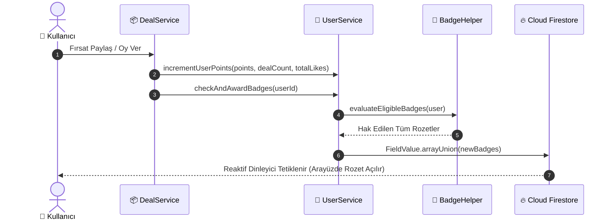

# 🏆 FırsatKolik — Avcı Rozetleri ve Oyunlaştırma (Gamification) Mimari Rehberi

Bu doküman, **FırsatKolik** platformundaki kullanıcı bağlılığını, kaliteli fırsat paylaşımını ve topluluk etkileşimini sürdürülebilir kılmak amacıyla geliştirilen **Avcı Rozetleri ve Oyunlaştırma (Gamification)** mimarisinin tüm teknik detaylarını, veri modellerini, otomatik kazanma algoritmalarını, dinamik rütbe gösterimini ve hile önleme kurallarını belgeler.

---

## 📑 İçindekiler
1. [🌟 Oyunlaştırma Felsefesi ve Hedefler](#1--oyunlaştırma-felsefesi-ve-hedefler)
2. [🏛️ Rozet Taksonomisi ve Nadirlik Kademeleri (Tiers)](#2-️-rozet-taksonomisi-ve-nadirlik-kademeleri-tiers)
3. [📋 Eksiksiz Rozet Kataloğu (16+ Rozet)](#3--eksiksiz-rozet-kataloğu-16-rozet)
4. [⚙️ Veri Modelleri ve Firestore Şeması](#4-️-veri-modelleri-ve-firestore-şeması)
5. [🔄 Otomatik Ödüllendirme Algoritması ve Tetikleyiciler](#5--otomatik-ödüllendirme-algoritması-ve-tetikleyiciler)
6. [📱 Mobil Arayüz (UI/UX) ve Dinamik Rütbe Entegrasyonu](#6--mobil-arayüz-uiux-ve-dinamik-rütbe-entegrasyonu)
7. [🛡️ Hile Önleme ve Suistimal Koruması (Anti-Abuse)](#7-️-hile-önleme-ve-suistimal-koruması-anti-abuse)
8. [💻 Web Admin Paneli Rozet Yönetimi ve İşlemleri](#8--web-admin-paneli-rozet-yönetimi-ve-i̇şlemleri)
9. [🎖️ 10 Kademeli Avcı Rütbeleri ve Güven Seviyeleri (Hunter Ranks)](#9-️-10-kademeli-avcı-rütbeleri-ve-güven-seviyeleri-hunter-ranks)

---

## 1. 🌟 Oyunlaştırma Felsefesi ve Hedefler

FırsatKolik gamification sistemi; kullanıcıları sadece pasif birer tüketici olmaktan çıkarıp, platformun büyümesine katkı sağlayan aktif **"Fırsat Avcıları"** haline getirmeyi amaçlar.

### Temel Prensipler:
* **Şeffaf İlerleme:** Her kilitli rozet, kullanıcının hedefe ne kadar yaklaştığını net olarak gösteren sayısal ilerleme çubuğuna (`18 / 25 Paylaşım - %72`) sahiptir.
* **Katmanlı Prestij:** Başlangıç seviyesindeki bir avcıdan, platform efsanesine uzanan net kademe ayrımı (Bronz ➔ Gümüş ➔ Altın ➔ Elmas ➔ Özel).
* **Sosyal Kanıt (Social Proof):** Kullanıcı adının yanında dinamik parlayan rütbe amblemi (`Muratcan [🛡️]`) ve seçilen vitrin rozetleri (`⭐ Alev Ustası`).

---

## 2. 🏛️ Rozet Taksonomisi ve Nadirlik Kademeleri (Tiers)

Rozetler 5 farklı nadirlik kademesine ayrılmıştır. Her kademenin kendine has amblem rengi, metalik gradient'i ve mikro-ışık efekti mevcuttur:

| Kademe (`BadgeTier`) | Amblem Rengi | Gradient Paleti | Prestij Seviyesi |
| :--- | :--- | :--- | :--- |
| **🥉 Bronz (Bronze)** | `#CD7F32` | `#B45309` ➔ `#D97706` | Başlangıç ve adaptasyon başarımları. |
| **🥈 Gümüş (Silver)** | `#94A3B8` | `#64748B` ➔ `#94A3B8` | Düzenli katkı sağlayan aktif avcılar. |
| **🥇 Altın (Gold)** | `#F59E0B` | `#D97706` ➔ `#FBBF24` | Yüksek topluluk saygınlığı ve usta paylaşımlar. |
| **💎 Elmas (Diamond)** | `#06B6D4` | `#0284C7` ➔ `#38BDF8` | Rekortmenler ve platformun elit liderleri. |
| **⭐ Özel (Special)** | `#8B5CF6` / `#00BCD4` | `#7C3AED` ➔ `#A78BFA` | Doğrulanmış hesaplar, kurucu üyeler ve yöneticiler. |

---

## 3. 📋 Eksiksiz Rozet Kataloğu (16+ Rozet)

```
                        ┌──────────────────────────────┐
                        │   FırsatKolik Avcı Rozeti    │
                        └──────────────┬───────────────┘
                                       │
         ┌──────────────────┬──────────┴───────────┬──────────────────┐
         ▼                  ▼                      ▼                  ▼
  🎯 Fırsat Avcılığı  💬 Topluluk & Yorum     🔥 Sıcaklık & Oylar   ⭐ Sadakat & Özel
```

### A. 🎯 Fırsat Avcılığı (`dealSharing`)
| Rozet ID | Rozet Adı | Kademe | Kazanma Şartı (`Threshold`) | Açıklama |
| :--- | :--- | :--- | :--- | :--- |
| `first_spark` | **İlk Kıvılcım** | Bronz | `dealCount >= 1` | Toplulukla ilk fırsatını paylaşan yeni avcı. |
| `hunter_apprentice`| **Fırsat Çırağı** | Gümüş | `dealCount >= 10` | Fırsat avcılığında deneyim kazanan hevesli üye. |
| `contributor` | **Katkıda Bulunan** | Gümüş | `dealCount >= 20` | Topluluğa düzenli fırsat kazandıran aktif üye. |
| `master_hunter` | **Usta Avcı** | Altın | `dealCount >= 50` | Fırsatları kaçırmayan, platformun usta paylaşımcısı. |
| `legendary_hunter`| **Efsanevi Avcı** | Elmas | `dealCount >= 150` | FırsatKolik tarihine geçen en elit avcılardan biri. |

### B. 🔥 Sıcaklık & Oylar (`temperatureVoting`)
| Rozet ID | Rozet Adı | Kademe | Kazanma Şartı (`Threshold`) | Açıklama |
| :--- | :--- | :--- | :--- | :--- |
| `active_voter` | **Aktif Seçmen** | Bronz | `points >= 50` | Fırsatların sıcaklığını belirleyen topluluk jürisi. |
| `flame_master` | **Alev Ustası** | Altın | `points >= 150` | Fırsatları alevlendiren ve yüksek sıcaklıklar yakalayan üye. |
| `volcanic_record` | **Volkanik Rekortmen** | Elmas | `points >= 500` | Topluluğu kasıp kavuran rekor sıcaklıklara imza atan üye. |

### C. 💬 Topluluk & Yorum (`communityReviews`)
| Rozet ID | Rozet Adı | Kademe | Kazanma Şartı (`Threshold`) | Açıklama |
| :--- | :--- | :--- | :--- | :--- |
| `voice_of_community`| **Söz Sahibi** | Bronz | `points >= 35` | Fikir ve değerlendirmeleriyle topluluğa katılan üye. |
| `helpful` | **Yardımsever Avcı**| Gümüş | `totalLikes >= 40` | Yorumlarında veya paylaşımlarında 40 beğeni toplayan avcı. |
| `top_reviewer` | **Fikir Önderi** | Altın | `totalLikes >= 150` | Yorumları ve ürün analizleriyle fırsatçılara rehberlik eden üye. |

### D. ⭐ Sadakat, Doğrulama & Özel (`loyaltySpecial`)
| Rozet ID | Rozet Adı | Kademe | Kazanma Şartı (`Threshold`) | Açıklama |
| :--- | :--- | :--- | :--- | :--- |
| `bronze` | **Bronz Avcı** | Bronz | `points >= 15` | FırsatKolik yolculuğuna başlayan aktif üye. |
| `silver` | **Gümüş Avcı** | Gümüş | `points >= 100` | Platformda aktifliğiyle öne çıkan değerli üye. |
| `gold` | **Altın Avcı** | Altın | `points >= 300` | Platformun en saygın ve yüksek puanlı üyelerinden biri. |
| `verified` | **Doğrulanmış Avcı** | Özel | Manuel / Moderatör Onayı | Topluluk güvenilirliği moderasyonca onaylanmış hesap. |
| `early_bird` | **Öncü Kurucu Üye** | Özel | Manuel / Erken Kayıt | İlk dönemde aramıza katılan kurucu topluluk üyesi. |
| `premium` | **Premium** | Özel | Özel Etkinlik / Program | Özel avantajlara ve prestijli statüye sahip üye. |

---

## 4. ⚙️ Veri Modelleri ve Firestore Şeması

### Firestore `users/{userId}` Doküman Yapısı:
```json
{
  "uid": "usr_94827104",
  "username": "KuponAvcisi",
  "nickname": "Muratcan Gökyokuş",
  "points": 134,
  "dealCount": 24,
  "totalLikes": 7,
  "badges": [
    "first_spark",
    "hunter_apprentice",
    "bronze",
    "silver",
    "voice_of_community",
    "active_voter",
    "helpful"
  ],
  "pinnedBadge": "hunter_apprentice"
}
```

### `AppUser` Dart Modeli Helper Getters (`lib/models/user.dart`):
```dart
// Kullanıcının puanına göre dinamik rütbe bilgileri
String get trustLevel;   // 'Güvenilir Avcı', 'Uzman Avcı' vb.
IconData get trustIcon;  // Icons.shield_rounded, Icons.stars_rounded vb.
Color get trustColor;    // Color(0xFFD97706) vb.
String get trustEmoji;   // '🛡️', '⭐', '💎' vb.
int get trustStars;      // 0 - 9 arası güven yıldızı
```

---

## 5. 🔄 Otomatik Ödüllendirme Algoritması ve Tetikleyiciler

Rozet kazanımı istemci tarafında veya sunucuda olay bazlı olarak asenkron şekilde tetiklenir:



1. **`BadgeHelper.calculateProgress(user, badge)`:**
   - Rozet eşik tipine (`dealCount`, `points`, `totalLikes`) göre kullanıcının anlık değerini hedefe oranlar (`0.0` - `1.0`).
2. **`BadgeHelper.evaluateEligibleBadges(user)`:**
   - Kullanıcının istatistiklerini tarayarak hak ettiği tüm rozet ID'lerini döner.
3. **`UserService.checkAndAwardBadges(userId)`:**
   - Yeni hak edilen rozetleri filtreler ve Firestore'a `FieldValue.arrayUnion` ile mükerrerlik olmadan atomik kaydeder.

---

## 6. 📱 Mobil Arayüz (UI/UX) ve Dinamik Rütbe Entegrasyonu

### 1. 👑 Kullanıcı İsmi Yanında Dinamik Rütbe Rozeti (`profile_screen.dart`)
* **Görünüm:** `Muratcan Gökyokuş` `[🛡️]` `✏️`
* Kullanıcının puanına göre rütbesi geliştikçe ismin yanındaki dairesel mini amblem (ikon ve renk) otomatik güncellenir.
* Rozete tıklandığında veya basılı tutulduğunda `Tooltip` ile mevcut seviye (`Güvenilir Avcı (134 Puan)`) bilgisi açılır.

### 2. 🛡️ Tıklanabilir Seviye & Vitrin Hap Butonları (Hero Badges)
* **Dinamik Rütbe Çipi:** `[ 🛡️ Güvenilir Avcı • 134 P > ]` — Yüksek kontrastlı, açık ve koyu modda kusursuz okunaklı tasarım. Dokunulduğunda doğrudan **`BadgesScreen`** açılır.
* **Vitrin Rozeti (Pinned Badge):** Kullanıcı bir rozet seçtiğinde rütbe çipinin yanında ikinci bir vitrin hapı (`[ 🏹 Fırsat Çırağı ]`) belirir.

### 3. 📑 Destek Hub'ı (Bottom Sheet) Entegrasyonu
* Kullanıcı **"Hesap, Yardım & Destek"** menüsünü açtığında, en üstte **REHBER & BAŞARIMLAR** grubunda rozet kazanım durumu görüntülenir:
  `🏆 Avcı Başarımları & Rozetler • 7 / 16 Rozet Kazanıldı >`
* Dokunulduğunda doğrudan tam ekran **`BadgesScreen`** açılır.

### 4. 🏛️ Müstakil Avcı Başarımları Ekranı (`badges_screen.dart`)
* **Başarım Özeti Kartı:** Toplam kazanılan rozet sayısı (`7 / 16`), seviye tamamlanma yüzdesi (`%43`) ve canlı ilerleme çubuğu.
* **Kategori Filtre Çipleri:** `Tümü (16)`, `🎯 Fırsatlar`, `🔥 Sıcaklık`, `💬 Topluluk`, `⭐ Sadakat`.
* **Kademeli Rozet Izgarası:** 2 sütunlu kartlarda metalik çerçeveler (`[Bronz]`, `[Gümüş]`, `[Altın]`, `[Elmas]`), açık/kilitli durumu ve kilitli rozetlerde kalan kota çubuğu (`18 / 25 Paylaşım - %72`).
* **İnteraktif Rozet Detay Modalı (`_showBadgeDetailModal`):**
  - 3D parıltılı amblem ve kademe etiketi.
  - Rozetin hikayesi ve "Nasıl Kazanılır?" canlı ilerleme barı.
  - **"Vitrinde Göster / Vitrinden Kaldır" Butonu:** Kullanıcı kazandığı bir rozeti profilinde sabitleyebilir (`pinnedBadge`).

### 5. 💬 Yorumlarda Yazar Rozeti (`comments_bottom_sheet.dart`)
* Yorum sahibinin seçtiği vitrin rozeti (`userPinnedBadge`), yazar adının yanında minyatür şık bir vektör çip olarak görüntülenir.
* Vitrin rozeti seçilmemişse yazar adı sade kalır.

---

## 7. 🛡️ Hile Önleme ve Suistimal Koruması (Anti-Abuse)

1. **Yalnızca Onaylı Fırsatlar:** Silinen veya moderatörce engellenen fırsatlar için `dealCount` negatif dengelenir.
2. **Kendi Fırsatına Oy Verememe:** Kullanıcılar kendi paylaşımlarına sıcak/soğuk oy veremez (puan manipülasyonu engellenir).
3. **Atomik Firestore Güncellemeleri:** Rozet listesi `FieldValue.arrayUnion` ile korunarak mükerrer veya yarış durumu (race condition) kayıtları önlenir.

---

## 8. 💻 Web Admin Paneli Rozet Yönetimi ve İşlemleri

Yöneticiler, web yönetim paneli (`web/admin/`) üzerinden kullanıcıların sahip olduğu tüm rozetleri eksiksiz olarak görüntüleyebilir ve gerçek zamanlı rozet yönetimi gerçekleştirebilir.

### A. 📋 Kullanıcılar Tablosu Entegrasyonu (`renderUsers`)
* **Yeni "Rozetler" Sütunu:** Tablo başlığına eklenen `Rozetler` sütunu, kullanıcının sahip olduğu toplam rozet sayısını (`X Rozet`) ve varsa aktif **Vitrin Rozeti (Pinned Badge)** amblemini kademe rengiyle gösterir.
* **Rozet Bazlı Arama Motoru:** Arama çubuğuna kullanıcının rozet adı (örn: `Usta Avcı`, `Alev Ustası`, `Doğrulanmış`) veya teknik kimliği (`first_spark`, `verified`, `gold`) yazıldığında anında filtreleme yapılır.

### B. 👤 Kullanıcı Detay Modalı (`showUserDetail` — Rozet Yönetimi)
| Yönetimsel İşlem | Tetiklenen Fonksiyon | Açıklama |
| :--- | :--- | :--- |
| **Mevcut Rozetleri Listeleme** | `getBadgeMeta(badgeId)` | Kullanıcının tüm rozetlerini ikon, localized başlık, kademe etiketi ve `⭐ Vitrin` rozetiyle gösterir. |
| **Vitrinde Göster / Kaldır** | `window.togglePinBadge(userId, badgeId)` | İlgili rozeti kullanıcının profilinde ve yorumlarda unvan olarak ayarlar veya kaldırır. |
| **Rozet Silme / Geri Alma** | `window.removeBadge(userId, badgeId)` | Kullanıcıdan rozeti onay kutusu eşliğinde kaldırır. |
| **Katalogdan Rozet Ekleme** | `window.addBadgeFromCatalog(userId)` | 16+ resmi katalog rozetini dropdown üzerinden seçerek tek tıkla kullanıcıya atar. |
| **Özel Rozet Ekleme** | `window.addBadge(userId)` | Manuel kimlik girilerek özel promosyon veya iş birliği rozeti eklenmesini sağlar. |
| **Otomatik Rozet Eşitleme** | `window.autoAwardBadgesForUser(userId)` | Kullanıcının istatistiklerini tarayarak hak ettiği tüm eksik rozetleri tek tıkla topluca verir. |

---

## 9. 🎖️ 10 Kademeli Avcı Rütbeleri ve Güven Seviyeleri (Hunter Ranks)

Rozetlerin yanı sıra kullanıcının topladığı `points` (Puan) miktarına göre otomatik olarak hesaplanan 10 kademeli resmi Avcı Rütbesi hiyerarşisi:

| Seviye | İkon / Emoji | Flutter İkonu (`trustIcon`) | Rütbe Adı (`trustLevel`) | Vurgu Rengi (`trustColor`) | Puan Aralığı (`points`) | Güvenilirlik Yıldızı (`trustStars`) |
| :---: | :---: | :--- | :--- | :--- | :---: | :---: |
| **1** | 🌱 | `Icons.shield_outlined` | **Çaylak Avcı** | `#94A3B8` (Arduvaz Gri) | `0 – 19 Puan` | ☆☆☆☆☆☆☆☆☆ (0 Yıldız) |
| **2** | 🏹 | `Icons.military_tech_outlined` | **Çırak Avcı** | `#64748B` (Çelik) | `20 – 49 Puan` | ★☆☆☆☆☆☆☆☆ (1 Yıldız) |
| **3** | ⚡ | `Icons.bolt_rounded` | **Aktif Avcı** | `#10B981` (Zümrüt Yeşil) | `50 – 119 Puan` | ★★☆☆☆☆☆☆☆ (2 Yıldız) |
| **4** | 🛡️ | `Icons.shield_rounded` | **Güvenilir Avcı** | `#D97706` (Asil Kehribar) | `120 – 249 Puan` | ★★★☆☆☆☆☆☆ (3 Yıldız) |
| **5** | ⭐ | `Icons.stars_rounded` | **Kıdemli Avcı** | `#3B82F6` (Derin Mavi) | `250 – 499 Puan` | ★★★★☆☆☆☆☆ (4 Yıldız) |
| **6** | 🔮 | `Icons.auto_awesome_rounded` | **Uzman Avcı** | `#8B5CF6` (Asil Mor) | `500 – 999 Puan` | ★★★★★☆☆☆☆ (5 Yıldız) |
| **7** | 💎 | `Icons.diamond_rounded` | **Üstat Avcı** | `#06B6D4` (Elmas Camgöbeği) | `1.000 – 2.499 Puan` | ★★★★★★☆☆☆ (6 Yıldız) |
| **8** | 🦅 | `Icons.workspace_premium_rounded` | **Efsanevi Avcı** | `#EC4899` (Yakut Pembe) | `2.500 – 4.999 Puan` | ★★★★★★★☆☆ (7 Yıldız) |
| **9** | 🪐 | `Icons.flare_rounded` | **Kozmik Avcı** | `#F59E0B` (Kozmik Altın) | `5.000 – 9.999 Puan` | ★★★★★★★★☆ (8 Yıldız) |
| **10** | 👑 | `Icons.military_tech_rounded` | **Fırsat Lordu** | `#EAB308` (Zirve Taç Sarısı) | `10.000+ Puan` | ★★★★★★★★★ (9 Yıldız / Tanrısal) |
