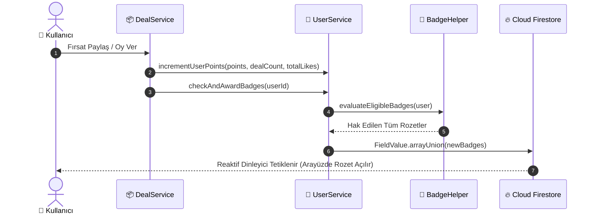

# 🏆 FırsatKolik — Avcı Rozetleri ve Oyunlaştırma (Gamification) Mimari Rehberi

Bu doküman, **FırsatKolik** platformundaki kullanıcı bağlılığını, kaliteli fırsat paylaşımını ve topluluk etkileşimini sürdürülebilir kılmak amacıyla geliştirilen **Avcı Rozetleri ve Oyunlaştırma (Gamification)** mimarisinin tüm teknik detaylarını, veri modellerini, otomatik kazanma algoritmalarını ve hile önleme kurallarını belgeler.

---

## 📑 İçindekiler
1. [🌟 Oyunlaştırma Felsefesi ve Hedefler](#1--oyunlaştırma-felsefesi-ve-hedefler)
2. [🏛️ Rozet Taksonomisi ve Nadirlik Kademeleri (Tiers)](#2-️-rozet-taksonomisi-ve-nadirlik-kademeleri-tiers)
3. [📋 Eksiksiz Rozet Kataloğu (16+ Rozet)](#3--eksiksiz-rozet-kataloğu-16-rozet)
4. [⚙️ Veri Modelleri ve Firestore Şeması](#4-️-veri-modelleri-ve-firestore-şeması)
5. [🔄 Otomatik Ödüllendirme Algoritması ve Tetikleyiciler](#5--otomatik-ödüllendirme-algoritması-ve-tetikleyiciler)
6. [📱 Mobil Arayüz (UI/UX) ve Vitrin Rozeti (Pinned Badge)](#6--mobil-arayüz-uiux-ve-vitrin-rozeti-pinned-badge)
7. [🛡️ Hile Önleme ve Suistimal Koruması (Anti-Abuse)](#7-️-hile-önleme-ve-suistimal-koruması-anti-abuse)
8. [💻 Web Admin Paneli Rozet Yönetimi ve İşlemleri](#8--web-admin-paneli-rozet-yönetimi-ve-i̇şlemleri)

---

## 1. 🌟 Oyunlaştırma Felsefesi ve Hedefler

FırsatKolik gamification sistemi; kullanıcıları sadece pasif birer tüketici olmaktan çıkarıp, platformun büyümesine katkı sağlayan aktif **"Fırsat Avcıları"** haline getirmeyi amaçlar.

### Temel Prensipler:
* **Şeffaf İlerleme:** Her kilitli rozet, kullanıcının hedefe ne kadar yaklaştığını net olarak gösteren sayısal ilerleme çubuğuna (`18 / 25 Paylaşım - %72`) sahiptir.
* **Katmanlı Prestij:** Başlangıç seviyesindeki bir avcıdan, platform efsanesine uzanan net kademe ayrımı (Bronz ➔ Gümüş ➔ Altın ➔ Elmas ➔ Özel).
* **Sosyal Kanıt (Social Proof):** Kazanılan unvanların profil başlığında ve yorumlarda diğer kullanıcılara karşı parlaması ("Vitrin Rozeti").

---

## 2. 🏛️ Rozet Taksonomisi ve Nadirlik Kademeleri (Tiers)

Rozetler 5 farklı nadirlik kademesine ayrılmıştır. Her kademenin kendine has amblem rengi, metalik gradient'i ve mikro-ışık (halo glow) efekti mevcuttur:

| Kademe (`BadgeTier`) | Amblem Rengi | Gradient Paleti | Prestij Seviyesi |
| :--- | :--- | :--- | :--- |
| **🥉 Bronz (Bronze)** | `#CD7F32` | `#B45309` ➔ `#D97706` | Başlangıç ve adaptasyon başarımları. |
| **🥈 Gümüş (Silver)** | `#94A3B8` | `#64748B` ➔ `#94A3B8` | Düzenli katkı sağlayan aktif avcılar. |
| **🥇 Altın (Gold)** | `#F59E0B` | `#D97706` ➔ `#FBBF24` | Yüksek topluluk saygınlığı ve usta paylaşımlar. |
| **💎 Elmas (Diamond)** | `#06B6D4` | `#0284C7` ➔ `#38BDF8` | Rekortmenler ve platformun elit liderleri. |
| **⭐ Özel (Special)** | `#8B5CF6` / `#00BCD4` | `#7C3AED` ➔ `#A78BFA` | Doğrulanmış hesaplar, kurucu üyeler ve yöneticiler. |

---

## 3. 📋 Eksiksiz Rozet Kataloğu (16+ Rozet)

```
                        ┌──────────────────────────────┐
                        │   FırsatKolik Avcı Rozeti    │
                        └──────────────┬───────────────┘
                                       │
         ┌──────────────────┬──────────┴───────────┬──────────────────┐
         ▼                  ▼                      ▼                  ▼
  🎯 Fırsat Avcılığı  💬 Topluluk & Yorum     🔥 Sıcaklık & Oylar   ⭐ Sadakat & Özel
```

### A. 🎯 Fırsat Avcılığı (`dealSharing`)
| Rozet ID | Rozet Adı | Kademe | Kazanma Şartı (`Threshold`) | Açıklama |
| :--- | :--- | :--- | :--- | :--- |
| `first_spark` | **İlk Kıvılcım** | Bronz | `dealCount >= 1` | Toplulukla ilk fırsatını paylaşan yeni avcı. |
| `hunter_apprentice`| **Fırsat Çırağı** | Gümüş | `dealCount >= 5` | Fırsat avcılığında deneyim kazanan hevesli üye. |
| `contributor` | **Katkıda Bulunan** | Gümüş | `dealCount >= 10` | Topluluğa düzenli fırsat kazandıran aktif üye. |
| `master_hunter` | **Usta Avcı** | Altın | `dealCount >= 25` | Fırsatları kaçırmayan, platformun usta paylaşımcısı. |
| `legendary_hunter`| **Efsanevi Avcı** | Elmas | `dealCount >= 100` | FırsatKolik tarihine geçen en elit avcılardan biri. |

### B. 🔥 Sıcaklık & Oylar (`temperatureVoting`)
| Rozet ID | Rozet Adı | Kademe | Kazanma Şartı (`Threshold`) | Açıklama |
| :--- | :--- | :--- | :--- | :--- |
| `active_voter` | **Aktif Seçmen** | Bronz | `points >= 30` | Fırsatların sıcaklığını belirleyen topluluk jürisi. |
| `flame_master` | **Alev Ustası** | Altın | `points >= 100` | Fırsatları alevlendiren ve yüksek sıcaklıklar yakalayan üye. |
| `volcanic_record` | **Volkanik Rekortmen** | Elmas | `points >= 300` | Topluluğu kasıp kavuran rekor sıcaklıklara imza atan üye. |

### C. 💬 Topluluk & Yorum (`communityReviews`)
| Rozet ID | Rozet Adı | Kademe | Kazanma Şartı (`Threshold`) | Açıklama |
| :--- | :--- | :--- | :--- | :--- |
| `voice_of_community`| **Söz Sahibi** | Bronz | `points >= 20` | Fikir ve değerlendirmeleriyle topluluğa katılan üye. |
| `helpful` | **Yardımsever Avcı**| Gümüş | `totalLikes >= 25` | Yorumlarında veya paylaşımlarında 25 beğeni toplayan avcı. |
| `top_reviewer` | **Fikir Önderi** | Altın | `totalLikes >= 100` | Yorumları ve ürün analizleriyle fırsatçılara rehberlik eden üye. |

### D. ⭐ Sadakat, Doğrulama & Özel (`loyaltySpecial`)
| Rozet ID | Rozet Adı | Kademe | Kazanma Şartı (`Threshold`) | Açıklama |
| :--- | :--- | :--- | :--- | :--- |
| `bronze` | **Bronz Avcı** | Bronz | `points >= 10` | FırsatKolik yolculuğuna başlayan aktif üye. |
| `silver` | **Gümüş Avcı** | Gümüş | `points >= 60` | Platformda aktifliğiyle öne çıkan değerli üye. |
| `gold` | **Altın Avcı** | Altın | `points >= 200` | Platformun en saygın ve yüksek puanlı üyelerinden biri. |
| `verified` | **Doğrulanmış Avcı** | Özel | Manuel / Moderatör Onayı | Topluluk güvenilirliği moderasyonca onaylanmış hesap. |
| `early_bird` | **Öncü Kurucu Üye** | Özel | Manuel / Erken Kayıt | İlk dönemde aramıza katılan kurucu topluluk üyesi. |
| `premium` | **Premium** | Özel | Özel Etkinlik / Program | Özel avantajlara ve prestijli statüye sahip üye. |

---

## 4. ⚙️ Veri Modelleri ve Firestore Şeması

### Firestore `users/{userId}` Doküman Yapısı:
```json
{
  "uid": "usr_94827104",
  "username": "KuponAvcisi",
  "points": 145,
  "dealCount": 18,
  "totalLikes": 72,
  "badges": [
    "first_spark",
    "hunter_apprentice",
    "contributor",
    "bronze",
    "silver",
    "voice_of_community",
    "active_voter",
    "flame_master",
    "helpful"
  ],
  "pinnedBadge": "flame_master"
}
```

---

## 5. 🔄 Otomatik Ödüllendirme Algoritması ve Tetikleyiciler

Rozet kazanımı istemci tarafında veya sunucuda olay bazlı olarak asenkron şekilde tetiklenir:



1. **`BadgeHelper.calculateProgress(user, badge)`:**
   - Rozet eşik tipine (`dealCount`, `points`, `totalLikes`) göre kullanıcının anlık değerini hedefe oranlar (`0.0` - `1.0`).
2. **`BadgeHelper.evaluateEligibleBadges(user)`:**
   - Kullanıcının istatistiklerini tarayarak hak ettiği tüm rozet ID'lerini döner.
3. **`UserService.checkAndAwardBadges(userId)`:**
   - Yeni hak edilen rozetleri filtreler ve Firestore'a `FieldValue.arrayUnion` ile mükerrerlik olmadan atomik kaydeder.

---

## 6. 📱 Mobil Arayüz (UI/UX) ve Vitrin Rozeti (Pinned Badge)

Profesyonel Tier-1 mimari standardına uygun olarak rozetler ana profil gövdesinde ekstra alan kaplamayacak şekilde entegre edilmiştir:

### 1. 🪪 Ana Profil Ekranı (`profile_screen.dart`)
* **Tıklanabilir Vitrin Rozeti (Hero Pinned Badge):** Profil başlığında kullanıcının seçtiği unvan rozeti (`⭐ Alev Ustası`) ve puan/seviye çipi parlar. Kullanıcı bu çipe dokunduğunda doğrudan **`BadgesScreen`** açılır.
* **Hesap & Tercihler Menü Satırı (`_buildAccountSettingsSection`):**
  - Profil sayfasında ayrı bir kart veya göze batan bir blok yer almaz.
  - "Bildirim Tercihleri" ve "Takip Ettiğim Avcılar"ın bulunduğu standart ayarlar listesi içerisine minimalist bir satır olarak entegre edilmiştir: `🏆 Avcı Başarımları & Rozetler • 3 / 16 Rozet Kazanıldı >`
  - Bu menü satırına dokunulduğunda doğrudan müstakil **`BadgesScreen`** açılır.

### 2. 🏛️ Müstakil Avcı Başarımları Ekranı (`badges_screen.dart`)
Kullanıcı tüm rozetleri incelemek ve yönetmek istediğinde açılan dedicated başarım merkezi:
* **Başarım Özeti Kartı:** Toplam kazanılan rozet sayısı (`3 / 16`), seviye tamamlanma yüzdesi (`%18`) ve canlı ilerleme çubuğu.
* **Kategori Filtre Çipleri:** `Tümü (16)`, `🎯 Fırsatlar`, `🔥 Sıcaklık`, `💬 Topluluk`, `⭐ Sadakat`.
* **Kademeli Rozet Izgarası:** 2 sütunlu kartlarda metalik çerçeveler (`[Bronz]`, `[Gümüş]`, `[Altın]`, `[Elmas]`), açık/kilitli durumu ve kilitli rozetlerde kalan kota çubuğu (`18 / 25 Paylaşım - %72`).
* **İnteraktif Rozet Detay Modalı (`_showBadgeDetailModal`):**
  - 3D parıltılı amblem ve kademe etiketi.
  - Rozetin topluluk hikayesi ve açıklaması.
  - "Nasıl Kazanılır?" görev kutusu ve canlı ilerleme barı.
  - **"Vitrinde Göster / Vitrinden Kaldır" Butonu:** Kullanıcı kazandığı bir rozeti tek tıkla profil başlığında ve yorumlarda adının yanında unvan olarak sabitleyebilir (`pinnedBadge`).

### 3. 💬 Yorumlarda Yazar Rozeti (`comments_bottom_sheet.dart`)
* Yorum sahibinin seçtiği vitrin rozeti isminin yanında minyatür şık bir vektör çip olarak görüntülenir.

---

## 7. 🛡️ Hile Önleme ve Suistimal Koruması (Anti-Abuse)

1. **Yalnızca Onaylı Fırsatlar:** Silinen veya moderatörce engellenen fırsatlar için `dealCount` negatif dengelenir.
2. **Kendi Fırsatına Oy Verememe:** Kullanıcılar kendi paylaşımlarına sıcak/soğuk oy veremez (puan manipülasyonu engellenir).
3. **Atomik Firestore Güncellemeleri:** Rozet listesi `FieldValue.arrayUnion` ile korunarak mükerrer veya yarış durumu (race condition) kayıtları önlenir.

---

## 8. 💻 Web Admin Paneli Rozet Yönetimi ve İşlemleri

Yöneticiler, web yönetim paneli (`web/admin/`) üzerinden kullanıcıların sahip olduğu tüm rozetleri eksiksiz olarak görüntüleyebilir ve gerçek zamanlı rozet yönetimi gerçekleştirebilir.

### A. 📋 Kullanıcılar Tablosu Entegrasyonu (`renderUsers`)
* **Yeni "Rozetler" Sütunu:** Tablo başlığına eklenen `Rozetler` sütunu, kullanıcının sahip olduğu toplam rozet sayısını (`X Rozet`) ve varsa aktif **Vitrin Rozeti (Pinned Badge)** amblemini kademe rengiyle gösterir.
* **Rozet Bazlı Arama Motoru:** Arama çubuğuna kullanıcının rozet adı (örn: `Usta Avcı`, `Alev Ustası`, `Doğrulanmış`) veya teknik kimliği (`first_spark`, `verified`, `gold`) yazıldığında anında filtreleme yapılır.

### B. 👤 Kullanıcı Detay Modalı (`showUserDetail` — Rozet Yönetimi)
Kullanıcı detayına tıklandığında sağ panelde açılan **"Rozet Yönetimi"** kartı şu yetenekleri sunar:

| Yönetimsel İşlem | Tetiklenen Fonksiyon | Açıklama |
| :--- | :--- | :--- |
| **Mevcut Rozetleri Listeleme** | `getBadgeMeta(badgeId)` | Kullanıcının tüm rozetlerini ikon, localized başlık, kademe etiketi (`[Bronz]`, `[Gümüş]`, `[Altın]`, `[Elmas]`, `[Özel]`) ve `⭐ Vitrin` rozetiyle gösterir. |
| **Vitrinde Göster / Kaldır** | `window.togglePinBadge(userId, badgeId)` | İlgili rozeti kullanıcının profilinde ve yorumlarda adının yanında görünecek vitrin unvanı olarak ayarlar veya kaldırır. |
| **Rozet Silme / Geri Alma** | `window.removeBadge(userId, badgeId)` | Kullanıcıdan rozeti onay kutusu eşliğinde kaldırır. Eğer silinen rozet vitrinde ise `pinnedBadge` alanını da temizler. |
| **Katalogdan Rozet Ekleme** | `window.addBadgeFromCatalog(userId)` | 16+ resmi katalog rozetini kategorize dropdown üzerinden seçerek tek tıkla kullanıcıya atar. |
| **Özel Rozet Ekleme** | `window.addBadge(userId)` | Manuel kimlik girilerek özel promosyon veya iş birliği rozeti eklenmesini sağlar. |
| **Otomatik Rozet Eşitleme** | `window.autoAwardBadgesForUser(userId)` | Kullanıcının `dealCount`, `points` ve `totalLikes` istatistiklerini tarayarak hak ettiği tüm eksik rozetleri tek tıkla topluca verir. |

### C. 🔄 Firestore Veri Senkronizasyonu
* Panel üzerinden yapılan tüm ekleme/çıkarma/sabitleme işlemleri doğrudan Firestore `users/{userId}` dokümanına `FieldValue.arrayUnion` ve `FieldValue.delete` ile atomik olarak işlenir.
* Mobil uygulama tarafındaki reaktif Firestore dinleyicileri (snapshot listener) sayesinde kullanıcının ekranında rozetler anında güncellenir.


