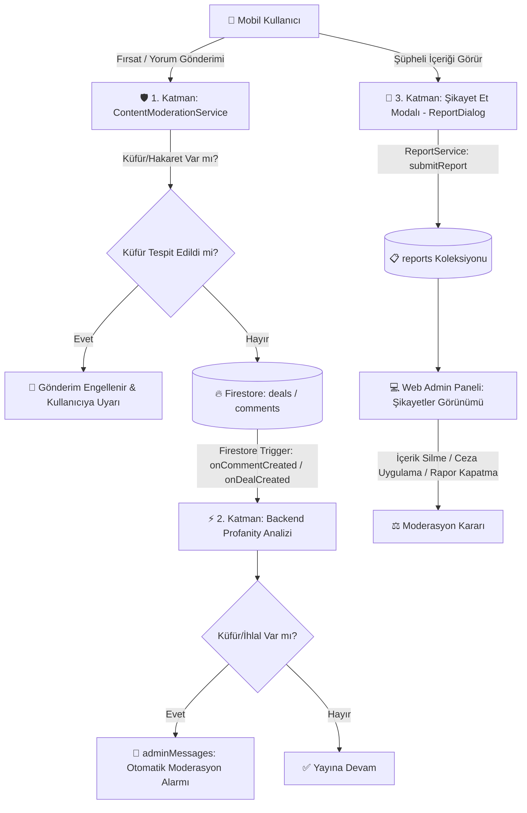

# 🛡️ FırsatKolik — İçerik Moderasyonu, Şikayet ve Raporlama Sistemi Rehberi

Bu doküman, FırsatKolik platformunda kullanıcı deneyimini, topluluk huzurunu ve platform güvenliğini korumak amacıyla kurulan **Otomatik İçerik Moderasyonu**, **Kullanıcı Şikayet/Raporlama Altyapısı** ve **Yönetici Denetim Mekanizması**'nın mimari ve operasyonel prensiplerini açıklamaktadır.

---

## 🏗️ 1. Genel Mimari ve Moderasyon Katmanları

Platformdaki içerik denetimi **3 aşamalı hibrit bir koruma kalkanı** ile yürütülür:



---

## 🚫 2. 1. Katman: Otomatik Küfür ve Uygunsuz İçerik Filtreleme (`ContentModerationService`)

Mobil uygulama tarafında (`lib/services/content_moderation_service.dart`) ve Cloud Functions tarafında (`functions/index.js`) çalışan içerik denetim motorudur.

### 2.1 Çalışma Prensibi ve Akıllı Sınır Eşleşmesi (Boundary Matching):
E-ticaret platformlarında yaygın olarak karşılaşılan en büyük problem, masum ürün adlarının (örn: *bulaşık*, *kaşar*, *eksik*, *şık*, *cif*, *anakart*, *bomba indirim*) kaba kelime filtrelerine takılmasıdır. Bu sorunu çözmek için:

1. **Kelime Sınır Kontrolü (Word Boundary Regex):**
   - Alt dize (substring) araması yerine `(^|\s|[^a-zA-Z0-9çğıöşüÇĞİÖŞÜ])` regex sınırları kullanılır.
   - Örnek: `sik` kelimesi `bulaşık` veya `eksik` kelimeleri içinde geçse dahi engellenmez; yalnızca tek başına hakaret amaçlı kullanıldığında tespit edilir.
2. **Türkçe Karakter Normalizasyonu (`normalize`):**
   - Türkçe karakterler (`ç->c`, `ğ->g`, `ı->i`, `ö->o`, `ş->s`, `ü->u`) küçük harfe normalize edilerek aradaki boşluk ve noktalama kaçışları elenir.
3. **Anında İstemci Tarafı Engelleme:**
   - Kullanıcı fırsat veya yorum göndermeye çalıştığında metin taranır. İhlal varsa `ModerationResult(isValid: false, errorMessage: '...')` dönerek içerik veritabanına yazılmadan engellenir.

---

## 🚩 3. 2. Katman: Topluluk Şikayet ve Raporlama Sistemi (`ReportService`)

Kullanıcılar; kurallara aykırı, spam, süresi geçmiş veya yanıltıcı fırsat ve yorumları doğrudan arayüzden şikayet edebilir.

### 3.1 Veri Yapısı (`reports` Koleksiyonu):
Her şikayet kaydı bağımsız bir doküman olarak saklanır:

```typescript
interface ReportDocument {
  reportedId: string;       // Şikayet edilen içerik ID'si (dealId veya commentId)
  reportedBy: string;       // Şikayet eden kullanıcının UID'si
  type: string;             // 'deal' | 'comment' | 'user' | 'message'
  reason: string;           // 'spam' | 'fake_price' | 'inappropriate' | 'expired' | 'other'
  description?: string;     // Kullanıcının eklediği isteğe bağlı açıklama
  targetDealId?: string;    // Yorum şikayetiyse ana fırsatın ID'si
  targetContent?: string;   // Şikayet anındaki içerik metni
  targetAuthor?: string;    // İçeriği paylaşan kişinin adı
  targetAuthorId?: string;  // İçeriği paylaşan kişinin UID'si
  createdAt: Timestamp;     // Rapor oluşturulma zamanı
  status: string;           // 'pending' | 'reviewed' | 'dismissed' | 'action_taken'
  updatedAt?: Timestamp;
}
```

### 3.2 Mükerrer Şikayet Koruması (Deduplication):
Aynı kullanıcının aynı fırsata veya yoruma defalarca şikayet açarak veritabanını şişirmesini önlemek için deterministik doküman kimliği kullanılır:
* **Doküman ID Formatı:** `{reportedId}_{userId}` (Örn: `deal123_user456`)
* Kullanıcı aynı içeriği tekrar raporlamaya çalıştığında `existingDoc.exists` kontrolü ile sessizce başarı döner ve mükerrer doküman üretilmez.

---

## ⚖️ 4. 3. Katman: Web Admin Paneli Moderasyon İş Akışı

Yöneticiler, gelen şikayetleri ve otomatik moderasyon uyarılarını Web Admin Paneli üzerinden yönetir:

### 4.1 Raporların İncelenmesi (`showReportsView`):
1. Web panelinde `reports` koleksiyonu `status == 'pending'` filtresi ile canlı olarak listelenir.
2. Yönetici; şikayet edilen içeriği, şikayet eden kişiyi ve şikayet gerekçesini tek ekranda inceler.
3. İçeriğe hızlıca göz atmak için "Fırsatı İncele" veya "Yorumu İncele" butonlarına basabilir.

### 4.2 Alınabilecek Moderasyon Kararları:
* **İçeriği Sil:** Şikayet haklıysa ilgili fırsat veya yorum veritabanından kalıcı olarak silinir.
* **Şikayeti Kapat / Reddet (`dismissed`):** Şikayet asılsızsa rapor kapatılır.
* **Kullanıcıyı Engelle (Ban):** Kural ihlali yapan kullanıcı `blockedUsers`, `commentBannedUsers` veya `dealBannedUsers` koleksiyonlarına eklenerek platformdaki yetkileri kısıtlanır.

---

## 🔒 5. Firestore Güvenlik Kuralları ve Ceza İcrası

`firestore.rules` dosyasında moderasyon için tanımlanan kritik kurallar:

```rules
// Kullanıcı engellenmiş mi?
function isBlocked() {
  return exists(/databases/$(database)/documents/blockedUsers/$(request.auth.uid));
}

// Engellenmiş kullanıcı hiçbir koleksiyona yazamaz
function canWrite() {
  return isAuthenticated() && !isBlocked();
}

// Yorum veya Fırsat paylaşım yasağı kontrolleri
match /deals/{dealId} {
  allow create: if canWrite() && !exists(/databases/$(database)/documents/dealBannedUsers/$(request.auth.uid));
}

match /deals/{dealId}/comments/{commentId} {
  allow create: if canWrite() && !exists(/databases/$(database)/documents/commentBannedUsers/$(request.auth.uid));
}
```

---
*FırsatKolik İçerik Moderasyonu ve Şikayet Sistemi Rehberi — 2026*
