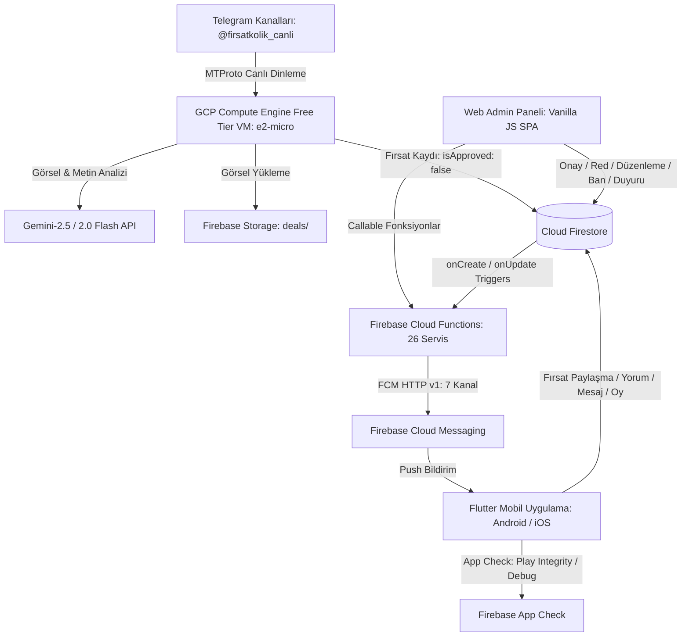

# 🏛️ FırsatKolik — Sistem Mimarisi, Yaşam Döngüsü ve Sosyal Etkileşim Master Rehberi

> [!IMPORTANT]
> **Base Doküman & Sistem Kontratı:** Bu doküman, FırsatKolik platformunun mimari, algoritmik ve sosyal bileşenlerini yöneten **ana orkestratör (Base Contract)** dokümandır. Her bir alt mimarinin ayrıntılı teknik referansları ilgili bölümlerde doğrudan bağlantılanmıştır.

Bu doküman; **FırsatKolik** platformunun uçtan uca sistem topolojisini, 4 ana menü gösterim ve Wilson sıralama algoritmalarını, P2P canlı mesajlaşma ve admin duyuru altyapısını, 16+ Avcı Rozeti ve 10 kademeli oyunlaştırma (gamification) motorunu, 3 katmanlı içerik moderasyonu ve şikayet havuzunu, Ticaret Bakanlığı reklam uyum etiketleme standartlarını, WebP avatar/profil denormalizasyon senkronizasyonunu ve 10 modüllü Web Admin panelini tanımlayan **resmi mimari sözleşmedir (Documentation Contract)**.

---

## 📑 İçindekiler
1. [🗺️ Uçtan Uca Sistem Topolojisi ve Veri Yolları](#1-️-uçtan-uca-sistem-topolojisi-ve-veri-yolları)
2. [🚀 4 Ana Menü Gösterim ve Sıralama Algoritmaları](#2--4-ana-menü-gösterim-ve-sıralama-algoritmaları)
3. [📬 P2P Birebir Sohbet ve Admin Mesajlaşma Mimarisi](#3--p2p-birebir-sohbet-ve-admin-mesajlaşma-mimarisi)
4. [🏆 16+ Avcı Rozeti ve 10 Kademeli Gamification Motoru](#4--16-avcı-rozeti-ve-10-kademeli-gamification-motoru)
5. [🛡️ 3 Katmanlı İçerik Moderasyonu ve Şikayet Havuzu](#5-️-3-katmanlı-i̇çerik-moderasyonu-ve-şikayet-havuzu)
6. [⚖️ Ticari Reklam Yönetmeliği Uyum ve #tanıtım Etiketleme](#6-️-ticari-reklam-yönetmeliği-uyum-ve-tanıtım-etiketleme)
7. [📸 WebP Avatar, Profil ve Denormalize Senkronizasyon](#7--webp-avatar-profil-ve-denormalize-senkronizasyon)
8. [💻 10 Modüllü Web Admin Paneli Mimarisi](#8--10-modüllü-web-admin-paneli-mimarisi)
9. [🧹 48 Saatlik Soft-Expire ve 30 Günlük Hard-Purge Yaşam Döngüsü](#9--48-saatlik-soft-expire-ve-30-günlük-hard-purge-yaşam-döngüsü)
10. [📂 İlgili Kaynak Kod Dosyaları ve Referanslar](#10--i̇lgili-kaynak-kod-dosyaları-ve-referanslar)

---

## 1. 🗺️ Uçtan Uca Sistem Topolojisi ve Veri Yolları

> 🔗 **Detaylı Referans Dokümanları:**
> - [Sistem Mimarisi ve Veri Akışları Rehberi](file:///d:/firsatkolik/documentation/mimari-ve-sistem/system_architecture_and_flows.md) — 4 temel sequence diyagramı, bot ve bildirim akışları.
> - [Proje Bilgi Bankası ve Hafıza Manifestosu](file:///d:/firsatkolik/documentation/mimari-ve-sistem/project_knowledge_base_manifest.md) — VM, Bot, DB ve deployment manifestosu.

FırsatKolik mimarisi; istemci (Flutter), otonom botlar (Node.js GramJS VM), sunucusuz bulut fonksiyonları (Cloud Functions), veritabanı (Firestore), dosya depolama (Storage) ve yönetim panelinden (Web Admin SPA) oluşur:



---

## 2. 🚀 4 Ana Menü Gösterim ve Sıralama Algoritmaları

> 🔗 **Detaylı Referans Dokümanı:**
> - [Fırsat Gösterim Algoritmaları Rehberi](file:///d:/firsatkolik/documentation/mimari-ve-sistem/firsat_gosterim_algoritmalari_rehberi.md) — Wilson skoru, zaman çürümesi, tazelik katsayıları ve FOMO puanlama kuralları.

Uygulamada içerik tazeliği, kullanıcı güveni ve FOMO (kaçırma korkusu) dengesini sağlayan 4 temel vitrin bulunmaktadır:

| Menü | Zaman Penceresi | Sıralama Formülü | Biten Fırsat Davranışı (`isExpired`) | Amacı ve UX Hissiyatı |
| :--- | :--- | :--- | :--- | :--- |
| 🏠 **1. Anasayfa** | Son **48 Saat** | **`homeFeedScore` ↓** (Tazelik + Trending - TrollCeza - FOMO) | **Gösterilir** (`-25.0` FOMO Puan Kırılması + `Opacity: 0.8` + "⌛ KAÇTI" Rozeti) | Canlı haber akışı (Timeline); taze fırsatları öne çıkarır, kaçan fırsatlarla FOMO hissi uyandırır. |
| 📑 **2. Kaydedilenlerim** | **Sınırsız / 30 Gün** | Favoriye Eklenme Tarihi (`savedAt ↓`) | **Gösterilir** (Silinmez, `savedAt` sırasını korur + `Opacity: 0.8` + "⌛ KAÇTI" Rozeti) | "Özel Dijital Depom" — Kullanıcının arşivlediği tüm taze/biten kayıtların kronolojik kütüphanesi. |
| 🏷️ **3. Favori Kategorilerim**| Son **48 Saat** | **`homeFeedScore` ↓** (Takip Edilen Kategorilere Filtreli) | **Gösterilir** (`-25.0` FOMO Puan Kırılması + `Opacity: 0.8` + "⌛ KAÇTI" Rozeti) | "Kişiselleştirilmiş Özel Fırsat Akışım" — Sadece kullanıcının seçtiği kategorilere özel akış. |
| 🔥 **4. Popüler Fırsatlar** | Son **48 Saat** | **`popularityScore` ↓** (Wilson + Time Decay + Engagement) | **GÖSTERİLMEZ (%100 Elenir)** | Topluluğun alevlendirdiği, en az 3 sıcak oylu ve net pozitif trend indirimler. |

### Popülerlik Skoru Akıllı Formülü (`popularityScore`):
$$\text{popularityScore} = (\text{effectiveScore} + \text{engagementBonus} + \text{freshnessBoost}) \times 2^{-\left(\frac{\text{ageInHours}}{12.0}\right)}$$

- **Kalite Skoru (`effectiveScore`):** Wilson Score (%60) + Ham Sıcak Oy Oranı (%40).
- **12 Saatlik Yarı Ömür (Time Decay):** 24 saatini dolduran fırsatların zamansal puan çarpanı 0.25'e düşer.
- **Tazelik Takviyesi (`freshnessBoost`):** İlk 6 saatte `+0.40`, 6-12 saatte `+0.20` puan.
- **Etkileşim Bonusu (`engagementBonus`):** $\log_2(1 + \text{commentCount}) \times 0.05$.

---

## 3. 📬 P2P Birebir Sohbet ve Admin Mesajlaşma Mimarisi

> 🔗 **Detaylı Referans Dokümanı:**
> - [Mesajlaşma Sistemi Mevcut Durum Raporu](file:///d:/firsatkolik/documentation/mimari-ve-sistem/MESAJLASMA_SISTEMI_MEVCUT_DURUM_RAPORU.md) — Düz koleksiyonlu P2P sohbet, alıntı, soft delete, in-app banner ve admin duyuru mimarisi.

Kullanıcılar arası alışveriş iletişimi ve yönetim duyuruları 3 katmanda yürütülür:

1. **P2P Kullanıcılar Arası Sohbet (`messages/{messageId}`):**
   - **Pinned Fırsat Kartı:** Fırsat detayından başlatılan sohbetlerde ekranın üstüne sabitlenen ürün özeti (Görsel, Başlık, Fiyat, Mağaza).
   - **Data-Only Push İletimi:** Cloud Functions `onUserMessageCreated` üzerinden gönderilen veri öncelikli push paketi sayesinde kullanıcı sohbet ekranındayken bildirimler sessizce akışa işlenir (`activeChatUserId` kontrolü).
   - **In-App Toast Banner:** Uygulama açıkken başka bir ekranda bulunulduğunda ekranın üstünden kayan tıklanabilir bildirim çubuğu ([in_app_message_banner.dart](file:///d:/firsatkolik/lib/widgets/in_app_message_banner.dart)).
   - **Geri Alma ve Silme:** İlk 15 dakika içinde "Herkesten Sil", sonrasında "Benden Sil" (Soft delete) imkanı.
2. **Yönetimden Kullanıcıya Resmi Bildirim (`adminToUserMessages/{messageId}`):**
   - Admin panelinden tekil kullanıcıya gönderilen tek yönlü, resmi ve kilitli sohbet bildirimleridir.
3. **Otomatik Moderasyon Uyarıları (`adminMessages/{messageId}`):**
   - Küfür veya hakaret tespit edildiğinde Cloud Functions tarafından admin paneline düşürülen alarm kayıtlarıdır.

---

## 4. 🏆 16+ Avcı Rozeti ve 10 Kademeli Gamification Motoru

> 🔗 **Detaylı Referans Dokümanı:**
> - [Avcı Rozetleri ve Gamification Mimari Rehberi](file:///d:/firsatkolik/documentation/mimari-ve-sistem/avci_rozetleri_ve_gamification_rehberi.md) — 16+ başarım rozeti, 5 nadirlik kademesi, 10 avcı rütbesi ve otomatik ödüllendirme formülleri.

Kullanıcı bağlılığını ve paylaşım kalitesini ödüllendiren 5 nadirlik kademesi ve 10 rütbe seviyesi:

### Rozet Kademeleri (Tiers):
- **🥉 Bronz:** Başlangıç rozetleri (`first_spark`, `active_voter`, `voice_of_community`, `bronze`).
- **🥈 Gümüş:** Düzenli katkı rozetleri (`hunter_apprentice`, `contributor`, `helpful`, `silver`).
- **🥇 Altın:** Usta paylaşımlar (`master_hunter`, `flame_master`, `top_reviewer`, `gold`).
- **💎 Elmas:** Rekortmen ve liderler (`legendary_hunter`, `volcanic_record`).
- **⭐ Özel:** Doğrulanmış hesaplar (`verified`), öncü kurucular (`early_bird`) ve `premium` üyeler.

### 10 Kademeli Avcı Rütbeleri (Hunter Ranks):
1. **🌱 Çaylak Avcı (0–19 P)** ➔ 2. **🏹 Çırak Avcı (20–49 P)** ➔ 3. **⚡ Aktif Avcı (50–119 P)** ➔ 4. **🛡️ Güvenilir Avcı (120–249 P)** ➔ 5. **⭐ Kıdemli Avcı (250–499 P)** ➔ 6. **🔮 Uzman Avcı (500–999 P)** ➔ 7. **💎 Üstat Avcı (1.000–2.499 P)** ➔ 8. **🦅 Efsanevi Avcı (2.500–4.999 P)** ➔ 9. **🪐 Kozmik Avcı (5.000–9.999 P)** ➔ 10. **👑 Fırsat Lordu (10.000+ P)**.

- **Vitrin Rozeti (Pinned Badge):** Kullanıcı kazandığı rozetlerden birini profiline ve yorum satırlarına unvan rozeti olarak sabitleyebilir (`pinnedBadge`).

---

## 5. 🛡️ 3 Katmanlı İçerik Moderasyonu ve Şikayet Havuzu

> 🔗 **Detaylı Referans Dokümanı:**
> - [İçerik Moderasyonu ve Şikayet Sistemi Rehberi](file:///d:/firsatkolik/documentation/mimari-ve-sistem/icerik_moderasyonu_ve_sikayet_sistemi_rehberi.md) — Regex kelime sınırları, `reports` koleksiyonu, mükerrerlik koruması ve ceza icrası.

Topluluk güvenliğini korumak için 3 aşamalı hibrit koruma kalkanı uygulanır:

1. **1. Katman (İstemci Filtresi - `ContentModerationService`):**
   - Regex kelime sınırı (`(^|\s|[^a-zA-Z0-9çğıöşüÇĞİÖŞÜ])`) ile çalışır.
   - Masum e-ticaret kelimeleri (*bulaşık*, *eksik*, *kaşar*, *şık*) filtrelere takılmaz; yalnızca hakaret amaçlı kaba kelimeler engellenir.
2. **2. Katman (Sunucu Filtresi - Cloud Functions `index.js`):**
   - `onDealCreated` ve `onCommentCreated` tetikleyicilerinde küfür yakalandığında içerik `isApproved: false` yapılır ve `adminMessages` koleksiyonuna denetim alarmı düşer.
3. **3. Katman (Topluluk Şikayet Havuzu - `ReportService`):**
   - Kullanıcılar arayüzden şikayet oluşturabilir (`reports/{reportedId}_{userId}`).
   - Mükerrer şikayetler deterministik doküman ID formatı ile engellenir.
   - Web Admin panelinde `status == 'pending'` raporları canlı incelenir; içerik silme, ceza verme veya rapor kapatma işlemleri uygulanır.

---

## 6. ⚖️ Ticari Reklam Yönetmeliği Uyum ve #tanıtım Etiketleme

> 🔗 **Detaylı Referans Dokümanı:**
> - [Ticari Reklam Yönetmeliği Uyum ve Etiketleme Rehberi](file:///d:/firsatkolik/documentation/mimari-ve-sistem/ticari_reklam_uyum_ve_etiketleme_rehberi.md) — Ticaret Bakanlığı 1 Ağustos düzenlemeleri ve çift taraflı (Dart/Node.js) uyum motoru.

T.C. Ticaret Bakanlığı 1 Ağustos reklam düzenlemeleri gereğince platformdaki tüm paylaşımlar otomatik olarak standartlaştırılır:
- **`AdvertisingComplianceService` (Dart & Node.js):**
  - Düzensiz ve eski etiketleri (`#reklam`, `#işbirliği`, `[SPONSORLU]` vb.) regex ile temizler.
  - Açıklama metninin en sonuna iki satır boşluk bırakarak resmi **`#tanıtım`** etiketini ekler.
  - Mobil paylaşım ekranında, `DealService.createDeal` metodunda ve Telegram botu canlı akışında zorunlu çalıştırılır.

---

## 7. 📸 WebP Avatar, Profil ve Denormalize Senkronizasyon

> 🔗 **Detaylı Referans Dokümanı:**
> - [Profil Resmi ve Kullanıcı Bilgileri Master Referans Rehberi](file:///d:/firsatkolik/documentation/mimari-ve-sistem/profil_resmi_ve_kullanici_rehberi.md) — WebP avatar assetleri, 4 kademeli render zinciri ve `onUserUpdated` senkronizasyonu.

Profil görsellerinin ve kullanıcı adlarının tüm platformda tutarlı kalması için katı kurallar işletilir:

- **4 Kademeli Görsel Render Zinciri:**
  1. `migrateAssetPath` ile yol temizleme ve `.webp` formatına dönüştürme.
  2. Yerel asset görseli (`assets/kullanıcı pp.webp`, `assets/kkpp.webp`, `assets/botkolik.webp`).
  3. Uzak URL görseli (`CachedNetworkImage` + `evictFromCache`).
  4. Baş harf veya `Icons.person` fallback çizimi.
- **`onUserUpdated` Batch Senkronizasyonu:**
  - Kullanıcı adı veya fotoğrafı değiştiğinde Cloud Functions; kullanıcının paylaştığı fırsatları (`deals`), yazdığı yorumları (`comments`) ve gönderdiği/aldığı tüm mesajları (`messages`) 400'lük batch parçalarıyla atomik günceller.
- **Misafir Profili (`GuestProfileScreen`):**
  - Giriş yapmamış kullanıcılara 6 temel topluluk ayrıcalığını sergileyen şık karşılama vitrini sunar.

---

## 8. 💻 10 Modüllü Web Admin Paneli Mimarisi

> 🔗 **Detaylı Referans Dokümanı:**
> - [Web Admin Paneli Kapsamlı Mimari ve Operasyon Rehberi](file:///d:/firsatkolik/documentation/mimari-ve-sistem/web_admin_paneli_rehberi.md) — 10 yönetim modülü, gerçek zamanlı stream dinleyicileri ve Zero-Build mimarisi.

Firebase Hosting üzerinde barındırılan Web Admin Paneli ([web/admin/app.js](file:///d:/firsatkolik/web/admin/app.js)); harici framework bağımlılığı olmayan Vanilla JS SPA yapısındadır:

1. **📊 Dashboard:** Sistem sağlığı, Telegram bot kalp atışı (`lastHeartbeat`), 7 günlük grafikler.
2. **🏷️ Fırsatlar:** Onay bekleyen, aktif veya süresi dolan fırsatları listeleme, onaylama, iptal ve tam lightbox inceleme.
3. **👥 Kullanıcılar:** Profil inceleme, rozet kataloğundan rozet atama/kaldırma, vitrin rozeti sabitleme, banlama.
4. **💬 Mesajlar & Simülatör:** Canlı sohbet akışı denetimi, Botkolik sohbetleri ve moderasyon mesajları.
5. **🚩 Şikayetler & Raporlar:** Bekleyen kullanıcı şikayetleri ve anında içerik silme.
6. **⚙️ Sistem & Bot Ayarları:** Dinamik kanal ekleme/çıkarma (`monitoredChannels`), global paylaşım şalterleri, 30+ günlük temizlik.
7. **🔔 Bildirimler Merkezi:** Cihaz istatistikleri, bildirim hız limitleri, manuel push gönderimi ve token temizliği.
8. **📜 Sistem Logları:** `systemErrors` koleksiyonundan hata takibi.
9. **🎟️ Kuponlar Yönetimi:** Kupon ekleme/silme ve anlık kazıma botunu çalıştırma (`scrapeCouponsManual`).
10. **📰 Aktüel Kataloglar:** Broşür inceleme/silme ve katalog kazıma botunu çalıştırma (`scrapeCatalogsManual`).

---

## 9. 🧹 48 Saatlik Soft-Expire ve 30 Günlük Hard-Purge Yaşam Döngüsü

> 🔗 **Detaylı Referans Dokümanı:**
> - [Fırsat Temizlik, Favori ve Profil Geçmişi Sistemi Yol Haritası](file:///d:/firsatkolik/documentation/mimari-ve-sistem/data-share-algorithm.md) — Favori metaveri snapshot garantisi ve veri saklama yaşam döngüsü.

Veritabanı şişkinliğini önlemek ve maliyeti kontrol altında tutmak için 3 aşamalı yaşam döngüsü politikası uygulanır:

```
[Yeni Fırsat Paylaşıldı]
       │
       ├─► 0 - 48 Saat ────► Anasayfa, Favori Kategorilerim ve Popüler'de Canlı
       │
       ├─► 48 Saat Sonrası ────► cleanupExpiredDeals (Her gün 03:00)
       │                         • Fırsat dokümanı SİLİNMEZ (Soft-Expire).
       │                         • Sadece `isExpired: true` işaretlenir.
       │                         • Anasayfa ve Popüler akışından kalkar; Favorilerde "⌛ KAÇTI" rozetiyle kalır.
       │
       └─► 30 Gün Sonrası ─────► purgeOldDeals (Her Pazar 04:00 veya Admin Paneli Temizliği)
                                 • Fırsat dokümanı, oylar, yorumlar, Storage görselleri ve
                                   tüm kullanıcılardaki 30+ günlük bildirimler KALICI SİLİNİR (Hard-Purge) 🗑️
```

---

## 10. 📂 İlgili Kaynak Kod Dosyaları ve Referanslar

| Rol / Katman | Dosya Yolu | Açıklama |
| :--- | :--- | :--- |
| **Sistem Akışları** | [system_architecture_and_flows.md](file:///d:/firsatkolik/documentation/mimari-ve-sistem/system_architecture_and_flows.md) | Uçtan uca mimari şemalar ve sequence diyagramları. |
| **Gösterim Algoritmaları** | [firsat_gosterim_algoritmalari_rehberi.md](file:///d:/firsatkolik/documentation/mimari-ve-sistem/firsat_gosterim_algoritmalari_rehberi.md) | Anasayfa, Popüler, Wilson Score ve FOMO formülleri. |
| **Web Admin Paneli** | [web_admin_paneli_rehberi.md](file:///d:/firsatkolik/documentation/mimari-ve-sistem/web_admin_paneli_rehberi.md) | 10 modüllü admin paneli mimarisi ve operasyonel işlevleri. |
| **İçerik Moderasyonu** | [icerik_moderasyonu_ve_sikayet_sistemi_rehberi.md](file:///d:/firsatkolik/documentation/mimari-ve-sistem/icerik_moderasyonu_ve_sikayet_sistemi_rehberi.md) | Küfür engelleme, şikayet havuzu ve ceza icrası. |
| **Reklam Yönetmeliği Uyum**| [ticari_reklam_uyum_ve_etiketleme_rehberi.md](file:///d:/firsatkolik/documentation/mimari-ve-sistem/ticari_reklam_uyum_ve_etiketleme_rehberi.md) | Ticaret Bakanlığı reklam uyumu ve `#tanıtım` servisi. |
| **Avcı Rozetleri** | [avci_rozetleri_ve_gamification_rehberi.md](file:///d:/firsatkolik/documentation/mimari-ve-sistem/avci_rozetleri_ve_gamification_rehberi.md) | 16+ rozet, 5 kademe ve 10 rütbe gamification kılavuzu. |
| **Mesajlaşma Durum Raporu**| [MESAJLASMA_SISTEMI_MEVCUT_DURUM_RAPORU.md](file:///d:/firsatkolik/documentation/mimari-ve-sistem/MESAJLASMA_SISTEMI_MEVCUT_DURUM_RAPORU.md) | P2P sohbet, admin duyuruları ve in-app banner mimarisi. |
| **Profil & Avatar Rehberi**| [profil_resmi_ve_kullanici_rehberi.md](file:///d:/firsatkolik/documentation/mimari-ve-sistem/profil_resmi_ve_kullanici_rehberi.md) | WebP avatarları, render zinciri ve senkronizasyon. |
| **Proje Manifesti** | [project_knowledge_base_manifest.md](file:///d:/firsatkolik/documentation/mimari-ve-sistem/project_knowledge_base_manifest.md) | Yapay zeka hafıza manifesti ve deployment kılavuzu. |
