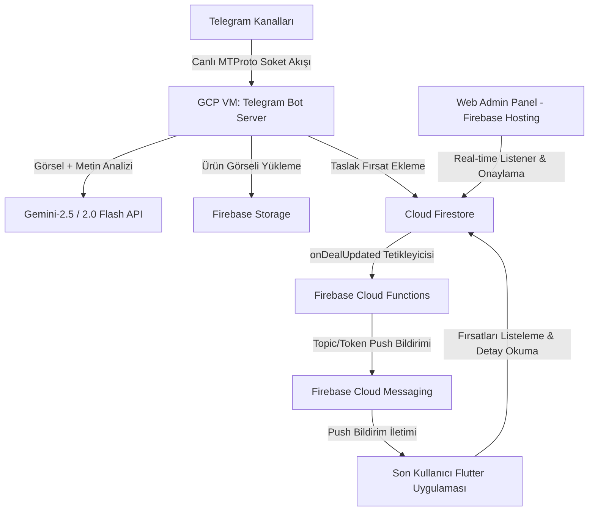

# 🧠 FırsatKolik — Proje Bilgi Bankası ve Yapay Zeka Hafıza Dosyası (Project Context Manifest)

> [!NOTE]
> Bu doküman yapay zeka oturumları için hızlı hafıza manifestosu ve deployment kılavuzudur. Sistemin güncel gösterim algoritmaları, gamification, mesajlaşma, moderasyon ve Web Admin entegrasyonu için lütfen **[Sistem Mimarisi, Yaşam Döngüsü ve Sosyal Etkileşim Master Rehberi](file:///d:/firsatkolik/documentation/mimari-ve-sistem/mimari_ve_sistem_rehberi.md)** dokümanını inceleyiniz.

Bu belge, **FırsatKolik** projesinin tüm teknik altyapısını, mimarisini, veri akışlarını, ortam konfigürasyonlarını ve canlı/geliştirme sistemlerini tek bir çatı altında toplar. **Amaç; yeni bir yapay zeka oturumunda bu belgenin doğrudan okunarak projenin A'dan Z'ye tüm detaylarının yapay zeka hafızasına aktarılmasıdır.**

---

## 🗺️ 1. Genel Mimari ve Bileşenlerin Rolü (Overview)

FırsatKolik; Telegram kanallarından paylaşılan indirimli ürün linklerini yakalayan, yapay zeka ile parse edip bir yönetim paneline sunan, onaylanan fırsatları ise Flutter mobil uygulaması üzerinden kullanıcılara anlık push bildirimleri ile ileten bir platformdur.



---

## 📂 2. Dizin Yapısı ve Klasörlerin Amacı (Directory Structure)

*   **`[Root]/`**: Flutter mobil uygulamasının ana çalışma dizinidir.
    *   `lib/`: Flutter Dart kodlarının bulunduğu dizin.
        *   `services/scrapers/`: Kullanıcıların uygulama içinden link paylaşırken kullandığı **Dart tabanlı tarayıcı (Scraper)** sınıfları (Örn: `hepsiburada_scraper.dart`).
*   **`cloud-run-bot/`**: Telegram kanallarını dinleyen Node.js uygulamasının dizini.
    *   `telegram_bot.js`: Botun ana giriş noktası. Kanalları dinler, görselleri indirir, Gemini ve Firestore entegrasyonunu yönetir.
    *   `link_scraper_service.js`: Gelen bağlantıların yönlendirmelerini takip eden ve bypass stratejilerini yöneten katman.
    *   `category_detection_service.js`: Ürün başlığı ve açıklamasına göre kategoriyi otomatik saptayan servis.
    *   `scrapers/`: Botun kullandığı **JS tabanlı tarayıcı (Scraper)** sınıfları (Örn: `hepsiburada_scraper.js`).
    *   `deploy_to_vm.py`: Güncellemeleri Google Cloud Build servisi ile bulutta derleyip VM'e kuran standart deployment betiği.
    *   `deploy_direct_vm.py`: Google Cloud Build servisini/APIsini bypass ederek yerel kodları SCP ile doğrudan VM'e aktaran ve Docker derlemesini (`docker build`) doğrudan VM sunucusunun kendi içinde ücretsiz koşturan alternatif deployment betiği.
    *   `dev.env` / `prod.env`: Ortam değişkenleri (Secret şifreleri barındırmaz, sadece konfigürasyonel veri taşır).
*   **`functions/`**: Firebase Cloud Functions kodları.
    *   `index.js`: Veritabanı trigger'larını (tetikleyicilerini) barındırır. Fırsat onaylandığında push bildirimi tetikleyen `onDealUpdated` buradadır.
*   **`web/admin/`**: Firebase Hosting üzerinde barındırılan ve yöneticilerin fırsatları onayladığı basit HTML/CSS/JS tabanlı yönetim paneli.
*   **`documentation/`**: Proje gereksinimleri, yol haritaları, mimari ve geliştirme rehberleri (9 tematik alt grupta kategorize edilmiştir: `aktuel/`, `kuponlar/`, `scraping-ve-botlar/`, `kategoriler-ve-magazalar/`, `bildirimler/`, `backend-ve-altyapi/`, `mimari-ve-sistem/`, `mobil-ve-ui/`, `yayin-ve-surec/`).
    *   Detaylı rehber listesi ve açıklamaları için: `documentation/README.md`.

---

## ⚙️ 3. Ortam Konfigürasyonları: DEV vs PROD

Proje tamamen izole edilmiş iki ayrı Firebase ve Google Cloud projesi altında koşturulmaktadır:

| Parametre / Özellik | Geliştirme Ortamı (DEV) | Canlı Ortam (PROD) |
| :--- | :--- | :--- |
| **GCP / Firebase Project ID** | `sicak-firsatlar-e6eae` | `firsatkolik-prod-e6eae` |
| **Telegram Bot Container Adı** | `dev-bot` | `prod-bot` |
| **Host / VM Portu** | `8081` (Host: 8081 -> Container: 8080) | `8082` (Host: 8082 -> Container: 8080) |
| **Firebase Service Account Anahtarı** | `dev_firebase_key.json` | `prod_firebase_key.json` |
| **Firebase Hosting URL** | [sicak-firsatlar-e6eae.web.app](https://sicak-firsatlar-e6eae.web.app/admin/) | [firsatkolik-prod-e6eae.web.app](https://firsatkolik-prod-e6eae.web.app/admin/) |
| **FCM Konu Başlığı (Topic)** | `general_deals_dev` | `general_deals` |

### Sunucu Barındırma Altyapısı (VM):
*   DEV ve PROD botlarının ikisi de Google Cloud Platform üzerindeki tek bir ücretsiz katman sanal makinesinde (**GCP Compute Engine VM**) Docker konteynerleri olarak çalışır.
*   **Makine Özellikleri:** `e2-micro` (2 vCPU, 1 GB RAM), Zone: `us-central1-a`, OS: `Debian 12`.
*   **VM Adı:** `telegram-bot-server`

---

## 🛡️ 4. Bot Scraping ve Anti-Bot Bypass Stratejileri

E-ticaret siteleri bulut IP bloklarından (GCP/AWS) gelen bot isteklerini sert güvenlik önlemleri ile engeller. Sunucu tarafında istek atılırken kullanılan bypass stratejileri şunlardır:

### Yöntem A: Google Translate Proxy (`translate.goog` + Native Fetch)
*   **Kullanıldığı Mağazalar:** `N11`, `Vatan Bilgisayar`, `Itopya`
*   **Mantık:** İstekler Google Translate'in proxy tünelleri üzerinden atılır. Google Translate sunucuları, Cloudflare/Akamai sistemlerinde beyaz listede olduğu için istek meşru bir arama motoru IP'sinden geliyormuş gibi görünür ve 403 engeli aşılır. Node.js native `fetch` kullanıldığı için child process başlatma yükü yoktur ve TCP bağlantıları havuzda tutularak çok hızlı çalışır.

### Yöntem B: Doğrudan `curl` spawnSync ve `WhatsApp` User-Agent
*   **Kullanıldığı Mağazalar:** `Trendyol`, `Teknosa`, `Mavi`, `Hepsiburada`
*   **Mantık:** Node.js'in standart TLS parmak izi (JA3 fingerprint) Cloudflare ve Akamai Bot Manager tarafından engellenir. Bu engeli aşmak için işletim sistemi düzeyinde OpenSSL/libcurl stack kullanan harici `curl` süreci başlatılır (`spawnSync('curl', ...)`) ve `WhatsApp/2.23.4.15 A` User-Agent'ı ile maskelenerek istek doğrudan TR IP'sinden atılır.
*   **Trendyol Özel Çerezi:** Trendyol'un Iowa IP yönlendirmesini aşmak için ise çerez başlığına `Cookie: storefrontId=1; countryCode=TR; language=tr` eklenir.

### Yöntem C: Microlink API Proxy (`api.microlink.io`)
*   **Kullanıldığı Mağazalar:** `Amazon`, `Pttavm`
*   **Mantık:** Amazon'un ABD IP'lerine uyguladığı fiyat değiştirme ve Pttavm'nin tam IP blokajını aşmak için Microlink'in konut IP proxy havuzu kullanılır. İstekler Microlink üzerinden statik veya dinamik (headless Chromium) olarak çekilip HTML içeriği bota teslim edilir.

---

## 🗄️ 5. Firestore Veritabanı Yapısı (Firestore Schema)

### 1. `deals` Koleksiyonu (Fırsat Kartları)
*   **Doküman ID Formatı:** `telegram_{chatId}_{messageId}` (Telegram'dan gelenler için mükerrer kaydı önler) veya otomatik üretilen UUID.
*   **Temel Alanlar (Fields):**
    *   `title` (String): Fırsat başlığı.
    *   `price` (Number): Ürün fiyatı.
    *   `originalPrice` (Number / Null): İndirimsiz eski fiyat.
    *   `store` (String): Mağaza adı (Örn: `hepsiburada`).
    *   `url` (String): Ürünün temizlenmiş ham adresi.
    *   `imageUrl` (String): Firebase Storage üzerindeki görsel bağlantısı.
    *   `category` (String): Kategori ID'si (Örn: `elektronik`).
    *   `isApproved` (Boolean): Yöneticinin onay durumu (`true` ise mobil uygulamada görünür ve push tetikler).
    *   `createdAt` (Timestamp): Fırsatın oluşturulma zamanı.
    *   `senderUid` (String / Null): Mobil uygulamadan paylaşılmışsa paylaşan kullanıcının UID'si.

### 2. `users` Koleksiyonu
*   **Doküman ID:** Kullanıcı UID'si (`Firebase Auth UID`).
*   **Alanlar:** `fcmToken` (String), `createdAt` (Timestamp), `notificationSettings` (Map).

### 3. `keywords` Koleksiyonu (Takip Edilen Kelimeler)
*   **Doküman ID:** Otomatik üretilir.
*   **Alanlar:** `userId` (String), `keyword` (String - küçük harfe normalize edilmiş), `createdAt` (Timestamp).

### 4. `settings` Koleksiyonu
*   **`settings/telegramBot` Dokümanı:**
    *   `botEnabled` (Boolean): Botun mesaj işleme aktiflik durumu.
    *   `monitoredChannels` (Array of Strings): Botun dinlediği kanalların listesi (Örn: `['@indirimkaplani', '-3423704050', '@firsattayfa']`). Web Admin Panelinden dinamik olarak yönetilir.
    *   `monitoredChannelsMeta` (Array of Maps): Dinlenen kanalların canlı metadataları (`input`, `title`, `username`, `id`, `subscribers`, `type`, `isPublic`, `status`).
    *   `lastHeartbeatAt` (Timestamp), `msgCount`, `dealCount`, `dupCount`, `errCount`.
*   **`settings/app` Dokümanı:**
    *   `dealApprovalRequired` (Boolean): Fırsatların otomatik onaylanma veya editör onayına düşme kuralı.

---

## 🚀 6. Canlıya Alma ve Güncelleme İş Akışları (Deployment Pipelines)

### A. Telegram Botu VM Deployment (`deploy_to_vm.py` vs `deploy_direct_vm.py`):
Bot üzerinde bir kod değişikliği yapıldığında deployment için 2 farklı yöntem kullanılabilir:

#### 1. Yöntem: Bulut Derlemeli Standart Deployment (`python cloud-run-bot/deploy_to_vm.py [dev|prod]`)
- **Kullanım Senaryosu:** GCP Billing hesabı aktif ve Google Cloud Build servisi kotası müsait olduğunda tercih edilen standart yöntemdir.
- **İş Akışı:**
  1. Kodlar `gcloud builds submit` ile Google Cloud Build'e gönderilir ve bulutta Docker imajı derlenerek GCP Container Registry'ye (`gcr.io`) yüklenir.
  2. VM'e SSH ile bağlanılarak yeni imaj çekilir (`docker pull gcr.io/firsatkolik-prod-e6eae/telegram-bot:latest`).
  3. Konteyner durdurulup yenilenir (`docker stop` -> `docker rm` -> `docker run`).

#### 2. Yöntem: Doğrudan VM İçi Derleme (`python cloud-run-bot/deploy_direct_vm.py [dev|prod]`)
- **Kullanım Senaryosu:** 
  - GCP Fatura Hesabı askıya alındığında (`delinquent billing account` uyarısı/403 hatası durumunda),
  - Cloud Build API kota sınırlarına takılındığında veya bulut derleme süresini/maliyetini sıfırlamak istendiğinde kullanılır.
- **İş Akışı:**
  1. Yerel koddaki `node_modules` ve `.git` dizinleri hariç tutularak kodlar geçici bir `bot_code.tar.gz` arşivine paketlenir.
  2. `gcloud compute scp` komutuyla arşiv dosyası doğrudan sanal makineye (`telegram-bot-server`) aktarılır.
  3. VM sunucusuna SSH üzerinden tek komut dizisi gönderilerek:
     - Arşiv açılır (`tar -xzf`),
     - Docker imajı doğrudan VM'in kendi işlemci/bellek kaynaklarıyla ücretsiz olarak derlenir (`docker build -t telegram-bot-local:latest .`),
     - Eski konteyner zorla silinir (`docker stop` -> `docker rm -f`),
     - Yeni imaj ilgili port (`8081` / `8082`) ve volume bağlantılarıyla (`firebase_key.json` & `.env`) ayağa kaldırılır.

> [!IMPORTANT]
> **GCR Registry Eşitleme Gecikmesi (Tag Latency Warning - Sadece `deploy_to_vm.py` için geçerlidir):**
> Google Cloud Build imajı başarıyla derleyip `gcr.io` üzerine `latest` etiketiyle push etse dahi, GCP registry'nin edge sunucularındaki tag metaverisinin güncellenmesi **30 ila 90 saniye arasında sürebilir (eventual consistency)**.
> 
> `deploy_direct_vm.py` kullanıldığında imaj doğrudan VM içinde yerel derlendiği için bu registry gecikmesi yaşanmaz ve yeni kodlar anında canlıya geçer.


### B. Firebase Cloud Functions Deployment:
1.  Yerel terminalde `functions` dizinine gidilir.
2.  Ortam seçimi yapılır (`firebase use sicak-firsatlar-e6eae` veya `firebase use firsatkolik-prod-e6eae`).
3.  `firebase deploy --only functions` komutu ile canlıya alınır.

### C. Admin Paneli (Hosting) Deployment:
1.  Yerel terminalde proje kök dizinine gidilir.
2.  Ortam seçimi yapılır (`firebase use [proje_id]`).
3.  `firebase deploy --only hosting` komutu ile yönetim paneli güncellenir.

---

## 🛠️ 7. Geliştirici ve Yönetici Komutları Referansı

### Telegram Botu Dağıtım (Deployment) Komutları:
```bash
# Standart Cloud Build ile Deployment (GCP Billing / Cloud Build aktifken)
python cloud-run-bot/deploy_to_vm.py dev
python cloud-run-bot/deploy_to_vm.py prod

# Doğrudan VM İçi Docker Build ile Deployment (Cloud Build Bypass / Billing Askı durumunda)
python cloud-run-bot/deploy_direct_vm.py dev
python cloud-run-bot/deploy_direct_vm.py prod

# VM Temizlik ve Bellek/Disk Optimizasyonu (Tek Komutla Manuel Temizlik)
python cloud-run-bot/clean_vm.py
```

### Sanal Makineye SSH ile Bağlanma:
```bash
gcloud compute ssh telegram-bot-server --zone=us-central1-a --project=firsatkolik-prod-e6eae
```

### Docker Konteyner Loglarını İnceleme (VM İçinde):
```bash
# DEV Bot Canlı Log Takibi
sudo docker logs -f dev-bot --tail 100

# PROD Bot Canlı Log Takibi
sudo docker logs -f prod-bot --tail 100
```

### Konteyner Durum ve Sağlık Kontrolleri:
```bash
sudo docker ps -a
```

### Docker Manuel Yeniden Başlatma:
```bash
sudo docker restart dev-bot
sudo docker restart prod-bot
```

---

## ⚠️ 8. Geliştirirken Dikkat Edilmesi Gereken Altın Kurallar (WAF/Anti-Bot)

1.  **Yeni Mağaza Eklendiğinde:** Öncelikle doğrudan `fetch` ile istek atıp Cloudflare veya Akamai koruması olup olmadığını teyit edin. 403 Forbidden geliyorsa VM üzerinde `test_bypass` benzeri bir yöntemle Translate Proxy veya `curl` metodunu test edip bypass stratejisini seçin.
2.  **Konteyner Portu:** Konteyner içerisindeki NodeJS sunucusu her zaman `PORT=8080` üzerinde çalışmalıdır. Host tarafındaki port yönlendirmesi (`8081` ve `8082`) sanal makinenin dışa açılan kapılarıdır. Dockerfile healthcheck'i container içi `8080/health` yolunu denetler.
3.  **Firebase Kimlik Doğrulama:** Konteynerler VM üzerinde çalışırken `firebase_key.json` dosyalarını volume mount olarak bağlar. Local test yaparken `.env` dosyalarında ve kod seviyesinde `GOOGLE_APPLICATION_CREDENTIALS` dosya yolunun tırnaksız ve doğru tanımlandığından emin olun.

---

## 🔒 9. Akıllı Mükerrer Link ve Spam Engelleme (Cooldown) Mantığı

Platformda aynı ürünün mükerrer şekilde üst üste paylaşılarak spam oluşturmasını engellemek amacıyla akıllı bir filtreleme mekanizması kurulmuştur:
### URL Normalizasyonu ve cleanUrl Alanı:
- Kısa link yönlendirmeleri (`amzn.eu`, `ty.gl`, `onelink.me` vb.) normalizasyon öncesinde HTTP istekleriyle takip edilerek nihai hedef ürün URL'ine çözümlenir (`resolveUrlRedirects`). Böylece aynı ürünün farklı cihazlardan veya zamanlarda üretilen farklı kısa linkleri tek bir asıl linke indirgenir.
- Gelen linklerdeki takip ve reklam parametreleri (`utm_source`, `merchantId`, `spm`, `adjust_t` vb.) temizlenerek arındırılmış yalın ürün URL'i elde edilir.
- Bu yalın URL, veritabanındaki fırsat dokümanlarında **`cleanUrl`** alanında saklanır. Mükerrerlik sorguları doğrudan bu alan üzerinden yürütülür.
- Kullanıcıların yönlendirileceği asıl `link`/`url` alanlarındaki affiliate parametreleri **asla temizlenmez/değiştirilmez**; böylece affiliate komisyon gelirleri tam koruma altındadır.

### Mükerrerlik Karar Kuralları:
Sistemde yeni bir link paylaşıldığında veritabanı taranır:
1.  **Durum A (Eşleşme Yoksa):** Link sistemde aktif olarak bulunmuyorsa paylaşıma izin verilir.
2.  **Durum B (Aktif Eşleşme Varsa):** Eşleşen link veritabanında varsa ve fırsat hala **Aktif/Sıcak** durumdaysa paylaşım **engellenir**.
    - *Aktif/Sıcak Koşulu:* Fırsatın yönetici tarafından onaylanmış olması (`isApproved: true`), el ile bitti olarak işaretlenmemiş olması (`isExpired: false`), toplulukça bitti oylanmaması (`expiredVotes < 15`), oylama puanının eksiye düşmemiş olması (`hotVotes - coldVotes > -5`) ve topluluk oylarıyla soğutulmamış olması (`totalVotes >= 5` ise sıcaklık yüzdesi `%20` üzerinde). Onay bekleyen (draft/pending) fırsatlar mükerrer engeline takılmaz.
3.  **Durum C (Pasif/Biten Eşleşme Varsa):** Eşleşen link var ancak fırsat **Pasif/Biten** (expired, stok bitti veya soğuk) durumdaysa, ürünün yeniden indirime girdiği varsayılarak **yeni paylaşıma izin verilir**.

### UX Davranışı (Mobil):
- Mobil uygulamadan mükerrer aktif paylaşım yapılmaya çalışıldığında kullanıcı engellenir ve ekranda özel bir diyalog penceresi açılır. Kullanıcıya **"Fırsata Git"** butonu sunularak doğrudan mevcut aktif fırsatın detay sayfasına yönlendirilmesi sağlanır.
- Telegram botu ise aktif mükerrer linkleri sessizce konsola loglayarak atlar.

---

## 📡 10. Dinamik Telegram Kanal Yönetimi ve Olay Filtreleme Mimarisi

Botun kanal dinleme altyapısı statik `.env` konfigürasyonlarından tamamen bağımsız, veritabanı merkezli dinamik bir mimariye geçirilmiştir:

### 1. Firestore-First Açılış Stratejisi (`loadChannelsFromFirestore`):
- Bot sunucuda ayağa kalktığında ilk iş Firestore `settings/telegramBot` dokümanından `monitoredChannels` dizisini okur.
- Firestore'da kayıtlı kanallar varsa bot bu kanallarla başlar. Yalnızca Firestore bomboşsa yedek (fallback) tohum veri olarak `.env` dosyasındaki kanalları çeker.
- Bu sayede bot restart veya redeploy olduğunda Web Admin Panelinden eklenen kanallar asla kaybolmaz.

### 2. Canlı Dinleme ve Real-Time Senkronizasyon (`onSnapshot`):
- Bot Firestore üzerindeki `settings/telegramBot` dokümanını canlı dinler (`onSnapshot`).
- Yönetici Web Admin Paneli üzerinden yeni bir kanal eklediğinde veya sildiğinde bot re-restart gerekmeden arka planda dinlediği kanalları canlı olarak günceller (`subscribeToChannels()`).

### 3. Normalleştirilmiş ID Eşleştirme ve Event Filtering (`cleanChatId`):
- GramJS kütüphanesinde Telegram, dahili olaylarda (`NewMessage`) kanal ID'lerini `-100` önekiyle iletir (`-1001475141973`).
- Eşleşmeyen ID sorunlarını %100 önlemek için gelen mesajın sohbet ID'si `cleanChatId` (`-100` ve `-` öneklerinden arındırılmış string) formatına indirgenir.
- Tek bir genel `NewMessage({})` event handler'ı üzerinden dinamik `monitoredMap` haritalaması yapılarak hem kamuya açık `@username` kanalları hem de özel kanallar kesintisiz ve firesiz dinlenir.

### 4. Abone/Katılımcı Sayısı ve Metadata Zenginleştirme:
- Bot kanal aboneliklerini başlatırken GramJS `Api.channels.GetFullChannel` ve `Api.InputPeerChannel` çağrıları ile kanalların canlı katılımcı sayılarını çeker.
- Detaylı veriler `monitoredChannelsMeta` dizisi halinde Firestore'a kaydedilir ve Web Admin Panelinde şık rozetler/istatistikler olarak yöneticilere sunulur.


