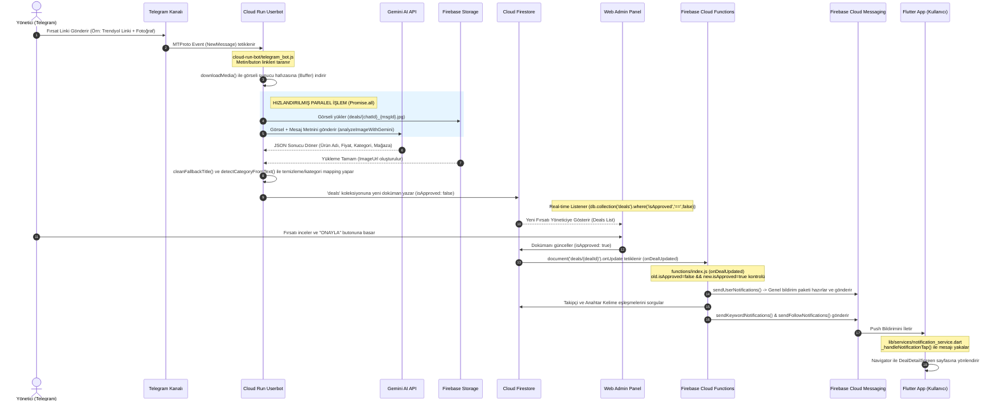
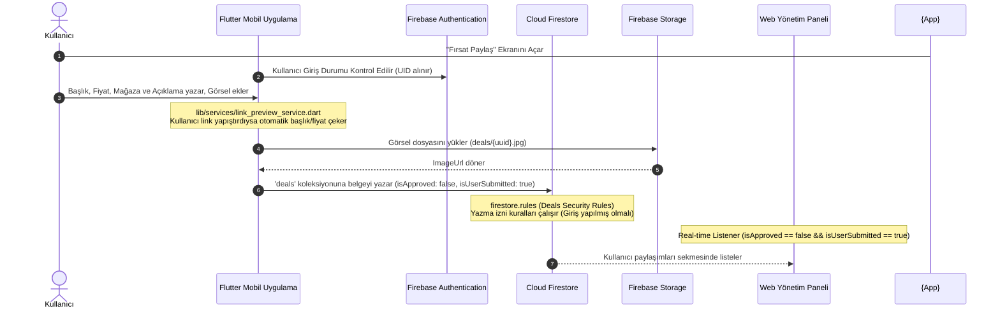
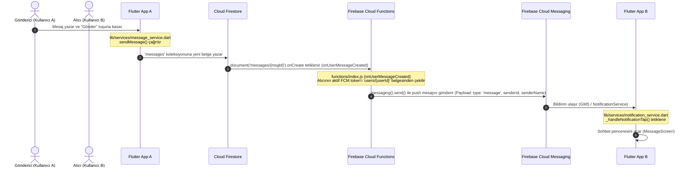
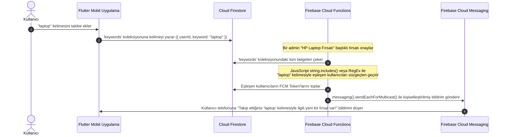

# 🏗️ FırsatKolik — Sistem Mimarisi ve Teknik Veri Akışları (System Architecture & Flows)

Bu doküman, FırsatKolik platformunun (Telegram Userbot, Gemini Yapay Zeka Servisleri, Firebase Altyapısı, Web Yönetim Paneli ve Flutter Mobil Uygulaması) uçtan uca teknik mimarisini, veri modellerini, iletişim protokollerini ve barındırma ortamlarını detaylandırmak amacıyla hazırlanmıştır.

---

## 🗺️ GENEL SİSTEM MİMARİSİ (TOPOLOGY)

Aşağıdaki şemada, sistemin tüm bileşenlerinin birbiriyle nasıl haberleştiği, hangi servislerin nerede barındırıldığı ve veri akış yönleri görselleştirilmiştir.

```mermaid
graph TD
    %% Bileşenler ve Barındırma Ortamları
    subgraph Telegram_Network [Telegram Ağı]
        Channels["Telegram Kanalları<br>(@firsatkolik_canli / @indirimkaplani)"]
    end

    subgraph Google_Cloud_Platform [Google Cloud Platform (GCP)]
        subgraph Compute_Engine_VM [GCP Compute Engine VM (e2-micro)]
            Bot["Telegram Userbot Container<br>(Node.js / GramJS / Always-on Docker)"]
        end
        subgraph Secret_Manager [Google Secret Manager]
            Secrets["API Anahtarları & Session String<br>(GEMINI_API_KEY, TELEGRAM_STRING_SESSION)"]
        end
        subgraph Gemini_API [Google Generative AI]
            Gemini["Gemini-2.5 / 2.0 Flash API<br>(Fırsat Analizi / Görsel & Metin Okuma)"]
        end
    end

    subgraph Firebase_Suite [Firebase Ecosystem]
        subgraph Firestore_DB [Cloud Firestore - Real-time DB]
            DealsCol["'deals' Koleksiyonu<br>(Fırsatlar)"]
            UsersCol["'users' Koleksiyonu<br>(FCM Tokenlar & Tercihler)"]
            KeywordsCol["'keywords' Koleksiyonu<br>(Takip Edilen Kelimeler)"]
        end
        subgraph Fire_Storage [Firebase Storage]
            Images["Fırsat Görselleri Bucket<br>(deals/ klasörü)"]
        end
        subgraph Fire_Hosting [Firebase Hosting]
            AdminPanel["Web Yönetim Paneli<br>(HTML / Vanilla JS)"]
        end
        subgraph Cloud_Functions [Firebase Cloud Functions]
            OnDealUpdated["onDealUpdated Trigger<br>(Onay & Bildirim Motoru)"]
            OnUserMsg["onUserMessageCreated Trigger<br>(Sohbet Bildirimi)"]
            ShortLinkFunc["resolveShortLink HTTP Trigger<br>(Affiliate Link Çözücü)"]
        end
    end

    subgraph Client_Devices [Son Kullanıcı Cihazları]
        MobileApp["FırsatKolik Flutter App<br>(Android / iOS Client)"]
        GMS["Google Play Services (GMS)<br>(FCM Push Gateway)"]
    end

    %% İletişim Akışları (Veri Yolları)
    Channels -->|MTProto Protokolü - Canlı Akış| Bot
    Secrets -.->|GCP IAM Güvenli Bağlantı| Bot
    Bot -->|Görsel/Metin Analiz İstekleri - JSON| Gemini
    Bot -->|Görsel JPEG Yükleme| Images
    Bot -->|Fırsat Belgesi Ekleme (isApproved: false)| DealsCol

    AdminPanel -->|Okuma (Gerçek Zamanlı Dinleyici - snapshots)| DealsCol
    AdminPanel -->|Yazma (isApproved: true)| DealsCol

    DealsCol -->|Firestore onCreate / onUpdate Triggers| Cloud_Functions
    Cloud_Functions -->|Kullanıcı Filtreleme & Arama| UsersCol
    Cloud_Functions -->|Anahtar Kelime Eşleştirme| KeywordsCol
    
    Cloud_Functions -->|FCM Push Gönderimi| GMS
    GMS -->|Sistem Düzeyinde Bildirim Teslimatı| MobileApp
    MobileApp -->|Firestore Okuma/Yazma| Firestore_DB
```

---

## 🔗 MANUEL YÖNETİM VE DENETLEME DİZİNİ (LINKS)

Sistem mimarisindeki bileşenlerin çalışma durumlarını, loglarını ve konfigürasyonlarını manuel olarak incelemek için aşağıdaki bağlantıları kullanabilirsiniz:

### 1. Firebase Konsolları (Veritabanı, Depolama, Bulut Fonksiyonları)
*   **DEV Firebase Konsolu:** [sicak-firsatlar-e6eae](https://console.firebase.google.com/project/sicak-firsatlar-e6eae)
    *   Firestore Verileri: [Firestore Viewer (DEV)](https://console.firebase.google.com/project/sicak-firsatlar-e6eae/firestore)
    *   Cloud Functions Logları: [Functions Logs (DEV)](https://console.firebase.google.com/project/sicak-firsatlar-e6eae/functions)
    *   Fırsat Görselleri: [Storage Viewer (DEV)](https://console.firebase.google.com/project/sicak-firsatlar-e6eae/storage)
*   **PROD Firebase Konsolu:** [firsatkolik-prod-e6eae](https://console.firebase.google.com/project/firsatkolik-prod-e6eae)
    *   Firestore Verileri: [Firestore Viewer (PROD)](https://console.firebase.google.com/project/firsatkolik-prod-e6eae/firestore)
    *   Cloud Functions Logları: [Functions Logs (PROD)](https://console.firebase.google.com/project/firsatkolik-prod-e6eae/functions)
    *   Fırsat Görselleri: [Storage Viewer (PROD)](https://console.firebase.google.com/project/firsatkolik-prod-e6eae/storage)

### 2. Google Cloud Konsolları (Telegram Botu & Güvenli Anahtarlar)
*   **GCP DEV Cloud Run Bot:** [Cloud Run Console (DEV)](https://console.cloud.google.com/run/detail/us-central1/telegram-bot/metrics?project=sicak-firsatlar-e6eae)
*   **GCP PROD Cloud Run Bot:** [Cloud Run Console (PROD)](https://console.cloud.google.com/run/detail/us-central1/telegram-bot/metrics?project=firsatkolik-prod-e6eae)
*   **GCP Secret Manager (PROD API Anahtarları):** [Secret Manager (PROD)](https://console.cloud.google.com/security/secret-manager?project=firsatkolik-prod-e6eae)

### 3. Web Yönetim (Admin) Panelleri
*   **DEV Admin Arayüzü:** [https://sicak-firsatlar-e6eae.web.app/admin/](https://sicak-firsatlar-e6eae.web.app/admin/)
*   **PROD Admin Arayüzü:** [https://firsatkolik-prod-e6eae.web.app/admin/](https://firsatkolik-prod-e6eae.web.app/admin/)

---

## ⚡ UÇTAN UCA TEKNİK İŞLEMCİ VE VERİ AKIŞLARI (DATA FLOWS)

### 1. Akış A: Telegram Link Paylaşımından Bildirim Gönderimine Kadar Yönetici Paneli Akışı
Bu senaryoda, yöneticinin Telegram kanalına attığı bir linkin yakalanıp yapay zekayla işlenmesi, onaylanması ve tüm kullanıcılara push bildirimi olarak gönderilmesi süreçleri adım adım işletilmektedir:



#### Teknik Detaylar (Kod Seviyesi):
1.  **7/24 Çalışma Altyapısı (Google Cloud Run):**
    *   Bot, Dockerize edilmiş bir Node.js uygulamasıdır ([Dockerfile](file:///d:/firsatkolik/cloud-run-bot/Dockerfile)).
    *   Cloud Run üzerinde `--no-cpu-throttling` (CPU her zaman açık) ve `--min-instances 1` `--max-instances 1` konfigürasyonuyla çalışır. Bu sayede HTTP isteği almasa dahi arka planda Telegram sunucularıyla kurduğu canlı soket (MTProto) bağlantısı kesilmez.
2.  **Mesaj Yakalama ve Doğrulama ([telegram_bot.js:L872](file:///d:/firsatkolik/cloud-run-bot/telegram_bot.js#L872)):**
    *   `GramJS` kütüphanesi kullanılarak Telegram oturumu `StringSession` aracılığıyla açılır (Session string'i Google Secret Manager'dan güvenli bir şekilde çekilir).
    *   `client.addEventHandler` ile belirtilen kanallardan gelen yeni mesajlar anlık yakalanır. Mesajda en az bir adet link (`getAllLinks`) yoksa işlem iptal edilir.
3.  **Hızlı Paralel İşlem Yapısı ([telegram_bot.js:L712](file:///d:/firsatkolik/cloud-run-bot/telegram_bot.js#L712)):**
    *   Sunucunun yanıt hızını artırmak ve veritabanı yazma süresini en aza indirmek için **Firebase Storage'a görsel yükleme** işlem ile **Gemini Vision modeline görsel analiz isteği gönderme** işlemi `Promise.all` yapısıyla asenkron olarak paralel koşturulur.
4.  **Gemini AI Analizi ve Normalizasyon ([telegram_bot.js:L160](file:///d:/firsatkolik/cloud-run-bot/telegram_bot.js#L160)):**
    *   Gemini API'sine (`gemini-1.5-flash`) görsel ve metin verilerek çıktının kesinlikle JSON formatında (`responseSchema`) dönmesi zorlanır.
    *   Yapay zekanın döndürdüğü kategori metni (`Kozmetik & Bakım` vb.) sistemin veri şemasındaki kategori ID'si ile (`kozmetik`) otomatik eşleştirilir (`categoryMap`).
5.  **Veritabanı Şeması ([telegram_bot.js:L821](file:///d:/firsatkolik/cloud-run-bot/telegram_bot.js#L821)):**
    *   Oluşturulan doküman Firestore'a `deals` koleksiyonuna şu ID formatı ile kaydedilir: `telegram_{chatInfo.id}_{messageId}`. Bu ID formatı, aynı Telegram mesajının mükerrer (duplicate) olarak tekrar kaydedilmesini engeller.
    *   Belgenin `isApproved` alanı `false` olarak ayarlanır.
6.  **Web Onay Mekanizması ([web/admin/app.js](file:///d:/firsatkolik/web/admin/app.js)):**
    *   Yönetici paneli Firestore real-time listener kullanarak onay bekleyen fırsatları anlık ekranda listeler.
    *   Yönetici "Onayla" dediğinde, Firestore belgesindeki `isApproved` alanı `true` olarak güncellenir.
7.  **Cloud Functions Tetiklenmesi & Bildirim Dağıtımı ([functions/index.js:L686](file:///d:/firsatkolik/functions/index.js#L686)):**
    *   `exports.onDealUpdated` tetikleyicisi çalışır.
    *   Eğer fırsat onaylandıysa `sendUserNotifications` metodu çağrılır ve `messaging().send()` aracılığıyla tüm cihazlara `general_deals` FCM başlığı (topic) üzerinden bildirim basılır.
    *   Aynı anda `sendKeywordNotifications` metodu çalışarak, fırsat başlığındaki kelimeleri takip eden (`keywords` koleksiyonundaki) kullanıcıların bireysel FCM token'larına kişiselleştirilmiş anlık push bildirimi gönderilir.

---

### 2. Akış B: Kullanıcıların Mobil Uygulama Üzerinden Fırsat Paylaşması Akışı
Kullanıcıların mobil uygulama içerisinden "Fırsat Paylaş" butonunu kullanarak topluluğa fırsat sunması akışıdır:



#### Teknik Detaylar (Kod Seviyesi):
1.  **Link Önizleme ve Otomatik Doldurma ([link_preview_service.dart](file:///d:/firsatkolik/lib/services/link_preview_service.dart)):**
    *   Kullanıcı fırsat linkini yapıştırdığında, uygulama arka planda `LinkPreviewService`'i çalıştırır. Servis, hedeflenen web sayfasının HTML içeriğini çeker (`http.get`) ve OpenGraph meta etiketlerini (`og:title`, `og:image`, `og:description`) veya HTML etiketlerini parse ederek başlık, görsel ve fiyat alanlarını otomatik doldurur.
2.  **Veritabanı Güvenlik Kuralları ([firestore.rules](file:///d:/firsatkolik/firestore.rules)):**
    *   Mobil uygulamadan Firestore'a yapılan doğrudan yazma istekleri güvenlik kuralları tarafından denetlenir. Bir kullanıcının fırsat paylaşabilmesi için `request.auth != null` (giriş yapmış olması) ve oluşturduğu belgedeki `postedBy` alanının kendi `auth.uid` değeriyle eşleşmesi zorunludur.
    *   Yazılan belgede `isApproved` alanının varsayılan olarak kesinlikle `false` olması güvenlik kurallarıyla doğrulanır.

---

### 3. Akış C: Kullanıcılar Arası Gerçek Zamanlı Sohbet (Mesajlaşma) Akışı
İki kullanıcının uygulama içerisinde birbirine mesaj atması ve bu mesajların anlık olarak teslim edilerek push bildirimi gönderilmesi akışıdır:



#### Teknik Detaylar (Kod Seviyesi):
1.  **Mesaj Gönderme ([message_service.dart:L14](file:///d:/firsatkolik/lib/services/message_service.dart#L14)):**
    *   Mesaj nesnesi alıcı adı, gönderici adı, içerik ve `isRead: false` bayrağı ile Firestore'a eklenir.
2.  **Sohbet Bildirimi Fonksiyonu ([functions/index.js:L908](file:///d:/firsatkolik/functions/index.js#L908)):**
    *   Cloud Functions `onUserMessageCreated` tetikleyicisi Firestore'a yazılan her mesajı dinler.
    *   Alıcı kullanıcının `users` koleksiyonundaki dokümanına giderek güncel `fcmToken` değerini okur.
    *   Eğer alıcı aktif olarak sohbet ekranında değilse (veya uygulama kapalıysa), FCM üzerinden veri (data) öncelikli push bildirimi yollar.
3.  **Yerel Yönlendirme ve Bildirim Yakalama ([notification_service.dart:L1238](file:///d:/firsatkolik/lib/services/notification_service.dart#L1238)):**
    *   Mobil uygulamadaki `NotificationService`, gelen push bildiriminin veri paketini (payload) inceler.
    *   Eğer bildirim `type == 'message'` tipindeyse ve `senderId` doluysa, `_navigateToChat(senderId, senderName)` metodu çağrılarak kullanıcının doğrudan o kişiyle olan `MessageScreen` sohbet arayüzüne geçmesi sağlanır.

---

### 4. Akış D: Anahtar Kelime Takip (Keyword Alerts) Akışı
Kullanıcıların belirli kelimeleri (örneğin "laptop", "PlayStation") takibe alarak, bu kelimelerle eşleşen bir fırsat onaylandığında anında kişiselleştirilmiş bildirim alması akışıdır:



#### Teknik Detaylar (Kod Seviyesi):
1.  **Eşleştirme Algoritması ([functions/index.js:L701](file:///d:/firsatkolik/functions/index.js#L701)):**
    *   Cloud Functions içindeki `sendKeywordNotifications` fonksiyonu, onaylanan fırsatın başlığını ve açıklamasını küçük harfe çevirir.
    *   Firestore'daki tüm `keywords` koleksiyonu taranarak kullanıcının kaydettiği kelimelerle eşleşme sorgulanır.
    *   Algoritma, Türkçe karakter duyarlılığını çözmek için kelimeleri normalize ederek (`ı->i`, `ş->s` vb.) karşılaştırır.
2.  **Kişiselleştirilmiş Bildirim Gönderimi:**
    *   Genel bildirimler gibi tek bir kanala (topic) yayın yapmak yerine, her bir eşleşen kullanıcının FCM token listesi toplanır ve `sendEachForMulticast` (veya toplu gönderim paketi) kullanılarak yalnızca o kelimeyi takip eden hedeflenmiş cihazlara bildirim ulaştırılır.
