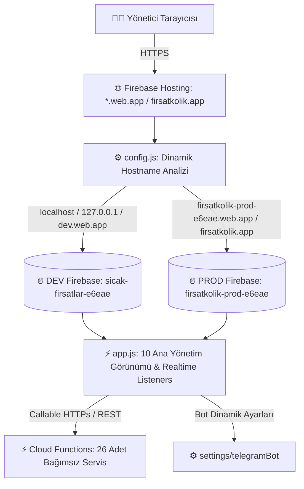

# 💻 FırsatKolik — Web Admin Paneli Kapsamlı Mimari ve Operasyon Rehberi

> [!NOTE]
> Bu doküman 10 modüllü Web Admin Paneli mimari ve operasyonel kılavuzudur. Sistemin uçtan uca mimarisi, gösterim algoritmaları, gamification, mesajlaşma ve moderasyon entegrasyonu için lütfen **[Sistem Mimarisi, Yaşam Döngüsü ve Sosyal Etkileşim Master Rehberi](file:///d:/firsatkolik/documentation/mimari-ve-sistem/mimari_ve_sistem_rehberi.md)** dokümanını inceleyiniz.

Bu doküman, FırsatKolik platformunun yönetim merkezi olan **Web Admin Paneli**'nin (`web/admin/` dizini altındaki `index.html`, `app.js`, `config.js` ve `styles.css`) mimarisini, yetkilendirme modellerini, gerçek zamanlı veri akışlarını, 10 temel yönetim görünümünü ve tüm operasyonel fonksiyonlarını detaylı bir şekilde açıklamaktadır.

---

## 🏗️ 1. Genel Mimari ve Barındırma Modeli

Web Admin Paneli, harici ağır frontend framework'lerine (React, Vue, Angular vb.) bağımlı olmadan saf **Vanilla HTML5, CSS3 ve Modern JavaScript (ES6+)** ile geliştirilmiş, ultra hafif ve yüksek performanslı bir tek sayfa uygulamasıdır (SPA).



### Temel Özellikler:
* **Sıfır Derleme (Zero Build):** Web klasöründeki kodlar herhangi bir derleme (`npm run build` vb.) işlemine ihtiyaç duymaz. Doğrudan tarayıcıda çalışır.
* **Dinamik Çevre Seçimi (`config.js`):** Tarayıcının çalıştığı `window.location.hostname` değerine bakarak hangi Firebase projesine bağlanacağını (`sicak-firsatlar-e6eae` vs `firsatkolik-prod-e6eae`) çalışma anında (runtime) otomatik tayin eder.
* **Sıfır Sızıntı (Zero-Leakage) İzolasyonu:** Tüm 10 yönetim modülü tek bir merkezi `firebase.firestore()` örneği (`db`) üzerinden sorgulama yapar. Panelde hiçbir statik/hardcoded proje ID bulunmaz; böylece DEV test verileri asla PROD canlı veritabanına karışmaz.
* **Gerçek Zamanlı (Realtime) Senkronizasyon:** Fırsatlar, mesajlar, raporlar ve sistem logları Firestore'un `onSnapshot` stream dinleyicileriyle sayfayı yenilemeden (F5 gerekmeden) canlı güncellenir.
* **Kapsamlı Rol Doğrulaması:** Firebase Auth ile giriş yapan kullanıcının `users/{uid}` belgesindeki `isAdmin: true` yetkisi doğrulanmadan panel arayüzü render edilmez.

---

## 🔐 2. Kimlik Doğrulama ve Admin Güvenlik Katmanı

Yönetici panele erişmek istediğinde süreç şu güvenlik kontrollerinden geçer:

1. **`initAuth()` & `checkAdminAndLoad()`:**
   - Firebase Auth durumunu dinler (`auth.onAuthStateChanged`).
   - Kullanıcı giriş yapmamışsa şık giriş modalı (`#loginScreen`) gösterilir.
2. **Admin Yetki Kontrolü (`checkAdmin(user)`):**
   - Kullanıcının Firestore `users/{uid}` belgesi çekilir.
   - `isAdmin === true || isadmin === true || isAdmin === 'true'` kontrolleri yapılır.
   - Yetkisiz bir kullanıcı giriş yaparsa oturum otomatik kapatılır ve yetkisiz erişim uyarısı verilir.
3. **Çevre Rozeti & Yerel Ortam Değiştirici (`initEnvironmentBadge()`):**
   - Uzak sunucularda sol menünün üstünde çalışılan ortamı belirten dinamik bir rozet gösterilir (`🟢 DEV ORTAMI` veya `🔴 PROD (CANLI)`).
   - Yerel testte (`localhost` / `127.0.0.1`), rozet otomatik olarak bir `<select id="envSwitcher">` açılır listesine dönüşür. Yönetici tek tıkla `DEV ⚙️` veya `PROD 🚀` projeleri arasında geçiş yapabilir; tercih `localStorage.getItem('firebase_env')` anahtarında saklanır.

---

## 📊 3. Web Admin Panelinin 10 Temel Görünümü

Panel, sol navigasyon menüsü üzerinden 10 bağımsız modüle ayrılmıştır:

```
Web Admin Paneli
├── 1. 📊 Dashboard Görünümü (Genel İstatistikler & Sistem Sağlığı)
├── 2. 🏷️ Fırsatlar Görünümü (Onay, Red, Düzenleme & Affiliate)
├── 3. 👥 Kullanıcılar Görünümü (Profil İnceleme, Ceza & Mesaj)
├── 4. 💬 Mesajlar & Simülatör (Canlı Sohbet & Test Motoru)
├── 5. 🚩 Şikayetler & Raporlar (İçerik Moderasyon Kuyruğu)
├── 6. ⚙️ Sistem & Bot Ayarları (Bot Kanalları, Şalterler & Temizlik)
├── 7. 🔔 Bildirimler Merkezi (Cihaz İstatistikleri & Manuel Push)
├── 8. 📜 Sistem Logları (Hata Kayıtları & systemErrors)
├── 9. 🎟️ Kuponlar Yönetimi (Manuel Ekleme & Otomatik Kazıma)
└── 10. 📰 Aktüel Kataloglar (Broşür İnceleme & Kazıma)
```

---

### 1. 📊 Dashboard Görünümü (`showDashboardView` / `loadDashboardData`)
* **6 Temel Sütunlu Bento Grid Mimarisi:**
  - **1. Fırsat Havuzu:** Toplam fırsat sayısı, bugün eklenenler, onay bekleyenler rozeti ve ortalama onay süresi.
  - **2. İndirim Kuponları:** Toplam kupon sayısı, aktif kuponlar ve bugün eklenen kuponlar (Topluluk vs Botkolik Radarı).
  - **3. Aktüel Afiş ve Kataloglar:** Toplam katalog sayısı, aktif/geçerli kataloglar ve 36 mağaza taksonomisi.
  - **4. Topluluk & Avcılar:** Toplam kayıtlı üye, bugün katılanlar, bugün yapılan yorumlar ve 16+ Avcı Rozeti & gamification.
  - **5. Bildirim & Cihazlar:** Aktif FCM cihaz sayısı, Android/iOS dağılımı ve bugün iletilen push sayısı.
  - **6. Moderasyon & Sistem Radarı:** İncelenmeyi bekleyen kullanıcı şikayetleri (`reports`) ve açık sistem hataları (`systemErrors`).
* **3 Katmanlı Operasyonel Sistem Sağlık Merkezi:**
  - **Telegram Scraping Bot:** Son kalp atışı (`lastHeartbeatAt`), bot çevrimiçi durumu, fırsat, mükerrer, hata ve mesaj istatistikleri.
  - **Gemini AI Flash Motoru:** Günlük istek sayısı, JSON/servis hataları, maliyet ve aktif model (`Gemini 2.5/2.0 Flash`).
  - **Push Engine & Hız Limitleri:** Canlı durum rozeti, kategori saatlik/günlük hız sınırları ve son 7 günlük gönderim hacmi.
* **Grafiksel ve Aksiyon Odaklı Analiz:**
  - **7 Günlük Fırsat Dağılımı Çubuk Grafiği (`dealsTrendChart`)** ve **13 Kategori Dağılımı Halka Grafiği (`categoriesDistributionChart`)**.
  - **Hızlı Onay Bekleyen Fırsatlar Kuyruğu (`dashPendingDealsBody`):** Doğrudan panel üzerinden "İncele" butonuyla düzenleme/onaylama modalı açma.
  - **Avcı Liderlik Tablosu (`dashLeaderboardBody`):** Madalyalar (🥇, 🥈, 🥉), avatarlar ve puanlarla en aktif avcılar.
  - **En Sıcak Fırsatlar (`dashTopLikesBody`):** Sıcaklık derecesiyle (°C) öne çıkan fırsatlar.
* **Ortam Uyumluluğu:** Dinamik `#dashEnvBadge` göstergesi (DEV: `sicak-firsatlar-e6eae` vs PROD: `firsatkolik-prod-e6eae`).

---

### 2. 🏷️ Fırsatlar Görünümü (`showDealsView`)
* **Filtreleme & Arama:** Onay Durumu (`Tümü`, `Onay Bekleyenler`, `Onaylananlar`, `Süresi Dolanlar`), Kategori seçicisi ve Anlık Arama.
* **Fırsat Satırı (`createDealRow`):**
  - **Detay & Görsel:** Ürün görseli, başlık, mağaza, marka, Amazon Depo rozeti, değerlendirme puanı (`ratingValue` & `ratingCount`).
  - **Kaynak Rozeti:** Bot paylaşımı (`smart_toy` + bot/kanal adı) veya kullanıcı paylaşımı (`person` + kullanıcı rumuzu/adı).
  - **Fiyat & İndirim:** İndirimli fiyat, liste fiyatı (`originalPrice`), % indirim oranı veya "Fiyat Gizli" rozeti.
  - **Tarih & Zaman Damgası:** Çift katmanlı zaman damgası (Üstte: `schedule` ikonu ile `15 Dakika Önce` / `2 Saat Önce` gibi göreceli süre; Altta: `24.08.2026 22:15` gibi tam tarih/saat damgası).
  - **Durum:** Aktif, Bekliyor, Reddedildi veya Süresi Doldu rozeti.
* **Aksiyonlar:**
  - **Onaylama (`approveDeal`):** Fırsatın `isApproved` alanını `true`, `isRejected` alanını `false`, `isExpired` alanını `false` ve `status` alanını `'active'` yapar; `approvedAt` zaman damgasını günceller. Mobil istemci feed akışları ve Cloud Functions `onDealUpdated` ile %100 senkronize çalışır.
  - **Reddetme / İptal (`rejectDeal` / `handleCancelDeal`):** Fırsatın `isRejected: true`, `isApproved: false`, `isExpired: true`, `status: 'rejected'` yapar; feed ve arama akışlarından derhal kaldırır.
  - **Düzenleme Modalı (`showDealModal` / `saveDealChanges`):** Fiyat, başlık, açıklama, kategori, alt kategori, orijinal fiyat, marka, rating puanı, görseller ve oluşturulma/güncellenme zaman damgalarını (`formatFullDateTime` + `getTimeAgo`) tarayıcıdan düzenleyip kaydeder.
  - **Görsel Büyütme Lightbox (`openImageLightbox`):** Fırsat görsellerini tam çözünürlükte modal içinde inceler.
  - **Manuel Fırsat Ekleme (`showAddDealModal`):** Yöneticinin doğrudan panelden yeni fırsat yayınlamasını sağlar.

---

### 3. 👥 Kullanıcılar Görünümü (`showUsersView`)
* **Kullanıcı Listeleme (`loadUsers` / `renderUsers`):** Kayıtlı kullanıcıların avatarı, kullanıcı adı, e-postası, toplam paylaştığı fırsat sayısı, toplam beğenisi, sahip olduğu rozetler (`Rozetler` sütunu + vitrin rozeti hapı), takip ve kategori istatistikleri.
* **Rozet Bazlı Arama:** Arama kutusu kullanıcı adı/e-posta haricinde rozet ID ve Türkçe isimlerini (`verified`, `Usta Avcı`, `first_spark` vb.) de filtreler.
* **Kullanıcı Detay Modalı (`showUserDetail`):**
  - **Rozet Yönetimi (`BADGE_CATALOG`):**
    - Kullanıcının sahip olduğu tüm rozetleri ikon, Türkçe isim, kademe etiketi (`[Bronz]`, `[Gümüş]`, `[Altın]`, `[Elmas]`, `[Özel]`) ve vitrin durumuyla (`⭐ Vitrin`) listeleme.
    - **Vitrinde Göster / Kaldır (`togglePinBadge`):** Kullanıcının profil ve yorumlarda öne çıkacak unvan rozetini tek tıkla sabitleme/kaldırma.
    - **Rozeti Kaldır (`removeBadge`):** Kullanıcıdan rozeti onay kutusuyla güvenli silme.
    - **Katalogdan Rozet Ekle (`addBadgeFromCatalog`):** 16+ resmi katalog rozetini (Fırsat Avcılığı, Sıcaklık, Topluluk, Sadakat) kategorize açılır menüden seçip anında atama.
    - **Özel Rozet Ekle (`addBadge`):** Özel promosyon veya manuel rozet kimliğini girip atama.
    - **Otomatik Rozet Eşitleme (`autoAwardBadgesForUser`):** Kullanıcının mevcut puan, fırsat ve beğeni istatistiklerini hesaplayarak hak ettiği tüm rozetleri tek tıkla topluca verme.
  - **Özel Admin Mesajı Gönderme:** Kullanıcıya doğrudan `adminToUserMessages` koleksiyonu üzerinden resmi sistem mesajı gönderme.
  - **Yetki ve Engelleme:** Admin yetkisi verme/kaldırma, genel engelleme (`blockUser`), paylaşım engeli (`toggleDealBan`) ve yorum engeli (`toggleCommentBan`).

---

### 4. 💬 Mesajlar & Simülatör Görünümü (`showMessagesView`)
* **Mesajlaşma Simülatörü (`initMessagingSimulator`):**
  - Geliştiricinin veya yöneticinin seçilen herhangi iki kullanıcı arasında sanal sohbet başlatmasını ve mesajlaşma akışını test etmesini sağlar.
* **Canlı Sohbet Akışı (`startLiveChatStream` / `renderLiveChatMessages`):**
  - Firestore `messages` koleksiyonunu gerçek zamanlı dinler ve kullanıcılar arasındaki mesaj trafiğini denetler.
* **Botkolik Sohbet Akışı (`startBotkolikChatStream`):**
  - Kullanıcıların yapay zeka asistanı Botkolik ile olan mesajlaşma kayıtlarını görüntüler.
* **Moderasyon Mesajları (`loadModerationMessages`):**
  - Küfür veya uygunsuz içerik tespit edildiğinde Cloud Functions tarafından üretilen sistem alarmlarını listeler.

---

### 5. 🚩 Şikayetler & Raporlar Görünümü (`showReportsView`)
* **Şikayet Havuzu (`loadReports` / `renderReports`):**
  - Kullanıcıların mobil uygulama içinden oluşturduğu (`ReportService`) fırsat, yorum ve kullanıcı şikayetlerini listeler.
* **Rapor Detayları:** Şikayet eden kullanıcı, şikayet edilen içerik, şikayet nedeni (`Spam`, `Yanıltıcı Fiyat`, `Uygunsuz İçerik`, `Stok Bitti`, `Diğer`), açıklama ve oluşturulma tarihi.
* **Moderasyon Aksiyonları:**
  - İlgili fırsat/yorum içeriğini tek tıkla silme.
  - Şikayeti `reviewed` (incelendi) veya `dismissed` (reddedildi) olarak işaretleme.

---

### 6. ⚙️ Sistem & Bot Ayarları Görünümü (`showSettingsView`)
* **Telegram Botu Yapılandırması (`loadBotConfig` / `saveBotConfig`):**
  - **Dinamik Kanal Yönetimi (`monitoredChannels`):** Botun dinlediği Telegram kanallarını (örn: `@indirimkaplani`, `@firsatkolik_canli`) sunucuyu yeniden başlatmadan (zero-restart) canlı ekleme ve çıkarma.
  - **Bot Durum Şalteri (`toggleBotStatus`):** Botun yeni fırsat kaydetmesini tek tıkla durdurma veya başlatma.
* **Global Sistem Şalterleri:**
  - **Fırsat Paylaşımı Şalteri (`toggleDealSharing`):** Mobil uygulamadaki "Fırsat Paylaş" formunu tüm kullanıcılara kapatma/açma (`systemConfig/dealSharing`).
  - **Yorum Paylaşımı Şalteri (`toggleCommentSharing`):** Yorum yazma özelliğini anlık durdurma (`systemConfig/commentSharing`).
  - **Kuponlar Modülü Şalteri (`toggleCouponsEnabled`):** Mobil kuponlar sekmesini kapatma/açma.
  - **Botkolik Sohbet Şalteri (`toggleBotkolikChat`):** Yapay zeka sohbet modülünü kapatma/açma.
  - **Global Bildirim Şalteri (`toggleGlobalNotifications`):** Tüm push bildirim iletimini tek şalterle durdurma (`systemConfig/notifications.enabled`).
* **Veritabanı Bakım ve Toplu Temizlik:**
  - **30+ Günlük Fırsat ve Bildirim Temizliği (`purgeOldDealsWeb`):** 30 günden eski fırsatları, oyları, yorumları, Storage görsellerini ve **tüm kullanıcılardaki 30+ günlük eski bildirimleri (`collectionGroup('notifications')`)** kalıcı olarak temizler. İlk olarak sunucu tarafındaki `purgeOldDealsManual` Cloud Function'ını çağırarak Admin SDK yetkisiyle anında siler; olası bağlantı sorununda doğrudan Firestore istemcisi üzerinden yedek silme mekanizmasını çalıştırır.

---

### 7. 🔔 Bildirimler Merkezi Görünümü (`showNotificationsView`)
* **Cihaz ve İzin İstatistikleri (`loadDeviceStats`):** Toplam kayıtlı cihaz sayısı, aktif cihazlar, Android/iOS dağılımı.
* **Genişletilmiş Bildirim Hız Limitleri & Anti-Spam Yönetimi (`loadNotificationConfig` / `saveNotificationLimits`):**
  - **Kategori Bildirim Limitleri:** Saatlik (`categoryHourlyLimit` - varsayılan: 3) ve Günlük (`categoryDailyLimit` - varsayılan: 8) kotalar.
  - **Yazar Bildirim Limitleri:** Takip edilen yazar/avcı paylaşımları için Saatlik (`authorHourlyLimit` - varsayılan: 4) ve Günlük (`authorDailyLimit` - varsayılan: 12) limitler.
  - **Anahtar Kelime Radar Limitleri:** Takip edilen anahtar kelime bildirimleri için Saatlik (`keywordHourlyLimit` - varsayılan: 6) ve Günlük (`keywordDailyLimit` - varsayılan: 18) limitler.
  - **Fırsat Burst Koruması & Tavanı:** Art arda fırlatılan fırsat bildirimleri arasına zorunlu bekleme süresi (Burst Cooldown - `dealMinIntervalSeconds` - varsayılan: 30sn) ve bir saatte tek bir cihaza gidebilecek maksimum fırsat sayısı (`dealMaxHourlyTotal` - varsayılan: 8).
  - **Viral Yorum & Spam Koruması:** Tek bir fırsatta 10 dakikada fırlatılabilecek maksimum yorum bildirimi (`commentDealTenMinLimit` - varsayılan: 5) ve bir kullanıcının saatte alabileceği toplam yorum bildirimi (`commentHourlyLimit` - varsayılan: 10).
  - **Pazarlama / Kampanya Limiti:** Kullanıcılara bir günde iletilebilecek maksimum pazarlama bildirimi (`marketingDailyLimit` - varsayılan: 2).
  - **Acil Durum Bildirim Şalteri (`toggleGlobalNotifications`):** Tüm sistemi tek tıkla durduran acil durum güvenlik kilidi (`systemConfig/notifications.enabled`).
* **Manuel Push Gönderimi (`sendManualNotification`):**
  - Hedef Kitle (`Tüm Kullanıcılar`, `Belirli Kategori`, `Belirli Kullanıcı UID`).
  - Bildirim Tipi (`Yönetici Duyurusu / Destek` ➔ `admin_message`, `Pazarlama / Kampanya` ➔ `marketing`).
  - Bildirim Başlığı, İçeriği, Yönlendirme Linki (Deep Link) girilerek güvenli ve sessiz saat kurallarına uyumlu manuel push gönderimi.
* **Geçersiz Token Temizliği (`cleanupInvalidTokens`):**
  - Uygulamayı silmiş veya token'ı düşmüş cihazların FCM token'larını tek tıkla temizler ve kota tasarrufu sağlar.
* **Canlı Bildirim Akışı ve Çift Yönlü Filtreleme:**
  - `collectionGroup('notifications')` üzerinden canlı akış; Durum Filtresi (`sent`, `skipped_*`, `disabled_*`, `failed`) ve Kanal/Tür Filtresi (`Yönetici`, `Kampanya`, `Topluluk`, `Yazar`, `Kategori`, `Anahtar Kelime`) ile kombine filtreleme.
* **Hibrit 7 Günlük Trend Grafiği:**
  - `notificationStats` dokümanları ile `collectionGroup('notifications')` canlı kayıtlarını birleştiren hibrit agregasyon motoruyla sıfır kayıp garantili trend çizimi.

---

### 8. 📜 Sistem Kontrol & Hata Logları Görünümü (`showLogsView` - Kibana / Datadog APM)
* **Uçtan Uca Hata Takip Havuzu (`loadSystemLogs` / `renderSystemLogs`):**
  - Firestore `systemErrors` koleksiyonunu dinleyen, platformun tüm bileşenlerinden (Flutter Mobil, Cloud Functions, Telegram Bot, Akakçe/Katalog kazıyıcıları, Kupon kazıyıcıları, AI servisleri ve Web Admin) gelen hataları tek merkezde toplayan modern yönetim arayüzü.
* **4 Bento Özet Metrik Kartı:**
  - **Bekleyen Hatalar (`logsStatUnresolved`):** Henüz çözülmemiş açık hataların sayısı.
  - **Kritik / Fatal Hatalar (`logsStatFatal`):** Acil müdahale gerektiren fatal seviyesindeki hatalar.
  - **Son 24 Saat (`logsStatToday`):** Son 24 saat içinde kaydedilen yeni hataların sayısı.
  - **En Sık Hata Veren (`logsStatTopCategory`):** En yüksek frekansa sahip sorunlu servis/kategori.
* **8 Yatay Segment Sekmeli Kategori Filtresi (`switchLogCategoryTab`):**
  - `Tümü`, `📱 Mobil Uygulama`, `🤖 Bot & Telegram`, `🛒 Mağaza / Kazıyıcılar`, `📰 Katalog & Kupon`, `🧠 Yapay Zeka / AI`, `🔔 Bildirimler`, `☁️ Cloud & Backend`, `💻 Web Admin`.
  - Her sekme üzerinde canlı hata sayacı badge'i yer alır.
* **Kibana / Datadog Referanslı Gelişmiş APM Araç Çubuğu:**
  - **👤 Kullanıcı Bazlı Hata Arama & Seçici (`logsUserDropdownBtn` / `logsUserDropdownPopover`):**
    - Açılır arama menüsü üzerinden kullanıcının adı, rumuzu, e-postası veya UID'si ile anlık arama (`logsUserSearchInput`).
    - Bir kullanıcı seçildiğinde tüm sistem hataları o kullanıcıya filtrelenir ve üstte **Aktif Kullanıcı Banner'ı** (`logsActiveUserBanner`) belirir.
    - Banner üzerinde kullanıcının avatarı, adı, UID'si ve toplam hata frekansı gösterilir.
    - **Tüm Geçmişte Ara (`deepSearchUserLogs`):** Eğer son 200 log arasında kullanıcının hatası bulunamazsa, Firestore üzerinde tek seferlik kota dostu `where('userId', '==', uid).limit(50)` hedefli geçmiş sorgusu çalıştırılır.
    - **Filtreyi Kaldır (`clearUserLogFilter`):** Tek tıkla kullanıcı filtresini kaldırır.
  - **⏱️ Zaman Aralığı Filtresi (`logsTimeRangeFilter`):** Kibana standartlarında `Tüm Zamanlar`, `Son 15 Dakika (Canlı)`, `Son 1 Saat`, `Son 24 Saat (Bugün)`, `Son 7 Gün`, `Son 30 Gün`.
  - **🌐 Platform / Cihaz Filtresi (`logsPlatformFilter`):** `Tüm Platformlar`, `🤖 Android`, `🍎 iOS`, `💻 Web İstemci / Admin`, `☁️ Cloud Functions`, `🤖 Telegram VM Bot`.
  - **Canlı Metin Arama (`logsSearchInput`):** Hata türü, mesaj, stack trace, mağaza adı veya UID'ye göre anlık metin filtreleme.
  - **Servis Seçici (`logsServiceFilter`):** Spesifik servis filtreleme.
  - **Önem Derecesi (`logsSeverityFilter`):** `Tümü`, `Bilgi (Info)`, `Uyarı (Warning)`, `Hata (Error)`, `Kritik (Fatal)`.
  - **Durum Seçici (`logsStatusFilter`):** `Bekleyenler (Unresolved)`, `Çözülenler (Resolved)`, `Tümü`.
  - **Ortam Seçici (`logsEnvironmentFilter`):** `Geçerli Ortam (DEV/PROD)`, `DEV Ortamı`, `PROD Ortamı`, `Tüm Ortamlar`.
  - **↺ Filtreleri Sıfırla (`resetAllLogFilters`):** Tek tıkla tüm arama, kullanıcı, platform ve zaman filtrelerini varsayılan ayarlara sıfırlar.
* **Kapsamlı Hata Detay Modalı (`logDetailModal` / `openLogDetailModal`):**
  - **Etkilenen Kullanıcı Kartı:** Hata bir kullanıcıya aitse kullanıcının UID'sini gösterir ve tek tıkla *"👤 Bu Kullanıcının Hatalarını Filtrele"* aksiyonu sunar.
  - Hata başlığı, önem derecesi ve ortam rozetleri, servis/kategori bilgileri.
  - İlk ve son oluşma zamanı, toplam tekrarlanma sayısı (`occurrenceCount`).
  - Hata mesajı ve metadata çipleri (Mağaza, kullanıcı ID, platform, URL vb.).
  - **Sözdizimi Renklendirmeli Stack Trace:** Koyu arka planlı terminal kutusu ve tek tıkla panoya kopyalama butonu (`logModalCopyStackBtn`).
  - **GCP Logging Derin Bağlantısı:** Google Cloud Logs Console üzerinde aynı zaman dilimi ve hata izini doğrudan sorgulama linki.
  - **Durum Değiştirme:** Modal içinden tek tıkla "Çözüldü İşaretle" veya "Yeniden Aç".
* **Toplu Aksiyonlar & Veri Bakımı:**
  - **Tümünü Çözüldü İşaretle (`resolveAllErrors`):** Listelenen tüm açık hataları tek tıkla çözüldü statüsüne geçirir.
  - **Eski Logları Temizle (`purgeOldSystemLogs`):** 30 günden eski veya çözülmüş logları 500'lük chunk batch ile temizler.
* **Kota Güvenliği & Sıfır Maliyet Güvencesi:**
  - Mobil istemcide 5 dakikalık bellek içi parmak izi tekilleştirmesi (de-duplication) ve cihaz başına saatte en fazla 5 hata yazma limiti.
  - Ağ kesintisi / offline hatalarının Firestore'a yazılması engellenmiştir.
  - Backend ve botlarda fingerprint bazlı tekrarlanma sayacı (`occurrenceCount`) ile gereksiz yazma operasyonları bloke edilir.

---

### 9. 🎟️ Kuponlar Yönetimi Görünümü (`showCouponsView`)
* **Hızlı Özet İstatistikleri:** Toplam Kupon, Topluluk Kuponları (`kaynakTipi == 'topluluk'`), Botkolik Radarı (`kaynakTipi == 'web'`), Aktif Kuponlar ve Geçersiz/Süresi Dolanlar.
* **Topluluk vs Botkolik Radarı Kaynak Ayrımı (`switchCouponSourceTab`):**
  - Üst çubukta 3 segmented sekme: `Tüm Kuponlar`, `👤 Topluluk Kuponları` ve `🤖 Botkolik Radarı`.
  - Tablo satırında kaynak rozeti (`👤 Topluluk` + `@paylasanRumuz` veya `🤖 Botkolik Radarı`).
* **Akıllı Filtreleme & Arama:**
  - Canlı Arama Çubuğu (Mağaza, başlık, kod, açıklama veya kullanıcı ara).
  - Mağaza Filtresi (Dinamik açılır menü).
  - Durum Filtresi (`Tümü`, `Aktifler`, `Geçersizler`, `Süresi Dolanlar`).
  - Sıralama Seçici (`En Yeni`, `En Yüksek Net Skor/Sıcaklık`, `Bitiş Tarihi`).
* **Satır İçi Aksiyonlar & Etkileşim:**
  - **Kodu Kopyala (`copyCouponCode`):** Tek tıkla kupon kodunu panoya kopyalama.
  - **Durum Değiştir (`toggleCouponStatus`):** Tek tıkla kuponu `aktif` veya `gecersiz` yapma.
  - **Kupon Ekleme & Düzenleme Modalı (`couponModal`):** `kaynakTipi`, `magazaAdi`, `baslik`, `aciklama`, `kuponKodu`, `bitisTarihi`, `durum` ve `paylasanKullaniciAdi` alanlarını eksiksiz yönetme.
  - **Tekil Kupon Silme (`deleteCoupon`):** Onay kutusuyla tekil silme.
  - **Radarı Tetikle (`scrapeCouponsManual`):** Otonom kazıma motorunu canlı tetikleme (Topluluk kuponlarına dokunmaz).
  - **Tüm Kuponları Temizleme (`deleteAllCoupons`):** 500'lük chunk batch ile veritabanını temizleme.

---

### 10. 📰 Aktüel Kataloglar Görünümü (`showCatalogsView`)
* **Hızlı Özet İstatistikleri:** Toplam Broşür, Şu An Yayında Olanlar, Gelecek Kampanyalar, Toplam Broşür Sayfası ve Aktif Mağaza Sayısı.
* **Filtreleme & Arama:**
  - Arama Çubuğu (Mağaza kodu veya katalog başlığı arama).
  - Mağaza Filtresi (Veritabanındaki aktif 33+ mağazayı dinamik listeleyen açılır menü).
  - Kampanya Durum Filtresi (`Tümü`, `Şu An Yayında`, `Yakında Başlayacak`, `Süresi Bitenler`).
* **Broşür Sayfalarını İnceleme Modalı (Lightbox Gallery - `catalogDetailModal`):**
  - Tablodan veya kapak görselinden tıklandığında tüm broşür sayfalarını (`sayfaResimleri`) tam ekran inceleme imkanı sunan galeri modalı.
  - Sayfa numaralandırması (`Sayfa 1 / 8`) ve yüksek çözünürlüklü "Tam Boyut" bağlantıları.
* **Tekil Katalog Yönetimi & Düzenleme:**
  - **Katalog Düzenle (`openEditCatalogModal` / `catalogEditModal`):** Mağaza kodu, başlık, başlangıç/bitiş tarihleri ve kapak URL'sini doğrudan Firestore üzerinde güncelleme.
  - **Manuel Katalog Ekle (`openAddCatalogModal`):** Yeni broşür oluşturma.
  - **Tekil Katalog Silme (`deleteSingleCatalog`):** Hatalı veya süresi geçmiş tekil bir kataloğu onay kutusuyla silme.
  - **Akakçe'den Kazı (`scrapeCatalogsManual`):** 36 mağazanın aktüel broşürlerini Akakçe'den 5 aşamalı WAF bypass hattıyla çekme.
  - **Tüm Katalogları Temizleme (`deleteAllCatalogs`):** 500'lük chunk batch ile tüm katalogları sıfırlama.

---

## 🚀 4. Dağıtım ve Yayınlama Yönergeleri

Web Admin Panelinde yapılan değişiklikleri canlıya almak için:

```bash
# DEV Hosting Ortamına Dağıtım
firebase use dev
firebase deploy --only hosting

# PROD (Canlı) Hosting Ortamına Dağıtım
firebase use prod
firebase deploy --only hosting
```

Yayınlanan admin adresleri:
* **DEV Admin:** `https://sicak-firsatlar-e6eae.web.app/admin/` (veya `http://localhost:5000/admin/`)
* **PROD Admin:** `https://firsatkolik-prod-e6eae.web.app/admin/` ve `https://firsatkolik.app/admin/`

---
*FırsatKolik Web Admin Paneli Mimari Kılavuzu — 2026*
