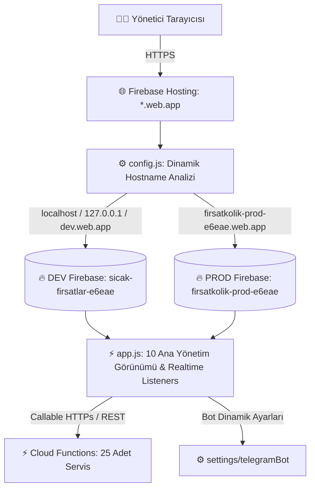

# 💻 FırsatKolik — Web Admin Paneli Kapsamlı Mimari ve Operasyon Rehberi

Bu doküman, FırsatKolik platformunun yönetim merkezi olan **Web Admin Paneli**'nin (`web/admin/` dizini altındaki `index.html`, `app.js`, `config.js` ve `styles.css`) mimarisini, yetkilendirme modellerini, gerçek zamanlı veri akışlarını, 10 temel yönetim görünümünü ve tüm operasyonel fonksiyonlarını detaylı bir şekilde açıklamaktadır.

---

## 🏗️ 1. Genel Mimari ve Barındırma Modeli

Web Admin Paneli, harici ağır frontend framework'lerine (React, Vue, Angular vb.) bağımlı olmadan saf **Vanilla HTML5, CSS3 ve Modern JavaScript (ES6+)** ile geliştirilmiş, ultra hafif ve yüksek performanslı bir tek sayfa uygulamasıdır (SPA).



### Temel Özellikler:
* **Sıfır Derleme (Zero Build):** Web klasöründeki kodlar herhangi bir derleme (`npm run build` vb.) işlemine ihtiyaç duymaz. Doğrudan tarayıcıda çalışır.
* **Dinamik Çevre Seçimi (`config.js`):** Tarayıcının çalıştığı `window.location.hostname` değerine bakarak hangi Firebase projesine bağlanacağını (`sicak-firsatlar-e6eae` vs `firsatkolik-prod-e6eae`) otomatik tayin eder.
* **Gerçek Zamanlı (Realtime) Senkronizasyon:** Fırsatlar, mesajlar, raporlar ve sistem logları Firestore'un `onSnapshot` stream dinleyicileriyle sayfayı yenilemeden (F5 gerekmeden) canlı güncellenir.
* **Kapsamlı Rol Doğrulaması:** Firebase Auth ile giriş yapan kullanıcının `users/{uid}` belgesindeki `isAdmin: true` yetkisi doğrulanmadan panel arayüzü render edilmez.

---

## 🔐 2. Kimlik Doğrulama ve Admin Güvenlik Katmanı

Yönetici panele erişmek istediğinde süreç şu güvenlik kontrollerinden geçer:

1. **`initAuth()` & `checkAdminAndLoad()`:**
   - Firebase Auth durumunu dinler (`auth.onAuthStateChanged`).
   - Kullanıcı giriş yapmamışsa şık giriş modalı (`#loginScreen`) gösterilir.
2. **Admin Yetki Kontrolü (`checkAdmin(user)`):**
   - Kullanıcının Firestore `users/{uid}` belgesi çekilir.
   - `isAdmin === true || isadmin === true || isAdmin === 'true'` kontrolleri yapılır.
   - Yetkisiz bir kullanıcı giriş yaparsa oturum otomatik kapatılır ve yetkisiz erişim uyarısı verilir.
3. **Çevre Rozeti (`initEnvironmentBadge()`):**
   - Sol menünün üstünde çalışılan ortamı belirten dinamik bir rozet gösterilir (`🟢 DEV ORTAMI` veya `🔴 PROD (CANLI)`).

---

## 📊 3. Web Admin Panelinin 10 Temel Görünümü

Panel, sol navigasyon menüsü üzerinden 10 bağımsız modüle ayrılmıştır:

```
Web Admin Paneli
├── 1. 📊 Dashboard Görünümü (Genel İstatistikler & Sistem Sağlığı)
├── 2. 🏷️ Fırsatlar Görünümü (Onay, Red, Düzenleme & Affiliate)
├── 3. 👥 Kullanıcılar Görünümü (Profil İnceleme, Ceza & Mesaj)
├── 4. 💬 Mesajlar & Simülatör (Canlı Sohbet & Test Motoru)
├── 5. 🚩 Şikayetler & Raporlar (İçerik Moderasyon Kuyruğu)
├── 6. ⚙️ Sistem & Bot Ayarları (Bot Kanalları, Şalterler & Temizlik)
├── 7. 🔔 Bildirimler Merkezi (Cihaz İstatistikleri & Manuel Push)
├── 8. 📜 Sistem Logları (Hata Kayıtları & systemErrors)
├── 9. 🎟️ Kuponlar Yönetimi (Manuel Ekleme & Otomatik Kazıma)
└── 10. 📰 Aktüel Kataloglar (Broşür İnceleme & Kazıma)
```

---

### 1. 📊 Dashboard Görünümü (`showDashboardView`)
* **İstatistik Kartları:** Toplam fırsat sayısı, onay bekleyen fırsatlar, aktif kullanıcılar, bugün eklenenler ve toplam yorum sayıları.
* **Gerçek Zamanlı Sistem Sağlığı (`initRealtimeSystemHealth`):**
  - **Telegram Bot Durumu:** `settings/telegramBot` belgesindeki son kalp atışı (`lastHeartbeat`) incelenir. 5 dakikadan yeniyse `🟢 AKTİF`, eskiyse `🔴 ÇEVRİMDIŞI` uyarısı verir.
  - **Cloud Functions Durumu:** Fonksiyonların çalışabilirlik kontrolü.
  - **Bildirim Sistemi Durumu:** FCM token sağlığı.
* **Grafiksel İnceleme (`renderCharts`):** Son 7 günün fırsat ekleme ve etkileşim trendleri.

---

### 2. 🏷️ Fırsatlar Görünümü (`showDealsView`)
* **Filtreleme & Arama:** Onay Durumu (`Tümü`, `Onay Bekleyenler`, `Onaylananlar`, `Süresi Dolanlar`), Kategori seçicisi ve Anlık Arama.
* **Fırsat Satırı (`createDealRow`):**
  - Ürün görseli, başlık, mağaza, marka, indirimli fiyat, liste fiyatı (`originalPrice`), % indirim oranı, sıcak/soğuk oy sayıları ve onay durumu.
* **Aksiyonlar:**
  - **Onaylama (`approveDeal`):** Fırsatın `isApproved` alanını `true` yapar; Cloud Functions `onDealCreated` tetiklenerek anında push bildirim kuyruğu çalıştırılır.
  - **Reddetme / İptal (`rejectDeal` / `handleCancelDeal`):** Fırsatı yayından kaldırır veya taslağa çeker.
  - **Düzenleme Modalı (`showDealModal` / `saveDealChanges`):** Fiyat, başlık, açıklama, kategori, alt kategori, orijinal fiyat, marka, rating puanı ve görselleri tarayıcıdan düzenleyip kaydeder.
  - **Görsel Büyütme Lightbox (`openImageLightbox`):** Fırsat görsellerini tam çözünürlükte modal içinde inceler.
  - **Manuel Fırsat Ekleme (`showAddDealModal`):** Yöneticinin doğrudan panelden yeni fırsat yayınlamasını sağlar.

---

### 3. 👥 Kullanıcılar Görünümü (`showUsersView`)
* **Kullanıcı Listeleme (`loadUsers` / `renderUsers`):** Kayıtlı kullanıcıların avatarı, kullanıcı adı, e-postası, toplam paylaştığı fırsat sayısı, toplam beğenisi, sahip olduğu rozetler (`Rozetler` sütunu + vitrin rozeti hapı), takip ve kategori istatistikleri.
* **Rozet Bazlı Arama:** Arama kutusu kullanıcı adı/e-posta haricinde rozet ID ve Türkçe isimlerini (`verified`, `Usta Avcı`, `first_spark` vb.) de filtreler.
* **Kullanıcı Detay Modalı (`showUserDetail`):**
  - **Rozet Yönetimi (`BADGE_CATALOG`):**
    - Kullanıcının sahip olduğu tüm rozetleri ikon, Türkçe isim, kademe etiketi (`[Bronz]`, `[Gümüş]`, `[Altın]`, `[Elmas]`, `[Özel]`) ve vitrin durumuyla (`⭐ Vitrin`) listeleme.
    - **Vitrinde Göster / Kaldır (`togglePinBadge`):** Kullanıcının profil ve yorumlarda öne çıkacak unvan rozetini tek tıkla sabitleme/kaldırma.
    - **Rozeti Kaldır (`removeBadge`):** Kullanıcıdan rozeti onay kutusuyla güvenli silme.
    - **Katalogdan Rozet Ekle (`addBadgeFromCatalog`):** 16+ resmi katalog rozetini (Fırsat Avcılığı, Sıcaklık, Topluluk, Sadakat) kategorize açılır menüden seçip anında atama.
    - **Özel Rozet Ekle (`addBadge`):** Özel promosyon veya manuel rozet kimliğini girip atama.
    - **Otomatik Rozet Eşitleme (`autoAwardBadgesForUser`):** Kullanıcının mevcut puan, fırsat ve beğeni istatistiklerini hesaplayarak hak ettiği tüm rozetleri tek tıkla topluca verme.
  - **Özel Admin Mesajı Gönderme:** Kullanıcıya doğrudan `adminToUserMessages` koleksiyonu üzerinden resmi sistem mesajı gönderme.
  - **Yetki ve Engelleme:** Admin yetkisi verme/kaldırma, genel engelleme (`blockUser`), paylaşım engeli (`toggleDealBan`) ve yorum engeli (`toggleCommentBan`).

---

### 4. 💬 Mesajlar & Simülatör Görünümü (`showMessagesView`)
* **Mesajlaşma Simülatörü (`initMessagingSimulator`):**
  - Geliştiricinin veya yöneticinin seçilen herhangi iki kullanıcı arasında sanal sohbet başlatmasını ve mesajlaşma akışını test etmesini sağlar.
* **Canlı Sohbet Akışı (`startLiveChatStream` / `renderLiveChatMessages`):**
  - Firestore `messages` koleksiyonunu gerçek zamanlı dinler ve kullanıcılar arasındaki mesaj trafiğini denetler.
* **Botkolik Sohbet Akışı (`startBotkolikChatStream`):**
  - Kullanıcıların yapay zeka asistanı Botkolik ile olan mesajlaşma kayıtlarını görüntüler.
* **Moderasyon Mesajları (`loadModerationMessages`):**
  - Küfür veya uygunsuz içerik tespit edildiğinde Cloud Functions tarafından üretilen sistem alarmlarını listeler.

---

### 5. 🚩 Şikayetler & Raporlar Görünümü (`showReportsView`)
* **Şikayet Havuzu (`loadReports` / `renderReports`):**
  - Kullanıcıların mobil uygulama içinden oluşturduğu (`ReportService`) fırsat, yorum ve kullanıcı şikayetlerini listeler.
* **Rapor Detayları:** Şikayet eden kullanıcı, şikayet edilen içerik, şikayet nedeni (`Spam`, `Yanıltıcı Fiyat`, `Uygunsuz İçerik`, `Stok Bitti`, `Diğer`), açıklama ve oluşturulma tarihi.
* **Moderasyon Aksiyonları:**
  - İlgili fırsat/yorum içeriğini tek tıkla silme.
  - Şikayeti `reviewed` (incelendi) veya `dismissed` (reddedildi) olarak işaretleme.

---

### 6. ⚙️ Sistem & Bot Ayarları Görünümü (`showSettingsView`)
* **Telegram Botu Yapılandırması (`loadBotConfig` / `saveBotConfig`):**
  - **Dinamik Kanal Yönetimi (`monitoredChannels`):** Botun dinlediği Telegram kanallarını (örn: `@indirimkaplani`, `@firsatkolik_canli`) sunucuyu yeniden başlatmadan (zero-restart) canlı ekleme ve çıkarma.
  - **Bot Durum Şalteri (`toggleBotStatus`):** Botun yeni fırsat kaydetmesini tek tıkla durdurma veya başlatma.
* **Global Sistem Şalterleri:**
  - **Fırsat Paylaşımı Şalteri (`toggleDealSharing`):** Mobil uygulamadaki "Fırsat Paylaş" formunu tüm kullanıcılara kapatma/açma (`systemConfig/dealSharing`).
  - **Yorum Paylaşımı Şalteri (`toggleCommentSharing`):** Yorum yazma özelliğini anlık durdurma (`systemConfig/commentSharing`).
  - **Kuponlar Modülü Şalteri (`toggleCouponsEnabled`):** Mobil kuponlar sekmesini kapatma/açma.
  - **Botkolik Sohbet Şalteri (`toggleBotkolikChat`):** Yapay zeka sohbet modülünü kapatma/açma.
  - **Global Bildirim Şalteri (`toggleGlobalNotifications`):** Tüm push bildirim iletimini tek şalterle durdurma (`systemConfig/notifications.enabled`).
* **Veritabanı Bakım ve Toplu Temizlik:**
  - **30+ Günlük Fırsat ve Bildirim Temizliği (`purgeOldDealsWeb`):** 30 günden eski fırsatları, oyları, yorumları, Storage görsellerini ve **tüm kullanıcılardaki 30+ günlük eski bildirimleri (`collectionGroup('notifications')`)** kalıcı olarak temizler. İlk olarak sunucu tarafındaki `purgeOldDealsManual` Cloud Function'ını çağırarak Admin SDK yetkisiyle anında siler; olası bağlantı sorununda doğrudan Firestore istemcisi üzerinden yedek silme mekanizmasını çalıştırır.

---

### 7. 🔔 Bildirimler Merkezi Görünümü (`showNotificationsView`)
* **Cihaz ve İzin İstatistikleri (`loadDeviceStats`):** Toplam kayıtlı cihaz sayısı, aktif cihazlar, Android/iOS dağılımı.
* **Bildirim Hız Limitleri Yönetimi:**
  - Kategori saatlik limit (`categoryHourlyLimit`) ve günlük limit (`categoryDailyLimit`) değerlerini `systemConfig/notifications` belgesine canlı kaydeder.
* **Manuel Push Gönderimi:**
  - Hedef Kitle (`Tüm Kullanıcılar`, `Belirli Kategori`, `Belirli Kullanıcı UID`).
  - Bildirim Başlığı, İçeriği, Yönlendirme Linki (Deep Link) girilerek `sendManualNotification` Cloud Function'ını tetikler.
* **Geçersiz Token Temizliği (`cleanupInvalidTokens`):**
  - Uygulamayı silmiş cihazların geçersizleşmiş FCM token'larını tek tıkla temizler.

---

### 8. 📜 Sistem Logları Görünümü (`showLogsView`)
* **Hata Takip Havuzu (`loadSystemLogs` / `renderSystemLogs`):**
  - Firestore `systemErrors` koleksiyonuna düşen backend, scraper ve bot hatalarını gerçek zamanlı listeler.
* **Hata Filtreleri:** Servis bazlı (`telegram-bot`, `cloud-functions`, `scrapers`, `client`) ve önem derecesi bazlı (`error`, `warning`, `critical`) filtreleme.

---

### 9. 🎟️ Kuponlar Yönetimi Görünümü (`showCouponsView`)
* **Kupon Listesi (`loadCoupons` / `renderCoupons`):** Mağaza adı, başlık, kupon kodu, kaynak tipi (`topluluk` / `web`), kaynak site (`donanimhaber`, `kuponla`, `kuponburada`), sıcak/soğuk oyları ve aktiflik durumu.
* **Aksiyonlar:**
  - **Kupon Ekleme / Düzenleme Modalı (`openAddCouponModal` / `editCoupon`):** Yeni kupon oluşturma veya mevcut kuponun kodunu ve şartlarını güncelleme.
  - **Kupon Silme (`deleteCoupon`):** Tekil kuponu veritabanından kaldırma.
  - **Tüm Kuponları Temizleme (`deleteAllCoupons`):** `kaynakTipi == 'web'` olan tüm taranmış kuponları sıfırlama.
  - **Kuponları Kazı (Scrape Et):** `scrapeCouponsManual` Cloud Function'ını çağırarak anlık kupon taramasını başlatma.

---

### 10. 📰 Aktüel Kataloglar Görünümü (`showCatalogsView`)
* **Katalog Listesi (`loadCatalogs` / `renderCatalogs`):** Mağaza kodu, katalog başlığı, sayfa resim sayısı, başlangıç ve bitiş tarihleri.
* **Aksiyonlar:**
  - **Katalog Silme:** Süresi geçmiş veya hatalı kataloğu kaldırma.
  - **Tüm Katalogları Temizleme (`deleteAllCatalogs`):** Veritabanındaki tüm katalog kayıtlarını sıfırlama.
  - **Katalogları Kazı (Scrape Et):** `scrapeCatalogsManual` Cloud Function'ını çağırarak Akakçe üzerinden anlık broşür taramasını başlatma.

---

## 🚀 4. Dağıtım ve Yayınlama Yönergeleri

Web Admin Panelinde yapılan değişiklikleri canlıya almak için:

```bash
# DEV Hosting Ortamına Dağıtım
firebase use dev
firebase deploy --only hosting

# PROD (Canlı) Hosting Ortamına Dağıtım
firebase use prod
firebase deploy --only hosting
```

Yayınlanan admin adresleri:
* **DEV Admin:** `https://sicak-firsatlar-e6eae.web.app/admin/` (veya `localhost:5000/admin/`)
* **PROD Admin:** `https://firsatkolik-prod-e6eae.web.app/admin/`

---
*FırsatKolik Web Admin Paneli Mimari Kılavuzu — 2026*
