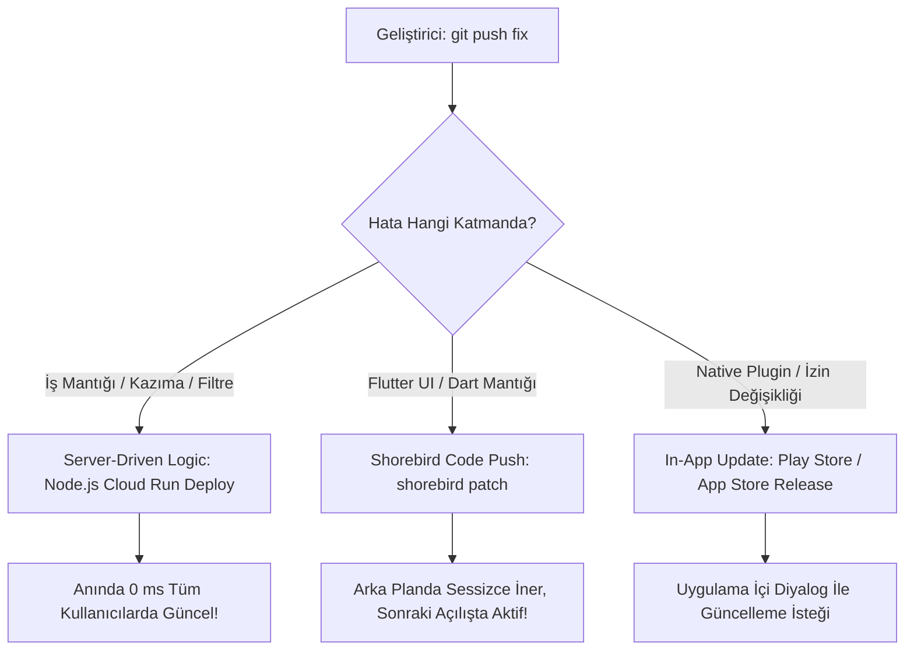

# FırsatKolik Canlı Ortam Canlı Kod Güncelleme (Code Push / OTA) Stratejileri ve Mimari Analiz Raporu

**Oluşturulma Tarihi:** 2026-07-31  
**Hedef Kitle:** Yazılım Mimarları, Mobil Geliştirme Ekibi, DevOps  
**Konu:** Canlı ortamdaki (Production) Flutter uygulamasında mağaza onay süreçlerine takılmadan anlık hot-fix (sıcak yama) geçme teknikleri, mağaza politikaları ve önerilen mimari strateji.

---

## 📌 1. Giriş ve Problemin Tanımı

Canlıya çıkmış bir mobil uygulamada (Android / iOS) kritik bir hata tespit edildiğinde geleneksel güncelleme adımları şu şekildedir:
1. Hatayı yerelde (local) tespit edip düzeltmek ve `main` branch'e merge etmek.
2. Android için APK/AAB, iOS için IPA derlemesi almak.
3. Google Play Console ve Apple App Store Connect'e yeni sürüm yüklemek.
4. Mağaza inceleme ekiplerinin onayı beklemek (iOS: 6-24 saat, Android: 2-48 saat).
5. Onay sonrası kullanıcının Google Play / App Store'a girip "Güncelle" butonuna basmasını beklemek.

Bu süreç kriz anlarında binlerce kullanıcının hatalı kodla etkileşimde kalmasına neden olur. Bu raporda, **mağazaya uğramadan veya kullanıcıya hissettirmeden hot-reload benzeri anlık güncelleme yapabilmenin yolları** incelenmiştir.

---

## 🛑 2. Flutter AOT Mimarisinin Kısıtları ve Mağaza Politikaları

### 2.1 Native AOT vs Interpreted Mimari
* **React Native / Webview Tabanlı Uygulamalar:** Kodlar JavaScript olarak yorumlandığı için sunucudan yeni bir `.js` paketi indirilip runtime'da çalıştırılabilir (örn: Microsoft AppCenter CodePush).
* **Flutter:** Dart kodu derlendiğinde doğrudan cihazın işlemcisinin anlayacağı **Native Makine Koduna (AOT - Ahead Of Time ARM assembly)** dönüştürülür. 

### 2.2 Mağaza Politikaları (Store Guidelines)
* **Apple App Store Policy Section 2.5.2:** Uygulamaların internet üzerinden indirilen yürütülebilir (executable) native kod veya dynamic C/C++ kütüphanesi çalıştırmasını kesinlikle yasaklar.
* **Google Play Developer Policy:** Uygulama binary'sinin dışarıdan indirilen makine kodlarıyla değiştirilmesini kısıtlar.

> [!WARNING]
> İnternetten doğrudan `.so` veya `.dylib` gibi derlenmiş dinamik kütüphane indirip çalıştırmak uygulamanın mağazalardan kalıcı olarak banlanmasına neden olur.

---

## 🚀 3. Canlıda Kod Güncelleme Yöntemleri ve Teknolojileri

---

### 3.1 Shorebird (Flutter Code Push)

Flutter'ın kurucularından ve Google'daki eski Flutter Mühendislik Lideri **Eric Seidel** tarafından geliştirilen [Shorebird](https://shorebird.dev/), Flutter için özel tasarlanmış resmi uyumlu Code Push altyapısıdır.

* **Nasıl Çalışır?** Shorebird, Flutter engine'i fork ederek kendi özel yorumlayıcı katmanını ekler. `shorebird patch` attığınızda sadece değişen Dart bytecode delta yaması sunucuya yüklenir. Kullanıcı uygulamayı açtığında arka planda sessizce indirilir ve sonraki açılışta veya anında devreye girer.
* **Mağaza Uyumluluğu:** Apple ve Google politikalarına %100 uygundur.
* **Avantajları:**
  - Mağaza onay süreci yok.
  - Kullanıcı fark etmeden arka planda güncellenir.
  - Komut satırından tek tıkla (`shorebird patch android / ios`) dağıtım yapılır.
* **Kısıtlamaları:**
  - Yeni bir native paket (`pubspec.yaml` içine Android/iOS native bağımlılığı ekleme) veya `AndroidManifest.xml` / `Info.plist` değişikliklerini kapsamaz. Sadece Dart kodlarını günceller.

---

### 3.2 Server-Driven Architecture (Sunucu Güdümlü Mimari)

FırsatKolik'te uyguladığımız **Scraping (Boyner, Trendyol vb.)** ve **İçerik Moderasyonu (Küfür/Filtre)** altyapısı bu yaklaşımın en iyi örneğidir.

* **Nasıl Çalışır?** Değişme ihtimali yüksek olan iş kuralları, regex'ler, mağaza seçicileri ve kazıma algoritmaları mobil uygulamaya gömülmek yerine **Node.js Cloud Run / Firebase / Remote Config** tarafında tutulur.
* **Avantajları:**
  - **0 Saniye Gecikme:** Sunucuya atılan deploy anında dünya genelindeki binlerce kullanıcının cebinde aktif olur.
  - Mağaza onay riski sıfırdır.
  - %100 ücretsiz ve tam kontrol geliştiricidedir.

---

### 3.3 In-App Update (Uygulama İçi Güncelleme Diyalogları)

Yeni bir native özellik eklendiğinde ve mağazaya paket yüklemek zorunda kalındığında, kullanıcının mağazaya gitmeden uygulama içinden güncellenmesini sağlayan mekanizmadır.

* **Kullanılan Paketler:** `in_app_update` (Android Flexible/Immediate Update API) ve `upgrader` (iOS & Android).
* **Çalışma Şekli:**
  - **Flexible Update (Esnek):** Kullanıcı uygulamayı kullanmaya devam ederken yeni sürüm arka planda indirilir. İndirme bitince *"Güncelleme yüklendi, yeniden başlatılsın mı?"* mesajı gösterilir.
  - **Immediate Update (Zorunlu):** Kritik sürümlerde ekrana engelleyici bir diyalog gelerek güncelleme tamamlanana kadar uygulama kullanımını kilitler.

---

### 3.4 Remote Flutter Widgets (`rfw`)

Flutter ekibi tarafından geliştirilen resmi `rfw` paketi, deklaratif UI widget ağaçlarının (`.rfw` binary formati) sunucudan indirilip runtime'da render edilmesini sağlar.

* **Kullanım Alanı:** Dinamik kampanya banner'ları, değişen fırsat kartı tasarımları veya dinamik ana sayfa düzenleri.

---

## 📊 4. Karşılaştırma ve Risk Analiz Matrisi

| Yöntem | Güncelleme Hızı | Kullanıcı Etkileşimi | Desteklenen Değişiklikler | Mağaza Ban Riski |
| :--- | :--- | :--- | :--- | :--- |
| **Shorebird (Code Push)** | Anlık / Arka Planda | **Sessiz (Fark Ettirmeden)** | Tüm Dart UI ve İş Mantığı | **Yok (%100 Uyumlu)** |
| **Server-Driven (Node.js)** | **Tam Anlık (0 ms)** | **Sessiz (Fark Ettirmeden)** | Kazıma, Filtre, Moderasyon, Kurallar | **Yok** |
| **In-App Update (Flexible)**| Mağaza Onayı + İndirme | Arka Plan İndirme + Bildirim | Native Kod Dahil Tüm Paket | **Yok** |
| **Dinamik Kütüphane (.so)**| Anlık | Sessiz | Her Şey | ⚠️ **ÇOK YÜKSEK (Ban Sebebi)** |

---

## 🎯 5. FırsatKolik İçin Önerilen Üretim (Production) Stratejisi

FırsatKolik projesinin yüksek performanslı ve kesintisiz çalışabilmesi için **3 Katmanlı Hibrit Strateji** uygulanmalıdır:

1. **Katman 1 (Sunucu Katmanı - Veri ve Kazıma):**
   - Tüm mağaza scraping regex'leri, HTML ayrıştırıcıları, moderasyon kelime listeleri ve domain allowlist mantığı `cloud-run-bot` (Node.js) ve Firebase Remote Config üzerinde tutulmaya devam etmelidir.
   - *Sonuç: Kazıma hataları sunucuya atılan 1 deploy ile 0 saniyede çözülür.*

2. **Katman 2 (Mobil UI & Dart Mantığı - Shorebird):**
   - Canlı sürüm derlemeleri CI/CD sürecine `shorebird release` olarak entegre edilmelidir.
   - Flutter UI ve ekran hataları için `shorebird patch` kullanılarak kullanıcıya güncelleme istemeden arkaplanda hot-fix geçilmelidir.

3. **Katman 3 (Büyük Sürümler & Native Değişiklikler):**
   - Native kamera/bildirim/reklam kütüphanesi güncellemelerinde `upgrader` ve `in_app_update` ile kullanıcılar uygulama içinden yönlendirilmelidir.
