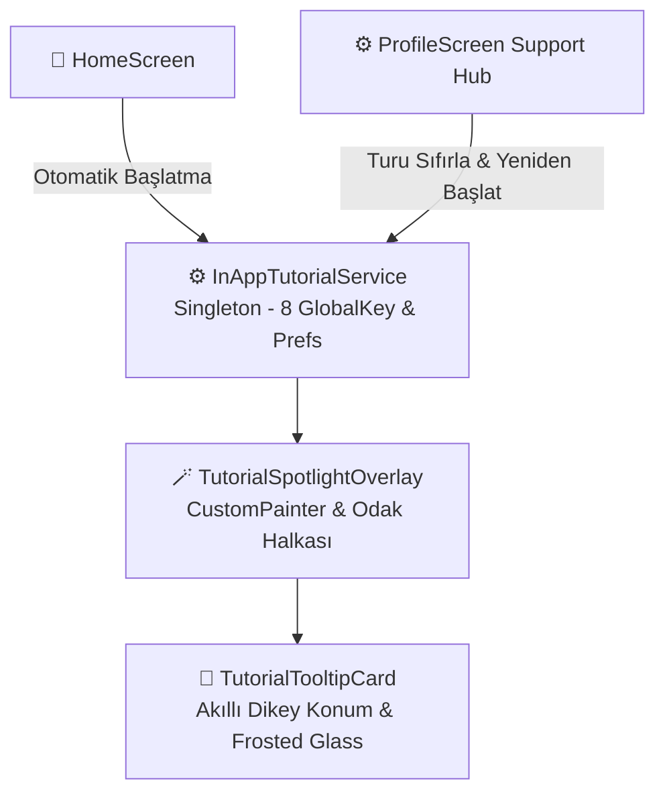

# 🌟 FırsatKolik — İnteraktif Uygulama Turu (In-App Tutorial & Spotlight Showcase) Mimari Rehberi

Bu doküman, **FırsatKolik** mobil uygulamasında ilk kez giriş yapan kullanıcılara veya turu yeniden başlatanlara sunulan **8 Adımlı İnteraktif Spotlight Rehberi (In-App Tutorial)** sisteminin teknik mimarisini, hedef yönetimini, UI/UX kararlarını ve entegrasyon kurallarını açıklamaktadır.

---

## 📑 İçindekiler
1. [🚀 Giriş ve Sıfır Sürtünmeli Başlangıç (Zero-Friction UX)](#1--giriş-ve-sıfır-sürtünmeli-başlangıç-zero-friction-ux)
2. [🏛️ Sistem Mimarisi ve Temel Bileşenler](#2-️-sistem-mimarisi-ve-temel-bileşenler)
3. [🎯 8 Adımlı İnteraktif Keşif Matrisi](#3--8-adımlı-interaktif-keşif-matrisi)
4. [📐 Akıllı Konumlandırma ve Titremesiz Stabilite Motoru](#4--akıllı-konumlandırma-ve-titremesiz-stabilite-motoru)
5. [🔄 Durum Kalıcılığı ve Turu Sıfırlama Mekanizması](#5--durum-kalıcılığı-ve-turu-sıfırlama-mekanizması)
6. [📂 İlgili Kaynak Kod Dosyaları](#6--ilgili-kaynak-kod-dosyaları)

---

## 1. 🚀 Giriş ve Sıfır Sürtünmeli Başlangıç (Zero-Friction UX)

FırsatKolik'in zengin özellik setini (Akıllı Fırsat Radarı, Yapay Zeka Destekli Paylaşım, Aktüel Broşürler, Mağaza Kuponları, Sıcaklık Termometresi ve Avcı Başarımları) kullanıcıya en hızlı ve etkileyici şekilde öğretmek için **Spotlight Showcase** yaklaşımı benimsenmiştir.

```
                   [ Uygulama İlk Kez Açılır ]
                                │
                   (Ana Sayfa Yüklenir ~800ms)
                                │
                                ▼
         [ 🚀 1. Adım: Arama & Fırsat Radarı Spotlight ]
                                │
                                ▼
         [ 8 Adımlı Akıcı, Eğlenceli ve Emojili Tur ]
                                │
                                ▼
              [ 🎉 Keşfe Başla & Kalıcı Kayıt ]
```

### Temel Tasarım İlkeleri:
* **Sıfır Sürtünmeli Açılış (Zero-Friction):** Kullanıcıyı karşılayan gereksiz soru pencereleri (Dialog/Sheet) kaldırılmıştır. Uygulama açıldığı anda kullanıcı doğrudan 1. adım ile etkileşime girer.
* **Kullanıcı İnisiyatifi:** Tur sırasında kullanıcı dilediği an sağ üstteki **"Turu Atla (✕)"** butonuna basarak rehberden çıkabilir veya adımlar arasında ileri/geri gezinebilir.
* **Frosted-Glass & Linear Estetiği:** Kartlar derin lacivert arka plan (`#0F172A`), `%92` şeffaflık, ince parlak kenarlıklar ve her adıma özel canlı vurgu renkleriyle modern Apple/Linear standartlarında tasarlanmıştır.

---

## 2. 🏛️ Sistem Mimarisi ve Temel Bileşenler

Sistem 3 ana katmandan oluşur:



### 1. `InAppTutorialService` (`lib/services/in_app_tutorial_service.dart`):
* Singleton mimaride çalışır.
* 8 hedef UI bileşeni için dinamik `GlobalKey` referanslarını tutar.
* `refreshKeys()` fonksiyonu ile widget ağacındaki olası eski referans kilitlenmelerini önler.
* `SharedPreferences` üzerinden kullanıcının turu tamamlayıp tamamlamadığını (`has_seen_inapp_tutorial_v1`) yönetir.

### 2. `TutorialSpotlightOverlay` (`lib/widgets/in_app_tutorial/tutorial_spotlight_overlay.dart`):
* Hedef widget'ın ekrandaki mutlak koordinatlarını (`RenderBox.localToGlobal`) hesaplar.
* `_SpotlightHolePainter` ile hedef hariç tüm ekranı karartır (`alpha: 0.82`) ve hedef üzerine animasyonlu ışıltılı odak halkası (pulsing glow ring) çizer.
* Hedefin dairesel (`isCircle: true`) veya yuvarlatılmış dikdörtgen (`borderRadius: 14..20`) kesimini dinamik işler.

### 3. `TutorialTooltipCard` (`lib/widgets/in_app_tutorial/tutorial_tooltip_card.dart`):
* İçerisinde adım göstergesi (`3/8`), kategori etiketi, başlık, emojili açıklama, önceki adım butonu ve sıradaki adım butonunu barındırır.
* `AnimatedPositioned` ve `AnimatedSwitcher` ile adımlar arası geçişlerde pürüzsüz animasyon sağlar.

---

## 3. 🎯 8 Adımlı İnteraktif Keşif Matrisi

| # | Adım ID | Kategori Etiketi | Başlık & Emojili Açıklama | Hedef UI Bileşeni | Vurgu Rengi |
| :-: | :--- | :--- | :--- | :--- | :--- |
| **1** | `search_radar` | `ARAMA & RADAR` | **Akıllı Arama & Fırsat Radarı**<br>🔍 *Aradığın ürünü anında bul veya radara ekleyerek 🔔 indirim alarmı kur.* | Arama Çubuğu (`searchBarKey`) | `#F97316` (Mercan) |
| **2** | `aktuel_kataloglar` | `İNDİRİM BROŞÜRLERİ` | **Aktüel & Mağaza Broşürleri**<br>🛒 *Popüler mağazaların haftalık indirim broşürlerini ve kampanyalarını tek yerden incele.* | Aktüel Çipi (`aktuelChipKey`) | `#38BDF8` (Gök Mavisi) |
| **3** | `indirim_kuponlari` | `İNDİRİM KODLARI` | **Mağaza Kuponları**<br>🎟️ *Trendyol, Hepsiburada, Amazon ve 20+ mağazanın güncel kuponlarını tek tıkla kopyala.* | Kuponlar Çipi (`kuponlarChipKey`) | `#A78BFA` (Lavanta) |
| **4** | `community_thermometer` | `FIRSAT ETKİLEŞİMİ` | **Fırsatı İncele & Değerlendir**<br>*Fırsat detaylarını incele; 🔥/🥶 ile oyla, 💬 yorum yap ve stok biterse ⌛ Bitti bildirimi gönder.* | İlk Fırsat Kartı (`firstDealCardKey`) | `#F87171` (Gül) |
| **5** | `saved_and_categories` | `KAYDEDİLENLER & TAKİP` | **Kaydedilenler & Özel Akışın**<br>📌 *Fırsatları favorilerine ekle, takip ettiğin kategorilere özel indirim akışını oluştur.* | Alt Bar: Kaydedilenler (`bottomNavSavedKey`) | `#34D399` (Zümrüt) |
| **6** | `popular_deals` | `POPÜLER FIRSATLAR` | **Günün Trend İndirimleri**<br>⚡ *Topluluk oylarıyla öne çıkan son 48 saatin 🔥 en sıcak fırsatlarını keşfet.* | Alt Bar: Popüler (`bottomNavPopularKey`) | `#FB923C` (Alev) |
| **7** | `submit_deal` | `AKILLI LİNK ANALİZİ` | **Yapay Zeka Destekli Paylaşım**<br>🔗 *Paylaşmak istediğin ürünün linkini yapıştır; ürün detaylarını 🤖 yapay zeka otomatik doldursun.* | Alt Bar: Fırsat Paylaş (`bottomNavAddKey`) | `#F472B6` (Pembe) |
| **8** | `profile_hub` | `PROFİL & AYARLAR` | **Profilim & Avcı Merkezi**<br>💬 *Mesajlarına ulaş, 🔔 bildirimlerini özelleştir, 🏆 avcı rozetlerini topla ve hesap ayarlarını yönet.* | Alt Bar: Profil (`bottomNavProfileKey`) | `#818CF8` (İndigo) |

---

## 4. 📐 Akıllı Konumlandırma ve Titremesiz Stabilite Motoru

Spotlight rehberinde yaşanan en büyük kullanıcı deneyimi sorunlarından biri, alt barda yan yana duran sekmeler arasında gezinirken bilgi kartının sürekli yukarı-aşağı zıplaması veya titremesidir. 

### Çözüm Mimarisi (Vertical Position Lock):
`TutorialTooltipCard` içerisinde hedefin ekranın alt `%15`'lik diliminde olup olmadığı tespit edilir:

```dart
final bool isBottomNavStep = targetRect.bottom > (screenSize.height - 120.0);

if (isBottomNavStep) {
  // Kaydedilenler, Popüler, Fırsat Paylaş ve Profil adımlarında kart dikeyde 96px boşlukla SABİTLENİR.
  calculatedTop = screenSize.height - mediaQuery.padding.bottom - cardEstimatedHeight - 96.0;
} else if (placeBelow) {
  calculatedTop = targetRect.bottom + 16.0;
} else {
  calculatedTop = targetRect.top - cardEstimatedHeight - 24.0;
}
```

* **Sonuç:** Alt gezinti çubuğundaki 4 adım (Adım 5, 6, 7, 8) arasında geçerken kart dikey eksende **milimetrik olarak sabit kalır**, yalnızca odaklanan ışık çemberi yatayda pürüzsüzce kayar.

---

## 5. 🔄 Durum Kalıcılığı ve Turu Sıfırlama Mekanizması

* **İlk Açılış:** `HomeScreen.initState` içerisinde `hasSeenTutorial()` kontrol edilir. Eğer `false` ise ve arama filtresi yoksa ~800ms sonra `_startInAppTutorial()` otomatik çağrılır.
* **Tamamlama:** Kullanıcı son adıma gelip *"Keşfe Başla 🎉"* dediğinde veya *"Turu Atla"* yaptığında `markTutorialCompleted()` çalışır ve `has_seen_inapp_tutorial_v1 = true` kaydedilir.
* **Yeniden Başlatma (Support Hub):** Kullanıcı **Profilim > Hesap, Yardım & Destek > Uygulama Turu (Nasıl Kullanılır?)** seçeneğine bastığında:
  1. `InAppTutorialService().resetTutorial()` çağrılarak SharedPreferences sıfırlanır ve `refreshKeys()` ile anahtarlar tazelenir.
  2. `HomeScreen(startTutorial: true)` parametresiyle ana sayfaya dönülerek tur 8 adımıyla anında yeniden başlatılır.

---

## 6. 📂 İlgili Kaynak Kod Dosyaları

| Dosya Yolu | Görevi ve Sorumluluğu |
| :--- | :--- |
| [`lib/services/in_app_tutorial_service.dart`](file:///d:/firsatkolik/lib/services/in_app_tutorial_service.dart) | Adım tanımları (`TutorialStep`), GlobalKey yönetimi, SharedPreferences kalıcılığı. |
| [`lib/widgets/in_app_tutorial/tutorial_spotlight_overlay.dart`](file:///d:/firsatkolik/lib/widgets/in_app_tutorial/tutorial_spotlight_overlay.dart) | Ekran karartma, animasyonlu delik açma (Spotlight Hole) ve ışıltılı odak halkası. |
| [`lib/widgets/in_app_tutorial/tutorial_tooltip_card.dart`](file:///d:/firsatkolik/lib/widgets/in_app_tutorial/tutorial_tooltip_card.dart) | Frosted glass bilgi kartı, dikey kilitlenme hesaplaması, butonlar ve sayaç. |
| [`lib/screens/home_screen.dart`](file:///d:/firsatkolik/lib/screens/home_screen.dart) | Sıfır sürtünmeli açılış tetikleyicisi (`_checkAndTriggerTutorial`) ve alt bar key bağlantıları. |
| [`lib/screens/profile_screen.dart`](file:///d:/firsatkolik/lib/screens/profile_screen.dart) | "Hesap, Yardım & Destek" Bottom Sheet üzerinden turu sıfırlama ve yeniden başlatma menüsü. |
