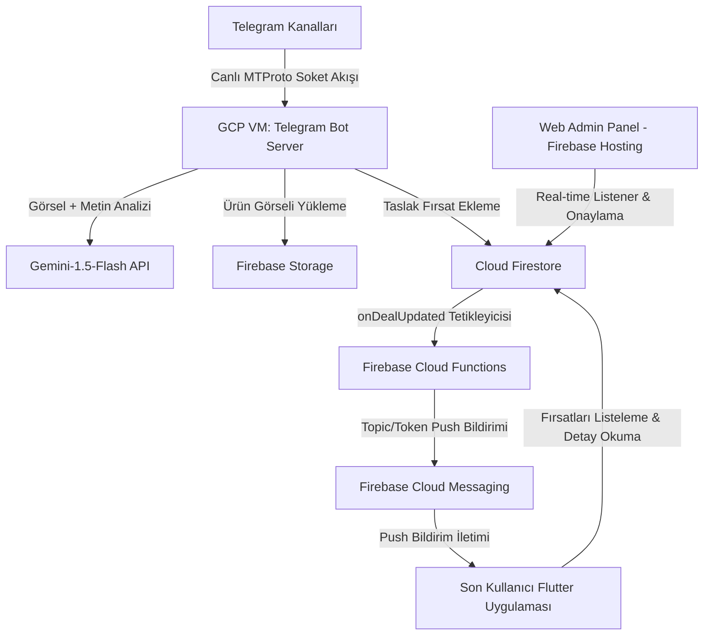

# 🧠 FırsatKolik — Proje Bilgi Bankası ve Yapay Zeka Hafıza Dosyası (Project Context Manifest)

Bu belge, **FırsatKolik** projesinin tüm teknik altyapısını, mimarisini, veri akışlarını, ortam konfigürasyonlarını ve canlı/geliştirme sistemlerini tek bir çatı altında toplar. **Amaç; yeni bir yapay zeka oturumunda bu belgenin doğrudan okunarak projenin A'dan Z'ye tüm detaylarının yapay zeka hafızasına aktarılmasıdır.**

---

## 🗺️ 1. Genel Mimari ve Bileşenlerin Rolü (Overview)

FırsatKolik; Telegram kanallarından paylaşılan indirimli ürün linklerini yakalayan, yapay zeka ile parse edip bir yönetim paneline sunan, onaylanan fırsatları ise Flutter mobil uygulaması üzerinden kullanıcılara anlık push bildirimleri ile ileten bir platformdur.



---

## 📂 2. Dizin Yapısı ve Klasörlerin Amacı (Directory Structure)

*   **`[Root]/`**: Flutter mobil uygulamasının ana çalışma dizinidir.
    *   `lib/`: Flutter Dart kodlarının bulunduğu dizin.
        *   `services/scrapers/`: Kullanıcıların uygulama içinden link paylaşırken kullandığı **Dart tabanlı tarayıcı (Scraper)** sınıfları (Örn: `hepsiburada_scraper.dart`).
*   **`cloud-run-bot/`**: Telegram kanallarını dinleyen Node.js uygulamasının dizini.
    *   `telegram_bot.js`: Botun ana giriş noktası. Kanalları dinler, görselleri indirir, Gemini ve Firestore entegrasyonunu yönetir.
    *   `link_scraper_service.js`: Gelen bağlantıların yönlendirmelerini takip eden ve bypass stratejilerini yöneten katman.
    *   `category_detection_service.js`: Ürün başlığı ve açıklamasına göre kategoriyi otomatik saptayan servis.
    *   `scrapers/`: Botun kullandığı **JS tabanlı tarayıcı (Scraper)** sınıfları (Örn: `hepsiburada_scraper.js`).
    *   `deploy_to_vm.py`: Güncellemeleri Google Cloud Build ile derleyip VM'e otomatik kuran deployment betiği.
    *   `dev.env` / `prod.env`: Ortam değişkenleri (Secret şifreleri barındırmaz, sadece konfigürasyonel veri taşır).
*   **`functions/`**: Firebase Cloud Functions kodları.
    *   `index.js`: Veritabanı trigger'larını (tetikleyicilerini) barındırır. Fırsat onaylandığında push bildirimi tetikleyen `onDealUpdated` buradadır.
*   **`web/admin/`**: Firebase Hosting üzerinde barındırılan ve yöneticilerin fırsatları onayladığı basit HTML/CSS/JS tabanlı yönetim paneli.
*   **`documentation/`**: Proje gereksinimleri, yol haritaları ve geliştirme notları.
    *   `mrtcn/`: VM taşıması, Dockerize süreçleri ve bypass stratejilerinin yer aldığı özel mühendislik belgeleri.

---

## ⚙️ 3. Ortam Konfigürasyonları: DEV vs PROD

Proje tamamen izole edilmiş iki ayrı Firebase ve Google Cloud projesi altında koşturulmaktadır:

| Parametre / Özellik | Geliştirme Ortamı (DEV) | Canlı Ortam (PROD) |
| :--- | :--- | :--- |
| **GCP / Firebase Project ID** | `sicak-firsatlar-e6eae` | `firsatkolik-prod-e6eae` |
| **Telegram Bot Container Adı** | `dev-bot` | `prod-bot` |
| **Host / VM Portu** | `8081` (Host: 8081 -> Container: 8080) | `8082` (Host: 8082 -> Container: 8080) |
| **Firebase Service Account Anahtarı** | `dev_firebase_key.json` | `prod_firebase_key.json` |
| **Firebase Hosting URL** | [sicak-firsatlar-e6eae.web.app](https://sicak-firsatlar-e6eae.web.app/admin/) | [firsatkolik-prod-e6eae.web.app](https://firsatkolik-prod-e6eae.web.app/admin/) |
| **FCM Konu Başlığı (Topic)** | `general_deals_dev` | `general_deals` |

### Sunucu Barındırma Altyapısı (VM):
*   DEV ve PROD botlarının ikisi de Google Cloud Platform üzerindeki tek bir ücretsiz katman sanal makinesinde (**GCP Compute Engine VM**) Docker konteynerleri olarak çalışır.
*   **Makine Özellikleri:** `e2-micro` (2 vCPU, 1 GB RAM), Zone: `us-central1-a`, OS: `Debian 12`.
*   **VM Adı:** `telegram-bot-server`

---

## 🛡️ 4. Bot Scraping ve Anti-Bot Bypass Stratejileri

E-ticaret siteleri bulut IP bloklarından (GCP/AWS) gelen bot isteklerini sert güvenlik önlemleri ile engeller. Sunucu tarafında istek atılırken kullanılan bypass stratejileri şunlardır:

### Yöntem A: Google Translate Proxy (`translate.goog` + Native Fetch)
*   **Kullanıldığı Mağazalar:** `N11`, `Vatan Bilgisayar`, `Itopya`
*   **Mantık:** İstekler Google Translate'in proxy tünelleri üzerinden atılır. Google Translate sunucuları, Cloudflare/Akamai sistemlerinde beyaz listede olduğu için istek meşru bir arama motoru IP'sinden geliyormuş gibi görünür ve 403 engeli aşılır. Node.js native `fetch` kullanıldığı için child process başlatma yükü yoktur ve TCP bağlantıları havuzda tutularak çok hızlı çalışır.

### Yöntem B: Doğrudan `curl` spawnSync ve `WhatsApp` User-Agent
*   **Kullanıldığı Mağazalar:** `Trendyol`, `Teknosa`, `Mavi`, `Hepsiburada`
*   **Mantık:** Node.js'in standart TLS parmak izi (JA3 fingerprint) Cloudflare ve Akamai Bot Manager tarafından engellenir. Bu engeli aşmak için işletim sistemi düzeyinde OpenSSL/libcurl stack kullanan harici `curl` süreci başlatılır (`spawnSync('curl', ...)`) ve `WhatsApp/2.23.4.15 A` User-Agent'ı ile maskelenerek istek doğrudan TR IP'sinden atılır.
*   **Trendyol Özel Çerezi:** Trendyol'un Iowa IP yönlendirmesini aşmak için ise çerez başlığına `Cookie: storefrontId=1; countryCode=TR; language=tr` eklenir.

### Yöntem C: Microlink API Proxy (`api.microlink.io`)
*   **Kullanıldığı Mağazalar:** `Amazon`, `Pttavm`
*   **Mantık:** Amazon'un ABD IP'lerine uyguladığı fiyat değiştirme ve Pttavm'nin tam IP blokajını aşmak için Microlink'in konut IP proxy havuzu kullanılır. İstekler Microlink üzerinden statik veya dinamik (headless Chromium) olarak çekilip HTML içeriği bota teslim edilir.

---

## 🗄️ 5. Firestore Veritabanı Yapısı (Firestore Schema)

### 1. `deals` Koleksiyonu (Fırsat Kartları)
*   **Doküman ID Formatı:** `telegram_{chatId}_{messageId}` (Telegram'dan gelenler için mükerrer kaydı önler) veya otomatik üretilen UUID.
*   **Temel Alanlar (Fields):**
    *   `title` (String): Fırsat başlığı.
    *   `price` (Number): Ürün fiyatı.
    *   `originalPrice` (Number / Null): İndirimsiz eski fiyat.
    *   `store` (String): Mağaza adı (Örn: `hepsiburada`).
    *   `url` (String): Ürünün temizlenmiş ham adresi.
    *   `imageUrl` (String): Firebase Storage üzerindeki görsel bağlantısı.
    *   `category` (String): Kategori ID'si (Örn: `elektronik`).
    *   `isApproved` (Boolean): Yöneticinin onay durumu (`true` ise mobil uygulamada görünür ve push tetikler).
    *   `createdAt` (Timestamp): Fırsatın oluşturulma zamanı.
    *   `senderUid` (String / Null): Mobil uygulamadan paylaşılmışsa paylaşan kullanıcının UID'si.

### 2. `users` Koleksiyonu
*   **Doküman ID:** Kullanıcı UID'si (`Firebase Auth UID`).
*   **Alanlar:** `fcmToken` (String), `createdAt` (Timestamp), `notificationSettings` (Map).

### 3. `keywords` Koleksiyonu (Takip Edilen Kelimeler)
*   **Doküman ID:** Otomatik üretilir.
*   **Alanlar:** `userId` (String), `keyword` (String - küçük harfe normalize edilmiş), `createdAt` (Timestamp).

---

## 🚀 6. Canlıya Alma ve Güncelleme İş Akışları (Deployment Pipelines)

### A. Telegram Botu VM Deployment (`deploy_to_vm.py`):
Bot üzerinde bir kod değişikliği yapıldığında deployment şu adımlarla koşturulur:
1.  Yerel terminalde `cloud-run-bot` dizinine gidilir.
2.  DEV botu için: `python deploy_to_vm.py dev` veya PROD botu için `python deploy_to_vm.py prod` çalıştırılır.
3.  **Betik Arka Planda Ne Yapar?**
    *   `gcloud builds submit` ile kodları Google Cloud Build'e gönderir. Kod bulutta Dockerfile referansıyla derlenir ve GCP Container Registry'ye (`gcr.io`) yeni sürüm imaj push edilir.
    *   Sanal makineye SSH bağlantısı kurulur.
    *   Eski Docker konteyneri durdurulup silinir (`docker stop dev-bot || true && docker rm dev-bot || true`).
    *   Registry'den yeni Docker imajı çekilir ve çalıştırılır.
    *   Port yönlendirmesi (`8081:8080` veya `8082:8080`) yapılarak ayağa kaldırılır.
    *   Eski imajlar disk alanı kaplamaması için otomatik temizlenir (`docker image prune -a -f || true`).

### B. Firebase Cloud Functions Deployment:
1.  Yerel terminalde `functions` dizinine gidilir.
2.  Ortam seçimi yapılır (`firebase use sicak-firsatlar-e6eae` veya `firebase use firsatkolik-prod-e6eae`).
3.  `firebase deploy --only functions` komutu ile canlıya alınır.

### C. Admin Paneli (Hosting) Deployment:
1.  Yerel terminalde proje kök dizinine gidilir.
2.  Ortam seçimi yapılır (`firebase use [proje_id]`).
3.  `firebase deploy --only hosting` komutu ile yönetim paneli güncellenir.

---

## 🛠️ 7. Geliştirici ve Yönetici Komutları Referansı

### Sanal Makineye SSH ile Bağlanma:
```bash
gcloud compute ssh telegram-bot-server --zone=us-central1-a --project=firsatkolik-prod-e6eae
```

### Docker Konteyner Loglarını İnceleme (VM İçinde):
```bash
# DEV Bot Canlı Log Takibi
sudo docker logs -f dev-bot --tail 100

# PROD Bot Canlı Log Takibi
sudo docker logs -f prod-bot --tail 100
```

### Konteyner Durum ve Sağlık Kontrolleri:
```bash
sudo docker ps -a
```

### Docker Manuel Yeniden Başlatma:
```bash
sudo docker restart dev-bot
sudo docker restart prod-bot
```

---

## ⚠️ 8. Geliştirirken Dikkat Edilmesi Gereken Altın Kurallar (WAF/Anti-Bot)

1.  **Yeni Mağaza Eklendiğinde:** Öncelikle doğrudan `fetch` ile istek atıp Cloudflare veya Akamai koruması olup olmadığını teyit edin. 403 Forbidden geliyorsa VM üzerinde `test_bypass` benzeri bir yöntemle Translate Proxy veya `curl` metodunu test edip bypass stratejisini seçin.
2.  **Konteyner Portu:** Konteyner içerisindeki NodeJS sunucusu her zaman `PORT=8080` üzerinde çalışmalıdır. Host tarafındaki port yönlendirmesi (`8081` ve `8082`) sanal makinenin dışa açılan kapılarıdır. Dockerfile healthcheck'i container içi `8080/health` yolunu denetler.
3.  **Firebase Kimlik Doğrulama:** Konteynerler VM üzerinde çalışırken `firebase_key.json` dosyalarını volume mount olarak bağlar. Local test yaparken `.env` dosyalarında ve kod seviyesinde `GOOGLE_APPLICATION_CREDENTIALS` dosya yolunun tırnaksız ve doğru tanımlandığından emin olun.
