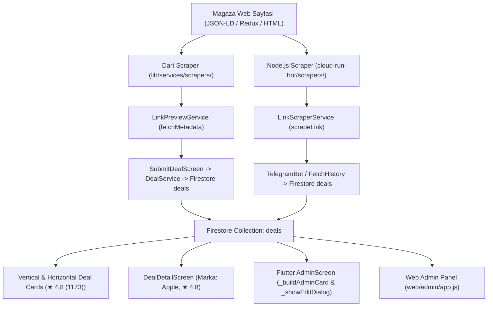

# Mağaza Scraper Metadata (Rating, Oy Sayısı, Marka) Entegrasyon Rehberi & Yol Haritası (Roadmap)

Bu doküman, herhangi bir mağaza (Hepsiburada, Trendyol, Amazon, N11, MediaMarkt, Teknosa, PttAVM, Zara vb.) için **Rating Puanı (`ratingValue`)**, **Değerlendirme Sayısı (`ratingCount`)** ve **Marka (`brand`)** verilerinin kazınması, Firestore'a kaydedilmesi ve tüm kullanıcı arayüzlerinde (Mobil Uygulama, Detay Ekranı, Flutter Admin Paneli, Web Admin Paneli) gösterilmesi için izlenmesi gereken **genel mimari adımları ve dosya haritasını** içerir.

---

## 🏗️ Mimari Bakış ve Veri Akışı



---

## 📂 Dokunulması Gereken Tüm Dosyalar ve Değişiklik Haritası (19 Nokta)

### BÖLÜM A: Altyapı & Temel Sınıflar (Sabit Yapı - Bir Kez Kuruldu)
Bu sınıflar altyapıyı temsil eder ve yeni alanlar eklendiğinde genişletilmiştir:
1. `lib/services/scrapers/base_scraper.dart` (Dart Tabanlı Scraper Ana Sınıfı)
2. `cloud-run-bot/scrapers/base_scraper.js` (Node.js Tabanlı Scraper Ana Sınıfı)
3. `lib/models/deal.dart` (Flutter Deal Veri Modeli)
4. `lib/services/link_preview_service.dart` (Flutter Link Önizleme Servisi)
5. `cloud-run-bot/link_scraper_service.js` (Node.js Link Scrape Servisi)
6. `cloud-run-bot/telegram_bot.js` (Telegram Canlı Mesaj İşleyici)
7. `cloud-run-bot/fetch_history.js` (Telegram Geçmiş Mesaj İşleyici)
8. `lib/services/deal_service.dart` (Firestore Fırsat Oluşturma Servisi)
9. `lib/services/firestore_service.dart` (Firestore Wrapper)
10. `lib/screens/submit_deal_screen.dart` (Manuel Fırsat Ekleme Ekranı)
11. `lib/widgets/deal_card/vertical_deal_card.dart` (Dikey Kart Widget'ı - Fiyat yanında ~~Eski Fiyat~~ + İndirim Rozeti)
12. `lib/widgets/deal_card/horizontal_deal_card.dart` (Yatay Kart Widget'ı - Fiyat üstünde ~~Eski Fiyat~~ + İndirim Rozeti)
13. `lib/screens/deal_detail_screen.dart` (Fırsat Detay Ekranı - Fiyat yanında ~~Eski Fiyat~~ + %x İndirim Rozeti)
14. `lib/screens/admin_screen.dart` (Flutter Admin Ekranı & Düzenleme Modalı)
15. `web/admin/app.js` (Web Admin Paneli Tablo ve Modalı)

---

### BÖLÜM B: Yeni Bir Mağaza Eklerken veya Mevcut Mağazayı Güncellerken Yapılacak Adımlar (Her Mağaza İçin Standart Prosedür)

Yeni bir mağaza ekleneceği zaman (veya mevcut bir mağazanın scraper'ı güncelleneceği zaman) takip edilecek **4 Ana Aşama**:

---

### 1️⃣ AŞAMA: Scraper Mantığının Yazılması (Dart & Node.js)

Her mağaza için hem Flutter (Dart) hem de Telegram Botu (Node.js) tarafında scraper metotları yazılır.

#### 1.1. Flutter Dart Scraper Dosyası:
📌 **Dosya:** `lib/services/scrapers/[magaza]_scraper.dart`

```dart
class MagazaScraper extends BaseProductScraper {
  @override
  double? scrapeRatingValue(Document document) {
    // 1. Birincil: JSON-LD Şeması (@type: Product)
    final product = findProductJsonLd(document);
    if (product != null) {
      final rating = extractRatingFromProductJson(product);
      if (rating?['ratingValue'] != null) return rating!['ratingValue'];
    }
    // 2. İkincil: Mağazaya özel HTML seçici veya script (Redux/State) fallback'i
    // ...
    return null;
  }

  @override
  int? scrapeRatingCount(Document document) {
    final product = findProductJsonLd(document);
    if (product != null) {
      final rating = extractRatingFromProductJson(product);
      if (rating?['ratingCount'] != null) return rating!['ratingCount'];
    }
    return null;
  }

  @override
  String? scrapeBrand(Document document) {
    final product = findProductJsonLd(document);
    if (product != null) {
      final brand = extractBrandFromProductJson(product);
      if (brand != null && brand.isNotEmpty) return brand;
    }
    return null;
  }
}
```

#### 1.2. Node.js Bot Scraper Dosyası:
📌 **Dosya:** `cloud-run-bot/scrapers/[magaza]_scraper.js`

```javascript
class MagazaScraper extends BaseProductScraper {
  scrapeRating($) {
    // 1. Birincil: JSON-LD Şeması
    const product = this.findProductJsonLd($);
    if (product) {
      const rating = this.extractRatingFromProductJson(product);
      if (rating && (rating.ratingValue != null || rating.ratingCount != null)) {
        return rating;
      }
    }
    // 2. İkincil: Mağazaya özel fallback
    return { ratingValue: null, ratingCount: null };
  }

  scrapeBrand($) {
    const product = this.findProductJsonLd($);
    if (product) {
      const brand = this.extractBrandFromProductJson(product);
      if (brand) return brand;
    }
    return null;
  }
}
```

---

### 2️⃣ AŞAMA: Birim Testlerinin (Unit Tests) Eklenmesi ve Çalıştırılması

Her mağazanın scraper'ı için hem Dart hem de JS birim testlerine HTML örnekleri eklenerek test edilir.

#### 2.1. Dart Unit Testi:
📌 **Dosya:** `test/[magaza]_scraper_test.dart`
- Mağazaya ait örnek `ld+json` veya HTML dizesi yüklenir.
- `scrapePrice`, `scrapeTitle`, `scrapeRatingValue`, `scrapeRatingCount`, `scrapeBrand` metodları assert edilir.
- 🚀 **Çalıştırma Komutu:**
  ```bash
  flutter test test/[magaza]_scraper_test.dart
  ```

#### 2.2. JS Unit Testi:
📌 **Dosya:** `cloud-run-bot/tests/[magaza].test.js`
- Cheerio ile HTML dizesi yüklenir.
- `scrapeRating($)` ve `scrapeBrand($)` doğrulanır.
- 🚀 **Çalıştırma Komutu:**
  ```bash
  node -e "require('./cloud-run-bot/tests/[magaza].test.js').run()"
  ```

---

### 3️⃣ AŞAMA: Veri Modeli ve Firestore Katmanı (Zaten Hazır)

Aşağıdaki veri ve servis katmanı güncellemesi altyapıda tamamlanmıştır:

- **`Deal` Modeli (`lib/models/deal.dart`)**:
  - `ratingValue` (`double?`)
  - `ratingCount` (`int?`)
  - `brand` (`String?`)
  - `fromFirestore` & `toFirestore`
- **Firestore Kayıt Akışı (`lib/services/deal_service.dart` & `cloud-run-bot/telegram_bot.js`)**:
  - `createDeal` metodları yeni alanları Firestore `deals` koleksiyonuna otomatik olarak yazar.

---

### 4️⃣ AŞAMA: Arayüz (UI) Katmanı Kontrol Listesi

Çekilen `ratingValue`, `ratingCount` ve `brand` verilerinin ekranda göründüğü 5 temel bileşen:

| Component / Ekran | Dosya Yolu | Gösterim Formatı |
|---|---|---|
| **Dikey Fırsat Kartı** | `lib/widgets/deal_card/vertical_deal_card.dart` | Fiyatın altında `★ 4.8 (1173)` |
| **Yatay Fırsat Kartı** | `lib/widgets/deal_card/horizontal_deal_card.dart` | Fiyatın yanında/altında `★ 4.8 (1173)` |
| **Fırsat Detay Ekranı** | `lib/screens/deal_detail_screen.dart` | Başlık altında `★ 4.8 (1173 Değerlendirme)` + Header'da `Marka: Apple` rozeti |
| **Flutter Admin Paneli** | `lib/screens/admin_screen.dart` | Kartlarda marka ve puan + `_showEditDialog` içinde düzenlenebilir `Marka`, `Rating Puanı`, `Oy Sayısı` input kutuları |
| **Web Admin Paneli** | `web/admin/app.js` | Tablo hücrelerinde `Marka: Apple` & `★ 4.8 (1173)` + `showDealModal` ve `saveDealChanges` içinde düzenlenebilir/kaydedilebilir input kutuları |

---

## ⚡ İpuçları & Püf Noktaları

1. **JSON-LD Önceliği**: E-ticaret sitelerinin %90'ı `@type: "Product"` veya `@graph` içinde `aggregateRating` ve `brand` nesnesi içerir. `BaseProductScraper.findProductJsonLd` ve `extractRatingFromProductJson` yardımcı metotları standart şemaları otomatik çözümler.
2. **Redux / State Fallback**: E-ticaret sitesi JSON-LD sunmuyorsa veya client-side render yapıyorsa HTML içinde window Redux store (`<script id="reduxStore">` veya `window.__INITIAL_STATE__`) aranmalıdır.
3. **Null-Safety**: Eski verilerde `ratingValue` veya `brand` bulunmayacağından aydınlatma ve arayüz elemanlarında her zaman `deal.ratingValue != null` kontrolü yapılmalı, veri yoksa bileşenler gizlenmelidir.
