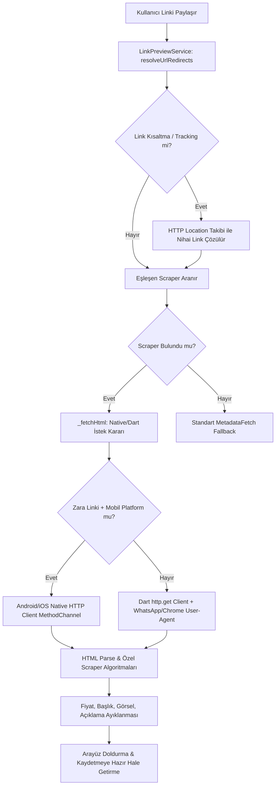

# FırsatKolik Mağaza Özel Scraping Kuralları ve Stratejileri

Bu belge, FırsatKolik uygulamasında yer alan 13 adet entegre mağaza için geliştirilen scraping (veri kazıma) stratejilerini, karşılaşılan bot koruması (WAF/Akamai/Cloudflare) engellerini ve bunların nasıl aşıldığını detaylıca açıklamaktadır.

---

## 🏗️ Genel Scraping Mimarisi ve İstek Akışı

FırsatKolik'te bir ürün linki paylaşıldığında veya yapıştırıldığında süreç şu aşamalardan geçer:

---

## 🏪 Mağaza Detaylı Çözümleme Stratejileri

Her mağazanın sunucu taraflı davranışları, bot korumaları ve fiyat yerleşimleri farklılık göstermektedir. Mağazaların çalışma detayları aşağıda sınıflandırılmıştır:

### 1. Amazon (`amazon.com.tr`)
*   **User-Agent Politikası:** Akamai/WAF engellerini aşmak için `WhatsApp/2.23.4.15 A` kullanılır.
*   **Kısa Link ve Yönlendirme Desteği:** `amzn.eu`, `amzn.to` ve `link.amazon` kısa linkleri yönlendirme zinciri takibiyle (`resolveUrlRedirects`) asıl uzun linklerine çözümlenir. `link.amazon` kısa domain'i de taranarak Amazon mağazası olarak doğru tanınması sağlanır.
*   **Görsel Kazıma Zorluğu:** Amazon bazen ürün görseli olarak 43-byte boyutunda boş siyah piksel placeholder resmi döner.
*   **Çözüm:** `isLogoUrl` fonksiyonu ve byte kontrolü ile bu boş görseller elenerek HTML içerisindeki asıl `img#landingImage` veya `img#imgBlkFront` DOM elemanları taranır.
*   **Fiyat Çekme:** DOM üzerindeki `.a-price-whole` ve `.a-price-fraction` birleştirilerek tam kuruşlu fiyat elde edilir.

### 2. DeFacto (`defacto.com.tr`)
*   **User-Agent Politikası:** `WhatsApp/2.23.4.15 A` ile Cloudflare engelleri aşılır.
*   **Fiyat Kazıma Zorluğu:** DeFacto sepete özel indirimleri HTML DOM elemanlarına basmaz; Javascript nesneleri içerisinde saklar.
*   **Çözüm:** Sayfadaki `window.PRODUCT_DETAIL_LASTVISITED` script bloğu regex ile taranır. `DiscountPrice` (Sepetteki asıl indirimli fiyat) ve `CampaignDiscountedPrice` alanları tırnaksız/tırnaklı Javascript key desteğiyle aranarak tam net fiyat çözülür.
*   **Unicode Karakter Çözümü:** script bloğundan gelen başlıklar (`ProductVariantMiniProductName`) `&#x131;` (ı) gibi HTML varlıkları veya `\uXXXX` kaçış dizileri içerebilir. Bunlar özel bir kod çözücü (`_decodeUnicode`) ile temizlenip Türkçe karakterlere çevrilir.

### 3. Hepsiburada (`hepsiburada.com`)
*   **En Karmaşık Altyapı:** Hepsiburada hem normal fiyatı, hem Premium fiyatını, hem de sepete özel indirimli fiyatları HTML dokümanından tamamen gizlemektedir.
*   **Çözüm (Canlı API Entegrasyonu):** 
    1. HTML içerisindeki `<script id="reduxStore">` verisi parse edilir.
    2. Buradan `sku`, `listingId`, `merchantId`, `productId` gibi parametreler ayıklanır.
    3. Hepsiburada'nın resmi `withoutAffordability` (birincil buybox satıcısı) ve `otherMerchants` (tüm diğer satıcılar) POST API'lerine paralel (`Future.wait`) istek atılır.
    4. **Gotham API Gateway ve Kampanya Başlıkları:** İsteklerin sepetteki Premium indirimleri (`evaluateAsPremiumResult`) ve kuponları doğru hesaplayabilmesi için `x-gotham_is_include_premium_clubs` ve `x-gotham_is_enabled_evaluate_coupon` gibi Gotham gateway başlıkları (headers) mutlaka gönderilir.
    5. Gelen API yanıtındaki `evaluateAsPremiumResult` (Premium fiyatı) veya `campaignEvaluateResult` (Sepette indirimli fiyat) alanları çözümlenerek en ucuz fiyat tespit edilir.
*   **DOM Fallback:** API servisinin ulaşılamaz olması durumunda DOM üzerindeki `Premium ile` yazılı span'lardan regex ile fiyat ayıklanır.

### 4. Mavi (`mavi.com`)
*   **User-Agent Politikası:** `WhatsApp/2.23.4.15 A` kullanılır.
*   **Scraping Yolu:** Tamamen `application/ld+json` standart schema yapısına dayanır.
*   **Resim CDN Kontrolü:** Mavi görsellerinin geçerliliği `sky-static.mavi.com` CDN deseniyle doğrulanır.

### 5. Pazarama (`pazarama.com`)
*   **Plus Üyelik Önceliği:** Pazarama Plus üyelerine sunulan özel indirimli fiyatlar JSON-LD standart şemasında yer almaz, sadece DOM'da bulunur.
*   **Çözüm:** Scraper öncelikle sayfada `plus-icon` veya `pz-plus-icon` logolarını arar. Eğer varsa, kapsayıcı div altındaki Plus indirimli fiyatı (`span` etiketlerinden) ayıklar. Plus indirimi yoksa normal JSON-LD standart fiyatına fallback yapar.

### 6. Trendyol (`trendyol.com`)
*   **Varyant Karmaşası:** Trendyol'da çoklu boyut/renk içeren sayfalarda şema root tipi `Product` yerine `ProductGroup` olarak gelir. Eski yapıda bu durum en üstteki asıl fiyat yerine ilk varyantın alakasız fiyatının çekilmesine yol açıyordu.
*   **Çözüm:** `findProductInJson` fonksiyonuna `ProductGroup` desteği eklenerek en üst seviyedeki ana ürünün geçerli aktif fiyatının çözümlenmesi sağlandı.

### 7. Zara (`zara.com`)
*   **Bot Koruması Engeli (Akamai Bot Manager):** Zara, standart Dart HTTP istemcilerini JA3/TLS parmak izi analiziyle anında engelleyerek `2.8 KB` boyutunda bir Javascript challenge sayfasına (`bm-verify`) yönlendirir.
*   **Çözüm (Platform-Native Bypass):** 
    *   Android (`MainActivity.kt`) ve iOS (`AppDelegate.swift`) taraflarında native platform kanalları (`MethodChannel`) açıldı.
    *   İstekler Android'de native JDK `HttpURLConnection`, iOS'ta ise Swift `URLSession` üzerinden atılır. Bu yerel işletim sistemi ağ kütüphaneleri, tarayıcı/mobil işletim sistemiyle 1:1 aynı JA3 TLS handshake imzasına sahip olduğundan Akamai engeline takılmadan Zara'nın asıl HTML sayfasını (`~640 KB`) indirmeyi başarır.
*   **Scraping Yolu:** HTML içindeki `zara.analyticsData` script'i regex ile taranarak `mainPrice` ve `productName` alanları ayıklanır. og:image ve og:description meta verileriyle harmanlanır.

### 8. Mango (`mango.com`)
*   **Next.js Hydration:** Mango'nun yeni nesil Next.js App Router yapısında geleneksel JSON-LD şemaları bulunmaz. Veriler sayfada `self.__next_f.push` adlı Javascript fonksiyon çağrıları içerisinde saklanır.
*   **Çözüm:** script bloğu içerisindeki `"price":{"amount":...}` veya `"price":{"amount":"..."}` nesnelerini regex ile tarayan bir parser yazıldı. Bu sayede hem normal hem indirimli/kampanyalı ürünlerin nihai satış fiyatı başarıyla ayıklandı. og:image, og:title ve og:description meta verileriyle zenginleştirilerek entegrasyon tamamlandı.

### 9. Beymen (`beymen.com`)
*   **BEYMEN.productMain Script Entegrasyonu (Öncelikli):** Beymen ürün detay sayfalarında yer alan ve ürün bilgilerini tutan Javascript `BEYMEN.productMain` nesnesi taranır. 
    *   **Fiyat Çözme:** Sepet indirimleri dahil en güncel fiyatı veren `"promotedOrActualPrice"` değeri script'ten doğrudan regex ile yakalanır.
    *   **Başlık Çözme:** Ürünün tam ismini barındıran `"displayName"` değeri regex ile çıkarılır.
*   **Hatalı JSON-LD Yapıları (Yedek):** Şema (JSON-LD) yapılarında inç gibi çift tırnak işaretlerinin kaçışsız (`"`) kullanılması veya raw yeni satırların bulunması durumunda yedek (fallback) mekanizmaları devreye girer:
    *   **JSON-LD Sanitizer:** `BaseProductScraper.findProductJsonLd` içinde decode edilmeden önce raw yeni satır karakterleri temizlenir.
    *   **Marka/Başlık Ayrımı (DOM Fallback):** Beymen'de `h1` etiketi sadece marka adını (`Apple`, `Sony`) içerir. Asıl ürün başlığı `.o-productDetail__description` etiketinden veya script `displayName` alanından alınır.
    *   **En Ucuz Kampanya Fiyatı (DOM Fallback):** Script ve şema okunamadığında normal fiyat (`ins.m-price__new`) ve Visa/Sepet kampanya fiyatı (`.m-price__campaignPrice`) taranarak en ucuzu seçilir.

### 10. İdefix (`idefix.com`)
*   **Next.js SSR vs. Dinamik Yorum/Puan Servisi:** İdefix ilk server-side HTML GET yanıtında başlık, görsel ve fiyat verilerini `application/ld+json` şemasına basarken; değerlendirme (`averageRating`) ve oy sayısı (`reviewCount`) bilgilerini sunucu tarafında HTML'e basmayıp istemci taraflı (React/Next.js) dinamik mikroservis API'si üzerinden yüklemektedir.
*   **Çözüm (Canlı ecomapi Entegrasyonu):** 
    1. Scraper öncelikle statik HTML içerisindeki `application/ld+json`, `<script id="__NEXT_DATA__">`, ham script regex ve HTML Microdata etiketlerini tarar.
    2. Puan veya değerlendirme sayısı bulunamadığında, canonical URL veya DOM etiketlerinden ürün ID'si (`p-{productId}`) çıkarılır.
    3. İdefix'in resmi e-ticaret yorum servisine (`https://ecomapi.idefix.com/api/product/{productId}/detail/review`) istek atılarak `averageRating` ve `reviewCount` alanları canlı olarak çekilir.

### 11. Vatan Bilgisayar / Teknosa / MediaMarkt / İtopya / N11
*   Bu mağazalar görece daha standart WAF yapıları kullanırlar. Ağırlıklı olarak `application/ld+json` taranır. N11'de Cloudflare engeli için `WhatsApp` UA taklidi yapılarak DOM fallback seçicileriyle veriler kurtarılır.

### 11. Getir (`getir.com`)
*   **Çerez ve Konum Entegrasyonu:** Getir, Next.js kullanan konum tabanlı bir teslimat servisidir. Bölgesel/depoya özel ürünlerin çözümlenebilmesi için istek başlıklarına `locale=tr; language=tr; countryCode=TR; appType=GETIR` çerezleri otomatik olarak enjekte edilir.
*   **Next.js JSON-LD & DOM Verisi:**
    *   **Fiyat ve Görsel:** Ürün bilgileri HTML içerisindeki `<script id="__NEXT_DATA__">` JSON bloğundan parse edilir. Ürün adı, fiyatı ve görsel cdn linkleri (`picURLs`) buradan doğrudan çekilir.
    *   **Uzun Açıklama:** Detaylı açıklama için `shortDescription` yerine Next.js payload'undaki uzun olan `description` veya `content` alanları öncelikli olarak okunur. İkisi de yoksa fallback olarak `shortDescription` ve meta tag'ler (`og:description`) taranır.

---

## 📊 Mağaza Özelinde Scraping Özet Tablosu

| Mağaza | Hedef Bilgi Kaynağı | Karşılaşılan Temel Zorluk | Uygulanan Çözüm ve Teknik |
| :--- | :--- | :--- | :--- |
| **Amazon** | DOM & JSON-LD | Boş/Placeholder 1x1 piksel görseller | 43-byte resim filtreleme + `img#landingImage` DOM seçicisi |
| **DeFacto** | Javascript `PRODUCT_DETAIL_LASTVISITED` | Fiyatların DOM'a basılmaması, Unicode karakter bozuklukları | Tırnaksız regex anahtar eşleme + `_decodeUnicode` filtresi |
| **Hepsiburada** | `withoutAffordability` & `otherMerchants` API | Premium ve Sepetteki indirimli fiyatların HTML'de gizlenmesi | `reduxStore` verileriyle canlı POST API istekleri ve paralel en ucuz fiyat seçimi |
| **Mavi** | JSON-LD (`application/ld+json`) | Cloudflare / Akamai engellemesi | `WhatsApp` User-Agent taklidi + JSON-LD parser |
| **Pazarama** | DOM (Plus Alanı) & JSON-LD | Plus üye indirimli fiyatının JSON-LD şemasında bulunmaması | Plus logosu tarama + DOM fiyat önceliklendirmesi |
| **Trendyol** | JSON-LD (`ProductGroup`) | Çoklu varyantlarda (beden vb.) yanlış varyant fiyatının çekilmesi | `ProductGroup` şema desteği ile root fiyat analizi |
| **Zara** | `zara.analyticsData` Script & Meta Tags | Akamai Bot Manager (JA3 TLS parmak izi engellemesi) | **Android (`HttpURLConnection`) & iOS (`URLSession`) Native MethodChannel bypass** + Regex script tarayıcı |
| **Mango** | Next.js `__next_f.push` Script & Meta Tags | JSON-LD şemasının olmaması ve fiyatların Next.js hydration payload'unda olması | `__next_f.push` payload price regex ayrıştırıcı + og:image meta tag |
| **Beymen** | JSON-LD (`application/ld+json`) & DOM | Hatalı JSON-LD karakter dizilimleri (satır sonu, kaçışsız çift tırnak) ve marka/başlık ayrımı | JSON-LD Sanitizer + DOM başlık (`.o-productDetail__description`) & en ucuz fiyat karşılaştırma |
| **N11** | JSON-LD & DOM | WAF / Cloudflare bot koruması & Kısa Linkler | `WhatsApp` User-Agent + `.newPrice` / dataLayer fallback. `sl.n11.com/n/` kısa linkleri web tarafındaki `/n/` yönlendirme yoluna çevrilerek (`www.n11.com/n/`) ve HTTP redirect takibiyle asıl ürün sayfasına çözümlenir. |
| **Vatan Bilgisayar**| DOM Seçicileri | Dinamik render bağımlılığı | `.product-list__price` DOM seçici fallback |
| **Teknosa** | JSON-LD | Standart yapı | JSON-LD `Product` şema çözücü |
| **MediaMarkt** | JSON-LD | Standart yapı | JSON-LD `Product` şema çözücü |
| **İtopya** | DOM Seçicileri & JSON-LD | Standart yapı | `.product-details-price` DOM seçici fallback |
| **İdefix** | JSON-LD | Standart yapı | JSON-LD `Product` şema çözücü |
| **Getir** | `__NEXT_DATA__` Script & Cookies | Lokasyon kısıtları ve kısa açıklamalar | `appType=GETIR` çerez enjeksiyonu + Next.js JSON parser (`description`/`content` öncelikli açıklama çekimi) |

---

## 💡 Yeni Mağaza Ekleme Kuralları
Yeni bir mağaza eklenirken şu kurallara riayet edilmelidir:
1. Sitenin ilk server-side HTML yanıtında `application/ld+json` olup olmadığı `zara_inspect.dart` benzeri bağımsız bir betikle kontrol edilmelidir.
2. Eğer WAF koruması varsa `LinkPreviewService._getHeadersForUrl` içerisinden uygun User-Agent atanmalıdır.
3. TLS engeli (Akamai vb.) varsa doğrudan `LinkPreviewService._fetchHtml` platform kontrolü içerisine dahil edilerek **Native HTTP** akışına yönlendirilmelidir.
4. Yazılan her scraper için mutlaka `test/` dizini altında offline HTML verileriyle çalışan bağımsız unit testler (`test/magaza_scraper_test.dart`) oluşturulmalıdır.

