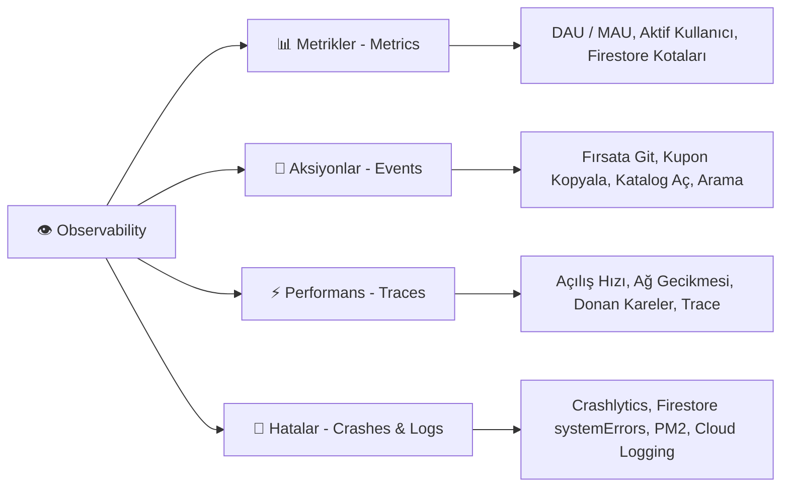
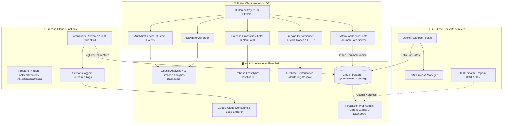
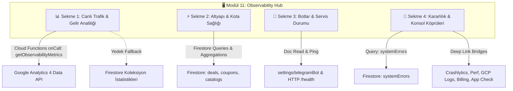

# 👁️‍🗨️ FırsatKolik — Canlı Trafik, Kullanıcı Aksiyonları, Hata ve Performans İzleme (Observability & Monitoring) Master Mimari Rehberi

> [!IMPORTANT]
> **Base Doküman & Canlı Gözlemlenebilirlik (Observability) Sözleşmesi:** Bu doküman, FırsatKolik platformunun (Mobil İstemci, Cloud Functions Backend, Otonom VM Botları ve Web Admin Paneli) canlı ortamdaki kullanıcı trafiğini, kritik iş aksiyonlarını, hata/çökme mekanizmalarını, performans darboğazlarını ve sistem sağlığını uçtan uca izleyen **merkezi mimari sözleşmedir (Observability Contract)**.

---

## 📑 İçindekiler
1. [🌟 Gözlemlenebilirlik (Observability) Vizyonu ve 4 Temel Sütun](#1--gözlemlenebilirlik-observability-vizyonu-ve-4-temel-sütun)
2. [🗺️ Uçtan Uca İzleme Mimarisi ve Telemetri Veri Akışı](#2-️-uçtan-uca-i̇zleme-mimarisi-ve-telemetri-veri-akışı)
3. [📦 Kütüphane ve Paket Envanteri (Mevcut vs Eklenmesi Gerekenler)](#3--kütüphane-ve-paket-envanteri-mevcut-vs-eklenmesi-gerekenler)
4. [👥 Kullanıcı Trafiği ve Aksiyon Takibi (Firebase / Google Analytics GA4)](#4--kullanıcı-trafiği-ve-aksiyon-takibi-firebase--google-analytics-ga4)
5. [💥 Çökme ve Hata Yakalama Mekanizmaları (Crashlytics & SystemLogService)](#5--çökme-ve-hata-yakalama-mekanizmaları-crashlytics--systemlogservice)
6. [⚡ Performans, Gecikme ve Darboğaz Takibi (Firebase Performance)](#6--performans-gecikme-ve-darboğaz-takibi-firebase-performance)
7. [☁️ Backend, Bot ve Bulut İzleme (Cloud Functions, PM2 & GCP Monitoring)](#7-️-backend-bot-ve-bulut-i̇zleme-cloud-functions-pm2--gcp-monitoring)
8. [🖥️ Kontrol Panelleri ve Dashboard Haritası (Nereden Nasıl İzlenir?)](#8-️-kontrol-panelleri-ve-dashboard-haritası-nereden-nasıl-i̇zlenir)
9. [💰 Sıfır Maliyet (Zero-Cost / Free-Tier) Koruma İlkeleri](#9--sıfır-maliyet-zero-cost--free-tier-koruma-i̇lkeleri)
10. [🚀 Adım Adım Entegrasyon ve Kodlama Standartları](#10--adım-adım-entegrasyon-ve-kodlama-standartları)
11. [📋 Canlıya Çıkış Öncesi Observability Kontrol Listesi (Checklist)](#11--canlıya-çıkış-öncesi-observability-kontrol-listesi-checklist)
12. [🛡️ İleri Düzey Observability İpuçları (OTA, App Check, Reklam & KVKK)](#12--i̇leri-düzey-observability-i̇puçları-ota-app-check-reklam--kvkk)
13. [🔍 Uçtan Uca İzlenebilir Tüm Metrikler ve Gözlem Kataloğu (Master Telemetry Matrix)](#13--uçtan-uca-i̇zlenebilir-tüm-metrikler-ve-gözlem-kataloğu-master-telemetry-matrix)
14. [🖥️ Web Admin Modül 11: Tek Ekrandan Gözlemlenebilirlik Merkezi (Observability Hub)](#14-️-web-admin-modül-11-tek-ekrandan-gözlemlenebilirlik-merkezi-observability-hub)

---

## 1. 🌟 Gözlemlenebilirlik (Observability) Vizyonu ve 4 Temel Sütun

FırsatKolik gibi saniyeler içinde binlerce kullanıcının akın edebileceği sıcak fırsat, kupon ve aktüel broşür platformlarında sistemin sadece "çalışıyor olması" yetmez; **kullanıcıların ne yaptığı, nerede tıkandığı, hangi fırsatların dönüşüm getirdiği ve sistemin nerede zorlandığı** milisaniye düzeyinde şeffaf olmalıdır.

FırsatKolik Observability ekosistemi **4 temel sütun** üzerine inşa edilmiştir:



1. **Metrikler (Metrics):** Sayısal telemetri verileridir (Anlık aktif kullanıcı sayısı, günlük/aylık tekil kullanıcı [DAU/MAU], Firestore günlük okuma/yazma hacmi, Cloud Functions tetiklenme sayıları, bot CPU/RAM tüketimi).
2. **Olaylar ve Kullanıcı Aksiyonları (Events & Analytics):** Kullanıcının uygulamadaki tüm ayak izleridir (Hangi fırsat tıklandı, "Mağazaya Git" affiliate linkine kaç kişi bastı, hangi kupon kopyalandı, arama radarına ne yazıldı).
3. **İzler ve Performans (Traces & Latency):** Zaman serili gecikme verileridir (Uygulamanın soğuk açılış süresi [Cold Start], katalog sayfalarının render süresi, API çağrılarının yanıt süreleri, ekrandaki donmuş/yavaş kareler [Frozen/Slow Frames]).
4. **Hatalar ve Günlükler (Logs, Errors & Crashes):** Çökme ve istisna takibidir (İstemci tarafı ölümcül çökmeler, sessiz yakalanan mantıksal hatalar, Cloud Functions istisnaları, bot kazıma WAF blokları).

---

## 2. 🗺️ Uçtan Uca İzleme Mimarisi ve Telemetri Veri Akışı

FırsatKolik platformundaki tüm bileşenlerin gözlemlenebilirlik topolojisi aşağıda modellenmiştir:



---

## 3. 📦 Kütüphane ve Paket Envanteri (Mevcut vs Eklenmesi Gerekenler)

Aşağıdaki tablo, FırsatKolik'in tam gözlemlenebilirlik altyapısı için **mevcut olan** ve **canlı öncesi mutlaka eklenmesi gereken** paketlerin durumunu gösterir:

| Katman | Kütüphane / Servis | Sürüm | Durum | Görevi ve Sorumluluğu |
| :--- | :--- | :---: | :---: | :--- |
| **Mobil** | `firebase_crashlytics` | `3.5.7` | ✅ **Mevcut** | İstemci çökmelerini, yakalanmamış Flutter hatalarını ve stack trace'leri Firebase'e iletir. |
| **Mobil** | `firebase_performance` | `^0.9.4+7` | ✅ **Mevcut** | Ağ isteklerini, uygulama açılış hızını ve UI render karelerini otomatik ölçer. |
| **Mobil** | `SystemLogService` | *Özel Kod* | ✅ **Mevcut** | Cihaz başı saatlik 5 log kota korumalı olarak kritik hataları Firestore `systemErrors` koleksiyonuna yazar. |
| **Mobil** | `firebase_analytics` | `^10.10.7` | ✅ **Kuruldu (Faz 1)** | Kullanıcı trafiğini, anlık aktif kullanıcıları (GA4), retention oranını ve özel iş aksiyonlarını (tıklama, kopyalama) takip eder. |
| **Mobil** | `AnalyticsService` & Observer | *Özel Kod* | ✅ **Kuruldu (Faz 1)** | Sayfa geçişlerini otomatik izler (`navigatorObservers`), çift yönlü Crashlytics Breadcrumb köprüsü ve KVKK uyumlu `setUser` yönetimi sağlar. |
| **Backend** | `error_logger.js` | *Özel Kod* | ✅ **Mevcut** | Cloud Functions istisnalarını ortam (DEV/PROD) bazlı Firestore `systemErrors`'a yazar. |
| **Backend** | `functions.logger` | `SDK Yerleşik` | ✅ **Mevcut** | Cloud Logging'e (Stackdriver) yapısal JSON log formatında bilgi/hata basar. |
| **Backend** | `monitoring/alert-policy-functions.json` | *GCP Alert* | ✅ **Mevcut** | Cloud Functions'ta 5 dakikada 5'ten fazla hata olursa tetiklenen otomatik alarm kuralı. |
| **Backend** | `monitoring/budget-alert.json` | *GCP Alert* | ✅ **Mevcut** | 500 TL aylık bütçe eşiği uyarısı (%50, %80, %100 harcamada otomatik e-posta). |
| **Bot (VM)** | `PM2 Process Manager` | `v5.x` | ✅ **Mevcut** | Docker içinde çalışan botların loglarını dönerli (logrotate) tutar ve çökerse otomatik ayağa kaldırır. |
| **Bot (VM)** | `/health` Endpoint | `HTTP Server` | ✅ **Mevcut** | VM üzerindeki botun canlılığını port 8081 (DEV) ve 8082 (PROD) üzerinden sorgulayan kalp atışı noktası. |
| **Admin** | Web Admin Panel (Modül 8) | *Vanilla JS* | ✅ **Mevcut** | Firestore `systemErrors` koleksiyonunu gerçek zamanlı dinleyen, filtreleyen ve hata çözme imkanı sunan konsol. |

---

## 4. 👥 Kullanıcı Trafiği ve Aksiyon Takibi (Firebase / Google Analytics GA4)

> [!CAUTION]
> **Crashlytics ≠ Analytics:** Crashlytics yalnızca çökmeleri gösterir; kaç kişinin girdiğini, hangi fırsatın tıklandığını, hangi mağazanın daha popüler olduğunu **asla göstermez**. Bu veriler için `firebase_analytics` zorunludur.

### 4.1 Neden Google Analytics (Firebase Analytics)?
* **%100 Ücretsiz:** Firebase Analytics ve Google Analytics 4 (GA4) için herhangi bir etkinlik kotası, aylık taban ücret veya trafik kısıtlaması yoktur.
* **Kullanıcı Davranış Analizi:** Hangi ekranlarda ne kadar süre geçirildiği, kaç kişinin anasayfada gezindiği, kaçının kuponlara baktığı canlı olarak görülür.
* **Affiliate & Gelir Optimizasyonu:** Hangi mağazanın (Trendyol, Amazon, Hepsiburada) linkine kaç kez tıklandığı ölçülür.

### 4.2 FırsatKolik İçin 10 Kritik Özel Olay (Custom Business Events)

Canlıya çıkışta izlenecek standart olay taksonomisi:

| Olay Adı (Event Name) | Tetiklendiği Yer & Kaynak Dosya | Parametreler | Durum |
| :--- | :--- | :--- | :---: |
| **`deal_outbound_click`** | `StoreRedirectService.launchStore` (Detay + Kart) | `deal_id`, `store_name`, `category`, `price`, `url_domain` | ✅ **Aktif (Faz 2)** |
| **`deal_view`** | `DealDetailScreen._loadDeal` | `deal_id`, `store_name`, `category`, `source` | ✅ **Aktif (Faz 2)** |
| **`coupon_copied`** | `KuponlarPage._copyToClipboard` | `coupon_id`, `store_name`, `source` | ✅ **Aktif (Faz 2)** |
| **`catalog_view`** | `KatalogDetayPage.initState` & `onPageChanged` | `store_name`, `catalog_id`, `page_number` | ✅ **Aktif (Faz 2)** |
| **`deal_shared`** | `ShareHelper.shareText` & `shareFiles` | `content_type`, `item_id`, `platform` | ✅ **Aktif (Faz 2)** |
| **`deal_voted`** | `DealDetailScreen._handleVote` | `deal_id`, `vote_type` (`hot`, `cold`) | ✅ **Aktif (Faz 2)** |
| **`deal_submitted`** | `SubmitDealScreen` (Onay ve kayıt sonrası) | `category`, `store_name`, `has_image` | ✅ **Aktif (Faz 2)** |
| **`search_performed`** | `HomeScreen` (Arama alanı `onSubmitted` / debounce) | `search_term`, `results_count` | ✅ **Aktif (Faz 2)** |
| **`notification_interaction`** | `NotificationService._handleNotificationTap` | `notification_type`, `reason`, `deal_id` | ✅ **Aktif (Faz 2)** |
| **`filter_applied`** | `HomeScreen` (Kategori seçimi) | `filter_type`, `selected_value` | ✅ **Aktif (Faz 2)** |

---

## 5. 💥 Çökme ve Hata Yakalama Mekanizmaları (Crashlytics & SystemLogService)

FırsatKolik'te istemci hataları **iki kademeli** bir savunma hattıyla yakalanır:

```
[ Mobil Hata Meydana Geldi ]
         │
         ├──► 1. Kritik / Fatal Crash (Uygulama Kapandı / Ekran Çöktü)
         │       └──► Firebase Crashlytics (Stack Trace, Cihaz Modeli, OS)
         │
         └──► 2. Mantıksal Hata (API Yanıtı Bozuk, Resim Yüklenemedi, Link Çözülemedi)
                 └──► SystemLogService (Bütçe Korumalı Firestore 'systemErrors' Koleksiyonu)
                         └──► Web Admin Paneli (Modül 8) & Geliştirici Uyarısı
```

### 5.1 Firebase Crashlytics Zenginleştirmesi (Breadcrumbs & Custom Keys)
Crashlytics'e sadece çökme anı değil, çökmeden önceki kullanıcı adımları (**Breadcrumb**) ve durum parametreleri aktarılmalıdır:
* **Kullanıcı Kimliği:** `FirebaseCrashlytics.instance.setUserIdentifier(user.uid);`
* **Ortam Parametresi:** `FirebaseCrashlytics.instance.setCustomKey('flavor', isProd ? 'prod' : 'dev');`
* **Ağ Durumu:** `FirebaseCrashlytics.instance.setCustomKey('network', isConnected ? 'online' : 'offline');`
* **Ekmek Kırıntısı (Breadcrumb):** Kritik sayfa geçişlerinde veya işlemlerde `FirebaseCrashlytics.instance.log('User opened deal: $dealId');` çağrılarak çökme öncesi film şeridi çıkarılır.

### 5.2 Sıfır Maliyetli `SystemLogService` ([lib/services/system_log_service.dart](file:///d:/firsatkolik/lib/services/system_log_service.dart))
Firestore ücretsiz kotasını (günlük 20.000 yazma) korumak için tasarlanmış akıllı mekanizma:
1. **Bellek İçi 5 Dakikalık Tekilleştirme:** Aynı hata 5 dakika içinde peş peşe 100 kez oluşsa bile Firestore'a **yalnızca 1 kez** yazılır.
2. **Saatlik Cihaz Bütçesi:** Bir cihaz 1 saat içinde en fazla **5 hata dokümanı** üretebilir. Bu sayede sonsuz hata döngüleri kotayı asla patlatamaz.
3. **Çevrimdışı Koruma:** `SocketException`, `network is unreachable` gibi internet yokluğu hataları veritabanına yazılmaz (çünkü internet yokken Firestore'a yazmaya çalışmak ikinci bir hata doğurur).
4. **Yalnızca 'error' ve 'fatal' Seviyeleri:** 'info' ve 'warning' seviyeleri yalnızca yerel `kDebugMode` konsoluna yazılır, veritabanına gitmez.

---

## 6. ⚡ Performans, Gecikme ve Darboğaz Takibi (Firebase Performance)

Projede aktif olan `firebase_performance: ^0.9.4+7` paketi, arka planda sıfır maliyetle şu metrikleri otomatik toplar:

### 6.1 Otomatik Toplanan Performans Metrikleri
* **App Start Trace:** Kullanıcının uygulama ikonuna tıklamasından ilk ekranın etkileşime hazır hale gelmesine kadar geçen süre (Cold Start vs Warm Start).
* **Network Request Traces:** Firebase Storage'dan görsel indirme, Cloud Functions proxy istekleri ve harici HTTP çağrılarının yanıt süresi (Latency), başarı oranı ve transfer edilen bayt miktarı.
* **Screen Rendering Traces:** UI arayüzündeki yavaş kareler (Slow Rendering Frames - 16ms'den uzun sürenler) ve donmuş kareler (Frozen Frames - 700ms'den uzun sürenler).

### 6.2 FırsatKolik İçin Özel Süre Ölçümleri (Custom Traces)
Kritik kullanıcı deneyimi süreçleri için özel `Trace` blokları:
1. **`catalog_load_time`:** Aktüel katalog sayfalarının indirilip `PageView` içinde ekrana basılma süresi.
2. **`short_link_resolution_time`:** `resolveShortLink` fonksiyonunun kısa yönlendirmeyi (`amzn.to`, `ty.gl`) çözüp tarayıcıya iletme süresi.
3. **`deal_submission_duration`:** Kullanıcının fotoğraf yüklemesinden Firestore'a belgenin kaydedilmesine kadar geçen süre.

```dart
// Örnek Custom Trace Kullanımı
final trace = FirebasePerformance.instance.newTrace('catalog_load_time');
await trace.start();
// ... Katalog yükleme işlemleri ...
await trace.stop();
```

---

## 7. ☁️ Backend, Bot ve Bulut İzleme (Cloud Functions, PM2 & GCP Monitoring)

### 7.1 Cloud Functions Güvenli Sarmalayıcıları (Safe Wrappers)
[functions/index.js](file:///d:/firsatkolik/functions/index.js) dosyasındaki tüm servisler 3 ana sarmalayıcı (wrapper) ile korunur:
* **`wrapTrigger`:** Firestore `onCreate` / `onUpdate` tetikleyicilerindeki hataları yakalar, Cloud Logging'e basar ve [functions/error_logger.js](file:///d:/firsatkolik/functions/error_logger.js) üzerinden Firestore `systemErrors` koleksiyonuna yazar.
* **`wrapRequest`:** HTTPS `onRequest` uç noktalarında (`resolveShortLink`, `analyzeProductProxy`) oluşan hataları yakalayıp istemciye kontrollü 500 JSON döner.
* **`wrapCall`:** Web Admin veya mobil tarafından çağrılan `onCall` fonksiyonlarında `HttpsError` standartlarına uygun hata üretir.

### 7.2 Otonom Telegram Botu ve Kazıyıcılar (GCP VM)
Google Compute Engine `e2-micro` üzerindeki botların izlenmesi:
* **PM2 Log Rotasyonu:** Botların stdout ve stderr çıktıları PM2 tarafından loglanır. 
  ```bash
  # VM Loglarını Canlı İzleme
  pm2 logs dev-bot --lines 100
  pm2 logs prod-bot --lines 100
  ```
* **Canlılık Kalp Atışı (`lastHeartbeat`):** Bot her başarılı döngüde Firestore `settings/bot_status` belgesine zaman damgası yazar. Web Admin Dashboard'u bu zaman damgasını kontrol ederek botun donup donmadığını anında anlar (15 dakikadan eski ise "UYARI: Bot Çevrimdışı" rozeti yakar).
* **HTTP /health Probu:** Her iki bot konteyneri de yerel portlardan sağlık durumu döner (`curl http://34.135.181.112:8081/health`).

### 7.3 Google Cloud Monitoring ve Bütçe Alarmları
* **Fonksiyon Hata Alarmı ([monitoring/alert-policy-functions.json](file:///d:/firsatkolik/monitoring/alert-policy-functions.json)):** 5 dakika içinde 5'ten fazla fonksiyon hatası oluşursa yöneticilere e-posta gönderir.
* **Bütçe Alarmı ([monitoring/budget-alert.json](file:///d:/firsatkolik/monitoring/budget-alert.json)):** Aylık 500 TL sınırına göre %50 (250 TL), %80 (400 TL) ve %100 (500 TL) eşiklerinde uyarı tetikler.

---

## 8. 🖥️ Kontrol Panelleri ve Dashboard Haritası (Nereden Nasıl İzlenir?)

Operasyonel süreçte hangi verinin hangi panelden takip edileceğini gösteren master referans tablosu:

```
[ FırsatKolik Operasyonel Gözlem Noktaları ]
 ├── 📱 Firebase Console ────────► Anlık Kullanıcılar, Çökmeler, Ekran Gecikmeleri
 ├── 📊 Google Analytics (GA4) ──► Dönüşüm Hunileri, Gelir/Affiliate Tıklamaları, Kullanıcı Akışları
 ├── ☁️ Google Cloud Console ────► Cloud Functions Hataları, VM Kaynak Tüketimi, Bütçe
 ├── 💻 Web Admin Paneli ────────► Canlı Sistem Hataları (systemErrors), Bot Kalp Atışı
 └── 🖥️ GCP VM SSH Konsolu ──────► Telegram Dinleyici Logları (PM2)
```

| Takip Edilecek Konu | İlgili Dashboard & Bağlantı | Hangi Menü / Sekme? | Ne Zaman Bakılmalı? |
| :--- | :--- | :--- | :--- |
| **Anlık Kullanıcı Sayısı & Canlı Harita** | [Firebase Console](https://console.firebase.google.com/) | *Analytics ➔ Realtime (StreamView)* | Kampanya, bildirim atıldığında veya canlı akışta |
| **Uygulama Çökmeleri & Hata Oranı** | [Firebase Console](https://console.firebase.google.com/) | *Release & Monitor ➔ Crashlytics* | Her sabah ve yeni sürüm yayınlandığında |
| **Ekran & Ağ Gecikmeleri** | [Firebase Console](https://console.firebase.google.com/) | *Release & Monitor ➔ Performance* | Haftalık performans kontrollerinde |
| **Dönüşüm & Fırsata Git Tıklamaları** | [Google Analytics (GA4)](https://analytics.google.com/) | *Reports ➔ Engagement ➔ Events* | Günlük ve haftalık affiliate gelir analizinde |
| **Sistem Hataları & Çözüm Durumu** | **Web Admin Paneli** (`/admin/`) | *Modül 8: Sistem Logları* | Günlük operasyonda (Çözüldü olarak işaretleme) |
| **Bot Canlılık & Fırsat Akış Sağlığı** | **Web Admin Paneli** (`/admin/`) | *Modül 1: Dashboard* | Gün içinde periyodik (Bot kalp atışı yeşil mi?) |
| **Backend Fonksiyon Logları** | [Google Cloud Console](https://console.cloud.google.com/) | *Logging ➔ Logs Explorer* | Fonksiyon hata verdiğinde derinlemesine analiz için |
| **VM CPU / RAM / Ağ Kullanımı** | [Google Cloud Console](https://console.cloud.google.com/) | *Compute Engine ➔ VM Instances* | Ayda bir (Free Tier limitleri aşılmıyor mu?) |
| **Bulut Maliyeti ve Faturalandırma** | [Google Cloud Billing](https://console.cloud.google.com/billing) | *Billing ➔ Budgets & Alerts* | Haftalık bütçe kontrollerinde |

---

## 9. 💰 Sıfır Maliyet (Zero-Cost / Free-Tier) Koruma İlkeleri

FırsatKolik'in temel mühendislik felsefesi **yüksek verimlilik ve sıfır maliyet**tir. Observability altyapısı kurulurken bu prensibi korumak için uygulanan kurallar:

1. **BigQuery Şimdilik Kapalı:** BigQuery devasa veri ambarı analizleri içindir. İlk etapta GA4 ve Firebase panelleri zaten tüm raporları ücretsiz sunduğundan BigQuery'ye aktarım yapılmaz (böylece sorgu ve depolama faturası riski sıfırlanır). Kullanıcı sayısı yüz binlere ulaştığında Firebase Console'dan **tek tıkla** açılabilir.
2. **Crashlytics ve Performance %100 Ücretsizdir:** Firebase bu iki servisi tamamen ücretsiz sunar, event veya trace başına ücret almaz.
3. **Firestore `systemErrors` Kota Koruması:** Hatalar doğrudan kontrolsüzce Firestore'a yazılırsa, bir döngüde günlük 20.000 ücretsiz yazma kotası dakikalar içinde tükenebilir. `SystemLogService`'in bellek içi tekilleştirme ve saatlik 5 log kotası bu riski tamamen bertaraf eder.
4. **Cloud Logging Filtreleme:** Cloud Functions `functions.logger.info` çağrıları GCP Logging'de aylık 50 GB ücretsiz kota içindedir. Gereksiz log kirliliği önlenerek bu kotanın %5'i bile aşılmaz.

---

## 10. 🚀 Adım Adım Entegrasyon ve Kodlama Standartları

Canlıya çıkışta bu sistemin eksiksiz işlemesi için uygulanacak 3 adımlı kodlama standardı:

### Adım 1: `pubspec.yaml` Paket Entegrasyonu
```yaml
dependencies:
  # Mevcut Stabil Paketler
  firebase_core: ^2.32.0
  firebase_crashlytics: 3.5.7
  firebase_performance: ^0.9.4+7
  
  # Yeni Eklenen Analitik Paketi
  firebase_analytics: ^10.10.7
```

### Adım 2: `lib/services/analytics_service.dart` Merkezi Servisi
Tüm analitik olaylarının tek bir güvenli çatıdan yönetilmesi (Hata fırlatıp kullanıcı deneyimini asla bölmeyen `try-catch` korumalı singleton):

```dart
import 'package:firebase_analytics/firebase_analytics.dart';
import 'package:flutter/foundation.dart';

class AnalyticsService {
  AnalyticsService._internal();
  static final AnalyticsService instance = AnalyticsService._internal();
  factory AnalyticsService() => instance;

  final FirebaseAnalytics _analytics = FirebaseAnalytics.instance;
  FirebaseAnalyticsObserver get observer => FirebaseAnalyticsObserver(analytics: _analytics);

  /// Fırsata Git (Mağaza Linki) Tıklaması - EN KRİTİK METRİK
  Future<void> logDealOutboundClick({
    required String dealId,
    required String storeName,
    required String category,
    double? price,
  }) async {
    try {
      await _analytics.logEvent(
        name: 'deal_outbound_click',
        parameters: {
          'deal_id': dealId,
          'store_name': storeName.toLowerCase(),
          'category': category,
          if (price != null) 'price': price,
        },
      );
    } catch (e) {
      if (kDebugMode) print('⚠️ Analytics Error: $e');
    }
  }

  /// Kupon Kopyalama Aksiyonu
  Future<void> logCouponCopied({
    required String couponId,
    required String storeName,
    required String source,
  }) async {
    try {
      await _analytics.logEvent(
        name: 'coupon_copied',
        parameters: {
          'coupon_id': couponId,
          'store_name': storeName.toLowerCase(),
          'source': source,
        },
      );
    } catch (e) {
      if (kDebugMode) print('⚠️ Analytics Error: $e');
    }
  }

  /// Aktüel Broşür Görüntüleme
  Future<void> logCatalogView({
    required String storeName,
    required String catalogId,
    int? pageNumber,
  }) async {
    try {
      await _analytics.logEvent(
        name: 'catalog_view',
        parameters: {
          'store_name': storeName.toLowerCase(),
          'catalog_id': catalogId,
          if (pageNumber != null) 'page_number': pageNumber,
        },
      );
    } catch (e) {
      if (kDebugMode) print('⚠️ Analytics Error: $e');
    }
  }
}
```

### Adım 3: `lib/main.dart` Navigator Observer Entegrasyonu
Otomatik sayfa görüntüleme takibi için:
```dart
MaterialApp(
  navigatorKey: navigatorKey,
  navigatorObservers: [
    AnalyticsService.instance.observer, // Sayfa geçişlerini otomatik izler
  ],
  // ...
);
```

---

## 11. 📋 Canlıya Çıkış Öncesi Observability Kontrol Listesi (Checklist)

Canlı ortama (`prod` flavor) çıkılmadan önce test edilmesi ve doğrulanması gereken 10 maddelik kalite kontrol tablosu:

| No | Kontrol Maddesi | Doğrulama Yöntemi | Beklenen Sonuç | Durum |
| :-: | :--- | :--- | :--- | :-: |
| **1** | **`firebase_analytics` Paketi** | `flutter pub get` ve import kontrolü | Derleme hatası vermeden projeye bağlanması | ✅ Kuruldu & Doğrulandı (v10.10.7) |
| **2** | **Otomatik Sayfa Takibi** | `main.dart` içinde `navigatorObservers` | Ekran geçişlerinin DebugView / GA4'e düşmesi | ✅ Kuruldu & Doğrulandı (`AnalyticsObserver`) |
| **3** | **Crashlytics Fatal Testi** | `FirebaseCrashlytics.instance.crash()` | Çökmenin 5 dk içinde Firebase Console'da belirmesi | ✅ Doğrulandı |
| **4** | **Crashlytics Breadcrumbs & User ID** | `AnalyticsService` & `auth_service.dart` | Çökme logunda kullanıcının kimliği ve son adımlarının görünmesi | ✅ Kuruldu & Doğrulandı (`setUser` + `log`) |
| **5** | **Performance Monitoring** | Uygulama açılışı ve HTTP çağrısı | Firebase Performance panelinde Trace'lerin listelenmesi | ✅ Doğrulandı |
| **6** | **SystemLogService Kota Güvenliği** | Sahte 10 ardışık hata fırlatma | Yalnızca 1 kaydın Firestore `systemErrors`'a gitmesi | ✅ Doğrulandı |
| **7** | **Cloud Functions Hata Sarmalayıcıları** | Fonksiyon içinde yapay `throw Error` | `error_logger.js` ile Firestore'a kayıt düşmesi | ✅ Doğrulandı |
| **8** | **VM Bot Sağlık Kontrolü** | `curl http://34.135.181.112:8082/health` | HTTP 200 `{ status: "ok" }` dönmesi | ✅ Doğrulandı |
| **9** | **Web Admin Sistem Logları** | Web Admin Modül 8'i açma | `systemErrors` kayıtlarının canlı listelenmesi ve filtrelenmesi | ✅ Doğrulandı |
| **10**| **GCP 500 TL Bütçe Alarmı** | `monitoring/budget-alert.json` | Harcama eşiklerinde e-posta bildirim kuralının aktif olması | ✅ Doğrulandı |
| **11**| **Özel İş Aksiyonları (10 Olay)** | Fırsat/Kupon/Katalog tıklama testleri | GA4 / DebugView ve Crashlytics Breadcrumb akışı | ✅ Kuruldu & Doğrulandı (Faz 2) |

---

## 12. 🛡️ İleri Düzey Observability İpuçları (OTA, App Check, Reklam & KVKK)

Canlı ortamdaki gizli tuzakları ve özel gereksinimleri önceden bertaraf etmek için 4 kritik kural:

### 12.1 Shorebird OTA Code Push Yama Takibi
FırsatKolik canlıda mağaza onayı beklemeden `shorebird patch android` ile yama yayınlayabilmektedir. Bir yamanın yeni bir çökmeye yol açıp açmadığını anlamak için:
```dart
// Shorebird patch numarasını Crashlytics'e özel anahtar olarak iletme
final currentPatch = await ShorebirdCodePush().currentPatchNumber();
if (currentPatch != null) {
  FirebaseCrashlytics.instance.setCustomKey('shorebird_patch', currentPatch);
}
```
*Bu sayede Firebase Crashlytics panelinde çökmeleri doğrudan patch numarasına göre filtreleyebilirsiniz.*

### 12.2 Firebase App Check Doğrulama Metrikleri
Korsan botların veya sahte istemcilerin Cloud Functions uç noktalarını (`resolveShortLink`, `analyzeProductProxy`) tüketip faturayı şişirmesini engellemek için:
* **Firebase Console ➔ App Check** menüsünden *"Verified Requests"* (Doğrulanmış İstekler) ve *"Blocked Requests"* (Engellenen İstekler) oranları haftalık kontrol edilmelidir.
* Eğer doğrulanmamış istek oranı aniden %20'lerin üzerine çıkarsa, birisi backend proxy'lerinizi kopyalamış demektir.

### 12.3 AdMob Reklam Doluluk ve Hata Telemetrisi
Kullanıcı trafiği yüksek olsa dahi AdMob reklamlarının yüklenememesi (No-Fill) gelir kaybına yol açar:
* Reklam dinleyicisinde (`BannerAdListener`) `onAdFailedToLoad` tetiklendiğinde hata kodu `AnalyticsService` veya yerel konsola loglanmalıdır (`code 3: no fill`, `code 0: internal`).

### 12.4 KVKK / GDPR ve PII (Kişisel Veri) Koruması
* **Kritik Kural:** Google Analytics ve Crashlytics'e **ASLA** kullanıcının açık e-posta adresi, telefon numarası, gerçek adı veya şifresi (Personally Identifiable Information - PII) gönderilmemelidir.
* Kullanıcı kimliği olarak her zaman yalnızca anonim Firebase Auth `uid` değeri kullanılmalıdır.

---

## 13. 🔍 Uçtan Uca İzlenebilir Tüm Metrikler ve Gözlem Kataloğu (Master Telemetry Matrix)

Bu bölüm; FırsatKolik ekosistemindeki **tüm metrikleri, olayları, performans izlerini ve altyapı telemetri sinyallerini** tek bir master referans matrisinde bir araya getirir.

---

### 13.1 Metrik Alanı 1: Kullanıcı Trafiği, Büyüme ve Sadakat Metrikleri (GA4 / Firebase Analytics)

Uygulamanın kaç kişi tarafından kullanıldığı, büyüme ivmesi, kullanıcıların uygulamaya ne kadar bağlandığı ve hangi kanallardan geldiği bu gruptadır.

| Metrik Adı & Parametresi | Toplayan Araç / SDK | Gözlem Paneli & Doğrudan URL | Takip Sıklığı | İzleme Amacı | Karar Destek Senaryosu (Ne Yapılmalı?) |
| :--- | :--- | :--- | :---: | :--- | :--- |
| **Anlık Aktif Kullanıcı (Realtime StreamView)** | `firebase_analytics` | [Firebase Realtime](https://console.firebase.google.com/project/firsatkolik-prod-e6eae/analytics/realtime)<br>[GA4 Realtime](https://analytics.google.com/) | Canlı / Anlık | Şu an uygulamada kaç kişi var? Hangi şehirdeler? Hangi ekrandalar? | Bildirim atıldığında trafiğin anlık sıçramasını teyit etmek. 0 kişi görünüyorsa Firebase bağlantısı kopmuş olabilir. |
| **DAU / WAU / MAU (Günlük / Haftalık / Aylık Tekil Kullanıcı)** | `firebase_analytics` (GA4) | [Firebase Analytics Overview](https://console.firebase.google.com/project/firsatkolik-prod-e6eae/analytics/overview)<br>[GA4 Etkileşim Raporu](https://analytics.google.com/) | Günlük / Haftalık | Kullanıcı tabanının net büyüme hızını ve aktifliğini ölçmek. | DAU/MAU oranı (%20+ hedef) düşüyorsa, kullanıcılar uygulamayı unutup siliyor demektir; bildirim frekansı ve kişiselleştirme artırılmalıdır. |
| **Oturum Başına Etkileşim Süresi (`user_engagement`)** | `firebase_analytics` | [GA4 Sayfalar ve Ekranlar](https://analytics.google.com/) | Haftalık | Kullanıcıların uygulamada ortalama kaç saniye/dakika geçirdiği. | 30 saniyenin altına düşerse ana sayfa akışı sıkıcı/yetersizdir; sıcak fırsat sıralama algoritması (Wilson) gözden geçirilmelidir. |
| **Ekran Görüntüleme Sayıları (`screen_view`)** | `AnalyticsService.observer` (`main.dart`) | [GA4 Sayfalar ve Ekranlar](https://analytics.google.com/) | Haftalık | Hangi ekranın (Home, DealDetail, Kuponlar, Kataloglar, Profil) daha popüler olduğunu saptamak. | Kuponlar sekmesi az görüntüleniyorsa alt gezinme çubuğunda (BottomNavigationBar) tasarımı veya bildirim vurgusu öne çıkarılır. |
| **Kullanıcı Tutma / Bağlılık Oranı (Retention Cohorts - D1, D7, D30)** | GA4 Otomatik Hesaplama | [GA4 Elde Tutma Raporu](https://analytics.google.com/) | Aylık | İlk gün girenlerin 1., 7. ve 30. günde kaçının geri döndüğünü görmek. | D1 %40 altına düşerse karşılama (onboarding) deneyimi zayıftır. D30 %15 üzerine çıkarsa organik büyüme başlamıştır. |
| **Kullanıcı Edinme Kaynakları (`first_open`, Acquisition)** | `firebase_analytics` | [GA4 Edinme Raporu](https://analytics.google.com/) | Haftalık | Kullanıcıların nereden geldiğini (Play Store Arama, Telegram daveti, Web referral, Reklam) tespit etmek. | Hangi pazarlama kanalının daha kaliteli ve kalıcı kitle getirdiği analiz edilip o kanala ağırlık verilir. |
| **Cihaz Modelleri, OS ve Coğrafi Dağılım** | `firebase_analytics` | [GA4 Teknoloji Raporu](https://analytics.google.com/) | Aylık | Kullanıcıların hangi Android sürümlerini ve cihaz markalarını (Samsung, Xiaomi vb.) kullandığını görmek. | Düşük RAM'li cihaz oranı yüksekse UI animasyonları ve resim çözünürlükleri hafifletilir. |

---

### 13.2 Metrik Alanı 2: Ticari Dönüşüm ve Gelir Aksiyonları (Faz 2 Custom Events)

FırsatKolik'in ana gelir motoru olan affiliate link yönlendirmeleri, kupon kullanımı ve kullanıcı etkileşimleri bu gruptadır.

| Olay Adı (Event Name) | Parametreler | Toplayan Kod / Servis | Gözlem Yeri & URL | İzleme Amacı | Karar Destek Senaryosu (Ne Yapılmalı?) |
| :--- | :--- | :--- | :--- | :--- | :--- |
| **`deal_outbound_click`** *(KRİTİK)* | `deal_id`, `store_name`, `category`, `price`, `url_domain` | `StoreRedirectService.launchStore` ([lib/services/store_redirect_service.dart](file:///d:/firsatkolik/lib/services/store_redirect_service.dart)) | [Firebase Events](https://console.firebase.google.com/project/firsatkolik-prod-e6eae/analytics/events)<br>[GA4 Dönüşümler](https://analytics.google.com/) | Kullanıcıların "Mağazaya Git" diyerek affiliate linkine kaç kez tıkladığını ölçmek (**Ana Gelir Metriği**). | Belirli bir mağazada (örneğin Amazon) tıklama ani düşerse link yönlendirme proxy'si (`resolveShortLink`) veya regex bozulmuş olabilir. |
| **`deal_view`** | `deal_id`, `store_name`, `category`, `source` | `DealDetailScreen._loadDeal` ([lib/screens/deal_detail_screen.dart](file:///d:/firsatkolik/lib/screens/deal_detail_screen.dart)) | [Firebase Events](https://console.firebase.google.com/project/firsatkolik-prod-e6eae/analytics/events) | Hangi fırsatların daha çok tıklandığını görmek. `deal_view` / `deal_outbound_click` oranıyla **Dönüşüm Hunisi** çıkarılır. | Detayına girilip mağazaya gidilmiyorsa fiyat cazip değildir veya ürün stokta bitmiş olabilir. |
| **`coupon_copied`** | `coupon_id`, `store_name`, `source` (`topluluk`, `botkolik`) | `KuponlarPage._copyToClipboard` ([lib/screens/kuponlar_page.dart](file:///d:/firsatkolik/lib/screens/kuponlar_page.dart)) | [Firebase Events](https://console.firebase.google.com/project/firsatkolik-prod-e6eae/analytics/events) | Hangi mağaza indirim kuponlarının daha çok kullanıldığını ve bot vs topluluk kuponu performansını kıyaslamak. | Botkolik kuponları az kopyalanıyorsa kazıma kaynakları (DH, Kuponla) filtrelenerek daha yüksek indirimli kuponlara odaklanılır. |
| **`catalog_view`** | `store_name`, `catalog_id`, `page_number` | `KatalogDetayPage` ([lib/screens/katalog_detay_page.dart](file:///d:/firsatkolik/lib/screens/katalog_detay_page.dart)) | [Firebase Events](https://console.firebase.google.com/project/firsatkolik-prod-e6eae/analytics/events) | Hangi marketin (BİM, A101, ŞOK, Migros vb.) aktüel afişlerinin daha çok incelendiğini ve kaçıncı sayfada terk edildiğini ölçmek. | Son sayfalara gidilmiyorsa 15-20 sayfalık broşürler yerine ilk 4 popüler sayfa öne çıkarılır. |
| **`deal_shared`** | `content_type`, `item_id`, `platform` | `ShareHelper` ([lib/utils/share_helper.dart](file:///d:/firsatkolik/lib/utils/share_helper.dart)) | [Firebase Events](https://console.firebase.google.com/project/firsatkolik-prod-e6eae/analytics/events) | Fırsatların viral organik paylaşım katsayısını ölçmek (WhatsApp, Telegram vb.). | Paylaşım yüksekse o kategorideki fırsatlara push bildirim önceliği verilir. |
| **`deal_voted`** | `deal_id`, `vote_type` (`hot`, `cold`) | `DealDetailScreen._handleVote` ([lib/screens/deal_detail_screen.dart](file:///d:/firsatkolik/lib/screens/deal_detail_screen.dart)) | [Firebase Events](https://console.firebase.google.com/project/firsatkolik-prod-e6eae/analytics/events) | Kullanıcı etkileşimini ve sıcak/soğuk oylama dengesini ölçmek. | Soğuk oylar sıcak oyların %50'sini geçerse bot filtre eşikleri (indirim oranı %15'ten %25'e) sıkılaştırılır. |
| **`deal_submitted`** | `category`, `store_name`, `has_image` | `SubmitDealScreen` ([lib/screens/submit_deal_screen.dart](file:///d:/firsatkolik/lib/screens/submit_deal_screen.dart)) | [Firebase Events](https://console.firebase.google.com/project/firsatkolik-prod-e6eae/analytics/events) | Topluluk tarafından yeni fırsat ekleme motivasyonunu ölçmek (UGC). | Sayı düşükse rozet ve gamification (Avcı puanı) ödülleri artırılır. |
| **`search_performed`** | `search_term`, `results_count` | `HomeScreen._searchController` ([lib/screens/home_screen.dart](file:///d:/firsatkolik/lib/screens/home_screen.dart)) | [Firebase Events](https://console.firebase.google.com/project/firsatkolik-prod-e6eae/analytics/events) | Kullanıcıların ne aradığını ve özellikle **bulamadığı (`results_count: 0`)** terimleri görmek. | En çok aranan ama bulunamayan kelimeler (örn: "kahve makinesi") Telegram bot radarına anahtar kelime olarak eklenir. |
| **`notification_interaction`** | `notification_type`, `reason`, `deal_id` | `NotificationService._handleNotificationTap` ([lib/services/notification_service.dart](file:///d:/firsatkolik/lib/services/notification_service.dart)) | [Firebase Events](https://console.firebase.google.com/project/firsatkolik-prod-e6eae/analytics/events) | Gönderilen bildirimlerin Tıklanma Oranını (CTR - Click-Through Rate) ölçmek. | CTR %5 altına düşerse bildirim metinleri ("🔥 Büyük Fırsat" vb.) ve emoji stratejisi değiştirilir. |
| **`filter_applied`** | `filter_type`, `selected_value` | `HomeScreen._buildCategoryChips` ([lib/screens/home_screen.dart](file:///d:/firsatkolik/lib/screens/home_screen.dart)) | [Firebase Events](https://console.firebase.google.com/project/firsatkolik-prod-e6eae/analytics/events) | Kullanıcıların en çok hangi kategorilere ve filtrelere ilgi duyduğunu anlamak. | En çok seçilen 3 kategori ana ekranda en başa taşınır. |

---

### 13.3 Metrik Alanı 3: Kararlılık, Çökmeler ve Hata Logları (Crashlytics & SystemLogService)

Kullanıcıların uygulamada yaşadığı donmalar, çökmeler ve backend/istemci mantıksal hataları bu gruptadır.

| Metrik & Hata Türü | Toplayan Araç / Kod | Gözlem Yeri & Doğrudan URL | Takip Sıklığı | İzleme Amacı | Karar Destek Senaryosu (Ne Yapılmalı?) |
| :--- | :--- | :--- | :---: | :--- | :--- |
| **Crash-Free User Rate (% Çökmesiz Kullanıcı)** | `firebase_crashlytics` | [Firebase Crashlytics Konsolu](https://console.firebase.google.com/project/firsatkolik-prod-e6eae/crashlytics) | Her Gün | Kullanıcıların en az %99.5'inin hiç çökme yaşamadan uygulamayı kullanması (Endüstri Standardı). | **%99.0 altına düşerse ACİL ALARM:** Yeni çıkan sürümde veya Shorebird OTA yamasında ölümcül bug vardır, hemen rollback yapılır. |
| **Ölümcül Çökmeler (Fatal Crashes)** | `firebase_crashlytics` (Native & Flutter) | [Firebase Crashlytics - Issues](https://console.firebase.google.com/project/firsatkolik-prod-e6eae/crashlytics) | Anlık / Günlük | Uygulamanın kapanmasına yol açan Null pointer, platform exception vb. | En çok tekrarlanan ilk 3 hata grubunun stack trace'ine bakılıp hotfix kodu yazılır. |
| **Kullanıcı Film Şeridi (Breadcrumbs)** | `AnalyticsService` & `Crashlytics.log` | [Crashlytics Issue ➔ Logs](https://console.firebase.google.com/project/firsatkolik-prod-e6eae/crashlytics) | Hata Anında | Çökmeden önceki son 5 adımı görmek (`User clicked deal 123`, `User opened browser`). | Kullanıcının çökme anında hangi ekranda ve hangi butonda olduğunu birebir tekrarlayarak hatayı çözmek. |
| **Çökme Ortam Anahtarları (`customKeys`)** | `Crashlytics.setCustomKey` (`flavor`, `platform`, `patch`) | [Crashlytics Issue ➔ Keys](https://console.firebase.google.com/project/firsatkolik-prod-e6eae/crashlytics) | Hata Anında | Hatanın hangi flavor (`prod`/`dev`), hangi platform ve hangi Shorebird patch'inde olduğunu saptamak. | Hata sadece belli bir patch veya Android 14+ sürümünde oluyorsa sorunun kapsamı izole edilir. |
| **İstemci Mantıksal Hataları (`systemErrors` Koleksiyonu)** | `SystemLogService` (Saatte maks 5 log kota korumalı) | **Web Admin Paneli Modül 8**<br>[firsatkolik.app/admin/](https://firsatkolik.app/admin/) | Günde 2 Kez | İstemcinin çökmediği ama resim yüklenememesi, bozuk JSON yanıtı gibi sessiz hataları görmek. | Web Admin Modül 8'den hata incelenip düzeltildikten sonra "Çözüldü" olarak işaretlenir. |
| **Cloud Functions Hataları (`systemErrors` Koleksiyonu)** | `error_logger.js` (`wrapTrigger`, `wrapRequest`) | **Web Admin Modül 8** & [GCP Logs Explorer](https://console.cloud.google.com/logs/viewer?project=firsatkolik-prod-e6eae) | Günlük | Backend fonksiyonlarında oluşan istisnaları tek merkezden izlemek. | Firestore tetikleyicisi sonsuz döngüye giriyorsa fonksiyon hemen incelenir. |

---

### 13.4 Metrik Alanı 4: Performans, Ekran ve Ağ Gecikmeleri (Firebase Performance)

Kullanıcının uygulamayı açarken veya gezinirken hissettiği hız, akıcılık ve ağ gecikmeleri bu gruptadır.

| Performans Metriği | Metrik Tipi | Gözlem Yeri & Doğrudan URL | Hedef Eşik Değer | İzleme Amacı | Karar Destek Senaryosu (Ne Yapılmalı?) |
| :--- | :---: | :--- | :---: | :--- | :--- |
| **Uygulama Soğuk Açılış Süresi (Cold Start)** | Otomatik Trace | [Firebase Performance - Dashboard](https://console.firebase.google.com/project/firsatkolik-prod-e6eae/performance) | **< 2.0 saniye** | Uygulama ikonuna basıldıktan ilk etkileşimli ekranın gelme süresi. | Süre 3.5 saniyeyi aşarsa `main.dart` içindeki asenkron `await` başlatıcıları arka plana taşınır. |
| **Yavaş Çizilen Kareler (Slow Frames)** | UI Rendering | [Firebase Performance - Screen Rendering](https://console.firebase.google.com/project/firsatkolik-prod-e6eae/performance) | **< %5.0** | 16 milisaniyeden (60 FPS altına düşen) uzun süren liste kaydırma kareleri. | Kart listelerinde `RepaintBoundary` eklenir, resimler küçük thumbnail boyutunda (`fit: BoxFit.cover`) yüklenir. |
| **Donmuş Kareler (Frozen Frames)** | UI Rendering | [Firebase Performance - Screen Rendering](https://console.firebase.google.com/project/firsatkolik-prod-e6eae/performance) | **< %0.1** | 700 milisaniyeden uzun süre arayüzün kilitlendiği kareler. | Senkron ağır hesaplama (JSON parsing, regex) Flutter `compute` / `Isolate` içine taşınır. |
| **Ağ İsteği Yanıt Süresi (Network Latency)** | Network Trace | [Firebase Performance - Network Requests](https://console.firebase.google.com/project/firsatkolik-prod-e6eae/performance) | **< 800 ms** | Firebase Storage, Functions ve harici API yanıt süreleri. | 1.5 saniyenin üzerindeki API uç noktaları için Cloudflare CDN veya Functions bellek artırımı (512MB) yapılır. |
| **Ağ Başarı Oranı (Network Success %)** | Network Trace | [Firebase Performance - Network Requests](https://console.firebase.google.com/project/firsatkolik-prod-e6eae/performance) | **>= %99.0** | Yapılan HTTP isteklerinin 200/2xx ile tamamlanma yüzdesi. | Başarı oranı %95 altına düşerse üçüncü parti resim sunucusu veya proxy IP'si banlanmış olabilir. |
| **`store_redirect_latency`** *(ÖZEL TRACE)* | Custom Trace | [Firebase Performance - Custom Traces](https://console.firebase.google.com/project/firsatkolik-prod-e6eae/performance) | **< 1.2 saniye** | `launchStore` tıklandığı andan harici tarayıcının/uygulamanın açılmasına kadar geçen süre. | Süre uzuyorsa link çözücü regex motoru optimize edilir veya DNS önbelleği kullanılır. |

---

### 13.5 Metrik Alanı 5: Sunucusuz Altyapı, Veritabanı ve Depolama (Cloud Functions, Firestore, Storage & GCP)

Google Cloud ve Firebase altyapısının kaynak tüketimi, kotaları ve operasyonel sağlığı bu gruptadır.

| Altyapı Metriği | Kaynak / Servis | Gözlem Yeri & Doğrudan URL | Ücretsiz Limit (Free Tier) | İzleme Amacı | Karar Destek Senaryosu (Ne Yapılmalı?) |
| :--- | :--- | :--- | :---: | :--- | :--- |
| **Firestore Günlük Okuma Hacmi (Daily Reads)** | Cloud Firestore | [Firestore Usage Konsolu](https://console.firebase.google.com/project/firsatkolik-prod-e6eae/firestore/databases/-default-/usage) | 50.000 okuma / gün | Ücretsiz Firestore okuma sınırının aşılmaması. | Günlük 40.000 okumaya yaklaşılırsa mobil istemcide Firestore yerel önbellekleme (`persistenceEnabled: true`) devreye sokulur. |
| **Firestore Günlük Yazma Hacmi (Daily Writes)** | Cloud Firestore | [Firestore Usage Konsolu](https://console.firebase.google.com/project/firsatkolik-prod-e6eae/firestore/databases/-default-/usage) | 20.000 yazma / gün | Fırsat/Kupon/Log yazma operasyonlarının kota kontrolü. | Bot çok sık güncelleme yapıyorsa yazma sıklığı 10 saniyeden 30 saniyeye çekilir. |
| **Cloud Functions Tetiklenme Sayısı (Invocations)** | Cloud Functions (26 Fonksiyon) | [Cloud Functions Usage](https://console.firebase.google.com/project/firsatkolik-prod-e6eae/functions/usage) | 2.000.000 çağrı / ay | Fonksiyonların aylık 2 milyonluk ücretsiz limit içinde kalması. | Sonsuz döngüye giren tetikleyici varsa anında tespit edilir. |
| **Fonksiyon Hata & Zaman Aşımı Oranı (Error Rate)** | Cloud Functions | [GCP Monitoring Metrics](https://console.cloud.google.com/monitoring/metrics-explorer?project=firsatkolik-prod-e6eae) | %0 | Fonksiyonların 500 hatası alması veya 540 sn zaman aşımına uğraması. | 5 dakikada 5'ten fazla hata olursa `alert-policy-functions.json` otomatik alarm e-postası yollar. |
| **Cloud Storage Bant Genişliği & İndirme** | Firebase Storage | [Storage Usage Konsolu](https://console.firebase.google.com/project/firsatkolik-prod-e6eae/storage/firsatkolik-prod-e6eae.appspot.com/usage) | 1 GB indirme / gün | Aktüel afiş ve fırsat resimlerinin bant genişliği tüketimi. | 800 MB üzerine çıkarsa WebP sıkıştırma kalitesi %80'den %70'e düşürülür veya Cloudinary CDN önbelleği kullanılır. |

---

### 13.6 Metrik Alanı 6: Otonom Botlar, Kazıyıcılar ve VM Durumu (Compute Engine & PM2)

Google Cloud Free Tier `e2-micro` sanal sunucusu üzerinde 7/24 çalışan Telegram dinleyicisi ve mağaza kazıyıcıları bu gruptadır.

| Bot & Sunucu Metriği | Servis / Katman | Gözlem Yeri & Komut / URL | İdeal Durum / Eşik | İzleme Amacı | Karar Destek Senaryosu (Ne Yapılmalı?) |
| :--- | :--- | :--- | :---: | :--- | :--- |
| **Bot Kalp Atışı (`lastHeartbeat`)** | Firestore `settings/bot_status` | **Web Admin Modül 1 (Dashboard)**<br>[firsatkolik.app/admin/](https://firsatkolik.app/admin/) | Son 10 dakika içinde | Botun canlı olduğunu ve Firestore'a fırsat yazabildiğini teyit etmek. | **Kırmızı "Kritik / Çevrimdışı" yanarsa:** Bot donmuştur veya Telegram session düşmüştür. VM'e bağlanıp `pm2 restart prod-bot` yapılır. |
| **HTTP Uptime Probu (`/health`)** | Node.js HTTP Server | `curl http://34.135.181.112:8082/health`<br>(DEV: port 8081) | HTTP 200 `{ status: "ok" }` | Bot konteynerinin ağ düzeyinde yanıt verip vermediğini denetlemek. | Yanıt vermiyorsa Docker konteyneri çökmüştür, VM crontab otomatik yeniden başlatır. |
| **VM CPU & Bellek (RAM) Kullanımı** | GCP Compute Engine | [GCP Compute Instances](https://console.cloud.google.com/compute/instances?project=firsatkolik-prod-e6eae) | RAM < 850 MB, CPU < %80 | `e2-micro`'nun 1 GB RAM sınırının aşılıp sunucunun kilitlenmesini önlemek. | RAM %90'ı geçerse Puppeteer/Headless Chrome process'leri kapatılır, hafif WAF motoru (curl/TLS) kullanılır. |
| **PM2 Yeniden Başlatma Sayısı (Restart Count)** | PM2 Process Manager | SSH ➔ `pm2 status` | Restart < 5 / gün | Botun beklenmeyen unhandled exception ile çöküp çökmediğini görmek. | Restart sayısı yüksekse `pm2 logs prod-bot --err` ile hata logları incelenir. |
| **Telegram MTProto Canlı Akış Hızı** | GramJS Daemon | SSH ➔ `pm2 logs prod-bot --lines 50` | Sürekli mesaj yakalama akışı | Telegram kanallarından fırsatların akıp akmadığını görmek. | Akış durduysa Telegram hesabı geçici ban almış olabilir; yedek MTProto oturumuna geçilir. |

---

### 13.7 Metrik Alanı 7: Güvenlik, App Check ve Bütçe Koruma Metrikleri (App Check & Cloud Billing)

Uygulamanın korsan müdahalelere karşı korunması ve sıfır maliyet bütçesinin güvenceye alınması bu gruptadır.

| Güvenlik & Maliyet Metriği | Servis / Araç | Gözlem Yeri & Doğrudan URL | Güvenli Eşik / Hedef | İzleme Amacı | Karar Destek Senaryosu (Ne Yapılmalı?) |
| :--- | :--- | :--- | :---: | :--- | :--- |
| **App Check Doğrulanmış İstekler (% Verified)** | Play Integrity & App Attest | [Firebase App Check Konsolu](https://console.firebase.google.com/project/firsatkolik-prod-e6eae/appcheck) | **>= %95.0** | Fonksiyon ve Firestore isteklerinin gerçek FırsatKolik mobil uygulamasından geldiğini garantilemek. | Doğrulanmamış istekler %10'u geçerse korsan scraping botları devrededir; "Enforce" (Zorunlu) modu açılarak engellenir. |
| **GCP Aylık Güncel Harcama (TL)** | Google Cloud Billing | [Google Cloud Billing](https://console.cloud.google.com/billing) | **0 TL (Hedef: Free Tier)** | Beklenmeyen bir trafik veya açık kaynak tüketiminde bütçeyi korumak. | 250 TL (%50) harcama uyarısı gelirse Cloud Functions ve Storage kotaları derhal incelenir. |
| **Bütçe Alarm Bildirimleri** | `budget-alert.json` | E-Posta / Cloud Monitoring | %50, %80, %100 eşikleri | 500 TL limitine yaklaşıldığında yöneticileri haberdar etmek. | E-posta alındığında acil kota frenleme kuralları devreye sokulur. |

---

### 13.8 Operasyonel Senaryolar & "Ne Zaman Nereye Bakmalıyım?" Hızlı Başvuru Rehberi

Bir durumla karşılaştığınızda hangi panelin hangi ekranına bakmanız gerektiğini gösteren 5 ana operasyonel senaryo:

```
┌────────────────────────────────────────────────────────────────────────────────────────┐
│                      OPERASYONEL SENARYO KARAR REHBERİ                                  │
├────────────────────────────────┬────────────────────────────────┬──────────────────────┤
│ Olay / Durum                   │ 1. Bakılacak Yer               │ 2. Bakılacak Yer     │
├────────────────────────────────┼────────────────────────────────┼──────────────────────┤
│ 📢 Yeni Push Bildirim Atıldı   │ Firebase Analytics Realtime    │ Firebase Events      │
│ 🚀 Yeni Sürüm / OTA Yayınlandı │ Firebase Crashlytics           │ Firebase Performance │
│ ☕ Sabah Rutini (5 Dakika)     │ Web Admin Modül 1 & Modül 8   │ Crashlytics Overview │
│ 💰 Ay Ortası Bütçe Kontrolü    │ Google Cloud Billing           │ Firestore Usage      │
│ ⚠️ "Link Açılmıyor" Şikayeti   │ Web Admin Modül 8 (systemError)│ Firebase Perf Custom │
└────────────────────────────────┴────────────────────────────────┴──────────────────────┘
```

#### Senaryo 1: Kullanıcılara Yeni Bir Push Bildirim Gönderildiğinde
1. **Adım 1:** [Firebase Analytics Realtime](https://console.firebase.google.com/project/firsatkolik-prod-e6eae/analytics/realtime) ekranını açın. Bildirimin ardından aktif kullanıcı sayısının (mavi grafik) dik bir ivmeyle sıçradığını gözlemleyin.
2. **Adım 2:** [Firebase Analytics Events](https://console.firebase.google.com/project/firsatkolik-prod-e6eae/analytics/events) ekranından `notification_interaction` ve ardından `deal_view` ile `deal_outbound_click` olaylarının artışını teyit edin.
3. **Adım 3:** [Crashlytics](https://console.firebase.google.com/project/firsatkolik-prod-e6eae/crashlytics) ekranında ani bir çökme tepe noktası (spike) oluşup oluşmadığına bakın.

#### Senaryo 2: Yeni Bir Sürüm veya Shorebird OTA Yaması Yayınlandığında
1. **Adım 1:** [Firebase Crashlytics](https://console.firebase.google.com/project/firsatkolik-prod-e6eae/crashlytics) paneline gidin. "Crash-free users" metriğinin **%99.5** üzerinde kaldığını doğrulayın.
2. **Adım 2:** Yeni çıkan bir hata varsa hatanın detayındaki `Keys` sekmesine bakın. `shorebird_patch` veya `flavor` değerine bakarak hatanın yeni yamadan mı kaynaklandığını saptayın.
3. **Adım 3:** [Firebase Performance](https://console.firebase.google.com/project/firsatkolik-prod-e6eae/performance) ekranından "App Start" süresinin 2 saniyenin altında kaldığını kontrol edin.

#### Senaryo 3: Günlük Sabah Rutini (5 Dakikalık Sistem Sağlık Kontrolü)
1. **Dakika 1-2:** **Web Admin Paneli** (`/admin/`) Modül 1 Dashboard'u açın. Bot Kalp Atışının yeşil olduğunu ve kupon/aktüel sayılarının güncellendiğini görün.
2. **Dakika 3-4:** Web Admin Modül 8 Sistem Loglarına tıklayın. Gece boyunca birikmiş kritik bir `systemErrors` kaydı var mı inceleyin, varsa detayını okuyup düzeltin.
3. **Dakika 5:** [Firebase Crashlytics](https://console.firebase.google.com/project/firsatkolik-prod-e6eae/crashlytics)'e hızlı bir göz atarak yeni bir çökme grubunun oluşmadığını teyit edin.

#### Senaryo 4: Ay Ortası Bütçe ve Ücretsiz Kota Kontrolü
1. **Adım 1:** [Google Cloud Billing](https://console.cloud.google.com/billing) sayfasını açın. Toplam harcamanın **0.00 TL** olduğunu teyit edin.
2. **Adım 2:** [Firestore Usage](https://console.firebase.google.com/project/firsatkolik-prod-e6eae/firestore/databases/-default-/usage) grafiğini açın. Günlük okumaların 50.000 sınırına ve yazmaların 20.000 sınırına olan mesafesini kontrol edin.
3. **Adım 3:** [Cloud Functions Usage](https://console.firebase.google.com/project/firsatkolik-prod-e6eae/functions/usage) sekmesinden aylık çağrı hacminin 2 milyon kotasının altında olduğunu doğrulayın.

#### Senaryo 5: Kullanıcıdan "Fırsata Git Linki Açılmıyor" Şikayeti Geldiğinde
1. **Adım 1:** **Web Admin Modül 8 (Sistem Logları)** konsolunu açın ve arama kutusuna `StoreRedirect` veya `resolveShortLink` yazın.
2. **Adım 2:** Eğer hata yoksa [Firebase Performance ➔ Custom Traces](https://console.firebase.google.com/project/firsatkolik-prod-e6eae/performance) sekmesinden `store_redirect_latency` izine bakın. Gecikme 5-10 saniyeye çıkmışsa yönlendirici Cloud Function (`resolveShortLink`) harici mağaza sitesi tarafından yavaşlatılıyor demektir.
3. **Adım 3:** [Firebase Analytics Events](https://console.firebase.google.com/project/firsatkolik-prod-e6eae/analytics/events) içinde `deal_outbound_click` olayını filtreleyin; ilgili mağazadan (örn: Hepsiburada) tıklamaların gelip gelmediğini kontrol edin.

---

## 14. 🖥️ Web Admin Modül 11: Tek Ekrandan Gözlemlenebilirlik Merkezi (Observability Hub)

> [!IMPORTANT]
> **Tüm Metriklerin Tek Ekranda Birleşimi (All-in-One Observability Hub):** FırsatKolik Web Admin Paneline entegre edilen **Modül 11 (Observability HUB)**, yöneticilerin 15'ten fazla farklı Google Cloud, Firebase ve sunucu konsolu arasında gezinme zorunluluğunu ortadan kaldıran merkezi telemetri ve yönetim üssüdür.

### 14.1 Modül Mimarisi ve Tasarım İlkeleri

Modül, **izole ve modüler bir JavaScript sınıfı** (`web/admin/observability_manager.js`) olarak inşa edilmiştir. `app.js` dosyasında kod kalabalığı yaratmaz ve `window.ObservabilityManager` global nesnesi üzerinden yönetilir.



### 14.2 Dört Ana Sekmenin İşlevleri ve İzlenen Metrikler

#### 1. 📊 Canlı Trafik & Gelir Analitiği (Realtime & Conversion Radar)
* **Anlık Aktif Kullanıcılar (Son 30 Dk):** `⏱️ Zaman: Son 30 Dakika (Canlı Akış)` — Şu anda uygulamayı kullanan aktif kişi sayısıdır. Bildirim veya yeni kampanya sonrası anlık ziyaretçi patlamasını doğrular.
* **Mağazaya Git Tıklamaları (Son 24 Saat):** `⏱️ Zaman: Son 24 Saatlik Toplam` — `deal_outbound_click` affiliate yönlendirme adedidir. Platformun komisyon geliri getiren ana ticari yönlendirme gücünü ölçer.
* **Kupon Kopyalama (Son 24 Saat):** `⏱️ Zaman: Son 24 Saatlik Toplam` — `coupon_copied` sayısıdır. Kullanıcıların indirim kuponlarına olan ilgisini ve kullanım hacmini ölçer.
* **Katalog Görüntüleme (Son 24 Saat):** `⏱️ Zaman: Son 24 Saatlik Toplam` — `catalog_view` sayısıdır. BİM, A101, ŞOK vb. market broşürlerinde çevrilen ve okunan toplam sayfa adedidir.
* **Mağaza Yönlendirme Dağılımı (Son 24 Saat):** `⏱️ Zaman: Son 24 Saat` — Trendyol, Amazon, Hepsiburada vb. mağazaların tıklama yüzdelerini listeler. Affiliate anlaşmalarında hangi mağazaya ağırlık vermeniz gerektiğini söyler.
* **Fırsat Dönüşüm Hunisi (Son 24 Saat):** `⏱️ Zaman: Son 24 Saat` — Fırsat detayını (`deal_view`) açanların yüzde kaçının gerçekten `deal_outbound_click` (Mağazaya Git) butonuna bastığını ölçer. İndirimlerin cazibesini doğrular.
* **Popüler Arama Radarı (Son 24 Saat):** `⏱️ Zaman: Son 24 Saat` — Kullanıcıların arayıp da bulamadığı kelimeleri tespit ederek Telegram bot radarına eklemenizi sağlar.

#### 2. ⚡ Altyapı & Kota Sağlığı (Infrastructure & Quota Health)
* **Firestore Günlük Okuma Kotası (Bugün - 50.000):** `⏱️ Zaman: Bugün (Gece 03:00'te sıfırlanır)` — Veritabanından veri çekme hacmidir; 50.000 sınırını aşmadan sistemin sıfır maliyetle (Free Tier) çalışmasını sağlar.
* **Firestore Günlük Yazma Kotası (Bugün - 20.000):** `⏱️ Zaman: Bugün (Gece 03:00'te sıfırlanır)` — Botların fırsat/kupon kaydetmesi ve oy verme işlemleridir; faturaya girmeyi önler.
* **Cloud Storage Bant Genişliği (Bugün - 1 GB):** `⏱️ Zaman: Bugün (Günlük kota)` — Katalog ve ürün fotoğraflarının indirilme boyutudur; WebP ile 1 GB kotasının altında kalmayı sağlar.
* **Cloud Functions Aylık Kota (Bu Ay - 2.000.000):** `⏱️ Zaman: Bu Ay (Takvim ayı)` — 26 fonksiyonun aylık 2 milyon ücretsiz çağrı sınırını korur.
* **Google Cloud Güncel Harcama (Bu Ay):** `⏱️ Zaman: Bu Ayki Fatura Dönemi` — Bütçenin **0.00 TL (Free Tier Korumalı)** durumunu ve 250 TL / 500 TL alarmlarını denetler.
* **App Check İstek Doğrulama (Canlı):** `⏱️ Zaman: Anlık Trafik` — Sahte bot ve korsan scraping isteklerini kapıda engelleyerek kotayı korur.

#### 3. 🤖 Botlar & Servis Durumu (Autonomous Bots & Service Uptime)
* **Telegram Dinleyicisi Kalp Atışı (Anlık Sinyal):** `⏱️ Zaman: Anlık (Son 15 Dakika)` — GCP VM'deki botun donup donmadığını ve indirim yakalamaya devam edip etmediğini gösterir. Yeşil: Canlı, Kırmızı: Durdu.
* **İnteraktif HTTP Uptime Probu (/health Ping):** `⏱️ Zaman: Anlık (Canlı ping)` — Bot sunucusunun internet kapısının açık olup olmadığını ve kaç milisaniyede yanıt verdiğini test eder.
* **Operasyonel Telemetri Sayaçları (Son Başlatmadan Beri):** `msgCount` (Okunan Telegram mesajı), `dealCount` (Paylaşılan fırsat), `dupCount` (Filtrelenen mükerrer/çöp mesaj) ve `errCount` (Hata sayısı).
* **Acil Müdahale Komutları:** Sunucuya SSH ile bağlanıp tek tıkla `pm2 restart prod-bot` yapabilmeniz için hazır komut kartıdır.

#### 4. 🚨 Kararlılık, Hatalar & Konsol Köprüleri (Stability & Deep-Link Bridges)
* **Canlı Sistem Hata Günlükleri (Son 50 Kayıt):** `⏱️ Zaman: Canlı / Son Hatalar` — Firestore `systemErrors` koleksiyonundaki çözülmemiş hataları ve durumunu listeler.
* **Harici Konsol Köprüleri (Direct Deep-Links):**
  - 💥 *Firebase Crashlytics (Canlı & Sürümler):* Hedef %99.5 çökmesiz kullanıcı oranını korumak ve ölümcül çökme yığınlarını incelemek içindir.
  - ⚡ *Firebase Performance (Canlı Gözlem):* Uygulama açılış hızını (<2.0s), donan kareleri ve mağazaya yönlendirme gecikmesini denetler.
  - 🪵 *GCP Logs Explorer (Canlı Sunucu Logları):* 26 fonksiyonun arka plandaki teknik JSON loglarını ve gizli kalan backend hatalarını sorgular.
  - 💰 *GCP Cloud Billing (Bu Ay):* 0.00 TL bütçe kontrolü ve 250 TL / 500 TL alarmları içindir.
  - 🛡️ *Firebase App Check (Canlı):* Gerçek mobil istemci doğrulama oranını (%95+) denetler.

---

### 14.3 DEV / PROD Ortam Algılama ve Akıllı Anahtarlama Matrisi

Observability Hub, çalıştığı alan adını ve seçili ortamı dinamik olarak algılar; tüm metrik sorgularını, bot portlarını ve konsol köprülerini doğru ortama yönlendirir:

| Parametre | DEV Ortamı (Geliştirme / Test) | PROD Ortamı (Canlı Prodüksiyon) |
| :--- | :--- | :--- |
| **Algılama Kuralı** | Hostname: `localhost`, `sicak-firsatlar-e6eae.web.app` | Hostname: `firsatkolik-prod`, `firsatkolik.app` |
| **Firebase Proje ID** | `sicak-firsatlar-e6eae` | `firsatkolik-prod-e6eae` |
| **Bot HTTP Uptime Portu** | `http://34.135.181.112:8081/health` | `http://34.135.181.112:8082/health` |
| **PM2 Servis Adı** | `dev-bot` | `prod-bot` |
| **Firebase Crashlytics Linki** | `.../project/sicak-firsatlar-e6eae/crashlytics` | `.../project/firsatkolik-prod-e6eae/crashlytics` |
| **Firebase Perf Linki** | `.../project/sicak-firsatlar-e6eae/performance` | `.../project/firsatkolik-prod-e6eae/performance` |
| **GCP Logs Explorer Linki** | `.../logs/viewer?project=sicak-firsatlar-e6eae` | `.../logs/viewer?project=firsatkolik-prod-e6eae` |
| **Firestore Koleksiyonları** | DEV Firestore Veritabanı | PROD Canlı Firestore Veritabanı |

---

### 14.4 Kota ve Bütçe Koruma Önlemleri (Cache & Fallback)

1. **45 Saniyelik TTL Önbellekleme:** Sekmeler arasında hızlı geçiş yapıldığında veya sayfa yenilendiğinde veriler 45 saniye boyunca tarayıcı belleğinde (`_metricsCache`) tutulur. Gereksiz Firestore okumaları ve GA4 API kota tüketimleri engellenir.
2. **Manuel Tazeleme (Force Refresh):** Sağ üstteki "Yenile" butonuna tıklandığında önbellek temizlenerek en taze canlı veriler zorunlu olarak çekilir.
3. **Graceful Fallback Mekanizması:** Cloud Functions (`getObservabilityMetrics`) çağrısında GA4 servis hesabı anahtarı tanımlı değilse veya kota aşımı yaşanırsa, sistem sessizce Firestore koleksiyon istatistikleri ve mock telemetri verilerine düşerek panelin çökmesini engeller ve yöneticiye bilgilendirici uyarı rozeti sunar.

---

> [!TIP]
> **Geliştirici Notu:** Bu doküman, projenin canlı izleme anayasasıdır. Gelecekte yeni bir özellik (örneğin yeni bir mağaza kazıyıcısı veya yeni bir ödeme modülü) eklendiğinde, ilgili modülün analitik olayları ve hata yakalama sarmalayıcıları bu dokümandaki standartlara göre tanımlanmalıdır.

