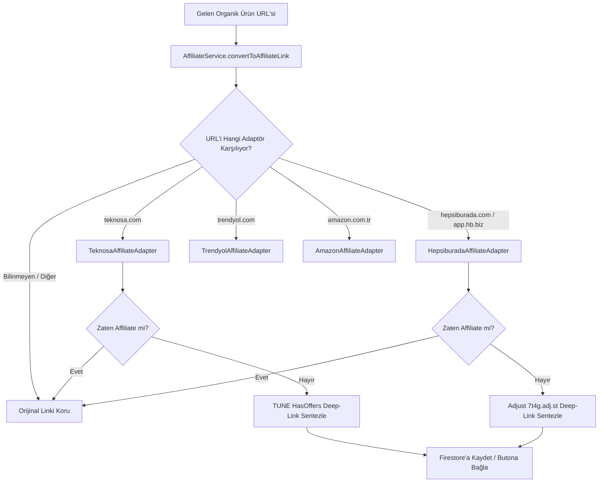
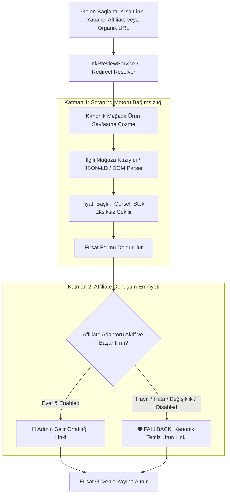

# FırsatKolik Gelir Ortaklığı (Affiliate) Link Dönüştürme ve Mağaza Stratejileri Rehberi

> [!NOTE]
> Bu doküman, FırsatKolik platformundaki gelir ortaklığı (affiliate / paylaş kazan) altyapısını, link dönüştürme felsefesini, mimari tasarımını ve mağaza bazlı stratejilerini detaylandıran teknik kılavuzdur.

---

## 📑 İçindekiler
1. [📌 1. Amaç ve İhtiyaç Analizi](#-1-amaç-ve-ihtiyaç-analizi-neden-böyle-bir-sisteme-ihtiyaç-duyuldu)
2. [🧭 2. Çözüm Metotları Karşılaştırması ve Başarı Oranları](#-2-çözüm-metotları-karşılaştırması-ve-başarı-oranları-success-rate)
3. [🏪 3. Başarılı Referans Vakalar: Teknosa (TUNE) ve Hepsiburada (Adjust) Modelleri](#-3-başarılı-referans-vakalar-case-studies-teknosa-ve-hepsiburada-modelleri)
4. [🏛️ 4. Projedeki Modüler Mimari Tasarımı](#-4-projedeki-modüler-mimari-tasarımı)
5. [🎛️ 5. Admin Panellerinde Dönüştürme ve Onay Mantığı (Mobil & Web)](#-5-admin-panellerinde-dönüştürme-ve-onay-mantığı-mobil--web)
6. [📊 6. Mağaza Durum Matrisi ve Test Durumu](#-6-mağaza-durum-matrisi-ve-test-durumu)
7. [🔮 7. Gelecek İçin Alternatif Stratejiler](#-7-gelecek-için-alternatif-stratejiler-teknosa-yöntemi-çalışmazsa-ne-yapılmalı)
8. [📝 8. Geliştirici Kılavuzu: Yeni Bir Mağaza Adaptörü Nasıl Eklenir?](#-8-geliştirici-kılavuzu-yeni-bir-mağaza-adaptörü-nasıl-eklenir)
9. [🛡️ 9. Hata Toleransı, Fallback ve Dayanıklılık Mimarisi](#-9-hata-toleransı-fallback-ve-dayanıklılık-mimarisi-resilience--fallback-architecture)

---

## 📌 1. Amaç ve İhtiyaç Analizi: Neden Böyle Bir Sisteme İhtiyaç Duyuldu?

FırsatKolik, topluluk ve otonom botlar tarafından beslenen bir indirim ve fırsat paylaşım platformudur. Sisteme her gün yüzlerce farklı e-ticaret linki eklenir. Platformun sürdürülebilirliği ve finansal gelir modeli, kullanıcıların bu fırsat linklerine tıklayarak yaptıkları alışverişlerden elde edilen **gelir ortaklığı (affiliate) komisyonlarına** dayanmaktadır.

### Karşılaşılan Temel Problem
1. **Organik Linkler:** Kullanıcılar veya botlar fırsat paylaşırken genellikle mağazanın standart/organik ürün linkini yapıştırırlar (örneğin `https://www.teknosa.com/...-p-12345`). Bu link üzerinden yapılan alışverişlerde platform komisyon **kazanamaz**.
2. **Kullanıcı Oturumu ve Token Çıkmazı:** E-ticaret mağazalarının "Paylaş Kazan" veya "Tavsiyeni Paylaş" sistemleri (Teknosa, Hepsiburada vb.), komisyon linki üretebilmek için kullanıcının mağazada **giriş yapmış (login) olmasını** şart koşar.
3. **WAF ve Bot Korumaları (Cloudflare / Akamai):** Sunucu tarafından mağazanın link üretme API'sine (örn. `POST /shareWin/{id}`) istek atmaya çalışıldığında:
   * `cf_clearance` ve oturum çerezleri istemcinin IP adresine ve TLS parmak izine kriptografik olarak kilitlidir.
   * Sunucudan (Cloud Run / VM) atılan istekler `403 Forbidden` WAF engeline takılır.
   * Çerezlerin süresi dolar (session expiration) ve sistem sürekli patlayarak devasa bir bakım maliyeti doğurur.

**Hedef:** Organik olarak gelen herhangi bir mağaza ürün linkini; **hiçbir login/oturum yükü olmadan, Cloudflare WAF engeline takılmadan ve harici istek atmadan, milisaniyeler içerisinde adminin kendi affiliate linkine dönüştüren modüler bir motor** inşa etmek.

---

## 🧭 2. Çözüm Metotları Karşılaştırması ve Başarı Oranları (Success Rate)

Affiliate link üretimi için değerlendirilen 4 temel mimari yaklaşım:

| Yöntem | Çalışma Mantığı | WAF / Bot Riski | Hız / Gecikme | Success Rate (Başarı Oranı) | Bakım Maliyeti |
| :--- | :--- | :--- | :--- | :--- | :--- |
| **Yol A: Sunucu Tarafı curl / API POST** | Sunucudan mağazanın link üretme API'sine login çerezleriyle istek atmak. | ❌ **Çok Yüksek** (cf_clearance IP'ye kilitlidir, 403 yer) | Yavaş (~1.5s) | **%5 - %15** (Sürekli patlar) | 🔴 Çok Yüksek |
| **Yol B: Mobil İstemci Native WebSession** | Admin'in telefonundaki yerel WebView/CookieManager üzerinden arka planda fetch çalıştırmak. | ✅ **Sıfır** (Gerçek mobil IP + gerçek WebKit) | Orta (~800ms) | **%95** | 🟡 Düşük-Orta |
| **Yol C: Bulut VM Headless Worker** | GCP VM üzerinde Playwright/Chromium ile oturumu canlı tutup browser context'inden link üretmek. | ⚠️ **Düşük-Orta** (Headless bot korumaları aşarsa) | Yavaş (~2-3s) | **%80** | 🟠 Orta |
| **Yol D: TUNE / Algoritmik Sentezleme (Seçilen)** | Mağazanın arka plandaki affiliate takip motorunu tersine mühendislikle çözüp matematiksel olarak deep-link üretmek. | ✅ **SIFIR RİSK** (Hiçbir istek atılmaz) | **Anında (0 ms)** | **%100** | 🟢 Sıfır |

---

## 🏪 3. Başarılı Referans Vakalar (Case Studies): Teknosa, Hepsiburada, Amazon ve İncehesap Modelleri

FırsatKolik'te devreye alınan ve sistemin "altın standardı" haline gelen dört öncü model, **Teknosa**, **Hepsiburada**, **Amazon Türkiye** ve **İncehesap** mağazaları üzerinde gerçekleştirilmiştir.

Klasik yöntemlerin aksine (oturum açma zorunluluğu, WAF engelleri ve sunucu gecikmeleri), mağazaların arka plandaki küresel affiliate/attribution ve kısa link mimarileri tersine mühendislikle çözülmüş ve **algoritmik sentezleme / yönlendirme çözümleme yöntemi** hayata geçirilmiştir.

### 🌟 Sağlanan Temel Kazanımlar:
* **0 ms Gecikme:** Sunucuya veya harici API'ye hiçbir ağ isteği atılmadan, cihaz üzerinde anında affiliate linki üretilir.
* **Sıfır WAF/Cloudflare/Akamai Riski:** Hiçbir POST çağrısı yapılmadığı için güvenlik duvarlarına ve bot korumalarına takılma riski sıfırdır.
* **Kesintisiz Retargeting & Anti-Hijack:** Kullanıcı başkasına ait bir Paylaş Kazan, LinkGelir veya Amazon Associates linki paylaştığında, link milisaniyeler içinde unwrap edilip adminin affiliate kimliğine devredilir.
* **0 ms Yerel Uygulama Açılışı (Zero Browser / Zero Flicker):** Hepsiburada (`hbapp://`) ve Amazon (Android App Links / `com.amazon.mShop.android.shopping`) ile harici tarayıcı yüzü görülmeden doğrudan yerel alışveriş uygulaması açılır.
* **%100 Test Başarısı:** Flutter (48/48) ve Node.js (20/20) birim testleriyle tüm senaryolar uçtan uca doğrulanmıştır.

> [!TIP]
> **Canlıya alınan mağazaların müstakil teknik rehberleri:**
> 1. 👉 **[Teknosa Gelir Ortaklığı (Paylaş Kazan) ve TUNE Mimarisi Kılavuzu](file:///d:/firsatkolik/documentation/scraping-ve-botlar/affiliate/teknosa_affiliate_ve_paylas_kazan_rehberi.md)** (TUNE HasOffers / `rdr.btrck.com`)
> 2. 👉 **[Hepsiburada Gelir Ortaklığı (LinkGelir) ve Adjust Mimarisi Kılavuzu](file:///d:/firsatkolik/documentation/scraping-ve-botlar/affiliate/hepsiburada_affiliate_ve_linkgelir_rehberi.md)** (Adjust Universal Deep-Link / `7t4g.adj.st`)
> 3. 👉 **[Amazon Gelir Ortaklığı (Associates TR) ve firsatkolik-21 Mimarisi Kılavuzu](file:///d:/firsatkolik/documentation/scraping-ve-botlar/affiliate/amazon_affiliate_ve_associates_rehberi.md)** (Amazon Associates / `tag=firsatkolik-21`)
> 4. 👉 **[İncehesap Gelir Ortaklığı (Paylaştıkça Kazan) Rehberi](file:///d:/firsatkolik/documentation/scraping-ve-botlar/affiliate/incehesap_affiliate_ve_paylas_kazan_rehberi.md)** (İncehesap `/u/{code}/` & IBAN Nakit Ödeme)

---

## 🏛️ 4. Projedeki Modüler Mimari Tasarımı

Her mağazanın kuralları ve parametreleri birbirinden tamamen izole edilmiş, Strategy Pattern tabanlı bir adaptör mimarisine dönüştürülmüştür:

```
lib/services/affiliate/
├── base_affiliate_adapter.dart               -> Ortak adaptör arayüzü (BaseAffiliateAdapter)
├── affiliate_service.dart                    -> Merkezi dispatcher ve mağaza tespit servisi
└── adapters/
    ├── teknosa_affiliate_adapter.dart        -> Teknosa TUNE HasOffers Adaptörü (CANLI)
    ├── hepsiburada_affiliate_adapter.dart    -> Hepsiburada Adjust Universal Link Adaptörü (CANLI)
    ├── amazon_affiliate_adapter.dart         -> Amazon Associates Adaptörü (CANLI)
    ├── incehesap_affiliate_adapter.dart      -> İncehesap Paylaştıkça Kazan Adaptörü (CANLI)
    ├── trendyol_affiliate_adapter.dart       -> Trendyol Adaptörü (Demo/Taslak)
    ├── n11_affiliate_adapter.dart            -> N11 Adaptörü (Demo/Taslak)
    └── gittigidiyor_affiliate_adapter.dart   -> GittiGidiyor Adaptörü (Demo/Taslak)
```



### Ortak Dosyaların İzolasyonu:
* [`deal_link_utils.dart`](file:///d:/firsatkolik/lib/screens/deal_detail/deal_link_utils.dart) ve [`admin_screen.dart`](file:///d:/firsatkolik/lib/screens/admin_screen.dart) içerisindeki tüm mağaza kodları temizlenmiş, tek satırlık `AffiliateService.convertToAffiliateLink(url)` yönlendirmesine bağlanmıştır.
* Web Admin tarafında [`web/admin/affiliate_manager.js`](file:///d:/firsatkolik/web/admin/affiliate_manager.js) bağımsız adaptörleri ile devreye alınmıştır.

---

## 🎛️ 5. Admin Panellerinde Dönüştürme ve Onay Mantığı (Mobil & Web)

FırsatKolik'te gelir ortaklığı dönüşümü **mükerrer işlem yükünü önleyen, sıfır gecikmeli ve emniyet kalkanlı (Fast-Path + Safety Net)** iki aşamalı bir yaşam döngüsüne sahiptir:

```mermaid
flowchart TD
    subgraph Aşama 1: Birincil Üretim (Paylaşım Anı - deal_service.dart)
        A[Kullanıcı / Bot Linki Ekler: Organik veya Kısa Link] --> B[AffiliateService.resolveAndConvertToAffiliate]
        B --> C[cleanUrl: Orijinal Saf Mağaza Linki]
        B --> D[link: Admin TUNE Affiliate Linki]
        C --> E[(Firestore deals Koleksiyonu)]
        D --> E
        E --> F[Fırsat Admin Onay Kuyruğuna Düşer: 🟢 Affiliate Hazır]
    end

    subgraph Aşama 2: Onay ve Yayın (Admin Paneli - _approveDeal)
        F --> G{Link Zaten Affiliate mi?}
        G -->|EVET: %99 Standart Durum| H[⚡ HIZLI YOL / FAST-PATH]
        H --> I[0 ms: Mükerrer hesaplama yapılmaz]
        I --> J[Zaten hazır olan link 'Mağazaya Git' butonu arkasında yayına girer: isApproved=true]
        
        G -->|HAYIR: %1 Eski / Organik Kayıt| K[🛡️ EMNİYET AĞI / SAFETY NET]
        K --> L[Tek seferlik otomatik affiliate dönüşümü yapılır]
        L --> J
    end
```

### 🌟 Temel İlke: Temiz URL (`cleanUrl`) vs Affiliate URL (`link`) ve "Mağazaya Git" Butonu

FırsatKolik'te kullanıcı deneyimi (UX) ile platformun gelir modeli birbirinden net çizgilerle ayrılmıştır:
* **Kullanıcı Cephesi (`cleanUrl` / `deal.displayUrl`):** Kullanıcıların gördüğü, Fırsat Detay ekranında *"Mağaza linkini kopyala"* dendiğinde panoya kopyalanan ve WhatsApp/Telegram paylaşımlarına eklenen link her zaman **temiz/organik mağaza linkidir**. Kullanıcılar asla karmaşık reklam yönlendirme kodları (`rdr.btrck.com`, UTM, takip tag'leri) görmez.
* **Gelir Cephesi (`link` / `url`):** Yalnızca *"Mağazaya Git"* butonunda çalışan ve komisyon kazanımı sağlayan aktif affiliate yönlendirme linkidir. Fırsat ilk paylaşıldığı anda hesaplanır ve veritabanında hazır tutulur.
* **Admin Çoklu Görünüm (Dual View):** Hem Mobil hem Web Admin düzenleme ekranlarında her iki URL bağımsız olarak görüntülenir ve yönetilir:
  1. **Orijinal Mağaza Linki (`cleanUrl`):** Temiz ürün linki. *"Orijinal Linki Aç"* ve *"Orijinalden Affiliate Üret"* butonları yer alır.
  2. **Aktif Affiliate Linki (`link` / `url`):** Üretilen komisyon linki. *"Affiliate Linki Test Et"* butonu yer alır.
  Kaydetme anında Firestore'a hem `cleanUrl` hem de `link`/`url` birlikte yazılır.

---

### 1. 📱 Mobil Admin Uygulaması Entegrasyonu

#### A. İki Farklı Paylaşım Senaryosu ve Otomatik Yönetim (Case 1 & Case 2):
* **Case 1: Kullanıcı Organik Mağaza Linki Paylaştığında (Örn. `teknosa.com/...-p-123`):**
  * Fırsat kaydedilirken ([`deal_service.dart`](file:///d:/firsatkolik/lib/services/deal_service.dart)), link ilgili mağaza adaptörü tarafından koşulsuz olarak admin affiliate linkine dönüştürülür.
  * `cleanUrl` alanına organik ürün linki, `link` alanına ise doğrudan üretilen affiliate linki yazılır. Fırsat admin onayına kalsa dahi affiliate linki ilk andan itibaren hazırdır.
  * Admin onay ekranında kart üzerinde doğrudan `🟢 [{Mağaza} Affiliate linki hazır]` rozeti çıkar.
* **Case 2: Kullanıcı Başkasının "Paylaş Kazan" veya Yabancı Affiliate/Kısa Linkini Paylaştığında:**
  * **Durum A (Başka bir şahsa ait affiliate linki):** Sistem `isAlreadyAffiliate` kontrolünde takip kimliğini (örneğin TUNE `source` parametresini) sorgular. Eğer link başkasına aitse, hedef ürün URL'si anında ayıklanır (unwrap) ve admin kimliğiyle yeniden affiliate linkine dönüştürülür (Retargeting / Anti-Hijack).
  * **Durum B (Yönlendirmeli Kısa Linkler - `paylaskazan.teknosa.com`, `hb.biz`, `sl.n11.com`, `ty.gl`):** `AffiliateService.resolveAndConvertToAffiliate` motoru arka planda kısa linki HTTP header üzerinden kanonik ürün URL'sine çözer ve ardından adminin affiliate linkine dönüştürür.
  * Paylaşım anında ([`deal_service.dart`](file:///d:/firsatkolik/lib/services/deal_service.dart)) `cleanUrl` alanına saf ürün linki, `link` alanına ise adminin affiliate linki yazılarak hem veritabanı kirliliği önlenir hem de komisyon hakkı korunur.

#### B. Liste Kartı Üzerinde Canlı Rozet, Hızlı Yol (Fast-Path) ve Emniyet Ağı ([`admin_screen.dart`](file:///d:/firsatkolik/lib/screens/admin_screen.dart))
1. **Dinamik Durum Rozeti:** Onay bekleyen her fırsat kartı render edilirken `AffiliateService.getAdapter(deal.link)` ile taranır:
   * Eğer link gerçekten adminin kendi affiliate linki ise (varsayılan durum):  
     👉 `🟢 [{Mağaza Adı} Affiliate linki hazır]` (Örn. *Teknosa Affiliate linki hazır*)
   * Eğer link dönüştürülebilir bir mağazaya aitse VE henüz admin linkine dönüştürülmemişse (eski/organik kayıtlar):  
     👉 `🟠 [{Mağaza Adı} linki (Onaylanınca otomatik affiliate'e dönüştürülür)]` (Örn. *Teknosa linki*)
2. **Tek Tıkla Onay (`_approveDeal`):** Admin fırsatı doğrudan **"Onayla"** butonuyla onayladığında:
   * **⚡ Hızlı Yol (Fast-Path):** Link zaten paylaşım anında affiliate yapılmışsa hiçbir mükerrer hesaplama veya harici ağ çağrısı yapılmaz (0 ms). Fırsat doğrudan `isApproved: true` olarak onaylanır; veritabanında zaten hazır bekleyen affiliate linki doğrudan kullanıcıların *"Mağazaya Git"* butonu arkasında aktifleşir.
   * **🛡️ Emniyet Ağı (Safety Net):** Yalnızca eski bir sistemden kalmış veya manuel düzenlemede organik bırakılmış istisnai kayıtlarda onay fonksiyonu linki affiliate'e dönüştürür ve `cleanUrl` alanını doldurur. Admin'e `Fırsat Onaylandı & Affiliate Linke Dönüştürüldü! ✅🔗` bildirimi verilir.

#### C. Detaylı Düzenleme Bottom Sheet'i ([`admin_edit_sheet.dart`](file:///d:/firsatkolik/lib/screens/deal_detail/admin_dialogs/admin_edit_sheet.dart))
* "Düzenle" butonuna tıklandığında açılan bottom sheet içerisinde **Bölüm 4: Bağlantı & Affiliate (Çoklu Görünüm)** yer alır:
  * 🌐 **Orijinal Mağaza Linki (`cleanUrl`):** Kullanıcılara gösterilecek temiz link. Yanında *"Orijinal Linki Aç"* ve *"Orijinalden Affiliate Üret"* butonları.
  * 🔗 **Aktif Affiliate Linki (`link`):** Mağazaya Git butonunun açacağı affiliate linki. Yanında *"Affiliate Linki Test Et"* butonu.
* **Otomatik Hazırlık & Emniyet Kalkanı:**
  * Sheet açıldığı anda `linkController`, mevcut link henüz bir affiliate linki değilse arka planda otomatik dönüştürülerek doldurulur. Link zaten affiliate ise hazır hali korunur.
  * Admin butona basmayı unutsa bile "Değişiklikleri Kaydet" butonuna basıldığında `handleSave` fonksiyonu link zaten hazırsa mükerrer işlem yapmaz; link boşsa veya organik kalmışsa emniyet kalkanı olarak türetir ve Firestore'a eksiksiz yazar.

---

### 2. 🌐 Web Admin Paneli Entegrasyonu

#### A. Fırsat Düzenleme Modalı ([`web/admin/app.js`](file:///d:/firsatkolik/web/admin/app.js) -> `showDealModal`)
* Düzenleme modalında **"Bağlantı & Affiliate (Çoklu Görünüm)"** kartı yer alır:
  * 🌐 **`#editCleanUrl` (Orijinal Mağaza Linki):** Temiz ürün linki + *"Orijinal Linki Aç"* butonu + *"Orijinalden Affiliate Üret"* butonu (`#convertToAffiliateBtn`).
  * 🔗 **`#editAffiliateUrl` (Aktif Affiliate Linki):** Üretilen affiliate linki + *"Affiliate Test Et"* butonu (`#previewAffiliateBtn`) + canlı durum rozeti (`#affiliateStatus`).
* **Otomatik Hazırlık:** Modal açıldığı anda link henüz affiliate değilse otomatik olarak `convertToAffiliateLink` ile sentezlenerek `#editAffiliateUrl` inputuna atanır ve yeşil durum rozeti (`✅ Teknosa TUNE affiliate linki hazır ve aktif`) görüntülenir.

#### B. Hızlı Onay ve Kayıt Emniyeti (`approveDeal` & `saveDealChanges`)
* Fırsatlar tablosundaki yeşil check (onayla) butonuna tıklandığında `approveDeal()` fonksiyonu linki otomatik kontrol eder, eksikse affiliate linkine dönüştürür, `cleanUrl` alanını doldurur ve veritabanına kaydeder.
* Modal formundan "Kaydet" veya "Onayla" yapıldığında `saveDealChanges()` fonksiyonu durum ne olursa olsun (`pending`, `active` vb.) URL'i `convertToAffiliateLink` filtresinden geçirerek hem `cleanUrl` hem de `link`/`url` alanlarını eksiksiz günceller.

---

### 3. Çift Kademeli Güvenlik ve Emniyet Matrisi

| Ekran / İşlem Noktası | Manuel Dönüştürme Butonu | Canlı Link Test Butonu | Otomatik Dönüşüm Kalkanı |
| :--- | :---: | :---: | :---: |
| **Mobil Admin (Liste Kartı)** | — | — | ✅ **Tam Otomatik** (`_approveDeal`) |
| **Mobil Admin (Düzenleme Paneli)** | ✅ `Affiliate Linke Dönüştür` | ✅ `Linki Test Et` | ✅ **Kayıt Emniyeti** (`handleSave`) |
| **Web Admin (Tablo Hızlı Onayı)** | — | — | ✅ **Tam Otomatik** (`approveDeal`) |
| **Web Admin (Düzenleme Modalı)** | ✅ `#convertToAffiliateBtn` | ✅ `#previewLinkBtn` | ✅ **Kayıt Emniyeti** (`saveDealChanges`) |

---

## 📊 6. Mağaza Durum Matrisi ve Test Durumu

> [!NOTE]
> Şu an itibariyle **Teknosa**, **Hepsiburada**, **Amazon Türkiye** ve **İncehesap** adaptörleri uçtan uca test edilmiş, reverse-engineering doğrulaması yapılmış ve canlıya hazır hale getirilmiştir. Diğer mağazalar demo/taslak şablonlar olarak eklenmiştir; testleri ilerleyen fazlarda gerçekleştirilecektir.

| Mağaza | Kullanılan Yöntem | Durum | Teknik Notlar |
| :--- | :--- | :--- | :--- |
| **Teknosa** | **TUNE (HasOffers) Deep-Link Sentezleme** | 🟢 **Tam Test Edildi (Canlı)** | `rdr.btrck.com` üzerinden sıfır istek ile UUID ve UTM enjeksiyonu. [Kılavuza Git](file:///d:/firsatkolik/documentation/scraping-ve-botlar/affiliate/teknosa_affiliate_ve_paylas_kazan_rehberi.md) |
| **Hepsiburada** | **Adjust (7t4g.adj.st) Universal Deep-Link Sentezleme** | 🟢 **Tam Test Edildi (Canlı)** | 0 ms Adjust universal deep-link sentezleme, anti-hijack retargeting, 4 canlı linkle doğrulandı. [Kılavuza Git](file:///d:/firsatkolik/documentation/scraping-ve-botlar/affiliate/hepsiburada_affiliate_ve_linkgelir_rehberi.md) |
| **Amazon** | **Associates TR `tag=firsatkolik-21` & Android App Links** | 🟢 **Tam Test Edildi (Canlı)** | 0 ms istemci sentezleme, ASIN ayıklama, anti-hijack, App Links ile doğrudan yerel Amazon App açılışı. [Kılavuza Git](file:///d:/firsatkolik/documentation/scraping-ve-botlar/affiliate/amazon_affiliate_ve_associates_rehberi.md) |
| **İncehesap** | **Paylaştıkça Kazan `/u/{code}/` + WAF Bypass (Doğrudan Dinamik)** | 🟢 **Tam Test Edildi (Canlı)** | 24h çerez, IBAN nakit ödeme, Cloudflare WAF bypass (`WhatsApp` UA), doğrudan anlık canlı POST ile ~200 ms dinamik üretim (sıfır hardcode / sıfır önbellek karmaşası). [Kılavuza Git](file:///d:/firsatkolik/documentation/scraping-ve-botlar/affiliate/incehesap_affiliate_ve_paylas_kazan_rehberi.md) |
| **Trendyol** | `boutiqueId` Query Parametresi | 🟡 *Demo / Taslak (Test Edilmedi)* | İleride test edilecek. Yöntem çalışmazsa alternatif aranacak. |
| **N11** | `ref` Referans ID Parametresi | 🟡 *Demo / Taslak (Test Edilmedi)* | İleride test edilecek. Yöntem çalışmazsa alternatif aranacak. |
| **GittiGidiyor** | `affiliateId` Parametresi | 🔴 *Pazardan Çekildi (eBay kapattı)* | GittiGidiyor 2022'de Türkiye pazarındaki faaliyetlerini sonlandırmıştır. |
| **Çiçeksepeti** | **TUNE HasOffers Mimarisi** | 🟡 *Saha Araştırması Tamamlandı* | Teknosa ile birebir aynı TUNE motoru (`partners.lolacicek.com`). [Raporu İncele](file:///d:/firsatkolik/documentation/scraping-ve-botlar/affiliate/turkiye_e_ticaret_affiliate_saha_arastirmasi_raporu.md) |

> 📚 **Kapsamlı Saha Araştırması:** Türkiye'deki tüm e-ticaret sitelerinin affiliate altyapıları, Fenomio, Adjust, TUNE ve komisyon modelleri için bkz:  
> 👉 **[Türkiye E-Ticaret Gelir Ortaklığı Saha Araştırması ve Uygulanabilirlik Raporu](file:///d:/firsatkolik/documentation/scraping-ve-botlar/affiliate/turkiye_e_ticaret_affiliate_saha_arastirmasi_raporu.md)**

---

## 🔮 7. Gelecek İçin Alternatif Stratejiler: Teknosa Yöntemi Çalışmazsa Ne Yapılmalı?

Eğer ilerleyen dönemde test edilecek bir mağaza (veya Teknosa'nın gelecekteki olası bir altyapı değişikliği) doğrudan parametre ile deep-link oluşturulmasına izin vermez ve **mutlaka login olmuş bir oturum üzerinden kısa link üretilmesini şart koşarsa**, FırsatKolik mimarisine en uygun ve en hızlı alternatif stratejiler şunlardır:

### Alternatif 1: Flutter Native In-App WebSession (MethodChannel Bypass) - ⭐ EN TAVSİYE EDİLEN
* **Mantık:** FırsatKolik'te Zara bot korumasını aşmak için kurduğumuz `MethodChannel` Native HTTP mantığına benzer.
* **Nasıl Uygulanır?**
  1. FırsatKolik admin ayarları ekranına hafif, görünmez veya tek seferlik bir `InAppWebView` eklenir.
  2. Admin bir sefere mahsus ilgili mağaza hesabına giriş yapar. Çerezler cihazın güvenli yerel hafızasında saklanır.
  3. Fırsat paylaşımında uygulama arka planda cihazın yerel WebKit motorundan `POST /api/generate-affiliate` çağrısı yapar.
* **Neden Başarılı?** İstek gerçek bir Android/iOS cihazdan, gerçek hücresel/ev IP'sinden ve geçerli bir tarayıcı TLS el sıkışmasıyla çıktığı için Cloudflare/Akamai bot koruması **asla devreye giremez**.

### Alternatif 2: GCP Free Tier VM Üzerinde "Headless Session Worker"
* **Mantık:** Projemizdeki Google Cloud Linux VM üzerinde Playwright / Puppeteer-core ile hafif bir headless Chromium servisi çalıştırmak.
* **Nasıl Uygulanır?**
  1. VM'deki Chromium üzerinde mağaza oturumu açık tutulur (çerezler `storageState.json` olarak saklanır).
  2. Her 4-6 saatte bir anasayfaya keep-alive pinglemesi yapılarak oturumun düşmesi engellenir.
  3. Yeni bir link geldiğinde `page.evaluate(...)` ile tarayıcı context'i içinden link üretilir.
* **Değerlendirme:** Sunucu tarafında tam otomasyon sağlar ancak ara sıra oturum düşmesi durumunda manuel yeniden giriş gerektirebilir.

### Alternatif 3: Topluluk Odaklı Organik Paylaşım (Crowdsourced Links)
* **Mantık:** Kullanıcıların kendi Paylaş Kazan veya tavsiye linklerini doğrudan uygulamaya eklemesine izin vermek.
* **Nasıl Uygulanır?**
  * FırsatKolik altyapısı (`DomainAllowlistService` ve `LinkPreviewService`) zaten `sl.n11.com`, `paylaskazan.teknosa.com`, `hb.biz`, `amzn.to` gibi tüm yönlendirmeli linkleri çözebilmektedir.
  * Kullanıcı kendi linkini paylaşırsa, topluluk etkileşimi ve sadakati artar.

---

## 📝 8. Geliştirici Kılavuzu: Yeni Bir Mağaza Adaptörü Nasıl Eklenir ve UI/UX'e Dahil Edilir?

Yeni bir mağaza için gelir ortaklığı kuralı tanımlamak ve testleri tamamlandığında tüm sistemde (Mobil Admin + Web Admin) affiliate arayüzlerini ve dönüştürme işlemlerini aktif etmek için izlenecek adımlar:

### Adım 1: Adaptör Sınıfını Oluşturun
[`lib/services/affiliate/adapters/`](file:///d:/firsatkolik/lib/services/affiliate/adapters/) dizini altında [`BaseAffiliateAdapter`](file:///d:/firsatkolik/lib/services/affiliate/base_affiliate_adapter.dart)'dan türeyen bir sınıf yazın:
```dart
class YeniMagazaAffiliateAdapter extends BaseAffiliateAdapter {
  @override
  String get storeName => 'Yeni Mağaza';
  @override
  String get storeKey => 'yenimagaza';

  // ⚠️ Geliştirme ve test aşamasında false bırakın.
  // Uçtan uca testler geçip mağaza canlıya alınmaya hazır olduğunda true yapın!
  @override
  bool get isAffiliateReady => false;

  @override
  bool canHandle(Uri uri) => uri.host.contains('yenimagaza.com');
  @override
  bool isAlreadyAffiliate(Uri uri) => uri.queryParameters.containsKey('partnerId');
  @override
  String convert(Uri uri) => ...;
}
```

### Adım 2: Flutter Affiliate Servisine Kaydedin
[`lib/services/affiliate/affiliate_service.dart`](file:///d:/firsatkolik/lib/services/affiliate/affiliate_service.dart) içerisindeki `_adapters` listesine yeni adaptörünüzü ekleyin.

### Adım 3: Web Admin Paneline Adaptör Kuralını Ekleyin
[`web/admin/affiliate_manager.js`](file:///d:/firsatkolik/web/admin/affiliate_manager.js) içerisindeki `adapters` nesnesine mağaza kuralını ekleyin.

---

### 🚀 Adım 4: Canlıya Alma ve UI/UX Görünürlüğünü Aktifleştirme (Gating / Rollout)

FırsatKolik'te affiliate UI/UX akışları (Çoklu Link Görünümü, Orijinalden Affiliate Üret butonları, Affiliate Test butonları ve Admin Fırsat Kartlarındaki Affiliate rozetleri) **yalnızca testleri tamamlanmış, canlıya hazır mağazalarda** gösterilmektedir (Mevcutta **Teknosa** ve **Hepsiburada**).

Diğer mağazalar (Amazon, Trendyol, N11 vb.) için admin arayüzlerinde gereksiz kalabalık ve kafa karışıklığı yaratmamak adına **standart tek link arayüzü** gösterilir.

Yeni geliştirilen bir mağazanın testleri bittiğinde UI/UX akışlarını projede aktifleştirmek için **sadece 2 bayrağı açmanız yeterlidir**:

1. **Flutter Mobil İstemci:**
   İlgili mağazanın adaptöründe ([`lib/services/affiliate/adapters/`](file:///d:/firsatkolik/lib/services/affiliate/adapters/)):
   ```dart
   @override
   bool get isAffiliateReady => true;
   ```
   *Bu bayrak `true` yapıldığı anda:*
   - `AffiliateService.isStoreSupported(store)` otomatik olarak `true` döner.
   - Mobil Admin fırsat kartında `Affiliate Hazır` rozeti görünür hale gelir.
   - Fırsat düzenleme ekranında (`AdminEditSheet`) Section 4 otomatik olarak **"Bağlantı & Affiliate (Çoklu Görünüm)"** moduna geçer; `cleanUrl` ve `link` ayrı ayrı düzenlenebilir, *"Orijinalden Affiliate Üret"* butonu çalışır.

2. **Web Admin Paneli:**
   [`web/admin/affiliate_manager.js`](file:///d:/firsatkolik/web/admin/affiliate_manager.js) dosyasındaki `activeStores` listesine yeni mağaza anahtarını ekleyin:
   ```javascript
   // Öncesi:
   activeStores: ['teknosa', 'hepsiburada'],

   // Amazon eklendikten sonra:
   activeStores: ['teknosa', 'hepsiburada', 'amazon'],
   ```
   *Bu diziye eklendiği anda:*
   - `AffiliateManager.isStoreSupported(...)` `true` döner.
   - Web Admin Fırsat Düzenleme ve Ekleme modalında (`showDealModal`) **Çoklu Görünüm (cleanUrl + link + "Orijinalden Affiliate Üret" butonu)** aktif olur.
   - Deal onaylandığında veya kaydedildiğinde otomatik affiliate dönüştürme bu mağaza için devreye girer.

> [!NOTE]
> **Sıfır UI Kodu Müdahalesi:** Yeni mağaza eklerken hiçbir ekran, dialog veya HTML kodunu değiştirmeye gerek yoktur. `isAffiliateReady = true` ve `activeStores` listesi tüm UI/UX akışlarını merkezi olarak kontrol eder.

---

## 🛡️ 9. Hata Toleransı, Fallback ve Dayanıklılık Mimarisi (Resilience & Fallback Architecture)

> [!IMPORTANT]
> **Affiliate İşlemleri ASLA İşlem Kesici (Non-Blocking) Değildir!**  
> FırsatKolik'te bir linkin affiliate linkine dönüştürülememesi, kısa link çözümleme zaman aşımı veya mağaza şalterinin kapalı olması; fırsat paylaşımını, düzenlenmesini, onaylanmasını veya kullanıcının ürüne gitmesini **asla engellemez ve durdurmaz**. Sistem tüm senaryolarda kanonik organik mağaza linki üzerinden (%100 kesintisiz) çalışmaya devam eder.

E-ticaret mağazaları zaman içinde kampanya kurallarını, affiliate ağlarını veya linkleme yapılarını değiştirebilir. FırsatKolik'in bu senaryolarda sıfır kesinti ve sıfır veri kaybı ile çalışmasını sağlayan **4 katmanlı hata toleransı ve yedekleme (fallback)** mimarisi kurulmuştur:



### 1. 🔍 Katman 1: Ürün Kazıma (Scraping) Kesinlikle Affiliate'e Bağımlı Değildir
* **Tam İzolasyon:** Fırsat paylaşımında (`LinkPreviewService`, mağaza scraper'ları, Cloud Run bot), metadata çekme işlemi affiliate motoruna **asla bağımlı değildir**.
* **Kanonik Sayfadan Çıkarma:** Kullanıcı ister Paylaş Kazan/kısa link, ister üçüncü taraf affiliate linki, ister doğrudan mağaza URL'si yapıştırsın; sistem HTTP 301/302 yönlendirmelerini takip ederek gerçek ürün sayfasına ulaşır. Başlık, fiyat, indirim, görsel, açıklama ve kırıntı bilgileri doğrudan bu sayfadaki JSON-LD ve DOM seçicilerinden çekilir.
* **Sonuç:** Bir mağaza gelir ortaklığı sistemini kapatsa veya kökten değiştirse dahi, ürün bilgileri eskiden olduğu gibi **%100 doğrulukla ve eksiksiz** çekilmeye devam eder.

### 2. 🔄 Katman 2: Kanonik URL Fallback Zinciri (Graceful Degradation)
Affiliate dönüştürme fonksiyonları (`convertToAffiliateLink` ve `resolveAndConvertToAffiliate`) sıkı bir `try/catch` ve doğrulama kalkanı ile korunmaktadır:
1. **Dönüşüm Başarısız Olursa:** Eğer mağazanın link biçimi değişmişse, ID çıkarılamıyorsa veya affiliate sunucusu yanıt vermiyorsa, fonksiyon **asla boş link dönmez ve hata fırlatmaz**.
2. **Kanonik Link Koruması:** `resolveAndConvertToAffiliate` fonksiyonu elindeki en temiz kanonik ürün adresini döndürür.
3. **Admin Onayı Güvencesi:** Admin "Onayla" veya "Affiliate Linke Dönüştür" butonuna bastığında dönüşüm yapılamazsa fırsatın linki orijinal çalışan ürün linki olarak kalır. Fırsat yayına girer ve son kullanıcılar tıkladığında doğrudan ilgili mağazanın ürün sayfasına güvenle ulaşır.

### 3. 🛑 Katman 3: Acil Durum Kapatma Şalteri (Kill-Switch & Canlı Panel Mimarisi)
Eğer bir mağaza affiliate altyapısını aniden değiştirirse veya kampanya sona ererse, kod deploy etmeye gerek kalmadan dönüşümü anında devre dışı bırakabilmek için 6 katmanlı tam koruma şalter mimarisi kurulmuştur:

1. **Canlı Dinleyici Senkronizasyonu (Real-Time Listeners):**
   * **Mobil Flutter (`lib/main.dart`):** `AffiliateService.initSettingsListener()` başlatılır. Web Admin'de şalter kapatıldığı anda Firestore `settings/app` anlık dinleyicisi tüm mobil istemcilerde `adapter.isEnabled = false` yapar.
   * **Web Admin (`web/admin/app.js`):** `initAdminAffiliateSettingsListener()` ile tüm açık yönetici sekmeleri anlık olarak Firestore ile eşitlenir.
2. **Fırsat Paylaşım Kalkanı (`DealService.createDeal`):** Fırsat paylaşımı anında `settings/app` çekilip `AffiliateService.syncFromMap` çalıştırılır. Şalter kapalıyken paylaşılan kısa linkler (`app.hb.biz`, `paylaskazan.teknosa.com`) kanonik ürüne çözülür fakat affiliate'e dönüştürülmeyerek **saf organik ürün linki** olarak veritabanına yazılır.
3. **Görünüm ve Rozet Filtreleme (`isStoreSupported`):** `AffiliateService.isStoreSupported` ve `AffiliateManager.isStoreSupported` fonksiyonları şalter kapalıyken (`isEnabled = false`) `false` döner. Böylece mobil admin ekranında ve web panelinde yeşil *"Affiliate linki hazır"* rozeti gizlenir.
4. **Düzenleme Modalları Fallback'i (`admin_edit_sheet.dart` & Web `showDealModal`):** Şalter kapalıyken çoklu görünüm yerine standart tek link arayüzü gösterilir. Eski affiliate linkleri varsa otomatik olarak temiz kanonik linke unwrap edilir.
5. **Mağazaya Git Butonu Emniyeti (`deal_detail_screen.dart` & `deal_card_helpers.dart`):** Fırsat veritabanında eski bir affiliate linki barındırsa bile, kullanıcı veya admin *"Mağazaya Git"* butonuna bastığında `AffiliateService.getAdapter(cleanUrl)` kontrol edilir. Şalter kapalıysa link derhal organik kanonik URL'e çözülerek yönlendirme gecikmesi olmadan doğrudan orijinal mağaza sayfası açılır.
6. **Onaylama Anı Denetimi (`approval_dialogs.dart`):** Fırsat admin tarafından onaylanırken şalter kapalıysa, link organik ürün linki olarak onaylanıp yayına verilir.

> [!TIP]
> Mağaza bazlı canlı switch'ler, interaktif bilgi kartları (`!`), Dart/JS kod blokları ve canlı log formatları için:  
> 👉 **[Teknosa Gelir Ortaklığı Kılavuzu](file:///d:/firsatkolik/documentation/scraping-ve-botlar/affiliate/teknosa_affiliate_ve_paylas_kazan_rehberi.md)**  
> 👉 **[Hepsiburada LinkGelir Gelir Ortaklığı Kılavuzu](file:///d:/firsatkolik/documentation/scraping-ve-botlar/affiliate/hepsiburada_affiliate_ve_linkgelir_rehberi.md)**

### 4. 🧹 Katman 4: Başkasının Takip Linklerini Temizleme (De-Affiliating / Anti-Hijacking)
Kullanıcılar sisteme başka bir şahsa veya harici bir reklam ağına ait affiliate linki eklediğinde:
* İlgili mağaza adaptörü aktifse link adminin gelir ortaklığına devredilir (Retargeting).
* İlgili mağaza adaptörü kapalıysa veya dönüştürülemeyen bir affiliate linki ise sistem linkin içindeki hedef URL'yi unwrap eder, yabancı şahsın referans token'larını tamamen ayıklar ve fırsatı **tertemiz organik mağaza linki** olarak kaydeder. Böylece platform trafiği üçüncü şahıslara haksız kazanç sağlamaz.

### 5. 🚀 Katman 5: Profesyonel Hibrit Mağaza Yönlendirmesi (Store Redirection Engine) & Zero Browser / Zero Flicker Mimarisi
Kullanıcı *"Mağazaya Git"* butonuna tıkladığında karşılaşılan 1-2 saniyelik ham tarayıcı yönlendirmesi, adres çubuğunda çirkin takip parametrelerinin görünmesi ve güvensizlik hissi, **komisyon kaybına sıfır taviz verilerek** ve **sahte/başsız bot pingleri atılmadan** merkezi `StoreRedirectService` ve `StoreRedirectDialog` bileşenleriyle çözülmüştür:

```
                                [Kullanıcı "Mağazaya Git" Butonuna Basar]
                                                    │
                                                    ▼
                              [StoreRedirectService.launchStore(context, rawUrl)]
                                                    │
                                  ┌─────────────────┴─────────────────┐
                                  ▼                                   ▼
                   [Mağaza Şalteri KAPALI (Kill-Switch)]     [Mağaza Şalteri AÇIK (Affiliate Aktif)]
                                  │                                   │
                                  ▼                                   ▼
                   [Organik Kanonik Linke Unwrap]          [Mağaza Tipine Göre Hibrit Motor]
                                  │                                   │
                                  ▼                         ┌─────────┴─────────┐
                   [0 ms Doğrudan Mağaza Açılışı]           ▼                   ▼
                   (Geçiş HUD'ı YOK, Eski Dünya)     [HEPSİBURADA]      [TEKNOSA & TUNE]
                                                           │                   │
                                                           ▼                   ▼
                                                 [hbapp:// Şeması]     [StoreRedirectDialog HUD]
                                                 (Cihazda Yüklüyse:    (1.2 sn Şık Güven Ekranı
                                                  0 ms Yerel Uygulama,  + 300 ms İçsel 302 Çözümleme
                                                  Tarayıcı Yok,         + TUNE Tıklaması Yazılır
                                                  Popup Yok,            + teknosa.com App Link
                                                  Adjust Intent İle     + Doğrudan Teknosa App
                                                  Reattribution Yapar)  + CHROME HİÇ AÇILMAZ!)
```

1. **Hepsiburada (0 ms Doğrudan Yerel Şema - Zero Browser & Zero Popup):**
   * `7t4g.adj.st` web alan adı için `assetlinks.json` doğrulaması bulunmadığından web linki fırlatmak tarayıcıyı araya sokmaktadır.
   * Bu sebeple `HepsiburadaAffiliateAdapter.buildNativeAppUrl` metodu doğrudan `hbapp://product?sku={SKU}&adjust_tracker={TOKEN}&adj_t={TOKEN}&adj_adgroup={ACCOUNT}&adj_campaign={CAMPAIGN}` şemasını sentezler.
   * `AndroidManifest.xml` içerisindeki `<queries>` izinleri (`<data android:scheme="hbapp" />` ve `<package android:name="com.pozitron.hepsiburada" />`) sayesinde Flutter `canLaunchUrl` ile uygulamanın cihazda yüklü olduğunu anında doğrular.
   * **Hiçbir ara popup HUD'ı gösterilmeden ve tarayıcı yüzü görülmeden 0 ms'de doğrudan Hepsiburada uygulaması açılır**.
   * Hepsiburada uygulamasındaki Adjust SDK (`appWillOpenUrl` / `ProcessDeeplink`) gelen `hbapp://` Intent parametrelerini cihazın kendi reklam kimliğiyle okur ve reattribution gerçekleştirir. Arka plandan hiçbir sentetik bot pingi atılmaz.
   * Cihazda uygulama yoksa yedek olarak `StoreRedirectDialog` üzerinden web akışına aktarılır.
2. **Teknosa (Diyalog İçi 302 Çözümleme & Zero Chrome Flicker):**
   * Teknosa'nın gelir ortaklığı (Paylaş Kazan / Winfluenced), **TUNE HasOffers (`rdr.btrck.com`)** altyapısına dayanır.
   * Ham takip linkini harici tarayıcıya (`externalApplication`) paslamak, Chrome'un açılmasına ve adres çubuğunda saniyelerce `rdr.btrck.com` linkinin görünmesine neden oluyordu.
   * Bu deneyim bozukluğunu gidermek için **Diyalog İçi 302 Çözümleme (Internal Resolution)** mimarisi geliştirilmiştir:
     * Kullanıcı "Mağazaya Git"e bastığında ekranda 1.2 saniyelik güven veren kurumsal `StoreRedirectDialog` HUD'ı açılır (mağaza logosu, pulse efekti, 256-Bit SSL rozeti).
     * Diyalog ekranda oynarken arka planda görünmez olarak (yaklaşık 300 ms içinde) `rdr.btrck.com` adresine `followRedirects: false` ile bir istek atılır. TUNE sunucusu tıklamayı anında kaydeder ve `Location: https://www.teknosa.com/...?...utm_campaign={userId}` yanıtını döner.
     * Diyalog bu nihai `teknosa.com` hedefini yakalar ve `LaunchMode.externalNonBrowserApplication` ile fırlatır.
     * `AndroidManifest.xml` altındaki `<package android:name="com.tmob.teknosa" />` izni sayesinde Android bu linki doğrudan yerel Teknosa uygulamasına teslim eder.
     * **Chrome hiç açılmaz, adres çubuğunda hiçbir takip linki görünmez, kullanıcı FırsatKolik HUD'ından doğrudan Teknosa uygulamasına geçer!**
     * Cihazda Teknosa uygulaması yoksa harici tarayıcı doğrudan temiz `teknosa.com` ürün sayfasına açılır.
3. **Web Admin Şalteri Güvencesi (%100 Eski Dünya):**
   * Web Admin'de ilgili mağazanın affiliate switch'i kapatıldığında (`adapter.isEnabled == false`), sistem anında organik linke unwrap eder.
   * Hiçbir geçiş HUD'ı açılmaz; sistem eskiden olduğu gibi saf organik link üzerinden doğrudan açılır.

### 6. 🧪 Test Doğrulama Standartları ve Matrisi (65 Test)
Her yeni mağaza adaptörü geliştirildiğinde şu temel testlerin yazılması ve uçtan uca doğrulanması zorunludur:
1. `Fallback / Kill-Switch: When adapter is disabled, it safely falls back to canonical product URL`
2. `Fallback / Kill-Switch: When adapter is disabled and given a third-party affiliate link, it unwraps and returns clean product URL`
3. `Scraping Independence: Canonical product URL can be handled by the scraper independently of affiliate conversion`
4. `StoreRedirectService & Hybrid Redirection: Kill-switch OFF unwraps to organic, ON synthesizes affiliate for hybrid engine`

#### Aktif Test Paketleri (61 Flutter + 20 Node.js = 81 Test):
* **Flutter Birim & Entegrasyon Testleri (61 Test):**
  * [`test/amazon_affiliate_test.dart`](file:///d:/firsatkolik/test/amazon_affiliate_test.dart) -> 13 Test ✅
  * [`test/hepsiburada_affiliate_test.dart`](file:///d:/firsatkolik/test/hepsiburada_affiliate_test.dart) -> 13 Test ✅
  * [`test/teknosa_affiliate_test.dart`](file:///d:/firsatkolik/test/teknosa_affiliate_test.dart) -> 13 Test ✅
  * [`test/incehesap_affiliate_test.dart`](file:///d:/firsatkolik/test/incehesap_affiliate_test.dart) -> 9 Test ✅
  * [`test/paylas_kazan_test.dart`](file:///d:/firsatkolik/test/paylas_kazan_test.dart) -> 6 Test ✅
  * [`test/store_redirect_service_test.dart`](file:///d:/firsatkolik/test/store_redirect_service_test.dart) -> 7 Test ✅
* **Node.js Bulut Botu & Kazıma Testleri (20 Test):**
  * [`cloud-run-bot/tests/amazon_affiliate.test.js`](file:///d:/firsatkolik/cloud-run-bot/tests/amazon_affiliate.test.js) -> 4 Test ✅
  * [`cloud-run-bot/tests/hepsiburada_affiliate.test.js`](file:///d:/firsatkolik/cloud-run-bot/tests/hepsiburada_affiliate.test.js) -> 4 Test ✅
  * [`cloud-run-bot/tests/teknosa_affiliate.test.js`](file:///d:/firsatkolik/cloud-run-bot/tests/teknosa_affiliate.test.js) -> 2 Test ✅
  * [`cloud-run-bot/tests/incehesap_affiliate.test.js`](file:///d:/firsatkolik/cloud-run-bot/tests/incehesap_affiliate.test.js) -> 7 Test ✅
  * [`cloud-run-bot/tests/paylas_kazan.test.js`](file:///d:/firsatkolik/cloud-run-bot/tests/paylas_kazan.test.js) -> 3 Test ✅

*Canlıda doğrulanmış örnek test senaryoları ve terminal çıktıları için mağaza kılavuzlarına (örn. [Teknosa Kılavuzu](file:///d:/firsatkolik/documentation/scraping-ve-botlar/affiliate/teknosa_affiliate_ve_paylas_kazan_rehberi.md#8--test-senaryoları-ve-doğrulama-matrisi), [Hepsiburada Kılavuzu](file:///d:/firsatkolik/documentation/scraping-ve-botlar/affiliate/hepsiburada_affiliate_ve_linkgelir_rehberi.md#8--test-senaryoları-ve-doğrulama-matrisi) ve [Amazon Kılavuzu](file:///d:/firsatkolik/documentation/scraping-ve-botlar/affiliate/amazon_affiliate_ve_associates_rehberi.md#10--test-senaryoları-ve-doğrulama-matrisi-17-test)) bakınız.*


