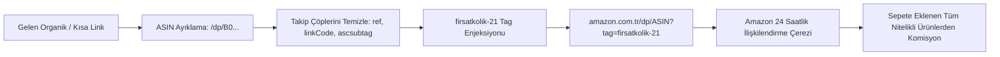

# Amazon Türkiye Gelir Ortaklığı (Amazon Associates / Affiliate) ve firsatkolik-21 Mimarisi Kılavuzu

> [!NOTE]
> Bu doküman, FırsatKolik platformundaki **Amazon Türkiye** (`amazon.com.tr`) mağazasına ait gelir ortaklığı (Amazon Associates) altyapısını, **`firsatkolik-21`** Store/Tracking ID entegrasyonunu, mobil uygulama kısa linklerinin (`amzn.eu`, `amzn.to`, `link.amazon`) kanonik çözümlenmesini, 0 ms Android App Links yerel uygulama açılış mimarisini, anti-hijack retargeting sistemini, 6 kademeli fallback/kill-switch güvencesini ve yasal affiliate disclosure standartlarını detaylandıran **mağaza özel teknik sözleşmesidir**.
>
> Genel platform mimarisi ve diğer mağaza stratejileri için bkz:  
> 👉 **[Ana Affiliate Link Dönüştürme ve Stratejileri Rehberi](file:///d:/firsatkolik/documentation/scraping-ve-botlar/affiliate/affiliate_link_donusturme_ve_stratejileri_rehberi.md)**

---

## 📑 İçindekiler
1. [🎯 1. Felsefe ve Tasarım Amacı: Neden Amazon Associates ve firsatkolik-21?](#1--felsefe-ve-tasarım-amacı-neden-amazon-associates-ve-firsatkolik-21)
2. [🔬 2. Amazon Associates TR Altyapı Mimarisi ve Attribution Dinamikleri](#2--amazon-associates-tr-altyapı-mimarisi-ve-attribution-dinamikleri)
3. [🚀 3. 0 ms Yerel Uygulama Açılışı (Zero Browser / Zero Flicker Mimarisi)](#3--0-ms-yerel-uygulama-açılışı-zero-browser--zero-flicker-mimarisi)
4. [🔄 4. Üç Farklı Giriş Senaryosu ve Otomatik Yönetim](#4--üç-farklı-giriş-senaryosu-ve-otomatik-yönetim)
5. [🛡️ 5. 6 Kademeli Acil Durum Şalteri (Kill-Switch) ve Güvenli Fallback](#5-️-6-kademeli-acil-durum-şalteri-kill-switch-ve-güvenli-fallback)
6. [🎛️ 6. Web Admin ve Mobil Admin Çoklu Görünüm ve Yönetim Kontrolleri](#6-️-web-admin-ve-mobil-admin-çoklu-görünüm-ve-yönetim-kontrolleri)
7. [📜 7. Yasal Uyum ve Zorunlu Affiliate Disclosure Standardı](#7--yasal-uyum-ve-zorunlu-affiliate-disclosure-standardı)
8. [💻 8. Kod Mimarisi ve Tek Gerçek Kaynağı (Single Source of Truth)](#8--kod-mimarisi-ve-tek-gerçek-kaynağı-single-source-of-truth)
9. [📊 9. Canlı Loglama ve İzleme Formatı (`[AFFILIATE-TEST]`, `[AMAZON-DIRECT]`)](#9--canlı-loglama-ve-izleme-formatı-affiliate-test-amazon-direct)
10. [🧪 10. Test Senaryoları ve Doğrulama Matrisi (17 Test)](#10--test-senaryoları-ve-doğrulama-matrisi-17-test)

---

## 1. 🎯 Felsefe ve Tasarım Amacı: Neden Amazon Associates ve firsatkolik-21?

Amazon Türkiye (`amazon.com.tr`), geniş ürün yelpazesi, Prime hızlı kargo avantajı ve kullanıcı güveniyle FırsatKolik topluluğunda en çok paylaşılan ve en yüksek dönüşüm (conversion rate) oranına sahip e-ticaret platformudur.

Platformun gelir modelinde Amazon'un profesyonelce yer alması için yapılan analiz ve geliştirmelerin temel dayanakları:

### Klasik Yöntemlerin Sınırları ve Gerçekler:
1. **Mobil Uygulama Paylaşım Yanılsaması:** Amazon mobil uygulamasından standart kullanıcıların paylaştığı `https://amzn.eu/d/XXXXXX` kısa linkleri çözümlendiğinde `ref=cm_sw_r_apan_dp_...` gibi standart müşteri paylaşım parametreleri taşır. Bu linkler üzerinden yapılan alışverişlerde platform **sıfır komisyon** kazanır.
2. **Resmi Ortaklık Zorunluluğu:** Amazon'dan gelir elde edebilmek için küresel **Amazon Associates (Gelir Ortaklığı Programı)** hesabı açılması ve resmi bir Takip Kimliği (Tracking ID) üzerinden parametre enjeksiyonu yapılması zorunludur.
3. **WAF ve Oturumsuz Çözüm (Zero WAF / Zero Login):** Birçok e-ticaret sitesinin aksine, Amazon Associates altyapısı üçüncü taraf harici API isteklerine veya sunucu oturumlarına ihtiyaç duymaz. Herhangi bir `amazon.com.tr` URL'sine **`tag=firsatkolik-21`** parametresinin eklenmesi, Amazon'un tüm küresel attribution motorunu tetiklemek için yeterlidir.

### FırsatKolik Çözüm Felsefesi: "Sıfır İstek, 0 ms İstemci Sentezleme ve Doğrudan Uygulama Açılışı"
Hiçbir harici ağ isteği atılmadan, cihaz üzerinde anında ASIN ayıklayan, yabancı takip parametrelerini temizleyen ve `tag=firsatkolik-21` enjeksiyonu yapan modüler bir adaptör mimarisi inşa edilmiştir.

---

## 2. 🔬 Amazon Associates TR Altyapı Mimarisi ve Attribution Dinamikleri



### Attribution ve Komisyon Kuralları:
1. **Store / Tracking ID:** Resmi takip kimliğimiz: **`firsatkolik-21`**
2. **24 Saatlik Çerez Penceresi (Attribution Window):** Kullanıcı FırsatKolik üzerinden Amazon linkine tıkladığı andan itibaren 24 saat içinde sepete eklediği ürünlerden platform komisyon kazanır. Sepete eklenen ürün 89 gün içinde satın alınsa dahi komisyon hak edişi geçerliliğini korur.
3. **Sepet Genişliği (Cart Attribution):** Kullanıcı yalnızca tıkladığı fırsat ürününü değil, Amazon'da sepete eklediği diğer tüm nitelikli ürünleri satın aldığında da platform her bir ürün için geçerli kategori komisyon oranından gelir elde eder.
4. **ASIN (Amazon Standard Identification Number):** Amazon kataloğundaki her benzersiz ürün 10 haneli alfasayısal bir ASIN koduna (Örn: `B08N5WRWNW`) sahiptir. Kanonik URL yapısı `https://www.amazon.com.tr/dp/{ASIN}` formatındadır.

---

## 3. 🚀 0 ms Yerel Uygulama Açılışı (Zero Browser / Zero Flicker Mimarisi)

Kullanıcı FırsatKolik'te *"Mağazaya Git"* butonuna bastığında karşılaşılabilecek ara tarayıcı yönlendirmeleri, URL çubuğundaki çirkin parametreler veya gecikmeler Amazon entegrasyonunda tamamen bertaraf edilmiştir:

```
[Kullanıcı "Mağazaya Git" Butonuna Basar]
                    │
                    ▼
[StoreRedirectService.launchStore(context, rawUrl)]
                    │
                    ▼
[AmazonAffiliateAdapter.convert: tag=firsatkolik-21 Sentezleme (0 ms)]
                    │
                    ▼
[LaunchMode.externalApplication İle Fırlatma]
                    │
       ┌────────────┴────────────┐
       ▼                         ▼
[Amazon Uygulaması YÜKLÜ]   [Amazon Uygulaması YOK]
       │                         │
       ▼                         ▼
[0 ms Doğrudan Amazon App]  [Kullanıcının Varsayılan Tarayıcısı]
(com.amazon.mShop.android.shopping) (Temiz Web Ürün Sayfası)
(Tarayıcı YOK, Popup YOK,   (Kusursuz Deneyim)
Adres Çubuğu YOK!)
```

### Neden Chrome / Ara Tarayıcı Açılmaz?
1. **Android App Links & Digital Asset Links:** Amazon'un resmi mobil uygulaması (`com.amazon.mShop.android.shopping`), `amazon.com.tr` alan adı için Google Digital Asset Links (`assetlinks.json`) doğrulamasını yapmıştır.
2. **Sıfır 302 Gecikmesi:** TUNE veya harici reklam ağlarının aksine Amazon linkleri ara bir yönlendirme sunucusu kullanmaz; link doğrudan kanonik `amazon.com.tr` alan adıdır.
3. **Sıfır Popup HUD:** Kullanıcıya herhangi bir bekleme veya geçiş penceresi gösterilmez; tıklama anında **0 milisaniyede doğrudan Amazon alışveriş uygulaması açılır**.
4. **AndroidManifest İzni:** `android/app/src/main/AndroidManifest.xml` dosyasındaki `<queries>` bloğuna eklenen `<package android:name="com.amazon.mShop.android.shopping" />` kaydı, Android 11+ (API 30+) cihazlarda sistemin Amazon uygulamasını anında tanımasını garanti eder.

---

## 4. 🔄 Üç Farklı Giriş Senaryosu ve Otomatik Yönetim

FırsatKolik'e Amazon ile ilgili bir link geldiğinde sistem 3 farklı senaryoyu kusursuz şekilde yönetir:

### Senaryo 1: Kullanıcı Standart/Organik Ürün Linki Paylaştığında
* **Gelen Link:** `https://www.amazon.com.tr/Apple-iPhone-13-128-GB/dp/B09G96KG8R?th=1`
* **İşlem:** ASIN (`B09G96KG8R`) ayıklanır, gereksiz takip parametreleri temizlenir.
* **Çıktı:** 0 ms'de `https://www.amazon.com.tr/dp/B09G96KG8R?tag=firsatkolik-21` üretilir.

### Senaryo 2: Kullanıcı Mobil Paylaşım Kısa Linki Paylaştığında (`amzn.eu` / `amzn.to`)
* **Gelen Link:** `https://amzn.eu/d/097K8DSA`
* **İşlem:**
  1. `LinkPreviewService` (ve Node.js `linkScraperService`) HTTP yönlendirmesini takip ederek hedef URL'yi çözer: `https://www.amazon.com.tr/dp/B0FVYCZ2G2?ref=cm_sw_r_apan_dp_...`
  2. Müşteri paylaşım takip çöpleri (`ref=cm_sw_...`, `social_share=...`) ayıklanır.
  3. Fırsat kaydedilirken `cleanUrl` alanına `https://www.amazon.com.tr/dp/B0FVYCZ2G2`, `link` alanına ise `https://www.amazon.com.tr/dp/B0FVYCZ2G2?tag=firsatkolik-21` yazılır.

### Senaryo 3: Kullanıcı Başkasına Ait Affiliate Linki Paylaştığında (0 ms Anti-Hijack Retargeting)
* **Gelen Link:** `https://www.amazon.com.tr/dp/B08N5WRWNW?tag=baskasinin_tagi-21&linkCode=ll1&ascsubtag=12345`
* **İşlem:**
  1. `AmazonAffiliateAdapter.isAlreadyAffiliate` linki inceler: `tag` değeri `firsatkolik-21` ile eşleşmediği için hazır kabul etmez.
  2. `AmazonAffiliateAdapter.convert` linkteki yabancı `tag`, `linkCode`, `ascsubtag`, `creative` ve `camp` parametrelerini anında siler.
  3. Admin takip kimliği olan `tag=firsatkolik-21` enjekte edilir (Retargeting / Anti-Hijacking).

---

## 5. 🛡️ 6 Kademeli Acil Durum Şalteri (Kill-Switch) ve Güvenli Fallback

Eğer Amazon Associates programında beklenmedik bir durum oluşursa, sistem tek bir tıkla **sıfır kesintiyle güvenli fallback moduna** geçer:

1. **Canlı Dinleyici Senkronizasyonu (Real-Time Listeners):**
   * Mobil Flutter: `AffiliateService.initSettingsListener()` üzerinden Firestore `settings/app` anlık dinlenir (`amazonAffiliateEnabled`).
   * Web Admin: `initAdminAffiliateSettingsListener()` ile açık yönetici sekmeleri eşitlenir.
2. **Fırsat Paylaşım Kalkanı (`DealService.createDeal`):** Şalter kapalıyken paylaşılan kısa linkler kanonik ürüne çözülür fakat tag eklenmeyerek **saf organik ürün linki** olarak kaydedilir.
3. **Görünüm ve Rozet Filtreleme (`isStoreSupported`):** Şalter kapalıyken `AffiliateService.isStoreSupported` ve `AffiliateManager.isStoreSupported` fonksiyonları `false` döner; arayüzdeki yeşil affiliate rozetleri otomatik gizlenir.
4. **Düzenleme Modalları Fallback'i:** `AdminEditSheet` ve Web `showDealModal` arayüzlerinde eski linkler varsa otomatik olarak temiz kanonik linke unwrap edilir.
5. **Mağazaya Git Butonu Emniyeti (`StoreRedirectService`):** Veritabanında eski bir `tag=` barındıran link bulunsa bile, şalter kapalıysa yönlendirme anında tag tamamen ayıklanarak saf organik ürün sayfasına açılır.
6. **Onaylama Anı Denetimi (`_approveDeal` & `approveDeal`):** Admin fırsatı onaylarken şalter kapalıysa, link organik link olarak onaylanıp yayına girer.

---

## 6. 🎛️ Web Admin ve Mobil Admin Çoklu Görünüm ve Yönetim Kontrolleri

### Web Admin Paneli (`web/admin/`)
* **Ayarlar Görünümü (`#settingsView`):**
  * Hepsiburada ve Teknosa'nın hemen altında **Amazon Affiliate (Associates TR) Dönüşümü** toggle switch'i (`#settingsToggleAmazonAffiliateBtn`).
  * İnteraktif Bilgi Butonu (`!`) ve açılır kılavuz kartı (`#amazonAffiliateInfoBox`).
* **Fırsat Düzenleme Modalı (`showDealModal`):**
  * `activeStores: ['teknosa', 'hepsiburada', 'amazon']` sayesinde Amazon fırsatlarında otomatik **Çoklu Görünüm** devreye girer:
    - 🌐 **Orijinal Mağaza Linki (`#editCleanUrl`):** Temiz kanonik URL.
    - 🔗 **Aktif Affiliate Linki (`#editAffiliateUrl`):** `tag=firsatkolik-21` eklenmiş canlı link.
    - ⚡ *"Orijinalden Affiliate Üret"* ve *"Affiliate Test Et"* butonları.

### Mobil Admin Uygulaması (`lib/screens/`)
* Onay bekleyen fırsat kartlarında:  
  👉 `🟢 [Amazon Affiliate linki hazır]` (Varsayılan hazır durum)  
  👉 `🟠 [Amazon linki (Onaylanınca otomatik affiliate'e dönüştürülür)]` (Eski/organik durum)
* Fırsat Düzenleme Bottom Sheet'inde (`AdminEditSheet`): Bölüm 4 otomatik olarak Çoklu Görünüm moduna geçer.

---

## 7. 📜 Yasal Uyum ve Zorunlu Affiliate Disclosure Standardı

Amazon İşletme Sözleşmesi (Associates Program Operating Agreement) Madde 5 gereğince, gelir ortaklığı linki paylaşan tüm platformlar ziyaretçilerine açık bir beyanda bulunmakla yükümlüdür:

> *"Bir Amazon Gelir Ortağı olarak nitelikli satın alımlar üzerinden kazanç elde ediyorum."*  
> *(As an Amazon Associate I earn from qualifying purchases.)*

FırsatKolik'te bu yasal beyan eksiksiz olarak karşılanmıştır:
* **Web Vitrin Footer'ı (`web/index.html` satır 1944):** Resmi Amazon beyan metni şeffaf bir şekilde yer almaktadır.
* **Fırsat Açıklamaları (`AdvertisingComplianceService`):** Fırsat açıklamalarında reklam ve sponsorluk bilgilendirme standartları korunmaktadır.

---

## 8. 💻 Kod Mimarisi ve Tek Gerçek Kaynağı (Single Source of Truth)

| Bileşen | Dosya Yolu | Sorumluluk |
| :--- | :--- | :--- |
| **Amazon Adaptörü** | [`lib/services/affiliate/adapters/amazon_affiliate_adapter.dart`](file:///d:/firsatkolik/lib/services/affiliate/adapters/amazon_affiliate_adapter.dart) | ASIN ayıklama, tag enjeksiyonu, anti-hijack, unwrap (0 ms). |
| **Merkezi Servis** | [`lib/services/affiliate/affiliate_service.dart`](file:///d:/firsatkolik/lib/services/affiliate/affiliate_service.dart) | Mağaza tespiti, Firestore şalter senkronizasyonu, `isStoreSupported`. |
| **Yönlendirme Motoru** | [`lib/services/affiliate/store_redirect_service.dart`](file:///d:/firsatkolik/lib/services/affiliate/store_redirect_service.dart) | 0 ms `LaunchMode.externalApplication` ile doğrudan Amazon mobil uygulaması açılışı. |
| **Android İzinleri** | [`android/app/src/main/AndroidManifest.xml`](file:///d:/firsatkolik/android/app/src/main/AndroidManifest.xml) | `com.amazon.mShop.android.shopping` paket görünürlük izni. |
| **Web Admin Config** | [`web/admin/config.js`](file:///d:/firsatkolik/web/admin/config.js) | `amazon: { tag: 'firsatkolik-21', enabled: true }`. |
| **Web Admin Motoru** | [`web/admin/affiliate_manager.js`](file:///d:/firsatkolik/web/admin/affiliate_manager.js) | Web tarafında izole Amazon adaptörü ve `activeStores` kaydı. |
| **Web Admin Arayüzü** | [`web/admin/index.html`](file:///d:/firsatkolik/web/admin/index.html) & [`app.js`](file:///d:/firsatkolik/web/admin/app.js) | Canlı toggle switch, info modalı ve anlık Firestore dinleyicisi. |

---

## 9. 📊 Canlı Loglama ve İzleme Formatı (`[AFFILIATE-TEST]`, `[AMAZON-DIRECT]`)

Flutter ve Node.js konsolunda izlenen standart log formatı:

```text
🚀 [AFFILIATE-TEST] Amazon Associates affiliate linki başarıyla sentezlendi (0 ms):
   👉 Girdi: https://www.amazon.com.tr/dp/B08N5WRWNW
   👉 Çıktı: https://www.amazon.com.tr/dp/B08N5WRWNW?tag=firsatkolik-21

⚡ [AMAZON-DIRECT] 0 ms doğrudan Amazon App Link fırlatılıyor: https://www.amazon.com.tr/dp/B08N5WRWNW?tag=firsatkolik-21

🛑 [AFFILIATE-TEST] Amazon affiliate şalteri KAPALI (enabled=false).
   🛡️ Güvenli Fallback Modu: Orijinal temiz linke unwrap ediliyor: https://www.amazon.com.tr/dp/B08N5WRWNW
```

---

## 10. 🧪 Test Senaryoları ve Doğrulama Matrisi (17 Test)

Amazon Associates entegrasyonu, 13 adet Flutter birim/entegrasyon testi ve 4 adet Node.js bot testi olmak üzere **toplam 17 bağımsız test ile %100 oranında doğrulanmıştır**:

### A. Flutter Test Paketi ([`test/amazon_affiliate_test.dart`](file:///d:/firsatkolik/test/amazon_affiliate_test.dart)) - 13/13 ✅
1. `canHandle should correctly recognize Amazon domains and shortlink domains` ✅
2. `convert should synthesize canonical Amazon URL with tag=firsatkolik-21 in 0 ms` ✅
3. `convert should extract ASIN from various Amazon URL patterns (/dp, /slug/dp, /gp/product, /gp/aw/d)` ✅
4. `convert should strip tracking parameters and garbage (ref, linkCode, ascsubtag, social_share)` ✅
5. `isAlreadyAffiliate should recognize own firsatkolik-21 tag and reject 3rd-party tags` ✅
6. `Anti-Hijack / Unwrap & Retargeting: 3rd party Amazon affiliate link should retarget to firsatkolik-21` ✅
7. `Fallback / Kill-Switch: When adapter is disabled, it safely returns clean product URL without tag` ✅
8. `Fallback / Kill-Switch: When adapter is disabled and given a 3rd party link, it unwraps to clean URL` ✅
9. `Deal.cleanProductUrl should strip tag and query parameters leaving clean canonical product URL` ✅
10. `Deal.displayUrl should cleanly show canonical product URL for users, never tag` ✅
11. `AffiliateService and DealLinkUtils should recognize Amazon as a supported affiliate store` ✅
12. `Kill-Switch: When amazonAffiliateEnabled is false, isStoreSupported returns false and conversion returns clean organic URL` ✅
13. `LinkPreviewService.resolveUrlRedirects should resolve amzn.eu mobile share shortlink to canonical URL` ✅

### B. Node.js Bot Test Paketi ([`cloud-run-bot/tests/amazon_affiliate.test.js`](file:///d:/firsatkolik/cloud-run-bot/tests/amazon_affiliate.test.js) & [`cloud-run-bot/tests/telegram_bot_affiliate_pipeline.test.js`](file:///d:/firsatkolik/cloud-run-bot/tests/telegram_bot_affiliate_pipeline.test.js)) - 10/10 ✅
1. `Test 1: Synthesize Amazon Associates URL from canonical product link (tag=firsatkolik-21)` ✅
2. `Test 2: Testing live resolution of user amzn.eu mobile share shortlinks (3 link: 097K8DSA, 0dsXBLAE, 04lH7aur)` ✅
3. `Test 3: Retargeting third-party Amazon affiliate link to Admin Tracking ID (firsatkolik-21)` ✅
4. `Test 4: Fallback / Kill-Switch unwrapping to clean organic product URL` ✅
5. `Pipeline 1: Resolving Telegram amzn.eu mobile share shortlink` ✅
6. `Pipeline 2a: cleanProductUrl produces 100% clean canonical URL for users` ✅
7. `Pipeline 2b: Anti-hijacking and retargeting competitor Telegram post to firsatkolik-21` ✅
8. `Pipeline 3: isAlreadyAffiliate validates own tag and rejects third-party/shortlinks` ✅
9. `Pipeline 4: Kill-switch fallback unwrap behavior` ✅
10. `Pipeline 5: saveDealToFirebase deal creation simulation (deal.link & deal.cleanUrl)` ✅

---

## 11. 🤖 Telegram Botu (Node Scraper) ve Cloud Run Entegrasyonu

Telegram üzerinden gelen Amazon fırsatlarının Dart istemcisiyle birebir aynı sözleşmeyle işlenebilmesi için [`cloud-run-bot/affiliate_manager.js`](file:///d:/firsatkolik/cloud-run-bot/affiliate_manager.js) motoru devreye alınmıştır:

### A. Uçtan Uca İçe Aktarım Akışı (Ingestion Pipeline)
1. **Kısa Link Çözümleme (`resolveUrlRedirects`):** Telegram mesajındaki `amzn.eu/d/...` kısa linki HTTP 301/302 takip edilerek anında kanonik `/dp/{ASIN}` URL'ine çözülür.
2. **Kullanıcı İçin Temiz Link (`cleanProductUrl`):** Tüm query ve takip parametreleri (`tag`, `ref`, vb.) silinerek Firestore'a `deal.cleanUrl` olarak `https://www.amazon.com.tr/dp/{ASIN}` formatında yazılır.
3. **Gelir Ortaklığı Enjeksiyonu (`affiliateManager.convert`):**
   * Linkte rakip bir affiliate tag'i (`tag=rakip-21`) veya takip kodları (`ref_`, `linkCode`, `ascsubtag`) varsa **anti-hijack** ile temizlenir.
   * Resmi takip kimliğimiz `tag=firsatkolik-21` enjekte edilir.
   * Firestore'a `deal.link` olarak `https://www.amazon.com.tr/dp/{ASIN}?tag=firsatkolik-21` kaydedilir.
4. **Çift Katmanlı Koruma (Fast-Path & Runtime Intent):**
   * Fırsat kaydedildiği ilk andan itibaren Firestore'da `isAlreadyAffiliate: true` durumundadır.
   * Admin onayında Fast-Path devreye girer (0 ms mükerrer işlem yapmaz).
   * Otomatik onay (`dealApprovalRequired: false`) durumunda dahi veritabanı tertemizdir ve mobil uygulama "Mağazaya Git" butonunda 0 ms ile doğrudan yerel Amazon uygulamasını açar.

