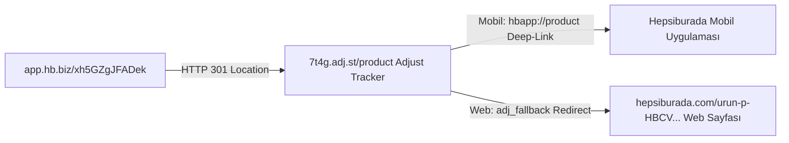
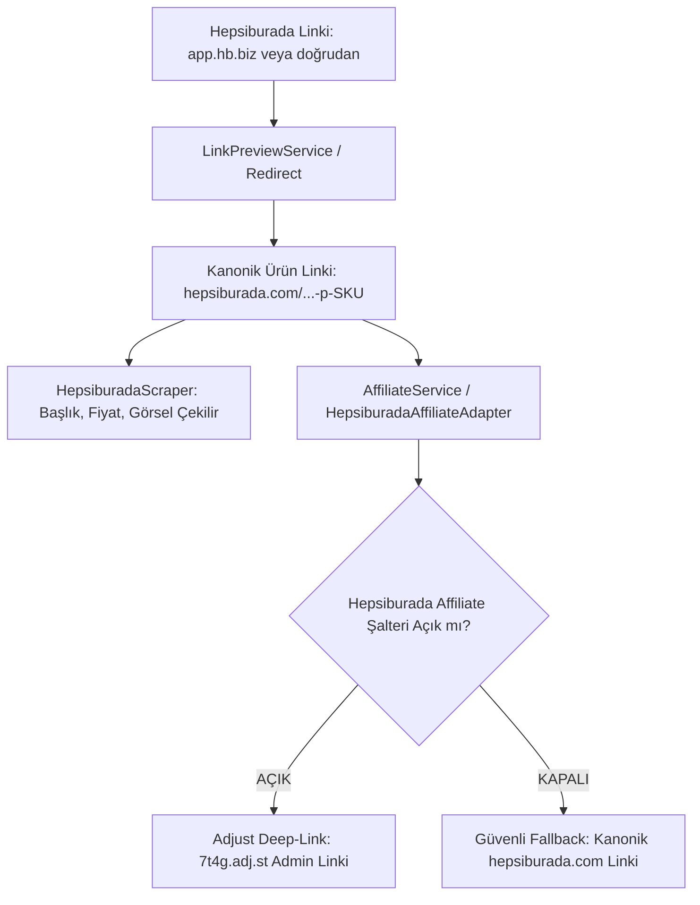

# Hepsiburada Gelir Ortaklığı (LinkGelir / Affiliate) ve Adjust Mimarisi Kılavuzu

> [!NOTE]
> Bu doküman, FırsatKolik platformundaki **Hepsiburada** mağazasına ait gelir ortaklığı (LinkGelir) altyapısını, mobil uygulama paylaşım linklerinin tersine mühendisliğini, 0 ms Adjust (`7t4g.adj.st`) universal deep-link sentezleme motorunu, anti-hijack retargeting mekanizmasını, çift kademeli fallback/hata toleransını ve yönetim paneli kontrollerini detaylandıran **mağaza özel teknik kontratıdır**.
>
> Genel platform mimarisi ve diğer mağaza stratejileri için bkz:  
> 👉 **[Ana Affiliate Link Dönüştürme ve Stratejileri Rehberi](file:///d:/firsatkolik/documentation/scraping-ve-botlar/affiliate/affiliate_link_donusturme_ve_stratejileri_rehberi.md)**

---

## 📑 İçindekiler
1. [🎯 Felsefe ve Tasarım Amacı: Neden Adjust Tersine Mühendisliği?](#1--felsefe-ve-tasarım-amacı-neden-adjust-tersine-mühendisliği)
2. [🔬 Hepsiburada LinkGelir & Adjust (`7t4g.adj.st`) Altyapı Mimarisi](#2--hepsiburada-linkgelir--adjust-7t4gadjst-altyapı-mimarisi)
3. [🔄 Üç Farklı Giriş Senaryosu ve Otomatik Yönetim](#3--üç-farklı-giriş-senaryosu-ve-otomatik-yönetim)
4. [🛡️ Çift Kademeli Fallback ve Dayanıklılık Mimarisi](#4-️-çift-kademeli-fallback-ve-dayanıklılık-mimarisi)
5. [🎛️ Web Admin ve Mobil Admin Yönetim Kontrolleri](#5-️-web-admin-ve-mobil-admin-yönetim-kontrolleri)
6. [💻 Kod Mimarisi ve Tek Gerçek Kaynağı (Single Source of Truth)](#6--kod-mimarisi-ve-tek-gerçek-kaynağı-single-source-of-truth)
7. [📊 Canlı Loglama ve İzleme Formatı (`[AFFILIATE-TEST]`)](#7--canlı-loglama-ve-izleme-formatı-affiliate-test)
8. [🧪 Test Senaryoları ve Doğrulama Matrisi](#8--test-senaryoları-ve-doğrulama-matrisi)
9. [💡 Canlı Test İpuçları: Tıklama Sayımı, Self-Referral ve Panel Güncelleme Süreçleri](#9--canlı-test-ipuçları-tıklama-sayımı-self-referral-ve-panel-güncelleme-süreçleri)
10. [🤖 Telegram Botu (Node Scraper) ve Cloud Run Entegrasyonu](#10--telegram-botu-node-scraper-ve-cloud-run-entegrasyonu)

---

## 1. 🎯 Felsefe ve Tasarım Amacı: Neden Adjust Tersine Mühendisliği?

Hepsiburada, Türkiye e-ticaret pazarının en büyük pazaryeri platformlarından biridir ve "LinkGelir / Influencer" gelir ortaklığı programı ile paylaşılan linkler üzerinden satış komisyonu kazandırmaktadır.

FırsatKolik gibi yüksek hacimli ve gerçek zamanlı bir indirim platformunda Hepsiburada linklerini gelir ortaklığına dönüştürürken karşılaşılan zorluklar ve geliştirilen çözüm felsefesi şöyledir:

### Klasik Yöntemlerin Çıkmazı
1. **Oturum Zorunluluğu (Login Dependency):** Hepsiburada mobil veya web arayüzünde "LinkGelir / Paylaş Kazan" butonuyla link üretebilmek için kullanıcının kendi hesabında oturum açmış olması şarttır. Sunucu tarafında oturumu canlı tutmaya çalışmak devasa bir çerez yönetim yükü ve güvenlik riski yaratır.
2. **WAF ve Bot Koruması (Akamai Bot Manager):** Hepsiburada web ve API servisleri dünya devi Akamai WAF koruması altındadır. Standart sunuculardan atılan POST/GET istekleri anında HTTP 403 Forbidden engeline takılır.
3. **Ağ Gecikmesi ve Kırılganlık:** Her gelen organik link için harici bir servise veya API'ye istek atmak 1-3 saniye gecikme doğurur; API yanıt vermediğinde akış kilitlenir.

### FırsatKolik Çözüm Felsefesi: "Sıfır İstek, %100 Başarı (0 ms Sentezleme)"
Hepsiburada'nın mobil paylaş butonunun ürettiği linklerin arka planındaki küresel ad-tech altyapısı (Adjust Universal Deep-Link) tersine mühendislikle çözülmüş ve **hiçbir ağ isteği atmadan, sadece matematiksel URL parametre enjeksiyonu ile Adjust deep-link'i sentezleyen** algoritmik bir adaptör inşa edilmiştir.

---

## 2. 🔬 Hepsiburada LinkGelir & Adjust (`7t4g.adj.st`) Altyapı Mimarisi

Hepsiburada mobil uygulamasında kullanıcının kendi hesabıyla ürettiği 4 farklı canlı ürün linki incelendiğinde şu yönlendirme zinciri ortaya çıkarılmıştır:



### Canlı Link Analiz Tablosu (Reverse Engineering Kanıtları):

| No | Kullanıcı Paylaşım Linki (`app.hb.biz`) | Ürün SKU | Tespit Edilen Yönlendirme (Location Header) |
| :--- | :--- | :--- | :--- |
| **1** | `https://app.hb.biz/xh5GZgJFADek` | `HBCV00004RJ9GF` | `7t4g.adj.st/product?sku=HBCV00004RJ9GF&adj_t=10zuiki3_y4q2fze&adj_campaign=ux_gelistirmeleri&adj_adgroup=muratcan%20gokyokus&...` |
| **2** | `https://app.hb.biz/0x1QpfQKpgNa` | `HBV00000I6DSC` | `7t4g.adj.st/product?sku=HBV00000I6DSC&adj_t=10zuiki3_y4q2fze&adj_campaign=ux_gelistirmeleri&adj_adgroup=muratcan%20gokyokus&...` |
| **3** | `https://app.hb.biz/fjKKWyLJLLCE` | `HBV00000QYSC7` | `7t4g.adj.st/product?sku=HBV00000QYSC7&adj_t=10zuiki3_y4q2fze&adj_campaign=ux_gelistirmeleri&adj_adgroup=muratcan%20gokyokus&...` |
| **4** | `https://app.hb.biz/AQQCeOBmGiqx` | `HBCV0000ADWII9` | `7t4g.adj.st/product?sku=HBCV0000ADWII9&adj_t=10zuiki3_y4q2fze&adj_campaign=ux_gelistirmeleri&adj_adgroup=muratcan%20gokyokus&...` |

### Keşif ve Mimari Çözümleme:
1. **Arka Plandaki Asıl Motor:** `https://app.hb.biz/XXXXX` linkleri yalnızca dinamik bir kısa link servisi (shortlink forwarder) olup, tıklandığında dünya mobil ölçümleme devi olan **Adjust (`7t4g.adj.st`)** takip motoruna 301 yönlendirmesi yapmaktadır.
2. **Kritik Attribution Anahtarı (`adj_adgroup`):** Tüm linklerde komisyonu kullanıcı hesabına bağlayan değişmez parametre `adj_adgroup=muratcan%20gokyokus` değeridir.
3. **Sabit Kampanya ve Tracker Parametreleri:**
   * `adj_t=10zuiki3_y4q2fze` (Hepsiburada LinkGelir kampanya takip token'ı - tüm ürünlerde sabittir)
   * `adj_campaign=ux_gelistirmeleri` (Kampanya segmenti - tüm ürünlerde sabittir)
   * `adj_creative={SKU}` (Ürün SKU numarası)
   * `utm_source=influencer&utm_medium=linkgelir&utm_campaign=sc:hb-ecom.sr:influencer.md:linkgelir&wt_inf=affiliate`
4. **Universal Link ve Web Fallback Çözümü:**
   * Mobil kullanıcılar tıkladığında `adj_deep_link=hbapp://product?sku={SKU}` parametresi doğrudan Hepsiburada mobil uygulamasını açar.
   * Masaüstü / Web kullanıcıları tıkladığında Adjust motoru HTTP 302 ile `adj_fallback` parametresindeki kanonik `hepsiburada.com/...-p-{SKU}` sayfasına yönlendirir.

---

## 3. 🔄 Üç Farklı Giriş Senaryosu ve Otomatik Yönetim

FırsatKolik'e Hepsiburada ile ilgili bir link geldiğinde sistem 3 farklı senaryoyu kusursuz şekilde yönetir:

### Senaryo 1: Kullanıcı Normal/Organik Ürün Linki Paylaştığında
* **Gelen Link:** `https://www.hepsiburada.com/altinyildiz-classics-erkek-100-pamuk-v-yaka-lacivert-slim-fit-dar-kesim-tisort-p-HBCV00004RJ9GF?magaza=ALTINYILDIZ+CLASSICS`
* **İşlem:** URL'den SKU (`HBCV00004RJ9GF`) ve satıcı bilgisi (`magaza`) anında ayıklanır.
* **Çıktı:** 0 ms gecikmeyle admin hesabına (`muratcan gokyokus`) ait Adjust `7t4g.adj.st` deep-link'i sentezlenir.

### Senaryo 2: Kullanıcı "LinkGelir / Paylaş" Kısa Linki Paylaştığında
* **Gelen Link:** `https://app.hb.biz/xh5GZgJFADek`
* **İşlem:** 
  1. `LinkPreviewService` (ve Node.js `linkScraperService`) WhatsApp User-Agent kullanarak Akamai WAF'ı aşar ve HTTP 301 Location header'ını yakalar.
  2. Location içindeki `adj_fallback` alanından gerçek kanonik ürün URL'si ayıklanır (`hepsiburada.com/...-p-HBCV00004RJ9GF`).
  3. Fırsat kaydedilirken `cleanUrl` alanına saf ürün linki, `link` alanına ise adminin Adjust affiliate linki yazılarak hem veritabanı kirliliği önlenir hem de komisyon hakkı korunur.

### Senaryo 3: Kullanıcı Başkasına Ait Adjust Affiliate Linki Paylaştığında (0 ms Anti-Hijack Retargeting)
* **Gelen Link:** `https://7t4g.adj.st/product?sku=HBCV00004RJ9GF&adj_adgroup=yabanci_kullanici&adj_fallback=https%3A%2F%2Fwww.hepsiburada.com%2Furun-p-HBCV00004RJ9GF`
* **İşlem:** 
  1. `HepsiburadaAffiliateAdapter.isAlreadyAffiliate` linki inceler: `adj_adgroup` admin hesabıyla eşleşmediği için hazır kabul etmez.
  2. `HepsiburadaAffiliateAdapter.convert` linkin içindeki `adj_fallback` veya `sku` parametresini anında unwrap eder (0 ms).
  3. Yabancı kullanıcının takip kimliği atılır, adminin hesap adı (`muratcan gokyokus`) ile yeni bir link sentezlenir (Retargeting / Anti-Hijacking).

---

## 4. 🛡️ Çift Kademeli Fallback ve Dayanıklılık Mimarisi

> [!IMPORTANT]
> **Kesintisiz Deneyim Garantisi (Non-Blocking):**  
> Hepsiburada affiliate motoru hiçbir zaman işlem kesici (blocking) değildir. Adjust yönlendirmesinde, ağ el sıkışmasında veya şalter durumunda ne yaşanırsa yaşansın; fırsat paylaşımı, admin onayı veya kullanıcının mağazaya gitmesi asla aksamaz; sistem otomatik olarak kanonik `hepsiburada.com` linki üzerinden (%100 kesintisiz) akışına devam eder.



### 1. Kademe: Kazıma ve Metadata Güvenliği (İzolasyon)
Metadata çekme işlemi (`HepsiburadaScraper`, `link_scraper_service.js`) affiliate motorundan tamamen bağımsızdır. Link ister `app.hb.biz`, ister `7t4g.adj.st`, ister organik olsun; JSON-LD ve DOM seçiciler doğrudan kanonik ürün sayfasından çekilir.

### 2. Kademe: Kill-Switch / Acil Durum Şalteri (Uçtan Uca Senkronizasyon)
Web Admin panelindeki **Ayarlar > Acil Durum Kontrolleri** altından veya Firestore `settings/app` altındaki `hepsiburadaAffiliateEnabled` anahtarı `false` yapıldığında sistemin tüm katmanları eşzamanlı olarak güvenli fallback moduna geçer:

1. **Canlı Dinleyici Senkronu (Real-time Listeners):**
   * **Mobil Flutter (`lib/main.dart`):** Uygulama başlangıcında `AffiliateService.initSettingsListener()` başlatılır. Şalter Web Admin'den kapatıldığı anda Firestore `settings/app` anlık dinleyicisi tüm aktif mobil cihazlarda `AffiliateService.setStoreEnabled('hepsiburada', false)` tetikler.
   * **Web Admin (`web/admin/app.js`):** `initAdminAffiliateSettingsListener()` ile tüm açık tarayıcı sekmeleri Firestore `onSnapshot` üzerinden anında güncellenir.
2. **Fırsat Paylaşım Ekranı (`DealService.createDeal`):**
   * Fırsat kaydedilmeden hemen önce `settings/app` okunarak `AffiliateService.syncFromMap(sData)` çağrılır.
   * Kullanıcı kısa link (`https://app.hb.biz/...`) paylaşsa dahi, link asıl kanonik ürüne çözümlenir (unshorten) ancak şalter kapalı olduğu için **Adjust linkine dönüştürülmez**; veritabanına doğrudan temiz organik link kaydedilir.
3. **Admin Onay Rozetleri (`admin_screen.dart` & Web Admin):**
   * `AffiliateService.isStoreSupported` ve `AffiliateManager.isStoreSupported`: Mağaza şalteri kapalıyken (`isEnabled = false`) `false` döndürür.
   * Bu sayede onay bekleyen fırsatlarda gereksiz yeşil *"Affiliate linki hazır"* rozeti gösterilmez; sistem standart fırsat modunda davranır.
4. **Düzenleme Modalları (`admin_edit_sheet.dart` & Web `showDealModal`):**
   * Şalter kapalıyken çoklu görünüm yerine **standart tek URL** (organik mağaza linki) arayüzü gösterilir.
   * Fırsat üzerinde daha önceden kalmış bir `7t4g.adj.st` linki varsa, modal açıldığı anda veya kaydedildiğinde `adj_fallback` parametresinden anında temizlenerek organik linke dönüştürülür.
5. **Mağazaya Git Butonu ve Hibrit Yönlendirme (`StoreRedirectService`):**
   * Veritabanındaki fırsat geçmişten kalma bir affiliate linki içerse dahi, kullanıcı *"Mağazaya Git"* butonuna bastığında `StoreRedirectService.launchStore` devreye girer.
   * **Şalter KAPALI İken:** `AffiliateService.getAdapter(cleanUrl)` kontrol edilir. Şalter kapalıysa (`!adapter.isEnabled`) link derhal organik kanonik URL'e çözülür; geçiş HUD'ı açılmadan, eski dünyada olduğu gibi **0 ms gecikmeyle doğrudan organik mağaza açılır**.
   * **Şalter AÇIK İken (0 ms Native Deep-Link & Hibrit Yönlendirme):**
     * **Adım 1 (0 ms Doğrudan Native Uygulama Lansmanı - Zero Browser & Zero Popup):** `7t4g.adj.st` web domaini için `assetlinks.json` doğrulaması bulunmadığından web linki fırlatmak tarayıcıyı araya sokar. Bu nedenle `HepsiburadaAffiliateAdapter.buildNativeAppUrl(cleanUri)` metodu doğrudan `hbapp://product?sku={SKU}&adjust_tracker={TOKEN}&adj_t={TOKEN}&adj_adgroup={ACCOUNT}&adj_campaign={CAMPAIGN}` native şemasını üretir. Android 11+ `<queries>` paket görünürlüğü (`<data android:scheme="hbapp" />` ve `<package android:name="com.pozitron.hepsiburada" />`) ile Hepsiburada uygulaması telefonda tespit edildiğinde, **hiçbir ara popup HUD'ı gösterilmeden ve tarayıcı yüzü görülmeden 0 ms'de doğrudan Hepsiburada uygulaması açılır**.
     * **Adjust Güvenliği & Sıfır Sahtekarlık Riski:** Arka planda başsız (headless) Dart `http.get` pingi atma mantığı tamamen kaldırılmıştır. Hepsiburada uygulaması açıldığında içerisindeki Adjust SDK (`appWillOpenUrl` / `ProcessDeeplink`), gelen `hbapp://` Intent parametrelerini cihazın kendi reklam kimliği (GAID/OAID) ve insan dokunma oturumu üzerinden doğrudan Adjust sunucularına iletir.
     * **Adım 2 (Yedek Web Fallback & Geçiş HUD'ı):** Kullanıcının cihazında Hepsiburada uygulaması yüklü değilse (`canLaunchUrl == false`), ekranda 1.2 saniyelik minimalist ve kurumsal `StoreRedirectDialog` HUD'ı ("Hepsiburada Mağazasına Güvenle Aktarılıyorsunuz") açılır; diyalog arka planda çözülen temiz web linki üzerinden yönlendirmeyi tamamlar. Kullanıcı şüpheli bir yönlendirme hissetmez, komisyon %100 işlenir.
6. **Admin Onaylama Anı (`approval_dialogs.dart`):**
   * Onay anında şalter kapalıysa, fırsatın `url`, `link` ve `cleanUrl` alanları temiz organik link olarak onaylanır ve yayına verilir.

---

## 5. 🎛️ Yönetim Paneli (Admin) Entegrasyonları ve Denetim

> **Canlı Rollout Durumu:** FırsatKolik genelinde Hepsiburada affiliate dönüşümü ve çoklu link arayüzleri **artık canlı ve aktiftir** (`isAffiliateReady = true` ve Web Admin `activeStores: ['teknosa', 'hepsiburada']`).

### 🌟 Temiz URL (`cleanUrl`) vs Affiliate URL (`link`) Ayrımı
* **Kullanıcılar İçin (`deal.displayUrl`):** Kullanıcı mağaza linkini kopyaladığında (`copyStoreLink`) veya WhatsApp/Telegram'da paylaştığında (`shareToNativeApps`), asla karmaşık `7t4g.adj.st` linkini görmez; daima **temiz Hepsiburada ürün linkini** (`...-p-[SKU]`) alır.
* **Komisyon İçin (`deal.link`):** Yalnızca *"Mağazaya Git"* butonunda arka planda `7t4g.adj.st` Adjust affiliate linki tetiklenir (şalter açıkken).

### Web Admin Paneli
* **Konum:** Web Admin > Ayarlar (Settings) > Acil Durum Kontrolleri.
* **Canlı Switch (`#settingsToggleHepsiburadaAffiliateBtn`):** Tek tıkla Hepsiburada affiliate dönüşümünü açıp kapatır (`settings/app` altındaki `hepsiburadaAffiliateEnabled` alanını günceller).
* **İnteraktif `!` Butonu (`#hepsiburadaAffiliateInfoBtn`):** Tıklandığında açık ve kapalı modların çalışma mantığını anlatan 2 sütunlu rehber kutusunu (`#hepsiburadaAffiliateInfoBox`) açar/kapatır.
* **Fırsat Düzenleme Modalı (Çoklu Görünüm - Dual View):**
  * **Şalter AÇIK ise:**
    * **Orijinal Mağaza Linki (`#editCleanUrl`):** Temiz link + *"Orijinal Linki Aç"* + *"Orijinalden Affiliate Üret"* (`#convertToAffiliateBtn`).
    * **Aktif Affiliate Linki (`#editAffiliateUrl`):** `7t4g.adj.st` linki + *"Affiliate Test Et"* (`#previewAffiliateBtn`) + canlı durum rozeti (`✅ Hepsiburada LinkGelir (Adjust) affiliate linki hazır ve aktif`).
  * **Şalter KAPALI ise:**
    * Tek link alanı (standart ürün URL'i) görüntülenir; affiliate kutuları ve rozetleri otomatik gizlenir.

### Mobil Admin Onay Ekranı ([`admin_screen.dart`](file:///d:/firsatkolik/lib/screens/admin_screen.dart))
* **Şalter AÇIK ise:**
  * Onay bekleyen fırsat kartlarında dinamik durum rozeti: `🟢 [Hepsiburada Affiliate linki hazır]`.
  * **⚡ Hızlı Yol (Fast-Path - %99):** Link zaten paylaşım anında affiliate yapılmışsa hiçbir mükerrer hesaplama yapılmaz (0 ms). Sadece `isApproved: true` yapılır.
  * **🛡️ Emniyet Ağı (Safety Net - %1):** Link eski kalmışsa, onaylama anında tek seferlik affiliate'e dönüştürülür.
* **Şalter KAPALI ise:**
  * Affiliate rozeti tamamen gizlenir, standart fırsat olarak onaylanır.
* **Düzenleme Modalı ([`admin_edit_sheet.dart`](file:///d:/firsatkolik/lib/screens/deal_detail/admin_dialogs/admin_edit_sheet.dart)):**
  * Şalter açıkken çift link görünümü (`cleanUrl` ve `link`), şalter kapalıyken tek organik link görünümü sunulur.

---

## 6. 💻 Kod Mimarisi ve Tek Gerçek Kaynağı (Single Source of Truth)

Tüm Hepsiburada kimlik bilgileri ve algoritmik mantığı modüler dosyalarda toplanmıştır:

### Dosya Dağılımı ve Görevleri:
1. **[hepsiburada_affiliate_adapter.dart](file:///d:/firsatkolik/lib/services/affiliate/adapters/hepsiburada_affiliate_adapter.dart):**
   * Hepsiburada'ya ait Flutter tek gerçek kaynağıdır (Single Source of Truth).
   * `accountName = 'muratcan gokyokus'`
   * `trackerToken = '10zuiki3_y4q2fze'`
   * `campaign = 'ux_gelistirmeleri'`
   * `isAffiliateReady = true`
   * `convert()`, `isAlreadyAffiliate()`, unwrap ve anti-hijack retargeting mantığı bu dosyada izole edilmiştir.
2. **[affiliate_service.dart](file:///d:/firsatkolik/lib/services/affiliate/affiliate_service.dart):**
   * Merkezi dispatcher/orkestratör servistir.
   * `AffiliateService.updateHepsiburadaSettings(...)` ve `setStoreEnabled('hepsiburada', enabled)` ile şalteri yönetir.
3. **[deal.dart](file:///d:/firsatkolik/lib/models/deal.dart):**
   * `cleanProductUrl` ve `displayUrl`: Adjust (`7t4g.adj.st`) linklerini tespit edip unwrap eder; kullanıcılara temiz `hepsiburada.com/...-p-[SKU]` sunar.
4. **[config.js](file:///d:/firsatkolik/web/admin/config.js):**
   * Web Admin tarafındaki Hepsiburada konfigürasyon nesnesi:
   ```javascript
   hepsiburada: {
       enabled: true,
       accountName: 'muratcan gokyokus',
       trackerToken: '10zuiki3_y4q2fze',
       campaign: 'ux_gelistirmeleri',
   }
   ```
5. **[affiliate_manager.js](file:///d:/firsatkolik/web/admin/affiliate_manager.js):**
   * Web Admin tarafındaki JavaScript adaptörüdür (`activeStores: ['teknosa', 'hepsiburada', 'amazon']`).
6. **[cloud-run-bot/affiliate_manager.js](file:///d:/firsatkolik/cloud-run-bot/affiliate_manager.js):**
   * Cloud Run Telegram botu ve scraper servisleri için Node.js adaptörüdür. Dart adaptörü ve Web Admin ile %100 birebir aynı parametreler, anti-hijack ve fallback mantığıyla çalışır.

---

## 7. 📊 Canlı Loglama ve İzleme Formatı (`[AFFILIATE-TEST]`)

Geliştirme ve test süreçlerinde terminalde akışın her adımını izlemek için şu loglar üretilir:

| Aşama | Terminal Logu |
| :--- | :--- |
| **Link Girişi** | `🚀 [AFFILIATE-TEST] Fırsat Paylaş Ekranı: Hepsiburada Linki Girildi` |
| **Tespit** | `🔍 [AFFILIATE-TEST] Tespit: Hepsiburada Paylaşım Kısa Linki (app.hb.biz) / Organik Link` |
| **Unshorten** | `✅ [AFFILIATE-TEST] hb.biz kısa linki başarıyla kanonik ürün linkine çözüldü` |
| **Unwrap** | `🔄 [AFFILIATE-TEST] Adjust linkinden asıl Hepsiburada URL'i ayıklandı (0 ms unwrap)` |
| **Sentez** | `🎯 [AFFILIATE-TEST] Hepsiburada Adjust Universal Deep-Link Sentezlendi: 7t4g.adj.st/product?...` |
| **Fallback** | `🛑 [AFFILIATE-TEST] Hepsiburada affiliate şalteri KAPALI (enabled=false). Fallback Modu` |
| **Mağazaya Git** | `🛒 [AFFILIATE-TEST] "Mağazaya Git" Butonuna Tıklandı! TÜR: Adjust LinkGelir` |

---

## 8. 🧪 Test Senaryoları ve Doğrulama Matrisi

Tüm Hepsiburada işlevleri, anti-hijack, kısa link çözümleme ve uç senaryoları otomatik testlerle (**toplam 25 test**) güvence altındadır:

### 1. Flutter Birim ve Entegrasyon Testleri (14 Test)
* **[`test/hepsiburada_affiliate_test.dart`](file:///d:/firsatkolik/test/hepsiburada_affiliate_test.dart):**
  1. `canHandle should identify Hepsiburada canonical, shortlink, and Adjust urls` -> ✅
  2. `extractSku should extract SKU from product URLs with -p- or SKU query` -> ✅
  3. `convert should synthesize Adjust 7t4g.adj.st universal deep-link with admin account` -> ✅
  4. `convert should preserve seller/merchantName if present` -> ✅
  5. `isAlreadyAffiliate should recognize own synthesized Adjust link and reject 3rd-party links` -> ✅
  6. `Anti-Hijack / Unwrap & Retargeting: 3rd party Adjust link should unwrap and retarget to admin` -> ✅
  7. `Fallback / Kill-Switch: When adapter is disabled, it safely returns clean product URL` -> ✅
  8. `Fallback / Kill-Switch: When adapter is disabled and given a 3rd party Adjust link, it unwraps to clean URL` -> ✅
  9. `Deal.cleanProductUrl should unwrap synthesized Adjust URL to canonical product URL` -> ✅
  10. `Deal.displayUrl should cleanly show canonical product URL for users, never Adjust link` -> ✅
  11. `AffiliateService and DealLinkUtils should recognize Hepsiburada as a supported affiliate store` -> ✅
  12. `Kill-Switch: When hepsiburadaAffiliateEnabled is false, isStoreSupported returns false and conversion returns clean organic URL` -> ✅
  13. `LinkPreviewService.resolveUrlRedirects should resolve app.hb.biz shortlink to canonical URL` -> ✅
* **[`test/admin_edit_sheet_test.dart`](file:///d:/firsatkolik/test/admin_edit_sheet_test.dart):**
  14. `Admin edit sheet properly converts competitor and organic Hepsiburada links on open/save` -> ✅

### 2. Node.js Bulut Botu ve Kazıma Testleri (7 Test)
* **[`cloud-run-bot/tests/hepsiburada_affiliate.test.js`](file:///d:/firsatkolik/cloud-run-bot/tests/hepsiburada_affiliate.test.js):**
  1. `Test 1: affiliateManager.canHandle recognition (hepsiburada.com, app.hb.biz, hb.biz, 7t4g.adj.st)` -> ✅
  2. `Test 2: Synthesize Hepsiburada Adjust Affiliate URL via affiliateManager.convert` -> ✅
  3. `Test 3: affiliateManager.isAlreadyAffiliate verification (accepts muratcan gokyokus, rejects 3rd party)` -> ✅
  4. `Test 4: Anti-Hijacking and Retargeting Competitor Adjust Link to Admin Account` -> ✅
  5. `Test 5: Kill-Switch / Fallback when hepsiburadaAffiliateEnabled is false (unwraps to canonical)` -> ✅
  6. `Test 6: cleanProductUrl verification (strips Adjust, preserves magaza seller parameter)` -> ✅
  7. `Test 7: Testing live resolution of user app.hb.biz shortlinks via linkScraperService` -> ✅

### 3. Telegram Bot Uçtan Uca Ingestion Pipeline Testleri (4 Test)
* **[`cloud-run-bot/tests/telegram_bot_affiliate_pipeline.test.js`](file:///d:/firsatkolik/cloud-run-bot/tests/telegram_bot_affiliate_pipeline.test.js):**
  1. `Test 7: Resolving Telegram app.hb.biz mobile share shortlink` -> ✅
  2. `Test 8: Ingestion & Anti-Hijacking of Competitor Hepsiburada Adjust Link from Telegram` -> ✅
  3. `Test 9: isAlreadyAffiliate and Kill-Switch verification for Hepsiburada` -> ✅
  4. `Test 10: End-to-End Deal Object Validation (simulating saveDealToFirebase for Hepsiburada)` -> ✅

---

## 9. 💡 Canlı Test İpuçları: Tıklama Sayımı, Self-Referral ve Panel Güncelleme Süreçleri

FırsatKolik geliştiricilerinin kendi cihazlarında canlı test yaparken bilmesi gereken kritik kurallar:

### 1. Adjust Tıklama ve Attribution Mantığı
* Adjust (`7t4g.adj.st`), kullanıcının cihaz parmak izini (Device Fingerprint), IP adresini ve User-Agent bilgisini eşleştirir.
* Mobil cihazda Hepsiburada uygulaması yüklüyse doğrudan uygulama içi ürün sayfasına zıplatır (`hbapp://product?sku=...`).
* Web tarayıcısında açıldığında `adj_fallback` parametresi devreye girerek Hepsiburada masaüstü sayfasına yönlendirir ve Adjust tracking çerezini bırakır.

### 2. Panel Gecikmesi (Hepsiburada LinkGelir Raporlama)
* Adjust gelen tıklamayı anında kaydeder; ancak Hepsiburada'nın LinkGelir / Influencer gelir paneli tıklama ve sipariş verilerini gün içerisinde belirli aralıklarla (batch periyotlarla) yansıtır.

### 3. Kendi Hesabından Alışveriş (Self-Referral Koruması)
* Tıpkı Teknosa'da olduğu gibi; bir kullanıcı kendi paylaştığı LinkGelir linkine tıklayıp aynı hesapla sipariş verdiğinde Hepsiburada sahtecilik (fraud) ve self-referral koruma filtreleri gereği komisyonu iptal edebilir.
* **Tavsiye:** Satın alma ve komisyon testi yaparken farklı bir cihaz ve farklı bir Hepsiburada hesabı kullanılmalıdır.

---

## 10. 🤖 Telegram Botu (Node Scraper) ve Cloud Run Entegrasyonu

Telegram botu kanalları dinlerken Hepsiburada linki paylaşıldığında, Dart istemcisiyle %100 birebir aynı mantık ve sıfır hata ile çalışan uçtan uca akış [`cloud-run-bot/affiliate_manager.js`](file:///d:/firsatkolik/cloud-run-bot/affiliate_manager.js) ve [`cloud-run-bot/link_scraper_service.js`](file:///d:/firsatkolik/cloud-run-bot/link_scraper_service.js) üzerinde yürütülür:

### A. Uçtan Uca İçe Aktarım Akışı (Ingestion Pipeline)
1. **Kısa Link Çözümleme (`resolveUrlRedirects`):**
   * Telegram mesajındaki `app.hb.biz/...` linki yakalanır.
   * `link_scraper_service.js`, `WhatsApp/2.23.4.15 A` User-Agent'ı ve `redirect: manual` kullanarak Akamai WAF korumasını aşar ve HTTP 301 `Location` başlığını yakalar.
   * `Location` başlığındaki `adj_fallback` parametresinden gerçek kanonik ürün linki (`https://www.hepsiburada.com/...-p-SKU`) anında çözülür.
2. **Kullanıcı İçin Temiz Link (`cleanProductUrl`):**
   * Link ister organik, ister `app.hb.biz`, isterse rakip bir Adjust linki olsun; `cleanProductUrl` tüm Adjust katmanlarını ve takip parametrelerini temizler.
   * Varsa satıcı bilgisi (`magaza`) korunur.
   * Firestore'a `deal.cleanUrl` olarak temiz kanonik ürün URL'i yazılır (örn: `https://www.hepsiburada.com/urun-adi-p-SKU?magaza=Satici`).
3. **Gelir Ortaklığı Enjeksiyonu ve Anti-Hijack (`affiliateManager.convert`):**
   * Telegram gönderisinde rakip bir influencer'a ait Adjust linki (`adj_adgroup=rakip_influencer`) paylaşılmışsa, rakip parametre ezilir.
   * Resmi hesap adımız `adj_adgroup=muratcan%20gokyokus`, kampanya token'ımız `adj_t=10zuiki3_y4q2fze` ve UTM parametrelerimiz enjekte edilir.
   * `hbapp://` mobil universal intent deep-link ve `adj_fallback` parametreleriyle eksiksiz `7t4g.adj.st/product?sku=...` sentezlenir.
   * Firestore'a `deal.link` olarak sentezlenen bu Adjust linki yazılır.
4. **Çift Katmanlı Koruma (Fast-Path & Mobil Admin Senkronizasyonu):**
   * Bot tarafından Firestore'a yazılan fırsat kaydedildiği andan itibaren `isAlreadyAffiliate: true` durumundadır.
   * Mobil Admin veya Web Admin onay ekranında Fast-Path devreye girer (0 ms gereksiz mükerrer istek atılmaz).
   * Otomatik onay (`dealApprovalRequired: false`) durumunda dahi veritabanı tertemizdir ve mobil uygulama "Mağazaya Git" butonunda 0 ms ile doğrudan yerel Hepsiburada uygulamasını açar.
   * Olası acil durumlarda `hepsiburadaAffiliateEnabled: false` yapıldığında bot ve admin araçları otomatik olarak temiz organik linke unwrap eder (Kill-Switch).

