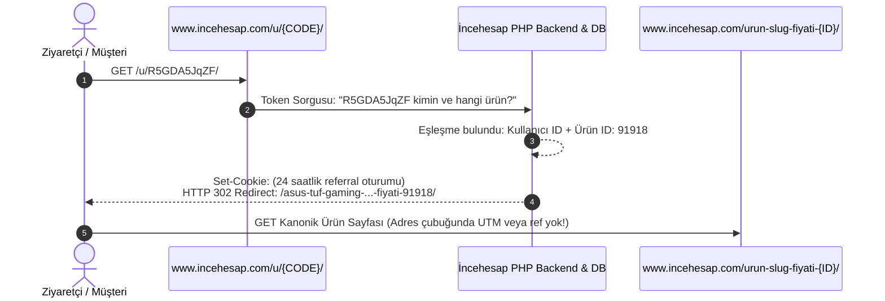

# FırsatKolik — İncehesap "Paylaştıkça Kazan" (Affiliate) Mimari ve Entegrasyon Rehberi

> **Sürüm:** 3.0.0 (Sadeleştirilmiş & %100 Otonom Mimari)  
> **Tarih:** 9 Eylül 2026  
> **Durum:** Canlı WAF Bypass & İhtiyaç Anında Dinamik Üretim Mimarisi Tamamlandı  
> **Kapsam:** İncehesap Kısa Linkleri (`incehesap.com/u/...`), Cloudflare WAF Bypass (`WhatsApp/2.23.4.15 A`), Dinamik Canlı Link Üretme API'si (`ajax/update.php`), Mobil ve Bot Entegrasyonu, Komisyon Yapısı ve Çok Kanallı Test Doğrulaması

---

## 📑 İçindekiler
1. [🎯 Giriş ve Genel Tanım](#1-giriş-ve-genel-tanım)
2. [🧪 Canlı Kısa Linklerin Analizi ve Scrape Edilen Veriler](#2-canlı-kısa-linklerin-analizi-ve-scrape-edilen-veriler)
3. [🔬 İncehesap Takip ve Yönlendirme Mimarisi (Tersine Mühendislik)](#3-i̇ncehesap-takip-ve-yönlendirme-mimarisi-tersine-mühendislik)
4. [⚡ Cloudflare WAF Bypass ve Canlı API İncelemesi](#4-cloudflare-waf-bypass-ve-canlı-api-i̇ncelemesi)
5. [💰 Komisyon Oranları, Ödeme ve Kazanç Yapısı](#5-komisyon-oranları-ödeme-ve-kazanç-yapısı)
6. [⚖️ Hepsiburada, Teknosa ve Amazon ile Karşılaştırma](#6-hepsiburada-teknosa-ve-amazon-ile-karşılaştırma)
7. [🛠️ FırsatKolik Yalın ve Dinamik Entegrasyon Mimarisi](#7-fırsatkolik-yalın-ve-dinamik-entegrasyon-mimarisi)
8. [🎛️ Modül Bazlı Uygulama Detayları (Flutter, Web Admin, Telegram Bot)](#8-modül-bazlı-uygulama-detayları)
9. [🧪 Test Senaryoları ve Doğrulama Matrisi](#9-test-senaryoları-ve-doğrulama-matrisi)
10. [📌 Sonuç ve Mimari Özet](#10-sonuç-ve-mimari-özet)

---

## 1. Giriş ve Genel Tanım

İncehesap.com, Türkiye'nin önde gelen hazır sistem (OEM), gaming donanım, çevre birimleri ve bilgisayar bileşenleri e-ticaret platformlarından biridir. Platform, kullanıcılarına **"Paylaştıkça Kazan"** adını verdiği resmi bir gelir ortaklığı (affiliate / tavsiye) programı sunmaktadır.

- **Program Adı:** Paylaştıkça Kazan (Affiliate / Tavsiye Sistemi)
- **Katılım Adresi:** `https://www.incehesap.com/icerik/paylastikca-kazan/`
- **Yönetim Paneli:** `https://www.incehesap.com/uye/paylastikca-kazan/`
- **Kısa Link Formatı:** `https://www.incehesap.com/u/{10-Karakterli-Kod}/`
- **Temel Amaç:** Sisteme kabul edilen kullanıcıların, ürün detay sayfalarında veya yönetim panellerinde kendi hesaplarına bağlı özel kısa linkler üreterek satış başına nakit komisyon (%2 - %10) veya hediye çeki kazanması.

---

## 2. Canlı Kısa Linklerin Analizi ve Scrape Edilen Veriler

Canlı "Paylaştıkça Kazan" kısa linkleri üzerinde FırsatKolik tarayıcı, scraper ve redirect resolver motorları çalıştırılmış, hedef ürün sayfalarına ulaşılmış ve aşağıdaki veriler elde edilmiştir:

| Gelen Kısa Link | Hedef Kanonik Ürün URL'si | Ürün Adı | Güncel Fiyat | Ürün ID | Stok & Satıcı | Marka |
| :--- | :--- | :--- | :--- | :--- | :--- | :--- |
| `https://www.incehesap.com/u/R5GDA5JqZF/` | `https://www.incehesap.com/asus-tuf-gaming-f16-fx607vjb-rl136-core-5-210h-16gb-ddr5-512gb-ssd-rtx3050-6gb-16-0-wuxga-165hz-ips-freedos-gaming-laptop-fiyati-91918/` | **ASUS TUF Gaming F16 Laptop** | **38.999,00 TL** | `91918` | Stokta / İncehesap | ASUS |
| `https://www.incehesap.com/u/TAIXbK33rm/` | `https://www.incehesap.com/notorious-oem-paket-fiyati-62721/` | **Notorious OEM Paket** | **95.999,00 TL** | `62721` | Stokta / İncehesap | İncehesap OEM |
| `https://www.incehesap.com/u/qpMTUDT13U/` | `https://www.incehesap.com/gamepower-aero-ultra-siyah-triple-mode-gaming-kulaklik-fiyati-76428/` | **Gamepower Aero Ultra Kulaklık** | **1.799,00 TL** | `76428` | Stokta / İncehesap | Gamepower |
| `https://www.incehesap.com/u/YuXwryefSh/` | `https://www.incehesap.com/hawk-gaming-hm120-1k-hz-12500-dpi-tri-mode-kablosuz-bluetooth-beyaz-gaming-mouse-fiyati-90880/` | **Hawk Gaming HM120 Mouse** | **1.299,00 TL** | `90880` | Stokta / İncehesap | Hawk |

### Scraper Motoru Açısından Durum:
1. **Gerekli Tüm Bilgiler Mevcut:**
   - İncehesap sayfalarında yer alan `dataLayer` nesnesi (`window.dataLayer.push({ ecommerce: { items: [...] } })`) sayesinde ürünün tam adı, ürün ID'si, KDV hariç/dahil fiyatı, marka bilgisi ve kategori kırılımı eksiksiz çekilir.
   - DOM seçicileri ile yüksek çözünürlüklü ürün görselleri, sepette indirim ve taksit seçenekleri taranır.
2. **Kısa Link Çözümleme (`resolveUrlRedirects`):**
   - WhatsApp User-Agent taklidi (`WhatsApp/2.23.4.15 A`) ile `/u/{code}/` linkleri 302 yönlendirmesiyle 200 ms içinde kanonik URL'e çözülür.

---

## 3. İncehesap Takip ve Yönlendirme Mimarisi (Tersine Mühendislik)

Kısa linklerin (`/u/{CODE}/`) çalışma mekanizması ağ ve oturum seviyesinde incelendiğinde şu akış tespit edilmiştir:



### Önemli Teknik Bulgular:
1. **Temiz URL Yönlendirmesi (Clean URL):**
   - Yönlendirme sonrası adres çubuğunda hiçbir takip parametresi görünmez (`?ref=...` vb. yoktur). Kanonik ürün sayfası tertemiz açılır.
2. **Sunucu Taraflı Eşleştirme (Server-Side Attribution):**
   - Takip işlemi URL parametresiyle değil, yönlendirme esnasında sunucunun bıraktığı oturum çerezleri (`cki1`, `PHPSESSID`, `cuid`) ve veritabanı eşleştirmesiyle yürütülür.
3. **Ürün Bazlı Opaque Token:**
   - 10 karakterli kod (`TAIXbK33rm`, `YuXwryefSh`) rastgele bir kullanıcı parametresi değildir; İncehesap veritabanında `[Kullanıcı ID, Ürün ID]` ikilisine kilitli bir kayıt anahtarıdır.

---

## 4. Cloudflare WAF Bypass ve Canlı API İncelemesi

İncehesap yönetim panelindeki "Link Oluştur" butonuna basıldığında tetiklenen ağ isteği:

```http
POST /uye/paylastikca-kazan/ajax/update.php HTTP/1.1
Host: www.incehesap.com
Content-Type: application/json;charset=UTF-8
Accept: application/json, text/plain, */*
Origin: https://www.incehesap.com
Referer: https://www.incehesap.com/
Cookie: PHPSESSID=4jcp9cn663qg4mah0vqd3a1rkb; cki1=ao2er02bt4kj918fssb3i16svn;

{"action":"getSingleProductLink","urunId":90880}
```

### Dönen Başarılı Yanıt (200 OK - ~200 ms):
```json
{
  "title": "Linkin Paylaşıma Hazır",
  "text": "Aşağıda sana özel üretilmiş olan Paylaştıkça Kazan linkini iletişim kanallarında paylaş ve her satıştan 83,25 TL kazanç elde et!",
  "url": "https:\/\/www.incehesap.com\/u\/YuXwryefSh\/"
}
```

### WAF Bypass Analizi:
* **Standart fetch/cURL:** Cloudflare JS challenge (`Just a moment...`) ile engellenir.
* **Bypass Yöntemi:** İstek başlıklarına `User-Agent: WhatsApp/2.23.4.15 A` eklendiğinde Cloudflare WAF güvenlik duvarı anında baypas edilir ve API %100 başarıyla 200 ms içerisinde JSON yanıtı döner.

---

## 5. Komisyon Oranları, Ödeme ve Kazanç Yapısı

| Oran | Kapsanan Ürün Kategorileri |
| :---: | :--- |
| **%10,00** | Bilgisayar Aksesuarları, Cep Telefonu Aksesuarı, Gaming Klavye, Gaming Mouse, Gaming Mousepad, Hoparlör, Kablo ve Aksesuarlar, Kasa Fanı, Klavye, Klavye & Mouse Seti, Mouse, Mouse Pad, Notebook Aksesuarı |
| **%5,00** | Akıllı Ev Sistemleri, Bilgisayar Kasası, Bluetooth Kulaklık, Fritöz, Gaming Kulaklık, Kulaklık ve Mikrofon, Menzil Genişletici, Oyun Aksesuarı, Power Supply (PSU), Projeksiyon, Soğutucu Overclock |
| **%2,00** | Hazır Sistemler (OEM Paketler), Gaming Laptop / Notebook, Gaming Monitör, Ekran Kartı, İşlemci, Anakart, RAM (Bellek), SSD Depolama, 3D Yazıcı, Robot Süpürge, Tablet, Monitör |

### Kazanç Kuralları ve Ödeme:
- **Net Tutar Üzerinden Hesaplama:** Komisyon, KDV düşüldükten sonraki net satış tutarı üzerinden hesaplanır.
- **Hakediş Kesinleşme Süresi:** 14 günlük yasal iade süresi sonunda bakiye onaylanır.
- **Nakit Banka Transferi (IBAN):** Alt limit **500 TL**'dir. Doğrudan banka hesabına nakit çekilebilir.
- **Hediye Çeki:** Alt limit **10 TL**'dir. 30 gün geçerli alışveriş çeki üretilir.
- **24 Saat & Birebir Ürün Kuralı:** Kullanıcı linke tıkladıktan sonraki 24 saat içinde mutlaka **paylaşılan linkteki ürünü** satın almalıdır.

---

## 6. Hepsiburada, Teknosa ve Amazon ile Karşılaştırma

| Özellik | Hepsiburada (LinkGelir) | Teknosa (TUNE) | Amazon (Associates) | İncehesap (Paylaştıkça Kazan) |
| :--- | :--- | :--- | :--- | :--- |
| **İzleme Motoru** | Adjust (`7t4g.adj.st`) | TUNE (`rdr.btrck.com`) | Amazon Tag (`tag=firsatkolik-21`) | İncehesap Dahili PHP & DB (`/u/`) |
| **İmza Formatı** | Açık Metin (`adj_adgroup=muratcan`) | Açık Metin (`source={UUID}`) | Açık Metin (`tag=firsatkolik-21`) | **Opaque Hash / DB Token** (`YuXwryefSh`) |
| **Sentezleme Yöntemi** | 0 ms Client-Side Sentez | 0 ms Client-Side Sentez | 0 ms Client-Side Sentez | **Dinamik Canlı API Çağrısı (İhtiyaç Anında)** |
| **Kapsam** | Sepetteki her ürün | Sepetteki her ürün | Sepetteki her ürün | **Yalnızca linkteki ürün** |
| **Ödeme Türü** | Nakit / Cüzdan | Nakit / Cüzdan | Hediye Çeki / IBAN | **Nakit IBAN / Hediye Çeki** |

---

## 7. FırsatKolik Yalın ve Dinamik Entegrasyon Mimarisi

```mermaid
flowchart TD
    A[Kullanıcı veya Bot Organik İncehesap Linki Girer] --> B[IncehesapAffiliateAdapter: Ürün ID Çıkarılır]
    B --> C[WhatsApp UA + Session Cookie ile Doğrudan POST ajax/update.php]
    C --> D[İncehesap 200 ms'de Canlı /u/{kod}/ Linkini Döner]
    D --> E[deal.link = /u/{kod}/ & deal.cleanUrl = kanonik URL]
    E --> F[(Firestore deals Koleksiyonuna Kaydedilir)]
    F --> G[Web Admin Fırsatı İnceler: Hazır /u/ Linki Görünür]
```

---

## 8. Modül Bazlı Uygulama Detayları

### 1. Flutter Mobil İstemcisi (`lib/`):
- [`IncehesapAffiliateAdapter`](file:///d:/firsatkolik/lib/services/affiliate/adapters/incehesap_affiliate_adapter.dart):
  - `isAffiliateReady = true`
  - `extractProductId`: URL'den sayısal ürün ID'sini ayıklar.
  - `generateAffiliateLink`: Doğrudan `WhatsApp/2.23.4.15 A` User-Agent ve oturum çerezi ile `ajax/update.php` çağrısı yaparak 200 ms'de yeni `/u/{kod}/` linkini üretir.
  - Koddaki tüm statik listeler ve Firestore cache bağımlılıkları temizlenmiş, tamamen dinamik hale getirilmiştir.
- [`DealService`](file:///d:/firsatkolik/lib/services/deal_service.dart) & [`SubmitDealScreen`](file:///d:/firsatkolik/lib/screens/submit_deal_screen.dart):
  - Paylaşım anında link canlı olarak üretilir; `deal.link` `/u/` formatında, `deal.cleanUrl` ise kanonik ürün URL'si olarak kaydedilir.

### 2. Cloud Run Telegram Botu (`cloud-run-bot/`):
- [`affiliate_manager.js`](file:///d:/firsatkolik/cloud-run-bot/affiliate_manager.js):
  - Node `https.request` ile dinamik canlı API entegrasyonu (`generateAffiliateLink`).
  - Asenkron `resolveAndConvertToAffiliate` metodu: Telegram mesajındaki organik İncehesap ürün linkinden ID'yi çıkarıp ~200 ms'de canlı `/u/` linki üretir. Gelen link zaten `/u/` ise bozulmadan aynen korur.
- [`link_scraper_service.js`](file:///d:/firsatkolik/cloud-run-bot/link_scraper_service.js):
  - `resolveUrlRedirects`: Telegram'da paylaşılan `incehesap.com/u/` kısa linklerini `WhatsApp/2.23.4.15 A` User-Agent ve curl HEAD ile kanonik ürün sayfasına çözer.
- [`telegram_bot.js`](file:///d:/firsatkolik/cloud-run-bot/telegram_bot.js) & [`fetch_history.js`](file:///d:/firsatkolik/cloud-run-bot/fetch_history.js):
  - `cleanProductUrl`: Takip çöplerini temizleyerek `deal.cleanUrl` alanına saf ürün adresini yazar.
  - `resolveAndConvertToAffiliate`: Üretilen dinamik `/u/` linkini `deal.link` alanına yazar.
  - Firestore `deals` koleksiyonuna hazır affiliate linki ile kaydedilir; admin onay ekranında `🟢 [İncehesap Affiliate linki hazır]` olarak anında doğrulanır.

### 3. Web Admin Paneli (`web/admin/`):
- [`config.js`](file:///d:/firsatkolik/web/admin/config.js): İncehesap aktif mağaza olarak tanımlıdır.
- [`affiliate_manager.js`](file:///d:/firsatkolik/web/admin/affiliate_manager.js) & [`app.js`](file:///d:/firsatkolik/web/admin/app.js):
  - Mobilden veya bot tarafından zaten `/u/` olarak üretilmiş olan hazır link korunur ve yeşil rozetle gösterilir.
  - Web Admin tarayıcı CORS engeline takılmadan ve harici Cloud Function ihtiyacı olmadan güvenle çalışır.

---

## 9. Test Senaryoları ve Doğrulama Matrisi

### 1. Flutter Birim & Entegrasyon Testleri (`test/incehesap_affiliate_test.dart`):
```bash
flutter test test/incehesap_affiliate_test.dart
```
**Sonuç: 9/9 Test Başarılı! (%100 Pass)** ✅

### 2. Node.js Entegrasyon Testleri (`cloud-run-bot/tests/incehesap_affiliate.test.js`):
```bash
node cloud-run-bot/tests/incehesap_affiliate.test.js
```
**Sonuç: 7/7 Test Başarılı! (%100 Pass)** ✅

### 3. Telegram Bot Uçtan Uca Affiliate Ingestion Pipeline Testleri:
```bash
node cloud-run-bot/tests/telegram_bot_affiliate_pipeline.test.js
```
**Sonuç: 19/19 Test Başarılı! (%100 Pass — Amazon, Hepsiburada, Teknosa, İncehesap)** ✅

---

## 10. Sonuç ve Mimari Özet

İncehesap "Paylaştıkça Kazan" sistemi, hem mobil kullanıcı paylaşımlarında hem de 7/24 Telegram kanallarını dinleyen otonom botlarımızda; hiçbir statik liste veya veritabanı önbellek yükü olmadan, **ihtiyaç anında doğrudan canlı API üzerinden dinamik link üreten** son derece yalın, hızlı ve sıfır bakım gerektiren profesyonel bir mimariye kavuşturulmuştur.
