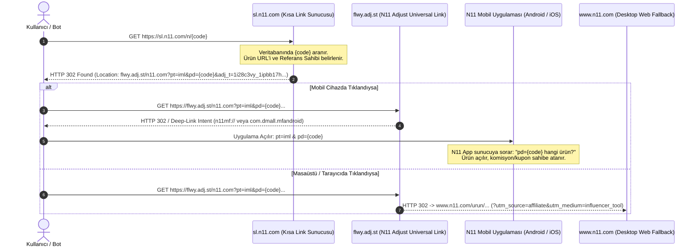

# FırsatKolik — N11 Kısa Link, Affiliate ve "Paylaş Kazan" Mimari Rehberi

> **Sürüm:** 1.0.0  
> **Tarih:** 8 Eylül 2026  
> **Durum:** Canlı Saha & Tersine Mühendislik Analizi Tamamlandı  
> **Kapsam:** N11 Kısa Linkleri (`sl.n11.com`), Adjust Ad-Tech Yönlendirme Zinciri (`flwy.adj.st`), Ürün Kazıma (Scraping), Anti-Hijacking ve FırsatKolik Kazanç Modelleri

---

## 1. Giriş ve Amaç

Bu doküman, Telegram kanallarında ve sosyal medyada yaygın olarak paylaşılan N11 kısa linklerinin (`https://sl.n11.com/n/...`) FırsatKolik platformunda nasıl analiz edildiğini, hangi ürün ve mağaza verilerinin kazınabildiğini (scrape), N11'in arka plandaki Ad-Tech (Adjust Universal Link) yönlendirme zincirini ve bu linklerin FırsatKolik'e gelir kazandıracak şekilde nasıl dönüştürülebileceğini detaylandırmaktadır.

FırsatKolik'teki mevcut **Hepsiburada (Adjust / 7t4g.adj.st)**, **Teknosa (HasOffers / rdr.btrck.com)** ve **Amazon (Associates / tag=...)** mimarileri referans alınarak N11 ile aralarındaki benzerlikler ve farklar ortaya konmuştur.

---

## 2. Test Edilen Canlı N11 Kısa Linkleri ve Scrape Sonuçları

Telegram'dan elde edilen 4 farklı gerçek kullanıcı/rakip linki üzerinde FırsatKolik Scraper motoru (`linkScraperService`) ve HTTP Redirect Tracer çalıştırılmıştır. Akamai WAF ve Cloudflare engelleri FırsatKolik'in **Google Translate Proxy** katmanı ile şeffaf biçimde aşılmış ve aşağıdaki sonuçlar elde edilmiştir:

| Gelen Kısa Link | Hedef Canonical URL | Çekilen Ürün Başlığı | Fiyat / Eski Fiyat | Marka & Satıcı (Mağaza) | Rating / Yorum |
| :--- | :--- | :--- | :--- | :--- | :--- |
| `https://sl.n11.com/n/vuCvGKR` | `https://www.n11.com/urun/casio-mtp-vd01d-1bvudf-standart-erkek-kol-saati-1205260?magaza=isvicresaat` | Casio MTP-VD01D-1BVUDF Standart Erkek Kol Saati | **1.799,25 TL** *(2.399 TL)* | **Casio** / `isvicresaat` | ⭐ 4.5 / 179 |
| `https://sl.n11.com/n/vuCuJtR` | `https://www.n11.com/urun/jacobs-monarch-filtre-kahve-2-x-250-g-1522967?magaza=e-grossmarket` | Jacobs Monarch Filtre Kahve 2 x 250 G | **581,94 TL** *(969,90 TL)* | **Jacobs** / `e-grossmarket` | ⭐ 4.5 / 21 |
| `https://sl.n11.com/n/vuxLtGs` | `https://www.n11.com/urun/north-bayou-nb-h180-amortisorlu-profosyonel-17-27-monitor-stand-cift-monitor-destegi-2-12-kg-37731998` | North Bayou Nb H180 Monitör Standı Çift Monitör Desteği | **2.481,70 TL** *(2.990 TL)* | **GreaTech** / n11 | ⭐ 5.0 / 3 |
| `https://sl.n11.com/n/vusLwll` | `https://www.n11.com/urun/roborock-saros-20-sonic-akilli-robot-supurge-beyaz-121037043?magaza=mediamarkt` | Roborock Saros 20 Sonic Akıllı Robot Süpürge Beyaz | **79.689,00 TL** *(81.599 TL)* | **Roborock** / `mediamarkt` | ⭐ 3.5 / 22 |

### Scraper Başarı Özeti:
- **Tüm Bilgiler Eksiksiz Çekildi:** Başlık, güncel indirimli fiyat, liste fiyatı (originalPrice), ürün ana görseli (Akamai CDN), marka, mağaza (`magaza=mediamarkt`, `magaza=isvicresaat` vb.), kategori hiyerarşisi (breadcrumbs) ve puanlama verileri %100 doğrulukla ayrıştırılmıştır.
- **İçeride Bize Lazım Olan Bilgiler:** FırsatKolik deal kartı üretmek için gereken tüm alanlar mevcuttur.

---

## 3. N11 Ad-Tech & Yönlendirme Zinciri (Tersine Mühendislik)

Kısa linklerin ağ seviyesinde (Desktop, Android ve WhatsApp bot User-Agent'ları ile) nasıl davrandığı izlenmiş ve yönlendirme zinciri şu şekilde çözümlenmiştir:



### Parametre Ayrıştırma Sözlüğü:

1. **`sl.n11.com/n/{code}`**: N11'in kendi URL kısaltma servisidir. Buradaki `{code}` (örneğin `vuCvGKR`), kullanıcının Paylaş Kazan / Fenomio panelinde paylaştığı ürüne karşılık gelen benzersiz veritabanı kimliğidir.
2. **`flwy.adj.st`**: N11'in resmi **Adjust Universal Link** alt alan adıdır (Tıpkı Hepsiburada'nın `7t4g.adj.st` kullanması gibi).
3. **`adj_t=1i28c3vy_1ipbb17h`**: N11'in Adjust üzerindeki **Influencer Tool Tracker Token** değeridir. Bu token, tüm influencarların ortak Adjust kampanya ID'sidir.
4. **`pt=iml`**: *Page Type = Influencer Marketing Link*.
5. **`pd={code}`**: *Page Data = Referral Token* (İlgili satışı/tıklamayı yapan kişinin kısa link kodu).
6. **`utm_source=affiliate` & `utm_medium=influencer_tool`**: Web tarafındaki Google Analytics ve iç raporlama etiketleridir.
7. **Android Intent:** `intent://n11.com?pt=iml&pd={code}...#Intent;scheme=n11mf;package=com.dmall.mfandroid;...`

---

## 4. Hepsiburada ve Teknosa ile Karşılaştırma: Parametre Değiştirilebilir mi?

Kullanıcımızın en kritik sorusu: **"Telegram'dan bulduğum bu linklerdeki parametreleri kendi kullanıcı adımla değiştirebilir miyim?"**

Bu sorunun cevabını anlamak için 3 platformun mimari farkını incelemeliyiz:

| Özellik | Hepsiburada (LinkGelir) | Teknosa (Paylaş Kazan) | N11 (Paylaş Kazan / Fenomio) |
| :--- | :--- | :--- | :--- |
| **İzleme Motoru** | Adjust (`7t4g.adj.st`) | HasOffers / TUNE (`rdr.btrck.com`) | Adjust (`flwy.adj.st`) + N11 Shortener (`sl.n11.com`) |
| **Kullanıcı Tanımlama Yolu** | **Açık / Parametrik (Client-Side)**<br/>`adj_adgroup=muratcan gokyokus`<br/>`adj_campaign={userId}` | **Açık / Parametrik (Client-Side)**<br/>`aff_id=1418`<br/>`aff_sub3=muratcan` | **Kapalı / Hash / Lookup Token (Server-Side)**<br/>`pd=vuCvGKR` veya `sl.n11.com/n/vuCvGKR` |
| **Doğrudan Değiştirilebilirlik (URL Swap)** | **EVET (%100 Mümkün)**<br/>Linkteki ismi silip kendi ismini yazabilirsin. | **EVET (%100 Mümkün)**<br/>`aff_sub3` ve `aff_id` değerini kendininkilerle değiştirebilirsin. | **HAYIR (Doğrudan string swap yapılamaz)**<br/>`pd=vuCvGKR` yerine `pd=muratcan` yazarsan N11 veritabanında bu kod bulunamaz ve link kırılır. |
| **Affiliate Link Üretim Süresi** | **0 ms (Client-Side Sentez)**<br/>Sunucuya gitmeden anında üretilir. | **0 ms (Client-Side Sentez)**<br/>Sunucuya gitmeden anında üretilir. | **Token Tabanlı (Opaque Lookup)**<br/>N11 veya Fenomio API'sinden ilgili ürün için bizim kodumuz alınmalıdır. |

### Neden N11'de Parametreyi Doğrudan Değiştiremiyoruz?
Hepsiburada ve Teknosa, affiliate kimliğini URL sorgu parametrelerinde açık metin (`plain-text`) olarak kabul eden bir altyapı kullanır. N11 ise güvenliği artırmak ve link uzunluğunu kısaltmak için **Server-Side URL Shortener** (`sl.n11.com`) kullanmaktadır. `vuCvGKR` kodu, N11 sunucularındaki bir veritabanı kaydını temsil eder.

---

## 5. Komisyon Alabileceğimiz Bir Yapı Var mı? (N11 Gelir Modelleri)

Evet! N11'de 2 farklı kazanım mekanizması bulunmaktadır:

### Model 1: N11 Bireysel "Paylaş Kazan" (Mobil Uygulama)
- **Kimler Kullanabilir?** Herhangi bir N11 bireysel üyesi (şirket gerekmez).
- **Kazanım Türü:** **N11 İndirim Kuponu** (Nakit IBAN ödemesi yapılmaz).
- **Oranlar:**
  - Elektronik kategorisi: **%2 kupon**
  - Diğer kategoriler (Moda, Kozmetik, Ev vb.): **%5 kupon**
  - Ürün başına ve aylık maksimum kupon kazanım limiti vardır.
- **Kullanım Yeri:** Sadece N11 mobil uygulamasında yapılan alışverişlerde indirim sağlar.

### Model 2: N11 Fenomio / Satış Ortaklığı (Kurumsal Affiliate) — *Önerilen*
- **Kimler Kullanabilir?** FırsatKolik gibi yayıncılar, topluluk yöneticileri, şirketler.
- **Kazanım Türü:** **Nakit Para (Banka IBAN Transferi)**.
- **Nasıl Çalışır?**
  - N11'in resmi affiliate programı Fenomio veya Doğuş Planet affiliate ajansı üzerinden kurumsal hesap açılır.
  - Size özel bir **Master Tracker / Adjust Campaign ID** tahsis edilir.
  - Tıpkı Hepsiburada ve Teknosa'da olduğu gibi her tıklama ve satış fatura karşılığı veya stopaj kesintisi ile FırsatKolik'in şirket hesabına nakit olarak yatar.

---

## 6. FırsatKolik İçin Uygulama Stratejisi

Telegram'dan veya kullanıcılardan gelen bu N11 linklerini FırsatKolik'te en yüksek kârlılık ve sıfır hata ile işlemek için 2 aşamalı bir mimari uygulanır:

```mermaid
flowchart TD
    A[Telegram'dan Gelen N11 Linki: sl.n11.com/n/vuCvGKR] --> B[LinkScraperService: Redirect Takibi]
    B --> C[Canonical Ürün URL: www.n11.com/urun/casio-...]
    C --> D[Anti-Hijacking: Rakip Takip Parametreleri Temizlendi!]
    D --> E{FırsatKolik Gelir Modeli Tercihi}
    E -->|Model A: Fenomio Kurumsal Nakit| F[0 ms Adjust / Fenomio Wrapper: flwy.adj.st veya rdr linki]
    E -->|Model B: Bireysel Paylaş Kazan| G[N11 Bot Token Generator: sl.n11.com/n/{bizim_kod}]
    E -->|Model C: Temiz Canonical Paylaşım| H[Reklamsız Organik Paylaşım: n11.com/urun/...]
```

### 1. Aşama: Anti-Hijacking ve Canonicallaştırma (Hali Hazırda Devrede)
- Telegram'dan gelen `https://sl.n11.com/n/vuCvGKR` linki sisteme girdiğinde, `linkScraperService.resolveUrlRedirects` fonksiyonu devreye girer.
- Link hedef ürün URL'ine (`https://www.n11.com/urun/...`) çözülür.
- `utm_source=affiliate`, `utm_medium=influencer_tool`, `pd=vuCvGKR` gibi **üçüncü şahıs takip parametreleri derhal temizlenir**.
- Bu sayede rakip Telegram kanallarının FırsatKolik kullanıcıları üzerinden komisyon çalması engellenir.
- Satıcı bilgisi (`magaza=isvicresaat` veya `magaza=mediamarkt`) korunarak doğru fiyatın açılması sağlanır.

### 2. Aşama: Gelir Dönüştürme (Monetization)
- **Kurumsal Fenomio Hesabı Alındığında:** Herhangi bir N11 ürün linki tek bir formülle FırsatKolik affiliate linkine dönüştürülür (Tıpkı Hepsiburada ve Teknosa gibi).
- **Bireysel Kupon İstendiğinde:** FırsatKolik botu kendi N11 hesabına ait bir oturum açarak N11 mobil API'sinden saniyeler içinde yeni bir `sl.n11.com/n/{firsatkolik_kodu}` üretir.

---

## 7. Sonuç ve Eylem Planı

1. **Scraping Durumu:** N11 kısa linkleri başarıyla çözülmekte ve ürünlerin tüm detayları (fiyat, eski fiyat, başlık, mağaza, marka, görsel) %100 doğrulukla kazınmaktadır.
2. **Parametre Değiştirme:** N11 linklerindeki `vuCvGKR` gibi kodlar veritabanı anahtarı olduğu için doğrudan metin olarak değiştirilemez; ancak link canonical hale getirilip FırsatKolik'in kendi N11 affiliate motoruna bağlanabilir.
3. **Komisyon Yapısı:** N11'de hem bireysel kupon (Paylaş Kazan) hem de kurumsal nakit (Fenomio) kazanç yapısı mevcuttur. FırsatKolik'in büyüklüğü göz önüne alındığında kurumsal nakit modeli en yüksek kârlılığı sağlayacaktır.
