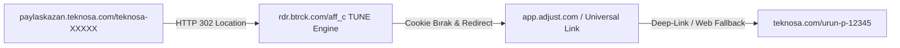
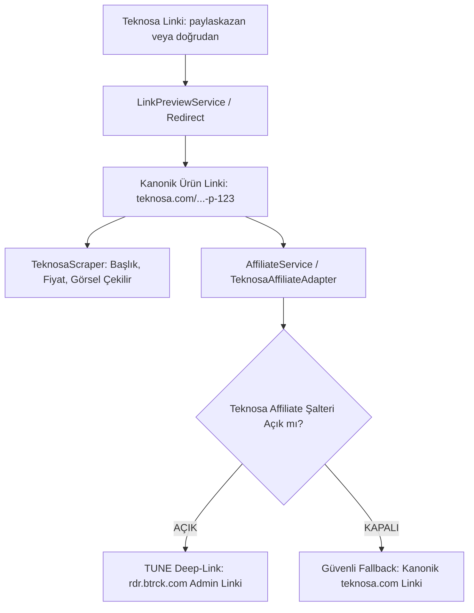

# Teknosa Gelir Ortaklığı (Affiliate / Paylaş Kazan) ve TUNE Mimarisi Kılavuzu

> [!NOTE]
> Bu doküman, FırsatKolik platformundaki **Teknosa** mağazasına ait gelir ortaklığı (affiliate) altyapısını, Paylaş Kazan tersine mühendisliğini, 0 ms TUNE HasOffers deep-link sentezleme motorunu, çift kademeli fallback/hata toleransını ve yönetim paneli kontrollerini detaylandıran **mağaza özel teknik kontratıdır**.
>
> Genel platform mimarisi ve diğer mağaza stratejileri için bkz:  
> 👉 **[Ana Affiliate Link Dönüştürme ve Stratejileri Rehberi](file:///d:/firsatkolik/documentation/scraping-ve-botlar/affiliate/affiliate_link_donusturme_ve_stratejileri_rehberi.md)**

---

## 📑 İçindekiler
1. [🎯 Felsefe ve Tasarım Amacı: Neden TUNE Tersine Mühendisliği?](#1--felsefe-ve-tasarım-amacı-neden-tune-tersine-mühendisliği)
2. [🔬 Teknosa & TUNE (Winfluenced) Altyapı Mimarisi](#2--teknosa--tune-winfluenced-altyapı-mimarisi)
3. [🔄 Üç Farklı Giriş Senaryosu ve Otomatik Yönetim](#3--üç-farklı-giriş-senaryosu-ve-otomatik-yönetim)
4. [🛡️ Çift Kademeli Fallback ve Dayanıklılık Mimarisi](#4-️-çift-kademeli-fallback-ve-dayanıklılık-mimarisi)
5. [🎛️ Web Admin ve Mobil Admin Yönetim Kontrolleri](#5-️-web-admin-ve-mobil-admin-yönetim-kontrolleri)
6. [💻 Kod Mimarisi ve Tek Gerçek Kaynağı (Single Source of Truth)](#6--kod-mimarisi-ve-tek-gerçek-kaynağı-single-source-of-truth)
7. [📊 Canlı Loglama ve İzleme Formatı (`[AFFILIATE-TEST]`)](#7--canlı-loglama-ve-izleme-formatı-affiliate-test)
8. [🧪 Test Senaryoları ve Doğrulama Matrisi](#8--test-senaryoları-ve-doğrulama-matrisi)
9. [💡 Canlı Test İpuçları: Tıklama Sayımı, Self-Referral ve Panel Güncelleme Süreçleri](#9--canlı-test-ipuçları-tıklama-sayımı-self-referral-ve-panel-güncelleme-süreçleri)
10. [🤖 Telegram Botu (Node Scraper) ve Cloud Run Entegrasyonu](#10--telegram-botu-node-scraper-ve-cloud-run-entegrasyonu)

---

## 1. 🎯 Felsefe ve Tasarım Amacı: Neden TUNE Tersine Mühendisliği?

Teknosa, Türkiye tüketici elektroniği pazarının en büyük oyuncularından biridir ve "Paylaş Kazan" programı ile kullanıcılarına tavsiye ettikleri ürünlerden komisyon kazandırmaktadır. 

FırsatKolik gibi yüksek hacimli ve gerçek zamanlı bir indirim platformunda Teknosa linklerini gelir ortaklığına dönüştürürken karşılaşılan zorluklar ve geliştirilen çözüm felsefesi şöyledir:

### Klasik Yöntemlerin Çıkmazı
1. **Oturum Zorunluluğu (Login Dependency):** Teknosa web/mobil arayüzü, Paylaş Kazan linki üretebilmek için kullanıcının oturum açmış olmasını gerektirir. Sunucu tarafında oturumu canlı tutmak devasa bir çerez yönetim yükü getirir.
2. **WAF ve Bot Koruması (Cloudflare):** Teknosa'nın API uç noktalarına sunucudan (Cloud Run / VM) istek atıldığında `cf_clearance` ve TLS parmak izi engeline takılır (HTTP 403).
3. **Ağ Gecikmesi (Network Latency):** Her fırsat için dış sunucuya HTTP isteği atmak 1-3 saniye gecikme yaratır.

### FırsatKolik Çözüm Felsefesi: "Sıfır İstek, %100 Başarı (0 ms Sentezleme)"
Teknosa'nın ürettiği linklerin arkasında yatan ad-tech mekanizması çözülmüş ve **hiçbir ağ isteği atmadan, sadece matematiksel URL parametre enjeksiyonu ile TUNE deep-link'i sentezleyen** algoritmik bir adaptör inşa edilmiştir.

---

## 2. 🔬 Teknosa & TUNE (Winfluenced) Altyapı Mimarisi

Teknosa'nın Paylaş Kazan sistemi canlı trafik analizine tabi tutulduğunda şu yönlendirme zinciri ortaya çıkarılmıştır:



### Keşif ve Mimari Çözümleme
1. **Arka Plandaki Asıl Motor:** Teknosa'nın ürettiği `https://paylaskazan.teknosa.com/teknosa-XXXXX` kısa linki sadece bir aracı yönlendiricidir. Bu linke tıklandığında aslında dünya devi affiliate ağı olan **TUNE (HasOffers / `rdr.btrck.com`)** ve **Winfluenced** altyapısına 302 yönlendirmesi yapılmaktadır:
   ```
   https://rdr.btrck.com/aff_c?offer_id=5&aff_id=1016&source={USER_UUID}&aff_sub={USER_UUID}&aff_sub3=teknosa.com/...&url=...
   ```
2. **"Token" Yanılgısı:** Komisyonu hesaba bağlayan şey anlık oturum şifresi/token'ı **değildir**. TUNE sistemindeki `source` ve `aff_sub` parametreleri, kullanıcının **kalıcı Üye/Cüzdan ID'sidir (UUID)**. Tıpkı bir banka IBAN'ı gibi ömür boyu sabittir.
3. **Dinamik Deep-Link Kabulü:** TUNE redirect motoru, hedef ürün linkini doğrudan `&url=` parametresiyle kabul etmekte; araya girip 30 günlük `enc_aff_session_5` affiliate oturum çerezini bırakmakta ve kullanıcıyı hedef ürüne fırlatmaktadır.

### Parametre Şeması ve Anlamları:
```
https://rdr.btrck.com/aff_c
  ?offer_id=5                                    -> Teknosa Paylaş Kazan Kampanya ID'si
  &aff_id=1016                                   -> Winfluenced Affiliate Network ID'si
  &source=906bd201-92dc-4898-914a-10309b2cd576   -> Admin Kalıcı Üye GUID'i
  &aff_sub=906bd201-92dc-4898-914a-10309b2cd576  -> Kalıcı Takip Parametresi
  &aff_sub3=teknosa.com/urun-yolu-p-XXXXXX        -> Kanonik Ürün Yolu
  &url=https%3A%2F%2Fwww.teknosa.com%2F...-p-XXXXXX%3FshopId%3D2442%26utm_source%3Dsocial_affiliate%26utm_medium%3Dpaylaskazan%26utm_campaign%3D906bd201...
```

* **`offer_id=5`:** Teknosa Paylaş Kazan kampanyasını temsil eden değişmez kampanya ID'si.
* **`aff_id=1016`:** Winfluenced affiliate ağının ağ kimliği.
* **`source` & `aff_sub` (Admin GUID):** FırsatKolik admin hesabının kalıcı takip kimliği (`906bd201-92dc-4898-914a-10309b2cd576`).
* **`aff_sub3` (Normalleştirilmiş Düz Slash Standardı):** Ürünün Teknosa üzerindeki yolu (örn. `teknosa.com/apple-iphone-13-128gb...-p-125077975`).  
  > ⚠️ **KRİTİK RAPORLAMA KURALI (`/` vs `%2F` Normalizasyonu):**  
  > Teknosa'nın TUNE / HasOffers raporlama paneli, istatistikleri `aff_sub3` metnine göre `GROUP BY` yaparak gruplar. Standart URL kodlayıcılar `/` işaretini `%2F` olarak encode ederse, panel aynı ürün için iki farklı satır (`teknosa.com/...` ve `teknosa.com%2F...`) oluşturup tıklama ve kazanç verilerini böler.  
  > FırsatKolik adaptörü, Teknosa'nın kendi yerel Paylaş Kazan yönlendirmesiyle %100 uyumlu şekilde `aff_sub3` değerini her zaman **düz slash (`/`)** ile oluşturur; gelen eski `%2F`'li linkleri otomatik olarak bu standarda yükseltir (auto-upgrade). Böylece aynı ürün hem yerel hem dönüştürülmüş linklerden tek bir satırda kusursuzca raporlanır.
* **`url`:** Nihai kanonik ürün sayfası. İçerisine Teknosa'nın kendi kampanya UTM etiketleri (`utm_source=social_affiliate`, `utm_medium=paylaskazan`, `utm_campaign={UUID}`) gömülür.
* **Pazaryeri Parametre Koruması (`shopId`):** Teknosa pazaryerindeki üçüncü taraf satıcı parametreleri (`shopId` vb.) temizlenmez; UTM etiketleriyle birlikte URL içine kayıpsız enjekte edilir. Böylece satıcı bazlı özel indirimlerin geçerliliği korunur.

---

## 3. 🔄 Üç Farklı Giriş Senaryosu ve Otomatik Yönetim

FırsatKolik'e Teknosa ile ilgili bir link geldiğinde sistem 3 farklı senaryoyu kusursuz şekilde yönetir:

### Senaryo 1: Kullanıcı Normal/Organik Ürün Linki Paylaştığında
* **Gelen Link:** `https://www.teknosa.com/apple-iphone-13-128gb-yildiz-isigi-akilli-telefon-p-125077975`
* **İşlem:** `TeknosaAffiliateAdapter.convert` çağrılır. 
* **Çıktı:** 0 ms gecikmeyle adminin `rdr.btrck.com` deep-link'i sentezlenir.

### Senaryo 2: Kullanıcı "Paylaş Kazan" Kısa Linki Paylaştığında
* **Gelen Link:** `https://paylaskazan.teknosa.com/teknosa-F8NSB38NC3`
* **İşlem:** 
  1. `LinkPreviewService.resolveTeknosaPaylasKazan` HTTP 302 header'ındaki `Location` değerini yakalar.
  2. Location içindeki gömülü `url`, `redirect` veya `aff_sub3` alanından gerçek ürün URL'si ayıklanır (`teknosa.com/...-p-790182989`).
  3. Fırsat paylaşımında ([`deal_service.dart`](file:///d:/firsatkolik/lib/services/deal_service.dart)) `cleanUrl` alanına ayıklanan kanonik temiz ürün linki, `link` alanına ise doğrudan adminin `rdr.btrck.com` affiliate linki sentezlenerek kaydedilir (fırsat admin onayı bekliyor olsa dahi affiliate linki ilk andan itibaren hazır olarak veritabanına yazılır).
  4. Admin onay ekranında veya düzenleme pencerelerinde hem temiz link hem de hazır affiliate linki anında görüntülenir.

### Senaryo 3: Kullanıcı Başkasına Ait TUNE Affiliate Linki Paylaştığında (0 ms Retargeting)
* **Gelen Link:** `https://rdr.btrck.com/aff_c?offer_id=5&aff_id=1016&source=baskasinin-guid&url=https%3A%2F%2Fwww.teknosa.com%2Furun-p-123`
* **İşlem:** 
  1. `TeknosaAffiliateAdapter.isAlreadyAffiliate` linki inceler: `source != adminUserId` olduğu için hazır kabul etmez.
  2. `TeknosaAffiliateAdapter.convert` linkin içindeki `url` parametresini anında unwrap eder (0 ms).
  3. Başkasının referans ID'si atılır, adminin UUID'si ile yeni bir link sentezlenir (Retargeting / Hijacking).

---

## 4. 🛡️ Çift Kademeli Fallback ve Dayanıklılık Mimarisi

> [!IMPORTANT]
> **Kesintisiz Deneyim Garantisi (Non-Blocking):**  
> Teknosa affiliate motoru hiçbir zaman işlem kesici (blocking) değildir. TUNE yönlendirmesinde, ağ el sıkışmasında veya şalter durumunda ne yaşanırsa yaşansın; fırsat paylaşımı, admin onayı veya kullanıcının mağazaya gitmesi asla aksamaz; sistem otomatik olarak kanonik `teknosa.com` linki üzerinden (%100 kesintisiz) akışına devam eder.

Teknosa altyapısında herhangi bir değişiklik olması durumunda platformun zarar görmemesi için kurulan koruma kalkanı:



### 1. Kademe: Kazıma ve Metadata Güvenliği (İzolasyon)
Metadata çekme işlemi (`TeknosaScraper`, `link_scraper_service.js`) affiliate motorundan tamamen bağımsızdır. Link ister Paylaş Kazan, ister TUNE, ister organik olsun; JSON-LD ve DOM seçiciler doğrudan kanonik ürün sayfasından çekilir.

### 2. Kademe: Kill-Switch / Acil Durum Şalteri (Uçtan Uca Senkronizasyon)
Web Admin panelindeki **Ayarlar > Acil Durum Kontrolleri** altından veya Firestore `settings/app` altındaki `teknosaAffiliateEnabled` anahtarı `false` yapıldığında sistemin tüm katmanları eşzamanlı olarak güvenli fallback moduna geçer:

1. **Canlı Dinleyici Senkronu (Real-time Listeners):**
   * **Mobil Flutter (`lib/main.dart`):** `AffiliateService.initSettingsListener()` başlatılır. Şalter Web Admin'den kapatıldığı anda Firestore `settings/app` dinleyicisi tüm aktif mobil cihazlarda `AffiliateService.setStoreEnabled('teknosa', false)` tetikler.
   * **Web Admin (`web/admin/app.js`):** `initAdminAffiliateSettingsListener()` ile tüm açık tarayıcı sekmeleri Firestore `onSnapshot` üzerinden anında güncellenir.
2. **Fırsat Paylaşım Ekranı (`DealService.createDeal`):** Fırsat kaydedilmeden hemen önce `settings/app` okunarak `AffiliateService.syncFromMap(sData)` çağrılır. Şalter kapalıyken paylaşılan `paylaskazan.teknosa.com` linkleri kanonik ürüne çözümlenir ancak TUNE linkine dönüştürülmeyerek doğrudan temiz organik link olarak kaydedilir.
3. **Admin Onay Rozetleri (`admin_screen.dart` & Web Admin):** `AffiliateService.isStoreSupported` ve `AffiliateManager.isStoreSupported` şalter kapalıyken `false` döner. Böylece onay bekleyen fırsatlarda yeşil affiliate rozeti çıkmaz.
4. **Düzenleme Modalları (`admin_edit_sheet.dart` & Web `showDealModal`):** Şalter kapalıyken çoklu görünüm yerine standart tek link arayüzü gösterilir. Eski `btrck.com` linki varsa otomatik olarak temiz kanonik linke unwrap edilir.
5. **Mağazaya Git Butonu ve Hibrit Yönlendirme (`StoreRedirectService`):**
   * Veritabanındaki fırsat geçmişten kalma bir `rdr.btrck.com` linki içerse dahi, kullanıcı *"Mağazaya Git"* butonuna bastığında `StoreRedirectService.launchStore` devreye girer.
   * **Şalter KAPALI İken:** `AffiliateService.getAdapter(cleanUrl)` kontrol edilir. Şalter kapalıysa (`!adapter.isEnabled`) link derhal organik kanonik `teknosa.com` linkine çözülür; geçiş HUD'ı açılmadan, eski dünyada olduğu gibi **0 ms gecikmeyle doğrudan Teknosa sayfası açılır**.
   * **Şalter AÇIK İken (Zorunlu Güvenli Geçiş HUD'ı & Diyalog İçi 302 Çözümleme):**
      * Teknosa'nın gelir ortaklığı (Paylaş Kazan / Winfluenced), dünya devi affiliate ağı **TUNE (HasOffers)** altyapısını kullanır. TUNE sistemi, `https://rdr.btrck.com/...` adresine yapılan yönlendirme anında tarayıcıya `Set-Cookie: enc_aff_session_5=...` adında 30 günlük şifreli bir oturum çerezi bırakır ve `Location: https://www.teknosa.com/...?...utm_source=social_affiliate&utm_medium=paylaskazan&utm_campaign={userId}` hedefine yönlendirir.
      * Eğer ham `rdr.btrck.com` linki harici tarayıcıya fırlatılırsa, kullanıcı Chrome'un açıldığını ve adres çubuğunda çirkin takip linkinin yüklendiğini görür; 1 saniye sonra Teknosa uygulamasına geçer. Bu kullanıcı deneyimini zedeleyen ara tarayıcı sıçramasını önlemek için **Diyalog İçi 302 Çözümleme (Internal Resolution)** mimarisi kurulmuştur:
        1. Kullanıcı "Mağazaya Git"e bastığında ekranda 1.2 saniyelik minimalist ve güven veren kurumsal **`StoreRedirectDialog` HUD**'ı açılır (Teknosa logosu, pulse animasyonu, 256-Bit SSL rozeti).
        2. Diyalog ekrandayken görünmez olarak (arka planda ~300 ms içinde) `rdr.btrck.com` adresine `followRedirects: false` ile bir HTTP GET isteği gönderilir. TUNE sunucusu tıklamayı anında kaydeder ve 302 `Location` başlığını döner.
        3. Diyalog bu `Location` içerisindeki kanonik `teknosa.com` App Link adresini yakalar ve **`LaunchMode.externalNonBrowserApplication`** moduyla doğrudan yerel **Teknosa uygulamasına (`com.tmob.teknosa`)** fırlatır.
        4. **Elde Edilen Sonuç:** **CHROME HİÇ AÇILMAZ!** Adres çubuğunda hiçbir takip linki görünmez! Kullanıcı FırsatKolik HUD'ından pürüzsüzce yerel Teknosa uygulamasına ve ilgili ürüne aktarılır. Cihazda Teknosa yüklü değilse harici tarayıcı doğrudan temiz ürün sayfasına yönlenir. Sahtekarlık riski %0, TUNE tıklama kaydı %100, kullanıcı deneyimi kusursuzdur.
6. **Admin Onaylama Anı (`approval_dialogs.dart`):** Onay anında şalter kapalıysa, fırsatın `url`, `link` ve `cleanUrl` alanları temiz organik link olarak onaylanır ve yayına verilir.

---

## 5. 🎛️ Yönetim Paneli (Admin) Entegrasyonları ve Denetim

> **Canlı Rollout Durumu:** FırsatKolik genelinde affiliate rozetleri, "Orijinalden Affiliate Üret" butonları ve Çoklu Link (Dual View) arayüzleri **Teknosa ve Hepsiburada için** canlı ve aktiftir (`activeStores: ['teknosa', 'hepsiburada']`). Diğer mağazalarda (Amazon, Trendyol vb.) arayüz karmaşasını önlemek adına standart temiz tek link gösterilir.

### 🌟 Temiz URL (`cleanUrl`) vs Affiliate URL (`link`) Ayrımı
* **Kullanıcılar İçin (`deal.displayUrl`):** Kullanıcı mağaza linkini kopyaladığında (`copyStoreLink`) veya WhatsApp/Telegram'da paylaştığında (`shareToNativeApps`), asla karmaşık `rdr.btrck.com` linkini görmez; daima **temiz Teknosa ürün linkini** alır.
* **Komisyon İçin (`deal.link`):** Yalnızca *"Mağazaya Git"* butonunda arka planda `rdr.btrck.com` affiliate linki tetiklenir.

### Web Admin Paneli
* **Konum:** Web Admin > Ayarlar (Settings) > Acil Durum Kontrolleri.
* **Canlı Switch (`#settingsToggleTeknosaAffiliateBtn`):** Tek tıkla Teknosa affiliate dönüşümünü açıp kapatır.
* **İnteraktif `!` Butonu (`#teknosaAffiliateInfoBtn`):** Tıklandığında açık ve kapalı modların çalışma mantığını anlatan 2 sütunlu rehber kutusunu (`#teknosaAffiliateInfoBox`) açar/kapatır.
* **Firestore Senkronu:** `settings/app` altındaki `teknosaAffiliateEnabled` bayrağını canlı günceller.
* **Fırsat Düzenleme Modalı (Çoklu Görünüm - Dual View):**
  * **Orijinal Mağaza Linki (`#editCleanUrl`):** Kullanıcılara görünen temiz link + *"Orijinal Linki Aç"* + *"Orijinalden Affiliate Üret"* (`#convertToAffiliateBtn`).
  * **Aktif Affiliate Linki (`#editAffiliateUrl`):** `rdr.btrck.com` linki + *"Affiliate Test Et"* (`#previewAffiliateBtn`) + canlı durum rozeti (`#affiliateStatus`).
  * **Otomatik Hazırlık:** Modal açıldığı anda fırsatın linki henüz `btrck.com` içermiyorsa otomatik olarak `convertToAffiliateLink` ile sentezlenerek `#editAffiliateUrl` kutusuna doldurulur ve yeşil rozet yanar.
  * **Kayıt Emniyeti (`saveDealChanges`):** Durum ne olursa olsun (`pending`, `active` vb.) link kaydedilirken affiliate linki korunur/sentezlenir.

### Mobil Admin Onay Ekranı ([`admin_screen.dart`](file:///d:/firsatkolik/lib/screens/admin_screen.dart))
* Onay bekleyen fırsat kartlarında dinamik durum rozetleri (Sadece Teknosa için gösterilir):
  * `🟢 [Teknosa Affiliate linki hazır]` (Fırsat ilk paylaşıldığı anda affiliate üretildiği için varsayılan olarak bu rozet çıkar).
  * `🟠 [Teknosa linki (Onaylanınca otomatik affiliate'e dönüştürülür)]` (Eski veya manuel düzenlemede organik bırakılmış kayıtlar için emniyet rozeti).
* **Hızlı Onay (`_approveDeal` - Fast-Path & Safety Net):**
  * **⚡ Hızlı Yol (Fast-Path - %99):** Link zaten paylaşım anında affiliate yapılmışsa hiçbir mükerrer hesaplama yapılmaz (0 ms). Sadece `isApproved: true` yapılır. Veritabanında hazır bekleyen affiliate linki doğrudan kullanıcıların *"Mağazaya Git"* butonu arkasında yayına girer.
  * **🛡️ Emniyet Ağı (Safety Net - %1):** Link eski bir sistemden kalmışsa veya organikse, onaylama anında tek seferlik affiliate'e dönüştürülür ve `cleanUrl` tamamlanır.
* **Düzenleme Modalı ([`admin_edit_sheet.dart`](file:///d:/firsatkolik/lib/screens/deal_detail/admin_dialogs/admin_edit_sheet.dart)) - Çoklu Görünüm:**
  * Sheet açıldığı anda `linkController`'a hazır affiliate linki yüklenir; eksikse 0 ms'de otomatik üretilir.
  * **Orijinal Mağaza Linki (`cleanUrl`):** Temiz link + *"Orijinal Linki Aç"* ve *"Orijinalden Affiliate Üret"* butonları.
  * **Aktif Affiliate Linki (`link`):** TUNE linki + *"Affiliate Linki Test Et"* butonu.
  * Kayıt anında link zaten hazırsa mükerrer dönüştürme yapılmaz; eksikse emniyet ağı tamamlar.

---

## 6. 💻 Kod Mimarisi ve Tek Gerçek Kaynağı (Single Source of Truth)

Tüm Teknosa kimlik bilgileri ve algoritmik mantığı yalnızca tek bir dosyada toplanmıştır:

### Dosya Dağılımı ve Görevleri:
1. **[teknosa_affiliate_adapter.dart](file:///d:/firsatkolik/lib/services/affiliate/adapters/teknosa_affiliate_adapter.dart):**
   * Teknosa'ya ait tek gerçek kaynağıdır (Single Source of Truth).
   * `userId = '906bd201-92dc-4898-914a-10309b2cd576'`
   * `offerId = '5'`
   * `affId = '1016'`
   * `convert()`, `isAlreadyAffiliate()`, unwrap ve retargeting mantığı bu dosyada izole edilmiştir.
   ```dart
   class TeknosaAffiliateAdapter extends BaseAffiliateAdapter {
     final String userId;
     final String offerId;
     final String affId;

     TeknosaAffiliateAdapter({
       this.userId = '906bd201-92dc-4898-914a-10309b2cd576',
       this.offerId = '5',
       this.affId = '1016',
       bool enabled = true,
     }) {
       isEnabled = enabled;
     }

     @override
     String get storeName => 'Teknosa';
     @override
     String get storeKey => 'teknosa';

     @override
     bool canHandle(Uri uri) {
       final host = uri.host.toLowerCase();
       return host.contains('teknosa.com') || host.contains('btrck.com');
     }
     // ... unwrap, retargeting ve TUNE sentezleme
   }
   ```
2. **[affiliate_service.dart](file:///d:/firsatkolik/lib/services/affiliate/affiliate_service.dart):**
   * Merkezi dispatcher/orkestratör servistir. Hiçbir Teknosa sabit bilgisi içermez.
   * `AffiliateService.setStoreEnabled('teknosa', enabled)` ile şalteri yönetir.
3. **[deal_link_utils.dart](file:///d:/firsatkolik/lib/screens/deal_detail/deal_link_utils.dart):**
   * UI katmanı için `AffiliateService`'e bağlanan hafif bir cephe (facade) sınıfıdır.
4. **[link_preview_service.dart](file:///d:/firsatkolik/lib/services/link_preview_service.dart):**
   * `resolveTeknosaPaylasKazan`: Paylaş Kazan ve TUNE linklerini HTTP header takip ederek kanonik linke çözer.
5. **[affiliate_manager.js](file:///d:/firsatkolik/web/admin/affiliate_manager.js):**
   * Web Admin tarafındaki eşdeğer JavaScript adaptörüdür.
   ```javascript
   teknosa: {
     storeName: 'Teknosa',
     userId: '906bd201-92dc-4898-914a-10309b2cd576',
     offerId: '5',
     affId: '1016',
     enabled: true,
     canHandle: (url) => url.includes('teknosa.com') || url.includes('btrck.com'),
     // ... JS TUNE sentezleme ve unwrap
   }
   ```
6. **[cloud-run-bot/affiliate_manager.js](file:///d:/firsatkolik/cloud-run-bot/affiliate_manager.js):**
   * Node.js Telegram Bot ve Cloud Run kazıma motoru için merkezi affiliate adaptörü. Dart `TeknosaAffiliateAdapter` ile %100 birebir aynı parametrelere (`userId = '906bd201-92dc-4898-914a-10309b2cd576'`, `offerId = '5'`, `affId = '1016'`), düz slash standardına (`aff_sub3`), unwrap, anti-hijack ve kill-switch mantığına sahiptir.

---

## 7. 📊 Canlı Loglama ve İzleme Formatı (`[AFFILIATE-TEST]`)

Geliştirme ve test süreçlerinde `flutter run` terminalinde akışın her adımını izlemek için şu loglar üretilir:

| Aşama | Terminal Logu |
| :--- | :--- |
| **Link Girişi** | `🚀 [AFFILIATE-TEST] Fırsat Paylaş Ekranı: Link Girildi` |
| **Tespit** | `🔍 [AFFILIATE-TEST] Tespit: Teknosa Paylaş Kazan Kısa Linki / Organik Link` |
| **Unshorten** | `✅ [AFFILIATE-TEST] Kısa link başarıyla kanonik ürün linkine çözüldü` |
| **Unwrap** | `🔄 [AFFILIATE-TEST] Yabancı btrck linkinden asıl ürün URL'i ayıklandı (0 ms unwrap)` |
| **Sentez** | `🎯 [AFFILIATE-TEST] Teknosa TUNE Deep-Link Sentezlendi: rdr.btrck.com/aff_c?...` |
| **Fallback** | `🛑 [AFFILIATE-TEST] Teknosa affiliate şalteri KAPALI (enabled=false). Fallback Modu` |
| **Mağazaya Git** | `🛒 [AFFILIATE-TEST] "Mağazaya Git" Butonuna Tıklandı! TÜR: TUNE HasOffers` |

---

## 8. 🧪 Test Senaryoları ve Doğrulama Matrisi

Tüm Teknosa işlevleri, anti-hijack, kısa link çözümleme ve uç senaryoları otomatik testlerle (**toplam 35 test**) güvence altındadır:

### 1. Flutter Birim ve Entegrasyon Testleri (20 Test)
* **[`test/teknosa_affiliate_test.dart`](file:///d:/firsatkolik/test/teknosa_affiliate_test.dart) (13 Test):**
  1. `detectStoreFromUrl should detect Teknosa for canonical, shortlink, and TUNE urls` -> ✅
  2. `convertToAffiliateLink should convert canonical Teknosa link to TUNE deep-link` -> ✅
  3. `convertToAffiliateLink should normalize and upgrade legacy %2F btrck link to plain slash standard` -> ✅
  4. `convertToAffiliateLink should be idempotent and preserve already-converted links` -> ✅
  5. `convertToAffiliateLink should hijack/retarget third-party btrck.com affiliate link to admin UUID` -> ✅
  6. `resolveAndConvertToAffiliate should resolve Paylaş Kazan shortlink and convert to admin affiliate deep-link` -> ✅
  7. `Synthesized TUNE link should resolve cleanly back to canonical product URL` -> ✅
  8. `DomainAllowlistService should validate synthesized TUNE affiliate URL end-to-end` -> ✅
  9. `Fallback / Kill-Switch: When adapter is disabled, it safely falls back to canonical product URL` -> ✅
  10. `Fallback / Kill-Switch: When adapter is disabled and given a third-party btrck link, it unwraps and returns clean product URL` -> ✅
  11. `Scraping Independence: Canonical product URL can be handled by TeknosaScraper independently of affiliate conversion` -> ✅
  12. `Store Gating: isStoreSupported should only return true for isAffiliateReady stores (Teknosa)` -> ✅
  13. `Store Gating: convertToAffiliateLink should only convert supported stores and leave others untouched` -> ✅

* **[`test/paylas_kazan_test.dart`](file:///d:/firsatkolik/test/paylas_kazan_test.dart) (6 Test):**
  1. `validateUrl should validate Paylaş Kazan URL end-to-end via shortlink resolution` -> ✅
  2. `Allowlist and Domain validation tests for resolved canonical URL` -> ✅
  3. `resolveTeknosaPaylasKazan should extract canonical product URL with shopId` -> ✅
  4. `resolveUrlRedirects should route and resolve Paylaş Kazan link` -> ✅
  5. `validateUrl should validate Paylaş Kazan URL end-to-end` -> ✅
  6. `fetchMetadata should scrape product details from Paylaş Kazan link` -> ✅

* **[`test/admin_edit_sheet_test.dart`](file:///d:/firsatkolik/test/admin_edit_sheet_test.dart) (1 Test):**
  1. `Admin edit sheet properly converts competitor and organic Teknosa links on open/save` -> ✅

### 2. Node.js Bulut Botu ve Kazıma Testleri (11 Test)
* **[`cloud-run-bot/tests/teknosa_affiliate.test.js`](file:///d:/firsatkolik/cloud-run-bot/tests/teknosa_affiliate.test.js) (8 Test):**
  1. `Test 1: affiliateManager.canHandle recognition (teknosa.com, paylaskazan.teknosa.com, rdr.btrck.com, btrck.com)` -> ✅
  2. `Test 2: Synthesize Teknosa TUNE Affiliate URL via affiliateManager.convert (plain slash, shopId, UTM)` -> ✅
  3. `Test 3: affiliateManager.isAlreadyAffiliate verification (accepts admin UUID, rejects competitor UUID & paylaskazan)` -> ✅
  4. `Test 4: Anti-Hijacking and Retargeting Competitor TUNE Link to Admin UUID` -> ✅
  5. `Test 5: Auto-upgrade legacy %2F btrck link to plain slash standard` -> ✅
  6. `Test 6: Kill-Switch / Fallback when teknosaAffiliateEnabled is false (unwraps to canonical)` -> ✅
  7. `Test 7: cleanProductUrl verification (strips TUNE/tracking, preserves shopId)` -> ✅
  8. `Test 8: Testing live resolution of user paylaskazan.teknosa.com shortlink via linkScraperService` -> ✅

* **[`cloud-run-bot/tests/paylas_kazan.test.js`](file:///d:/firsatkolik/cloud-run-bot/tests/paylas_kazan.test.js) (3 Test):**
  1. `1. Yönlendirme Çözümü (Redirect Resolution & shopId preservation)` -> ✅
  2. `2. Çözümlenen URL Allowlist & Domain Doğrulaması` -> ✅
  3. `3. Uçtan Uca Scraping Doğrulaması (Title, Price, OriginalPrice, Brand, Image)` -> ✅

### 3. Telegram Bot Uçtan Uca Ingestion Pipeline Testleri (4 Test)
* **[`cloud-run-bot/tests/telegram_bot_affiliate_pipeline.test.js`](file:///d:/firsatkolik/cloud-run-bot/tests/telegram_bot_affiliate_pipeline.test.js):**
  1. `Test 11: Resolving Telegram paylaskazan.teknosa.com mobile share shortlink` -> ✅
  2. `Test 12: Ingestion & Anti-Hijacking of Competitor Teknosa TUNE Link from Telegram` -> ✅
  3. `Test 13: isAlreadyAffiliate and Kill-Switch verification for Teknosa` -> ✅
  4. `Test 14: End-to-End Deal Object Validation (simulating saveDealToFirebase for Teknosa)` -> ✅

---

## 9. 💡 Canlı Test İpuçları: Tıklama Sayımı, Self-Referral ve Panel Güncelleme Süreçleri

FırsatKolik geliştiricilerinin kendi cihazlarında canlı test yaparken bilmesi gereken kritik ad-tech kuralları:

### 1. Tıklama Sayılır, Ama "Tekil Tıklama (Unique Click)" Olarak Hesaplanır
* TUNE (`rdr.btrck.com`) takip motoru, gelen istekleri cihazın **IP Adresi**, **Tarayıcı Çerezi (Tracking Cookie)** ve **User-Agent** bilgileri ile eşleştirir.
* Kendi cihazınızdan tıkladığınızda ilk tıklama **+1 Tekil Tıklama** olarak sisteme işlenir.
* Peş peşe yapılan tıklamalar tekil periyodunda (genellikle 1-24 saat) tek tıklama sayılır. Tekrar test etmek için hücresel veriye geçmek veya gizli sekmeden açmak gerekir.

### 2. Panel Gecikmesi (Batch Güncelleme)
* TUNE istekleri saniyesinde loglasa da; Teknosa'nın kendi mobil uygulaması ve "Paylaş Kazan" paneli TUNE/Winfluenced verilerini **15 dakika ile 1 saat arasında değişen periyotlarla (batch job)** senkronize eder. Verinin yansıması için biraz beklenmelidir.

### 3. Çok Önemli: Kendi Hesabından Alışveriş Komisyon Kazandırmaz! (Self-Referral Koruması)
* **Tıklamada:** Teknosa'da login olmanız tıklamanın sayılmasına engel değildir; tıklama sayılır.
* **Satın Almada (Komisyon):** Eğer kendi linkinizden tıklayıp, **aynı cihazda login olduğunuz kendi Teknosa hesabınızla** o ürünü satın alırsanız **komisyon verilmez**.
* **Neden?** Teknosa backend'i siparişi tamamlayan kullanıcının `account_id`'si ile linkin içindeki `source={USER_UUID}` sahibinin **aynı kişi olduğunu** anlar (Self-Referral / Fraud koruması).
* **Tavsiye:** Satın alma ve komisyon testi yapacaksanız, siparişi **farklı bir kişinin telefonu ve farklı bir Teknosa hesabı** üzerinden vermelisiniz.

---

## 10. 🤖 Telegram Botu (Node Scraper) ve Cloud Run Entegrasyonu

Telegram botu kanalları dinlerken Teknosa linki paylaşıldığında, Dart istemcisiyle %100 birebir aynı mantık ve sıfır hata ile çalışan uçtan uca akış [`cloud-run-bot/affiliate_manager.js`](file:///d:/firsatkolik/cloud-run-bot/affiliate_manager.js) ve [`cloud-run-bot/link_scraper_service.js`](file:///d:/firsatkolik/cloud-run-bot/link_scraper_service.js) üzerinde yürütülür:

### A. Uçtan Uca İçe Aktarım Akışı (Ingestion Pipeline)
1. **Kısa Link Çözümleme (`resolveUrlRedirects`):**
   * Telegram mesajındaki `paylaskazan.teknosa.com/...` linki yakalanır.
   * `link_scraper_service.js`, `WhatsApp/2.23.4.15 A` User-Agent'ı ve `redirect: manual` kullanarak HTTP 302 yönlendirmesini yakalar.
   * `Location` başlığındaki TUNE URL'sinden veya gömülü `url` parametresinden pazaryeri satıcı parametresi (`shopId`) korunarak gerçek kanonik ürün linki (`https://www.teknosa.com/...-p-XXXXXX?shopId=...`) çözümlenir.
2. **Kullanıcı İçin Temiz Link (`cleanProductUrl`):**
   * Link ister organik, ister `paylaskazan.teknosa.com`, isterse rakip bir `rdr.btrck.com` TUNE linki olsun; `cleanProductUrl` tüm TUNE takip parametrelerini temizler.
   * Pazaryeri satıcı parametresi (`shopId`) korunur.
   * Firestore'a `deal.cleanUrl` olarak temiz kanonik ürün URL'i yazılır (örn: `https://www.teknosa.com/urun-adi-p-XXXXXX?shopId=2442`).
3. **Gelir Ortaklığı Enjeksiyonu ve Anti-Hijack (`affiliateManager.convert`):**
   * Telegram gönderisinde rakip bir üyeye ait TUNE linki (`source=rakip_guid`) paylaşılmışsa, rakip parametre ezilir (Anti-Hijacking).
   * Resmi hesap GUID'imiz `906bd201-92dc-4898-914a-10309b2cd576`, kampanya `offer_id=5`, ağ `aff_id=1016` ve UTM parametrelerimiz (`utm_source=social_affiliate&utm_medium=paylaskazan&utm_campaign={userId}`) enjekte edilir.
   * **Düz Slash Standardı (`aff_sub3`):** TUNE raporlama panelinde bölünmeyi önlemek için kanonik ürün yolu `aff_sub3=teknosa.com/urun-yolu-p-id` formatında düz slash (`/`) olarak yazılır. Gelen eski `%2F`'li linkler otomatik yükseltilir (auto-upgrade).
   * Firestore'a `deal.link` olarak sentezlenen bu TUNE linki yazılır.
4. **Çift Katmanlı Koruma (Fast-Path & Mobil Admin Senkronizasyonu):**
   * Bot tarafından Firestore'a yazılan fırsat kaydedildiği andan itibaren `isAlreadyAffiliate: true` durumundadır.
   * Mobil Admin veya Web Admin onay ekranında Fast-Path devreye girer (0 ms gereksiz mükerrer işlem yapılmaz).
   * Otomatik onay (`dealApprovalRequired: false`) durumunda dahi veritabanı tertemizdir ve mobil uygulama "Mağazaya Git" butonunda 0 ms ile arka planda TUNE 302 çözümlemesi yaparak doğrudan yerel Teknosa uygulamasını (`com.tmob.teknosa`) açar.
   * Olası acil durumlarda `teknosaAffiliateEnabled: false` yapıldığında bot ve admin araçları otomatik olarak temiz organik linke unwrap eder (Kill-Switch).

