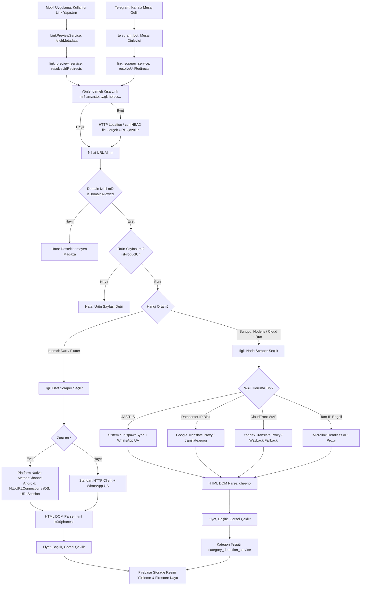

# FırsatKolik Uçtan Uca Scraping Mimarisi ve Doğrulama Akışları Raporu

> [!NOTE]
> Bu doküman Scraping mimarisinin genel uçtan uca akış kılavuzudur. Sistemin güncel 21 mağazalık şemaları, bypass stratejileri, platform-native HTTP tünellemesi ve deployment süreçleri için lütfen **[Scraping Mimarisi ve Otonom Botlar Master Rehberi](file:///d:/firsatkolik/documentation/scraping-ve-botlar/scraping_mimarisi_rehberi.md)** dokümanını inceleyiniz.

Bu belge, FırsatKolik platformundaki iki temel scraping (veri kazıma) motorunun (Mobil İstemci ve Telegram Bot) çalışma mantığını, URL doğrulama kontrol zincirlerini, bypass stratejilerini ve altyapı/deployment süreçlerini detaylı bir şekilde açıklamaktadır.

---

## 🏗️ 1. Genel Mimari ve Karar Ağacı

FırsatKolik'te fırsat paylaşım akışları hem **mobil uygulama** (istemci tarafı) hem de **Telegram botu** (sunucu tarafı) üzerinden eş zamanlı beslenmektedir. Her iki motor da aynı kurallar setini ve altyapıyı paylaşır, ancak engelleri aşmak için farklı çalışma yöntemlerine sahiptir.



---

## 📱 2. İstemci Tarafı (Client-Side - Dart Scrapers)

### Kullanım Amacı ve Senaryolar
Kullanıcıların mobil uygulama içindeki "Fırsat Paylaş" ekranından (`SubmitDealScreen`) manuel olarak link paylaştığı durumlarda tetiklenir. Amacı, kullanıcının veri giriş yükünü azaltarak fiyat, başlık ve görselleri anında arayüze otomatik olarak doldurmaktır.

### Temel Özellikler
*   **Gecikmeli Otomatik Arama (Debounced Fetch)**: URL alanına link yapıştırıldıktan `800ms` sonra arka planda otomatik scraping başlatılır.
*   **Platform-Native Bypass**: Zara gibi katı TLS (JA3) fingerprint analizi yapan sitelerde, Dart'ın HTTP kütüphanesi engellendiği için Android (`HttpURLConnection`) ve iOS (`URLSession`) native ağ katmanları üzerinden tünelleme yapılır.
*   **Görsel Proxyleme**: Çekilen ürün resimleri hotlink yapılmaz; Firebase Storage'a yüklenerek istemcilerin doğrudan mağaza CDN'lerini yüklemesi ve olası CORS engelleri engellenir.

Detaylı mağaza bazlı çözümler için istemci tarafı raporuna bakın:
👉 [Mağaza Özel Scraping Kuralları ve Stratejileri](file:///d:/firsatkolik/documentation/scraping-ve-botlar/scraping_rules_and_strategies.md)

---

## 🤖 3. Sunucu Tarafı (Server-Side - Node.js Telegram Bot Scrapers)

### Kullanım Amacı ve Senaryolar
Telegram'daki indirim ve kampanya paylaşan popüler kanalları (örn: `@indirimkaplani` vb.) 7/24 kesintisiz dinleyerek buralarda paylaşılan linkleri otomatik yakalar. Kampanyaları parse edip kategorilendirir ve doğrudan Firestore'a **onay bekleyen fırsat** (`isApproved: false`) olarak kaydeder.

### Temel Özellikler
*   **Otomatik Kategori Sınıflandırma (`category_detection_service.js`)**: Ürünün başlığı ve açıklama metnini analiz ederek kelime ağırlıklarına ve önceliklerine göre ürünü en doğru kategori ve alt kategoriye (örn: `supermarket > Deterjan & Temizlik`) otomatik yerleştirir.
*   **WAF ve Bulut IP Engelini Aşma**: Sunucular Google Cloud us-central1 veri merkezinde çalıştığı için Cloudflare/Akamai IP bloklarına takılır. Bu engelleri aşmak için 5 farklı gelişmiş proxy ve tünelleme yöntemi kullanılır (Google Translate, Yandex Translate, `curl` spawnSync, Microlink API, Wayback Machine).

Detaylı sunucu tarafı aşma teknikleri için sunucu bot raporuna bakın:
👉 [Cloud Run Telegram Bot Scraping Kuralları ve Stratejileri](file:///d:/firsatkolik/documentation/scraping-ve-botlar/bot_scraping_rules_and_strategies.md)

---

## 🔍 4. URL Kontrol ve Doğrulama Zinciri

Sisteme girilen her URL, scraping aşamasına geçmeden önce sıkı bir kontrol zincirinden geçer. Bu zincir, sunucuda ve istemcide birebir aynı kurallarla çalışır.

### Adım 1: Kısa Link ve Yönlendirme Çözme (Redirect Resolution)
*   **Amaç**: `amzn.to`, `ty.gl`, `hb.biz`, `sl.n11.com` gibi kısa veya affiliate linklerin yönlendirmelerini takip ederek arkasındaki asıl ürün sayfasını bulmak.
*   **Teknik Detay**: 
    *   **Hepsiburada (`hb.biz`)**: Direkt yönlendirme takibi yapıldığında Akamai engeline takıldığı için `redirect: 'manual'` yöntemi ile HTTP HEAD/GET atılır, ilk 301 yönlendirmesindeki `Location` başlığı yakalanır ve `adj.st` parametrelerindeki `adjust_fallback` URL'sinden orijinal ürün linki ayıklanır.
    *   **Trendyol (`ty.gl`)**: WhatsApp User-Agent ve Türkiye çerezleri ile sistem `curl` HEAD komutu kullanılarak yönlendirme çözülür.
    *   **N11 (`sl.n11.com`)**: `/n/` yönlendirme yolu Google Translate Proxy tüneline sokularak Google Play Store'a gitmeden çözümlenir.

### Adım 2: İzinli Mağaza Kontrolü (Allowlist Check)
*   URL'in ana alan adı (domain), sistemde desteklenen e-ticaret siteleri listesinde (`stores`) var mı kontrol edilir. İzinli olmayan siteler engellenir.

### Adım 3: Ürün Sayfası Regex Kontrolü (Product URL Verification)
*   **Kural Kaynağı**: [domain_allowlist_extended.json](file:///d:/firsatkolik/assets/data/domain_allowlist_extended.json) dosyası içerisindeki `product_path_rules` listesi.
*   **Mantık**: Kullanıcının ana sayfa, arama sonuçları veya bir kategori listesini paylaşmasını engellemek için, ilgili mağaza için tanımlanmış regex desenleri URL'in pathname kısmı ile eşleştirilir.
    *   *Örnek Trendyol*: `"-p-\\d+\\/?$"` deseni `trendyol.com/urun-adi-p-12345` linkini doğrular.
    *   *Örnek Amazon*: `"/dp/[a-z0-9]{10}"` deseni `/product-name/dp/B00XXXXXX` linkini doğrular.
*   Eğer mağazaya özel bir kural tanımlanmamışsa veya boş bırakılmışsa (`[]`), bu kontrol bypass edilerek doğrudan izin verilir.

---

## 🏷️ 5. Özel Üyelik ve Fiyat Etiketi Kazıma Mekanizması (priceLabel)

Platformda hem istemci (`LinkPreviewService`) hem de sunucu botu (`link_scraper_service.js`) scraper'larında özel kulüp, üyelik ve sepette indirim fiyat etiketleri otomatik tespit edilerek `priceLabel` olarak normalize edilir:

*   **Desteklenen Standart Mağaza Etiketleri**:
    *   **Amazon**: `"Prime Fırsatı"` (`#primeExclusivePricingMessage`, `#primeSavingsUpsellBlock`, `apex_desktop` fiyat blokları).
    *   **Trendyol**: `"Plus'a Özel"` (`.plus-price`, `data-plus-price`, vb.).
    *   **Hepsiburada**: `"Premium ile"` (`.premium-price-badge`, vb.).
    *   **Pazarama**: `"Plus ile"` (`.pazarama-plus-badge`, vb.).
    *   **Migros**: `"Money ile"` (`.money-badge`, vb.).
*   **Uçtan Uca İletim ve Arayüz Entegrasyonu**:
    1.  **Kazıma Aşaması**: Link ayrıştırıldığında `priceLabel` alanı tespit edilir (örn. `"Prime Fırsatı"`).
    2.  **Fırsat Paylaş Ekranı (`SubmitDealScreen`)**: Scraper etiketi bulduğunda minimalist toggle satırını otomatik aktif eder; kullanıcı dilerse tek tıkla işareti kaldırabilir. Canlı önizleme kartında anasayfa kartı gibi mağaza yanında kompakt `P`/`+`/`M` amblemi anlık güncellenir.
    3.  **Veritabanı & Sunum Katmanı**: Firestore'da `priceLabel` string alanı olarak saklanır; anasayfa kartlarında satıcı yanında kompakt amblem (`StorePriceBadge(compact: true)`), fırsat detayında ise fiyatın hemen üzerinde mor-turuncu degrade rozet kapsülü olarak sunulur.

---

## 🚀 6. Altyapı ve Deployment Süreçleri

Telegram Bot servisi, sürekli aktif (minimum 1 instance) kalacak şekilde Docker container altyapısı ile yönetilmektedir.

### Mimari Bileşenler
*   **Bulut Platformu**: Google Cloud Platform (GCP).
*   **Container Registry**: Google Container Registry (GCR - `gcr.io`).
*   **Çalışma Ortamı**: Google Compute Engine Virtual Machine (VM - `telegram-bot-server`, `us-central1-a` zone).

### Deploy Akışı (deploy_to_vm.py)
Deployment işlemi [deploy_to_vm.py](file:///d:/firsatkolik/cloud-run-bot/deploy_to_vm.py) scripti ile otomatikleştirilmiştir:

1.  **Google Cloud Build**:
    Local'deki Node.js bot kodları paketlenir ve Google Cloud Build servisine gönderilerek Docker imajı bulutta build edilir:
    ```bash
    gcloud builds submit --tag gcr.io/firsatkolik-prod-e6eae/telegram-bot:latest --project firsatkolik-prod-e6eae .
    ```
2.  **SSH ile VM Üzerinde Güncelleme**:
    Build işlemi tamamlandıktan sonra, Cloud SDK üzerinden VM sunucusuna SSH tüneli açılır ve şu komutlar VM üzerinde çalıştırılır:
    *   Yeni imaj çekilir: `docker pull gcr.io/firsatkolik-prod-e6eae/telegram-bot:latest`
    *   Eski container durdurulur ve silinir: `docker stop <env>-bot && docker rm <env>-bot`
    *   Yeni container, ortam değişkenleri ve Firebase yetki anahtarı mount edilerek başlatılır:
        ```bash
        docker run -d --name <env>-bot --restart always -p <port>:8080 \
          --env-file /home/murat/app/<env>-bot/.env \
          -v /home/murat/app/<env>-bot/<env>_firebase_key.json:/app/firebase_key.json \
          gcr.io/firsatkolik-prod-e6eae/telegram-bot:latest
        ```
    *   Kullanılmayan eski Docker imajları temizlenir: `docker image prune -a -f`

### Ortam Farklılıkları (Environment Configuration)

| Parametre | Development (Geliştirme) | Production (Canlı) |
| :--- | :--- | :--- |
| **Container Adı** | `dev-bot` | `prod-bot` |
| **Port Eşlemesi** | `8081:8080` | `8082:8080` |
| **Firebase Key** | `dev_firebase_key.json` | `prod_firebase_key.json` |
| **Çalışma Dizini** | `/home/murat/app/dev-bot` | `/home/murat/app/prod-bot` |
| **Hedef Database**| FırsatKolik Test Firestore | FırsatKolik Prod Firestore |

---

## 🛠️ 7. Sorun Giderme ve Log İzleme

Deployment veya scraping sırasında yaşanabilecek aksaklıklar için GCP logları ve sağlık (health) kontrolleri kullanılır.

### Logları Canlı İzleme (Tail Logs)
```bash
gcloud logging tail "resource.type=cloud_run_revision AND resource.labels.service_name=telegram-bot" --project firsatkolik-prod-e6eae
```

### Sunucu Sağlık Kontrolü (Health Check)
Botun çalışır durumda olduğunu doğrulamak için HTTP GET isteği atılır:
```bash
curl http://<VM_IP_ADRESI>:<port>/health
```
Yanıt olarak `{ "status": "ok", "uptime": ... }` JSON nesnesi dönmelidir.
