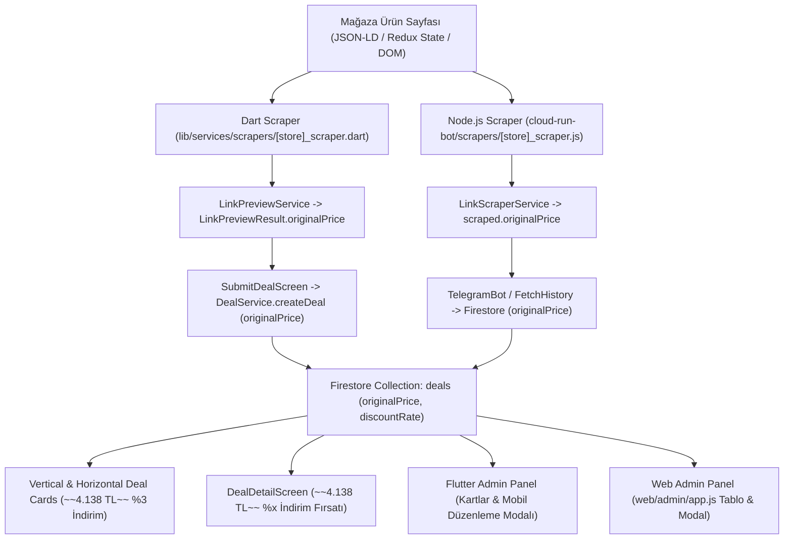

# İndirimsiz Ürün Fiyatı (`originalPrice`) Scraper Entegrasyon Rehberi & Yol Haritası (Roadmap)

> [!NOTE]
> Bu doküman İndirimsiz Fiyat (`originalPrice`) ve İndirim Oranı (`discountRate`) entegrasyon kılavuzudur. Sistemin güncel 21 mağazalık şemaları, bypass stratejileri, platform-native HTTP tünellemesi ve deployment süreçleri için lütfen **[Scraping Mimarisi ve Otonom Botlar Master Rehberi](file:///d:/firsatkolik/documentation/scraping-ve-botlar/scraping_mimarisi_rehberi.md)** dokümanını inceleyiniz.

Bu doküman, yeni eklenecek veya güncellenecek herhangi bir e-ticaret mağazasında (Hepsiburada, Trendyol, Amazon, N11, MediaMarkt vb.) **İndirimsiz Liste Fiyatı (`originalPrice`)** ve **İndirim Oranının (`effectiveDiscountRate`)** otomatik tespit edilmesi, kazınması (scraping), veritabanına kaydedilmesi ve tüm kullanıcı arayüzlerinde gösterilmesi için izlenecek **teknik adımları ve mimari yol haritasını** içerir.

---

## 🏗️ 1. Mimari Genel Bakış ve Veri Akış Hattı (Pipeline)



---

## 🔍 2. İndirimsiz Fiyat Keşif Stratejisi (Scraping Strategy)

Bir e-ticaret sayfasında indirimsiz orijinal fiyat 3 farklı katmanda aranır:

### Katman 1: JSON-LD `@type: "Product"` Nesnesi
- `offers.price` / `offers.lowPrice` (İndirimli satış fiyatı)
- `offers.highPrice` / `offers.listPrice` / `offers.priceSpecification` (İndirimsiz liste fiyatı)

### Katman 2: Redux Store / Window State (`<script id="reduxStore">` veya `window.__INITIAL_STATE__`)
- Sayfadaki gömülü JSON verisinde `product.prices`, `product.withoutAffordability`, `variantList`, `originalPrice` alanları taranır.

### Katman 3: DOM Elemanları (HTML Fallback)
- `del`, `s`, `strike`, `.original-price`, `.old-price`, `.variant-box-price`, `[data-bind*="oldPrice"]` seçicileri ile metin çekilir.

### 💡 Altın Kural: Aday Fiyat Filtreleme Algoritması
Bulunan tüm fiyat adayları (`candidatePrices`) arasında:
1. `candidate > currentPrice` koşulunu sağlayanlar filtrelenir.
2. Filtrelenen adaylar küçükten büyüğe sıralanır.
3. `currentPrice`'a en yakın olan **en küçük aday** (`originalPrice`) seçilir.

---

## 🛠️ 3. Yeni Bir Mağazaya `originalPrice` Eklerken Adım Adım Yapılacaklar

Yeni bir mağaza eklendiğinde sırasıyla şu **5 Aşama** uygulanır:

---

### 1️⃣ AŞAMA: Dart Scraper Geliştirmesi
📌 **Dosya:** `lib/services/scrapers/[store]_scraper.dart`

```dart
class StoreScraper extends BaseProductScraper {
  @override
  double? scrapeOriginalPrice(Document document) {
    final currentPrice = scrapePrice(document);
    if (currentPrice == null || currentPrice <= 0) return null;

    final candidates = <double>[];

    // 1. JSON-LD kontrolü
    final product = findProductJsonLd(document);
    if (product != null) {
      final highPrice = extractHighPriceFromJson(product);
      if (highPrice != null && highPrice > currentPrice) candidates.add(highPrice);
    }

    // 2. Redux / HTML Fallback
    final oldPriceElements = document.querySelectorAll('del, s, .original-price, .old-price');
    for (var el in oldPriceElements) {
      final val = cleanAndParsePrice(el.text);
      if (val != null && val > currentPrice) candidates.add(val);
    }

    if (candidates.isEmpty) return null;
    candidates.sort();
    return candidates.first; // currentPrice'tan büyük en küçük fiyat
  }
}
```

---

### 2️⃣ AŞAMA: Node.js Scraper Geliştirmesi
📌 **Dosya:** `cloud-run-bot/scrapers/[store]_scraper.js`

```javascript
class StoreScraper extends BaseProductScraper {
  scrapeOriginalPrice($) {
    const currentPriceStr = this.scrapePrice($);
    const currentPrice = parseFloat(currentPriceStr);
    if (!currentPrice || currentPrice <= 0) return null;

    const candidates = [];

    // 1. DOM Fallback
    $('del, s, .original-price, .old-price').each((_, el) => {
      const text = $(el).text();
      const val = this.cleanAndParsePrice(text);
      if (val && val > currentPrice) candidates.push(val);
    });

    if (candidates.length === 0) return null;
    candidates.sort((a, b) => a - b);
    return candidates[0];
  }
}
```

---

### 3️⃣ AŞAMA: Testlerin Hazırlanması ve Çalıştırılması (Doğrulama)

Her mağaza entegrasyonunda kullanıcıdan alınan **en az 3-4 adet canlı test linki** ve bunların beklenen **indirimli ve indirimsiz fiyatları** ile test dosyaları oluşturulur.

#### 3.1. Dart Unit Testi:
📌 **Dosya:** `test/[store]_original_price_test.dart`
```bash
flutter test test/[store]_original_price_test.dart
```

#### 3.2. Node.js Unit Testi:
📌 **Dosya:** `cloud-run-bot/tests/[store]_original_price.test.js`
```bash
node cloud-run-bot/tests/[store]_original_price.test.js
```

---

### 4️⃣ AŞAMA: Veri Servisleri Katmanı Kontrolü

Aşağıdaki noktaların eksiksiz bağlandığından emin olunmalıdır:

1. **`lib/services/link_preview_service.dart`**:
   - `LinkPreviewResult` nesnesine `originalPrice` eklenir.
2. **`lib/services/deal_service.dart`**:
   - `createDeal` metodunda `Deal(...)` oluşturulurken **`originalPrice: originalPrice`** parametresinin verilmiş olması **ŞARTTIR**! (Unutulursa veritabanına `null` yazar).
3. **`lib/models/deal.dart`**:
   - `fromFirestore`: `originalPrice` alanını hem `num` hem `String` olarak güvenle çözer.
   - `effectiveDiscountRate` getter'ı: `(((originalPrice - price) / originalPrice) * 100).round()` ile % indirim hesaplar.
   - `toFirestore`: `'discountRate': effectiveDiscountRate` otomatik yazar.

---

### 5️⃣ AŞAMA: Arayüz (UI) Katmanı Kontrol Listesi (6 Nokta)

Çekilen `originalPrice` verisinin görüneceği 6 temel arayüz bileşeni:

| Bileşen / Ekran | Dosya Yolu | Gösterim Şekli |
|---|---|---|
| **Dikey Fırsat Kartı** | `lib/widgets/deal_card/vertical_deal_card.dart` | Fiyat yanında `~~4.138 TL~~` + Görselde `%x İndirim` rozeti |
| **Yatay Fırsat Kartı** | `lib/widgets/deal_card/horizontal_deal_card.dart` | Fiyat üstünde `~~4.138 TL~~` + Görselde `%x İndirim` rozeti |
| **Fırsat Detay Ekranı** | `lib/screens/deal_detail_screen.dart` | Fiyat yanında `~~4.138 TL~~` + Üstte `%x İndirim Fırsatı` yeşil rozeti |
| **Mobil Admin Listesi** | `lib/screens/admin_screen.dart` | Onay bekleyen ve aktif kartlarda `~~4.138 TL~~` + `%x İndirim` |
| **Mobil Admin Düzenleme** | `lib/screens/deal_detail/admin_dialogs/admin_edit_sheet.dart` | `#originalPrice` & `#discountRate` alanlarını doldurur ve günceller |
| **Web Admin Paneli** | `web/admin/app.js` | Tabloda `Piyasa Fiyatı (TL)` & `%x İndirim` + Modal içi `#editOriginalPrice` |

---

## ⚡ 4. Dağıtım ve Yayın Prosedürü

1. **Bot VM Güncellemesi**:
   ```bash
   cd cloud-run-bot
   python deploy_to_vm.py dev
   python deploy_to_vm.py prod
   ```
2. **Yerel Kod Kontrolü**:
   - `git status` ile kontrol et.
   - **Kullanıcının onayı olmadan `git push` YAPMA!**
