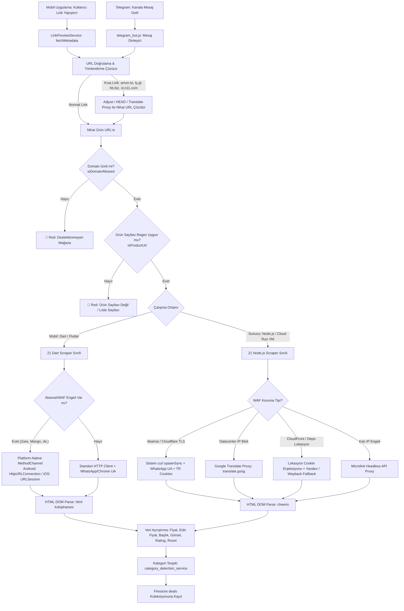

# 🕷️ FırsatKolik — Scraping Mimarisi ve Otonom Botlar Master Rehberi

> [!IMPORTANT]
> **Base Doküman & Scraping Kontratı:** Bu doküman, FırsatKolik platformunun mobil istemci (Flutter/Dart) ve sunucu (Compute Engine VM / Node.js) katmanlarındaki tüm e-ticaret veri kazıma (scraping) mekanizmasını, 21 mağaza çözümleme stratejilerini, WAF/TLS bypass motorlarını, canlı API entegrasyonlarını, Telegram botunu ve metadata katmanını yöneten **ana orkestratör (Base Contract)** dokümandır. Her bir alt mimarinin ayrıntılı teknik referansları ilgili bölümlerde doğrudan bağlantılanmıştır.

Bu doküman; **FırsatKolik** platformunun mobil istemci (Flutter/Dart), sunucu (Google Cloud Run / Compute Engine VM / Node.js) ve bot katmanlarındaki tüm scraping (veri kazıma) mekanizmasını, 21 entegre mağaza için bypass stratejilerini, URL doğrulama zincirini, canlı API ve tersine mühendislik çözümlerini, metadata katmanını (`originalPrice`, `ratingValue`, `priceLabel`), kategori tespit motorunu ve deployment süreçlerini tanımlayan **resmi mimari sözleşmedir (Documentation Contract)**.

---

## 📑 İçindekiler
1. [🌟 Genel Mimari ve İki Motorlu İstek Akışı](#1--genel-mimari-ve-i̇ki-motorlu-i̇stek-akışı)
2. [🔍 URL Kontrol ve Doğrulama Zinciri (4 Aşamalı Filtre)](#2--url-kontrol-ve-doğrulama-zinciri-4-aşamalı-filtre)
3. [🏪 21 Entegre Mağaza ve Detaylı Çözümleme Stratejileri](#3--21-entegre-mağaza-ve-detaylı-çözümleme-stratejileri)
4. [🛡️ Bot Koruması ve WAF Bypass Yöntemleri (6 Katmanlı)](#4-️-bot-koruması-ve-waf-bypass-yöntemleri-6-katmanlı)
5. [📱 İstemci Tarafı Platform-Native HTTP Bypass (MethodChannel)](#5--i̇stemci-tarafı-platform-native-http-bypass-methodchannel)
6. [🏷️ Özel Üyelik ve Fiyat Etiketi Mekanizması (priceLabel)](#6-️-özel-üyelik-ve-fiyat-etiketi-mekanizması-pricelabel)
7. [📉 İndirimsiz Liste Fiyatı (originalPrice) ve İndirim Oranı](#7--i̇ndirimsiz-liste-fiyatı-originalprice-ve-i̇ndirim-oranı)
8. [⭐ Değerlendirme, Puan ve Marka Katmanı (Metadata)](#8-️-değerlendirme-puan-ve-marka-katmanı-metadata)
9. [🤖 Telegram Botu ve Canlı Kanal Dinleyici Mimarisi](#9--telegram-botu-ve-canlı-kanal-dinleyici-mimarisi)
10. [🧠 Kategori Tespit Motoru ve Reklam Mevzuatı Uyumu](#10--kategori-tespit-motoru-ve-reklam-mevzuatı-uyumu)
11. [🚀 Bulut Altyapısı, Docker ve Deployment (deploy_to_vm.py)](#11--bulut-altyapısı-docker-ve-deployment-deploy_to_vmpy)
12. [📊 21 Mağaza İçin Kapsamlı Özet Karar Matrisi](#12--21-mağaza-için-kapsamlı-özet-karar-matrisi)
13. [🧪 Birim Testleri ve Doğrulama Süitleri](#13--birim-testleri-ve-doğrulama-süitleri)
14. [🔧 Sorun Giderme ve Hata Ayıklama (Troubleshooting)](#14--sorun-giderme-ve-hata-ayıklama-troubleshooting)
15. [📂 İlgili Kaynak Kod Dosyaları ve Referanslar](#15--ilgili-kaynak-kod-dosyaları-ve-referanslar)

---

## 1. 🌟 Genel Mimari ve İki Motorlu İstek Akışı

> 🔗 **Detaylı Referans Dokümanı:**
> - [Uçtan Uca Scraping Mimarisi ve Veri Akışları Kılavuzu](file:///d:/firsatkolik/documentation/scraping-ve-botlar/end_to_end_scraping_architecture.md) — İstemci/sunucu iş akışı, Cloud Run vs VM farkları ve Admin SDK veri akışları.

FırsatKolik platformunda fırsat akışları iki bağımsız kaynaktan beslenir:
1. **İstemci Motoru (Client-Side / Flutter - Dart):** Kullanıcının mobil uygulama içerisindeki "Fırsat Paylaş" ekranından (`SubmitDealScreen`) link yapıştırdığı senaryodur. `LinkPreviewService` tarafından 800ms debounce ile tetiklenir.
2. **Sunucu Motoru (Server-Side / Google Cloud - Node.js):** Telegram kanallarını 7/24 dinleyen `telegram_bot.js` ve geçmiş mesajları tarayan `fetch_history.js` servisleridir. `link_scraper_service.js` üzerinden çalışır.



---

## 2. 🔍 URL Kontrol ve Doğrulama Zinciri (4 Aşamalı Filtre)

Sisteme giren her URL, scraping yapılmadan önce şu 4 aşamalı sıkı filtreden geçirilir:

```
[ Gelen Ham URL (Metin veya Buton) ]
                 │
                 ▼
 1. 🔗 KISA LİNK & YÖNLENDİRME ÇÖZME (Redirect Resolution)
    - amzn.to, amzn.eu, link.amazon ➔ Amazon ürün linki
    - ty.gl ➔ curl HEAD + TR Cookies ile Trendyol ürün linki
    - hb.biz ➔ redirect: 'manual' + Adjust fallback parametresi
    - sl.n11.com/n/ ➔ Google Translate Proxy ile Play Store yönlendirmesinden kurtarma
                 │
                 ▼
 2. 🏪 İZİNLİ MAĞAZA KONTROLÜ (Domain Allowlist)
    - 21 entegre mağaza alan adı kontrol edilir (assets/data/domain_allowlist_extended.json)
                 │
                 ▼
 3. 🎯 ÜRÜN SAYFASI REGEX KONTROLÜ (Product Path Verification)
    - Mağazaya özel product_path_rules desenleri kontrol edilir.
    - Ana sayfa, kategori listesi, sepet veya arama sonuçları engellenir.
                 │
                 ▼
 4. 🧹 URL PARAMETRE TEMİZLİĞİ (Affiliate / Tracking Strip)
    - Büyük mağazalarda takip parametreleri temizlenir.
    - Sadece zorunlu satıcı/varyant parametreleri (smid, boutiqueId, merchantId, p) korunur.
```

---

## 3. 🏪 21 Entegre Mağaza ve Detaylı Çözümleme Stratejileri

> 🔗 **Detaylı Referans Dokümanı:**
> - [Scraping Kuralları ve Stratejileri Rehberi](file:///d:/firsatkolik/documentation/scraping-ve-botlar/scraping_rules_and_strategies.md) — 21 mağazanın DOM seçicileri, regex desenleri ve özel çerez ayarları.

Platform bünyesinde tam desteklenen 21 e-ticaret mağazası ve uygulanan özel teknikler:

### 1. Amazon (`amazon.com.tr`, `amzn.to`, `amzn.eu`, `link.amazon`)
- **Kısa Linkler:** `amzn.to`, `amzn.eu` ve `link.amazon` kısa linkleri yönlendirme zinciri takibiyle asıl ürün sayfasına çözülür.
- **Fiyat Seçicileri:** `.a-price-whole` + `.a-price-fraction` birleştirilir.
- **Amazon Depo (İkinci El / Açılmış Kutu):** `smid=A215JX4S9CANSO` parametresi tespit edildiğinde `#apex-pricetopay-accessibility-label`, `.apex-pricetopay-value`, `#usedBuySection .offer-price` ve `.aok-offscreen` seçicileri önceliklendirilerek Depo fiyatı kazınır ve `isAmazonWarehouse: true` atanır.
- **1x1 Boş Görsel Filtresi:** Amazon bazen 43-byte boyutunda boş şeffaf piksel döner; `isLogoUrl` ve byte filtreleriyle elenerek `img#landingImage` veya `img#imgBlkFront` DOM elemanları taranır.
- **Fiyat Rozeti:** `#primeExclusivePricingMessage` veya `#primeSavingsUpsellBlock` var ise `priceLabel: "Prime Fırsatı"` atanır.
- **Sunucu Bypass:** `curl` spawnSync (`WhatsApp/2.23.4.15 A` UA) veya Microlink Headless API ile ABD konum kısıtlaması aşılır. Fiyatların karusellerden sızmaması için seçiciler `#rightCol` ve `#centerCol` ana bloklarıyla sınırlandırılmıştır.

### 2. Hepsiburada (`hepsiburada.com`, `hb.biz`, `app.hb.biz`)
- **Kısa Link Çözümleme (`hb.biz`):** Akamai engeline takılmamak için `redirect: 'manual'` yöntemiyle HTTP GET/HEAD atılır, ilk 301 yönlendirmesindeki `Location` başlığından `adj.st` URL'i yakalanır ve `adjust_fallback` / `adj_fallback` parametresinden gerçek ürün linki çıkarılır.
- **Canlı Fiyat API Entegrasyonu & `_HbApiPriceResult` Modeli:** Hepsiburada normal, Premium ve sepetteki indirimli fiyatları HTML DOM'da gizler. Scraper:
  1. `<script id="reduxStore">` verisinden `sku`, `listingId`, `merchantId`, `productId`, `tagList`, `rootCategoryList` ayıklar.
  2. Hepsiburada'nın resmi `withoutAffordability` (birincil buybox satıcısı) ve `otherMerchants` (tüm diğer satıcılar) POST API'lerine paralel (`Future.wait` / `Promise.all`) istek atar.
  3. Sepetteki indirimleri ve Premium kulüp fiyatlarını alabilmek için `x-gotham_app-key: All`, `x-gotham_is_include_premium_clubs: true`, `x-gotham_is_enabled_evaluate_coupon: true`, `x-gotham_is_enabled_next_eligible_campaign: true` ve `x-gotham_is_include_payment_campaigns: true` gateway başlıklarını gönderir.
  4. Gelen API yanıtındaki `evaluateAsPremiumResult` (`isPremium: true`) ile `evaluateResult` (`isPremium: false`) nesnelerini karşılaştırarak en ucuz/en avantajlı sonucu `_lastApiResult` alanında saklar.
- **3 Kademeli Hiyerarşik Premium Rozet Tespiti (`scrapePriceLabel`):**
  1. *Yetkili Kaynak (API):* `_lastApiResult` üzerinden doğrudan `isPremium` bayrağı okunur (`true` ise `priceLabel: "Premium ile"`, değilse `null`). Böylece sepet baremleri (örn: 1000 TL'ye 100 TL) veya 2. ürün indirimleri sahte rozet üretmez.
  2. *Özel DOM Rozetleri (Offline/Statik):* API çağrısı yapılamadığında `[data-test-id*="premium-price"]`, `[class*="PremiumPrice"]`, `[data-test-id="loyalty-discount"]` seçicileri taranır.
  3. *Katı Fiyat Regex:* Sadece açık fiyat içeren `^(?:hepsiburada\s*)?premium['’]?\s*(?:ile|la)\s*[\d.,]+\s*(?:tl|₺)?$` yaprak metinleri kabul edilir.
- **Sunucu Bypass:** Akamai Bot Manager, Google Translate ve Googlebot IP'lerini Captcha sayfasına (`HBBlockandCaptcha.html`) yönlendirir. Sunucuda `spawnSync('curl', [...])` + `WhatsApp` UA ile doğrudan erişilir.

### 3. Trendyol (`trendyol.com`, `ty.gl`)
- **Kısa Link Çözümleme (`ty.gl`):** WhatsApp UA ve Türkiye çerezleri ile sistem `curl` HEAD komutu kullanılarak çözülür.
- **Varyant Desteği (`ProductGroup`):** Çoklu beden/renk içeren sayfalarda root tipi `ProductGroup` olarak geldiğinde ilk varyantın alakasız fiyatı yerine `findProductInJson` ile ana ürünün geçerli aktif fiyatı çözümlenir.
- **Fiyat Rozeti:** `.plus-price` veya `data-plus-price` tespit edildiğinde `priceLabel: "Plus'a Özel"` atanır.
- **Sunucu Bypass (Yurt Dışı IP Yönlendirmesi):** Cloud Run sunucuları ABD IP'sinde olduğundan Trendyol istekleri `/en/select-country` sayfasına yönlendirir. İstek `curl` ile atılırken `Cookie: storefrontId=1; countryCode=TR; language=tr` çerezleri eklenir; böylece Trendyol botu Türkiye'deki bir kullanıcı gibi algılar ve local butik indirimli fiyatları döner.

### 4. N11 (`n11.com`, `sl.n11.com`)
- **Kısa Link Çözümleme (`sl.n11.com/n/`):** `sl.n11.com/n/...` linkleri `www.n11.com/n/...` formatına dönüştürülerek Google Translate Proxy tüneli üzerinden çözülür; böylece Adjust'ın Google Play Store yönlendirmesi tamamen bypass edilir.
- **Fiyat & Mağaza Parametresi:** Sadece mağaza bazlı indirimlerin doğru hesaplanması için `magaza` parametresi korunur, diğerleri temizlenir. `.newPrice` ve JSON-LD şemaları taranır.
- **Sunucu Bypass:** Google Cloud datacenter IP engeli `https://www-n11-com.translate.goog/path?...` Google Translate Proxy yöntemiyle aşılır.

### 5. Pazarama (`pazarama.com`)
- **Plus Üyelik Önceliği:** Pazarama Plus üyelerine sunulan özel indirimli fiyatlar standart JSON-LD'de yer almaz. Scraper öncelikle sayfada `plus-icon` veya `pz-plus-icon` logolarını arar; varsa kapsayıcı altındaki Plus indirimli fiyatı ayıklar ve `priceLabel: "Plus ile"` atar. Yoksa standart JSON-LD fiyatına fallback yapar.

### 6. Getir (`getir.com`)
- **Çerez ve Konum Entegrasyonu:** Getir konum tabanlı çalıştığı için lokasyon çerezleri olmadan depo-özel ürünler 404 döner. İstek başlıklarına `locale=tr; language=tr; countryCode=TR; appType=GETIR` çerezleri eklenir.
- **Next.js JSON-LD & DOM:** Ürün bilgileri `<script id="__NEXT_DATA__">` JSON bloğundan parse edilir. Açıklama için `description` ve `content` alanları öncelikli okunur.
- **Sunucu Bypass (Çok Katmanlı):**
  1. **Lokasyon Çerezli curl:** İlk deneme özel lokasyon çerezleriyle yapılır.
  2. **Yandex Translate Proxy:** WAF engeli durumunda `https://translate.yandex.ru/translate?url=...` tüneline yönlendirilir ve `__NEXT_DATA__` kurtarılır.
  3. **Wayback Machine Fallback:** Depo ürünlerinde 404 alınırsa Wayback Machine arşivi taranarak başlık ve görsel kurtarılır.

### 7. Zara (`zara.com`)
- **Akamai Bot Manager Engeli:** Zara standart HTTP istemcilerini JA3/TLS parmak izi analiziyle engelleyip `2.8 KB`'lık `bm-verify` challenge sayfasına yönlendirir.
- **İstemci Bypass:** Android (`HttpURLConnection`) ve iOS (`URLSession`) **Platform-Native MethodChannel** üzerinden yerel işletim sistemi ağ katmanıyla çekilir.
- **Veri Kaynağı:** HTML içindeki `zara.analyticsData` script'i regex ile taranarak `mainPrice` ve `productName` alanları ayıklanır.

### 8. Mango (`mango.com`)
- **Next.js App Router Hydration:** Mango JSON-LD kullanmaz; veriler `self.__next_f.push` adlı Javascript fonksiyon çağrılarında saklanır.
- **Veri Kaynağı:** script bloğu içerisindeki `"price":{"amount":...}` nesneleri regex ile taranarak nihai satış fiyatı ayıklanır. Mobil istemcide Native HTTP tünellemesi kullanılır.

### 9. Beymen (`beymen.com`)
- **BEYMEN.productMain Entegrasyonu:** Sepet indirimleri dahil en güncel fiyatı veren `promotedOrActualPrice` ve tam ürün ismini tutan `displayName` alanları doğrudan script'ten regex ile yakalanır.
- **JSON-LD Sanitizer & DOM Fallback:** Kaçışsız çift tırnaklar ve satır sonları temizlenir. `h1` sadece marka adını içerdiğinden asıl ürün başlığı `.o-productDetail__description` etiketinden alınır.

### 10. İdefix (`idefix.com`)
- **Canlı ecomapi Entegrasyonu:** İdefix statik HTML'de değerlendirme (`averageRating`) ve oy sayılarını (`reviewCount`) basmaz. Ürün ID'si (`p-{productId}`) çıkarılarak resmi e-ticaret yorum servisine (`https://ecomapi.idefix.com/api/product/{productId}/detail/review`) canlı GET isteği atılır.

### 11. DeFacto (`defacto.com.tr`)
- **Javascript `PRODUCT_DETAIL_LASTVISITED`:** Sepet indirimli fiyatlar DOM'da bulunmaz. `window.PRODUCT_DETAIL_LASTVISITED` script bloğundaki `DiscountPrice` ve `CampaignDiscountedPrice` alanları regex ile taranır. Unicode karakter bozuklukları `_decodeUnicode` filtresi ile temizlenir.

### 12. PttAVM (`pttavm.com`)
- **WAF ve IP Engeli:** Cloudflare koruması hem Node.js fetch hem de curl isteklerini datacenter IP'sinden engeller.
- **Sunucu Bypass:** `https://api.microlink.io/?url=...&prerender=true` Microlink Headless API Proxy ile tam HTML çekilerek Cheerio ile parse edilir.

### 13. Vatan Bilgisayar (`vatanbilgisayar.com`)
- **Sunucu Bypass:** Google Cloud IP engeli `translate.goog` (Google Translate Proxy) yöntemiyle aşılır. DOM seçicisi `.product-list__price` ile fiyat doğrulanır.

### 14. İtopya (`itopya.com`)
- **Canlı Yorum API'si:** Ürün HTML çekimi `translate.goog` ile yapılır; değerlendirme puanı için `/Urun/UrunYorum?id=...` API'sine doğrudan istek atılır.

### 15. Teknosa (`teknosa.com`)
- **TLS/JA3 Engeli:** Cloudflare WAF engeli sunucuda `curl` spawnSync + `WhatsApp` UA ile aşılır. JSON-LD şeması parse edilir.

### 16. Mavi (`mavi.com`)
- **Standart Yapı:** `WhatsApp` User-Agent taklidi + `application/ld+json` şeması. Görseller `sky-static.mavi.com` CDN deseniyle doğrulanır.

### 17. MediaMarkt (`mediamarkt.com.tr`)
- **Googlebot UA Taklidi:** Cloudflare korumasını aşmak için `Googlebot/2.1 (+http://www.google.com/bot.html)` User-Agent değeri doğrudan atanır.

### 18. İncehesap (`incehesap.com`)
- **iOS UA & curl:** `WhatsApp` ve iOS Safari UA taklidi ile JSON-LD şemaları ve DOM fiyatları çekilir.

### 19. Havit (`havitstore.com.tr`)
- **E-Ticaret Altyapısı:** Standart Chrome UA + DOM seçicileri ve JSON-LD şeması.

### 20. Migros (`migros.com.tr`)
- **Money İndirimi:** `.money-badge` veya Money Kulüp fiyatı tespit edildiğinde `priceLabel: "Money ile"` atanır.

### 21. Boyner (`boyner.com.tr`)
- **JSON-LD & DOM:** Ürün başlığı, görseli, satış fiyatı ve indirimsiz liste fiyatı JSON-LD `Product` ve DOM seçicileriyle çekilir.

---

## 4. 🛡️ Bot Koruması ve WAF Bypass Yöntemleri (6 Katmanlı)

| Bypass Yöntemi | Hedef Mağazalar | Çözülen Problem / Mekanizma |
| :--- | :--- | :--- |
| **1. `curl` spawnSync + WhatsApp UA** | `Hepsiburada`, `Trendyol`, `Teknosa`, `Mavi`, `Amazon` | Node.js `fetch` TLS (JA3/JA4) parmak izi engelini aşar; işletim sistemi düzeyinde OpenSSL stack'i kullanır. |
| **2. Türkiye Lokasyon Çerezleri** | `Trendyol`, `Getir` | `Cookie: storefrontId=1; countryCode=TR; language=tr` ile yurt dışı sunucu yönlendirmesi engellenir ve yerel indirimli fiyatlar çekilir. |
| **3. Google Translate Proxy (`translate.goog`)** | `N11`, `Vatan Bilgisayar`, `Itopya` | Datacenter IP bloklarını aşmak için meşru Google Translate IP'leri üzerinden tünelleme yapılır. |
| **4. Microlink Headless API Proxy** | `Pttavm`, `Amazon`, `hb.biz` (Fallback) | Headless Chromium (`prerender=true`) ve konut IP havuzu ile katı Cloudflare WAF engellerini aşar. |
| **5. Googlebot User-Agent Taklidi** | `MediaMarkt` | Arama motoru botlarına uygulanan beyaz liste kurallarını kullanarak doğrudan erişim sağlar. |
| **6. Yandex Translate & Wayback Machine** | `Getir` | CloudFront WAF engellerini Yandex tüneliyle aşar; depo 404 durumunda Wayback arşiviyle görseli kurtarır. |

---

## 5. 📱 İstemci Tarafı Platform-Native HTTP Bypass (MethodChannel)

Mobil cihazlarda (Android & iOS), Dart'ın yerleşik HTTP kütüphanesinin SSL el sıkışması bazı katı bot sistemleri (özellikle Zara ve Akamai Bot Manager) tarafından şüpheli olarak işaretlenebilir.

### Çalışma Prensibi:
1. `LinkPreviewService._fetchHtml` metodu URL'in Zara, Mango, Beymen, Getir vb. olduğunu tespit ederse `com.sicakfirsatlar.app/native_http` platform kanalını çağırır.
2. **Android (`MainActivity.kt`):** Android işletim sisteminin yerel `HttpURLConnection` sınıfını kullanarak isteği atar.
3. **iOS (`AppDelegate.swift`):** Apple'ın yerel `URLSession` ağ katmanını kullanarak isteği tamamlar.
4. İşletim sisteminin kendi yerel ağ kütüphaneleri, cihazın gerçek tarayıcısıyla birebir aynı TLS/JA3 imzasına sahip olduğundan engellere takılmadan tam HTML'i döndürür.

---

## 6. 🏷️ Özel Üyelik ve Fiyat Etiketi Mekanizması (priceLabel)

Platformda hem istemci hem de sunucu scraper'larında özel kulüp ve üyelik fiyatları otomatik tespit edilir:

```
[ Ham Web Sayfası ] ──► [ Scraper: Rozet Tespiti ] ──► [ priceLabel Alanı ]
                                                              │
   ┌──────────────────────────────────────────────────────────┴─────────────────────────┐
   ▼                                                                                    ▼
[ Mobil "Fırsat Paylaş" Ekranı ]                                             [ Veritabanı & Sunum ]
- Toggle satırı otomatik aktif olur.                                         - Firestore: deals.priceLabel
- Canlı önizleme kartında kompakt rozet görünür.                             - Anasayfa Kartı: Kompakt Rozet (P/+/M)
                                                                             - Fırsat Detayı: Mor-Turuncu Degrade Kapsül
```

### Desteklenen Standart Rozetler:
- **Amazon:** `"Prime Fırsatı"`
- **Trendyol:** `"Plus'a Özel"`
- **Hepsiburada:** `"Premium ile"`
- **Pazarama:** `"Plus ile"`
- **Migros:** `"Money ile"`

---

## 7. 📉 İndirimsiz Liste Fiyatı (originalPrice) ve İndirim Oranı

> 🔗 **Detaylı Referans Dokümanı:**
> - [İndirimsiz Liste Fiyatı Kazıma ve Entegrasyon Kılavuzu](file:///d:/firsatkolik/documentation/scraping-ve-botlar/original_price_scraper_integration_guide.md) — 21 mağazanın eski liste fiyatı seçicileri, en küçük aday algoritması ve indirim yüzdesi formülleri.

Bir fırsatın gerçek indirimini hesaplayabilmek için **İndirimsiz Liste Fiyatı (`originalPrice`)** 3 katmanda aranır:
1. **JSON-LD:** `offers.highPrice`, `offers.listPrice`, `offers.priceSpecification`.
2. **Gömülü Script / Redux:** `product.withoutAffordability`, `originalPrice`, `variantList`.
3. **DOM Fallback:** `del`, `s`, `.original-price`, `.old-price`, `.variant-box-price`.

### Aday Fiyat Filtreleme Algoritması:
Bulunan tüm adaylar arasında `candidate > currentPrice` koşulunu sağlayanlar küçükten büyüğe sıralanır ve `currentPrice`'a en yakın olan **en küçük aday** `originalPrice` olarak seçilir.
- **İndirim Oranı (`effectiveDiscountRate`):** `(((originalPrice - price) / originalPrice) * 100).round()` formülüyle hesaplanır ve arayüzde `~~4.138 TL~~ %15 İndirim` şeklinde sunulur.

---

## 8. ⭐ Değerlendirme, Puan ve Marka Katmanı (Metadata)

> 🔗 **Detaylı Referans Dokümanı:**
> - [Scraper Metadata Zenginleştirme Kılavuzu](file:///d:/firsatkolik/documentation/scraping-ve-botlar/scraper_metadata_integration_guide.md) — `ratingValue`, `ratingCount`, `brand` alanlarının çıkarım kuralları ve UI entegrasyonu.

Kullanıcıların fırsat kalitesini anında değerlendirebilmesi için 3 kritik meta veri toplanır:
- **Puan (`ratingValue`):** 5 üzerinden ürün değerlendirme puanı (Örn: `4.8`).
- **Değerlendirme Sayısı (`ratingCount`):** Ürüne yapılan toplam yorum sayısı (Örn: `1173`).
- **Marka (`brand`):** Ürünün üretici markası (Örn: `Apple`, `Sony`, `Dyson`).

### Sunum Katmanı:
- **Dikey/Yatay Kartlar:** Fiyatın hemen altında `★ 4.8 (1173)`.
- **Fırsat Detay Ekranı:** Başlık altında `★ 4.8 (1173 Değerlendirme)` ve üst bantta `Marka: Apple` rozeti.
- **Web & Mobil Admin Paneli:** Düzenlenebilir input kutuları ve tablo sütunları.

---

## 9. 🤖 Telegram Botu ve Canlı Kanal Dinleyici Mimarisi

> 🔗 **Detaylı Referans Dokümanı:**
> - [Bot Kazıma Kuralları ve Stratejileri](file:///d:/firsatkolik/documentation/scraping-ve-botlar/bot_scraping_rules_and_strategies.md) — GramJS MTProto canlı dinleyici, OCR görsel analizi, Gemini 2.0 Flash entegrasyonu ve onay süreçleri.

Google Cloud VM üzerinde Docker container olarak çalışan `telegram_bot.js` servisi:
- **Canlı Dinleyici (`TelegramClient` + `NewMessage`):** Çevre değişkenlerinde (`TELEGRAM_CHANNELS`) tanımlı tüm popüler indirim kanallarını dinler.
- **Geçmiş Tarayıcı (`fetch_history.js`):** Kanallardaki geçmiş mesajları toplu olarak tarar ve içe aktarır.
- **Görsel Kurtarma & Storage Yükleme:** Scraper ürün görselini çekemezse, Telegram mesajının fotoğrafını veya link önizleme görselini indirerek `deals/{chatId}_{messageId}.jpg` yoluyla Firebase Storage'a yükler.
- **Onay Durumu:** `settings/app` altındaki `dealApprovalRequired` değerine göre fırsatı `isApproved: false` (onay bekliyor) veya `isApproved: true` olarak kaydeder.

---

## 10. 🧠 Kategori Tespit Motoru ve Reklam Mevzuatı Uyumu

### Kategori Tespit Motoru ([category_detection_service.js](file:///d:/firsatkolik/cloud-run-bot/category_detection_service.js))
Fırsat başlığı, breadcrumbs hiyerarşisi ve mağaza bilgisini 1-gram ve 2-gram NLP kelime ağırlıklarıyla analiz ederek ürünü 12 ana kategoriye otomatik atar:
- `elektronik`, `moda`, `ev-yasam`, `anne-bebek`, `kozmetik`, `spor-outdoor`, `supermarket`, `kitap-hobi`, `otomotiv`, `yapi-market`, `pet-shop`, `diger`.

### Reklam Uyum Servisi ([advertising_compliance_service.js](file:///d:/firsatkolik/cloud-run-bot/advertising_compliance_service.js))
Ticaret Bakanlığı'nın sosyal medya ve e-ticaret reklam mevzuatına tam uyum sağlamak amacıyla, bot tarafından eklenen tüm fırsat açıklamalarının sonuna otomatik olarak `#işbirliği` veya `#reklam` yasal ibarelerini ekler.

---

## 11. 🚀 Bulut Altyapısı, Docker ve Deployment (deploy_to_vm.py)

Telegram Bot servisi Google Cloud Compute Engine VM üzerinde 7/24 çalışır.

```
[ Yerel Kodlar: cloud-run-bot/ ]
               │
               ▼
[ Google Cloud Build: gcloud builds submit ] ──► [ Container Registry: gcr.io/.../telegram-bot:latest ]
                                                                     │
                                                                     ▼
[ SSH ile VM Sunucusuna Bağlantı ] ◄─────────────────────────────────┘
  ├── docker pull gcr.io/.../telegram-bot:latest
  ├── docker stop <env>-bot && docker rm <env>-bot
  └── docker run -d --name <env>-bot --restart always -p <port>:8080 ...
```

### Deployment Komutları ([deploy_to_vm.py](file:///d:/firsatkolik/cloud-run-bot/deploy_to_vm.py)):
```bash
# Geliştirme Ortamı (DEV - Port 8081)
python cloud-run-bot/deploy_to_vm.py dev

# Canlı Prod Ortamı (PROD - Port 8082)
python cloud-run-bot/deploy_to_vm.py prod
```

---

## 12. 📊 21 Mağaza İçin Kapsamlı Özet Karar Matrisi

| Mağaza | İstemci (Dart) Yöntemi | Sunucu (Node.js) Yöntemi | Özel Fiyat / Rozet / Canlı Servis |
| :--- | :--- | :--- | :--- |
| **Amazon** | WhatsApp UA + 43-byte Filtresi | curl spawnSync / Microlink | Prime Fırsatı (`priceLabel`), Amazon Depo 2. El (`isAmazonWarehouse`) |
| **Hepsiburada** | Canlı `withoutAffordability` API | curl spawnSync (Akamai Bypass) | Premium ile (`priceLabel`), Gotham API Gateway, Sepet İndirimi |
| **Trendyol** | JSON-LD `ProductGroup` Parser | curl spawnSync + TR Cookies | Plus'a Özel (`priceLabel`), Butik/Varyant Fiyat Ayrımı |
| **N11** | WhatsApp UA + sl.n11 Çözücü | Google Translate Proxy | `magaza` parametresi koruma, DOM `.newPrice` |
| **Pazarama** | DOM (Plus Alanı) & JSON-LD | curl spawnSync | Plus ile (`priceLabel`), Standart JSON-LD fallback |
| **Getir** | Native HTTP + Lokasyon Çerezleri| Lokasyon curl + Yandex / Wayback | Depo Ürünleri Çözümleme, `__NEXT_DATA__` Parser |
| **Zara** | **Native MethodChannel HTTP** | curl spawnSync | Akamai Bot Manager Bypass, `zara.analyticsData` Script |
| **Mango** | **Native MethodChannel HTTP** | curl spawnSync | Next.js `self.__next_f.push` Fiyat Ayrıştırıcı |
| **Beymen** | Native HTTP + JSON Sanitizer | curl spawnSync | `BEYMEN.productMain` Script, `.o-productDetail__description` Başlık |
| **İdefix** | Canlı `ecomapi` Review API | Canlı `ecomapi` Review API | Canlı Değerlendirme Puanı ve Yorum Sayısı Çekimi |
| **DeFacto** | Native HTTP + Unicode Filtresi| curl spawnSync | `window.PRODUCT_DETAIL_LASTVISITED` Sepet Fiyatı |
| **PttAVM** | Native HTTP | **Microlink Headless API** | Cloudflare WAF Bypass, JSON-LD Şeması |
| **Vatan Bilg.**| Standart Fetch / Chrome UA | Google Translate Proxy | DOM `.product-list__price` Seçicisi |
| **İtopya** | Native HTTP + Yorum API | Translate Proxy + Yorum API | Canlı `/Urun/UrunYorum` Değerlendirme Servisi |
| **Teknosa** | Native HTTP | curl spawnSync (TLS Bypass) | JSON-LD `Product` Şeması |
| **Mavi** | WhatsApp UA | curl spawnSync | `sky-static.mavi.com` CDN Doğrulaması |
| **MediaMarkt**| Standart Fetch | Googlebot UA Taklidi | Cloudflare Bypass, JSON-LD Şeması |
| **İncehesap** | iOS Safari / WhatsApp UA | curl spawnSync | JSON-LD ve DOM Fiyat Seçicileri |
| **Havit** | Standart Fetch | Standart Fetch | E-Ticaret DOM ve JSON-LD Şeması |
| **Migros** | Standart Fetch | curl spawnSync | Money ile (`priceLabel`), Money Kulüp İndirimleri |
| **Boyner** | Standart Fetch | curl spawnSync | JSON-LD `Product` Şeması ve DOM İndirimleri |

---

## 13. 🧪 Birim Testleri ve Doğrulama Süitleri

Her mağazanın scraper doğruluğu bağımsız unit testler ile garanti altına alınmıştır:

| Test Dosyası | Katman | Açıklama | Komut |
| :--- | :--- | :--- | :--- |
| **`test/*_scraper_test.dart`** | Flutter / Dart | 21 mağazanın fiyat, başlık, görsel ve metadata birim testleri | `flutter test` |
| **`cloud-run-bot/tests/*.test.js`** | Node.js | Sunucu tarafı scraper'ların Cheerio DOM ve regex doğrulama testleri | `node cloud-run-bot/tests/...` |
| **`cloud-run-bot/test_simulate_bot.js`**| Node.js | Canlı Telegram mesaj simülasyonu ve uçtan uca akış testi | `node cloud-run-bot/test_simulate_bot.js` |

---

## 14. 🔧 Sorun Giderme ve Hata Ayıklama (Troubleshooting)

### 1. 403 Forbidden veya WAF Challenge Alındığında:
- Sunucu başlığında `server: cloudflare` veya `server: akamai` geliyorsa sorun **IP veya TLS** engelidir.
  - İlk adım: `curlFetchHtml` ile `spawnSync` deneyin (TLS bypass).
  - İkinci adım: `translate.goog` (Google Translate Proxy) deneyin (IP bypass).
  - Üçüncü adım: `microlinkFetchHtml(url, ..., prerender: true)` deneyin (Headless browser).
- `server: ESF` geliyorsa Google Translate sunucuları geçici olarak engellenmiştir.

### 2. Yanlış / İndirimsiz Fiyat Çekildiğinde:
- **Trendyol:** Türkiye çerezlerinin (`storefrontId=1; countryCode=TR; language=tr`) gönderildiğinden emin olun.
- **Hepsiburada:** `reduxStore` üzerinden `withoutAffordability` API'sine istek atıldığını ve Gotham başlıklarının iletildiğini doğrulayın.
- **Amazon:** Aday fiyat seçicilerinin `#rightCol` ve `#centerCol` ana blokları içinde kaldığını kontrol edin.

---

## 15. 📂 İlgili Kaynak Kod Dosyaları ve Referanslar

| Rol / Katman | Dosya Yolu | Açıklama |
| :--- | :--- | :--- |
| **Mobil Link Önizleme Servisi** | [link_preview_service.dart](file:///d:/firsatkolik/lib/services/link_preview_service.dart) | İstemci scraper koordinatörü, redirect çözücü ve native HTTP tüneli. |
| **Dart Mağaza Scraper'ları (21 Adet)**| [lib/services/scrapers/](file:///d:/firsatkolik/lib/services/scrapers/) | 21 mağazaya ait Dart scraper sınıfları. |
| **Domain Allowlist & Regex Kuralları**| [domain_allowlist_extended.json](file:///d:/firsatkolik/assets/data/domain_allowlist_extended.json) | 21 mağazanın izinli alan adları ve ürün sayfası regex desenleri. |
| **Sunucu Link Scraper Servisi** | [link_scraper_service.js](file:///d:/firsatkolik/cloud-run-bot/link_scraper_service.js) | Node.js scraper koordinatörü, curl, Translate Proxy ve Microlink motoru. |
| **Node.js Mağaza Scraper'ları (21 Adet)**| [cloud-run-bot/scrapers/](file:///d:/firsatkolik/cloud-run-bot/scrapers/) | 21 mağazaya ait Node.js scraper sınıfları. |
| **Telegram Canlı Botu** | [telegram_bot.js](file:///d:/firsatkolik/cloud-run-bot/telegram_bot.js) | Telegram kanallarını dinleyen ve fırsatları Firestore'a kaydeden ana bot. |
| **Kategori Tespit Servisi** | [category_detection_service.js](file:///d:/firsatkolik/cloud-run-bot/category_detection_service.js) | NLP tabanlı otomatik kategori sınıflandırma motoru. |
| **Reklam Uyum Servisi** | [advertising_compliance_service.js](file:///d:/firsatkolik/cloud-run-bot/advertising_compliance_service.js) | Yasal reklam ibaresi (#işbirliği) entegrasyonu. |
| **VM Deployment Scripti** | [deploy_to_vm.py](file:///d:/firsatkolik/cloud-run-bot/deploy_to_vm.py) | Google Cloud Build ve VM Docker container güncelleme otomasyonu. |
