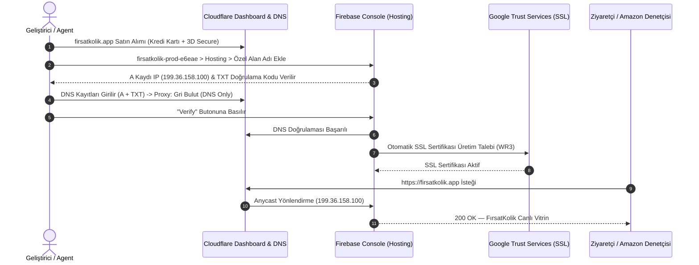

# 🌐 FırsatKolik — Domain, Web Showcase ve Cloudflare & Firebase Hosting Entegrasyon Rehberi

Bu doküman, **FırsatKolik** platformunun resmi alan adı (`firsatkolik.app`), tanıtım vitrini (`web/index.html`), Cloudflare Registrar/DNS altyapısı, Firebase Hosting özel alan adı eşleme süreci, SSL sertifikasyonu ve Amazon Gelir Ortaklığı uyum standartlarını uçtan uca açıklayan **master operasyon ve mimari sözleşmesidir**.

---

## 📑 İçindekiler
1. [🌟 Genel Bakış ve Mimari Kimlik](#1--genel-bakış-ve-mimari-kimlik)
2. [🎯 Domain Seçimi ve Cloudflare Tercih Gerekçeleri](#2--domain-seçimi-ve-cloudflare-tercih-gerekçeleri)
3. [🗺️ Uçtan Uca Kurulum ve DNS Eşleme Sözleşmesi](#3-️-uçtan-uca-kurulum-ve-dns-eşleme-sözleşmesi)
4. [🛡️ DNS ve Proxy Politikası (Gri Bulut vs Turuncu Bulut)](#4-️-dns-ve-proxy-politikası-gri-bulut-vs-turuncu-bulut)
5. [⚖️ Amazon Associates (Gelir Ortaklığı) Yasal Standartları](#5-️-amazon-associates-gelir-ortaklığı-yasal-standartları)
6. [🚀 Dağıtım ve Yayın Yaşam Döngüsü (Deployment Lifecycle)](#6--dağıtım-ve-yayın-yaşam-döngüsü-deployment-lifecycle)
7. [🔍 Doğrulama, Sağlık Kontrolü ve Sorun Giderme (Troubleshooting)](#7--doğrulama-sağlık-kontrolü-ve-sorun-giderme-troubleshooting)

---

## 1. 🌟 Genel Bakış ve Mimari Kimlik

FırsatKolik'in resmi web varlığı, tek bir statik tanıtım sayfasından öte; mobil uygulamanın yeteneklerini (Sıcak Fırsatlar, Akıllı Fırsat Radarı, 40+ Market Aktüel Afişleri, Çalışan Kupon Kodları) interaktif bir iPhone 17 Pro simülatörüyle sergileyen, mağaza yönlendirmelerini yöneten ve yasal kurumsal gereksinimleri karşılayan **sıfır maliyetli bir SPA (Single Page Application)** olarak tasarlanmıştır.

* **Canlı Özel Alan Adı (Custom Domain):** [https://firsatkolik.app](https://firsatkolik.app)
* **PROD Firebase Varsayılan URL:** [https://firsatkolik-prod-e6eae.web.app](https://firsatkolik-prod-e6eae.web.app)
* **DEV Firebase Varsayılan URL:** [https://sicak-firsatlar-e6eae.web.app](https://sicak-firsatlar-e6eae.web.app)
* **Kaynak Kod Dizini:** `web/` (`index.html`, `showcase.css`, `showcase.js`, `assets/`, `admin/`)
* **Barındırma Altyapısı:** Firebase Hosting (Google Front End & Fastly Anycast Global CDN)
* **Domain Kayıt & DNS Sağlayıcı:** Cloudflare Registrar (1.1.1.1 Anycast DNS)

---

## 2. 🎯 Domain Seçimi ve Cloudflare Tercih Gerekçeleri

### 2.1 Neden `.app` Uzantısı?
1. **Mobil Uygulama Kimliği:** FırsatKolik, Flutter ile geliştirilen, anlık FCM push bildirimleri ve radar özellikleriyle yaşayan bir mobil ekosistemdir. `.app` TLD'si (Top Level Domain), kullanıcılara ve iş ortaklarına doğrudan "mobil uygulama platformu" güvencesi verir.
2. **Yerleşik HSTS Güvenliği:** `.app` uzantısı Google Registry tarafından yönetilir ve tüm dünyada tarayıcı seviyesinde **zorunlu HTTPS (HSTS Preload)** listesinde yer alır. Güvensiz `http://` bağlantılarına izin verilmez.
3. **Deep-Link ve Paylaşım Prestiji:** Sosyal medyada veya mesajlaşma uygulamalarında `firsatkolik.app/firsat/xyz` linkleri son derece modern, kısa ve güven vericidir.
4. **Amazon Associates Uyumu:** Amazon denetçileri inceleme yaptığında `firsatkolik.app` vitrini kurumsal ve profesyonel bir mobil teknoloji ürünü olarak tek seferde onay alır.

### 2.2 Neden Cloudflare Registrar?
* **Wholesale Fiyatlandırma ($14.20/yıl):** Diğer sağlayıcılar gibi (GoDaddy, Namecheap vb.) 2. yıl yenilemede sürpriz %300 zam yapmaz; Verisign/Google toptan taban maliyetiyle satar.
* **Ücretsiz WHOIS Gizliliği:** Kişisel ad, telefon ve e-posta verilerini sonsuza kadar gizler, spam listelerine düşürmez.
* **Küresel DNS Hızı:** Dünyanın en hızlı DNS ağı olan 1.1.1.1 altyapısını kullanır; DNS yayılımı saatler değil saniyeler içinde tamamlanır.

---

## 3. 🗺️ Uçtan Uca Kurulum ve DNS Eşleme Sözleşmesi

Alan adının sıfırdan alınıp Firebase Hosting'e bağlanması 4 aşamalı bir sözleşmeyle yürütülmüştür:



### 3.1 Aktif DNS Kayıtları Tablosu

Cloudflare DNS tablosunda tanımlı olan ve Firebase Hosting'i besleyen kayıtlar:

| Tür (Type) | İsim (Name) | İçerik (Value / Target) | Proxy Durumu | TTL | Açıklama |
| :--- | :--- | :--- | :--- | :--- | :--- |
| **A** | `@` | `199.36.158.100` | **DNS only (Gri Bulut)** | Auto | Firebase Hosting Anycast IP adresi |
| **TXT** | `@` | `hosting-site=firsatkolik-prod-e6eae` | — | Auto | Firebase alan adı sahiplik doğrulaması |
| **CNAME** | `www` | `firsatkolik-prod-e6eae.web.app` | **DNS only (Gri Bulut)** | Auto | Firebase'in `www.` doğrulaması ve ACME SSL sertifikası için zorunlu |

---

## 4. 🛡️ DNS ve Proxy Politikası (Gri Bulut vs Turuncu Bulut)

### ⚠️ Neden Kesinlikle GRİ BULUT (DNS Only) Tercih Edilmelidir?
Cloudflare panelinde DNS kayıtlarının yanında yer alan bulut ikonu **Gri (DNS only)** durumunda kalmalıdır.

1. **Google/Firebase Kendi Anycast CDN'ine Sahiptir:**
   Firebase Hosting, Google Front End ve Fastly altyapısıyla çalışır. Türkiye'den bağlanan bir kullanıcıya en yakın kenar sunucudan (30-40 ms gecikmeyle) HTTP/2 ve HTTP/3 protokolleriyle statik içerik dağıtır. İkinci bir CDN katmanına ihtiyaç yoktur.
2. **Sonsuz Yönlendirme Döngüsü (Redirect Loop) Riski:**
   Eğer Cloudflare turuncu buluta (Proxied) alınırsa ve Cloudflare **SSL/TLS encryption mode** ayarı `"Flexible"` bırakılırsa, Cloudflare ile Firebase arasında bitmek bilmeyen bir `HTTP 301` döngüsü (`ERR_TOO_MANY_REDIRECTS`) başlar.
3. **Otomatik SSL Yenileme (Auto-Renewal) Güvenliği:**
   Firebase Hosting, Google Trust Services üzerinden 3 ayda bir SSL sertifikasını otomatik yeniler. Bulutun gri kalması, ACME doğrulama robotlarının doğrudan Firebase'e erişmesini sağlar ve kesinti riskini sıfıra indirir.

---

## 5. ⚖️ Amazon Associates (Gelir Ortaklığı) Yasal Standartları

Amazon Associates Türkiye (`amazon.com.tr`) ve küresel kurallar gereği, gelir ortaklığı bağlantısı içeren veya mobil uygulama üzerinden bu linkleri sunan platformların **açık, görünür ve yasal bir bildirim (Affiliate Disclosure)** bulundurması zorunludur.

### 5.1 Sitede Yer Alan Zorunlu Yasal Metin (Amazon Resmi - Bireysel)
`web/index.html` sayfasının en alt `footer` bölümüne eklenen ve yayında olan birebir yasal ibare:

```html
<!-- Affiliate Disclosure (Amazon Associates Compliance - Official Wording) -->
<div class="footer-affiliate-disclosure">
  <i class="fa-brands fa-amazon" style="color: #FF9900; margin-right: 6px; font-size: 0.875rem;"></i>
  <span>Bir Amazon Gelir Ortağı olarak nitelikli satın alımlar üzerinden kazanç elde ediyorum.</span>
</div>
```

### 5.2 Amazon Başvuru Formu Bilgileri
* **Web Site URL:** `https://firsatkolik.app`
* **Mobil Uygulama URL:** Uygulama henüz Google Play / App Store'da genel yayınlanmadığı sürece bu alan **boş bırakılmalıdır**.
* **İçerik Açıklaması:** *"30+ e-ticaret sitesinin anlık fiyat indirimlerini, kupon kodlarını ve haftalık süpermarket aktüel broşürlerini tek noktada toplayan topluluk odaklı fırsat paylaşım platformu."*

---

## 6. 🚀 Dağıtım ve Yayın Yaşam Döngüsü (Deployment Lifecycle)

Tanıtım sayfasında (`web/index.html`), stillerde (`web/showcase.css`) veya scriptlerde (`web/showcase.js`) yeni bir geliştirme yapıldığında canlıya çıkış adımları:

### 6.1 Yerel Test (Local Preview)
Geliştirme yaparken yerel emülatör üzerinde anlık görüntüleme:
```bash
# Port 5000 üzerinde yerel hostingi başlat
firebase serve --only hosting --port 5000
# Tarayıcıda aç: http://localhost:5000
```

### 6.2 DEV Ortamına Dağıtım (Staging)
Önce DEV ortamına atıp test etmek için:
```bash
# DEV projesini aktif yap ve deploy et
firebase use dev
firebase deploy --only hosting

# Doğrudan tek komutla DEV'e gönderme:
firebase deploy --only hosting -P dev
# Canlı Test: https://sicak-firsatlar-e6eae.web.app
```

### 6.3 PROD Ortamına Dağıtım (Production — firsatkolik.app)
Testler tamamlandıktan sonra resmi domaine tek komutla çıkış:
```bash
# PROD projesini aktif yap ve deploy et
firebase use prod
firebase deploy --only hosting

# Doğrudan tek komutla PROD'a gönderme:
firebase deploy --only hosting -P prod
# Canlı Test: https://firsatkolik.app
```

> **Önemli Not (CDN Cache Invalidation):** `firebase deploy` komutu tamamlandığında Firebase Hosting tüm küresel kenar sunucularına (Rotterdam, Frankfurt vb.) otomatik olarak `cache invalidation` sinyali gönderir. Ziyaretçiler anında yeni sürümü görür.

---

## 7. 🔍 Doğrulama, Sağlık Kontrolü ve Sorun Giderme (Troubleshooting)

### 7.1 Hızlı Terminal Sağlık Kontrol Komutları
Alan adı ve servis durumunu terminalden anlık denetleme:

```bash
# 1. DNS A ve TXT Kayıtlarını Sorgulama (Google DNS üzerinden)
powershell -Command "Resolve-DnsName -Name firsatkolik.app -Server 8.8.8.8 -Type A"
powershell -Command "Resolve-DnsName -Name firsatkolik.app -Server 8.8.8.8 -Type TXT"

# 2. HTTP Status ve HTTPS Yönlendirme Kontrolü
curl.exe -I https://firsatkolik.app/
curl.exe -I http://firsatkolik.app/  # 301 Moved Permanently dönmelidir

# 3. Kritik Alt Sayfa ve Varlık Kontrolü
curl.exe -I https://firsatkolik.app/showcase.css
curl.exe -I https://firsatkolik.app/privacy-policy.html
curl.exe -I https://firsatkolik.app/delete-account.html
```

### 7.2 Sık Karşılaşılan Sorunlar ve Çözümleri

#### Sorun 1: "Site Not Found" (404) Hatası Alıyorum
* **Sebep:** Firebase Hosting'e yeni bağlanan özel alan adının SSL ve kenar yönlendirmesi ilk 5-15 dakika içinde tamamlanırken CDN sunucuları eski 404 yanıtını önbelleğe alabilir.
* **Çözüm:** `firebase deploy --only hosting -P prod` komutunu tekrar çalıştırın. Bu işlem Firebase CDN önbelleğini tüm POP noktalarında anında sıfırlar ve `200 OK` durumuna geçirir.

#### Sorun 2: Firebase Console'da "Records not yet detected" Uyarısı
* **Sebep:** Firebase Console DNS sorgularını 2-3 dakikalık negatif önbellekle (negative cache) tutar. Kayıtları Cloudflare'a yeni girdiyseniz önceki sorgu geçerli kalmış olabilir.
* **Çözüm:** 1-2 dakika bekleyip sayfayı yenileyin ve tekrar "Verify" deyin. Google 8.8.8.8 sunucuları kaydı gördüğü anda onaylanacaktır.

#### Sorun 3: SSL Sertifikası Ayrıntılarını Doğrulama
Node.js üzerinden alan adının SSL sağlayıcısını doğrulamak için:
```bash
node -e "const tls = require('tls'); const s = tls.connect(443, 'firsatkolik.app', {servername: 'firsatkolik.app'}, () => { console.log(s.getPeerCertificate().issuer); s.end(); });"
# Beklenen Yanıt: { C: 'US', O: 'Google Trust Services', CN: 'WR3' }
```
