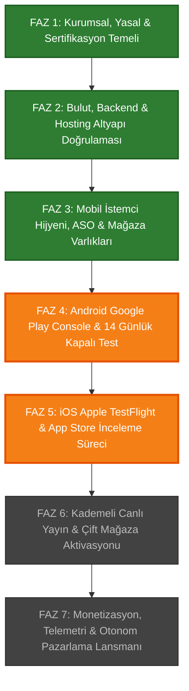

# 🚀 FırsatKolik — Master Canlıya Geçiş & Store Lansman Orkestratörü
# (Living Release Orchestrator & Production Milestone Matrix)

> **Sürüm:** v1.0.0 — Master Launch Edition  
> **Son Güncelleme:** 2026-10-08  
> **Aktif Çalışma Dalı:** `develop`  
> **Sorumlu Orkestratör:** `firsatkolik-store-release` (Antigravity Launch Orchestrator Agent)  
> **Temel İlke:** Sıfır Eksik, Sıfır Mağaza Reddi (Zero Store Rejection), Katı Hiyerarşi, Tam Donanımlı İki Ortam İzolasyonu.

---

## 🧭 Orkestratörün Çalışma Mantığı ve Yaşayan Durum Sözleşmesi
Bu doküman **FırsatKolik** projesinin geliştirme aşamasından başlayıp Google Play Store ve Apple App Store'da gerçek kullanıcılara ulaşmasına ve lansman reklamlarının otonom başlatılmasına kadar geçen tüm süreci adım adım takip eden **yaşayan tek gerçektir (Single Source of Truth)**.

### 🚦 Durum Gösterge Standartları:
* 🟢 **`[TAMAMLANDI]`** : Tüm gereksinimleri, kodları, sertifikaları veya doğrulamaları eksiksiz tamamlanmış adımlar.
* 🟡 **`[ŞU ANKİ ADIM / AKTİF]`** : Tam üzerinde durduğumuz, bir sonraki aksiyonu temsil eden ve odaklandığımız adım.
* ⚪ **`[SIRADAKİ / BEKLEMEDE]`** : Önceki adımların tamamlanmasına bağımlı olan ve sırası geldiğinde açılacak adımlar.
* ⚠️ **`[MANUEL ONAY / KULLANICI GİRDİSİ]`** : Console girişleri, kredi kartı, şifre veya fiziksel telefon gerektiren kullanıcı eylemleri.

> 💡 **Kaldığımız Yerden Devam Etme Kuralı:**  
> Kullanıcı birkaç gün sonra *"Hadi kaldığımız yerden devam edelim"* dediğinde, bu dosya taranır, en üstteki 🟡 **`[ŞU ANKİ ADIM]`** bulunur ve ajan doğrudan o adımın gereksinimlerini devralarak süreci işletir. Adım bittiğinde 🟢 yeşile döner ve bir sonraki adım 🟡 sarı yapılır.

---

## 🗺️ Uçtan Uca Faz Matrisi ve Canlı İlerleme Çizelgesi

| Faz No | Faz Başlığı | Kapsam | İlerleme | Genel Durum |
| :---: | :--- | :--- | :---: | :---: |
| **FAZ 1** | **Kurumsal, Yasal & Sertifikasyon Temeli** | Hesaplar, Gizlilik/KVKK URL'leri, Apple Sertifikaları, Keystore | **%100** | 🟢 **TAMAMLANDI** |
| **FAZ 2** | **Bulut, Backend & Hosting Altyapı Doğrulaması** | Functions 28, Firestore/Storage Rules, AASA, İndeksler, VM Bot | **%100** | 🟢 **TAMAMLANDI** |
| **FAZ 3** | **Mobil İstemci Hijyeni, ASO & Varlıklar** | API 36, AdMob Faz 3.3, 1024x500 Graphic, 51 Medya Varlığı | **%100** | 🟢 **TAMAMLANDI** |
| **FAZ 4** | **Google Play Console & Kapalı Test** | AAB Yükleme, 12 Tester / 14 Gün Test, Play Integrity, App Signing | **%45** | 🟡 **AKTİF ADIM** (Kapalı Test Kanalına AAB Yükleme) |
| **FAZ 5** | **Apple TestFlight & App Store Süreci** | GitHub Actions CI/CD, Dahili Test Grubu, Canlı Test Protokolü | **%75** | 🟡 **AKTİF ADIM** (TestFlight CI/CD & Cihaz Doğrulaması) |
| **FAZ 6** | **Kademeli Canlı Yayın & Mağaza Aktivasyonu** | Staged Rollout (%5->%100), App-Ads.txt, AdMob Mağaza Eşleme | **%10** | ⚪ **BEKLEMEDE** |
| **FAZ 7** | **Monetizasyon & Otonom Pazarlama Lansmanı** | AdMob onPaidEvent, Google UAC, Meta Ads, CPI Optimizasyonu | **%20** | ⚪ **BEKLEMEDE** |

---

## 📋 FAZ 1 — Kurumsal, Yasal & Sertifikasyon Temeli (✅ %100 TAMAMLANDI)

* 🟢 **Adım 1.1: Google Play Developer Bireysel Hesabı**  
  *Geliştirici:* `muratcan.gokyokus@gmail.com`  
  *Durum:* 25$ ödendi, 2FA ve kimlik doğrulaması tamamlandı.
* 🟢 **Adım 1.2: Apple Developer Program Hesabı**  
  *Hesap Sahibi:* `muratcan.gokyokus@hotmail.com` | *Team ID:* `973W9DTDY9`  
  *Durum:* Aktif geliştirici hesabı devrede.
* 🟢 **Adım 1.3: Android PROD Keystore & İmzası**  
  *Dosya:* `android/app/upload-keystore.jks` | *Config:* `android/key.properties`  
  *Alias:* `upload` | *Şifre:* `firsatkolik2024!`  
  *Upload Key SHA-1:* `59:81:22:B5:48:21:79:1D:8C:55:5A:19:0E:C9:D9:76:31:E0:6D:9A`  
  *Upload Key SHA-256:* `5E:9E:29:AC:81:63:22:77:B7:C8:EC:91:34:A2:E2:C2:C4:E7:05:EC:F9:FE:1C:56:2D:42:00:64:15:1F:40:2B`
* 🟢 **Adım 1.4: Windows OpenSSL ile Apple Dağıtım Sertifikası (.p12)**  
  *Sertifika Dosyası:* `ios_ci/ios_certs/firsatkolik_distribution.p12`  
  *Şifre:* `firsatkolik2024!`
* 🟢 **Adım 1.5: Apple Provisioning Profilleri**  
  *Ana Uygulama:* `ios_ci/ios_certs/FirsatKolik_AppStore_Profile.mobileprovision` (`com.firsatkolik.app`)  
  *Share Extension:* `ios_ci/ios_certs/FirsatKolik_ShareExtension_Profile.mobileprovision` (`com.firsatkolik.app.ShareExtension`)
* 🟢 **Adım 1.6: App Store Connect API Anahtarı (.p8)**  
  *Key ID:* `XUVRF9F2Y3` | *Dosya:* `ios_ci/ios_certs/AuthKey_XUVRF9F2Y3.p8`  
  *Kullanım:* Fastlane CI/CD headless yükleme.
* 🟢 **Adım 1.7: Apple Push Notification Service (APNs) Anahtarı (.p8)**  
  *Key ID:* `KJ2TZ9F8SG` | *Dosya:* `ios/Push_Notifications/AuthKey_KJ2TZ9F8SG.p8`  
  *Firebase Entegrasyonu:* Hem DEV (`sicak-firsatlar-e6eae`) hem PROD (`firsatkolik-prod-e6eae`) Cloud Messaging'e yüklendi.
* 🟢 **Adım 1.8: GitHub Actions CI/CD Repository Secrets**  
  *Konum:* GitHub Repo > Settings > Secrets and variables > Actions  
  *Tanımlı 7 Sır:* `BUILD_CERTIFICATE_BASE64`, `P12_PASSWORD`, `BUILD_PROVISION_PROFILE_BASE64`, `SHARE_EXT_PROVISION_PROFILE_BASE64`, `APP_STORE_CONNECT_KEY_ID`, `APP_STORE_CONNECT_ISSUER_ID`, `APP_STORE_CONNECT_PRIVATE_KEY`.
* 🟢 **Adım 1.9: Herkese Açık Yasal Web Sayfaları & KVKK/EULA**  
  *Gizlilik Politikası:* `https://firsatkolik.app/privacy-policy.html` (Canlıda aktif)  
  *Hesap & Veri Silme:* `https://firsatkolik.app/delete-account.html` (Canlıda aktif)  
  *Amazon Gelir Ortaklığı Bildirimi:* `web/index.html` footer alanında yayında.

---

## ⚡ FAZ 2 — Bulut, Backend & Hosting Altyapı Doğrulaması (✅ %100 TAMAMLANDI)

* 🟢 **Adım 2.1: DEV vs PROD Firebase Projeleri İzolasyonu**  
  *DEV Projesi:* `sicak-firsatlar-e6eae` (No: `560592268193`)  
  *PROD Projesi:* `firsatkolik-prod-e6eae` (No: `228657473310`)
* 🟢 **Adım 2.2: Cloud Functions 28 Servis Dağıtımı**  
  *Envanter:* 8 Firestore trigger, 1 Auth trigger, 3 HTTPS onRequest, 5 Scheduled cron, 11 Callable admin API.  
  *Durum:* Node 22 LTS, kod tabanı hazır.
* 🟢 **Adım 2.3: Storage Güvenlik Kuralları (`storage.rules`)**  
  `deals/` public okuma, yetkili kullanıcı WebP yükleme, 5MB limit, admin silme.
* 🟢 **Adım 2.4: Resmi Web Vitrini, Custom Domain, Cloudflare DNS & SSL**  
  *Domain:* `firsatkolik.app` (Cloudflare Registrar & 1.1.1.1 DNS)  
  *DNS A Kaydı (Apex):* `@` ➔ `199.36.158.100` (DNS Only / Gri Bulut ☁️)  
  *DNS TXT Kaydı (Doğrulama):* `@` ➔ `hosting-site=firsatkolik-prod-e6eae` (DNS Only / Gri Bulut ☁️)  
  *DNS CNAME Kaydı (Subdomain):* `www` ➔ `firsatkolik-prod-e6eae.web.app` (DNS Only / Gri Bulut ☁️)  
  *SSL:* Google Trust Services HTTPS 200 OK (Universal SSL devrede).
* 🟢 **Adım 2.5: Google AdMob `app-ads.txt` Doğrulaması**  
  *URL:* `https://firsatkolik.app/app-ads.txt`  
  *İçerik:* `google.com, pub-6853997017739651, DIRECT, f08c47fec0942fa0` (Yayında doğrulanmıştır).
* 🟢 **Adım 2.6: Otonom Telegram Botu & GCP Free Tier VM İzolasyonu**  
  *VM:* `telegram-bot-server` (`34.135.181.112`, `e2-micro`, `us-central1-a`) — RUNNING.  
  *Konteynerler & Portlar:* `dev-bot` (Port 8081, DEV Firestore), `prod-bot` (Port 8082, PROD Firestore).  
  *Ortam İzolasyonu:* `/home/murat/app/prod-bot/.env` dosyasında `PROJECT_ID=firsatkolik-prod-e6eae` ve `GOOGLE_APPLICATION_CREDENTIALS=/app/prod_firebase_key.json` tanımlıdır; `dev-bot`'un PROD'a yazması engellenmiştir. Test araçları (`create_test_data.js`, `/simulate`) PROD çalışma ortamında kilitlenmiştir.  
  *SRE & VM Bellek Kalkanı:* 969 MB RAM'li e2-micro VM'de bellek sızıntısı ve Docker log şişmesini önlemek için her gece 04:00 TSİ'de `clean_vm.sh` Linux Crontab otonom bakım görevi çalışmaktadır; Web Admin üzerinden V8 GC tetiklenebilir (`CLEAN_VM_MIMARISI.md`).
* 🟢 **Adım 2.7: Firestore Bileşik İndeksleri (`deals` ve `comments`)**  
  1. `deals` İndeksi: `isExpired ASCENDING` + `createdAt DESCENDING` (İstemcinin anasayfa akışındaki `failed-precondition` hatası için eklendi).  
  2. `comments` Koleksiyon Grubu İndeksi: `collectionGroup: comments` (COLLECTION_GROUP scope) `userId ASCENDING` + `createdAt DESCENDING` (Web Admin paneli kullanıcı bazlı yorum listesi sorgusu için `firestore.indexes.json` dosyasına eklendi).
* 🟢 **Adım 2.8: Apple Universal Links (AASA) Team ID Enjeksiyonu**  
  *Problem:* `web/.well-known/apple-app-site-association` ve `web/apple-app-site-association` dosyalarında `appID` değerleri `TEAMID.com.firsatkolik.app` olarak kalmıştı.  
  *Çözüm:* Gerçek Apple Team ID (`973W9DTDY9`) her iki dosyaya da enjekte edildi (`973W9DTDY9.com.firsatkolik.app`).
* 🟢 **Adım 2.9: Firestore PROD Başlangıç Ayarları & Anti-Spam Dokümanları (Bootstrap Configs)**  
  *Kapsam:* PROD Firestore projesinde (`firsatkolik-prod-e6eae`) sistemin sıfır kesintiyle çalışması için zorunlu başlangıç dokümanlarının oluşturulması:  
  1. `systemConfig/notifications`: Tam 12'li bildirim hız limitleri ve anti-spam kalkanı (`categoryHourlyLimit: 3`, `categoryDailyLimit: 8`, `authorHourlyLimit: 4`, `authorDailyLimit: 12`, `keywordHourlyLimit: 6`, `keywordDailyLimit: 18`, `dealMinIntervalSeconds: 30`, `dealMaxHourlyTotal: 8`, `commentHourlyLimit: 10`, `commentDealTenMinLimit: 5`, `marketingDailyLimit: 2`, `adminMessageHourlyLimit: 6`).  
  2. `settings/telegramBot`: Bot kaynak ve hedef kanalları (`sourceChannels: ['@indirimkaplani']`, `targetChannel: '@firsatkolik_canli'`) ve aktif dinleme parametreleri.  
  3. `settings/app`: `dealApprovalRequired: true`, `amazonAffiliateEnabled: true`, `teknosaAffiliateEnabled: true`, `hepsiburadaAffiliateEnabled: true`, `activeStores: ['teknosa', 'hepsiburada', 'amazon']`.  
  4. `system/maintenance`: `enabled: false` (Bakım modu kapalı).  
  5. `system/minSupportedBuild`: `minSupportedBuild: 1` (Zorunlu minimum sürüm kalkanı).  
  6. `users/{adminUid}`: Yönetici hesabına (`muratcan.gokyokus@gmail.com`) `isAdmin: true` atanması.  
  7. `settings/admob`: `killSwitch: false`, `nativeEnabled: true`, `rewardedEnabled: true`, `adCooldownSeconds: 25` (AdMob canlı reklam birimleri ve arbitraj kontrolü).  
  8. `settings/marketing`: `tier: 2`, `totalDailyBudget: 250`, `googleBudget: 150`, `metaBudget: 100`, `targetCpi: 4.20`, `status: 'PAUSED'` (Lansman pazarlama ve bütçe orkestrasyonu başlangıç kaydı).
* 🟢 **Adım 2.10: Cloud Scheduler 5 Otomatik Cron Görevinin Doğrulanması (ENABLED)**  
  *GCP Konsolu:* [Cloud Scheduler PROD](https://console.cloud.google.com/cloudscheduler?project=firsatkolik-prod-e6eae)  
  *Kontrol:* 5 zamanlanmış görevin tamamının (`crawlKuponlar` 01:00, `expireOldDealsCron` 03:00, `aggregateAnalyticsCron` 04:00, `cleanupOldLogsCron` 05:00, `dailyReportCron` 09:00) `ENABLED` durumda olduğu ve `Europe/Istanbul` saat diliminde çalıştığı teyit edildi.
* 🟢 **Adım 2.11: Firestore Zamanda Noktasal Kurtarma (PITR) ve Günlük Yedekleme (Backup Schedule)**  
  *Amaç:* Olası bir felaket veya veri bozulmasında sıfır veri kaybı güvencesi (`R-INF-07`).  
  *Durum:*  
  - PITR Etkinleştirme: `POINT_IN_TIME_RECOVERY_ENABLED` (Canlıda aktif) ✅  
  - Günlük Otomatik Yedek: 7 günlük yedekleme planı oluşturuldu (`backupSchedules/c1b3c4ac-057d-4f3e-8678-44f5d74a465f`) ✅  
* 🟢 **Adım 2.12: GCP Bütçe ve Cloud Functions Hata Alarmları (Alert Policies)**  
  *Bütçe Alarmı:* `monitoring/budget-alert.json` (500 TL aylık bütçe, %50, %80, %100 harcama eşikleri) GCP Billing Konsolunda devrede.  
  *Hata Alarmı:* `monitoring/alert-policy-functions.json` (5 dakikada 5 Cloud Functions hatası eşiği) Cloud Monitoring paneline yüklendi ve e-posta bildirim kanalına bağlandı.
* 🟢 **Adım 2.13: GCP Compute Engine Güvenlik Duvarı (Firewall Rules) & Bot Port Kalkanı**  
  *Amaç:* Bot yönetim uç noktalarının (`/simulate`, `/test-bypass`, `/bot-logs`, memory heap dump) dış internete açık kalarak SSRF veya DoS tehdidi oluşturmasını engellemek (`R-INF-01`, `R-INF-02`).  
  *Kural:* GCP Konsolu > VPC Network > Firewall kuralları altında `8081` ve `8082` portları genel internete (`0.0.0.0/0`) doğrudan açık tutulmamalı; yalnızca yetkili yönetim IP'lerine veya yerel proxy'ye kısıtlanmalıdır.

---

## 📱 FAZ 3 — Mobil İstemci Hijyeni, ASO & Mağaza Varlıkları (✅ %100 TAMAMLANDI)

* 🟢 **Adım 3.1: Android 16 (API 36) ve Java 17 Derleme Sözleşmesi**  
  `android/app/build.gradle` içinde `compileSdkVersion 36`, `targetSdkVersion 36`, Java 17, ProGuard/R8 aktif.
* 🟢 **Adım 3.2: iOS Minimum Sürüm iOS 15.0+ Sözleşmesi**  
  `ios/Podfile` ve `project.pbxproj` içinde `15.0` hedefi sabitlendi.
* 🟢 **Adım 3.3: AdMob İki Temel Sütun — Native Ads & Rewarded Video Mimarisi**  
  - *Native Ads (Faz 3.3):* Android PROD Native: `ca-app-pub-6853997017739651/4004866134`, iOS PROD Native: `ca-app-pub-6853997017739651/9437070495`. Anasayfa, Kuponlar ve Aktüel akışlarında 124dp şık sponsorlu kartlar.  
  - *Rewarded Video Ads:* Günlük 2 ücretsiz kupon açma kredisi (`CouponCreditService`); misafir kullanıcılara kilitli kupon önizlemesi ve 1 video ile +2 kredi kazanımı. Android Test Rewarded: `ca-app-pub-3940256099942544/5224354917`, iOS Test Rewarded: `ca-app-pub-3940256099942544/1712485313`.  
  - *Fair-Play Reklamsızlık İzolasyonu:* Kaydedilenler sayfası Tab 1 ("Kaydettiklerim") sekmesi kullanıcının satın alma niyetinin en yüksek olduğu alandır; **%100 reklamsız** bırakılmıştır. Kullanıcı deneyimini bozan Interstitial (Geçiş) ve App Open reklamları FırsatKolik'ten tamamen temizlenmiştir ("Altın Oran" prensibi).  
  - *Denetim:* `python admob_cli.py inspect` 10/10 PASS.
* 🟢 **Adım 3.4: UMP (Consent) SDK, iOS ATT & AdMob Web Konsol Rıza Formları Yayını**  
  - *Mobil Kod:* Açılışta UMP formu ile interaktif spotlight turunun çakışması önlendi (`AdManagerService.waitForConsentFlow()`).  
  - *⚠️ AdMob Web Konsolu Aksiyonu (Kritik):* Google AdMob Konsolu > **Privacy & messaging (Gizlilik ve mesajlaşma)** sekmesinden **GDPR Mesajı (Avrupa Ekonomik Alanı ve Birleşik Krallık)** ve **IDFA / ATT Açıklama Mesajı (iOS)** oluşturulup **YAYINLANDI (Published)** durumuna getirilmelidir. Konsolda yayınlanmazsa UMP SDK boş form döndürür ve AB kullanıcılarında reklam doluluk oranı sıfıra iner.
* 🟢 **Adım 3.5: 51 Parçalık Kreatif Hub & Mağaza Varlıkları**  
  *1024x500 Feature Graphic:* Hazır (`marketing-assets/images/store_assets/store-images/feature_graphic_1024x500.png`).  
  *512x512 Store İkon:* Hazır.  
  *Videolar (3 Adet):* 9:16 (27s), 1:1 (45s), 16:9 (45s) tanıtım videoları hazır.  
  *Ekran Görüntüleri:* 12 ham screenshot, 6 çerçeveli vitrin görseli hazır.
* 🟢 **Adım 3.6: Türkçe ASO Metin Varlıkları**  
  *Başlık (30 Karakter):* `FırsatKolik: Sıcak Fırsatlar`  
  *Kısa Açıklama (80 Karakter):* `En sıcak indirimler, kupon kodları, market aktüel broşürleri ve canlı fırsatlar!`  
  *Tam Açıklama (4000 Karakter):* Anahtar kelime zengin metin hazır (`documentation/yayin-ve-surec/firsatkolik_production_roadmap.md`).
* 🟢 **Adım 3.7: Fırsat Yaşam Döngüsü & Arşiv Tutarlılık Sözleşmesi (Deal.isArchived & Self-Healing)**  
  - *Problem:* Anasayfa akışı gerçek zamanlı 48 saatlik eşikle (`now - 48h`) eski fırsatları anında filtrelerken; Bildirim Merkezi veya harici derin bağlantı ile açılan detay sayfalarında sadece statik `deal.isExpired` kontrolü yapıldığı için Cloud Function cron'u (03:00) çalışana kadar fırsatların "aktif" görünmesi tutarsızlığı tespit edildi.  
  - *Çözüm:* `Deal.isArchived` getter'ı (`isExpired || expiredVotes >= 15 || createdAt < (now - 48h)`) tek gerçek kaynak yapıldı. Tüm kartlar (`VerticalDealCard`, `HorizontalDealCard`), detay sayfası (`DealDetailScreen` çıkartma, 48 saat bilgilendirme bandı, "Şansını Dene" nötr CTA'sı, admin butonları) ve `FavoritesScreen` bu kurala bağlandı.  
  - *Self-Healing:* Bildirim/link üzerinden açılan 48 sa geçmiş fırsat detay ekranında `markDealAsExpired(dealId)` ile Firestore üzerinde asenkron olarak otomatik onarılır.  
  - *Doğrulama:* `flutter analyze` 0 hata/uyarı, 14 birim testi PASS, AdMob Faz 3.3 ve bildirim motoru sıfır yan etki ile korundu.
* 🟢 **Adım 3.8: E-posta ile Giriş (Email/Password Auth) Mimarisi & Çoklu Sağlayıcı Senkronizasyonu**  
  - *Kapsam:* Google ve Apple girişlerinin yanı sıra mobil istemcide (Android & iOS) ve Web'de tam donanımlı E-posta ile Giriş, Kayıt ve Şifre Sıfırlama yeteneği.  
  - *Bileşenler:* `EmailAuthBottomSheet` (Animated Tab Selector, şifre gizle/göster, AutofillHints, validasyonlar), `GuestLoginBottomSheet` ve `GuestProfileScreen` entegrasyonu, `AuthScreen` mobil desteği.  
  - *Ortak Pipeline:* `signInWithEmail` ve `signUpWithEmail` fonksiyonları ortak `_handleUserAfterSignIn` boru hattına bağlandı; Firestore `users/{uid}` profili, takip listeleri, FCM token ve Analytics/Crashlytics `setUser` çağrıları tüm sağlayıcılarda %100 birleştirildi.  
  - *Hesap Silme Güvencesi (Apple 5.1.1(v)):* Firebase Auth `requires-recent-login` fırlattığında e-posta kullanıcısı için şifreyle anında `reauthenticateWithEmailPassword` diyaloğu eklendi (`SupportHubScreen`).  
  - *Doğrulama:* `test/email_auth_logic_test.dart` ve `test/ios_auth_test.dart` %100 PASS, `flutter analyze` 0 hata/uyarı.  
  - *Firebase Konsol Aksiyonu:* Hem DEV (`sicak-firsatlar-e6eae`) hem PROD (`firsatkolik-prod-e6eae`) Firebase Authentication panellerinde Email/Password sağlayıcısı aktifleştirildi.
* 🟢 **Adım 3.9: T.C. Ticaret Bakanlığı Reklam Mevzuatı & Otomatik `#tanıtım` Etiketleme Sözleşmesi**  
  *Yasal Zorunluluk:* Ticari Reklam ve Haksız Ticari Uygulamalar Yönetmeliği uyarınca tüm gelir ortaklığı (affiliate) paylaşımlarında tüketicinin şeffafça bilgilendirilmesi şarttır.  
  *Teknik Altyapı:* Hem mobil istemcide (`AdvertisingComplianceService.ensureDisclosure`) hem de Telegram botunda (`ensureAdvertisingDisclosure`) paylaşılan tüm fırsat açıklamalarının sonuna regex temizliği sonrası otomatik standart `\n\n#tanıtım` etiketi eklenmektedir.
* 🟢 **Adım 3.10: Yayın Öncesi Sıfır Hata ve Statik Kod Hijyeni Kapısı (Zero-Defect Code Gate)**  
  *Kapsam:* Release derlemesi alınmadan önce tüm test ve analiz kapılarının %100 temiz olduğunun teyidi:  
  - Mobil Statik Analiz: `flutter analyze` ➔ 0 hata, 0 uyarı (Temiz).  
  - Mobil Birim Testleri: `flutter test` (13/13 Auth ve uyumluluk testleri PASS).  
  - Cloud Functions Testleri: `npm test` (33/33 servis ve kural testleri PASS).  
  - Güvenlik Denetimi: `npm audit --omit=dev` ➔ 0 yüksek/kritik güvenlik açığı.

---

## 🛡️ FAZ 4 — Android Google Play Console & Kapalı Test (🟡 AKTİF AŞAMA)

* 🟢 **Adım 4.1: Shorebird ile İmzalı PROD AAB Üretimi [TAMAMLANDI]**  
  *Release Versiyonu:* `1.1.0+45` (App ID: `289726d1-81cb-4fdf-97f7-5c2c07f033cc`) Shorebird sunucularına başarıyla yüklendi ✅  
  *İmzalı AAB Çıktı Yolu:* `d:\firsatkolik\build\app\outputs\bundle\prodRelease\app-prod-release.aab` (154.0 MB)  
  *Cihaz Doğrudan Kurulum APK Yolu:* `d:\firsatkolik\build\app\outputs\flutter-apk\app-prod-release.apk`  
* 🟢 **Adım 4.2: Play Console'da Uygulama Oluşturuldu**  
  *Uygulama Adı:* `FırsatKolik` (App ID: `4975320169857069569`, Paket: `com.firsatkolik.app`, Dil: Türkçe, Ücretsiz).  
* 🟢 **Adım 4.3: Play Console Tüm 10 Politika ve Beyan Formu %100 Tamamlandı**  
  - Gizlilik Politikası URL'si: `https://firsatkolik.app/privacy-policy` kaydedildi ✅  
  - Reklam Beyanı: "Evet, uygulamam reklam içeriyor" kaydedildi ✅  
  - Uygulama Erişimi: Test hesabı (`test@firsatkolik.app` / `Test12345!`) kaydedildi ✅  
  - İçerik Derecelendirmeleri (IARC): Anket tamamlandı ve sertifika onaylandı ✅  
  - Hedef Kitle ve İçerik: 18+ (çocukları hedeflemiyor) onaylandı ✅  
  - Veri Güvenliği (Data Safety): Firebase/AdMob uyumlu beyan tamamlandı ✅  
  - Reklam Kimliği (AAID): Evet (Pazarlama & Analiz) onaylandı ✅  
  - Resmi Kurum Uygulamaları: Hayır onaylandı ✅  
  - Finans ile İlgili Özellikler: Hayır onaylandı ✅  
  - Sağlık Uygulamaları: Hayır onaylandı ✅  
  - *"Tamamlanması gerekenler" sekmesinde 0 bekleyen işlem kaldı (10/10 Tamamlandı).* ✅  
* 🟡 **Adım 4.4: [ŞU ANKİ AKTİF ADIM] AAB Paketini Play Console "Kapalı Test" (Closed Testing) Kanalına Yükleme**  
  Shorebird ile üretilen imzalı `app-prod-release.aab` dosyası Play Console Kapalı Test kanalına yüklenecektir.  
* ⚠️ **Adım 4.5: [ÇOK KRİTİK] Google App Signing SHA-1 Parmak İzini Firebase PROD'a Ekleme**  
  *Nereden Alınır?:* Play Console > Setup > App Integrity > App Signing > "App signing key certificate" SHA-1.  
  *Nereye Eklenir?:* Firebase Console PROD (`firsatkolik-prod-e6eae`) > Proje Ayarları > Android Uygulaması SHA parmak izleri.  
  *Neden Kritik?:* Eklenmezse Google Sign-In mağazadan indiren tüm kullanıcılarda `DEVELOPER_ERROR` verir!  
* ⚪ **Adım 4.6: Firebase App Check Play Integrity Sağlayıcısını Bağlama (2-Aşamalı Kural)**  
  Play Console App Integrity ile Firebase PROD projesini bağlayıp Play Integrity sağlayıcısını aktif etme.  
  *⚠️ Çok Kritik Enforcement Kuralı:* Lansman ve 14 günlük kapalı test boyunca Firebase Console > App Check altında Firestore ve Storage servislerinde **Yaptırım (Enforce) KAPALI (Monitoring/İzleme Modu)** tutulmalıdır! Hemen enforce edilirse doğrulaması henüz tamamlanmamış meşru kullanıcılar API'ye erişemez. 14 gün sonunda doğrulama oranı ≥ %98 olduğunda Enforce açılacaktır.  
* ⚠️ **Adım 4.7: 12 Test Kullanıcısı ile 14 Günlük Kesintisiz Kapalı Test Süreci**  
  12 gerçek Google kullanıcısı e-postası listeye eklenir, opt-in linki üzerinden yükletilir ve 14 gün test edilir.  
* ⚪ **Adım 4.8: Production Erişim Başvurusu (Apply for Production)**  
  14 günün sonunda Play Console üzerinden canlıya geçiş başvurusu yapılır.  
* ⚪ **Adım 4.9: Google Ads API Developer Token "Temel Erişim" (Basic Access) Başvurusu**  
  *Geliştirici Jetonu:* `7cyi92huw-5veEsPfOCg5g` (MCC: `223-970-0076`) şu anda "Test Hesabı (Test Access)" düzeyindedir.  
  *Başvuru Zamanı:* Kapalı teste AAB yüklendiğinde ve uygulamanın Play Store linki (`https://play.google.com/store/apps/details?id=com.firsatkolik.app`) oluştuğunda icra edilir.  
  *Nereden Yapılır?:* Google Ads Paneli > Araçlar ve Ayarlar > Kurulum > [Google Ads API Center (API Merkezi)](https://ads.google.com/aw/apicenter) üzerinden "Temel Erişim için Başvur" (Apply for Basic Access) formu doldurulur (Onay süresi: 24-48 saat).  
  *Neden Zorunlu?:* Bu onay alınmadan Google Ads API / MCP orchestrator üzerinden canlı harcamalı UAC indirme kampanyaları başlatılamaz.  

---

## 🍏 FAZ 5 — iOS Apple TestFlight & App Store Süreci (🟡 AKTİF AŞAMA)

* 🟢 **Adım 5.1: Zero-Mac Sıfır Maliyetli CI/CD Pipeline Hazırlığı**  
  `.github/workflows/ios_testflight_deploy.yml`, Fastlane entegrasyonu, CocoaPods cache ve Keychain kurulumu hazır.  
  *Şifreleme Muafiyeti:* `ios/Runner/Info.plist` dosyasına `<key>ITSAppUsesNonExemptEncryption</key><false/>` mühürlenmiştir; bu sayede TestFlight yüklemeleri manuel ihracat uyumu sorusu sormadan doğrudan hazır duruma geçer.  
* 🟢 **Adım 5.2: App Store Connect'te Uygulama ve Dahili Test Ekibi Grubu Aktif**  
  *Uygulama:* `FırsatKolik` (Apple ID: `6811384751`, SKU: `firsatkolik-ios-01`, Bundle ID: `com.firsatkolik.app`)  
  *TestFlight Grubu:* `Firsatkolik Test Team` grubu aktif.  
  *Mevcut TestFlight Sürümleri:* Version 1.1.0 altında Build `44`'e kadar derlemeler başarıyla yüklendi ve test cihazlarında çalıştı ✅  
* ⚪ **Adım 5.3: App Store Sürüm 1.0 Varlıklarını, İnceleme Bilgilerini & Yaş Derecelendirmesini Doldurma**  
  - *Görsel & Metin:* 1024x500 grafik, iPhone vitrin ekranları ve Türkçe ASO açıklamaları girilecektir.  
  - *Kategori:* Birincil: Alışveriş (Shopping), İkincil: İzlenceler (Utilities).  
  - *⚠️ Yaş Derecelendirmesi (Age Rating - Kritik):* Uygulama içi fırsatlarda harici e-ticaret sitelerine web tarayıcısı yönlendirmesi (`Unrestricted Web Access`) olduğu için Apple Yaş Derecelendirmesi **17+** olarak işaretlenmelidir (Aksi takdirde Apple Guideline 2.3 reddi verir).  
  - *⚠️ App Review Bilgileri:* Demo test hesabı (`test@firsatkolik.app` / `Test12345!`), iletişim bilgileri ve İncelemeci Notları ("Kullanıcıların fırsat paylaştığı bir topluluk uygulamasıdır; harici linkler sistem Safari tarayıcısında açılır") eksiksiz girilecektir.  
  - *EULA & Şikayet Sözleşmesi:* Guideline 1.2 gereğince Kullanım Koşulları & Gizlilik linki (`https://firsatkolik.app/privacy-policy.html`) girilmeli; uygulama içi şikayet/engelleme mekanizmasının varlığı beyan edilmelidir.
* ⚠️ **Adım 5.4: [Store Uyumu - Guideline 5.1.1(v)] Apple Token Revocation (.p8) Anahtarını Cloud Functions'a Tanımlama**  
  *Nereden Alınır?:* Apple Developer Portal > Certificates, Identifiers & Profiles > Keys > Sign in with Apple yetkili Anahtar (.p8 dosyası, Key ID ve Team ID `973W9DTDY9`).  
  *Nereye Eklenir?:* Firebase Cloud Functions ortam değişkenlerine (`firebase functions:config:set apple.key_id="..." apple.team_id="973W9DTDY9" apple.client_id="com.firsatkolik.app" apple.private_key="..."`).  
  *Amacı:* Apple İnceleme Kılavuzu 5.1.1(v) gereğince, Apple ile giriş yapan kullanıcı hesabını sildiğinde yetkilendirme jetonunu Apple REST API (`/auth/revoke`) üzerinden iptal etmek ve mağaza ret riskini kökten engellemek.  
* ⚠️ **Adım 5.5: Test iPhone Cihazında 12 Kritik Uçtan Uca Canlı Test**  
  Build 44 veya yeni tetiklenecek build üzerinde şu 12 kritik canlı test adımı doğrulanacaktır:  
  1. *Apple ile Giriş & E-posta Girişi:* UI, Firebase Auth, Keychain senkronizasyonu ve `users/{uid}` profili.  
  2. *APNs Push Bildirimleri:* Token üretimi, FCM HTTP v1 iletimi, bildirim açılışı ve badge temizleme.  
  3. *UMP Rıza & ATT Akışı:* iOS ATT (`AppTrackingTransparency`) ve AdMob UMP onay diyaloğu.  
  4. *Universal Links & Deep Linking:* `https://firsatkolik.app/deal/{id}` linkinin uygulamayı doğrudan açması.  
  5. *Harici Mağaza Yönlendirmeleri:* `hbapp://`, `amazon://`, `teknosa://` şemalarıyla doğrudan yerel mağaza uygulamasına sıçrama (Zero Browser).  
  6. *AdMob Reklam Deneyimi:* Anasayfa ve Kuponlar akışında 124dp Native Reklam; Kupon detayında Rewarded Video ile +2 kredi kazanımı.  
  7. *Hesap Silme & Revoke Kaskadı:* `SupportHubScreen` üzerinden hesap silme ve Apple jetonunun iptal edilmesi (Guideline 5.1.1(v)).  
  8. *UGC Şikayet & Engelleme:* Fırsat/yorum şikayeti (`ReportDialog`) ve kullanıcı engelleme mekanizması (Guideline 1.2).  
  9. *Dynamic Island & Safe Area:* Çentikli iPhone'larda ve Dynamic Island alanlarında taşma/kırpılma olmaması.  
  10. *Fırsat Yaşam Döngüsü & 48 Saat Kuralı:* 48 saati geçmiş fırsatın detayında arşiv bandı ve "Şansını Dene" CTA'sı; Firestore `isExpired` self-healing onarımı.  
  11. *Çevrimdışı Önbellek Emniyeti:* Uçak modunda açıldığında çökme yaşanmaması, önbellekten listeleme ve "Bağlantı Yok" bildirim bandı.  
  12. *8 Adımlı Spotlight Eğitici Turu:* Yeni kullanıcı açılışında `InAppTutorialService` spotlight adımlarının düzgün konumlanması.  
* ⚪ **Adım 5.6: App Store İnceleme Gönderimi (App Store Review)**  
  Tüm alanlar tamamlandıktan sonra Apple onayına gönderilecektir.
* ⚪ **Adım 5.7: Firebase App Check iOS DeviceCheck / App Attest Sağlayıcısını Bağlama**  
  *Apple Portal:* Apple Developer > Identifiers > `com.firsatkolik.app` altında DeviceCheck ve App Attest yetkileri doğrulanır.  
  *Firebase Console:* PROD projesinde App Check > Apps > iOS uygulaması altına DeviceCheck (Key ID, Team ID `973W9DTDY9`, .p8 private key) kaydedilir.  
  *⚠️ İzleme Modu Kuralı:* Tıpkı Android gibi, iOS tarafında da ilk 14 gün boyunca Firestore ve Storage servislerinde **Enforcement (Yaptırım) KAPALI (Monitoring Modu)** tutulacaktır; meşru kullanıcı erişimi riske atılmayacaktır.

---

## 🚀 FAZ 6 — Kademeli Canlı Yayın & Mağaza Aktivasyonu (⚪ BEKLEMEDE)

* ⚪ **Adım 6.1: Google Play Kademeli Yayın (%5 ➔ %20 ➔ %50 ➔ %100)**  
  İlk 24 saat %5 kullanıcıya açılarak Crashlytics ve ANR vitals değerleri izlenir.
* ⚪ **Adım 6.2: App Store Canlı Sürümü Yayına Alma**  
  Apple onayı sonrası sürüm canlıya açılır.
* ⚪ **Adım 6.3: Google AdMob Mağaza Bağlantısı (Link App)**  
  AdMob Konsolu > Uygulama Ayarları > Uygulama Mağazaları sekmesinden FırsatKolik Play Store ve App Store linkleri bağlanır. (Doluluk oranını %95+'e sıçratır).
* ⚪ **Adım 6.4: Web Admin AdMob Canlı Şalter Kontrolü**  
  `web/admin` paneli AdMob Dashboard üzerinden Kill-Switch'in kapalı, tüm formatların açık olduğu teyit edilir.
* ⚪ **Adım 6.5: İlk 48 Saat Observability HUB Nöbeti**  
  Modül 11 üzerinden Crash-free %99.5+, anlık aktif kullanıcılar, mağazaya git tıklamaları ve bot sağlığı canlı izlenir.
* ⚪ **Adım 6.6: Google Analytics 4 (GA4) ile Firebase Console Mülk Eşlemesi**  
  Firebase Console > Proje Ayarları > Entegrasyonlar sekmesinden GA4 Mülk ID: `512542954` (`374649967`) eşlenir. Bu sayede hem Firebase Realtime telemetrisi açılır hem de Web Admin Modül 11 Observability Hub ile kusursuz senkronizasyon sağlanır.

---

## 📈 FAZ 7 — Monetizasyon, Telemetri & Otonom Pazarlama Lansmanı (⚪ BEKLEMEDE)

* ⚪ **Adım 7.1: AdMob onPaidEvent ➔ GA4 ➔ Google Ads tROAS & Dönüşüm İçe Aktarımı (Conversions Import)**  
  - *Firebase ➔ Google Ads Bağlantısı:* Firebase Console > Proje Ayarları > Entegrasyonlar sekmesinden Google Ads Müşteri Hesabı (`664-050-3186`, MCC: `223-970-0076`) bağlanır; *"Google Ads hesabında otomatik etiketlemeyi etkinleştir"* (Auto-tagging) açılır.  
  - *Dönüşüm Olaylarının İçe Aktarımı:* Google Ads Paneli > Hedefler (Goals) > Dönüşümler (Conversions) > Yeni Dönüşüm > Uygulama (App) > Google Analytics 4 (Firebase) üzerinden şu 3 olay içe aktarılır:  
    1. `first_open` (Yükleme / Birincil - Değer: 1.00 TL) ➔ UAC indirme teklifi için.  
    2. `deal_outbound_click` (Affiliate Yönlendirme / Birincil - Değer: 5.00 TL) ➔ tCPA ile gerçek gelir getiren kitle teklifi için.  
    3. `coupon_copied` (Etkileşim / İkincil - Değer: 2.50 TL) ➔ Gözlem amaçlı.  
  - *onPaidEvent Telemetrisi:* AdMob'da gösterilen her Native ve Rewarded reklamın geliri (`valueMicros`) `AnalyticsService.logAdImpression` ile GA4'e ve tROAS teklif motoruna akar.
* ⚪ **Adım 7.2: Google Ads UAC (App Campaigns) Lansman Kampanyası (`FK_UAC_TR_Installs_Lansman_v1`)**  
  - *Manifest:* `marketing-assets/campaigns/google_uac_launch_manifest.json`  
  - *Hedef Uygulama:* `com.firsatkolik.app` (Google Play Store)  
  - *Bütçe & Teklif:* Günlük **150.00 TL** bütçe, Hedef CPI (Target Cost Per Install): **4.00 TL** (Tahmini ~35-40 indirme/gün).  
  - *Kreatif Varlıklar:* 5 başlık, 5 açıklama, 6 görsel (`feature_graphic_1024x500.png`, `1-1.png`, `feature-graphic-2.png`, 3 vitrin mockup'ı), 2 video (`9-16_tanitim.mp4` Shorts, `16-9_tanitim.mp4` YouTube).  
  - *Başlangıç Kuralı:* MCP orchestrator üzerinden ilk olarak **`PAUSED` (Duraklatılmış/Taslak)** statüde açılır; doğrudan harcama başlatılmaz.
* ⚪ **Adım 7.3: Meta Advantage+ App Install Lansman Kampanyası (`FK_Meta_Advantage_Installs_Lansman_v1`)**  
  - *Manifest:* `marketing-assets/campaigns/meta_advantage_launch_manifest.json`  
  - *Reklam Hesabı:* `act_1415274484041528` (Durum: 1 ACTIVE, TRY / Europe/Istanbul).  
  - *Bütçe & Teklif:* CBO (Campaign Budget Optimization) Günlük **100.00 TL** bütçe, Hedef CPI: **4.50 TL** (Tahmini ~20-25 indirme/gün).  
  - *3 Farklı Reklam Seti (Ad Sets):*  
    1. *Reels & Stories (9:16):* 27s dikey video (`9-16_tanitim.mp4`) + 1080x1920 afiş.  
    2. *Feed & Explore (1:1):* Kupon ve popüler fırsat kare görselleri.  
    3. *Süpermarket & Aktüel Broşür (Niş Kitle):* 36 zincir market broşür afişi.  
  - *Başlangıç Kuralı:* Meta Marketing API üzerinden ilk olarak **`PAUSED` (Taslak)** modda oluşturulur.
* ⚪ **Adım 7.4: Finansal Onay Bariyeri (Human-in-the-Loop) & Otonom Ateşleme**  
  - *Toplam Lansman Bütçesi:* **250.00 TL / Gün** (Aylık ~7.500 TL — Tier 2 Dengeli Lansman).  
  - *Onay Protokolü:* AI Agent kampanyaları taslak olarak açtıktan sonra kullanıcıya finansal onay kartını sunar (`Google UAC: 150 TL/gün, Meta Advantage+: 100 TL/gün`). Kullanıcı açıkça *"Onaylıyorum"* demeden hiçbir kampanya canlıya (`ACTIVE`) alınmaz.  
  - *Ateşleme:* Onay geldiği anda her iki kampanya MCP araçları ile tek tıkla `ACTIVE` durumuna geçirilir.
* ⚪ **Adım 7.5: Meta for Developers Uygulama Kurulumu & Key Hash Entegrasyonu**  
  - *Uygulama:* `developers.facebook.com` üzerinde `FırsatKolik` (App ID: `1182285740321285`).  
  - *Android Platformu:* Paket: `com.firsatkolik.app`, Sınıf: `com.firsatkolik.app.MainActivity`.  
  - *Key Hash:* `upload-keystore.jks` SHA-1 parmak izinden üretilen Base64 Key Hash'i Meta paneline kaydedilmelidir.  
  - *Meta CAPI Bridge:* Cloud Functions üzerinden sunucu taraflı Meta Conversions API for Apps ile `deal_outbound_click` olayları aktarılır.
* ⚪ **Adım 7.6: Ertelenmiş Derin Link (Deferred Deep Linking) & Install Referrer Doğrulaması**  
  - Reklamdan gelen kullanıcının uygulamayı ilk açtığında ana sayfada kaybolmak yerine doğrudan reklamdaki fırsat detayına (`DealDetailScreen`) gitmesi sağlanır.  
  - Google Play Install Referrer API üzerinden `utm_content=deal_{id}` parametresi `AnalyticsService` tarafından okunarak yönlendirme icra edilir.
* ⚪ **Adım 7.7: Otonom A/B Testi, Kreatif Yıpranma (Fatigue) ve Haftalık Raporlama**  
  - Web Admin Modül 12 (Marketing Hub) üzerinden canlı CPI, harcama ve yükleme sayıları izlenir.  
  - 3. gün yüksek maliyetli (>6.00 TL CPI) varyantlar duraklatılır, 7. gün kazanan kreatiflerin bütçesi %30 artırılır.

---

## 🆘 Kriz ve Acil Durum Protokolleri (Emergency Rollback)
1. **Dart Mantık Hatası Tespit Edilirse:**  
   Google Play onayını beklemeden:  
   `shorebird patch android --flavor prod -t lib/main.dart --dart-define=FLAVOR=prod --release-version=<VER> --track staging`  
   Doğrulama sonrası: `shorebird patches promote --flavor prod --release-version <VER> --patch-number <N>`
2. **Kritik Reklam Politikası İhlali veya Kilitlenme:**  
   Web Admin Modülü üzerinden tek tıkla AdMob Kill-Switch kapatılır (Reklamlar anında kesilir, uygulama çökmek yerine House Promo gösterir).
3. **Web Vitrini / Admin Hatası:**  
   Firebase Console > Hosting > Release History üzerinden önceki sürüme anında Rollback yapılır.
