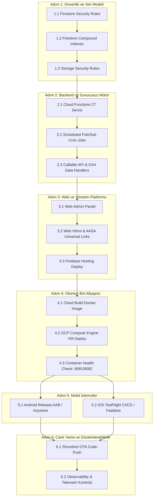
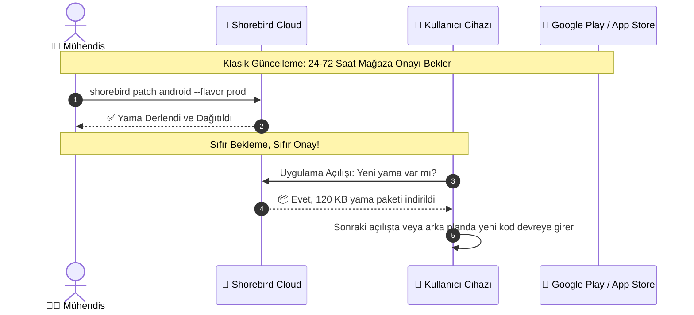

# 🚀 FırsatKolik — Master Deployment ve DevOps Orkestrasyon Rehberi (Master Deployment Manual)

Bu doküman, **FırsatKolik** platformunun tüm bileşenlerini (Mobil İstemci, Otonom Telegram Botu, Firebase Cloud Functions, Cloud Firestore, Firebase Storage, Firebase Hosting, Web Admin Paneli, Docker Sanal Makinesi, Google Cloud Platform ve GitHub Actions CI/CD) Geliştirme (DEV) ve Canlı (PROD) ortamlarına **sıfır kesinti, tam veri tutarlılığı ve mutlak izolasyonla** dağıtmak (deploy etmek) için gereken tüm mimari hiyerarşiyi, ön koşulları, gizli anahtarları, çalıştırma komutlarını ve operasyonel protokolleri içeren **tek ve nihai resmi master operasyon sözleşmesidir**.

> [!IMPORTANT]
> Canlıya (Production) veya Geliştirme (DEV) ortamına dağıtım yaparken bu rehberdeki **hiyerarşik sıra kesinlikle atlanmamalıdır**. Katmanlar arasındaki bağımlılık zinciri (Database Rules ➔ Functions ➔ Hosting ➔ Bot VM ➔ Mobile Release ➔ Observability) veri bozulmalarını, yetki hatalarını ve `FAILED_PRECONDITION` kilitlenmelerini kökten önler.

---

## 📑 İçindekiler
1. [🛠️ Projede Kullanılan Tüm Teknolojiler ve Görev Envanteri](#1-️-projede-kullanılan-tüm-teknolojiler-ve-görev-envanteri)
2. [⚙️ DEV vs PROD Ortam İzolasyon Sözleşmesi](#2-️-dev-vs-prod-ortam-izolasyon-sözleşmesi)
3. [🔐 Merkezi Gizli Bilgiler, Anahtarlar ve Ortam Değişkenleri Envanteri (Secrets & Credentials)](#3--merkezi-gizli-bilgiler-anahtarlar-ve-ortam-değişkenleri-envanteri-secrets--credentials)
4. [🏗️ Hiyerarşik Dağıtım Sıralaması ve Bağımlılık Ağacı](#4-️-hiyerarşik-dağıtım-sıralaması-ve-bağımlılık-ağacı)
5. [💻 DEV Ortamı Uçtan Uca Dağıtım Protokolü (Adım Adım Komutlar)](#5-️-dev-ortamı-uçtan-uca-dağıtım-protokolü-adım-adım-komutlar)
6. [🚀 PROD Ortamı Uçtan Uca Dağıtım Protokolü (Adım Adım Komutlar)](#6-️-prod-ortamı-uçtan-uca-dağıtım-protokolü-adım-adım-komutlar)
7. [⚡ Cloud Functions 27 Servis Envanteri ve Dağıtım Kuralları](#7--cloud-functions-27-servis-envanteri-ve-dağıtım-kuralları)
8. [🤖 Otonom Bot VM & Docker Konteyner Dağıtım Mimarisi](#8--otonom-bot-vm--docker-konteyner-dağıtım-mimarisi)
9. [📱 Android Google Play Dağıtımı (Keystore, AAB, API 36 & Shorebird)](#9-️-android-google-play-dağıtımı-keystore-aab-api-36--shorebird)
10. [🍏 iOS TestFlight ve App Store Dağıtımı (Sıfır Mac CI/CD & Fastlane)](#10--ios-testflight-ve-app-store-dağıtımı-sıfır-mac-cicd--fastlane)
11. [🦅 Shorebird Canlı Kod Yaması (OTA Code-Push) Protokolü](#11--shorebird-canlı-kod-yaması-ota-code-push-protokolü)
12. [🌐 Web Showcase, Custom Domain (`firsatkolik.app`) ve Cloudflare Entegrasyonu](#12--web-showcase-custom-domain-firsatkolikapp-ve-cloudflare-entegrasyonu)
13. [👁️ Observability, İzleme ve Hata Yönetimi (Modül 11 & GCP Alarmları)](#13-️-observability-izleme-ve-hata-yönetimi-modül-11--gcp-alarmları)
14. [🔍 Dağıtım Sonrası Doğrulama, Sağlık Kontrolü ve Test Protokolü](#14--dağıtım-sonrası-doğrulama-sağlık-kontrolü-ve-test-protokolü)
15. [🔄 Acil Durum Geri Alma (Rollback) & Kriz Protokolleri](#15--acil-durum-geri-alma-rollback--kriz-protokolleri)
16. [📋 Hızlı Referans Kartı (Master Cheatsheet)](#16--hızlı-referans-kartı-master-cheatsheet)

---

## 1. 🛠️ Projede Kullanılan Tüm Teknolojiler ve Görev Envanteri

FırsatKolik ekosistemi birbirine sıkı sıkıya bağlı 10 temel teknoloji katmanından oluşmaktadır:

| Katman | Teknoloji / Araç | Sürüm / Detay | Görevi ve Sorumluluğu |
| :--- | :--- | :--- | :--- |
| **Mobil İstemci** | **Flutter / Dart** | Flutter 3.x, Dart `>=3.0.0 <4.0.0` | Android ve iOS tek kod tabanı, reaktif UI, Wilson gösterim algoritmaları, anlık mesajlaşma. |
| **Android Altyapısı** | **Android SDK / Gradle** | SDK 36 (Android 16), Java 17, Gradle 8.14 | Google Play Store 2026 uyumluluğu, ProGuard/R8 optimizasyonu, 7 adet `AndroidNotificationChannel`. |
| **iOS Altyapısı** | **Swift / Xcode / CocoaPods** | Xcode 16.x, iOS 15.0+ Target, Saf Swift | `AppDelegate.swift`, Apple Sign-In nonce mimarisi, Zero-Pod `ShareExtension` ve App Group (`group.com.firsatkolik.app`). |
| **OTA Code Push** | **Shorebird CLI** | Shorebird Engine | Google Play / App Store onayını beklemeden canlıdaki kullanıcılara anında Dart mantık ve arayüz yaması gönderme. |
| **Backend & Servisler** | **Firebase Cloud Functions** | Node.js 22 LTS, Firebase Admin v12, Functions v4 | **27 adet** reaktif Firestore/Auth trigger'ı, zamanlanmış Pub/Sub cron'ları, Callable API'ler ve GA4 Data API köprüsü. |
| **Veritabanı** | **Cloud Firestore** | Native Mode, Rule Version 2 | NoSQL doküman veritabanı, atomik transaction'lar, `firestore.indexes.json` bileşik ve collectionGroup indeksleri. |
| **Güvenlik & Doğrulama**| **Firebase App Check** | Play Integrity (PROD), Debug Provider (DEV) | Yetkisiz bot, emülatör ve korsan scraping isteklerinin backend API'lerine erişimini engelleme. |
| **Medya & CDN** | **Firebase Storage** | WebP Compression Pipeline, Bucket Rules | Fırsat ve kullanıcı görsellerini barındırma, sahipsiz çöp dosya temizliği (`cleanupOldImages`). |
| **Web & Alan Adı** | **Firebase Hosting** | Static Rewrites, Custom Domain, Anycast CDN | `https://firsatkolik.app` vitrini, Web Admin Vanilla SPA paneli, Apple Universal Links (`apple-app-site-association`). |
| **DNS & SSL** | **Cloudflare Registrar** | 1.1.1.1 DNS (DNS Only / Gri Bulut ☁️) | Global DNS yönlendirmesi, Google Trust Services SSL sertifikasyonu, HSTS Preload. |
| **Otonom Botlar** | **GramJS (MTProto) & Node.js** | Node.js 22, Cheerio, `@google/generative-ai` | 7/24 Telegram kanallarını dinleme, 21 e-ticaret mağazası WAF bypass kazıma motoru, Gemini Flash AI OCR. |
| **Konteyner & VM** | **Docker & GCP Compute Engine** | `e2-micro` (Free Tier), Cloud Build, GCR | Sıfır maliyetle DEV (`port 8081`) ve PROD (`port 8082`) bot konteynerlerini izole çalıştırma. |
| **Bildirim Dağıtımı** | **FCM HTTP v1 & Apple APNs** | Data-only (Android), `aps.alert` (iOS), .p8 | 7 kanallı akıllı push, sessiz saatler, kategori hız limitleri, çift bildirim bastırma. |
| **CI/CD Otomasyonu** | **GitHub Actions & Fastlane** | `macos-latest` (M2), Fastlane v1 App Store API | Sıfır Mac ile iOS TestFlight otomatik derleme, imzalama ve mağazaya yükleme pipeline'ı. |
| **Gözlemlenebilirlik** | **Observability Manager (Modül 11)**| GA4 Data API, Firestore `systemErrors`, Cloud Monitoring | Canlı hata takibi, APM telemetrisi, bot sağlık monitörü, anlık kullanıcı analitiği. |

---

## 2. ⚙️ DEV vs PROD Ortam İzolasyon Sözleşmesi

Projede Geliştirme (DEV) ve Canlı (PROD) ortamları hiçbir şekilde birbirine veri, yetki veya trafik aktarmaz:

| Yapılandırma Parametresi | Geliştirme Ortamı (DEV) | Canlı Ortam (PROD) |
| :--- | :--- | :--- |
| **Firebase Proje ID** | `sicak-firsatlar-e6eae` | `firsatkolik-prod-e6eae` |
| **Firebase CLI Alias** | `dev` (ve varsayılan `default`) | `prod` |
| **Google Cloud Proje No** | `560592268193` | `228657473310` |
| **Android Paket Adı** | `com.sicakfirsatlar.sicak_firsatlar` | `com.firsatkolik.app` |
| **Android Uygulama Adı** | **FırsatKolik Dev** | **FırsatKolik** |
| **Android Keystore** | Varsayılan Debug Keystore | `android/app/upload-keystore.jks` (Alias: `upload`) |
| **iOS Bundle Identifier** | `com.firsatkolik.app` | `com.firsatkolik.app` |
| **iOS Firebase App ID** | `1:560592268193:ios:be496ea2d9e55177d6f9e0` | `1:228657473310:ios:5f779f3647ed4dd2380b0f` |
| **iOS Config Dosyası** | `ios/Runner/GoogleService-Info-dev.plist` | `ios/Runner/GoogleService-Info-prod.plist` |
| **Flutter Flavor Bayrakları** | `--flavor dev --dart-define=FLAVOR=dev` | `--flavor prod --dart-define=FLAVOR=prod` |
| **Web Hosting URL** | `https://sicak-firsatlar-e6eae.web.app` | `https://firsatkolik.app` (`firsatkolik-prod-e6eae.web.app`) |
| **Web Admin Panel URL** | `https://sicak-firsatlar-e6eae.web.app/admin/` | `https://firsatkolik.app/admin/` |
| **Cloud Functions Adedi** | 27 Fonksiyon (`Europe/Istanbul` Cron'ları) | 27 Fonksiyon (`Europe/Istanbul` Cron'ları) |
| **GCP VM Konteyner Adı** | `dev-bot` (Host Port: `8081` -> `8080`) | `prod-bot` (Host Port: `8082` -> `8080`) |
| **Dinlenen Telegram Kanalı**| `@indirimkaplani` (veya test kanalları) | `@firsatkolik_canli` |
| **Bot Firebase Anahtarı** | `cloud-run-bot/dev_firebase_key.json` | `cloud-run-bot/prod_firebase_key.json` |
| **AdMob Banner ID** | `ca-app-pub-3940256099942544/6300978111` *(Test)* | `ca-app-pub-6853997017739651/8758625050` *(Gerçek)* |
| **App Check Sağlayıcısı** | Debug Token Provider | Play Integrity API (Google Play) |
| **APNs Auth Key (.p8)** | `AuthKey_KJ2TZ9F8SG.p8` (Dev & Prod APNs Key) | `AuthKey_KJ2TZ9F8SG.p8` (Dev & Prod APNs Key) |

---

## 3. 🔐 Merkezi Gizli Bilgiler, Anahtarlar ve Ortam Değişkenleri Envanteri (Secrets & Credentials)

Tüm dağıtımların hatasız çalışması için sistemde kayıtlı olan merkezi gizli değişkenler matrisi:

### 3.1 Android İmzalama ve Keystore (PROD)
* **Keystore Konumu:** `android/app/upload-keystore.jks`
* **Yapılandırma Dosyası:** `android/key.properties`
* **Keystore Parolası (`storePassword`):** `firsatkolik2024!`
* **Anahtar Parolası (`keyPassword`):** `firsatkolik2024!`
* **Anahtar Takma Adı (`keyAlias`):** `upload`
* **Upload Key SHA-1:** `59:81:22:B5:48:21:79:1D:8C:55:5A:19:0E:C9:D9:76:31:E0:6D:9A`
* **Upload Key SHA-256:** `5E:9E:29:AC:81:63:22:77:B7:C8:EC:91:34:A2:E2:C2:C4:E7:05:EC:F9:FE:1C:56:2D:42:00:64:15:1F:40:2B`

> [!CRITICAL]
> **Google Sign-In İçin Çift SHA-1 Kuralı:**
> 1. Yukarıdaki **Upload Key SHA-1** parmak izi Firebase Console PROD projesine kayıtlıdır.
> 2. İlk AAB Google Play Console'a yüklendikten sonra **Play Console > Kurulum > Uygulama Bütünlüğü > Uygulama İmzalama (App Signing)** altındaki **Google App Signing SHA-1** parmak izi de mutlaka Firebase Console PROD Android uygulamasına eklenmelidir. Eklenmezse mağazadan indiren kullanıcılarda Google Sign-In `DEVELOPER_ERROR` verir.

### 3.2 Apple Developer, iOS İmzalama ve GitHub Actions Secrets
GitHub Repository (`Settings > Secrets and variables > Actions`) üzerinde tanımlı olan 7 zorunlu sır:

| Secret Adı | Biçim / Format | Açıklama |
| :--- | :--- | :--- |
| `BUILD_CERTIFICATE_BASE64` | Base64 String | `firsatkolik_distribution.p12` dosyasının Base64 kodlanmış tam içeriği. |
| `P12_PASSWORD` | Metin | `firsatkolik2024!` (.p12 şifresi). |
| `BUILD_PROVISION_PROFILE_BASE64` | Base64 String | `FirsatKolik_AppStore_Profile.mobileprovision` ana uygulama profilinin Base64 içeriği. |
| `SHARE_EXT_PROVISION_PROFILE_BASE64` | Base64 String | `FirsatKolik_ShareExtension_Profile.mobileprovision` Share Extension profilinin Base64 içeriği. |
| `APP_STORE_CONNECT_KEY_ID` | 10 Haneli Alfanümerik | `XUVRF9F2Y3` (App Store Connect API Anahtar ID). |
| `APP_STORE_CONNECT_ISSUER_ID` | UUID | `69a6de70-xxxx-xxxx-...` (App Store Connect Sağlayıcı Kimliği). |
| `APP_STORE_CONNECT_PRIVATE_KEY` | PEM Metni (`.p8`) | `AuthKey_XUVRF9F2Y3.p8` özel anahtarının `-----BEGIN...` bloklu tam içeriği. |

### 3.3 Apple APNs Bildirim Anahtarı (.p8)
* **Anahtar Dosyası:** `ios/Push_Notifications/AuthKey_KJ2TZ9F8SG.p8`
* **Key ID:** `KJ2TZ9F8SG`
* **Team ID:** `973W9DTDY9`
* **Kapsam:** `Sandbox & Production` (Süresiz)
* **Firebase Yüklemesi:** Firebase Console'da hem `sicak-firsatlar-e6eae` (DEV) hem `firsatkolik-prod-e6eae` (PROD) projelerinde *Proje Ayarları > Cloud Messaging > Apple uygulama yapılandırması (`com.firsatkolik.app`)* altında hem **Development APNs auth key** hem **Production APNs auth key** alanlarına yüklenmiştir. (APNs Certificates alanı boştur).

### 3.4 Otonom Telegram Botu Değişkenleri (VM Diskinde)
Sanal makinede (`/home/murat/app/{env}-bot/.env`) tanımlanan değişkenler:
* `TELEGRAM_API_ID`: `37462587`
* `TELEGRAM_API_HASH`: `35c8bc7cd010dd61eb5a123e2722be41`
* `TELEGRAM_SESSION_STRING`: Canlı MTProto String oturumu.
* `TELEGRAM_CHANNELS`: DEV için `@indirimkaplani`, PROD için `@firsatkolik_canli`.
* `GEMINI_API_KEY`: Google AI Studio Gemini API anahtarı.
* `PORT`: `8080` (Konteyner içi port; Host tarafında DEV için `8081`, PROD için `8082` eşlenir).
* `FIREBASE_KEY`: Konteyner içine `-v .../{env}_firebase_key.json:/app/firebase_key.json` ile mount edilir.

### 3.5 Cloudflare Registrar & DNS Yapılandırması
* **Kayıtlı Domain:** `firsatkolik.app` (Apex Domain)
* **DNS A Kaydı:** `@` ➔ `199.36.158.100` — **Proxy Durumu: DNS Only (Gri Bulut ☁️)**
* **DNS TXT Kaydı:** `@` ➔ `hosting-site=firsatkolik-prod-e6eae` (Sahiplik doğrulama)
* **DNS CNAME Kaydı:** `www` ➔ `firsatkolik-prod-e6eae.web.app` (Gri Bulut)

---

## 4. 🏗️ Hiyerarşik Dağıtım Sıralaması ve Bağımlılık Ağacı

Bir ortamı sıfırdan kurarken veya mevcut bir sistemi komple deploy ederken izlenmesi gereken **katı hiyerarşik sıra**:



### ❓ Neden Bu Sıra Takip Edilmelidir?
1. **Kurallar ve İndeksler Önce Gelmelidir:** Cloud Functions veya Botlar çalışmaya başladığında Firestore'a yazma ve bileşik sorgu (`orderBy + where`) yapacaktır. İndeksler ve kurallar hazır değilse `FAILED_PRECONDITION: missing index` veya `PERMISSION_DENIED` hataları patlar.
2. **Fonksiyonlar Hosting'den Önce Gelmelidir:** Web Admin paneli açıldığında backend callable fonksiyonlarına (`getObservabilityMetrics`, `sendManualNotification` vb.) ihtiyaç duyar.
3. **Botlar Mobil Yayından Önce Çalışmalıdır:** Mobil uygulama kullanıcının cebine indiğinde içeride hazır, taze ve otonom işlenmiş fırsat havuzunun bulunması gerekir.
4. **Mobil Yayın En Sonda Yer Alır:** Hem mağaza onayı (Apple/Google) vakit alır hem de backend API sözleşmesi oturmadan mobil derleme alınmaz.

---

## 5. 💻 DEV Ortamı Uçtan Uca Dağıtım Protokolü (Adım Adım Komutlar)

Geliştirme ortamına (`sicak-firsatlar-e6eae`) dağıtım yaparken çalıştırılacak tüm komutlar sırasıyla aşağıdadır:

### Adım 5.1: Firebase Ortamını Hazırlama ve CLI Girişi
* **Dizin:** Proje Kök Dizini (`d:/firsatkolik`)
```bash
# Firebase oturumu doğrula
firebase login

# Aktif projeyi DEV olarak seç
firebase use dev

# Seçilen projeyi doğrula (sicak-firsatlar-e6eae görünmelidir)
firebase projects:list
```

### Adım 5.2: Firestore Güvenlik Kuralları ve İndeksleri
* **Dizin:** Proje Kök Dizini (`d:/firsatkolik`)
```bash
firebase deploy --only firestore:rules,firestore:indexes -P dev
```
* **Beklenen Çıktı:** `✔ Deploy complete! Rules and indexes updated.`

### Adım 5.3: Storage Güvenlik Kuralları
* **Dizin:** Proje Kök Dizini (`d:/firsatkolik`)
```bash
firebase deploy --only storage -P dev
```

### Adım 5.4: Cloud Functions Dağıtımı (27 Servis)
* **Dizin:** `d:/firsatkolik/functions`
```bash
# Bağımlılıkları yükle
cd functions
npm install

# Üst dizine çıkıp Functions deploy et
cd ..
firebase deploy --only functions -P dev
```
* **Beklenen Çıktı:** `✔ Functions deploy complete!` (27 fonksiyon başarıyla listelenir).

### Adım 5.5: Web Hosting ve Web Admin Paneli
* **Dizin:** Proje Kök Dizini (`d:/firsatkolik`)
```bash
firebase deploy --only hosting -P dev
```
* **Canlı Test:** `https://sicak-firsatlar-e6eae.web.app` (Admin: `/admin/`)

### Adım 5.6: Otonom Telegram Botu (GCP VM `dev-bot` Konteyneri)
* **Dizin:** `d:/firsatkolik/cloud-run-bot`
```bash
cd cloud-run-bot
python deploy_to_vm.py dev
cd ..
```
* **Beklenen Çıktı:** `[SUCCESS] Docker-based deployment to DEV VM completed successfully!`

### Adım 5.7: DEV Sağlık Doğrulaması
```bash
# 1. Bot Sağlık Kontrolü (Port 8081)
curl http://34.135.181.112:8081/health

# 2. Fonksiyon loglarını canlı izleme
firebase functions:log -P dev --only onUserMessageCreated
```

### Adım 5.8: Mobil DEV İstemcisini Test Cihazında Çalıştırma
```bash
flutter pub get
flutter run -d <cihaz_veya_emulator_id> --flavor dev --dart-define=FLAVOR=dev
```

---

## 6. 🚀 PROD Ortamı Uçtan Uca Dağıtım Protokolü (Adım Adım Komutlar)

Canlı ortama (`firsatkolik-prod-e6eae`) üretim dağıtımı yapılırken çalıştırılacak **kesintisiz üretim protokolü**:

### Adım 6.1: Firebase CLI PROD Seçimi ve Yetki Doğrulaması
* **Dizin:** Proje Kök Dizini (`d:/firsatkolik`)
```bash
firebase use prod
```
> [!CAUTION]
> Konsolda `Active Project: prod (firsatkolik-prod-e6eae)` yazdığından emin olmadan sonraki adımlara geçmeyiniz!

### Adım 6.2: Firestore PROD Güvenlik Kuralları ve İndeksleri
* **Dizin:** Proje Kök Dizini (`d:/firsatkolik`)
```bash
firebase deploy --only firestore:rules,firestore:indexes -P prod
```

### Adım 6.3: Storage PROD Güvenlik Kuralları
* **Dizin:** Proje Kök Dizini (`d:/firsatkolik`)
```bash
firebase deploy --only storage -P prod
```

### Adım 6.4: Cloud Functions PROD Dağıtımı (27 Servis / Kesintisiz)
* **Dizin:** Proje Kök Dizini (`d:/firsatkolik`)
```bash
cd functions
npm install --omit=dev
cd ..
firebase deploy --only functions -P prod --force
```
* **Beklenen Çıktı:** 27 fonksiyonun tamamının yeşil tikle tamamlanması.

### Adım 6.5: Web Hosting, Resmi Vitrin ve Canlı Web Admin
* **Dizin:** Proje Kök Dizini (`d:/firsatkolik`)
```bash
firebase deploy --only hosting -P prod
```

### Adım 6.6: Alan Adı, SSL ve Universal Links Doğrulama
```bash
# DNS A kaydı kontrolü
powershell -Command "Resolve-DnsName -Name firsatkolik.app -Server 8.8.8.8 -Type A"

# HTTPS ve SSL kontrolü
curl.exe -I https://firsatkolik.app/

# Apple App Site Association (AASA) JSON başlık kontrolü
curl.exe -I https://firsatkolik.app/.well-known/apple-app-site-association
```

### Adım 6.7: Otonom Telegram Botu PROD Dağıtımı (`prod-bot` Konteyneri)
* **Dizin:** `d:/firsatkolik/cloud-run-bot`
```bash
cd cloud-run-bot
python deploy_to_vm.py prod
cd ..
```
* **Canlı Bot Kontrolü:**
```bash
curl http://34.135.181.112:8082/health
# Beklenen Çıktı: {"status":"ok","bot_running":true,"channels":["@firsatkolik_canli"],...}
```

---

## 7. ⚡ Cloud Functions 27 Servis Envanteri ve Dağıtım Kuralları

FırsatKolik backend sisteminde (`functions/index.js`) yer alan **27 adet Cloud Function'ın** tam envanteri:

| # | Fonksiyon Adı | Tetikleyici Türü | Yol / Zamanlama / Parametre | Görevi ve Sorumluluğu |
|---|---|---|---|---|
| 1 | **`onDealCreated`** | Firestore Trigger | `deals/{dealId}` (Create) | Kategori/mağaza analizi, bildirim kuyruğu eşleşmesi, Telegram anonsu, kullanıcı sayaç artırımı. |
| 2 | **`onDealUpdated`** | Firestore Trigger | `deals/{dealId}` (Update) | Onay/red bildirimi, `isExpired` puan cezası ve sıralama optimizasyonu. |
| 3 | **`onCommentCreated`** | Firestore Trigger | `deals/{id}/comments/{id}` (Create) | `commentCount` atomik artırımı, yorum yanıtı (`comment_reply`) bildirimi. |
| 4 | **`onAdminMessageCreated`** | Firestore Trigger | `adminMessages/{id}` (Create) | Yönetici duyurusunu kullanıcının bildirim kutusuna yazma ve push iletme. |
| 5 | **`onUserMessageCreated`** | Firestore Trigger | `messages/{id}` (Create) | Birebir sohbette **Data-Only FCM** (Android) ve **`aps.alert` APNs** (iOS) iletimi. |
| 6 | **`onNotificationCreated`** | Firestore Trigger | `users/{uid}/notifications/{id}` (Create) | **Merkezi Push Motoru:** Şalter, sessiz saatler, hız limiti ve token denetimleri ile FCM HTTP v1 iletimi. |
| 7 | **`onUserUpdated`** | Firestore Trigger | `users/{userId}` (Update) | Profil resmi/adı değiştiğinde fırsat, yorum ve mesajlardaki denormalize verileri senkronize etme. |
| 8 | **`onUserDeleted`** | Auth Trigger | `auth.user().onDelete` | Kullanıcı silindiğinde cihaz, bildirim aboneliği ve alt koleksiyonları kalıcı temizleme. |
| 9 | **`resolveShortLink`** | HTTPS Request | `onRequest` | Kısa linkleri ve yönlendirmeleri (redirect) takip ederek gerçek son ürün URL'sini çözme. |
| 10 | **`analyzeProductProxy`** | HTTPS Request | `onRequest` (512MB) | Google Gemini API'ye Firebase App Check ve Secret Manager korumalı güvenli proxy sağlama. |
| 11 | **`sendManualNotification`** | HTTPS Callable | `onCall` (Admin Only) | Admin panelinden tüm kullanıcılara veya tekil hedeflere manuel anlık bildirim gönderme. |
| 12 | **`cleanupInvalidTokens`** | HTTPS Callable | `onCall` (Admin Only) | Aktif cihazların FCM geçerliliğini `dryRun: true` ile test edip bayat olanları pasife alma. |
| 13 | **`cleanupExpiredDeals`** | Scheduled Cron | `0 3 * * *` (Gece 03:00 - `Europe/Istanbul`) | 48 saati dolan fırsatları dokümanı silmeden `isExpired: true` işaretleme (Soft-Expire). |
| 14 | **`cleanupExpiredDealsManual`**| HTTPS Request | `onRequest` (Bakım/Test) | 48 saatlik soft-expire işlemini cron saatini beklemeden manuel test etme. |
| 15 | **`purgeOldDeals`** | Scheduled Cron | `0 4 * * 0` (Pazar 04:00 - `Europe/Istanbul`) | **30 Günlük Derin Temizlik:** 30 günden eski fırsatları, Storage görsellerini ve **tüm kullanıcılardaki (`collectionGroup('notifications')`) 30+ günlük bildirimleri** 400'lük batch parçalarıyla kalıcı silme. |
| 16 | **`purgeOldDealsManual`** | HTTPS Callable | `onCall` (Admin Only) | 30 günlük derin temizliği admin yetkisiyle manuel tetikleme. |
| 17 | **`purgeOldNotificationsManual`**| HTTPS Callable | `onCall` (Admin Only) | Yalnızca 30 günü geçmiş bildirimleri (`collectionGroup`) toplu silme. |
| 18 | **`cleanupOldImages`** | Scheduled Cron | `0 0 * * *` (Gece 00:00 - `Europe/Istanbul`) | Storage `deals/` dizinindeki 30+ günlük sahipsiz çöp görselleri temizleme. |
| 19 | **`cleanupOldImagesManual`** | HTTPS Request | `onRequest` (Bakım/Test) | Storage görsel temizliğini anlık test etme. |
| 20 | **`adminDeleteUser`** | HTTPS Callable | `onCall` (Admin Only) | Admin panelinden seçilen kullanıcının hem Auth hem Firestore verilerini silme. |
| 21 | **`generateTestData`** | HTTPS Callable | `onCall` (Admin Only) | `isTest: true` bayraklı sahte test fırsatları ve kategorileri üretme. |
| 22 | **`cleanupTestData`** | HTTPS Callable | `onCall` (Admin Only) | `isTest: true` bayraklı sahte test verilerini tek işlemle temizleme. |
| 23 | **`scrapeCouponsScheduled`** | Scheduled Cron | `0 */6 * * *` (Her 6 saatte bir) | DH, Kuponla, Kuponburada kaynaklarından kuponları otonom tarama. |
| 24 | **`scrapeCouponsManual`** | HTTPS Callable | `onCall` (Admin Only) | Kupon kazıma botunu admin panelinden manuel çalıştırma. |
| 25 | **`scrapeCatalogsScheduled`** | Scheduled Cron | `0 3 * * *` (Gece 03:00 - `Europe/Istanbul`) | 36 mağazanın Akakçe broşürlerini WAF bypass ile tarama. |
| 26 | **`scrapeCatalogsManual`** | HTTPS Callable | `onCall` (Admin Only) | Broşür kazıma botunu admin panelinden manuel çalıştırma. |
| 27 | **`getObservabilityMetrics`**| HTTPS Callable | `onCall` (Admin Only - 512MB, 60s) | Web Admin Modül 11 için GA4 Data API ve Firestore telemetri verilerini güvenle çekme. |

> [!NOTE]
> Tüm zamanlanmış Pub/Sub cron fonksiyonları **`Europe/Istanbul`** saat dilimine göre ayarlanmıştır. Her iki ortamda (`sicak-firsatlar-e6eae` ve `firsatkolik-prod-e6eae`) toplam 54 izole fonksiyon örneği barındırılır.

---

## 8. 🤖 Otonom Bot VM & Docker Konteyner Dağıtım Mimarisi

FırsatKolik'in 7/24 Telegram kanallarını dinleyen ve 21 mağazayı kazıyan botları, **Google Cloud Free Tier VM** üzerinde izole Docker konteynerleri halinde çalışır:

```text
Sanal Makine Adı: telegram-bot-server
Bölge (Zone):     us-central1-a
GCP Projesi:      firsatkolik-prod-e6eae (Hem DEV hem PROD botlar burada barınır)
Makine Tipi:      e2-micro (2 vCPU, 1 GB RAM — Aylık 0$ Free Tier)
Dış Sabit IP:     34.135.181.112
```

### 8.1 Dağıtım Akışı ve `deploy_to_vm.py` Mantığı
Tek bir komutla (`python deploy_to_vm.py prod`) şu 3 adım icra edilir:
1. **Cloud Build:** Docker imajı doğrudan Google bulutunda derlenir (`gcr.io/firsatkolik-prod-e6eae/telegram-bot:latest`).
2. **SSH & Docker Deploy:** Sanal makineye SSH ile bağlanılır; eski container durdurulup silinir; yeni imaj çekilip doğru port ve anahtar JSON ile başlatılır.
3. **Disk Temizliği:** Eski Docker imajları (`docker image prune -a -f`) temizlenerek disk dolması engellenir.

### 8.2 Konteyner Port ve Dosya Eşlemeleri

| Ortam | Konteyner Adı | Host Portu | Konteyner Portu | Volume Mount (.json) | Environment (.env) |
| :--- | :--- | :---: | :---: | :--- | :--- |
| **DEV** | `dev-bot` | `8081` | `8080` | `/home/murat/app/dev-bot/dev_firebase_key.json:/app/firebase_key.json` | `/home/murat/app/dev-bot/.env` |
| **PROD** | `prod-bot` | `8082` | `8080` | `/home/murat/app/prod-bot/prod_firebase_key.json:/app/firebase_key.json` | `/home/murat/app/prod-bot/.env` |

### 8.3 Manuel Doğrudan Docker Komutları (Komut Satırı Fallback)
Eğer Python scripti yerine doğrudan SSH üzerinden konteyner güncellemek isterseniz:
```bash
# PROD Konteynerini Güncelleme:
gcloud compute ssh telegram-bot-server --zone=us-central1-a --project=firsatkolik-prod-e6eae --command="docker pull gcr.io/firsatkolik-prod-e6eae/telegram-bot:latest && docker stop prod-bot || true && docker rm prod-bot || true && docker run -d --name prod-bot --restart always -p 8082:8080 --env-file /home/murat/app/prod-bot/.env -v /home/murat/app/prod-bot/prod_firebase_key.json:/app/firebase_key.json gcr.io/firsatkolik-prod-e6eae/telegram-bot:latest && docker image prune -a -f"
```

### 8.4 Bot Uç Noktaları ve Yönetim
* **Sağlık Durumu:** `http://34.135.181.112:8082/health`
* **Canlı Loglar:** `http://34.135.181.112:8082/bot-logs?limit=100`
* **Kazıma Testi:** `http://34.135.181.112:8082/test-bypass?url=https://www.hepsiburada.com/...`
* **Link Simülasyonu:** `http://34.135.181.112:8082/simulate?url=https://...`

---

## 9. 📱 Android Google Play Dağıtımı (Keystore, AAB, API 36 & Shorebird)

Android üretim paketleri Google Play Console standartlarına tam uyumlu olarak imzalı **Android App Bundle (.aab)** formatında üretilir.

### 9.1 Android 16 (API 36) ve Derleme Standartları
`android/app/build.gradle` yapılandırması:
* `compileSdkVersion 36`
* `targetSdkVersion 36`
* `minSdkVersion 23` (Android 6.0+)
* Java 17 & JVM Target 17
* ProGuard/R8 Tam Aktif (`minifyEnabled true`, `shrinkResources true`, `proguard-rules.pro`)

### 9.2 Google Play İmzalı AAB Üretme Komutları

#### Yöntem A: Windows Batch Script ile Tek Tıkla
```cmd
scripts\build_release_aab.bat
```

#### Yöntem B: Terminal Komutu ile
```bash
flutter build appbundle --flavor prod --dart-define=FLAVOR=prod --release
```
* **Üretilen Dosya:** `build/app/outputs/bundle/prodRelease/app-prod-release.aab`

### 9.3 Shorebird Code-Push Destekli İlk Sürüm Derlemesi (Tavsiye Edilen)
Gelecekte mağaza onayını beklemeden Dart mantığı yaması basabilmek için Shorebird motoruyla AAB üretimi:
```bash
shorebird release android --flavor prod -t lib/main.dart
```
* Üretilen paket Google Play Console > **Üretim (Production)** veya **Kapalı Test (Closed Testing)** kanalına yüklenir.

---

## 10. 🍏 iOS TestFlight ve App Store Dağıtımı (Sıfır Mac CI/CD & Fastlane)

FırsatKolik, **Sıfır Mac (Zero-Mac)** mimarisine sahiptir. Tüm iOS derleme, imzalama ve TestFlight yükleme süreci bulut tabanlı GitHub Actions üzerindeki izole `macos-latest` (Xcode 16) sanal makinesinde otomatik icra edilir.

### 10.1 Sıfır Mac ile Sertifikasyon ve İmzalama Mimarisi (Windows 11 OpenSSL)
1. **Windows 11 Üzerinde CSR ve Private Key Üretimi:**
   ```bash
   openssl genrsa -out firsatkolik_distribution.key 2048
   openssl req -new -key firsatkolik_distribution.key -out CertificateSigningRequest.certSigningRequest -subj "/emailAddress=destek@firsatkolik.app, CN=FirsatKolik Distribution, C=TR"
   ```
2. **Apple Developer Portal Onayı:**
   - `developer.apple.com` ➔ Certificates ➔ (+) ➔ **Apple Distribution** seçilip `.certSigningRequest` yüklenir ve `distribution.cer` indirilir.
3. **P12 Dönüştürme:**
   ```bash
   openssl x509 -inform DER -in distribution.cer -out distribution.pem
   openssl pkcs12 -export -inkey firsatkolik_distribution.key -in distribution.pem -out firsatkolik_distribution.p12 -passout pass:firsatkolik2024!
   ```
4. **Provisioning Profile Üretimi:**
   - Ana Uygulama: `com.firsatkolik.app` (App Store Dağıtım Profili ➔ `FirsatKolik_AppStore_Profile.mobileprovision`)
   - Share Extension: `com.firsatkolik.app.ShareExtension` (App Store Dağıtım Profili ➔ `FirsatKolik_ShareExtension_Profile.mobileprovision`)

### 10.2 CI/CD Tetikleme Yöntemleri

#### Yöntem A: GitHub CLI ile Terminalden Tetikleme (Hızlı)
```bash
# PROD ortamı için TestFlight derlemesi başlat
gh workflow run ios_testflight_deploy.yml -f flavor=prod -f upload_to_testflight=true

# Dağıtım loglarını canlı izle
gh run watch
```

#### Yöntem B: GitHub Web Arayüzünden Tetikleme
1. [github.com/gky61/s-cak-f-rsatlar/actions](https://github.com/gky61/s-cak-f-rsatlar/actions) sayfasına gidin.
2. Sol menüden **"iOS TestFlight Deployment"** iş akışını seçin.
3. Sağdaki **"Run workflow"** butonuna basın:
   - **Derleme Ortamı (Flavor):** `prod`
   - **TestFlight'a Otomatik Yüklensin mi?:** `true`
4. **"Run workflow"** butonuna tıklayarak derlemeyi başlatın.

### 10.3 İş Akışının Otomatik Yaptığı İşlemler
* `Runner.entitlements` içindeki `aps-environment` değerini otomatik `production` yapar.
* Monoton artan derleme numarası basar (`--build-number=${{ github.run_number }}`), `ITMS-90189` mükerrer build hatasını kökten engeller.
* CocoaPods önbelleği (`actions/cache@v6`) ile derleme süresini 15 dakikadan **6-8 dakikaya** indirir (10x macOS kota koruması).
* [`ios_ci/scripts/patch_modular_headers.py`](file:///d:/firsatkolik/ios_ci/scripts/patch_modular_headers.py) ile FlutterFire (`firebase_analytics`, `firebase_messaging`, `firebase_app_check` vb.) başlıklarını Xcode 16 Clang modüler `@import` sözdizimine dönüştürür; `FIRAnalytics` / `FIRConsentType` / `FIRAuth` tanımsız sembol ve `gRPC-Core` C++ şablon hatalarını derleme öncesi çözer.
* Saf Swift Zero-Pod `ShareExtension` sayesinde `Flutter/Flutter.h not found` çökmesini önler.
* Fastlane üzerinden App Store Connect API v1 ile iletişime geçerek `.ipa` ikilisini doğrudan TestFlight'a yükler.

---

## 11. 🦅 Shorebird Canlı Kod Yaması (OTA Code-Push) Protokolü

Canlıdaki kullanıcılarda kritik bir Dart mantığı, UI kayması veya algoritma hatası tespit edildiğinde Google Play veya App Store onayını **beklemeden** anında yama gönderme protokolü:



### Canlıya Anında Yama Basma Komutu:
* **Dizin:** Proje Kök Dizini (`d:/firsatkolik`)
```bash
shorebird patch android --flavor prod -t lib/main.dart
```

### Aktif Yamaları Listeleme ve Denetleme:
```bash
shorebird patches list
```

---

## 12. 🌐 Web Showcase, Custom Domain (`firsatkolik.app`) ve Cloudflare Entegrasyonu

FırsatKolik'in resmi web varlığı, Firebase Hosting ve Cloudflare Registrar üzerinde sıfır maliyetle çalışmaktadır:

* **Resmi Web Vitrini:** [https://firsatkolik.app](https://firsatkolik.app)
* **Web Admin Konsolu:** [https://firsatkolik.app/admin/](https://firsatkolik.app/admin/)

### 12.1 Cloudflare DNS ve Gri Bulut (DNS Only) Sözleşmesi
Cloudflare panelinde (`dash.cloudflare.com`) DNS kayıtları **Gri Bulut (DNS Only)** durumunda kalmalıdır:
1. **A Kaydı:** `@` ➔ `199.36.158.100` (DNS Only)
2. **TXT Kaydı:** `@` ➔ `hosting-site=firsatkolik-prod-e6eae`
3. **CNAME Kaydı:** `www` ➔ `firsatkolik-prod-e6eae.web.app` (DNS Only)

> [!WARNING]
> Bulut turuncuya (Proxied) çevrilirse Firebase Google Trust Services SSL sertifikası yenilenemez ve `ERR_TOO_MANY_REDIRECTS` döngüsü başlar!

### 12.2 Apple Universal Links ve AASA JSON Yapılandırması
`firebase.json` içinde iOS Universal Links için özel başlıklar tanımlanmıştır:
* `/.well-known/apple-app-site-association` ➔ `Content-Type: application/json`
* `/apple-app-site-association` ➔ `Content-Type: application/json`

### 12.3 Amazon Gelir Ortaklığı Yasal Bildirimi (Footer)
`web/index.html` sayfasının en altında yer alan yasal uyum metni:
```html
<div class="footer-affiliate-disclosure">
  <span>Bir Amazon Gelir Ortağı olarak nitelikli satın alımlar üzerinden kazanç elde ediyorum.</span>
</div>
```

---

## 13. 👁️ Observability, İzleme ve Hata Yönetimi (Modül 11 & GCP Alarmları)

FırsatKolik platformunun canlı sağlığı 4 katmanlı bir telemetri ağıyla izlenir:

### 13.1 Web Admin Modül 11: Observability Hub
Web Admin Paneline entegre edilen Modül 11 (`web/admin/observability_manager.js`), 4 ana sekmeden oluşur:
1. **Canlı Trafik & Gelir Analitiği:** Anlık aktif kullanıcılar (GA4), mağazaya git (`deal_outbound_click`) tıklamaları, kupon kopyalamaları, katalog okumaları.
2. **Altyapı & Kota Sağlığı:** Firestore günlük 50.000 okuma ve 20.000 yazma takibi, Storage 1 GB bant genişliği, 0.00 TL bütçe koruması.
3. **Botlar & Servis Durumu:** Telegram dinleyicisi kalp atışı (heartbeat), HTTP `/health` probe, operasyon sayaçları (`msgCount`, `dealCount`, `dupCount`, `errCount`).
4. **Kararlılık & Konsol Köprüleri:** Firestore `systemErrors` canlı hata dökümü, Crashlytics, Firebase Performance ve GCP Logs Explorer doğrudan erişim köprüleri.

### 13.2 Google Cloud Alert Politikalarının Kurulumu
Projede yer alan alarm kurallarını Cloud Monitoring'e yükleme komutları:
```bash
# 1. Cloud Functions Hata Alarmı (5 dakikada 5 hata eşiği)
gcloud alpha monitoring policies create --policy-from-file=monitoring/alert-policy-functions.json --project=firsatkolik-prod-e6eae

# 2. Bütçe Eşik Uyarısı (500 TL bütçe - %50, %80, %100 eşikleri)
# Google Cloud Console > Billing > Budgets & alerts menüsünden tanımlanır.
```

---

## 14. 🔍 Dağıtım Sonrası Doğrulama, Sağlık Kontrolü ve Test Protokolü

Dağıtım tamamlandıktan sonra tüm sistemin ayakta olduğunu kanıtlayan denetim adımları:

### 14.1 Sanal Makine ve Bot Kontrolleri
```bash
# 1. DEV Bot Sağlık Monitörü (Port 8081)
curl http://34.135.181.112:8081/health

# 2. PROD Bot Sağlık Monitörü (Port 8082)
curl http://34.135.181.112:8082/health

# 3. Canlı Konteyner Durumları
gcloud compute ssh telegram-bot-server --zone=us-central1-a --project=firsatkolik-prod-e6eae --command="docker ps"

# 4. Canlı Bot Logları
gcloud compute ssh telegram-bot-server --zone=us-central1-a --project=firsatkolik-prod-e6eae --command="docker logs -f prod-bot --tail=100"
```

### 14.2 Cloud Functions Logları
```bash
firebase functions:log -P prod --only onUserMessageCreated
firebase functions:log -P prod --only onNotificationCreated
firebase functions:log -P prod --only getObservabilityMetrics
```

### 14.3 Otomatik Test Süitleri (Mobil & Entegrasyon)
```bash
# Tüm platform testlerini tek seferde koşma:
flutter test test/messaging_and_anti_spam_test.dart test/ios_compatibility_test.dart test/ios_auth_test.dart test/notification_logic_test.dart test/notification_ui_ux_test.dart test/share_helper_test.dart
```

---

## 15. 🔄 Acil Durum Geri Alma (Rollback) & Kriz Protokolleri

Beklenmeyen bir üretim krizinde sistemi dakikalar içinde stabil sürüme döndürme kılavuzu:

### A. Web Hosting Geri Alma (Instant Web Rollback)
Web Admin veya Vitrinde bir hata olursa tek komutla bir önceki kararlı sürüme dönülür:
```bash
firebase hosting:rollback -P prod
```

### B. Otonom Botu Eski Sürüme Döndürme
GCR üzerindeki bir önceki stabil image tag'ine dönmek için:
```bash
gcloud compute ssh telegram-bot-server --zone=us-central1-a --project=firsatkolik-prod-e6eae --command="docker stop prod-bot && docker run -d --name prod-bot --restart always -p 8082:8080 --env-file /home/murat/app/prod-bot/.env -v /home/murat/app/prod-bot/prod_firebase_key.json:/app/firebase_key.json gcr.io/firsatkolik-prod-e6eae/telegram-bot:STABIL_TAG"
```

### C. Shorebird Canlı Yamasını Geri Çekme
Canlıya gönderilen bir Shorebird yaması sorun çıkarırsa:
```bash
shorebird patches delete --flavor prod
```
*İptal edildiği an tüm mobil istemciler orijinal mağaza ikilisine anında geri döner.*

---

## 16. 📋 Hızlı Referans Kartı (Master Cheatsheet)

Tüm temel deploy komutlarının tek bakışta referans özeti:

| Görev / Bileşen | Ortam | Çalıştırılacak Tam Komut |
| :--- | :--- | :--- |
| **Firestore & Storage Kuralları** | **DEV** | `firebase deploy --only firestore,storage -P dev` |
| **Firestore & Storage Kuralları** | **PROD** | `firebase deploy --only firestore,storage -P prod` |
| **Cloud Functions (27 Fonksiyon)**| **DEV** | `firebase deploy --only functions -P dev` |
| **Cloud Functions (27 Fonksiyon)**| **PROD** | `firebase deploy --only functions -P prod --force` |
| **Web Hosting & Web Admin** | **DEV** | `firebase deploy --only hosting -P dev` |
| **Web Hosting & Web Admin** | **PROD** | `firebase deploy --only hosting -P prod` |
| **Komple Firebase Yığını** | **DEV** | `firebase deploy -P dev` |
| **Komple Firebase Yığını** | **PROD** | `firebase deploy -P prod --force` |
| **Telegram Botu (GCP VM)** | **DEV** | `cd cloud-run-bot && python deploy_to_vm.py dev` |
| **Telegram Botu (GCP VM)** | **PROD** | `cd cloud-run-bot && python deploy_to_vm.py prod` |
| **Android AAB (Google Play)** | **PROD** | `flutter build appbundle --flavor prod --dart-define=FLAVOR=prod --release` |
| **Android Shorebird Release** | **PROD** | `shorebird release android --flavor prod -t lib/main.dart` |
| **Android Shorebird Patch** | **PROD** | `shorebird patch android --flavor prod -t lib/main.dart` |
| **iOS TestFlight (GitHub CI/CD)**| **PROD** | `gh workflow run ios_testflight_deploy.yml -f flavor=prod -f upload_to_testflight=true` |
| **Bot Sağlık Kontrolü** | **DEV** | `curl http://34.135.181.112:8081/health` |
| **Bot Sağlık Kontrolü** | **PROD** | `curl http://34.135.181.112:8082/health` |
| **Domain & SSL Doğrulama** | **PROD** | `curl.exe -I https://firsatkolik.app/` |
| **AASA Universal Link Kontrolü**| **PROD** | `curl.exe -I https://firsatkolik.app/.well-known/apple-app-site-association` |
| **Web Hosting Rollback** | **PROD** | `firebase hosting:rollback -P prod` |
| **Shorebird Patch Rollback** | **PROD** | `shorebird patches delete --flavor prod` |
| **Birim ve Uyumluluk Testleri** | **TÜMÜ** | `flutter test test/messaging_and_anti_spam_test.dart test/ios_compatibility_test.dart test/ios_auth_test.dart test/notification_logic_test.dart test/notification_ui_ux_test.dart test/share_helper_test.dart` |
