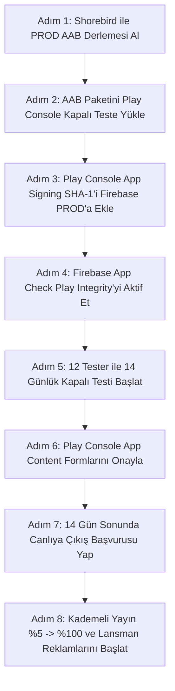

# 🚀 FırsatKolik — Android Production Çıkış, Büyüme ve Master Canlıya Geçiş Yol Haritası

**Hazırlanma Tarihi:** 2026-08-29  
**Kapsam:** Android (Google Play Store) & Uçtan Uca Production Ekosistemi (Mobil, Free Tier VM, Firebase, Cloud Functions, Web Admin)  
**Bütçe Varsayımı:** Reklam/büyüme için aylık 3.000–15.000₺ (Bulut altyapısı: Sıfır Maliyetli Free Tier VM Mimarisi)  
**Pazar Varsayımı:** Yalnızca Türkiye  
**Mevcut Durum:** DEV ve PROD ortamları izole edilmiş, 26 Cloud Function, 21 mağaza kazıma motoru, Kuponlar, Aktüel Kataloglar, 7 kanallı bildirim sistemi ve Free Tier VM bot sunucusu tamamlanmış durumdadır.

---

## 📑 İçindekiler
1. [🌟 Yönetici Özeti ve Kritik Tarih Uyarısı (Android 16 / API 36)](#1--yönetici-özeti-ve-kritik-tarih-uyarısı-android-16--api-36)
2. [📅 Genel Faz Takvimi ve Bağımlılık Matrisi](#2--genel-faz-takvimi-ve-bağımlılık-matrisi)
3. [🏛️ FAZ 1 — Yasal, Kurumsal ve KVKK Temeli](#3-️-faz-1--yasal-kurumsal-ve-kvkk-temeli)
4. [🎨 FAZ 2 — Marka Kimliği, Mağaza Varlıkları ve ASO Temeli](#4--faz-2--marka-kimliği-mağaza-varlıkları-ve-aso-temeli)
5. [⚡ FAZ 3 — Google Cloud & Firebase Production Altyapısı (Sıfır Maliyetli Free Tier VM)](#5-️-faz-3--google-cloud--firebase-production-altyapısı-sıfır-maliyetli-free-tier-vm)
6. [📱 FAZ 4 — Flutter Uygulamasını Production'a Hazırlama & Shorebird Code-Push](#6--faz-4--flutter-uygulamasını-productiona-hazırlama--shorebird-code-push)
7. [🛡️ FAZ 5 — Google Play Console Süreci (Kapalı Test & İnceleme)](#7-️-faz-5--google-play-console-süreci-kapalı-test--i̇nceleme)
8. [📊 FAZ 6 — Canlıya Çıktıktan Sonra İzleme ve Operasyon](#8--faz-6--canlıya-çıktıktan-sonra-i̇zleme-ve-operasyon)
9. [📈 FAZ 7 — Reklam, Büyüme ve Gelir Optimizasyonu](#9--faz-7--reklam-büyüme-ve-gelir-optimizasyonu)
10. [💰 Maliyet Özeti (GCP Sıfır Maliyet Mimarisi & Bütçe Dağılımı)](#10--maliyet-özeti-gcp-sıfır-maliyet-mimarisi--bütçe-dağılımı)
11. [✅ Yayın Öncesi Eksiksiz Master Kontrol Listesi (Production Checklist)](#11--yayın-öncesi-eksiksiz-master-kontrol-listesi-production-checklist)
12. [📋 Kronolojik Önerilen Aksiyon Sırası](#12--kronolojik-önerilen-aksiyon-sırası)

---

## 1. 🌟 Yönetici Özeti ve Kritik Tarih Uyarısı (Android 16 / API 36)

Development aşaması tamamlanmış ve tüm alt modülleri entegre edilmiş bir platformu canlıya (Production) almak; yalnızca bir APK/AAB derlemesi üretmek değil, birbirine bağımlı **beş temel disiplini** eksiksiz ve hatasız yönetmektir:

1. **Yasal & Kurumsal Temel:** Google Play Bireysel/Organizasyon hesabı, KVKK aydınlatma metni, gizlilik politikası ve hesap/veri silme URL'leri.
2. **Sertleştirilmiş Bulut ve Sıfır Maliyetli VM Altyapısı:** GCP Compute Engine Free Tier VM (`telegram-bot-server`), 26 Cloud Function, Firestore/Storage güvenlik kuralları ve App Check (Play Integrity).
3. **Mobil İstemci Kusursuzluğu:** Crashlytics, UMP SDK, Shorebird Code-Push, ProGuard/R8 kuralları, Android 16 (API 36) uyumu ve 8 adımlı spotlight eğitimi.
4. **Modül Canlılık Doğrulamaları:** Fırsat akışı, 7 kanallı bildirim sistemi, 2 sekmeli Kuponlar ve 36 mağazalı Aktüel Kataloglar havuzu.
5. **Google Play Console & Kapalı Test:** 12 test kullanıcısı ile kesintisiz 14 günlük kapalı test ve Veri Güvenliği (Data Safety) formları.

> [!IMPORTANT]
> **Kritik Tarih Uyarısı (Android 16 / API 36 Zorunluluğu):**  
> Google Play politikaları gereğince, Play Store'a gönderilen tüm yeni uygulama ve güncellemelerin **Android 16 (API seviyesi 36)** hedeflemesi zorunludur. `android/app/build.gradle` dosyasındaki `compileSdkVersion` ve `targetSdkVersion` değerleri **36** olarak yapılandırılmış ve doğrulanmıştır.

---

## 2. 📅 Genel Faz Takvimi ve Bağımlılık Matrisi

```mermaid
gantt
    title FırsatKolik Production Çıkış Takvimi
    dateFormat  YYYY-MM-DD
    section Yasal & Kurumsal
    Faz 1: Bireysel Hesap & KVKK/Gizlilik/Silme Web Sayfaları :done, f1, 2026-08-01, 7d
    section Marka & ASO
    Faz 2: İkon, Ekran Görüntüleri, Feature Graphic & ASO Metinleri :active, f2, 2026-08-20, 10d
    section Altyapı & Backend
    Faz 3: Free Tier VM, 26 Cloud Function, Security Rules & App Check :done, f3, 2026-08-05, 10d
    section Mobil Hazırlık
    Faz 4: Crashlytics, UMP, ProGuard, Shorebird AAB & QA :done, f4, 2026-08-15, 10d
    section Play Console
    Faz 5: AAB Yükleme, 12 Tester / 14 Gün Kapalı Test & İnceleme :f5, after f4, 17d
    section Canlı & Büyüme
    Faz 6 & 7: Kademeli Canlı Yayın (%5 -> %100) & UAC / Meta Ads :f6, after f5, 30d
```

| Faz | Kapsam | Tahmini Süre | Durum & Bağımlılık |
| :--- | :--- | :---: | :--- |
| **Faz 1** | Yasal & Kurumsal Temel (Hesap, KVKK, Gizlilik, Silme) | 3–7 Gün | ✅ **Tamamlandı** |
| **Faz 2** | Marka Kimliği, Mağaza Varlıkları & ASO | 5–10 Gün | ⏳ **Varlıklar Hazırlanıyor** |
| **Faz 3** | Cloud & Firebase Prod Altyapısı (Free Tier VM + 26 Functions) | 4–8 Gün | ✅ **Tamamlandı** (Play Integrity bağlantısı Faz 5'te) |
| **Faz 4** | Flutter Uygulamasının Hazırlanması (Shorebird AAB + QA) | 5–10 Gün | ✅ **Tamamlandı** |
| **Faz 5** | Play Console, 12 Tester / 14 Gün Kapalı Test & Onay | 14+3 Gün | 🚀 **Sıradaki Aksiyon** |
| **Faz 6** | Canlı İzleme, Crashlytics, VM Heartbeat & Operasyon | Sürekli | Yayın Sonrası |
| **Faz 7** | Reklam & Büyüme (ASO, Google UAC, Meta Ads, TikTok) | Sürekli | Yayın Sonrası |

---

## 3. 🏛️ FAZ 1 — Yasal, Kurumsal ve KVKK Temeli

### 3.1 Geliştirici Hesabı Türü ve Kimlik Doğrulama
* **Hesap Türü:** Bireysel (Personal) Google Play Console hesabı.
* **Geliştirici E-postası:** `muratcan.gokyokus@gmail.com`
* **Destek E-postası:** `kolikfirsat@gmail.com`
* **Kayıt Ücreti:** 25 USD (tek seferlik ödendi).
* **Kimlik Doğrulama:** 2 Adımlı Doğrulama ve resmi kimlik doğrulaması tamamlandı.

### 3.2 KVKK ve Veri İşleme Uyum Standartları
Uygulama; e-posta/Google OAuth ile kimlik doğrulama, yorum, oylama, cihaz FCM token'ı ve hata logları işlemektedir.
* **Aydınlatma Metni:** İşlenen kişisel veriler (e-posta, FCM token, IP, reklam kimliği vb.) ve üçüncü taraf servisler (Firebase, Google AdMob, Google Gemini API) açıkça tanımlanmıştır.
* **Kullanıcı Onayı:** İlk girişte ve profil ekranında gizlilik politikası bağlantısı sunulmaktadır.

### 3.3 Herkese Açık Yasal Web Sayfaları (Firebase Hosting)
Google Play Developer Program Policy gereği, herkese açık statik URL'ler Firebase Hosting üzerinde canlıya alınmıştır:
* 🔗 **Gizlilik Politikası (Privacy Policy):** [https://sicak-firsatlar-e6eae.web.app/privacy-policy.html](https://sicak-firsatlar-e6eae.web.app/privacy-policy.html) (PROD: `https://firsatkolik-prod-e6eae.web.app/privacy-policy.html`)
* 🔗 **Hesap ve Veri Silme Talebi (Delete Account):** [https://sicak-firsatlar-e6eae.web.app/delete-account.html](https://sicak-firsatlar-e6eae.web.app/delete-account.html) (PROD: `https://firsatkolik-prod-e6eae.web.app/delete-account.html`)

---

## 4. 🎨 FAZ 2 — Marka Kimliği, Mağaza Varlıkları ve ASO Temeli

### 4.1 Gerekli Mağaza Görsel Varlıkları
* **Uygulama İkonu:** 512×512 px, 32-bit PNG (Alfa kanallı). Android için `mipmap` adaptive icon katmanları tanımlı.
* **Öne Çıkan Görsel (Feature Graphic):** 1024×500 px (Mağaza üst banner'ı).
* **Ekran Görüntüleri (Screenshots):** En az 4, önerilen 6–8 adet yüksek çözünürlüklü pazarlama tarzı telefon görseli:
  1. *Anasayfa & Canlı Sıcaklık Akışı (Wilson Algoritması).*
  2. *Yapay Zeka Destekli Fırsat Paylaşımı & Link Önizleme.*
  3. *Kuponlar Modülü (Topluluk & Botkolik Kupon Radarı).*
  4. *Aktüel Broşürler & Kataloglar (36 Mağaza & Pinch-to-Zoom).*
  5. *Fırsat Detayı, Yorumlar & Sıcak/Soğuk Oylama.*
  6. *Avcı Profili, 16+ Başarım Rozeti & Rütbe Seviyeleri.*

### 4.2 ASO (App Store Optimization) Metin Varlıkları
* **Uygulama Başlığı (30 Karakter):** `FırsatKolik: Sıcak Fırsatlar`
* **Kısa Açıklama (80 Karakter):** `En sıcak indirimler, kupon kodları, market aktüel broşürleri ve canlı fırsatlar!`
* **Tam Açıklama (4000 Karakter):** Anahtar kelime zengin (indirim, sıcak fırsatlar, kupon kodu, aktüel katalog, BİM, A101, Trendyol, Hepsiburada, Amazon), maddeli ve akıcı Türkçe metin.

### 4.3 Paket Adı (Application ID) Kesinliği
* **PROD Paket Adı:** `com.firsatkolik.app` (Değiştirilemez kalıcı kimlik).
* **DEV Paket Adı:** `com.sicakfirsatlar.sicak_firsatlar`

---

## 5. ⚡ FAZ 3 — Google Cloud & Firebase Production Altyapısı (Sıfır Maliyetli Free Tier VM)

### 5.1 DEV vs PROD Ortam Matrisi
FırsatKolik ekosistemi iki tamamen izole proje üzerinde çalışır:

| Bileşen | Geliştirme (DEV) | Canlı (PROD) |
| :--- | :--- | :--- |
| **Firebase Proje ID** | `sicak-firsatlar-e6eae` | `firsatkolik-prod-e6eae` |
| **GCP Proje Numarası** | `560592268193` | `228657473310` |
| **Android Paket Adı** | `com.sicakfirsatlar.sicak_firsatlar` | `com.firsatkolik.app` |
| **Flutter Build Flavor** | `--flavor dev --dart-define=FLAVOR=dev` | `--flavor prod --dart-define=FLAVOR=prod` |
| **Bot Barındırma** | Compute Engine VM (`dev-bot` / Port 8081) | Compute Engine VM (`prod-bot` / Port 8082) |
| **Dinlenen Telegram Kanalı**| `@indirimkaplani` | `@firsatkolik_canli` |
| **Web Admin URL** | `https://sicak-firsatlar-e6eae.web.app/admin/` | `https://firsatkolik-prod-e6eae.web.app/admin/` |
| **AdMob Banner Reklam ID** | `ca-app-pub-3940256099942544/6300978111` *(Test)* | `ca-app-pub-6853997017739651/8758625050` *(Gerçek)* |
| **App Check Sağlayıcısı** | Debug Provider (Debug Tokens) | Play Integrity API (Google Play Store) |
| **Android Keystore** | Varsayılan Debug Keystore | `android/app/upload-keystore.jks` (Alias: `upload`) |

---

### 5.2 Google Cloud Free Tier VM Mimarisi (`telegram-bot-server`)
Cloud Run'ın 7/24 dinleme yapması sonucu oluşan aylık ~130$ (4.400 TL) faturalandırma, **Google Cloud Free Tier VM** mimarisiyle tamamen sıfırlanmıştır:

```
                               ┌───────────────────────────────────────────────────────────┐
                               │   GCP Compute Engine Free Tier VM: e2-micro (us-central1) │
                               │   Sunucu Adı: telegram-bot-server  |  Dış IP: 34.135.181.112   │
                               └─────────────────────────────┬─────────────────────────────┘
                                                             │
                                ┌────────────────────────────┴────────────────────────────┐
                                ▼                                                         ▼
                  [ Docker Container: dev-bot ]                             [ Docker Container: prod-bot ]
                  • Host Port: 8081 -> Container: 8080                      • Host Port: 8082 -> Container: 8080
                  • Firestore: sicak-firsatlar-e6eae                        • Firestore: firsatkolik-prod-e6eae
                  • Telegram: @indirimkaplani                               • Telegram: @firsatkolik_canli
                  • Key: dev_firebase_key.json                              • Key: prod_firebase_key.json
                  • Health: http://34.135.181.112:8081/health               • Health: http://34.135.181.112:8082/health
```

* **Deploy Komutu:** `python cloud-run-bot/deploy_to_vm.py prod` (Google Cloud Build üzerinden imaj derlenip VM üzerinde container otomatik güncellenir).
* **Otomatik Başlama (Resilience):** VM yeniden başladığında Docker container'ları `--restart always` politikasıyla otomatik ayağa kalkar.
* **Maliyet Etkisi:** Bot sunucu giderleri **0 TL / 0$**'dır.

---

### 5.3 26 Cloud Function Tam Envanteri ve Tetikleme Sözleşmesi
Backend tarafında `functions/index.js` dosyasında yer alan 26 fonksiyon PROD ortamında aktiftir:

| # | Fonksiyon Adı | Tetikleyici Türü | Görevi |
|---|---|---|---|
| 1 | **`onDealCreated`** | Firestore `deals/{dealId}` (onCreate) | Moderasyon kontrolü, `admin_deals` bildirimi, `matchAndCreateDealNotifications` dağıtımı. |
| 2 | **`onDealUpdated`** | Firestore `deals/{dealId}` (onUpdate) | Onaylanan fırsatların bildirimi, `submission_status` onay/red bildirimi, `isExpired` puan cezası. |
| 3 | **`onCommentCreated`** | Firestore `deals/{id}/comments/{id}` (onCreate) | `commentCount` atomik artırımı, yorum yanıtı (`comment_reply`) bildirimi. |
| 4 | **`onAdminMessageCreated`** | Firestore `adminMessages/{id}` (onCreate) | Yönetici duyurusunu kullanıcının bildirim kutusuna yazma. |
| 5 | **`onUserMessageCreated`** | Firestore `messages/{id}` (onCreate) | Birebir sohbette **Data-Only FCM Payload** iletimi (Aktif sohbette bastırma). |
| 6 | **`onNotificationCreated`** | Firestore `users/{uid}/notifications/{id}` (onCreate) | **Merkezi Push Motoru:** Sistem şalteri, sessiz saatler, hız limiti ve cihaz token kontrolleriyle FCM push atımı. |
| 7 | **`onUserUpdated`** | Firestore `users/{userId}` (onUpdate) | Profil/avatar değiştiğinde fırsat, yorum ve mesajlardaki denormalize verileri batch senkronizasyonu. |
| 8 | **`onUserDeleted`** | Auth `user().onDelete` | Kullanıcı silindiğinde cihaz, bildirim aboneliği ve alt koleksiyonları kalıcı temizleme. |
| 9 | **`resolveShortLink`** | HTTPS Request (`onRequest`) | Kısa linkleri ve yönlendirmeleri App Check korumalı olarak çözme. |
| 10 | **`analyzeProductProxy`** | HTTPS Request (`onRequest`) | Gemini API'ye Secret Manager ve App Check korumalı güvenli proxy sağlama. |
| 11 | **`sendManualNotification`** | HTTPS Callable (`onCall`) | Admin panelinden tüm kullanıcılara veya tekil hedeflere anlık push gönderme. |
| 12 | **`cleanupInvalidTokens`** | HTTPS Callable (`onCall`) | Aktif cihazların FCM geçerliliğini `dryRun: true` ile test edip bayat olanları pasife alma. |
| 13 | **`cleanupExpiredDeals`** | Scheduled Cron (`0 3 * * *` - Gece 03:00) | 48 saati dolan fırsatları `isExpired: true` işaretleme (Soft-Expire). |
| 14 | **`cleanupExpiredDealsManual`** | HTTPS Request (`onRequest`) | 48 saatlik soft-expire işlemini manuel test etme. |
| 15 | **`purgeOldDeals`** | Scheduled Cron (`0 4 * * 0` - Pazar 04:00) | **30 Günlük Derin Temizlik:** 30 günden eski fırsatları, Storage görsellerini ve **tüm kullanıcılardaki (`collectionGroup('notifications')`) 30+ günlük bildirimleri** 400'lük batch parçalarıyla kalıcı silme. |
| 16 | **`purgeOldDealsManual`** | HTTPS Callable (`onCall`) | 30 günlük derin temizliği admin yetkisiyle manuel tetikleme. |
| 17 | **`purgeOldNotificationsManual`**| HTTPS Callable (`onCall`) | Yalnızca 30 günü geçmiş bildirimleri (`collectionGroup`) toplu silme. |
| 18 | **`cleanupOldImages`** | Scheduled Cron (`0 0 * * *` - Gece 00:00) | Storage `deals/` dizinindeki 30+ günlük çöp görselleri temizleme. |
| 19 | **`cleanupOldImagesManual`** | HTTPS Request (`onRequest`) | Storage görsel temizliğini anlık test etme. |
| 20 | **`adminDeleteUser`** | HTTPS Callable (`onCall`) | Admin panelinden kullanıcının Auth ve Firestore verilerini silme. |
| 21 | **`generateTestData`** | HTTPS Callable (`onCall`) | `isTest: true` bayraklı sahte fırsatlar üretme. |
| 22 | **`cleanupTestData`** | HTTPS Callable (`onCall`) | Sahte test verilerini tek işlemle temizleme. |
| 23 | **`scrapeCouponsScheduled`** | Scheduled Cron (`0 4 * * *` - Gece 04:00) | DonanımHaber, Kuponla, Kuponburada kaynaklarından kuponları otonom tarama. |
| 24 | **`scrapeCouponsManual`** | HTTPS Callable (`onCall`) | Kupon kazıma botunu admin panelinden manuel çalıştırma. |
| 25 | **`scrapeCatalogsScheduled`** | Scheduled Cron (`0 3 * * *` - Gece 03:00) | 36 mağazanın Akakçe broşürlerini 5 katmanlı WAF bypass ile tarama. |
| 26 | **`scrapeCatalogsManual`** | HTTPS Callable (`onCall`) | Broşür kazıma botunu admin panelinden manuel çalıştırma. |

* **Deploy Komutu:** `firebase deploy --only functions --project prod`

---

### 5.4 Firestore ve Storage Güvenlik Kuralları & İndeksler
* **`firestore.rules` (RBAC & Field Diffing):**
  - Normal kullanıcılar sadece oy ve sayaçları (`['hotVotes', 'coldVotes', 'commentCount', 'updatedAt']`) güncelleyebilir; fırsat başlığı/fiyatı değiştirilemez.
  - Engellenen kullanıcılar (`blockedUsers/{uid}`) veri yazamaz (`canWrite()`).
  - `collectionGroup('notifications')` sorguları yalnızca `isAdmin()` yetkisine açıktır.
* **`storage.rules` (Görsel Güvenliği):**
  - `deals/{allPaths=**}`: `allow read: if true;` (Mobil uygulama `CachedNetworkImage` ile anonim HTTP GET yapar).
  - `allow write: if request.auth != null;` (Telegram botu ise sunucu tarafında Firebase Admin SDK ile doğrudan yazar).
* **`firestore.indexes.json`:**
  - `notifications.createdAt` için **hem tekil koleksiyon (`COLLECTION_DESC`) hem de toplu temizlik için `COLLECTION_GROUP_ASC/DESC`** indeksleri tanımlanmıştır.
  - `deals`, `messages`, `reports`, `kataloglar`, `kuponlar` bileşik indeksleri tanımlıdır.

* **Deploy Komutu:** `firebase deploy --only firestore,storage --project prod`

---

### 5.5 Akıllı Bildirim ve Push Motoru (FCM HTTP v1 & 7 Android Kanalı)
* **7 Özel Android Bildirim Kanalı:**
  1. `sicak_firsatlar_general_v2` (Genel Fırsatlar & Pazarlama - `#FF6B35`)
  2. `keyword_alerts_channel` (Anahtar Kelime Alarmları - `#FF9800`)
  3. `comment_replies_channel` (Yorum Yanıtları - `#2196F3`)
  4. `messages_channel_v3` (Birebir Sohbet - `#2196F3`)
  5. `admin_messages_channel_v3` (Yönetici Duyuruları - `#FF5722`)
  6. `follow_channel` (Takip Edilen Avcılar - `#4CAF50`)
  7. `admin_channel` (Admin Onay Kuyruğu - `#2196F3`)
* **3 Katmanlı Filtreleme:** Master Switch (`pushMasterEnabled`), Alt Kanallar, Kategori Hız Limiti (Saatte 3, Günde 8) ve Sessiz Saatler (23:00 - 08:00).
* **Bağlamsal İzin Mimarisi:** Açılışta soru penceresi yoktur. 5 doğal eylemde (Arama radarı, kelime ekleme, kategori seçimi, yazar takibi, ayarlar anahtarı) izin istenir.
* **Data-Only Sohbet, Anti-Spam ve Yığınlama (Stacking):**
  - **FCM Collapse Key & APNs ID:** Android'de `collapseKey: "msg_" + senderId`, iOS'ta `apns-collapse-id: "msg_" + senderId` ve `thread-id: "conv_" + senderId`.
  - **İşletim Sistemi Bildirim Yığınlama:** Arka planda `notifId = senderId.hashCode % 100000`, `tag = "msg_$senderId"` ve `onlyAlertOnce: true` ile bildirim çubuğunda tek kart güncellenir.
  - **Gönderici Koruması:** `MessageScreen` 5 saniyede maksimum 3 mesaj sliding-window rate limit uygular.
  - **Cold Start & Instant Seeding:** Uygulama kapalıyken tıklanan bildirimler sıraya alınır (`200ms`); `MessageScreen` açılır açılmaz mesaj ilk karede (`initState`) `_optimisticMessages` içine eklenerek sıfır gecikmeyle açılır.
  - **Aktif Chat Bastırma:** Kullanıcı o an o sohbet ekranındaysa bildirim sessizce bastırılır (`activeChatUserId`).

---

### 5.6 Kuponlar ve Aktüel Kataloglar Modülü Canlı Veri Hazırlığı
* **Kuponlar Modülü:**
  - `scrapeCouponsManual` ile canlı öncesi DonanımHaber, Kuponla ve Kuponburada sitelerinden güncel kupon havuzu oluşturulmalıdır.
  - `settings/app` altında `couponsEnabled: true` değeri doğrulanmalıdır.
  - 3 kademeli Wilson Score sıralaması ve idempotent oy transaction'ları test edilmiştir.
* **Aktüel Kataloglar Modülü:**
  - `scrapeCatalogsManual` ile canlı öncesi 36 zincir market ve kozmetik mağazasının broşürleri çekilmelidir.
  - Sadece aktif broşürü olan mağazalar dinamik listelenir (`AktuelMagazalarPage`).
  - `KatalogShareService` görsel paylaşım motoru test edilmiştir.

---

### 5.7 Web Admin Paneli Production Dağıtımı
* **Hosting URL:** `https://firsatkolik-prod-e6eae.web.app/admin/`
* **Otomatik Ortam Seçimi:** Tarayıcının `hostname` değerine göre PROD Firebase projesine ve callable fonksiyonlara otomatik bağlanır.
* **Admin Yetkilendirmesi (Bootstrap):** Canlıya çıkışta kendi Firebase Auth hesabınızın Firestore `users/{uid}` dokümanına `isAdmin: true` eklenmelidir.
* **Deploy Komutu:** `firebase deploy --only hosting --project prod`

---

## 6. 📱 FAZ 4 — Flutter Uygulamasını Production'a Hazırlama & Shorebird Code-Push

### 6.1 Android 16 (API 36) Hedefleme
`android/app/build.gradle` yapılandırması:
```gradle
android {
    compileSdkVersion 36
    defaultConfig {
        applicationId "com.firsatkolik.app"
        minSdkVersion 23
        targetSdkVersion 36
        versionCode 1
        versionName "1.0.0"
    }
}
```

---

### 6.2 Uygulama İmzalama (Keystore & Play App Signing)
* **Keystore Dosya Yolu:** `android/app/upload-keystore.jks`
* **Store & Key Password:** `firsatkolik2024!`
* **Alias:** `upload`
* **Upload Key SHA-1:** `59:81:22:B5:48:21:79:1D:8C:55:5A:19:0E:C9:D9:76:31:E0:6D:9A`
* **Upload Key SHA-256:** `5E:9E:29:AC:81:63:22:77:B7:C8:EC:91:34:A2:E2:C2:C4:E7:05:EC:F9:FE:1C:56:2D:42:00:64:15:1F:40:2B`

> [!CRITICAL]
> **Google Sign-In İçin Çift SHA-1 Kuralı:**  
> 1. Yukarıdaki **Upload Key SHA-1** parmak izi Firebase Console PROD projesine eklendi.
> 2. AAB paketi Play Console'a yüklendikten sonra **Play Console > Setup > App Integrity > App Signing** sekmesindeki **Google App Signing SHA-1** parmak izi de mutlaka Firebase Console Android uygulamasına eklenmelidir. Aksi halde Play Store'dan indiren kullanıcılarda Google ile Giriş `DEVELOPER_ERROR` verir.

---

### 6.3 Google AdMob & UMP (Consent) SDK Entegrasyonu
* **PROD AdMob App ID:** `ca-app-pub-6853997017739651~8861215767`
* **PROD Banner Reklam ID:** `ca-app-pub-6853997017739651/8758625050`
* **Test Reklam Güvencesi:** `kDebugMode` ve DEV flavor'ında otomatik olarak Google test reklam ID'si (`ca-app-pub-3940256099942544/6300978111`) yüklenir.
* **UMP SDK (KVKK/GDPR):** `main.dart` açılışında `ConsentInformation.instance.requestConsentInfoUpdate` ile kullanıcı rızası toplanır; ardından AdMob başlatılır.

---

### 6.4 Firebase Crashlytics & Performance Monitoring
* `firebase_crashlytics` ve `firebase_performance` paketleri entegredir.
* `FlutterError.onError` ve `PlatformDispatcher.instance.onError` Crashlytics'e bağlanmıştır.

---

### 6.5 Shorebird Live Code-Push (OTA) Entegrasyonu
Canlıdaki Dart/UI ve iş mantığı hatalarını mağaza onayını (24-48 saat) beklemeden anında kullanıcının cebinde düzeltmek için **Shorebird** altyapısı entegre edilmiştir:

```bash
# 1. Google Play Store İçin İlk Release AAB Paketini Derleme
shorebird release android --flavor prod -t lib/main.dart

# 2. Canlıdaki Kullanıcılara Anlık Kod Yaması Gönderme (Mağaza Onaysız)
shorebird patch android --flavor prod -t lib/main.dart
```

---

### 6.6 ProGuard / R8 Kuralları (`proguard-rules.pro`)
`android/app/proguard-rules.pro` dosyası Firebase Auth, Google Sign-In, Firestore, AdMob ve Shorebird yansımalarını koruyacak şekilde yapılandırılmıştır.

---

### 6.7 İnteraktif Uygulama Turu (Spotlight) ve UI Standartları
* 8 adımlı spotlight keşif matrisi (`InAppTutorialService`).
* Alt menü geçişlerinde dikey kilitlenme stabilitesi (Vertical Position Lock).
* Fırsat Paylaş ve Kuponlar ekranlarında canlı 3.5s dönen ışıma animasyonlu Botkolik dikkat kartları (`_BotkolikAnimatedAttentionBanner`, `_BotkolikRadarAnimatedBanner`).
* Saf karanlık mod (`#000000` zemin, `#1E1E1E` kartlar) ve çentikli kutu (Notched Card) tasarımı.

---

## 7. 🛡️ FAZ 5 — Google Play Console Süreci (Kapalı Test & İnceleme)

### 7.1 Play Console Kurulum Adımları
1. **Play Console Giriş:** Bireysel geliştirici hesabına giriş yapılır.
2. **Yeni Uygulama Oluşturma:**
   - Uygulama Adı: `FırsatKolik`
   - Varsayılan Dil: `Türkçe (tr-TR)`
   - Tür: `Uygulama` / Fiyatlandırma: `Ücretsiz`
3. **App Content (Uygulama İçeriği) Formları:**
   - **Gizlilik Politikası:** `https://firsatkolik-prod-e6eae.web.app/privacy-policy.html`
   - **Reklamlar:** *"Evet, uygulamam reklam içeriyor"* seçilir.
   - **Uygulama Erişimi:** *"Tüm işlevler kısıtlama olmadan kullanılabilir"* (veya test hesabı: `test@firsatkolik.com` / `Test1234!`).
   - **İçerik Derecelendirmesi (IARC):** Anket doldurulur (Kullanıcı etkileşimi, yorumlar, e-ticaret).
   - **Hedef Kitle:** 18 yaş ve üzeri (veya 13+). Çocukları hedeflemediği belirtilir.
   - **Haber / Finans:** *"Hayır"* olarak işaretlenir.
   - **Veri Güvenliği (Data Safety):** Toplanan veriler (E-posta, Cihaz ID, Reklam ID, Etkileşimler, Çökme logları) gizlilik politikasıyla birebir uyumlu beyan edilir.
   - **Hesap Silme URL'si:** `https://firsatkolik-prod-e6eae.web.app/delete-account.html`
   - **UGC Raporlama Beyanı:** Uygulama içi şikayet butonlarının (`ReportService` / `reports`) varlığı beyan edilir.

---

### 7.2 Zorunlu Kapalı Test (Closed Testing — 12 Tester / 14 Gün)
* **Kanal:** Play Console > Testing > Closed testing (Kapalı Test).
* **Paket:** Shorebird ile üretilen PROD AAB (`shorebird release android --flavor prod -t lib/main.dart`) yüklenir.
* **Test Kullanıcıları:** En az 12 gerçek Google kullanıcısının e-postası listeye eklenir.
* **Opt-in & 14 Günlük Süreç:**
  1. Google kapalı test sürümünü onaylar (1–3 iş günü).
  2. Kullanıcılar opt-in linkine tıklayarak uygulamayı indirir.
  3. 12 kullanıcının 14 gün boyunca uygulamayı aktif kullanması sağlanır.
* **Production Başvurusu:** 14 gün sonunda form doldurularak doğrudan canlıya çıkış başvurusu yapılır.

---

### 7.3 App Check Play Integrity Bağlantısı (AAB Yüklendikten Sonra)
1. AAB paketi Play Console'a yüklendikten sonra **Play Console > Setup > App Integrity** sayfasına gidin.
2. Firebase PROD projesini (`firsatkolik-prod-e6eae`) Play Integrity ile bağlayın.
3. Firebase Console > App Check sekmesinde Android uygulaması için **Play Integrity** sağlayıcısını aktif edin.

---

## 8. 📊 FAZ 6 — Canlıya Çıktıktan Sonra İzleme ve Operasyon

### 8.1 Kademeli Yayın (Staged Rollout)
İlk canlı sürüm tüm kullanıcılara birden değil, kademeli olarak açılır:
$$\text{\%5} \xrightarrow{\text{24 Saat}} \text{\%20} \xrightarrow{\text{48 Saat}} \text{\%50} \xrightarrow{\text{24 Saat}} \text{\%100}$$
Her aşamada Crashlytics çökme oranları ve Android Vitals ANR değerleri izlenir.

### 8.2 Canlı İzleme & Sağlık Kontrolleri
* **Crash-Free Oranı:** Crashlytics üzerinde `%99.5+` seviyesinde tutulmalıdır.
* **VM Bot Durumu:** `http://34.135.181.112:8082/health` ve Web Admin Dashboard `lastHeartbeat` takip edilir.
* **GCP Bütçe Alarmları:** 500₺, 1.000₺, 2.000₺ bütçe eşikleri e-posta ile izlenir.
* **Shorebird Canlı Yama:** Canlıdaki küçük Dart/UI hataları için `shorebird patch android --flavor prod -t lib/main.dart` kullanılır.

---

## 9. 📈 FAZ 7 — Reklam, Büyüme ve Gelir Optimizasyonu

### 9.1 Bütçe Dağılım Stratejisi (Aylık 3.000–15.000₺)

| Kanal | Bütçe Payı | Strateji ve Görev |
| :--- | :---: | :--- |
| **Google Ads (UAC - App Campaigns)** | **%50–60** | Google Play arama sonuçları, YouTube ve Google Display envanterinde yükleme başı maliyet (CPI) optimizasyonu. |
| **Meta Ads (Instagram / Facebook)** | **%25–30** | "Günün Fırsatı" ve "Kaçırılmayacak İndirimler" video/görsel kreatifleriyle hedef kitleye indirme reklamları. |
| **Telegram & Mikro-Influencer** | **%10–15** | Fırsat/indirim temalı Telegram kanalları ve Instagram sayfalarıyla sponsorlu paylaşımlar. |
| **TikTok Ads** | *Organik Test* | İlk 2 ay organik içeriklerle test edilir, tutan formatlara ücretli bütçe ayrılır. |

### 9.2 Takip Edilecek Temel KPI'lar
* **CPI (Cost Per Install):** Kanal bazlı indirme maliyeti.
* **D1 / D7 / D30 Retention:** Kullanıcıların 1., 7. ve 30. günlerde uygulamaya geri dönme oranı.
* **LTV / CAC Oranı:** Kullanıcıdan kazanılan AdMob reklam gelirinin kullanıcı edinme maliyetine oranı ($LTV > CAC$).
* **eCPM & Fill Rate:** AdMob banner ve interstitial doluluk oranları.

---

## 10. 💰 Maliyet Özeti (GCP Sıfır Maliyet Mimarisi & Bütçe Dağılımı)

### 10.1 Tek Seferlik Maliyetler
| Kalem | Tutar | Not |
| :--- | :---: | :--- |
| **Google Play Console Geliştirici Hesabı** | **25 USD** | Tek seferlik ödendi. |
| **Marka, Logo ve ASO Görselleri** | **0 TL** | Kurum içi / Hazır varlıklar. |
| **Domain & Yasal Sayfalar** | **0 TL** | Firebase Hosting ücretsiz alt alan adı (`web.app`). |

### 10.2 Aylık Operasyonel ve Bulut Maliyetleri
| Servis / Kaynak | Maliyet | Tasarruf Stratejisi & Açıklama |
| :--- | :---: | :--- |
| **Telegram Bot Sunucusu (Compute Engine VM)** | **0 TL ($0.00)** | **GCP Free Tier `e2-micro` makinesi (`telegram-bot-server`) kullanılarak 130$/ay faturadan tamamen kurtulunmuştur.** |
| **Firebase Cloud Functions (26 Fonksiyon)** | **0 TL - ~50 TL** | Blaze Plan ücretsiz kotaları dahilindedir (Ayda 2 milyon çağrı ücretsiz). |
| **Cloud Firestore & Storage** | **0 TL - ~30 TL** | 30 günlük hard-purge ve WebP sıkıştırması sayesinde minimal depolama. |
| **FCM Push Bildirimleri** | **0 TL ($0.00)** | Firebase Cloud Messaging sınırsız ve tamamen ücretsizdir. |
| **Google Gemini API (`gemini-2.0-flash`)** | **~50 - 200 TL** | Sadece Telegram mesajı ve görseli geldikçe token bazlı cüzi ücretlendirme. |
| **Shorebird Code-Push** | **0 TL ($0.00)** | Ayda 5.000 yama indirmesine kadar tamamen ücretsizdir. |
| **Pazarlama / Reklam Bütçesi** | **3.000 - 15.000 TL** | İsteğe bağlı Google UAC ve Meta Ads büyüme bütçesi. |

---

## 11. ✅ Yayın Öncesi Eksiksiz Master Kontrol Listesi (Production Checklist)

### 🛠️ 1. Kod, SDK ve Derleme Kontrolleri
- [x] `compileSdkVersion` ve `targetSdkVersion` = 36 olarak yapılandırıldı.
- [x] `firebase_crashlytics` ve `firebase_performance` entegrasyonu tamamlandı.
- [x] Mobil tarafta hardcoded API anahtarı temizlendi, `analyzeProductProxy` Cloud Function proxy'sine bağlandı.
- [x] AdMob UMP (Consent) SDK kullanıcı rızası akışı kuruldu.
- [x] Debug modda test reklam ID'leri, Release modda gerçek PROD reklam ID'leri (`ca-app-pub-6853...`) dinamikleştirildi.
- [x] `upload-keystore.jks` üretildi, `key.properties` yapılandırıldı, Git'ten dışlandı (`.gitignore`).
- [x] `proguard-rules.pro` kuralları tanımlandı ve release build fiziksel cihazda test edildi.
- [x] `flutter analyze` ile tüm projede **0 Hata (No issues found)** doğrulandı.

### ⚡ 2. Backend, VM ve Bulut Altyapısı Kontrolleri
- [x] Google Compute Engine Free Tier VM (`telegram-bot-server`, `34.135.181.112`) üzerinde `prod-bot` container'ı 7/24 çalışıyor.
- [x] `prod-bot` port 8082 üzerinde `@firsatkolik_canli` kanalını dinliyor, `prod_firebase_key.json` ile PROD Firestore'a yazıyor.
- [x] Health check doğrulandı: `http://34.135.181.112:8082/health` -> `{"status":"ok"}`.
- [x] 26 Cloud Function'ın tamamı PROD ortamına deploy edildi (`firebase deploy --only functions --project prod`).
- [x] Firestore Security Rules (RBAC, `isBlocked()`, Field-level diffing) deploy edildi.
- [x] Firebase Storage Rules (`deals/` herkese açık okuma, admin yazma) deploy edildi.
- [x] Firestore bileşik ve collectionGroup indeksleri (`firestore.indexes.json`) deploy edildi.
- [x] 48 saatlik soft-expire (`cleanupExpiredDeals`) ve 30 günlük hard-purge (`purgeOldDeals`) cron görevleri aktif.
- [x] Web Admin Paneli PROD Hosting'e deploy edildi (`https://firsatkolik-prod-e6eae.web.app/admin/`).
- [x] Kendi kullanıcı hesabınıza PROD Firestore'da `isAdmin: true` yetkisi verildi.

### 🔔 3. Bildirim Sistemi ve Modül Kontrolleri
- [x] 7 Android bildirim kanalı tanımlandı (`initializeLocalNotifications`).
- [x] 5 bağlamsal izin isteme noktası entegre edildi (Açılışta körü körüne pop-up kaldırıldı).
- [x] Data-only birebir sohbet mesajlaşması ve aktif sohbet bildirim bastırması (`activeChatUserId`) test edildi.
- [x] Kuponlar modülü PROD kazıması yapıldı (`scrapeCouponsManual`), `settings/app.couponsEnabled: true` doğrulandı.
- [x] Aktüel Kataloglar modülü PROD kazıması yapıldı (`scrapeCatalogsManual`), 36 mağaza broşürleri çekildi.
- [x] `KatalogShareService` natif görsel indirme ve paylaşım akışı test edildi.
- [x] `AdvertisingComplianceService` ile tüm paylaşımlarda `#tanıtım` yasal ibaresi doğrulandı.
- [x] 8 adımlı Spotlight eğitim turu (`InAppTutorialService`) ve dikey konum sabitlemesi test edildi.

### 🛡️ 4. Google Play Console ve Yasal Kontroller
- [x] Bireysel Google Play Console hesabı açıldı ve kimlik doğrulaması tamamlandı.
- [x] Gizlilik Politikası ve Hesap Silme sayfaları Firebase Hosting üzerinde yayında.
- [x] Play Console Veri Güvenliği (Data Safety), IARC İçerik Derecelendirmesi ve Reklam beyanları hazırlandı.
- [x] Uygulama içi kullanıcı şikayet mekanizması (`reports` koleksiyonu & `ReportService`) doğrulandı.
- [ ] Shorebird ile PROD Release AAB üretildi (`shorebird release android --flavor prod -t lib/main.dart`).
- [ ] Play Console Kapalı Test kanalına AAB yüklendi.
- [ ] Play Console'daki Google App Signing SHA-1 parmak izi Firebase Console PROD projesine eklendi (Google Sign-In için kritik).
- [ ] Firebase App Check üzerinde Play Integrity sağlayıcısı bağlandı.
- [ ] 12 test kullanıcısı ile 14 günlük kesintisiz kapalı test süreci tamamlandı.
- [ ] Canlıya geçiş başvurusu yapıldı ve kademeli yayın (%5 -> %100) başlatıldı.

---

## 12. 📋 Kronolojik Önerilen Aksiyon Sırası



### 🔹 Adım 1: Shorebird ile Production AAB Derlemesini Alın
Terminalden tek komutla Google Play Store'a yüklenecek resmi paketi üretin:
```bash
shorebird release android --flavor prod -t lib/main.dart
```

### 🔹 Adım 2: AAB Paketini Google Play Console'a Yükleyin
1. **Google Play Console > (FırsatKolik) > Testing > Closed testing (Kapalı Test)** sayfasına gidin.
2. Yeni bir sürüm oluşturup derlenen `.aab` paketini yükleyin.

### 🔹 Adım 3: Google App Signing SHA-1 Parmak İzini Firebase'e Ekleyin (ÇOK KRİTİK)
1. **Play Console > Setup > App Integrity > App Signing** sekmesine gidin.
2. **"App signing key certificate"** başlığı altındaki **SHA-1** değerini kopyalayın.
3. **Firebase Console > firsatkolik-prod-e6eae > Proje Ayarları > Genel > Android Uygulaması** altına bu SHA-1 değerini yapıştırın. *(Bu yapılmazsa Play Store'dan indiren kullanıcılarda Google ile Giriş çalışmaz!)*

### 🔹 Adım 4: Firebase App Check Play Integrity Sağlayıcısını Aktif Edin
1. **Play Console > Setup > App Integrity** sayfasından Firebase PROD projesini ilişkilendirin.
2. **Firebase Console > App Check** sekmesinde Android uygulaması için **Play Integrity**'yi etkinleştirin.

### 🔹 Adım 5: 12 Test Kullanıcısı ile 14 Günlük Kapalı Testi Başlatın
1. 12 test kullanıcısının e-postalarını listeye ekleyin.
2. Google kapalı test sürümünü onayladığında (1–3 iş günü) kullanıcılara opt-in linkini iletin.
3. 14 gün boyunca uygulamanın düzenli açılıp test edilmesini sağlayın.

### 🔹 Adım 6: Play Console App Content Formlarını Eksiksiz Onaylayın
Veri Güvenliği, UGC Raporlama, Gizlilik Politikası URL'si (`https://firsatkolik-prod-e6eae.web.app/privacy-policy.html`) ve Hesap Silme URL'si (`https://firsatkolik-prod-e6eae.web.app/delete-account.html`) formlarını kaydedin.

### 🔹 Adım 7: Canlıya Çıkış Başvurusu Yapın (Production Access)
14 günlük süre bittiğinde Play Console üzerinden "Production Başvurusu" yapın.

### 🔹 Adım 8: Kademeli Yayın (%5 ➔ %100) ve Büyüme Lansmanı
Onay geldiğinde kademeli yayını başlatın, Crashlytics ve VM botunu izleyin, Google UAC / Meta Ads kampanyalarıyla kullanıcı büyümesini başlatın! 🚀

---

*FırsatKolik Master Production Roadmap — 2026*