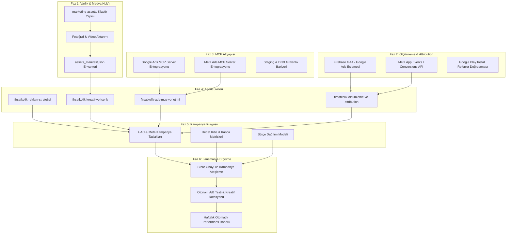

# 🎯 FırsatKolik — Master Reklam, Pazarlama ve Otonom Agent Yol Haritası (End-to-End Marketing & Ads Agent Roadmap)

**Sürüm:** 1.0.0  
**Tarih:** 21 Eylül 2026  
**Hedef Kapsam:** Türkiye Mobil Pazarı, Google Ads (App Campaigns / UAC), Meta Ads (Instagram Reels/Stories/Feed, Facebook), TikTok Ads, ASO ve Otonom AI Agent Orkestrasyonu  
**Hedef Uygulama:** FırsatKolik (`com.firsatkolik.app` - Android & iOS)  
**Nihai Vizyon:** Elinizdeki tüm video/fotoğraf varlıklarını işleyen, Google Ads & Meta MCP araçlarına doğrudan bağlanan, tek bir doğal dil komutuyla ("X bütçeyle en iyi 3 videoyu UAC'ye çık ve A/B testini başlat") tüm pazarlama süreçlerini otonom yöneten **Dünya Standartlarında Reklam & Pazarlama Agent'ı**.

---

## 📑 Master İçindekiler
1. [🌟 Yönetici Özeti ve Nihai Agent Vizyonu](#1--yönetici-özeti-ve-nihai-agent-vizyonu)
2. [🗺️ Uçtan Uca Faz Matrisi ve Bağımlılık Haritası](#2-️-uçtan-uca-faz-matrisi-ve-bağımlılık-haritası)
3. [📁 FAZ 1 — Kreatif Varlık Hub'ı ve Medya Envanteri Altyapısı](#3--faz-1--kreatif-varlık-hubı-ve-medya-envanteri-altyapısı)
4. [📊 FAZ 2 — Ölçümleme, Attribution ve İzleme Altyapısı (GA4 + Meta CAPI)](#4--faz-2--ölçümleme-attribution-ve-i̇zleme-altyapısı-ga4--meta-capi)
5. [🔌 FAZ 3 — MCP (Model Context Protocol) Araçları ve Güvenlik Altyapısı](#5--faz-3--mcp-model-context-protocol-araçları-ve-güvenlik-altyapısı)
6. [🧠 FAZ 4 — Uzmanlaşmış Agent Yetenekleri (Custom Skills Mimarisi)](#6--faz-4--uzmanlaşmış-agent-yetenekleri-custom-skills-mimarisi)
7. [🎯 FAZ 5 — Kampanya Kurguları, Hedef Kitleler ve Bütçe Matrisi](#7--faz-5--kampanya-kurguları-hedef-kitleler-ve-bütçe-matrisi)
8. [🚀 FAZ 6 — Lansman, Canlı Yayın ve Otonom Büyüme Operasyonu](#8--faz-6--lansman-canlı-yayın-ve-otonom-büyüme-operasyonu)
9. [💬 "Tek Komutla Yönetim": Agent Kullanım Senaryoları ve Prompt Rehberi](#9--tek-komutla-yönetim-agent-kullanım-senaryoları-ve-prompt-rehberi)
10. [✅ Adım Adım İlerleme ve Kontrol Listesi (Action Checklist)](#10--adım-adım-i̇lerleme-ve-kontrol-listesi-action-checklist)

---

## 1. 🌟 Yönetici Özeti ve Nihai Agent Vizyonu

### 1.1 Temel Problem ve Çözüm
Geleneksel mobil pazarlama; kreatiflerin elle boyutlandırılması, reklam panellerinde (Google Ads Manager, Meta Ads Manager) saatlerce kampanya ve reklam seti kurulması, bütçelerin manuel takip edilmesi ve metriklerin karmaşık tablolardan okunması gibi ciddi bir operasyonel yük gerektirir.

**FırsatKolik Çözümü:**
Kullanıcı (siz), sadece yerel bilgisayarındaki videoları/fotoğrafları belirlenen klasöre bırakır. Arkada çalışan **FırsatKolik Reklam & Pazarlama Agent'ı**:
1. Kreatifleri otomatik analiz eder, boyutlarına ve içeriklerine göre etiketler (UGC, animasyon, statik banner, indirim odaklı, kupon odaklı vb.).
2. En yüksek dönüşüm getirecek Türkçe reklam kancalarını (hook), başlıkları ve açıklamaları üretir.
3. Google Ads MCP ve Meta Ads MCP köprüleri üzerinden kampanyaları taslak olarak kurar, onayınızla canlıya alır.
4. Firebase Analytics ve Meta Attribution verilerini okuyarak CPI (Yükleme Başı Maliyet), CAC ve retention oranlarını takip eder, bütçeyi kazanan kreatiflere otomatik kaydırır.

### 1.2 Kuzey Yıldızı Metrikleri (North Star Metrics)
* **Hedef CPI (Cost Per Install):** 2.50 TL – 6.00 TL (Türkiye e-ticaret / fırsat dikeyinde optimize edilmiş tavan).
* **D1 / D7 Retention:** D1 > %35, D7 > %15.
* **Affiliate Tıklama Başına Maliyet (CPA):** Her yeni kullanıcının en az 1 mağaza linkine tıklama (`deal_outbound_click`) maliyeti < 8.00 TL.
* **AdMob LTV / CAC:** Kullanıcı yaşam boyu reklam geliri > Kullanıcı edinme maliyeti ($LTV > CAC$).

---

## 2. 🗺️ Uçtan Uca Faz Matrisi ve Bağımlılık Haritası



---

## 3. 📁 FAZ 1 — Kreatif Varlık Hub'ı ve Medya Envanteri Altyapısı

Bu fazın amacı; bilgisayarınızdaki tüm video, fotoğraf, banner ve animasyonları projenin anlayacağı ve MCP araçlarının doğrudan yükleyebileceği standart bir taksonomiye oturtmaktır.

### 3.1 Dizin Yapısı (`marketing-assets/`)
```
marketing-assets/
  ├── MARKETING_ROADMAP.md            <-- (Bu master doküman)
  ├── assets_manifest.json            <-- (Tüm varlıkların indeks ve metadata kataloğu)
  ├── videos/
  │    ├── vertical_9_16/             <-- (1080x1920: Reels, TikTok, Shorts, Stories)
  │    ├── square_1_1/                <-- (1080x1080: Meta Akış, Keşfet)
  │    └── horizontal_16_9/           <-- (1920x1080: YouTube Ads, Display Video)
  ├── images/
  │    ├── store_assets/              <-- (Play Store & App Store Ekran Görüntüleri, Feature Graphic)
  │    ├── meta_banners/              <-- (Story & Feed Statik ve Karusel Görselleri)
  │    └── google_display/            <-- (Responsive Display Banner Boyutları: 300x250, 728x90, 1200x628)
  └── copy_and_hooks/
       ├── hooks_database.md          <-- (İlk 3 saniye kancaları, merak uyandırıcı replikler)
       ├── ad_copy_matrix.md          <-- (Başlık, Açıklama ve CTA varyantları)
       └── audience_personas.md       <-- (Hedef kitle profilleri ve demografi)
```

### 3.2 İsimlendirme Standardı (Naming Convention)
Tüm dosya isimleri Agent tarafından otomatik okunabilir formatta olmalıdır:
* **Format:** `[kategori]_[format]_[konsept]_[v-no].[ext]`
* **Örnekler:**
  * `video_9x16_bim_aktuel_kanca1_v1.mp4`
  * `video_9x16_ugc_trendyol_sepet_v2.mp4`
  * `image_1x1_kupon_radar_tasarruf_v1.png`
  * `image_store_01_anasayfa_wilson_v1.png`

### 3.3 Otomatik Manifest Dosyası (`assets_manifest.json`)
Agent, klasöre yeni dosya eklendiğinde manifest dosyasını günceller:
```json
{
  "assets": [
    {
      "id": "vid_9x16_001",
      "filename": "videos/vertical_9_16/video_9x16_bim_aktuel_kanca1_v1.mp4",
      "aspect_ratio": "9:16",
      "duration_sec": 14.5,
      "type": "video",
      "theme": "aktuel_katalog",
      "hook": "BİM ve A101'e gitmeden önce bunu açmayan pişman!",
      "target_platforms": ["meta_reels", "google_uac", "tiktok"],
      "quality_score": 9.2,
      "status": "ready"
    }
  ]
}
```

---

## 4. 📊 FAZ 2 — Ölçümleme, Attribution ve İzleme Altyapısı (GA4 + Meta CAPI)

Uygulama henüz store'da değilken tamamlanması gereken en kritik aşamadır. Canlıya çıkıldığında harcanan her kuruşun nereye gittiğini bilmek için şu entegrasyonlar kurulur:

### 4.1 Firebase GA4 ve Google Ads Köprüsü
1. **Firebase Projesi:** `firsatkolik-prod-e6eae`.
2. **Google Ads Hesabı ile Bağlantı:** Firebase Console > Proje Ayarları > Entegrasyonlar > **Google Ads** sekmesinden Google Ads Müşteri Numarası (Customer ID) bağlanır.
3. **Dönüşüm Olayları (Conversions):**
   * [`analytics_service.dart`](file:///d:/firsatkolik/lib/services/analytics_service.dart) içindeki şu metrikler Google Ads'e **Conversion (Dönüşüm)** olarak aktarılır:
     - `first_open` (Uygulama Yükleme / Install)
     - `deal_outbound_click` (Mağaza Linki Tıklaması - Temel Gelir Aksiyonu)
     - `coupon_copied` (Kupon Kullanımı)
     - `deal_submitted` (Kullanıcı Tarafından Fırsat Paylaşımı)

### 4.2 Meta App Events & Conversions API (CAPI)
1. **Meta for Developers:** `FırsatKolik` adına yeni bir App ID oluşturulur.
2. **SDK / API Seçimi:**
   * Flutter tarafında `facebook_app_events` paketi veya backend Cloud Function üzerinden **Meta Conversions API for Apps (Server-to-Server)** köprüsü kurulur.
   * Sunucu taraflı CAPI (Cloud Function üzerinden) tercih edilirse; Apple iOS 14.5+ ATT (App Tracking Transparency) kısıtlamalarına takılmadan en yüksek eşleşme oranı sağlanır.

### 4.3 Google Play Install Referrer Doğrulaması
* Kullanıcı reklamdaki linke tıkladığında, Google Play Store'a yönlendirilip indirme gerçekleştiğinde hangi kampanya, reklam seti ve kreatiften geldiğini ileten `play-install-referrer` kütüphanesinin hazırda tutulması.

---

## 5. 🔌 FAZ 3 — MCP (Model Context Protocol) Araçları ve Güvenlik Altyapısı

Agent'ımızın doğrudan Google Ads ve Meta Ads panellerini yönetebilmesi için iki adet resmi MCP sunucusu entegre edilecektir.

### 5.1 Google Ads MCP Server Entegrasyonu
* **Kaynak:** Resmi Google Ads MCP Server (`googleads/google-ads-mcp`).
* **Bağlantı Türü:** Node.js / Python tabanlı yerel process veya `mcp_config.json` köprüsü.
* **Gereken Yetkiler:**
  * `DEVELOPER_TOKEN`: Google Ads API Geliştirici Jetonu.
  * `CLIENT_ID` & `CLIENT_SECRET`: GCP Cloud Console OAuth 2.0 kimlikleri.
  * `REFRESH_TOKEN`: Reklam yöneticisi hesabı izin jetonu.
  * `CUSTOMER_ID`: FırsatKolik Google Ads hesap ID'si (Örn: `123-456-7890`).
* **Agent'a Sağlanan Araçlar (Tools):**
  * `create_app_campaign`: Yeni bir Google UAC kampanyası açma.
  * `update_campaign_budget`: Günlük bütçeyi artırma/azaltma.
  * `upload_ad_assets`: Kreatifleri (video, metin, başlık) Google Ads envanterine yükleme.
  * `get_campaign_performance`: Tıklama, gösterim, CPI, dönüşüm ve harcama raporlarını anlık çekme.

### 5.2 Meta Ads MCP Server Entegrasyonu
* **Kaynak:** Meta Resmi Ads MCP (`mcp.facebook.com/ads`) veya self-hosted `AdKit / GoMarble`.
* **Gereken Yetkiler:**
  * `META_ACCESS_TOKEN`: Sistem Kullanıcısı (System User) 60 günlük veya süresiz token.
  * `AD_ACCOUNT_ID`: `act_XXXXXXXXXXXX`.
  * `APP_ID` & `APP_SECRET`: Meta Developer App kimlikleri.
* **Agent'a Sağlanan Araçlar (Tools):**
  * `create_advantage_app_campaign`: Meta Advantage+ App Install kampanyası açma.
  * `create_ad_creative`: Video/görsel ve reklam metnini eşleyerek reklam oluşturma.
  * `pause_underperforming_ads`: Belirli bir CPI tavanını aşan reklamları otomatik duraklatma.
  * `get_meta_insights`: Yaş, cinsiyet, yerleşim (Reels vs Feed) bazlı performans çekme.

### 5.3 Güvenlik ve Onay Bariyeri (Staging / Human-in-the-Loop)
> [!IMPORTANT]
> **Finansal Güvenlik Protokolü:**  
> Reklam Agent'ı hiçbir zaman sizden habersiz para harcayamaz veya kampanyayı doğrudan `ACTIVE` yapamaz.
> 1. Agent tüm kampanyaları `PAUSED` (Duraklatılmış / Taslak) modunda oluşturur.
> 2. Size şu formatta bir onay kartı sunar:
>    * *"Google Ads üzerinde günlük 250 TL bütçeli, 3 video ve 4 başlıktan oluşan UAC-01 kampanyası hazırlandı. Canlıya almamı onaylıyor musunuz? [Evet / Hayır]"*
> 3. Siz "Evet" veya "Onaylıyorum" dedikten sonra kampanya aktif edilir.

---

## 6. 🧠 FAZ 4 — Uzmanlaşmış Agent Yetenekleri (Custom Skills Mimarisi)

Agent'ın rastgele genel metinler yazmak yerine, FırsatKolik projesinin kimliğini ve Türkiye pazarını çok iyi bilmesi için **4 adet özel Antigravity Skill'i** inşa edilecektir:

```
.agents/skills/
  ├── firsatkolik-reklam-stratejisi/     <-- Bütçe, hedef kitle, CPI modelleri, büyüme taktiği
  ├── firsatkolik-kreatif-ve-icerik/     <-- Kanca (hook) kütüphanesi, UGC kurguları, A/B varyantları
  ├── firsatkolik-ads-mcp-yonetimi/      <-- Google & Meta MCP komut sözleşmeleri, draft onay mekanizması
  └── firsatkolik-aso-ve-magaza/         <-- Store başlığı, kısa açıklama, anahtar kelime ve ekran görüntüleri
```

### 6.1 Skill: `firsatkolik-reklam-stratejisi`
* **İçerik:**
  * Türkiye e-ticaret indirim takvimi (Maaş günleri: Ayın 1'i ve 15'i; Süper Cuma, Efsane Kasım, Okula Dönüş vb.).
  * Bütçe dağılım algoritmaları (Örn: Aylık 10.000 TL için %55 Google UAC, %35 Meta Advantage+, %10 Deneme/Influencer).
  * CPI tavan kuralları (Android için 4.50 TL üzeri harcayan reklam setini durdurma mantığı).

### 6.2 Skill: `firsatkolik-kreatif-ve-icerik`
* **İçerik:**
  * 30+ adet kanıtlanmış Türkçe kanca (Hook):
    - *"Sepetteki fiyatı yarıya indiren o gizli uygulama..."*
    - *"Bunu bilmeyenler marketlere %40 daha fazla ödüyor!"*
    - *"Kupon kodları için 10 site gezmeyi bıraktıran sistem."*
  * Video format yönergeleri (İlk 3 saniye merak, 4-10. saniyeler uygulama ekran kaydı çözümü, 11-15. saniyeler güçlü CTA: "Hemen Ücretsiz İndir").

### 6.3 Skill: `firsatkolik-ads-mcp-yonetimi`
* **İçerik:**
  * Google Ads MCP ve Meta Ads MCP parametre haritaları.
  * Hata yakalama, yetki yenileme ve bütçe sınırlandırma direktifleri.

### 6.4 Skill: `firsatkolik-aso-ve-magaza`
* **İçerik:**
  * Google Play Store ASO kuralları (30 karakter başlık, 80 karakter kısa açıklama, 4000 karakter SEO zengin açıklama).
  * Anahtar kelime yoğunluk analizleri (indirim, aktüel ürünler, kupon kodu, sıcak fırsatlar, BİM, A101, ŞOK).

---

## 7. 🎯 FAZ 5 — Kampanya Kurguları, Hedef Kitleler ve Bütçe Matrisi

### 7.1 Hedef Kitle Personaları (Türkiye Pazarı)
1. **Persona A: Fırsat Avcıları & Kuponcular (18-35 Yaş - Kadın/Erkek)**
   * İlgi Alanları: E-ticaret, İndirim Kuponları, Trendyol, Hepsiburada, Amazon TR, DonanımHaber Sıcak Fırsatlar.
   * Varlık Türü: Kupon kodu kopyalama, sepet indirimi, fiyat düşüş bildirimleri videoları.
2. **Persona B: Süpermarket & Bütçe Yöneticileri (25-55 Yaş - Kadın/Erkek)**
   * İlgi Alanları: BİM, A101, ŞOK, Migros, Aktüel Broşürler, Ev Ekonomisi.
   * Varlık Türü: 36 market broşürü, aktüel kataloglar, pinch-to-zoom ekran kayıtları.
3. **Persona C: Teknoloji & Donanım Meraklıları (18-30 Yaş - Erkek)**
   * İlgi Alanları: Ekran kartları, telefon indirimleri, oyuncu ekipmanları, İtopya, Vatan.
   * Varlık Türü: Wilson popülerlik skoru, hızlı tükenen stok alarmları.

### 7.2 Başlangıç Bütçe Senaryoları
| Senaryo | Aylık Bütçe | Günlük Bütçe | Google UAC Payı | Meta Payı | Beklenen Aylık İndirme (Est. CPI: 4 TL) |
| :--- | :---: | :---: | :---: | :---: | :---: |
| **Giriş / Test** | 3.000 TL | 100 TL | 60 TL (%60) | 40 TL (%40) | ~750 – 1.000 İndirme |
| **Dengeli Büyüme** | 7.500 TL | 250 TL | 150 TL (%60) | 100 TL (%40) | ~1.800 – 2.500 İndirme |
| **Agresif Lansman** | 15.000 TL | 500 TL | 300 TL (%60) | 200 TL (%40) | ~3.800 – 5.000 İndirme |

---

## 8. 🚀 FAZ 6 — Lansman, Canlı Yayın ve Otonom Büyüme Operasyonu

Google Play Console Kapalı Testi (Faz 5) tamamlanıp açık mağaza onayı geldiği anda (Day 0) devreye girecek otonom süreç:

```
[ Store Canlı Onayı ] 
         │
         ▼
[ 1. Gün: Isınma Fazı (Warm-up) ]
  • Düşük bütçeyle (Günde 50-100 TL) Google UAC ve Meta algoritmalarını eğitme
  • Firebase GA4'te ilk organik + reklam yüklemelerinin (installs) doğrulanması
         │
         ▼
[ 3. Gün: Kreatif A/B Testi Elemesi ]
  • En düşük CPI getiren 2 video ve 2 metin belirlenir
  • Yüksek maliyetli (>6 TL CPI) kreatifler Agent tarafından duraklatılır
         │
         ▼
[ 7. Gün: Bütçe Artırma (Scale-up) ]
  • Kazanan kreatiflere bütçe %30 artırılır
  • 12 saatlik yarı ömürlü Wilson skoru yüksek fırsatlar için dinamik push & reklam eşleşmesi
         │
         ▼
[ Sürekli: Kreatif Yıpranma (Fatigue) Takibi ]
  • Bir videonun gösterim sıklığı (frequency) > 2.8 olduğunda Agent uyarır:
    "X videosu yıprandı, klasördeki Y videosunu yayına alalım mı?"
```

---

## 9. 💬 "Tek Komutla Yönetim": Agent Kullanım Senaryoları ve Prompt Rehberi

Tüm bu sistem kurulduğunda sizin Agent ile yapacağınız gerçek konuşma örnekleri:

### Senaryo 1: Yeni Kampanya Başlatma
> **Siz:** *"Elimdeki aktüel katalog videolarıyla Google Ads'te günlük 150 TL bütçeli bir kampanya hazırla."*  
> **Agent:**  
> 1. `firsatkolik-kreatif-ve-icerik` skill'ini çalıştırır.  
> 2. `marketing-assets/videos/vertical_9_16/` altındaki aktüel temalı en iyi 2 videoyu seçer.  
> 3. En yüksek dönüşüm getiren 4 başlık ve 4 açıklama üretir.  
> 4. Google Ads MCP aracılığıyla kampanyayı `PAUSED` modunda oluşturur.  
> 5. Size onay kartı sunar: *"Kampanya taslak olarak oluşturuldu. Bütçe: 150 TL/gün. 2 video, 4 metin bağlandı. Yayına almamı onaylıyor musunuz?"*  
> **Siz:** *"Onaylıyorum."*  
> **Agent:** Kampanyayı aktif eder ve izlemeye başlar.

---

### Senaryo 2: Performans Raporu ve Otomatik Optimizasyon
> **Siz:** *"Son 3 günün reklam performansı nasıl? Kötü gidenleri durdur."*  
> **Agent:**  
> 1. Google Ads ve Meta MCP araçlarıyla anlık veriyi çeker.  
> 2. GA4'ten gelen `deal_outbound_click` verilerini eşleştirir.  
> 3. Yanıt:  
>    * *"Toplam Harcama: 450 TL | İndirme: 118 | Ortalama CPI: 3.81 TL.*  
>    * *`video_9x16_bim_aktuel_v1`: Harika gidiyor (CPI: 2.90 TL).*  
>    * *`video_9x16_sepet_v2`: Hedefin üzerinde kaldı (CPI: 6.80 TL).*  
>    * *Pahalı olan videoyu durdurdum ve bütçesini kazanan aktüel videosuna kaydırdım."*

---

### Senaryo 3: Yeni Kreatif Ekleme ve Rotasyon
> **Siz:** *"Klasöre 2 yeni video attım, bir baksana hangisi daha iyi iş yapar?"*  
> **Agent:**  
> 1. `marketing-assets/` klasörünü tarar.  
> 2. Yeni videoların metadata'sını, sesini ve görsel kurgusunu analiz eder.  
> 3. `assets_manifest.json` dosyasına ekler.  
> 4. *"1. video 9:16 formatında harika bir UGC kancasına sahip ('Sepetteki indirimi kimse bilmiyor'). Meta Reels için çok uygun. 2. video ise Display banner için daha iyi. İlk videoyu A/B testine sokmak ister misiniz?"* der.

---

## 10. ✅ Adım Adım İlerleme ve Kontrol Listesi (Action Checklist)

### 📌 Aşama 1: Temel Altyapı ve Varlıklar (HEMEN BAŞLANACAK)
- [x] `marketing-assets/` dizini ve alt klasörleri oluşturuldu.
- [x] `MARKETING_ROADMAP.md` master yol haritası yazıldı.
- [ ] Bilgisayarınızdaki mevcut reklam video ve fotoğraflarının ilgili alt klasörlere (`videos/`, `images/`) kopyalanması.
- [ ] Agent tarafından `assets_manifest.json` dosyasının ilk envanterinin çıkarılması.

### 📌 Aşama 2: Özel Agent Skillerinin İnşası
- [ ] `.agents/skills/firsatkolik-reklam-stratejisi/SKILL.md` oluşturulması.
- [ ] `.agents/skills/firsatkolik-kreatif-ve-icerik/SKILL.md` oluşturulması.
- [ ] `.agents/skills/firsatkolik-ads-mcp-yonetimi/SKILL.md` oluşturulması.
- [ ] `.agents/skills/firsatkolik-aso-ve-magaza/SKILL.md` oluşturulması.

### 📌 Aşama 3: MCP Bağlantıları ve Ölçümleme
- [ ] Google Cloud Console üzerinde Google Ads API ve OAuth kimliklerinin tanımlanması.
- [ ] Meta Developer Portal üzerinde App ID ve Marketing API Access Token temini.
- [ ] `mcp_config.json` içine Google Ads ve Meta Ads MCP tanımlarının eklenmesi.
- [ ] Firebase Console üzerinde Google Ads hesabının `firsatkolik-prod-e6eae` projesine bağlanması.

### 📌 Aşama 4: Mağaza Hazırlığı (Faz 5 ile Senkronizasyon)
- [ ] Play Store Feature Graphic (1024x500) ve Ekran Görüntülerinin ASO kurallarına göre `images/store_assets/` içine hazırlanması.
- [ ] Play Store başlığı, kısa açıklama ve 4000 karakterlik tam açıklama metinlerinin onaylanması.
- [ ] Shorebird Release AAB paketinin Play Console Kapalı Test kanalına yüklenmesi.

### 📌 Aşama 5: Lansman ve Büyüme
- [ ] Kapalı test sonrası mağaza onayı geldiğinde Google UAC ve Meta kampanyalarının canlıya alınması.
- [ ] Günlük/haftalık otonom performans raporlamasının başlatılması.

---

*FırsatKolik Master Reklam & Pazarlama Agent Yol Haritası — 2026*
