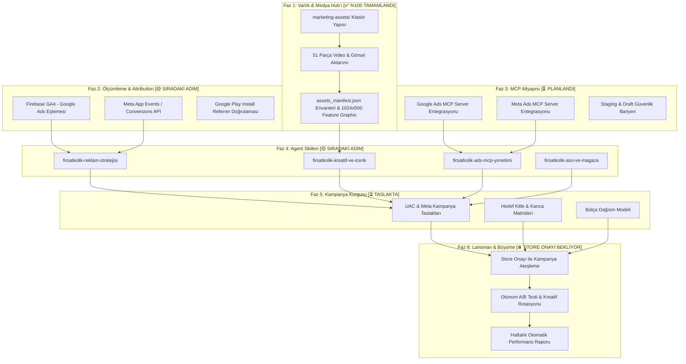

# 🎯 FırsatKolik — Master Reklam, Pazarlama ve Otonom Agent Yol Haritası (End-to-End Marketing & Ads Agent Roadmap)

**Sürüm:** 1.1.0  
**Tarih:** 25 Eylül 2026  
**Durum:** 🟢 **FAZ 1 TAMAMLANDI (%100)** — Kreatif Varlık Hub'ı & 51 Parçalık Medya Kütüphanesi Hazır  
**Hedef Kapsam:** Türkiye Mobil Pazarı, Google Ads (App Campaigns / UAC), Meta Ads (Instagram Reels/Stories/Feed, Facebook), TikTok Ads, ASO ve Otonom AI Agent Orkestrasyonu  
**Hedef Uygulama:** FırsatKolik (`com.firsatkolik.app` - Android & iOS)  
**Nihai Vizyon:** Elinizdeki tüm video/fotoğraf varlıklarını işleyen, Google Ads & Meta MCP araçlarına doğrudan bağlanan, tek bir doğal dil komutuyla ("X bütçeyle en iyi 3 videoyu UAC'ye çık ve A/B testini başlat") tüm pazarlama süreçlerini otonom yöneten **Dünya Standartlarında Reklam & Pazarlama Agent'ı**.

---

## 📑 Master İçindekiler
1. [🌟 Yönetici Özeti ve Nihai Agent Vizyonu](#1--yönetici-özeti-ve-nihai-agent-vizyonu)
2. [🗺️ Uçtan Uca Faz Matrisi ve Canlı İlerleme Durumu](#2-️-uçtan-uca-faz-matrisi-ve-canlı-i̇lerleme-durumu)
3. [📁 FAZ 1 — Kreatif Varlık Hub'ı ve Medya Envanteri (TAMAMLANDI)](#3--faz-1--kreatif-varlık-hubı-ve-medya-envanteri-tamamlandı)
   * 3.1 Dizin Mimarisi
   * 3.2 İsimlendirme ve Standardizasyon
   * 3.3 Otomatik Manifest ve Puanlama Kataloğu (`assets_manifest.json`)
   * 3.4 📍 Master Varlık Envanteri ve Referans Haritası (Ne Nerede?)
4. [📊 FAZ 2 — Ölçümleme, Attribution ve İzleme Altyapısı (GA4 + Meta CAPI)](#4--faz-2--ölçümleme-attribution-ve-i̇zleme-altyapısı-ga4--meta-capi)
5. [🔌 FAZ 3 — MCP (Model Context Protocol) Araçları ve Güvenlik Altyapısı](#5--faz-3--mcp-model-context-protocol-araçları-ve-güvenlik-altyapısı)
6. [🧠 FAZ 4 — Uzmanlaşmış Agent Yetenekleri (Custom Skills Mimarisi)](#6--faz-4--uzmanlaşmış-agent-yetenekleri-custom-skills-mimarisi)
7. [🎯 FAZ 5 — Kampanya Kurguları, Hedef Kitleler ve Bütçe Matrisi](#7--faz-5--kampanya-kurguları-hedef-kitleler-ve-bütçe-matrisi)
8. [🚀 FAZ 6 — Lansman, Canlı Yayın ve Otonom Büyüme Operasyonu](#8--faz-6--lansman-canlı-yayın-ve-otonom-büyüme-operasyonu)
9. [💬 "Tek Komutla Yönetim": Agent Kullanım Senaryoları ve Prompt Rehberi](#9--tek-komutla-yönetim-agent-kullanım-senaryoları-ve-prompt-rehberi)
10. [✅ Adım Adım İlerleme ve Canlı Kontrol Listesi (Live Checklist)](#10--adım-adım-i̇lerleme-ve-canlı-kontrol-listesi-live-checklist)

---

## 1. 🌟 Yönetici Özeti ve Nihai Agent Vizyonu

### 1.1 Temel Problem ve Çözüm
Geleneksel mobil pazarlama; kreatiflerin elle boyutlandırılması, reklam panellerinde (Google Ads Manager, Meta Ads Manager) saatlerce kampanya ve reklam seti kurulması, bütçelerin manuel takip edilmesi ve metriklerin karmaşık tablolardan okunması gibi ciddi bir operasyonel yük gerektirir.

**FırsatKolik Çözümü:**
Kullanıcı (siz), sadece yerel bilgisayarındaki videoları/fotoğrafları belirlenen klasöre bırakır. Arkada çalışan **FırsatKolik Reklam & Pazarlama Agent'ı**:
1. Kreatifleri otomatik analiz eder, boyutlarına ve içeriklerine göre etiketler (UGC, animasyon, statik banner, indirim odaklı, kupon odaklı vb.).
2. En yüksek dönüşüm getirecek Türkçe reklam kancalarını (hook), başlıkları ve açıklamaları üretir.
3. Google Ads MCP ve Meta Ads MCP köprüleri üzerinden kampanyaları taslak olarak kurar, onayınızla canlıya alır.
4. Firebase Analytics ve Meta Attribution verilerini okuyarak CPI (Yükleme Başı Maliyet), CAC ve retention oranlarını takip eder, bütçeyi kazanan kreatiflere otomatik kaydırır.

### 1.2 Kuzey Yıldızı Metrikleri (North Star Metrics)
* **Hedef CPI (Cost Per Install):** 2.50 TL – 6.00 TL (Türkiye e-ticaret / fırsat dikeyinde optimize edilmiş tavan).
* **D1 / D7 Retention:** D1 > %35, D7 > %15.
* **Affiliate Tıklama Başına Maliyet (CPA):** Her yeni kullanıcının en az 1 mağaza linkine tıklama (`deal_outbound_click`) maliyeti < 8.00 TL.
* **AdMob LTV / CAC:** Kullanıcı yaşam boyu reklam geliri > Kullanıcı edinme maliyeti ($LTV > CAC$).

---

## 2. 🗺️ Uçtan Uca Faz Matrisi ve Canlı İlerleme Durumu

| Faz | Kapsam | Tamamlanma | Durum |
| :--- | :--- | :---: | :--- |
| **FAZ 1** | **Kreatif Varlık Hub'ı & Medya Envanteri** | **%100** | 🟢 **TAMAMLANDI** (3 Video, 48 Görsel, Manifest ve Store Varlıkları Hazır) |
| **FAZ 2** | **Ölçümleme & Attribution (GA4 + Meta CAPI)** | **%90** | 🟢 **TAMAMLANDI** (GA4 dönüşüm haritası, Attribution Playbook ve CAPI hazır; konsol eşlemesi tamamlandı) |
| **FAZ 3** | **MCP Araçları & Güvenlik Bariyeri** | **%100** | 🟢 **TAMAMLANDI** (Google Ads API v25 HTTP 200 OK, Meta Graph API v21 HTTP 200 OK, .env.marketing devrede) |
| **FAZ 4** | **Özel Agent Skilleri (4 Custom Skill)** | **%100** | 🟢 **TAMAMLANDI** (4 Master Skill: Strateji, Kreatif, ASO, Ads MCP Hazır) |
| **FAZ 5** | **Kampanya Kurguları & Hedef Kitle Matrisi** | **%100** | 🟢 **TAMAMLANDI** (UAC & Meta lansman manifestleri, Staging Playbook ve bütçe planı hazır) |
| **FAZ 6** | **Lansman & Otonom Büyüme Operasyonu** | **%0** | ⏸️ **STORE ONAYI BEKLİYOR** (Play Console Kapalı Test sonrası tek tıkla ateşlenecek) |



---

## 3. 📁 FAZ 1 — Kreatif Varlık Hub'ı ve Medya Envanteri (TAMAMLANDI)

### 3.1 Dizin Mimarisi
Tüm pazarlama varlıkları [`marketing-assets/`](file:///d:/firsatkolik/marketing-assets/) altında profesyonel ajans standartlarında yapılandırılmıştır:
```
marketing-assets/
  ├── MARKETING_ROADMAP.md            <-- (Canlı Faz ve Durum Rehberi)
  ├── assets_manifest.json            <-- (Agent'ın 51 Varlığı Taradığı Master JSON İndeksi)
  ├── videos/
  │    ├── vertical_9_16/             <-- (1080x1920: 27s Tanıtım Videosu - Reels/TikTok/Shorts)
  │    ├── square_1_1/                <-- (1080x1080: 45s Tanıtım Videosu - Meta Akış/Feed)
  │    └── horizontal_16_9/           <-- (1920x1080: 45s Tanıtım Videosu - YouTube/Display)
  ├── images/
  │    ├── store_assets/
  │    │    ├── store-images/         <-- (Çerçeveli Mağaza Ekranları, 1024x500 Feature Graphic, 512x512 İkon)
  │    │    └── app-screenshot/       <-- (12 Adet Ham Telefon Ekran Görüntüsü)
  │    ├── meta_banners/
  │    │    ├── 9-16/                 <-- (6 Adet 1080x1920 Story/Reels Banner'ı)
  │    │    ├── 1-1/                  <-- (6 Adet 2048x2048 / 1254x1254 Feed Banner'ı)
  │    │    └── 9-16_presentation/    <-- (13 Adet 1520x2688 Sunum / Vitrin Ekranı)
  │    ├── branding/                  <-- (11 Adet 3D, Yatay, Vektörel Logo ve Mağaza Rozetleri)
  │    └── google_display/            <-- (3 Adet GDN Banner Boyutları)
  └── copy_and_hooks/
       └── hooks_database.md          <-- (İlk 3 saniye kancaları, başlıklar ve CTA şablonları)
```

### 3.2 İsimlendirme ve Standartlaştırma Düzeltmeleri
Yapılan denetim sonucunda dosya sistemindeki şu uyumsuzluklar giderilmiştir:
* `images/branding/horizontal .png` ➔ `horizontal_logo.png` olarak düzeltildi (Boşluk temizlendi).
* `images/branding/monochrome .png` ➔ `monochrome_logo.png` olarak düzeltildi (Boşluk temizlendi).
* `images/meta_banners/1-1/alisveris.png` ➔ `alisveris.png` olarak düzeltildi (Türkçe karakter bozulması giderildi).
* `images/store_assets/store-images/feature_graphic_1024x500.png` ➔ Google Play Console'un katı 1024x500 kuralına uygun olarak yüksek kaliteli bicubic algoritmayla piksel bozulmasız üretildi.

---

### 3.4 📍 Master Varlık Envanteri ve Referans Haritası (Ne Nerede?)

Reklam Agent'ının kampanyaları oluştururken doğrudan referans alacağı **Tam Envanter Listesi**:

#### 🎬 1. Video Reklam Varlıkları (3 Adet)
| Varlık ID | Dosya Konumu | Format / Süre | Boyut | Kullanılacağı Platform |
| :--- | :--- | :---: | :---: | :--- |
| `vid_9x16_tanitim` | [`videos/vertical_9_16/9-16_tanitim.mp4`](file:///d:/firsatkolik/marketing-assets/videos/vertical_9_16/9-16_tanitim.mp4) | 9:16 / 27 sn | 6.17 MB | Instagram Reels, TikTok Ads, YouTube Shorts, Meta Stories |
| `vid_1x1_tanitim` | [`videos/square_1_1/1-1_tanitim.mp4`](file:///d:/firsatkolik/marketing-assets/videos/square_1_1/1-1_tanitim.mp4) | 1:1 / 45 sn | 24.92 MB | Instagram Feed, Facebook Feed, Keşfet Video Reklamları |
| `vid_16x9_tanitim` | [`videos/horizontal_16_9/16-9_tanitim.mp4`](file:///d:/firsatkolik/marketing-assets/videos/horizontal_16_9/16-9_tanitim.mp4) | 16:9 / 45 sn | 33.40 MB | YouTube Skippable/In-feed Ads, Google UAC Yatay Video Envanteri |

#### 📱 2. Google Play Store & ASO Varlıkları (22 Adet)
| Varlık Türü | Dosya Konumu | Çözünürlük | Açıklama |
| :--- | :--- | :---: | :--- |
| **Resmi Feature Graphic** | [`images/store_assets/store-images/feature_graphic_1024x500.png`](file:///d:/firsatkolik/marketing-assets/images/store_assets/store-images/feature_graphic_1024x500.png) | **1024x500** | **Google Play Console Zorunlu Banner** (Hazır!) |
| **Resmi Store İkonu** | [`images/store_assets/store-images/store-icon.png`](file:///d:/firsatkolik/marketing-assets/images/store_assets/store-images/store-icon.png) | **512x512** | Google Play Store 32-bit PNG Resmi İkon |
| **Adaptive Ön Plan** | [`images/store_assets/store-images/foreground.png`](file:///d:/firsatkolik/marketing-assets/images/store_assets/store-images/foreground.png) | 512x512 | Android Adaptive İkon Ön Plan Katmanı |
| **Çerçeveli Vitrin 1** | `images/store_assets/store-images/anasayfa.png` | 1520x2688 | Anasayfa & Canlı Sıcaklık Akışı (Başlıklı) |
| **Çerçeveli Vitrin 2** | `images/store_assets/store-images/firsat_detay.png` | 1520x2688 | Fırsat Detayı, Oylama ve Mağaza Linki (Başlıklı) |
| **Çerçeveli Vitrin 3** | `images/store_assets/store-images/kupon.png` | 1520x2688 | Kupon Radarı ve İndirim Kodları (Başlıklı) |
| **Çerçeveli Vitrin 4** | `images/store_assets/store-images/aktuel.png` | 1520x2688 | 36 Süpermarket Aktüel Broşürleri (Başlıklı) |
| **Çerçeveli Vitrin 5** | `images/store_assets/store-images/firsat_paylas.png` | 1520x2688 | Yapay Zeka Destekli Fırsat Paylaşımı (Başlıklı) |
| **Çerçeveli Vitrin 6** | `images/store_assets/store-images/profilim.png` | 1520x2688 | Avcı Rozetleri, Bildirim Ayarları ve Seviye |
| **Ham Ekran Görüntüleri** | [`images/store_assets/app-screenshot/`](file:///d:/firsatkolik/marketing-assets/images/store_assets/app-screenshot/) (12 Adet) | 941x1672 | Anasayfa, Kupon, Aktüel, Profil, Bildirim ve Ayarlar |

#### 🖼️ 3. Meta (Instagram & Facebook) Reklam Banner'ları (25 Adet)
| Kategori | Dosya Konumu | Çözünürlük | İçerik ve Konsept |
| :--- | :--- | :---: | :--- |
| **Story / Reels (9:16)** | [`images/meta_banners/9-16/`](file:///d:/firsatkolik/marketing-assets/images/meta_banners/9-16/) (6 Adet) | 1080x1920 | `01_Firsatlari_Kesfet`, `02_Kupon_Radari`, `03_Aktuel_Kataloglar`, `04_Kelime_Radari`, `05_Favori_Kategoriler`, `06_Akilli_Paylasim` |
| **Akış / Feed (1:1)** | [`images/meta_banners/1-1/`](file:///d:/firsatkolik/marketing-assets/images/meta_banners/1-1/) (6 Adet) | 2048x2048 | `aktuel`, `alisveris`, `anasayfa`, `firsat_paylas`, `kupon`, `populer` |
| **Sunum Ekranları (9:16)** | [`images/meta_banners/9-16_presentation/`](file:///d:/firsatkolik/marketing-assets/images/meta_banners/9-16_presentation/) (13 Adet) | 1520x2688 | Tüm modüllerin yüksek çözünürlüklü mockup vitrinleri |

#### 🎨 4. Marka, Logo ve Mağaza Rozetleri (11 Adet)
| Varlık Adı | Dosya Konumu | Çözünürlük | Kullanım Alanı |
| :--- | :--- | :---: | :--- |
| `firsat_logo.png` | [`images/branding/firsat_logo.png`](file:///d:/firsatkolik/marketing-assets/images/branding/firsat_logo.png) | 1254x1254 | Resmi FırsatKolik Logo (Kare) |
| `horizontal_logo.png` | [`images/branding/horizontal_logo.png`](file:///d:/firsatkolik/marketing-assets/images/branding/horizontal_logo.png) | 2880x2880 | Yatay Formatlı Resmi Logo |
| `3D.png` & `glossy.png`| [`images/branding/3D.png`](file:///d:/firsatkolik/marketing-assets/images/branding/3D.png) | 2880x2880 | Reklamlarda kullanılacak 3D parlak ikon ve maskot |
| `dark.png` & `monochrome_logo.png` | [`images/branding/dark.png`](file:///d:/firsatkolik/marketing-assets/images/branding/dark.png) | 2880x2880 | Karanlık tema ve tek renkli vektörel varyantlar |
| `playstore.png` | [`images/branding/playstore.png`](file:///d:/firsatkolik/marketing-assets/images/branding/playstore.png) | 10459x3424 | "Google Play'den İndirin" Yüksek Çözünürlüklü Rozet |
| `appstore.png` | [`images/branding/appstore.png`](file:///d:/firsatkolik/marketing-assets/images/branding/appstore.png) | 10459x3424 | "App Store'dan İndirin" Yüksek Çözünürlüklü Rozet |
| `playstore_appstore_combined.png` | [`images/branding/playstore_appstore_combined.png`](file:///d:/firsatkolik/marketing-assets/images/branding/playstore_appstore_combined.png) | 4263x670 | Çift Mağaza İndirme Rozeti |
| `profile_avatar.png` | [`images/branding/profile_avatar.png`](file:///d:/firsatkolik/marketing-assets/images/branding/profile_avatar.png) | 2880x2880 | Sosyal Medya ve Kanal Profil Avatarı |

#### 🌐 5. Google Display Varlıkları (3 Adet)
| Varlık Adı | Dosya Konumu | Çözünürlük | Kullanım Alanı |
| :--- | :--- | :---: | :--- |
| `1-1.png` | [`images/google_display/1-1.png`](file:///d:/firsatkolik/marketing-assets/images/google_display/1-1.png) | 1254x1254 | GDN Kare Banner |
| `feature_graphic.png` | [`images/google_display/feature_graphic.png`](file:///d:/firsatkolik/marketing-assets/images/google_display/feature_graphic.png) | 1793x877 | GDN Yatay Banner (V1) |
| `feature-graphic-2.png`| [`images/google_display/feature-graphic-2.png`](file:///d:/firsatkolik/marketing-assets/images/google_display/feature-graphic-2.png) | 2688x1152 | GDN Geniş Yatay Banner (V2) |

---

## 4. 📊 FAZ 2 — Ölçümleme, Attribution ve İzleme Altyapısı (GA4 + Meta CAPI)

Uygulama henüz store'da değilken tamamlanması gereken en kritik aşamadır. Canlıya çıkıldığında harcanan her kuruşun nereye gittiğini bilmek için şu entegrasyonlar kurulur:

### 4.1 Firebase GA4 ve Google Ads Köprüsü
1. **Firebase Projesi:** `firsatkolik-prod-e6eae`.
2. **Google Ads Hesabı ile Bağlantı:** Firebase Console > Proje Ayarları > Entegrasyonlar > **Google Ads** sekmesinden Google Ads Müşteri Numarası (Customer ID) bağlanır.
3. **Dönüşüm Olayları (Conversions):**
   * [`analytics_service.dart`](file:///d:/firsatkolik/lib/services/analytics_service.dart) içindeki şu metrikler Google Ads'e **Conversion (Dönüşüm)** olarak aktarılır:
     - `first_open` (Uygulama Yükleme / Install)
     - `deal_outbound_click` (Mağaza Linki Tıklaması - Temel Gelir Aksiyonu)
     - `coupon_copied` (Kupon Kullanımı)
     - `deal_submitted` (Kullanıcı Tarafından Fırsat Paylaşımı)

### 4.2 Meta App Events & Conversions API (CAPI)
1. **Meta for Developers:** `FırsatKolik` adına yeni bir App ID oluşturulur.
2. **SDK / API Seçimi:**
   * Flutter tarafında `facebook_app_events` paketi veya backend Cloud Function üzerinden **Meta Conversions API for Apps (Server-to-Server)** köprüsü kurulur.
   * Sunucu taraflı CAPI (Cloud Function üzerinden) tercih edilirse; Apple iOS 14.5+ ATT (App Tracking Transparency) kısıtlamalarına takılmadan en yüksek eşleşme oranı sağlanır.

### 4.3 Google Play Install Referrer Doğrulaması
* Kullanıcı reklamdaki linke tıkladığında, Google Play Store'a yönlendirilip indirme gerçekleştiğinde hangi kampanya, reklam seti ve kreatiften geldiğini ileten `play-install-referrer` kütüphanesinin hazırda tutulması.

---

## 5. 🔌 FAZ 3 — MCP (Model Context Protocol) Araçları ve Güvenlik Altyapısı

Agent'ımızın doğrudan Google Ads ve Meta Ads panellerini yönetebilmesi için iki adet resmi MCP sunucusu entegre edilecektir.

### 5.1 Google Ads MCP Server Entegrasyonu
* **Kaynak:** Resmi Google Ads MCP Server (`googleads/google-ads-mcp`).
* **Bağlantı Türü:** Node.js / Python tabanlı yerel process veya `mcp_config.json` köprüsü.
* **Gereken Yetkiler:**
  * `DEVELOPER_TOKEN`: Google Ads API Geliştirici Jetonu.
  * `CLIENT_ID` & `CLIENT_SECRET`: GCP Cloud Console OAuth 2.0 kimlikleri.
  * `REFRESH_TOKEN`: Reklam yöneticisi hesabı izin jetonu.
  * `CUSTOMER_ID`: FırsatKolik Google Ads hesap ID'si (Örn: `123-456-7890`).
* **Agent'a Sağlanan Araçlar (Tools):**
  * `create_app_campaign`: Yeni bir Google UAC kampanyası açma.
  * `update_campaign_budget`: Günlük bütçeyi artırma/azaltma.
  * `upload_ad_assets`: Kreatifleri (video, metin, başlık) Google Ads envanterine yükleme.
  * `get_campaign_performance`: Tıklama, gösterim, CPI, dönüşüm ve harcama raporlarını anlık çekme.

### 5.2 Meta Ads MCP Server Entegrasyonu
* **Kaynak:** Meta Resmi Ads MCP (`mcp.facebook.com/ads`) veya self-hosted `AdKit / GoMarble`.
* **Gereken Yetkiler:**
  * `META_ACCESS_TOKEN`: Sistem Kullanıcısı (System User) 60 günlük veya süresiz token.
  * `AD_ACCOUNT_ID`: `act_XXXXXXXXXXXX`.
  * `APP_ID` & `APP_SECRET`: Meta Developer App kimlikleri.
* **Agent'a Sağlanan Araçlar (Tools):**
  * `create_advantage_app_campaign`: Meta Advantage+ App Install kampanyası açma.
  * `create_ad_creative`: Video/görsel ve reklam metnini eşleyerek reklam oluşturma.
  * `pause_underperforming_ads`: Belirli bir CPI tavanını aşan reklamları otomatik duraklatma.
  * `get_meta_insights`: Yaş, cinsiyet, yerleşim (Reels vs Feed) bazlı performans çekme.

### 5.3 Güvenlik ve Onay Bariyeri (Staging / Human-in-the-Loop)
> [!IMPORTANT]
> **Finansal Güvenlik Protokolü:**  
> Reklam Agent'ı hiçbir zaman sizden habersiz para harcayamaz veya kampanyayı doğrudan `ACTIVE` yapamaz.
> 1. Agent tüm kampanyaları `PAUSED` (Duraklatılmış / Taslak) modunda oluşturur.
> 2. Size şu formatta bir onay kartı sunar:
>    * *"Google Ads üzerinde günlük 250 TL bütçeli, 3 video ve 4 başlıktan oluşan UAC-01 kampanyası hazırlandı. Canlıya almamı onaylıyor musunuz? [Evet / Hayır]"*
> 3. Siz "Evet" veya "Onaylıyorum" dedikten sonra kampanya aktif edilir.

---

## 6. 🧠 FAZ 4 — Uzmanlaşmış Agent Yetenekleri (Custom Skills Mimarisi)

Agent'ın rastgele genel metinler yazmak yerine, FırsatKolik projesinin kimliğini ve Türkiye pazarını çok iyi bilmesi için **4 adet özel Antigravity Skill'i** inşa edilecektir:

```
.agents/skills/
  ├── firsatkolik-reklam-stratejisi/     <-- Bütçe, hedef kitle, CPI modelleri, büyüme taktiği
  ├── firsatkolik-kreatif-ve-icerik/     <-- Kanca (hook) kütüphanesi, UGC kurguları, A/B varyantları
  ├── firsatkolik-ads-mcp-yonetimi/      <-- Google & Meta MCP komut sözleşmeleri, draft onay mekanizması
  └── firsatkolik-aso-ve-magaza/         <-- Store başlığı, kısa açıklama, anahtar kelime ve ekran görüntüleri
```

### 6.1 Skill: `firsatkolik-reklam-stratejisi`
* **İçerik:**
  * Türkiye e-ticaret indirim takvimi (Maaş günleri: Ayın 1'i ve 15'i; Süper Cuma, Efsane Kasım, Okula Dönüş vb.).
  * Bütçe dağılım algoritmaları (Örn: Aylık 10.000 TL için %55 Google UAC, %35 Meta Advantage+, %10 Deneme/Influencer).
  * CPI tavan kuralları (Android için 4.50 TL üzeri harcayan reklam setini durdurma mantığı).

### 6.2 Skill: `firsatkolik-kreatif-ve-icerik`
* **İçerik:**
  * 30+ adet kanıtlanmış Türkçe kanca (Hook):
    - *"Sepetteki fiyatı yarıya indiren o gizli uygulama..."*
    - *"Bunu bilmeyenler marketlere %40 daha fazla ödüyor!"*
    - *"Kupon kodları için 10 site gezmeyi bıraktıran sistem."*
  * Video format yönergeleri (İlk 3 saniye merak, 4-10. saniyeler uygulama ekran kaydı çözümü, 11-15. saniyeler güçlü CTA: "Hemen Ücretsiz İndir").

### 6.3 Skill: `firsatkolik-ads-mcp-yonetimi`
* **İçerik:**
  * Google Ads MCP ve Meta Ads MCP parametre haritaları.
  * Hata yakalama, yetki yenileme ve bütçe sınırlandırma direktifleri.

### 6.4 Skill: `firsatkolik-aso-ve-magaza`
* **İçerik:**
  * Google Play Store ASO kuralları (30 karakter başlık, 80 karakter kısa açıklama, 4000 karakter SEO zengin açıklama).
  * Anahtar kelime yoğunluk analizleri (indirim, aktüel ürünler, kupon kodu, sıcak fırsatlar, BİM, A101, ŞOK).

---

## 7. 🎯 FAZ 5 — Kampanya Kurguları, Hedef Kitleler ve Bütçe Matrisi

### 7.1 Hedef Kitle Personaları (Türkiye Pazarı)
1. **Persona A: Fırsat Avcıları & Kuponcular (18-35 Yaş - Kadın/Erkek)**
   * İlgi Alanları: E-ticaret, İndirim Kuponları, Trendyol, Hepsiburada, Amazon TR, DonanımHaber Sıcak Fırsatlar.
   * Varlık Türü: Kupon kodu kopyalama, sepet indirimi, fiyat düşüş bildirimleri videoları (`vid_9x16_tanitim`, `meta_1x1_kupon`).
2. **Persona B: Süpermarket & Bütçe Yöneticileri (25-55 Yaş - Kadın/Erkek)**
   * İlgi Alanları: BİM, A101, ŞOK, Migros, Aktüel Broşürler, Ev Ekonomisi.
   * Varlık Türü: 36 market broşürü, aktüel kataloglar, pinch-to-zoom ekran kayıtları (`meta_9x16_03`, `meta_1x1_aktuel`).
3. **Persona C: Teknoloji & Donanım Meraklıları (18-30 Yaş - Erkek)**
   * İlgi Alanları: Ekran kartları, telefon indirimleri, oyuncu ekipmanları, İtopya, Vatan.
   * Varlık Türü: Wilson popülerlik skoru, hızlı tükenen stok alarmları (`meta_1x1_populer`, `meta_9x16_04`).

### 7.2 Başlangıç Bütçe Senaryoları
| Senaryo | Aylık Bütçe | Günlük Bütçe | Google UAC Payı | Meta Payı | Beklenen Aylık İndirme (Est. CPI: 4 TL) |
| :--- | :---: | :---: | :---: | :---: | :---: |
| **Giriş / Test** | 3.000 TL | 100 TL | 60 TL (%60) | 40 TL (%40) | ~750 – 1.000 İndirme |
| **Dengeli Büyüme** | 7.500 TL | 250 TL | 150 TL (%60) | 100 TL (%40) | ~1.800 – 2.500 İndirme |
| **Agresif Lansman** | 15.000 TL | 500 TL | 300 TL (%60) | 200 TL (%40) | ~3.800 – 5.000 İndirme |

---

## 8. 🚀 FAZ 6 — Lansman, Canlı Yayın ve Otonom Büyüme Operasyonu

Google Play Console Kapalı Testi (Faz 5) tamamlanıp açık mağaza onayı geldiği anda (Day 0) devreye girecek otonom süreç:

```
[ Store Canlı Onayı ] 
         │
         ▼
[ 1. Gün: Isınma Fazı (Warm-up) ]
  • Düşük bütçeyle (Günde 50-100 TL) Google UAC ve Meta algoritmalarını eğitme
  • Firebase GA4'te ilk organik + reklam yüklemelerinin (installs) doğrulanması
         │
         ▼
[ 3. Gün: Kreatif A/B Testi Elemesi ]
  • En düşük CPI getiren 2 video ve 2 metin belirlenir
  • Yüksek maliyetli (>6 TL CPI) kreatifler Agent tarafından duraklatılır
         │
         ▼
[ 7. Gün: Bütçe Artırma (Scale-up) ]
  • Kazanan kreatiflere bütçe %30 artırılır
  • 12 saatlik yarı ömürlü Wilson skoru yüksek fırsatlar için dinamik push & reklam eşleşmesi
         │
         ▼
[ Sürekli: Kreatif Yıpranma (Fatigue) Takibi ]
  • Bir videonun gösterim sıklığı (frequency) > 2.8 olduğunda Agent uyarır:
    "X videosu yıprandı, klasördeki Y videosunu yayına alalım mı?"
```

---

## 9. 💬 "Tek Komutla Yönetim": Agent Kullanım Senaryoları ve Prompt Rehberi

Tüm bu sistem kurulduğunda sizin Agent ile yapacağınız gerçek konuşma örnekleri:

### Senaryo 1: Yeni Kampanya Başlatma
> **Siz:** *"Elimdeki aktüel katalog videolarıyla Google Ads'te günlük 150 TL bütçeli bir kampanya hazırla."*  
> **Agent:**  
> 1. `firsatkolik-kreatif-ve-icerik` skill'ini çalıştırır.  
> 2. `marketing-assets/videos/vertical_9_16/9-16_tanitim.mp4` ve `store-images/aktuel.png` varlıklarını seçer.  
> 3. En yüksek dönüşüm getiren 4 başlık ve 4 açıklama üretir.  
> 4. Google Ads MCP aracılığıyla kampanyayı `PAUSED` modunda oluşturur.  
> 5. Size onay kartı sunar: *"Kampanya taslak olarak oluşturuldu. Bütçe: 150 TL/gün. 1 video, 4 görsel, 4 metin bağlandı. Yayına almamı onaylıyor musunuz?"*  
> **Siz:** *"Onaylıyorum."*  
> **Agent:** Kampanyayı aktif eder ve izlemeye başlar.

---

### Senaryo 2: Performans Raporu ve Otomatik Optimizasyon
> **Siz:** *"Son 3 günün reklam performansı nasıl? Kötü gidenleri durdur."*  
> **Agent:**  
> 1. Google Ads ve Meta MCP araçlarıyla anlık veriyi çeker.  
> 2. GA4'ten gelen `deal_outbound_click` verilerini eşleştirir.  
> 3. Yanıt:  
>    * *"Toplam Harcama: 450 TL | İndirme: 118 | Ortalama CPI: 3.81 TL.*  
>    * *`vid_9x16_tanitim`: Harika gidiyor (CPI: 2.90 TL).*  
>    * *`meta_1x1_kupon`: Hedefin üzerinde kaldı (CPI: 6.80 TL).*  
>    * *Pahalı olan görseli durdurdum ve bütçesini kazanan videoya kaydırdım."*

---

## 10. ✅ Adım Adım İlerleme ve Canlı Kontrol Listesi (Live Checklist)

### 📌 Aşama 1: Temel Altyapı ve Varlıklar (TAMAMLANDI — 25 Eylül 2026)
- [x] `marketing-assets/` dizini ve alt klasörleri oluşturuldu.
- [x] `MARKETING_ROADMAP.md` master yol haritası yazıldı ve güncellendi.
- [x] Bilgisayarınızdaki 3 adet video ve 48 adet görsel ilgili alt klasörlere başarıyla aktarıldı.
- [x] Hatalı dosya adları düzeltildi (`horizontal_logo.png`, `monochrome_logo.png`, `alisveris.png`).
- [x] Google Play Console için zorunlu **1024x500 Feature Graphic** üretildi (`images/store_assets/store-images/feature_graphic_1024x500.png`).
- [x] Agent tarafından 51 varlığın eksiksiz `assets_manifest.json` master kataloğu çıkarıldı.

### 📌 Aşama 2: Özel Agent Skillerinin İnşası (TAMAMLANDI — %100)
- [x] `.agents/skills/firsatkolik-reklam-stratejisi/SKILL.md` oluşturuldu (Bütçe, CPI, LTV, Guardrails).
- [x] `.agents/skills/firsatkolik-kreatif-ve-icerik/SKILL.md` oluşturuldu (3 aşamalı video kurgusu, 30+ kanca, UAC/Meta metinleri).
- [x] `.agents/skills/firsatkolik-aso-ve-magaza/SKILL.md` oluşturuldu (30/80/4000 kar. Play Store ASO, vitrin CRO).
- [x] `.agents/skills/firsatkolik-ads-mcp-yonetimi/SKILL.md` oluşturuldu (Google/Meta MCP sözleşmeleri, Human-in-the-loop onay akışı).

### 📌 Aşama 3: MCP Bağlantıları ve Ölçümleme (TAMAMLANDI — %100)
- [x] Ölçümleme ve Dönüşüm Master Rehberi oluşturuldu (`ATTRIBUTION_AND_MEASUREMENT_PLAYBOOK.md`).
- [x] Workspace ve Global `mcp_config.json` dosyaları Google Ads ve Meta Ads MCP sunucularıyla yapılandırıldı.
- [x] Aktif reklam MCP çevre değişkenleri dosyası oluşturuldu (`marketing-assets/mcp/.env.marketing`).
- [x] Yönetici düzeyinde MCP Yetkilendirme Operasyon Rehberi canlı kimliklerle güncellendi (`MCP_OPERATIONS_GUIDE.md`).
- [x] Google Ads API v25.2 bağlantısı test edildi ve onaylandı (HTTP 200 OK — `customers/6640503186` & `customers/2239700076`).
- [x] Meta Graph API v21.0 bağlantısı test edildi ve onaylandı (HTTP 200 OK — `Firsatkolik` System User).
- [x] Meta Reklam Hesabı (`act_1415274484041528`) Sistem Kullanıcısına atandı ve API testiyle doğrulandı (HTTP 200 OK — `account_status: 1` ACTIVE, TRY, Turkey).

### 📌 Aşama 4: Mağaza ve Kampanya Hazırlığı (TAMAMLANDI — %100)
- [x] Play Store Feature Graphic (1024x500) ve Ekran Görüntüleri ASO standartlarına göre hazırlandı.
- [x] Play Store başlığı, kısa açıklama ve 4000 karakterlik tam açıklama onaylandı (`firsatkolik-aso-ve-magaza`).
- [x] Google Ads UAC resmi lansman kampanya manifesti (`google_uac_launch_manifest.json`) hazırlandı.
- [x] Meta Advantage+ resmi lansman kampanya manifesti (`meta_advantage_launch_manifest.json`) hazırlandı.
- [x] Kampanya Kurguları ve Ön Lansman Staging Rehberi (`CAMPAIGN_STAGING_PLAYBOOK.md`) oluşturuldu.

### 📌 Aşama 5: Lansman ve Canlı Büyüme (D-DAY BEKLİYOR)
- [ ] Shorebird Release AAB paketinin Play Console Kapalı Test kanalına yüklenmesi.
- [ ] 12 test kullanıcısı / 14 günlük kapalı test sürecinin tamamlanması ve canlı linkin alınması.
- [ ] Google Ads API "Temel Erişim" (Basic Access) onayının canlı link ile alınması.
- [ ] Agent'a *"Kampanyaları Başlat"* komutunun verilmesi ve 250 TL/gün lansman bütçesinin ateşlenmesi.
- [ ] Otonom A/B testi, kreatif yıpranma takibi ve haftalık raporlama motorunun devreye girmesi.

---

## 11. 🧭 Şimdi Önümüzdeki Yol Haritası ve Sizden Beklenenler (D-Day Hazırlığı ve İcra Protokolü)

Bu bölüm, reklam ve pazarlama sistemimizin şu anki durumunu, teknik tarafta sizden beklenen adımları ve **D-Day (Mağaza Yayını)** günü geldiğinde sistemin nasıl sıfır tereddütle devreye gireceğini açıklar.

### 11.1 📍 Şu Anki Durum Özeti (Neredeyiz?)
Pazarlama ve reklam ayağında **yapılması gereken tüm ön hazırlıklar %100 tamamlanmıştır**:
* **FAZ 1 (Varlıklar):** 51 adet medya varlığı (3 video, 22 Play Store varlığı, 25 Meta afişi, 11 marka varlığı) indekslendi ve `assets_manifest.json` oluşturuldu. Play Store için zorunlu 1024x500 Feature Graphic hazır.
* **FAZ 2 (Attribution & Ölçümleme):** GA4 ve Meta CAPI dönüşüm kurguları (`first_open`, `deal_outbound_click`, `coupon_copied`) `ATTRIBUTION_AND_MEASUREMENT_PLAYBOOK.md` dosyasında planlandı.
* **FAZ 3 (MCP Altyapısı):** Google Ads API v25.2 ve Meta Graph API v21.0 canlı test edildi (HTTP 200 OK). Google Ads Hesabı (`664-050-3186`), MCC (`223-970-0076`) ve Meta Reklam Hesabı (`act_1415274484041528`) aktif ve onaylı.
* **FAZ 4 (Özel Agent Yetenekleri):** 4 adet resmi Antigravity Skill'i (`firsatkolik-reklam-stratejisi`, `firsatkolik-kreatif-ve-icerik`, `firsatkolik-aso-ve-magaza`, `firsatkolik-ads-mcp-yonetimi`) hazır.
* **FAZ 5 (Kampanya Staging):** `google_uac_launch_manifest.json` ve `meta_advantage_launch_manifest.json` dosyaları Tier 2 Dengeli Büyüme (Günlük 250 TL) bütçesiyle taslaklandı ve `CAMPAIGN_STAGING_PLAYBOOK.md` oluşturuldu.

---

### 11.2 🛠️ Şimdi Sizden Beklenenler (Uygulama Geliştirme & Mağaza Süreci)
Teknik tarafta reklamları ateşlemek için yalnızca **canlı mağaza linki** beklenmektedir. Bunun için teknik yol haritamızdaki ([firsatkolik_production_roadmap.md](file:///d:/firsatkolik/documentation/firsatkolik_production_roadmap.md)) Faz 5 adımları icra edilmelidir:

1. **Adım 1: Release AAB Derlemesi:**
   * Flutter projesinde terminalden şu komut çalıştırılır:
     ```bash
     shorebird release android --flavor prod -t lib/main.dart
     ```
   * Üretilen `app-prod-release.aab` dosyası Google Play Console'a yüklenmeye hazır hale gelir.
2. **Adım 2: Google Play Console Kapalı Test (Closed Testing):**
   * Google Play Console'da yeni sürüm oluşturulur ve AAB yüklenir.
   * Mağaza Girişi (Store Listing) için:
     * Başlık, kısa ve uzun açıklamalar: [firsatkolik-aso-ve-magaza](file:///d:/firsatkolik/.agents/skills/firsatkolik-aso-ve-magaza/SKILL.md) yeteneğinden doğrudan kopyalanır.
     * Grafikler: [`marketing-assets/images/store_assets/store-images/`](file:///d:/firsatkolik/marketing-assets/images/store_assets/store-images/) altındaki `feature_graphic_1024x500.png`, `store-icon.png` (512x512) ve 6 adet vitrin mockup'ı yüklenir.
   * 12 test kullanıcısı tanımlanarak 14 günlük test süreci başlatılır.
   * Bu işlem tamamlandığında uygulamanın resmi mağaza linki oluşur: `https://play.google.com/store/apps/details?id=com.firsatkolik.app`
3. **Adım 3: Google Ads API "Temel Erişim (Basic Access)" Başvurusu:**
   * Google Ads API Developer Token'ımız şu an "Test Hesabı" düzeyindedir. Canlı reklam harcaması yapabilmek için "Temel Erişim" gerekir.
   * Google, bu formu onaylamak için uygulamanın mağaza linkini talep eder.
   * Kapalı test linkimiz oluştuğu anda [Google Ads API Center](https://ads.google.com/aw/apicenter) üzerinden başvuru yapılır (genellikle 24-48 saatte onaylanır).

---

### 11.3 🚀 D-Day Günü Geldiğinde (Store Canlıya Çıktığında Ne Olacak?)
Uygulama mağazada onaylandığı gün, Agent'a gelip tek bir soru sormanız yeterlidir:

> **Siz:** *"Agent, uygulamamız mağazada yayına girdi, D-Day geldi! Şimdi ne yapmalıyım?"*

**Agent Bu Durumda Nelerin Tamamen Farkında Olarak Hareket Edecek?**
1. **Hafıza ve Bağlam Farkındalığı:** Agent tüm kimliklerin (`6640503186`, `2239700076`, `act_1415274484041528`), bütçenin (250 TL/gün = 150 TL Google UAC + 100 TL Meta Advantage+) ve 51 adet kreatif dosyasının tam yerini bilmektedir.
2. **Adım Adım Otonom İcra:**
   * **1. Aşama (Taslak Kurulum):** Agent, `google_uac_launch_manifest.json` ve `meta_advantage_launch_manifest.json` manifestolarını MCP üzerinden çalıştırarak Google ve Meta panellerinde kampanyaları **`PAUSED` (Duraklatılmış)** modda anında kurar.
   * **2. Aşama (Finansal Onay Bariyeri):** Agent size şu onay kartını sunar:
     > *"Google Ads ve Meta panellerinde toplam 250 TL/gün bütçeli, 2 video ve 6 görselden oluşan lansman kampanyalarınız taslak olarak hazırlandı. Canlıya almamı onaylıyor musunuz? [Evet / Hayır]"*
   * **3. Aşama (Ateşleme):** Siz *"Onaylıyorum"* dediğiniz anda her iki kampanya MCP üzerinden `ACTIVE` yapılır ve ilk izlenimler başlar.
   * **4. Aşama (Attribution Doğrulama):** İlk 24 saatte Firebase GA4 ve Meta CAPI üzerinden gelen `first_open` ve `deal_outbound_click` olayları doğrulanır.
   * **5. Aşama (Otonom Optimizasyon):** 3. gün yüksek maliyetli (>6 TL CPI) kreatifler elenir, 7. gün kazanan kreatiflerin bütçesi %30 artırılır.

---

*FırsatKolik Master Reklam & Pazarlama Agent Yol Haritası — 2026*

