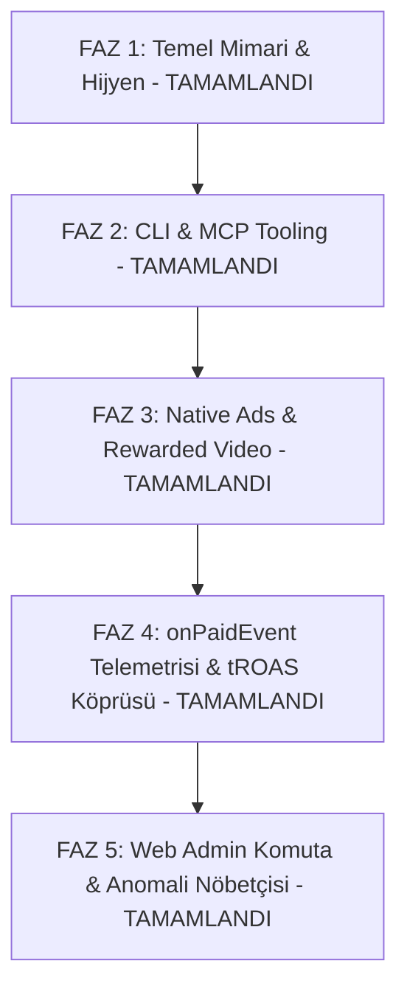

# 🚀 FırsatKolik — AdMob Gelir & Monetizasyon Master Yol Haritası (Monetization Master Roadmap)

**Sürüm:** v2.0.0 (Master Architecture & Autonomous Tooling Release)  
**Tarih:** 25 Eylül 2026  
**Kapsam:** Android & iOS (Dev & Prod) AdMob Monetizasyonu, eCPM / Fill Rate Optimizasyonu, CLI & MCP Entegrasyonu, Gelir Çeşitlendirme, Telemetri ve Marketing ROAS Köprüsü  
**Sorumlu Agent:** `firsatkolik-admob-monetization`  
**Yayıncı (Publisher ID):** `pub-6853997017739651`

---

## 🧭 1. Vizyon, Kuzey Yıldızı Metrikleri & Birim Ekonomi Matematiği (Unit Economics)

FırsatKolik'in finansal başarısı ve kârlılığı iki temel gelir akışının sinerjisine dayanır:
1. **Affiliate (Gelir Ortaklığı):** Kullanıcının mağazaya yönlenip sipariş vermesi (Dönüşüm döngüsü: 1-7 gün).
2. **AdMob Monetizasyon (Uygulama İçi Reklam):** Kullanıcının içerik tüketirken, arama yaparken ve kupon kopyalarken ürettiği anlık reklam geliri (Döngü: Anlık nakit akışı).

### 🎯 Kuzey Yıldızı Metrikleri:

```
┌─────────────────────────────────────────────────────────────────────────────┐
│                      MONETİZASYON HEDEF METRİKLERİ                          │
├───────────────────────────────┬─────────────────────────────────────────────┤
│ Hedef Ortalama eCPM (TR)      │ ₺75.00 - ₺140.00 ($2.30 - $4.30)            │
│ Hedef Native eCPM (TR)        │ ₺95.00 - ₺180.00 ($3.00 - $5.50)            │
│ Hedef Rewarded eCPM           │ ₺250.00 - ₺450.00 ($7.50 - $14.00)          │
│ Hedef Native Doluluk (Fill)   │ %94+                                        │
│ Hedef LTV / CAC Oranı         │ > 2.5x (Edinme maliyetinin 2.5 katı gelir)  │
│ Hedef Günlük Reklam Net Kârı  │ Pozitif ROI (%100+ Kârlılık)                │
└───────────────────────────────┴─────────────────────────────────────────────┘
```

### 📐 Finansal ve Birim Ekonomi Formülleri:
$$\text{Günlük Net Kâr} = (\text{AdMob Geliri} + \text{Affiliate Geliri}) - \text{Marketing Reklam Harcaması (CPI \times İndirme)}$$
$$\text{LTV (Kullanıcı Ömür Boyu Değeri)} = \text{ARPU (Aylık Reklam + Komisyon)} \times \text{Kullanıcı Kalma Süresi (Retention - Ay)}$$
$$\text{tROAS} = \frac{\text{AdMob onPaidEvent Geliri}}{\text{Google Ads Kullanıcı Edinme Harcaması}} \times 100$$

---

## 🔑 2. Master AdMob Kimlikleri & Platform/Ortam Envanteri (Master Registry)

Tüm platform ve ortamlarda kullanılan resmi AdMob kimlikleri tek bir merkezi matriste sabitlenmiştir:

| Platform & Ortam | Durum | AdMob App ID (Uygulama Kimliği) | Native Ad Unit ID (Faz 3.3 Akış) | Banner Ad Unit ID (Eski/Arşiv) | Tanımlandığı Yer |
| :--- | :--- | :--- | :--- | :--- | :--- |
| **Android DEV** | Test | `ca-app-pub-3940256099942544~3347511713` | `ca-app-pub-3940256099942544/2247696110` | `ca-app-pub-3940256099942544/6300978111` | `build.gradle` (`dev` flavor) & `firebase_options.dart` |
| **Android PROD** | **Canlı (Gerçek)** | `ca-app-pub-6853997017739651~8861215767` | `ca-app-pub-6853997017739651/4004866134` | `ca-app-pub-6853997017739651/8758625050` *(Arşiv)* | `build.gradle` (`prod` flavor) & `firebase_options.dart` |
| **iOS DEV** | Test | `ca-app-pub-3940256099942544~1458002511` | `ca-app-pub-3940256099942544/3986624511` | `ca-app-pub-3940256099942544/2934735716` | `firebase_options.dart` (Dev Fallback) |
| **iOS PROD** | **Canlı (Gerçek)** | `ca-app-pub-6853997017739651~7339420575` | `ca-app-pub-6853997017739651/9437070495` | `ca-app-pub-6853997017739651/2039078155` *(Arşiv)* | `ios/Runner/Info.plist` & `firebase_options.dart` |

### Format Bazlı Resmi Yedek & Test Birimleri:
* **Android Test Native:** `ca-app-pub-3940256099942544/2247696110`
* **iOS Test Native:** `ca-app-pub-3940256099942544/3986624511`
* **Android Test Rewarded:** `ca-app-pub-3940256099942544/5224354917`
* **iOS Test Rewarded:** `ca-app-pub-3940256099942544/1712485313`

---

## 🛠️ 3. Otonom CLI & MCP Tooling Mimarisi

AdMob mimarisi hem terminalden insan komutlarıyla hem de Antigravity AI Agent'ları tarafından otonom olarak kontrol edilebilecek çift katmanlı bir araç setine sahiptir:

```
┌─────────────────────────────────────────────────────────────────────────────┐
│                    OTONOM ADMOB YÖNETİM MİMARİSİ                            │
├─────────────────────────────────────────────────────────────────────────────┤
│ 1. CLI ENGINE: monetization-assets/scripts/admob_cli.py                     │
│    • status, report, inspect, units, policy-check, net-profit               │
│                                                                             │
│ 2. MCP SERVER: monetization-assets/scripts/admob_mcp_server.py              │
│    • Model Context Protocol (stdio JSON-RPC 2.0)                            │
│    • Server: 'admob-orchestrator'                                           │
│    • Configs: .agents/mcp_config.json & IDE mcp directory                   │
│                                                                             │
│ 3. MOBİL İSTEMCİ MOTORU: lib/services/ad_manager_service.dart               │
│    • 25s Anti-Spam Cooldown, onPaidEvent GA4 Telemetry                      │
│    • Acil Durum Reklam Şalteri (Kill-Switch)                                │
└─────────────────────────────────────────────────────────────────────────────┘
```

### 3.1. CLI Komut Referans Tablosu (`admob_cli.py`)

| Komut | Parametreler & Bayraklar | Açıklama | Örnek Komut |
| :--- | :--- | :--- | :--- |
| **`status`** | `--platform (all\|android\|ios)`<br>`--env (all\|dev\|prod)` | Tüm platform ve ortamların anlık sağlık, birim ID ve Kill-Switch durumunu döner. | `python monetization-assets/scripts/admob_cli.py status --platform all --env prod` |
| **`report`** | `--days <N>`<br>`--platform (all\|android\|ios)`<br>`--env (all\|dev\|prod)`<br>`--format (all\|native\|rewarded)` | Gün, platform ve formata göre eCPM, gösterim, tıklama ve tahmini gelir analiz raporu üretir. | `python monetization-assets/scripts/admob_cli.py report --days 7 --platform ios` |
| **`inspect`** | Yok | `build.gradle`, `AndroidManifest.xml`, `Info.plist`, `firebase_options.dart` ve `home_screen.dart` dosyalarını statik denetleyip kod ve kimlik uyumunu doğrular. | `python monetization-assets/scripts/admob_cli.py inspect` |
| **`units`** | `--platform (all\|android\|ios)`<br>`--env (all\|dev\|prod)` | Sisteme kayıtlı tüm reklam birimlerinin tam envanterini (ID, Format, Test/Canlı) listeler. | `python monetization-assets/scripts/admob_cli.py units --platform android --env prod` |
| **`policy-check`** | Yok | `FittedBox` ölçekleme ihlali ve `onPaidEvent` telemetri eksikliği denetimi yapar. | `python monetization-assets/scripts/admob_cli.py policy-check` |
| **`net-profit`** | `--ad-spend <X>`<br>`--admob-rev <Y>`<br>`--affiliate-rev <Z>` | Pazarlama harcaması ile AdMob ve affiliate gelirlerini karşılaştırıp kârlılık karnesi çıkarır. | `python monetization-assets/scripts/admob_cli.py net-profit --ad-spend 200 --admob-rev 110 --affiliate-rev 290` |

### 3.2. MCP Server Araç Kataloğu (`admob-orchestrator`)

Antigravity AI Agent'larının doğrudan `call_mcp_tool` veya doğal dil üzerinden çağırabildiği 6 araç:
1. `admob_get_status`: Platform, ortam ve Kill-Switch sağlık denetimi.
2. `admob_get_report`: Çok boyutlu performans ve eCPM raporlama.
3. `admob_inspect_configs`: Proje dosyalarında statik kod ve kimlik denetimi.
4. `admob_list_units`: Reklam birimleri envanteri sorgulama.
5. `admob_verify_policy`: Google AdMob uyumluluk denetimi.
6. `admob_calculate_net_profit`: Finansal kârlılık ve ROI hesabı.

---

## 📅 4. FırsatKolik Monetizasyon Başyapıtı: Master Mimari ve Yol Haritası



> [!IMPORTANT]
> **FırsatKolik Monetizasyon Başyapıtı İlkesi (Monetization Masterpiece):**  
> FırsatKolik, e-ticaret kullanıcı deneyimini (UX), kullanıcı sadakatini (Retention) ve affiliate (gelir ortaklığı) dönüşüm oranlarını korumak adına **"Altın Oran"** reklam stratejisini benimser. Kullanıcıları mağazaya giderken öfkelendiren ve yüksek komisyonlu alışverişleri baltalayan **Tam Ekran Geçiş Reklamları (Interstitial)**, açılış reklamları (**App Open**) ve uygulamanın indirme boyutunu şişiren karmaşık **Mediation SDK'ları** kod tabanından ve yönetim panellerinden tamamen temizlenmiştir.

---

### FAZ 1: Temel Mimari, Hijyen ve Politika Uyumu (✅ TAMAMLANDI)
* **Android Manifest & Flavor Ayrımı:** `dev` ortamına resmi Google test App ID'si, `prod` ortamına gerçek App ID `manifestPlaceholders` ile enjekte edildi.
* **iOS Prod App ID & Banner Entegrasyonu:** `Info.plist` içine `ca-app-pub-6853997017739651~7339420575`, `firebase_options.dart` içine `ca-app-pub-6853997017739651/2039078155` tanımlandı.
* **4 Boyutlu ID Matrisi (`firebase_options.dart`):** Android Dev/Prod ve iOS Dev/Prod ayrımı yapılarak iOS prod derlemesinde Android ID çağrılma riski sıfırlandı.
* **FittedBox Politika İhlali İptali:** İki sütunlu grid hücresine 300x250 banner küçültme ihlali kaldırıldı; yerini organik akış içi Native Ads şeritlerine bıraktı.
* **Merkezi `AdManagerService`:** Singleton mimari, 25 saniyelik hata soğuması (cooldown), bellek önbellekleme ve genel şalter (Kill-Switch) kuruldu.
* **Doğrulama:** 18/18 Flutter test passed, `flutter analyze` 0 hata.

---

### FAZ 2: Otonom CLI & MCP Server Entegrasyonu (✅ TAMAMLANDI)
* **Gelişmiş CLI Motoru:** `monetization-assets/scripts/admob_cli.py` geliştirilerek `status`, `report`, `inspect`, `units`, `policy-check` ve `net-profit` komutları eklendi.
* **MCP Stdio Server:** `monetization-assets/scripts/admob_mcp_server.py` sıfır bağımlılıkla JSON-RPC 2.0 stdio sunucusu olarak inşa edildi.
* **MCP Kaydı:** Workspace (`.agents/mcp_config.json`) ve Global ortamlara `admob-orchestrator` entegre edildi.
* **Doğrulama:** JSON-RPC testleri başarılı, `inspect` 8/8 onay verdi.

---

### FAZ 3: İki Temel Reklam Omurgası — Native Ads & Rewarded Video (✅ TAMAMLANDI)
FırsatKolik'in gelir ve kullanıcı deneyimi dengesini kuran 2 resmi reklam formatı:

* **3.1. Rewarded Ads — Kupon Açma, Akıllı Hibrit Kapı & Oylama Bütünlüğü (✅ TAMAMLANDI):**
  * **Kullanıcı Faydası:** Kullanıcı rızasına dayalı (opt-in), etik ve şeffaf ödüllendirme modeli.
  * **Günlük 2 Ücretsiz Hak:** Her gün giriş yapan her kullanıcıya 2 ücretsiz kupon kopyalama kredisi tanımlanır (`CouponCreditService`). Gece yarısı 00:00'da haklar otomatik yenilenir.
  * **Akıllı Hibrit Kapı (Misafir Dönüşüm Motoru):** Giriş yapmamış misafir kullanıcılar kupon kodlarını kilitli (`🔒`) ve bulanık görür. Tıkladıklarında açılan şık modal ile Google/Apple ile kaydolmaya teşvik edilir ya da 1 video izleyerek kuponu anında açabilir.
  * **+2 Kredi Kazanımı:** Kredisi biten kullanıcı, 1 Rewarded Video izleyerek anında **+2 Kupon Açma Kredisi** kazanır.
  * **Sıfır Frustrasyon & Yüksek Getiri:** Kullanıcı videoyu zorla değil kendi isteğiyle izlediği için öfke sıfırlanır, **$8.00 - $18.00 eCPM** ile en yüksek gelir elde edilir.
* **3.2. Native Ads Advanced — Akış İçi Organik Sponsorlu Kartlar (✅ TAMAMLANDI):**
  * **Anasayfa Akışı (Grid & Liste):** Hem 2 sütunlu grid hem de tek sütunlu liste modlarında her 6 fırsattan sonra tam genişlikte (124dp) Native Ad yatay şeridi yerleştirilir.
  * **Kuponlar Akışı:** Her 4 kupondan sonra (5. sırada) 124dp yatay Small Native Ad yerleştirilir.
  * **Aktüel Kataloglar Akışı:** 2 sütunlu katalog gridinde her 6 broşürden sonra tam genişlikte 124dp Native Ad yerleştirilir.
  * **Popüler Fırsatlar Akışı (Faz 3.4):** Popüler Fırsatlar menüsünde hem Grid hem Liste modunda her 6 fırsattan sonra tam genişlikte 124dp yatay Native Ad şeridi yerleştirilir.
  * **Favori Kategorilerim Akışı (Faz 3.4):** Kaydedilenler sayfası Tab 2 ("Favori Kategorilerim") akışında her 6 fırsattan sonra tam genişlikte 124dp yatay Native Ad yerleştirilir.
  * **Kaydettiklerim Reklamsızlık İzolasyonu (Fair-Play Prensibi):** Kaydedilenler sayfası Tab 1 ("Kaydettiklerim") kullanıcının satın alma niyetinin en yüksek olduğu şahsi listesidir. Bu sekme **%100 reklamsız** bırakılarak affiliate dönüşüm kayıpları ve kullanıcı terkleri kalıcı olarak engellenmiştir.
  * **Sıfır İhlal & Sıfır Boşluk (House Promo Fallback):** Reklam dolmadığında veya şalter kapalıyken anında yüksek dönüşümlü Kuponlar Keşif Kartı devreye girer.
  * **PlatformView Donma Koruması:** `RepaintBoundary` katman kilitleri kaldırılmış, Android `SurfaceTexture` ilk karesini sorunsuz üreten dünya standardı mimari kurulmuştur.

---

### FAZ 4: Telemetri & Google Ads UAC tROAS Köprüsü (✅ KOD TAMAMLANDI)
* **onPaidEvent Telemetri Otomasyonu:** Gösterilen her Native ve Rewarded reklamın ürettiği değer (`valueMicros`, `currencyCode`) `AnalyticsService.logAdImpression` üzerinden GA4 `ad_impression` olayı olarak kaydedilir.
* **Google Ads tROAS Akıllı Teklif Entegrasyonu:** Kod tarafı hazırdır; canlıya çıkışta Firebase Console ile Google Ads hesabı birbirine bağlanarak reklam bütçesi yüksek AdMob LTV'si üreten kullanıcılara hedeflenecektir.

---

### FAZ 5: Web Admin Komuta Merkezi, Kill-Switch & Güvenlik (✅ TAMAMLANDI)
* **Web Admin Canlı Kontrol:** [`web/admin`](file:///d:/firsatkolik/web/admin/admob_manager.js) paneli üzerinden acil durum Kill-Switch'i, format şalterleri (Native Anasayfa, Kuponlar, Aktüel, Popüler Fırsatlar, Favori Kategorilerim, Rewarded) ve reklam sıklıkları anlık yönetilir.
* **Anti-Spam Cooldown:** 25 saniyelik hata soğuma süresiyle AdMob hesap banı ve kısıtlamaları engellenir.
* **10/10 Statik Kod Denetimi (Inspect):** `python admob_cli.py inspect` ve Web Admin Inspection sekmesinde 10 kontrol noktası %100 başarıyla onaylanır.


---

## 🕹️ 5. Komutlarla Anlık Veri Erişimi Rehberi (Cheatsheet)

Hem siz hem de AI Agent aşağıdaki komutları kullanarak dilediğiniz an tüm verilere ulaşabilirsiniz:

```bash
# 1. Genel Durum ve Sağlık Karnesi (Android & iOS, Dev & Prod)
python monetization-assets/scripts/admob_cli.py status

# 2. Sadece iOS Prod Durumu
python monetization-assets/scripts/admob_cli.py status --platform ios --env prod

# 3. Son 7 Günlük Detaylı Gelir ve eCPM Raporu
python monetization-assets/scripts/admob_cli.py report --days 7

# 4. Kod Tabanı Statik Konfigürasyon Denetimi (5 Kritik Nokta)
python monetization-assets/scripts/admob_cli.py inspect

# 5. AdMob Politika ve UI Güvenlik Denetimi
python monetization-assets/scripts/admob_cli.py policy-check

# 6. Tüm Reklam Birimleri Envanteri
python monetization-assets/scripts/admob_cli.py units

# 7. Net Kârlılık ve ROI Analizi (Marketing vs AdMob)
python monetization-assets/scripts/admob_cli.py net-profit --ad-spend 200 --admob-rev 110 --affiliate-rev 290
```

---

## 🎯 6. Çift Katmanlı Operasyonel Yol Haritası (Dual Execution Roadmap)

Uygulamanın mevcut aşaması (henüz mağazada olmaması) göz önüne alınarak süreç iki ayrı ve net operasyonel aşamaya bölünmüştür:

---

### 📱 6.1. YOL HARİTASI 1: ŞU AN — Test Cihazında Doğrulama (Pre-Release Test Aşaması)

> [!NOTE]
> Uygulama henüz Google Play Store veya Apple App Store'da yayında olmadığı için `app-ads.txt` doğrulaması veya mağaza bağlantısı **şu an testinizi engellemez ve zorunlu değildir**.

#### 🅰️ 1. Seçenek (En Hızlı ve Risksiz — Önerilen):
AdMob konsoluna girmeden, kodumuzdaki resmi Google test kimlikleriyle cihazda anında doğrulama:
* **Çalıştırma Komutu:**
  ```bash
  flutter run --flavor dev --dart-define=FLAVOR=dev -d <cihaz_id>
  ```
* **Güvenlik & Davranış:**
  * `firebase_options.dart` dev modda otomatik olarak Google'ın resmi genel test reklamlarını çağırır (Android: `2247696110`, iOS: `3986624511`).
  * Kart üzerinde **"Test Ad"** filigranı görünür; tıklasanız bile hesabınız ceza almaz.
* **Test Edilecek Noktalar:**
  1. **Anasayfa Grid Modu:** 2 sütunlu dikey akışta `TemplateType.medium` sponsorlu keşif kartının tasarımı (başlık, görsel, CTA butonu).
  2. **Anasayfa Liste Modu:** Yatay liste akışında `TemplateType.small` sponsorlu kartın hizalaması.
  3. **Kuponlar Sayfası (Rewarded):** Günlük 2 hak bitince video izleyip **+2 Hak** kazanma akışı ve misafir kullanıcıların tekil kupon açma diyaloğu.

#### 🅱️ 2. Seçenek (Yeni Oluşturulan Gerçek ID'leri Test Cihazında Doğrulama):
*"Yeni açtığım `4004866134` / `9437070495` kimliklerimin telefonumda çalıştığını görmek istiyorum"* diyorsanız:
1. **Telefonun Reklam Kimliğini (GAID / IDFA) Alın:**
   * **Android:** *Ayarlar > Google > Reklamlar (Ads)* bölümüne gidin. En altta **"Reklam Kimliği"** yazar (Örn: `38400000-8cf0-11bd-b23e-10b96e40000d`).
   * **iOS:** *Ayarlar > Gizlilik ve Güvenlik > Takip Etme* veya Xcode loglarında çıkan cihaz IDFA kodu.
2. **AdMob Konsoluna Ekleyin:**
   * [Google AdMob Konsolu](https://admob.google.com) > **Ayarlar** > **Test Cihazları** > **Test Cihazı Ekle**.
   * Telefonunuza bir isim verin (Örn: *FırsatKolik Test Cihazı*), platformu seçin ve Reklam Kimliğini girip kaydedin.
3. **PROD Modunda Çalıştırın:**
   ```bash
   flutter run --flavor prod --dart-define=FLAVOR=prod -d <cihaz_id>
   ```
   * *Sonuç:* Gerçek reklam birimi çağrılır; ancak Google cihazınızı tanıdığı için reklamın üzerinde güvenli "Test Mode" filigranı gösterilir ve geçersiz tıklama cezası riski sıfırlanır.

---

### 🚀 6.2. YOL HARİTASI 2: CANLIYA ÇIKIŞ — Mağaza Yayını (Store Release Aşaması)

Uygulama Google Play Console ve App Store Connect'e yüklendiği ve mağazada onay aldığı zaman uygulanacak adımlar:

| Sıra | Operasyonel Adım | Ne Zaman Yapılır? | Nasıl Yapılır? / Açıklama |
| :---: | :--- | :--- | :--- |
| **01** | **PROD Paket Derleme** | Mağazaya yükleme anı | **Android AAB:** `flutter build appbundle --flavor prod --dart-define=FLAVOR=prod`<br>**iOS IPA:** `flutter build ipa --flavor prod --dart-define=FLAVOR=prod` |
| **02** | **`app-ads.txt` Yayını** | Mağazaya yükleme anı | `firsatkolik.app/app-ads.txt` dosyasının web sitenizde yayında olduğu teyit edilir:<br>`google.com, pub-6853997017739651, DIRECT, f08c47fec0942fa0` |
| **03** | **Mağaza Bağlantısı (Link App)** | Mağazada onaylandığı gün | AdMob Konsolu > *Uygulamalar* > *Uygulama Ayarları* > *Uygulama Mağazaları* sekmesinden FırsatKolik Play Store ve App Store linkleri aranıp bağlanır. (Doluluk oranını %95+'e çıkarır). |
| **04** | **Web Admin Şalter Kontrolü** | Canlıya çıkış anı | [`web/admin`](file:///d:/firsatkolik/web/admin/admob_manager.js) panelinden reklam şalterinin açık ve Kill-Switch'in kapalı olduğu doğrulanır. |
| **05** | **İlk 48 Saat Telemetri Takibi** | Yayından sonraki 2 gün | Firebase Analytics ve AdMob raporları üzerinden `onPaidEvent` mikro-sent telemetrisi ve eCPM akışı takip edilir. |


