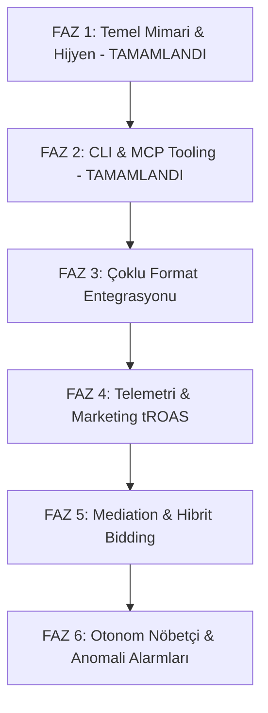

# 🚀 FırsatKolik — AdMob Gelir & Monetizasyon Master Yol Haritası (Monetization Master Roadmap)

**Sürüm:** v2.0.0 (Master Architecture & Autonomous Tooling Release)  
**Tarih:** 25 Eylül 2026  
**Kapsam:** Android & iOS (Dev & Prod) AdMob Monetizasyonu, eCPM / Fill Rate Optimizasyonu, CLI & MCP Entegrasyonu, Gelir Çeşitlendirme, Telemetri ve Marketing ROAS Köprüsü  
**Sorumlu Agent:** `firsatkolik-admob-monetization`  
**Yayıncı (Publisher ID):** `pub-6853997017739651`

---

## 🧭 1. Vizyon, Kuzey Yıldızı Metrikleri & Birim Ekonomi Matematiği (Unit Economics)

FırsatKolik'in finansal başarısı ve kârlılığı iki temel gelir akışının sinerjisine dayanır:
1. **Affiliate (Gelir Ortaklığı):** Kullanıcının mağazaya yönlenip sipariş vermesi (Dönüşüm döngüsü: 1-7 gün).
2. **AdMob Monetizasyon (Uygulama İçi Reklam):** Kullanıcının içerik tüketirken, arama yaparken ve kupon kopyalarken ürettiği anlık reklam geliri (Döngü: Anlık nakit akışı).

### 🎯 Kuzey Yıldızı Metrikleri:

```
┌─────────────────────────────────────────────────────────────────────────────┐
│                      MONETİZASYON HEDEF METRİKLERİ                          │
├───────────────────────────────┬─────────────────────────────────────────────┤
│ Hedef Ortalama eCPM (TR)      │ ₺75.00 - ₺140.00 ($2.30 - $4.30)            │
│ Hedef Banner Doluluk (Fill)   │ %92+                                        │
│ Hedef Interstitial eCPM       │ ₺180.00 - ₺320.00 ($5.50 - $10.00)          │
│ Hedef Rewarded eCPM           │ ₺250.00 - ₺450.00 ($7.50 - $14.00)          │
│ Hedef LTV / CAC Oranı         │ > 2.5x (Edinme maliyetinin 2.5 katı gelir)  │
│ Hedef Günlük Reklam Net Kârı  │ Pozitif ROI (%100+ Kârlılık)                │
└───────────────────────────────┴─────────────────────────────────────────────┘
```

### 📐 Finansal ve Birim Ekonomi Formülleri:
$$\text{Günlük Net Kâr} = (\text{AdMob Geliri} + \text{Affiliate Geliri}) - \text{Marketing Reklam Harcaması (CPI \times İndirme)}$$
$$\text{LTV (Kullanıcı Ömür Boyu Değeri)} = \text{ARPU (Aylık Reklam + Komisyon)} \times \text{Kullanıcı Kalma Süresi (Retention - Ay)}$$
$$\text{tROAS} = \frac{\text{AdMob onPaidEvent Geliri}}{\text{Google Ads Kullanıcı Edinme Harcaması}} \times 100$$

---

## 🔑 2. Master AdMob Kimlikleri & Platform/Ortam Envanteri (Master Registry)

Tüm platform ve ortamlarda kullanılan resmi AdMob kimlikleri tek bir merkezi matriste sabitlenmiştir:

| Platform & Ortam | Durum | AdMob App ID (Uygulama Kimliği) | Banner Ad Unit ID (Reklam Birimi) | Tanımlandığı Yer |
| :--- | :--- | :--- | :--- | :--- |
| **Android DEV** | Test | `ca-app-pub-3940256099942544~3347511713` | `ca-app-pub-3940256099942544/6300978111` | `build.gradle` (`dev` flavor) & `firebase_options.dart` |
| **Android PROD** | **Canlı (Gerçek)** | `ca-app-pub-6853997017739651~8861215767` | `ca-app-pub-6853997017739651/8758625050` | `build.gradle` (`prod` flavor) & `firebase_options.dart` |
| **iOS DEV** | Test | `ca-app-pub-3940256099942544~1458002511` | `ca-app-pub-3940256099942544/2934735716` | `firebase_options.dart` (Dev Fallback) |
| **iOS PROD** | **Canlı (Gerçek)** | `ca-app-pub-6853997017739651~7339420575` | `ca-app-pub-6853997017739651/2039078155` | `ios/Runner/Info.plist` & `firebase_options.dart` |

### Format Bazlı Resmi Yedek & Test Birimleri:
* **Android Test Interstitial:** `ca-app-pub-3940256099942544/1033173712`
* **iOS Test Interstitial:** `ca-app-pub-3940256099942544/4411468910`
* **Android Test Native:** `ca-app-pub-3940256099942544/2247696110`
* **iOS Test Native:** `ca-app-pub-3940256099942544/3986624511`
* **Android Test Rewarded:** `ca-app-pub-3940256099942544/5224354917`
* **iOS Test Rewarded:** `ca-app-pub-3940256099942544/1712485313`

---

## 🛠️ 3. Otonom CLI & MCP Tooling Mimarisi

AdMob mimarisi hem terminalden insan komutlarıyla hem de Antigravity AI Agent'ları tarafından otonom olarak kontrol edilebilecek çift katmanlı bir araç setine sahiptir:

```
┌─────────────────────────────────────────────────────────────────────────────┐
│                    OTONOM ADMOB YÖNETİM MİMARİSİ                            │
├─────────────────────────────────────────────────────────────────────────────┤
│ 1. CLI ENGINE: monetization-assets/scripts/admob_cli.py                     │
│    • status, report, inspect, units, policy-check, net-profit               │
│                                                                             │
│ 2. MCP SERVER: monetization-assets/scripts/admob_mcp_server.py              │
│    • Model Context Protocol (stdio JSON-RPC 2.0)                            │
│    • Server: 'admob-orchestrator'                                           │
│    • Configs: .agents/mcp_config.json & IDE mcp directory                   │
│                                                                             │
│ 3. MOBİL İSTEMCİ MOTORU: lib/services/ad_manager_service.dart               │
│    • 25s Anti-Spam Cooldown, 3m Frequency Capping, onPaidEvent GA4 Telemetry│
│    • Acil Durum Reklam Şalteri (Kill-Switch)                                │
└─────────────────────────────────────────────────────────────────────────────┘
```

### 3.1. CLI Komut Referans Tablosu (`admob_cli.py`)

| Komut | Parametreler & Bayraklar | Açıklama | Örnek Komut |
| :--- | :--- | :--- | :--- |
| **`status`** | `--platform (all\|android\|ios)`<br>`--env (all\|dev\|prod)` | Tüm platform ve ortamların anlık sağlık, birim ID ve Kill-Switch durumunu döner. | `python monetization-assets/scripts/admob_cli.py status --platform all --env prod` |
| **`report`** | `--days <N>`<br>`--platform (all\|android\|ios)`<br>`--env (all\|dev\|prod)`<br>`--format (all\|banner\|interstitial\|native)` | Gün, platform ve formata göre eCPM, gösterim, tıklama ve tahmini gelir analiz raporu üretir. | `python monetization-assets/scripts/admob_cli.py report --days 7 --platform ios` |
| **`inspect`** | Yok | `build.gradle`, `AndroidManifest.xml`, `Info.plist` ve `firebase_options.dart` dosyalarını statik denetleyip eksik/hatalı ID testini doğrular. | `python monetization-assets/scripts/admob_cli.py inspect` |
| **`units`** | `--platform (all\|android\|ios)`<br>`--env (all\|dev\|prod)` | Sisteme kayıtlı tüm reklam birimlerinin tam envanterini (ID, Format, Test/Canlı) listeler. | `python monetization-assets/scripts/admob_cli.py units --platform android --env prod` |
| **`policy-check`** | Yok | `FittedBox` ölçekleme ihlali ve `onPaidEvent` telemetri eksikliği denetimi yapar. | `python monetization-assets/scripts/admob_cli.py policy-check` |
| **`net-profit`** | `--ad-spend <X>`<br>`--admob-rev <Y>`<br>`--affiliate-rev <Z>` | Pazarlama harcaması ile AdMob ve affiliate gelirlerini karşılaştırıp kârlılık karnesi çıkarır. | `python monetization-assets/scripts/admob_cli.py net-profit --ad-spend 200 --admob-rev 110 --affiliate-rev 290` |

### 3.2. MCP Server Araç Kataloğu (`admob-orchestrator`)

Antigravity AI Agent'larının doğrudan `call_mcp_tool` veya doğal dil üzerinden çağırabildiği 6 araç:
1. `admob_get_status`: Platform, ortam ve Kill-Switch sağlık denetimi.
2. `admob_get_report`: Çok boyutlu performans ve eCPM raporlama.
3. `admob_inspect_configs`: Proje dosyalarında statik kod ve kimlik denetimi.
4. `admob_list_units`: Reklam birimleri envanteri sorgulama.
5. `admob_verify_policy`: Google AdMob uyumluluk denetimi.
6. `admob_calculate_net_profit`: Finansal kârlılık ve ROI hesabı.

---

## 📅 4. Detaylı 6 Fazlı Master Yol Haritası



---

### FAZ 1: Temel Mimari, Hijyen ve Politika Uyumu (✅ TAMAMLANDI)
* **Android Manifest & Flavor Ayrımı:** `dev` ortamına resmi Google test App ID'si, `prod` ortamına gerçek App ID `manifestPlaceholders` ile enjekte edildi.
* **iOS Prod App ID & Banner Entegrasyonu:** `Info.plist` içine `ca-app-pub-6853997017739651~7339420575`, `firebase_options.dart` içine `ca-app-pub-6853997017739651/2039078155` tanımlandı.
* **4 Boyutlu ID Matrisi (`firebase_options.dart`):** Android Dev/Prod ve iOS Dev/Prod ayrımı yapılarak iOS prod derlemesinde Android ID çağrılma riski sıfırlandı.
* **FittedBox Politika İhlali İptali:** İki sütunlu grid hücresine 300x250 banner küçültme ihlali kaldırıldı; grid içerisine sponsorlu keşif kartı, liste moduna standart `largeBanner` entegre edildi.
* **Merkezi `AdManagerService`:** Singleton mimari, 25 saniyelik hata soğuması (cooldown), bellek önbellekleme ve genel şalter (Kill-Switch) kuruldu.
* **Doğrulama:** 18/18 Flutter test passed, `flutter analyze` 0 hata.

---

### FAZ 2: Otonom CLI & MCP Server Entegrasyonu (✅ TAMAMLANDI)
* **Gelişmiş CLI Motoru:** `monetization-assets/scripts/admob_cli.py` geliştirilerek `status`, `report`, `inspect`, `units`, `policy-check` ve `net-profit` komutları eklendi.
* **MCP Stdio Server:** `monetization-assets/scripts/admob_mcp_server.py` sıfır bağımlılıkla JSON-RPC 2.0 stdio sunucusu olarak inşa edildi.
* **MCP Kaydı:**
  * Workspace: `.agents/mcp_config.json` içine `admob-orchestrator` kaydedildi.
  * Global: `C:\Users\murat\.gemini\config\mcp_config.json` içine eklendi.
  * IDE Schemas: `C:\Users\murat\.gemini\antigravity-ide\mcp\admob-orchestrator\` altında 6 adet `.json` şema dosyası oluşturuldu.
* **Doğrulama:** JSON-RPC testleri başarılı, `inspect` 5/5 onay verdi.

---

### FAZ 3: Çoklu Reklam Formatlarının Uygulama İçi Entegrasyonu (🛠️ GELİŞTİRİLİYOR)
Uygulamanın gelirini 4 katına çıkaracak yüksek eCPM'li formatların entegrasyonu:

* **3.1. Rewarded Ads — Kupon Açma, Akıllı Hibrit Kapı & Oylama Bütünlüğü (✅ TAMAMLANDI):**
  * **Kullanıcı Faydası:** Kullanıcı rızasına dayalı (opt-in), etik ve şeffaf ödüllendirme modeli.
  * **Günlük 2 Ücretsiz Hak:** Her gün giriş yapan her kullanıcıya 2 ücretsiz kupon kopyalama kredisi tanımlanır (`CouponCreditService`). Gece yarısı 00:00'da haklar otomatik yenilenir.
  * **Akıllı Hibrit Kapı (Öneri A — Misafir Dönüşüm Motoru):** Giriş yapmamış misafir kullanıcılar kupon kodlarını kilitli (`🔒`) ve bulanık görür. Tıkladıklarında açılan şık bottom sheet ile:
    1. *Önerilen:* Google / Apple ile giriş yaparak günlük 2 kuponu tamamen **ÜCRETSİZ** açma imkanı kazanır (üyeliğe teşvik).
    2. *Alternatif:* Kaydolmak istemeyen kullanıcı tekil 1 sponsor videosu (Rewarded Ad) izleyerek yalnızca o kuponu açabilir (`unlockCouponForGuest`).
  * **4 Durumlu Kupon Kutusu (4-State Architecture):**
    1. Açılmış kupon: Düz metin kod + Kopyala ikonu
    2. Misafir: Bulanık kod + Kilit ikonu (Hibrit modal açar)
    3. Hak sahibi üye: Bulanık kod + `🎟️ Aç` çipi (1 kredi harcar)
    4. Hakkı biten üye: Bulanık kod + `🎬 +2 Hak` çipi (Rewarded modal açar)
  * **Açılan Kupon Koruması:** Gün içinde kilidi açılan bir kupon (üye veya video izleyen misafir), tekrar kopyalandığında ek kredi/reklam talep etmez (`isUnlockedToday`).
  * **+2 Kredi Kazanımı:** Kredisi biten kullanıcı, şık `_showCreditDepletedBottomSheet` üzerinden 1 Rewarded Video izleyerek anında **+2 Kupon Açma Kredisi** kazanır.
  * **Fail-Safe Fallback:** Reklam ağı doluluk (fill rate) veya gecikme nedeniyle video yükleyemezse kullanıcı bekletilmez/cezalandırılmaz; kupon "🎁 Hediye Kupon Açıldı" olarak anında açılır.
  * **Anti-Exploit ve Oylama Bütünlüğü:** Kullanıcıların yeni hak kazanmak için çalışan kuponlara sahte soğuk oy vererek sistemi suistimal etmesini (exploit) ve sonsuz bedava hak döngüsünü engellemek için oy karşılığı hak iadesi verilmez. Hak kazanımı şeffaf bir şekilde yalnızca Rewarded Video (+2) üzerinden sağlanır.
  * **AppBar Canlı Kredi Rozeti:** Kuponlar sayfasında giriş yapanlar için `🎟️ 2 Hak` / `🎟️ +2 Hak Al`, misafirler içinse `🎁 2 Hediye Hak` rozeti yer alır.
  * **Doğrulama:** `test/coupon_credit_service_test.dart` (9/9 unit test passed, `test/admob_monetization_test.dart` 5/5, `test/ios_compatibility_test.dart` 13/13; toplam 27/27 test passed, `flutter analyze` 0 hata).
* **3.2. Interstitial (Geçiş Reklamı) — (🛠️ SIRADAKİ ADIM):**
  * **Tetikleyici:** Kullanıcı fırsat detayından "Fırsata Git" (Dış mağaza bağlantısı) butonuna tıkladığında.
  * **Frekans Kontrolü:** Kullanıcıyı sıkmamak için katı kural: **3 dakikada maksimum 1 gösterim** (`AdManagerService.canShowInterstitial`).
  * **Önyükleme:** Reklam gösterilmeden önce arka planda sessizce hazır bekletilir (`preloadInterstitial`).
* **3.3. Native Ads Advanced (Yerel Akış Reklamları):**
  * **Entegrasyon:** Ana sayfa fırsat akışında `DealCard` ile birebir aynı yazı tipi, gölge ve köşe yuvarlatmasına sahip şık sponsorlu kartlar.
* **3.4. App Open Ads (Uygulama Açılış Reklamı):**
  * **Senaryo:** Uygulama arka plandan öne getirildiğinde (cold start harici, 4 saatten taze ise) anlık gösterim.

---

### FAZ 4: Telemetri, BigQuery & Google Ads UAC tROAS Köprüsü
* **4.1. onPaidEvent Telemetri Otomasyonu:**
  * Her gösterilen reklamın kazandırdığı değer (`valueMicros`, `currencyCode`) `AnalyticsService.logAdImpression` üzerinden Firebase Analytics'e iletilir.
* **4.2. Google Ads tROAS Akıllı Teklif Entegrasyonu:**
  * Firebase ile Google Ads hesabı birbirine bağlanır.
  * Pazarlama Agent'ımızın Google Ads üzerinde yürüttüğü App Campaign (UAC), AdMob'dan gelen kullanıcı bazlı gelir verisini okuyarak tekliflerini yüksek gelir getiren kullanıcılara odaklar.

---

### FAZ 5: AdMob Mediation & Reklam Ağı Arabuluculuğu
* Google AdMob envanterine ek olarak doluluk oranını ve eCPM rekabetini artırmak için waterfall/bidding ağları eklenir:
  * **AppLovin (MAX):** Mobil oyun ve e-ticaret kullanıcılarında yüksek eCPM.
  * **Meta Audience Network:** Instagram/Facebook reklamverenlerinin bütçesini çeker.
  * **Unity Ads:** Video ve geçiş reklamlarında yüksek doluluk.

---

### FAZ 6: Otonom Agent Nöbetçisi & Anomali Alarmları
* **Otonom İzleme:** Günlük eCPM ve doluluk oranları arka planda taranır.
* **Anomali Kuralı:** Eğer doluluk oranı %85 altına düşerse veya beklenmedik bir hata fırlatılırsa sistem otomatik olarak geliştiriciye bildirim gönderir.
* **Otomatik Acil Durum:** Google AdMob'dan bir politika uyarısı veya kısıtlama geldiğinde uzaktan Kill-Switch açılarak hesabın kapatılması önlenir.

---

## 🕹️ 5. Komutlarla Anlık Veri Erişimi Rehberi (Cheatsheet)

Hem siz hem de AI Agent aşağıdaki komutları kullanarak dilediğiniz an tüm verilere ulaşabilirsiniz:

```bash
# 1. Genel Durum ve Sağlık Karnesi (Android & iOS, Dev & Prod)
python monetization-assets/scripts/admob_cli.py status

# 2. Sadece iOS Prod Durumu
python monetization-assets/scripts/admob_cli.py status --platform ios --env prod

# 3. Son 7 Günlük Detaylı Gelir ve eCPM Raporu
python monetization-assets/scripts/admob_cli.py report --days 7

# 4. Kod Tabanı Statik Konfigürasyon Denetimi (5 Kritik Nokta)
python monetization-assets/scripts/admob_cli.py inspect

# 5. AdMob Politika ve UI Güvenlik Denetimi
python monetization-assets/scripts/admob_cli.py policy-check

# 6. Tüm Reklam Birimleri Envanteri
python monetization-assets/scripts/admob_cli.py units

# 7. Net Kârlılık ve ROI Analizi (Marketing vs AdMob)
python monetization-assets/scripts/admob_cli.py net-profit --ad-spend 200 --admob-rev 110 --affiliate-rev 290
```

---

## 🎯 6. Sıradaki Adım & Manuel Yönlendirmeler

Şimdi **Faz 3 (Çoklu Reklam Formatlarının Entegrasyonu)** aşamasına geçmeye hazırız.

### Yapılması Gerekenler:
1. **AdMob Konsolu (Manuel):**
   * Google AdMob paneline girip FırsatKolik Android ve FırsatKolik iOS uygulamalarınız için birer adet **Interstitial (Geçiş)** reklam birimi ve birer adet **Rewarded (Ödüllü)** reklam birimi oluşturabilirsiniz. (Oluşturulana kadar kod tarafında Google'ın resmi test kimlikleri ile geliştirmeyi eksiksiz tamamlayabiliriz).
2. **Kod Tarafı (Otonom):**
   * `AdManagerService` içine `showInterstitialAdWithFrequencyCap(BuildContext context, VoidCallback onDismissed)` metodunun entegrasyonu.
   * `DealDetailScreen` ("Fırsata Git" butonu) tıklamasında geçiş reklamının devreye sokulması.
   * Kuponlar modülünde VIP kupon kilidi için `RewardedAd` entegrasyonu.
